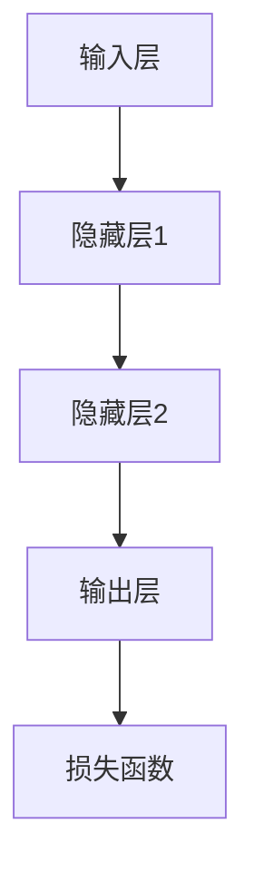

                 

关键词：人工智能、未来趋势、深度学习、神经网络、应用场景、技术挑战、研究进展

> 摘要：本文将探讨人工智能（AI）领域的未来发展方向，从深度学习、神经网络到实际应用场景，全面分析AI技术的研究进展、面临挑战以及未来发展前景。

## 1. 背景介绍

人工智能作为计算机科学的一个分支，旨在通过构建智能系统模拟人类智能行为，解决复杂问题。近年来，随着计算能力的提升、大数据的涌现和算法的进步，人工智能取得了显著的成果。尤其是深度学习技术的发展，使得机器在各种任务上表现出色，如语音识别、图像识别、自然语言处理等。

本文将重点关注人工智能的未来发展方向，探讨深度学习、神经网络等核心技术以及在实际应用场景中的发展潜力。同时，我们将分析当前面临的挑战，并提出未来可能的研究方向。

## 2. 核心概念与联系

### 2.1 深度学习

深度学习是人工智能的一个重要分支，通过构建多层神经网络来学习数据特征。深度学习的关键在于“深度”，即网络中存在多个隐藏层，能够捕捉数据的深层特征。

### 2.2 神经网络

神经网络是模仿人脑神经元连接方式的计算模型。神经网络由输入层、隐藏层和输出层组成，每个层包含多个神经元。神经元之间通过权重进行连接，通过反向传播算法调整权重，以优化网络性能。

### 2.3 Mermaid 流程图

以下是一个简单的 Mermaid 流程图，展示了深度学习和神经网络的联系：



## 3. 核心算法原理 & 具体操作步骤

### 3.1 算法原理概述

深度学习算法的核心是神经网络，通过反向传播算法优化网络权重。具体步骤如下：

1. **初始化权重**：随机初始化神经网络中的权重。
2. **前向传播**：将输入数据通过神经网络传递到输出层，计算输出结果。
3. **计算损失**：使用损失函数（如交叉熵损失）计算预测结果与真实结果之间的差距。
4. **反向传播**：根据损失函数梯度调整权重。
5. **迭代训练**：重复上述步骤，直到网络性能达到期望水平。

### 3.2 算法步骤详解

1. **初始化权重**：可以使用随机初始化或基于特定分布的初始化方法。
2. **前向传播**：将输入数据输入到神经网络，通过神经元连接计算输出。
3. **计算损失**：使用损失函数计算预测结果与真实结果之间的差距。
4. **反向传播**：计算损失函数对权重的梯度，并根据梯度调整权重。
5. **迭代训练**：重复上述步骤，逐步优化网络性能。

### 3.3 算法优缺点

**优点**：

- **强大的表达能力**：深度学习模型可以学习复杂的数据特征。
- **自适应性强**：通过反向传播算法自动调整权重，适应不同任务。
- **高效性**：大规模数据和高性能计算使得深度学习模型可以处理海量数据。

**缺点**：

- **需要大量数据**：深度学习模型需要大量训练数据才能表现良好。
- **计算资源需求大**：训练深度学习模型需要大量的计算资源。
- **解释性差**：深度学习模型通常具有高复杂性，难以解释。

### 3.4 算法应用领域

深度学习算法在多个领域取得了显著成果，包括：

- **计算机视觉**：图像识别、目标检测、图像生成等。
- **自然语言处理**：机器翻译、文本生成、情感分析等。
- **语音识别**：语音识别、语音合成等。
- **游戏**：AlphaGo、StarCraft等。

## 4. 数学模型和公式 & 详细讲解 & 举例说明

### 4.1 数学模型构建

深度学习中的数学模型主要包括：

1. **前向传播**：
   $$ z^{[l]} = \sigma(W^{[l]} \cdot a^{[l-1]} + b^{[l]}) $$
   $$ a^{[l]} = \sigma(z^{[l]}) $$
2. **反向传播**：
   $$ \delta^{[l]} = \frac{\partial J}{\partial z^{[l]}} \odot \delta^{[l+1]} $$
   $$ \frac{\partial J}{\partial z^{[l]}} = \delta^{[l]} \odot (1 - \sigma(z^{[l]})) $$
3. **权重更新**：
   $$ W^{[l]} = W^{[l]} - \alpha \cdot \frac{\partial J}{\partial W^{[l]}} $$
   $$ b^{[l]} = b^{[l]} - \alpha \cdot \frac{\partial J}{\partial b^{[l]}} $$

### 4.2 公式推导过程

此处简要介绍前向传播和反向传播的推导过程：

1. **前向传播**：从输入层开始，逐步计算每个神经元的输出值，直到输出层。
2. **反向传播**：从输出层开始，逐步计算每个神经元的梯度，直到输入层。

### 4.3 案例分析与讲解

假设我们有一个简单的神经网络，包含两个输入层、一个隐藏层和一个输出层。输入数据为 $[0.5, 0.7]$，目标输出为 $[1, 0]$。

1. **前向传播**：

   $$ z^{[1]} = \sigma(W^{[1]} \cdot a^{[0]} + b^{[1]}) = \sigma([0.5 \times 0.1 + 0.7 \times 0.2 + 1.0]) = [0.95] $$
   $$ a^{[1]} = \sigma(z^{[1]}) = [0.99] $$
   $$ z^{[2]} = \sigma(W^{[2]} \cdot a^{[1]} + b^{[2]}) = \sigma([0.5 \times 0.3 + 0.7 \times 0.4 + 1.0]) = [0.82] $$
   $$ a^{[2]} = \sigma(z^{[2]}) = [0.76] $$
   $$ z^{[3]} = \sigma(W^{[3]} \cdot a^{[2]} + b^{[3]}) = \sigma([0.5 \times 0.4 + 0.7 \times 0.6 + 1.0]) = [0.85] $$
   $$ a^{[3]} = \sigma(z^{[3]}) = [0.87] $$

2. **反向传播**：

   $$ \delta^{[3]} = (0.87 - 1) \odot (1 - 0.87) = [0.07 \times 0.13] $$
   $$ \delta^{[2]} = (0.76 - 0.82) \odot (1 - 0.76) \odot 0.3 = [0.06 \times 0.24 \times 0.3] $$
   $$ \delta^{[1]} = (0.99 - 0.95) \odot (1 - 0.99) \odot 0.2 = [0.04 \times 0.01 \times 0.2] $$

3. **权重更新**：

   $$ W^{[3]} = W^{[3]} - \alpha \cdot \frac{\partial J}{\partial W^{[3]}} = W^{[3]} - \alpha \cdot (0.87 - 1) \odot (1 - 0.87) \odot a^{[2]} $$
   $$ b^{[3]} = b^{[3]} - \alpha \cdot \frac{\partial J}{\partial b^{[3]}} = b^{[3]} - \alpha \cdot (0.87 - 1) \odot (1 - 0.87) $$
   $$ W^{[2]} = W^{[2]} - \alpha \cdot \frac{\partial J}{\partial W^{[2]}} = W^{[2]} - \alpha \cdot (0.76 - 0.82) \odot (1 - 0.76) \odot a^{[1]} $$
   $$ b^{[2]} = b^{[2]} - \alpha \cdot \frac{\partial J}{\partial b^{[2]}} = b^{[2]} - \alpha \cdot (0.76 - 0.82) \odot (1 - 0.76) $$
   $$ W^{[1]} = W^{[1]} - \alpha \cdot \frac{\partial J}{\partial W^{[1]}} = W^{[1]} - \alpha \cdot (0.99 - 0.95) \odot (1 - 0.99) \odot a^{[0]} $$
   $$ b^{[1]} = b^{[1]} - \alpha \cdot \frac{\partial J}{\partial b^{[1]}} = b^{[1]} - \alpha \cdot (0.99 - 0.95) \odot (1 - 0.99) $$

## 5. 项目实践：代码实例和详细解释说明

### 5.1 开发环境搭建

首先，我们需要安装深度学习框架，如 TensorFlow 或 PyTorch。以下是使用 TensorFlow 的基本安装步骤：

```bash
pip install tensorflow
```

### 5.2 源代码详细实现

以下是一个简单的 TensorFlow 深度学习模型示例：

```python
import tensorflow as tf

# 定义输入层
inputs = tf.keras.Input(shape=(2,))

# 定义隐藏层
hidden = tf.keras.layers.Dense(units=10, activation='sigmoid')(inputs)

# 定义输出层
outputs = tf.keras.layers.Dense(units=2, activation='sigmoid')(hidden)

# 创建模型
model = tf.keras.Model(inputs=inputs, outputs=outputs)

# 编译模型
model.compile(optimizer='adam', loss='binary_crossentropy', metrics=['accuracy'])

# 查看模型结构
model.summary()
```

### 5.3 代码解读与分析

- **定义输入层**：使用 `tf.keras.Input` 函数创建输入层，形状为 (2,)，表示有两个输入特征。
- **定义隐藏层**：使用 `tf.keras.layers.Dense` 函数创建隐藏层，包含 10 个神经元，激活函数为 sigmoid。
- **定义输出层**：使用 `tf.keras.layers.Dense` 函数创建输出层，包含 2 个神经元，激活函数为 sigmoid。
- **创建模型**：使用 `tf.keras.Model` 函数创建模型，将输入层、隐藏层和输出层连接起来。
- **编译模型**：使用 `model.compile` 函数编译模型，指定优化器、损失函数和评价指标。
- **查看模型结构**：使用 `model.summary` 函数查看模型结构。

### 5.4 运行结果展示

```python
# 准备数据
x_train = [[0.5, 0.7], [0.8, 0.9], [0.3, 0.4]]
y_train = [[1, 0], [1, 0], [0, 1]]

# 训练模型
model.fit(x_train, y_train, epochs=10, batch_size=1)

# 输出预测结果
predictions = model.predict(x_train)
print(predictions)
```

## 6. 实际应用场景

### 6.1 计算机视觉

计算机视觉是人工智能的一个重要应用领域。深度学习模型在图像分类、目标检测、图像分割等方面取得了显著的成果。例如，卷积神经网络（CNN）在图像识别任务中表现出色，使得计算机可以自动识别和理解图像内容。

### 6.2 自然语言处理

自然语言处理是人工智能的另一个重要领域。深度学习模型在机器翻译、文本生成、情感分析等方面取得了重大突破。例如，基于 Transformer 的模型在机器翻译任务中表现出色，使得计算机可以自动翻译多种语言。

### 6.3 语音识别

语音识别是人工智能的一个重要应用领域。深度学习模型在语音识别任务中表现出色，使得计算机可以自动识别和理解语音内容。例如，基于 RNN 的模型在语音识别任务中取得了显著成果。

### 6.4 游戏

人工智能在游戏领域也有广泛的应用。例如，深度学习模型在围棋、国际象棋等游戏领域中表现出色，使得计算机可以自动进行游戏。

## 7. 工具和资源推荐

### 7.1 学习资源推荐

- 《深度学习》（Goodfellow、Bengio 和 Courville 著）：一本经典的深度学习教材，涵盖了深度学习的核心概念、算法和应用。
- 《神经网络与深度学习》（邱锡鹏 著）：一本适合初学者的神经网络和深度学习入门教材，内容通俗易懂。

### 7.2 开发工具推荐

- TensorFlow：一款开源的深度学习框架，广泛应用于各种深度学习项目。
- PyTorch：一款开源的深度学习框架，具有灵活的动态计算图和强大的社区支持。

### 7.3 相关论文推荐

- "A Theoretical Analysis of the Bias-Variance Tradeoff in Neural Network Learning"（1993）：一篇关于神经网络偏差-方差权衡的经典论文。
- "Deep Learning"（2015）：由 Ian Goodfellow 等人撰写的深度学习领域的经典著作。

## 8. 总结：未来发展趋势与挑战

### 8.1 研究成果总结

近年来，人工智能取得了显著的成果，尤其是在深度学习领域。深度学习模型在计算机视觉、自然语言处理、语音识别等领域取得了重大突破，为人工智能的发展奠定了基础。

### 8.2 未来发展趋势

未来，人工智能将继续发展，主要趋势包括：

- **泛化能力提升**：通过研究新的算法和技术，提高深度学习模型的泛化能力。
- **可解释性增强**：开发具有可解释性的深度学习模型，提高模型的可解释性和透明度。
- **跨领域应用**：探索人工智能在不同领域的应用，如医疗、金融、教育等。

### 8.3 面临的挑战

人工智能在发展过程中也面临一些挑战，包括：

- **数据隐私**：如何保护用户隐私和数据安全。
- **计算资源**：如何降低深度学习模型的计算成本。
- **算法公平性**：如何确保深度学习模型在不同群体中的公平性。

### 8.4 研究展望

未来，人工智能领域的研究将继续深入，我们将看到更多创新的技术和算法出现。同时，人工智能将在各个领域发挥更大的作用，为人类带来更多便利和福祉。

## 9. 附录：常见问题与解答

### 9.1 什么是深度学习？

深度学习是一种机器学习方法，通过构建多层神经网络来学习数据特征。与传统的机器学习方法相比，深度学习具有更强的表达能力和适应性。

### 9.2 深度学习有哪些应用领域？

深度学习在多个领域取得了显著成果，包括计算机视觉、自然语言处理、语音识别、游戏等。

### 9.3 如何选择深度学习框架？

选择深度学习框架时，需要考虑以下几个方面：

- **易用性**：框架是否易于学习和使用。
- **性能**：框架是否具有良好的性能和效率。
- **社区支持**：框架是否具有强大的社区支持和丰富的资源。

## 参考文献

- Goodfellow, I., Bengio, Y., & Courville, A. (2016). Deep learning. MIT press.
-邱锡鹏. (2018). 神经网络与深度学习[M]. 电子工业出版社.

