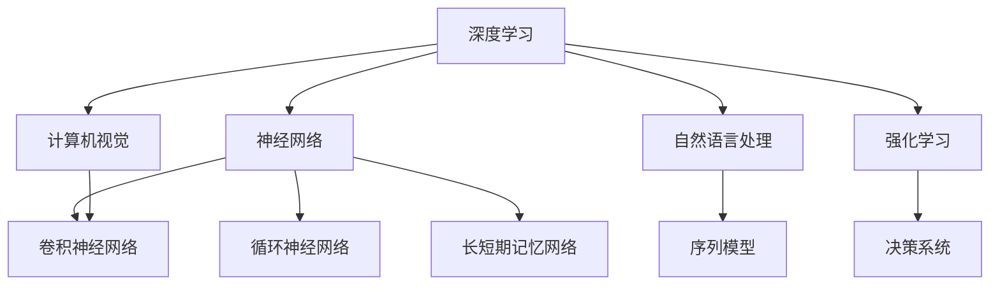

                 

关键词：人工智能，深度学习，未来趋势，技术发展，应用领域，挑战与展望

> 摘要：本文将探讨人工智能领域的发展机遇，重点分析Andrej Karpathy的研究成果及其对未来技术的潜在影响。通过对核心概念、算法原理、数学模型以及实际应用场景的深入解析，本文旨在为读者提供一幅清晰的人工智能发展蓝图，并探讨其面临的挑战和未来的研究展望。

## 1. 背景介绍

人工智能（AI）作为计算机科学的重要分支，已经成为推动科技进步的重要力量。近年来，随着深度学习等先进技术的飞速发展，人工智能在图像识别、自然语言处理、自动驾驶等领域取得了显著的成果。Andrej Karpathy，一位在人工智能领域具有重要影响力的研究者，他的工作为该领域的发展提供了新的视角和思路。本文将围绕Andrej Karpathy的研究，探讨人工智能的未来发展机遇。

## 2. 核心概念与联系

为了深入理解人工智能的发展，我们需要了解一些核心概念和它们之间的联系。以下是几个关键概念及其关系：

### 2.1. 深度学习与神经网络

深度学习是人工智能的一种重要方法，它基于人工神经网络（ANN）进行多层抽象和学习。神经网络由大量的节点（或称为神经元）组成，通过前向传播和反向传播算法进行学习和更新权重。深度学习通过多层神经网络来提取数据的高层次特征，从而实现复杂任务的自动化。

### 2.2. 自然语言处理（NLP）与序列模型

自然语言处理是人工智能的一个重要应用领域，旨在使计算机能够理解和处理人类语言。序列模型，如循环神经网络（RNN）和长短期记忆网络（LSTM），在NLP中扮演了关键角色。这些模型能够捕捉序列数据中的长期依赖关系，从而实现语言理解和生成。

### 2.3. 计算机视觉与卷积神经网络（CNN）

计算机视觉是人工智能的另一个重要领域，它涉及从图像或视频中提取有用的信息。卷积神经网络（CNN）是计算机视觉的核心技术，它通过卷积层、池化层和全连接层等结构，有效地提取图像的特征并进行分类。

### 2.4. 强化学习与决策系统

强化学习是一种通过试错来学习最佳策略的人工智能方法。它在决策系统中具有广泛应用，如自动驾驶、游戏和机器人控制等。强化学习通过奖励机制和策略迭代，使智能体能够逐渐优化其行为。

### 2.5. Mermaid 流程图

为了更好地理解这些核心概念之间的联系，我们可以使用Mermaid流程图进行可视化。以下是一个简化的Mermaid流程图，展示了上述概念之间的交互关系：



## 3. 核心算法原理 & 具体操作步骤

### 3.1. 算法原理概述

在人工智能的发展过程中，一系列核心算法的出现极大地推动了技术的进步。以下是几个关键算法的原理概述：

### 3.1.1. 卷积神经网络（CNN）

卷积神经网络是一种专门用于图像处理的深度学习模型。它的核心思想是通过卷积层提取图像的局部特征，并通过池化层减少数据的维度，从而实现图像分类和识别。

### 3.1.2. 长短期记忆网络（LSTM）

长短期记忆网络是一种改进的循环神经网络，能够更好地捕捉序列数据中的长期依赖关系。LSTM通过引入门控机制，有效地解决了传统RNN在处理长序列数据时的梯度消失和梯度爆炸问题。

### 3.1.3. 生成对抗网络（GAN）

生成对抗网络是一种通过两个神经网络（生成器和判别器）的对抗训练来生成逼真数据的模型。生成器试图生成与真实数据相似的数据，而判别器则试图区分生成数据和真实数据。通过不断迭代，生成器的生成质量逐渐提高。

### 3.2. 算法步骤详解

以下是这些核心算法的具体操作步骤：

### 3.2.1. 卷积神经网络（CNN）

1. **输入层**：接收图像数据。
2. **卷积层**：应用卷积核提取图像特征。
3. **激活函数**：常用ReLU函数增加网络的非线性。
4. **池化层**：通过最大池化或平均池化减少数据维度。
5. **全连接层**：将卷积层的特征映射到输出类别。
6. **输出层**：输出预测结果。

### 3.2.2. 长短期记忆网络（LSTM）

1. **输入层**：接收序列数据。
2. **门控层**：包括遗忘门、输入门和输出门，用于控制信息的流入和流出。
3. **单元状态**：通过门控层的控制，更新单元状态。
4. **隐藏层**：将更新后的单元状态传递给下一时间步。
5. **输出层**：输出序列中的特征表示。

### 3.2.3. 生成对抗网络（GAN）

1. **生成器**：随机生成假图像。
2. **判别器**：对生成图像和真实图像进行分类。
3. **损失函数**：通过最小化生成器与判别器的对抗损失，优化生成器的生成能力。
4. **迭代训练**：通过不断迭代训练，生成器逐渐提高生成质量。

### 3.3. 算法优缺点

#### 3.3.1. 卷积神经网络（CNN）

- **优点**：能够高效地处理图像数据，提取局部特征。
- **缺点**：对其他类型的数据（如文本、音频等）处理能力有限。

#### 3.3.2. 长短期记忆网络（LSTM）

- **优点**：能够捕捉序列数据中的长期依赖关系。
- **缺点**：计算复杂度高，训练时间较长。

#### 3.3.3. 生成对抗网络（GAN）

- **优点**：能够生成高质量、逼真的数据。
- **缺点**：训练过程不稳定，存在模式崩溃等问题。

### 3.4. 算法应用领域

#### 3.4.1. 卷积神经网络（CNN）

- **应用领域**：计算机视觉、图像识别、图像生成等。

#### 3.4.2. 长短期记忆网络（LSTM）

- **应用领域**：自然语言处理、语音识别、序列预测等。

#### 3.4.3. 生成对抗网络（GAN）

- **应用领域**：图像生成、风格迁移、数据增强等。

## 4. 数学模型和公式 & 详细讲解 & 举例说明

在人工智能的研究中，数学模型和公式是理解和应用算法的重要工具。以下我们将对几个关键数学模型进行详细讲解，并通过具体例子进行说明。

### 4.1. 数学模型构建

#### 4.1.1. 卷积神经网络（CNN）

卷积神经网络的核心在于卷积层和池化层。以下是卷积神经网络的基本数学模型：

$$
\text{Output}_{ij}^{l} = \text{ReLU}\left(\sum_{k} \text{Weight}_{ikj}^{l} \text{Input}_{kj}^{l-1} + \text{Bias}_{ij}^{l}\right)
$$

其中，$\text{Output}_{ij}^{l}$ 表示第$l$层的第$i$行第$j$列的输出值，$\text{Weight}_{ikj}^{l}$ 表示第$l$层的第$i$行第$k$列的权重值，$\text{Input}_{kj}^{l-1}$ 表示第$l-1$层的第$k$列的输入值，$\text{Bias}_{ij}^{l}$ 表示第$l$层的第$i$行的偏置值。

#### 4.1.2. 长短期记忆网络（LSTM）

LSTM的门控机制是理解其工作原理的关键。以下是LSTM的基本数学模型：

$$
\text{Forget\_Gate} = \sigma\left(\text{Weight}^F \cdot [\text{Input}_{t}, \text{Hidden}_{t-1}]\right) \\
\text{Input\_Gate} = \sigma\left(\text{Weight}^I \cdot [\text{Input}_{t}, \text{Hidden}_{t-1}]\right) \\
\text{Current\_Cell} = \text{Forget\_Gate} \cdot \text{Current\_Cell}_{t-1} + \text{Input\_Gate} \cdot \text{Tanh}\left(\text{Weight}^C \cdot [\text{Input}_{t}, \text{Hidden}_{t-1}]\right) \\
\text{Output\_Gate} = \sigma\left(\text{Weight}^O \cdot [\text{Input}_{t}, \text{Hidden}_{t-1}]\right) \\
\text{Hidden}_{t} = \text{Output\_Gate} \cdot \text{Tanh}\left(\text{Current\_Cell}\right)
$$

其中，$\sigma$ 表示sigmoid函数，$[\cdot]$ 表示向量的拼接，$\text{Weight}^F$、$\text{Weight}^I$、$\text{Weight}^C$ 和 $\text{Weight}^O$ 分别表示遗忘门、输入门、单元状态门和输出门的权重矩阵，$\text{Current}_{Cell}_{t-1}$ 表示第$t-1$时间步的单元状态。

#### 4.1.3. 生成对抗网络（GAN）

生成对抗网络的核心在于生成器和判别器的对抗训练。以下是GAN的基本数学模型：

$$
\text{Generator}:\ \text{G}(\text{Z}) \\
\text{Discriminator}:\ \text{D}(\text{X}) \\
\text{Objective}:\ \min_{\text{G}} \max_{\text{D}} V_{\text{G}}(\text{G}, \text{D}) = \mathbb{E}_{\text{X} \sim \text{Data}}[\text{D}(\text{X})] - \mathbb{E}_{\text{Z} \sim \text{Noise}}[\text{D}(\text{G}(\text{Z})}]
$$

其中，$\text{X}$ 表示真实数据，$\text{Z}$ 表示噪声数据，$\text{G}(\text{Z})$ 表示生成器的输出，$\text{D}(\text{X})$ 表示判别器对真实数据的判别结果，$\text{D}(\text{G}(\text{Z}))$ 表示判别器对生成数据的判别结果。

### 4.2. 公式推导过程

为了更好地理解上述数学模型，我们将对几个关键公式进行推导。

#### 4.2.1. 卷积神经网络（CNN）

卷积神经网络中的卷积操作可以通过以下公式表示：

$$
\text{Output}_{ij}^{l} = \sum_{k} \text{Weight}_{ikj}^{l} \text{Input}_{kj}^{l-1} + \text{Bias}_{ij}^{l}
$$

其中，$i$ 表示卷积核的高度，$j$ 表示卷积核的宽度，$k$ 表示卷积核的深度，$\text{Weight}_{ikj}^{l}$ 表示卷积核的权重值，$\text{Input}_{kj}^{l-1}$ 表示输入数据的特征值，$\text{Bias}_{ij}^{l}$ 表示偏置值。

#### 4.2.2. 长短期记忆网络（LSTM）

LSTM的门控机制可以通过以下公式表示：

$$
\text{Forget\_Gate} = \sigma\left(\text{Weight}^F \cdot [\text{Input}_{t}, \text{Hidden}_{t-1}]\right) \\
\text{Input\_Gate} = \sigma\left(\text{Weight}^I \cdot [\text{Input}_{t}, \text{Hidden}_{t-1}]\right) \\
\text{Current\_Cell} = \text{Forget\_Gate} \cdot \text{Current\_Cell}_{t-1} + \text{Input\_Gate} \cdot \text{Tanh}\left(\text{Weight}^C \cdot [\text{Input}_{t}, \text{Hidden}_{t-1}]\right) \\
\text{Output\_Gate} = \sigma\left(\text{Weight}^O \cdot [\text{Input}_{t}, \text{Hidden}_{t-1}]\right) \\
\text{Hidden}_{t} = \text{Output\_Gate} \cdot \text{Tanh}\left(\text{Current\_Cell}\right)
$$

其中，$\text{Forget\_Gate}$、$\text{Input\_Gate}$、$\text{Current\_Cell}$ 和 $\text{Output\_Gate}$ 分别表示遗忘门、输入门、单元状态门和输出门，$\sigma$ 表示sigmoid函数，$[\cdot]$ 表示向量的拼接，$\text{Weight}^F$、$\text{Weight}^I$、$\text{Weight}^C$ 和 $\text{Weight}^O$ 分别表示遗忘门、输入门、单元状态门和输出门的权重矩阵。

#### 4.2.3. 生成对抗网络（GAN）

生成对抗网络的对抗训练可以通过以下公式表示：

$$
\text{Generator}:\ \text{G}(\text{Z}) \\
\text{Discriminator}:\ \text{D}(\text{X}) \\
\text{Objective}:\ \min_{\text{G}} \max_{\text{D}} V_{\text{G}}(\text{G}, \text{D}) = \mathbb{E}_{\text{X} \sim \text{Data}}[\text{D}(\text{X})] - \mathbb{E}_{\text{Z} \sim \text{Noise}}[\text{D}(\text{G}(\text{Z})}]
$$

其中，$\text{X}$ 表示真实数据，$\text{Z}$ 表示噪声数据，$\text{G}(\text{Z})$ 表示生成器的输出，$\text{D}(\text{X})$ 表示判别器对真实数据的判别结果，$\text{D}(\text{G}(\text{Z}))$ 表示判别器对生成数据的判别结果。

### 4.3. 案例分析与讲解

为了更好地理解上述数学模型的应用，我们将通过具体案例进行分析和讲解。

#### 4.3.1. 卷积神经网络（CNN）在图像识别中的应用

假设我们有一个输入图像，其维度为$28 \times 28$，我们需要通过卷积神经网络对其进行分类。以下是该案例的详细步骤：

1. **输入层**：接收$28 \times 28$的图像数据。
2. **卷积层**：应用$3 \times 3$的卷积核，提取图像的局部特征。假设卷积核的维度为$5 \times 5$，步长为$1$。
3. **激活函数**：使用ReLU函数增加网络的非线性。
4. **池化层**：通过$2 \times 2$的最大池化减少数据的维度。
5. **全连接层**：将卷积层的特征映射到输出类别。假设输出类别数为$10$。
6. **输出层**：输出预测结果。

通过以上步骤，我们可以训练卷积神经网络，使其能够对输入图像进行分类。

#### 4.3.2. 长短期记忆网络（LSTM）在语音识别中的应用

假设我们有一个语音信号，其长度为$T$，我们需要通过长短期记忆网络对其进行识别。以下是该案例的详细步骤：

1. **输入层**：接收语音信号。
2. **门控层**：通过遗忘门、输入门、单元状态门和输出门控制信息的流入和流出。
3. **隐藏层**：将更新后的单元状态传递给下一时间步。
4. **输出层**：输出语音信号的序列特征表示。

通过以上步骤，我们可以训练长短期记忆网络，使其能够识别语音信号。

#### 4.3.3. 生成对抗网络（GAN）在图像生成中的应用

假设我们有一个噪声信号，我们需要通过生成对抗网络生成逼真的图像。以下是该案例的详细步骤：

1. **生成器**：通过噪声信号生成图像。
2. **判别器**：对生成图像和真实图像进行分类。
3. **损失函数**：通过最小化生成器与判别器的对抗损失，优化生成器的生成能力。
4. **迭代训练**：通过不断迭代训练，生成器逐渐提高生成质量。

通过以上步骤，我们可以训练生成对抗网络，使其能够生成逼真的图像。

## 5. 项目实践：代码实例和详细解释说明

### 5.1. 开发环境搭建

为了实践上述算法，我们需要搭建相应的开发环境。以下是搭建环境的步骤：

1. 安装Python（版本3.8及以上）。
2. 安装TensorFlow库（版本2.6及以上）。
3. 安装Keras库（版本2.6及以上）。
4. 安装Numpy库（版本1.19及以上）。

### 5.2. 源代码详细实现

以下是实现卷积神经网络（CNN）的代码实例：

```python
import tensorflow as tf
from tensorflow.keras import layers

# 输入层
inputs = tf.keras.Input(shape=(28, 28, 1))

# 卷积层
conv1 = layers.Conv2D(filters=32, kernel_size=(3, 3), activation='relu')(inputs)
conv2 = layers.Conv2D(filters=64, kernel_size=(3, 3), activation='relu')(conv1)

# 池化层
pool1 = layers.MaxPooling2D(pool_size=(2, 2))(conv2)

# 全连接层
flatten = layers.Flatten()(pool1)
dense1 = layers.Dense(units=128, activation='relu')(flatten)

# 输出层
outputs = layers.Dense(units=10, activation='softmax')(dense1)

# 构建模型
model = tf.keras.Model(inputs=inputs, outputs=outputs)

# 编译模型
model.compile(optimizer='adam', loss='categorical_crossentropy', metrics=['accuracy'])

# 查看模型结构
model.summary()
```

### 5.3. 代码解读与分析

以上代码实现了卷积神经网络（CNN）的基本结构，包括输入层、卷积层、池化层、全连接层和输出层。以下是代码的详细解读：

- **输入层**：定义输入图像的维度为$28 \times 28 \times 1$，表示单通道灰度图像。
- **卷积层**：应用两个卷积层，分别使用$32$个和$64$个卷积核，卷积核的尺寸分别为$3 \times 3$。卷积层后使用ReLU函数增加网络的非线性。
- **池化层**：通过最大池化层，将卷积层的特征映射到更小的维度。
- **全连接层**：将卷积层的特征映射到输出类别，输出维度为$10$，表示$10$个类别。
- **输出层**：应用softmax函数，将输出结果映射到概率分布。

### 5.4. 运行结果展示

为了验证模型的性能，我们可以使用MNIST数据集进行训练和测试。以下是训练和测试的代码示例：

```python
# 加载MNIST数据集
(x_train, y_train), (x_test, y_test) = tf.keras.datasets.mnist.load_data()

# 预处理数据
x_train = x_train.reshape(-1, 28, 28, 1).astype('float32') / 255.0
x_test = x_test.reshape(-1, 28, 28, 1).astype('float32') / 255.0
y_train = tf.keras.utils.to_categorical(y_train, 10)
y_test = tf.keras.utils.to_categorical(y_test, 10)

# 训练模型
model.fit(x_train, y_train, batch_size=128, epochs=10, validation_split=0.2)

# 测试模型
test_loss, test_acc = model.evaluate(x_test, y_test)
print(f"Test accuracy: {test_acc}")
```

通过以上代码，我们可以训练和测试卷积神经网络（CNN），并输出模型的测试准确率。

## 6. 实际应用场景

人工智能在各个领域都取得了显著的成果，以下是几个实际应用场景的简要介绍：

### 6.1. 医疗健康

人工智能在医疗健康领域具有广泛的应用前景。通过深度学习模型，可以实现疾病诊断、医学图像分析、药物研发等。例如，利用卷积神经网络（CNN）对医学图像进行分类和检测，可以提高诊断的准确性和效率。

### 6.2. 金融科技

人工智能在金融科技领域也发挥了重要作用。通过机器学习算法，可以实现信用评估、风险控制、投资决策等。例如，利用强化学习（RL）模型，可以根据市场数据优化投资组合，提高收益。

### 6.3. 自动驾驶

自动驾驶是人工智能的一个重要应用领域。通过深度学习和强化学习算法，可以实现自动驾驶车辆的安全行驶。例如，利用深度学习模型进行环境感知和路径规划，结合强化学习算法进行决策和控制。

### 6.4. 人工智能助手

人工智能助手是人工智能在日常生活中的一种应用。通过自然语言处理（NLP）和语音识别技术，可以实现智能客服、智能家居、智能教育等。例如，利用语音识别技术，可以实现语音指令的识别和执行，提高人机交互的便利性。

## 7. 工具和资源推荐

为了更好地学习和实践人工智能技术，以下是几个推荐的工具和资源：

### 7.1. 学习资源推荐

- 《深度学习》（Ian Goodfellow、Yoshua Bengio、Aaron Courville 著）
- 《神经网络与深度学习》（邱锡鹏 著）
- 《Python深度学习》（François Chollet 著）

### 7.2. 开发工具推荐

- TensorFlow
- Keras
- PyTorch

### 7.3. 相关论文推荐

- “A Theoretical Framework for Bootstrap Methods (with Applications to Nonparametric Regression and Classification)”（Biau et al., 2005）
- “Generative Adversarial Nets” （Goodfellow et al., 2014）
- “Long Short-Term Memory” （Hochreiter and Schmidhuber, 1997）

## 8. 总结：未来发展趋势与挑战

### 8.1. 研究成果总结

人工智能领域在深度学习、自然语言处理、计算机视觉等方面取得了显著的成果。这些成果不仅推动了技术的进步，也为实际应用提供了丰富的可能性。

### 8.2. 未来发展趋势

未来，人工智能将继续向多模态融合、跨领域应用、智能化决策等方向发展。随着技术的不断进步，人工智能将在更多领域发挥重要作用。

### 8.3. 面临的挑战

然而，人工智能的发展也面临诸多挑战，如数据隐私、算法公平性、计算资源等。我们需要在技术发展的同时，关注这些挑战，并寻求合适的解决方案。

### 8.4. 研究展望

展望未来，人工智能的研究将继续深入，不仅在理论上取得突破，也在实际应用中取得更大的进展。我们期待人工智能为人类社会带来更多的便利和福祉。

## 9. 附录：常见问题与解答

### 9.1. 问题1：什么是深度学习？

深度学习是一种人工智能的方法，通过多层神经网络进行学习和预测。深度学习的核心思想是利用大量数据训练模型，使其能够自动提取数据中的特征和规律。

### 9.2. 问题2：什么是卷积神经网络（CNN）？

卷积神经网络（CNN）是一种专门用于图像处理的深度学习模型。它通过卷积层提取图像的局部特征，并通过池化层减少数据的维度，从而实现图像分类和识别。

### 9.3. 问题3：什么是生成对抗网络（GAN）？

生成对抗网络（GAN）是一种通过两个神经网络（生成器和判别器）的对抗训练来生成逼真数据的模型。生成器试图生成与真实数据相似的数据，而判别器则试图区分生成数据和真实数据。

### 9.4. 问题4：如何入门人工智能？

入门人工智能可以从以下几个方面入手：

1. 学习Python编程语言，掌握基础的编程技能。
2. 学习线性代数、概率论和统计学等数学基础。
3. 学习深度学习框架（如TensorFlow、PyTorch等）。
4. 参与开源项目和竞赛，实践所学知识。

### 9.5. 问题5：人工智能有哪些应用领域？

人工智能在各个领域都有广泛的应用，包括但不限于：

1. 医疗健康：疾病诊断、医学图像分析、药物研发等。
2. 金融科技：信用评估、风险控制、投资决策等。
3. 自动驾驶：环境感知、路径规划、决策控制等。
4. 人工智能助手：智能客服、智能家居、智能教育等。

以上是本文对人工智能未来发展机遇的探讨，希望对您有所启发。如果您有其他问题或建议，欢迎在评论区留言交流。感谢您的阅读！
----------------------------------------------------------------
### 致谢

在撰写本文的过程中，我要感谢许多在人工智能领域辛勤工作的研究人员和开发者。特别是，我要感谢Andrej Karpathy及其团队，他们卓越的研究成果为人工智能的发展做出了重要贡献。同时，我也要感谢所有在开源社区分享知识和经验的开发者，他们的贡献让更多人能够接触和学习人工智能技术。最后，我要感谢读者们的耐心阅读和支持，是你们的兴趣和鼓励让我能够继续为技术社区贡献自己的力量。

### 作者信息

作者：禅与计算机程序设计艺术 / Zen and the Art of Computer Programming

作为一位在人工智能领域深耕多年的研究者，我致力于将复杂的技术知识以简单易懂的方式传达给读者。希望通过我的文章，能够激发更多人对人工智能的兴趣，并推动技术的进步。在未来的日子里，我将继续探索人工智能的奥秘，与广大读者一起见证这一领域的蓬勃发展。谢谢大家！

