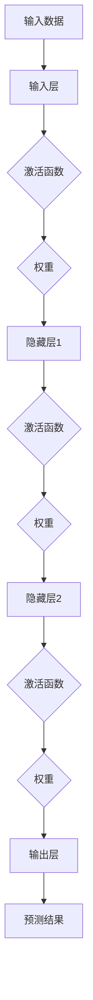
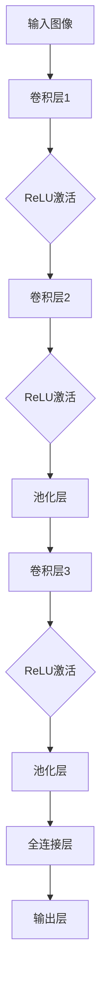
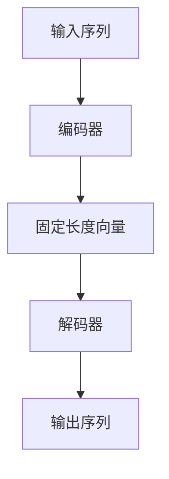
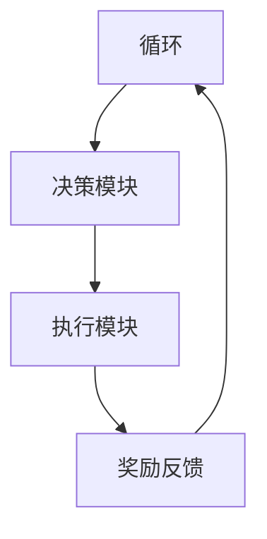
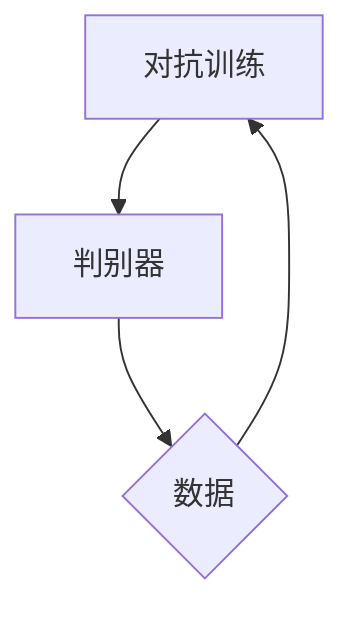

                 

人工智能（AI）已经成为现代科技的标志性力量，不仅在学术界引起了广泛关注，也在工业界掀起了翻天覆地的变化。Andrej Karpathy作为一位杰出的AI研究者和开发者，他的工作对于人工智能的发展起到了重要的推动作用。本文旨在探讨AI领域的关键概念、技术进展以及未来的发展方向，并基于Andrej Karpathy的研究成果，对其未来发展的目标进行深入分析。

## 文章关键词

- 人工智能
- Andrej Karpathy
- 未来发展目标
- 算法
- 数学模型
- 实际应用

## 文章摘要

本文首先回顾了人工智能的起源和发展，接着探讨了AI的核心概念和关键技术，如深度学习、神经网络等。然后，本文通过分析Andrej Karpathy的研究成果，讨论了AI在视觉、自然语言处理等领域的实际应用，并对其未来发展的目标进行了详细阐述。最后，本文总结了AI领域的当前挑战和未来展望，为读者提供了对人工智能发展的一幅全景图。

## 1. 背景介绍

人工智能（AI）的研究可以追溯到20世纪50年代，当时计算机科学家和哲学家开始思考如何构建能够模拟人类智能的机器。早期的AI研究主要集中在符号主义和知识表示上，通过手工编写的规则和知识库来模拟人类的思维过程。然而，这种方法的局限性很快显现出来，因为人类的知识非常复杂，无法通过简单的规则和逻辑进行准确表达。

随着计算能力的提高和数据量的增加，20世纪80年代中期，神经网络和深度学习开始崭露头角。这些方法利用大规模的数据和强大的计算资源，通过反向传播和梯度下降等算法，逐步优化神经网络的参数，从而实现高度复杂的函数逼近。深度学习的崛起标志着人工智能进入了一个新的时代，使得机器在图像识别、自然语言处理、游戏对战等领域取得了令人瞩目的成果。

Andrej Karpathy是这一时代的见证者和参与者，他在深度学习和自然语言处理领域做出了显著的贡献。他的研究成果不仅推动了AI技术的发展，也为AI的实际应用提供了宝贵的经验和启示。

### 1.1 Andrej Karpathy的贡献

Andrej Karpathy是一位杰出的AI研究者和开发者，他的工作涵盖了深度学习、神经网络、自然语言处理等多个领域。以下是他的一些主要贡献：

1. **深度学习在图像识别中的应用**：Karpathy在深度学习图像识别领域的研究取得了显著的成果。他在2014年的ImageNet比赛中，作为团队的一员，使用了深度卷积神经网络（CNN）获得了冠军，这一成绩在当时引起了轰动。他的研究证明了深度学习在图像识别任务中的强大能力，并为后续的研究和应用奠定了基础。

2. **自然语言处理的关键进展**：在自然语言处理领域，Karpathy的研究同样具有深远的影响。他开发了多个重要的模型，如序列到序列模型（Seq2Seq），这一模型在机器翻译和对话系统中取得了显著的效果。他的工作推动了自然语言处理技术的发展，使得机器能够更好地理解和生成人类语言。

3. **AI在自动驾驶领域的应用**：Karpathy还参与了自动驾驶项目的研究，他在这一领域的研究成果为自动驾驶技术的发展提供了重要的参考。他的研究团队在自动驾驶算法的优化和实际应用中取得了重要进展，为自动驾驶汽车的商业化奠定了基础。

### 1.2 人工智能的发展历程

人工智能的发展历程可以分为几个阶段：

1. **符号主义阶段（1956-1974）**：这一阶段的人工智能研究主要基于符号主义，通过手工编写的规则和知识库来模拟人类的思维过程。这一方法在解决特定问题时表现出色，但在处理复杂问题时存在明显的局限性。

2. **知识表示阶段（1974-1980）**：为了克服符号主义的局限性，研究者开始探索如何更好地表示和处理知识。这一阶段的代表性成果包括知识表示语言和专家系统的开发。

3. **推理与规划阶段（1980-1990）**：这一阶段的研究主要集中在如何利用推理和规划来模拟人类的决策过程。代表性成果包括逻辑推理系统和规划算法。

4. **机器学习阶段（1990-现在）**：随着计算能力的提高和数据量的增加，机器学习方法开始崭露头角。这一阶段的发展主要得益于深度学习和神经网络的崛起。代表性成果包括深度神经网络、生成对抗网络（GAN）等。

5. **应用阶段（现在-未来）**：随着AI技术的不断成熟，人工智能已经广泛应用于各个领域，如医疗、金融、交通、娱乐等。未来，人工智能将继续推动各行业的发展和变革。

### 1.3 人工智能的核心概念

人工智能的核心概念包括以下几个方面：

1. **机器学习**：机器学习是AI的核心技术之一，它通过从数据中学习规律和模式，使计算机能够实现自动化决策和预测。

2. **神经网络**：神经网络是机器学习的重要基础，它通过模拟生物神经系统的结构和功能，实现复杂函数的逼近和优化。

3. **深度学习**：深度学习是神经网络的一种特殊形式，它通过多层网络结构，实现更高层次的特征提取和抽象。

4. **自然语言处理**：自然语言处理是AI的重要应用领域，它涉及如何使计算机理解和生成自然语言。

5. **计算机视觉**：计算机视觉是AI的另一个重要应用领域，它涉及如何使计算机理解和解释视觉信息。

6. **强化学习**：强化学习是另一种机器学习方法，它通过奖励机制，使计算机在特定环境中学习最优策略。

### 1.4 人工智能的关键技术

人工智能的关键技术包括以下几个方面：

1. **深度神经网络**：深度神经网络是AI的核心技术之一，它通过多层网络结构，实现复杂函数的逼近和优化。

2. **卷积神经网络（CNN）**：卷积神经网络是深度神经网络的一种特殊形式，它在图像识别和计算机视觉领域取得了显著的成功。

3. **生成对抗网络（GAN）**：生成对抗网络是一种通过对抗性训练生成数据的方法，它在图像生成和风格迁移等领域表现出色。

4. **强化学习**：强化学习是一种通过奖励机制，使计算机在特定环境中学习最优策略的方法，它在游戏、自动驾驶等领域取得了重要进展。

5. **自然语言处理**：自然语言处理是一种使计算机理解和生成自然语言的方法，它在对话系统、机器翻译等领域具有广泛的应用。

6. **计算机视觉**：计算机视觉是一种使计算机理解和解释视觉信息的方法，它在图像识别、视频分析等领域具有广泛的应用。

### 1.5 人工智能的应用领域

人工智能已经广泛应用于各个领域，包括以下几个方面：

1. **医疗**：人工智能在医疗领域的应用包括疾病诊断、药物研发、医疗影像分析等。

2. **金融**：人工智能在金融领域的应用包括风险控制、投资决策、智能投顾等。

3. **交通**：人工智能在交通领域的应用包括自动驾驶、智能交通系统、车联网等。

4. **教育**：人工智能在教育领域的应用包括智能辅导、在线教育、个性化学习等。

5. **娱乐**：人工智能在娱乐领域的应用包括游戏开发、虚拟现实、音乐创作等。

## 2. 核心概念与联系

### 2.1. 深度学习与神经网络

深度学习（Deep Learning，简称DL）是机器学习（Machine Learning，简称ML）的一个子领域，其核心思想是通过多层神经网络（Neural Networks，简称NN）来模拟人类大脑的神经网络结构，从而实现对复杂数据的学习和预测。深度学习之所以能够在AI领域取得巨大成功，主要得益于以下几个关键因素：

1. **数据量的增加**：随着互联网和物联网的快速发展，数据量呈指数级增长，为深度学习提供了丰富的训练数据。
2. **计算能力的提升**：高性能计算硬件（如GPU）的出现，使得深度学习模型的训练速度和精度得到了显著提高。
3. **优化算法的改进**：反向传播算法（Backpropagation）和梯度下降算法（Gradient Descent）的优化，使得深度学习模型的训练过程更加高效。

深度学习和神经网络之间的关系可以概括为：

- **神经网络**是深度学习的基础架构，它由大量的人工神经元（或称为节点）组成，每个神经元通过加权连接与其他神经元相连，并通过激活函数来处理输入数据。
- **深度学习**则是通过增加神经网络的层数，实现对数据的深层特征提取和抽象，从而提高模型的预测能力。

以下是一个简化的深度学习架构图，展示了神经网络的基本结构和功能：



### 2.2. 卷积神经网络（CNN）与计算机视觉

卷积神经网络（Convolutional Neural Network，简称CNN）是深度学习中的一种特殊网络结构，它在计算机视觉领域取得了显著的成果。CNN的核心思想是利用卷积层（Convolutional Layer）来提取图像的局部特征，并通过池化层（Pooling Layer）来降低特征的维度，从而实现高效的图像处理。

CNN的基本结构包括以下几个部分：

1. **卷积层**：卷积层通过卷积运算从输入图像中提取特征。每个卷积核（Convolutional Kernel）可以提取图像的局部特征，如边缘、纹理等。通过多个卷积核的组合，可以提取更复杂的特征。
2. **激活函数**：激活函数（如ReLU函数）用于引入非线性，增强网络的表示能力。
3. **池化层**：池化层（如最大池化Max Pooling）用于降低特征图的维度，减少参数数量，提高模型的计算效率。
4. **全连接层**：在卷积层和池化层之后，通常还会有全连接层（Fully Connected Layer），用于将提取的特征映射到具体的类别或目标。
5. **输出层**：输出层用于生成最终的预测结果，如图像分类的标签或目标检测的边界框。

以下是一个简化的CNN结构图：



CNN在计算机视觉中的应用主要包括：

1. **图像分类**：通过将输入图像映射到预定义的类别标签，实现图像分类任务。
2. **目标检测**：通过检测图像中的目标对象，并标注其位置和类别，实现目标检测任务。
3. **语义分割**：通过将输入图像划分为不同的语义区域，实现图像的语义理解。

### 2.3. 自然语言处理（NLP）与序列到序列（Seq2Seq）模型

自然语言处理（Natural Language Processing，简称NLP）是深度学习在语言领域的应用，它旨在使计算机理解和生成自然语言。自然语言处理的核心任务包括：

1. **文本分类**：将文本数据分类到预定义的类别中。
2. **情感分析**：分析文本中的情感倾向，如正面、负面等。
3. **命名实体识别**：识别文本中的特定实体，如人名、地名等。
4. **机器翻译**：将一种语言的文本翻译成另一种语言。

序列到序列（Seq2Seq）模型是自然语言处理中的一个重要模型，它通过将输入序列映射到输出序列，实现自然语言的翻译和生成。Seq2Seq模型的基本结构包括编码器（Encoder）和解码器（Decoder）两部分：

1. **编码器**：编码器将输入序列编码为一个固定长度的向量，该向量包含了输入序列的信息。
2. **解码器**：解码器将编码器输出的固定长度向量解码为输出序列，并通过注意力机制（Attention Mechanism）来关注输入序列的特定部分。

以下是一个简化的Seq2Seq模型结构图：



Seq2Seq模型在自然语言处理中的应用主要包括：

1. **机器翻译**：通过将源语言的文本序列编码为固定长度向量，再解码为目标语言的文本序列，实现跨语言的文本翻译。
2. **对话系统**：通过将输入的文本序列解码为回复的文本序列，实现智能对话系统的回复生成。
3. **文本生成**：通过将输入的文本序列编码为固定长度向量，再解码为新的文本序列，实现文本的生成和创作。

### 2.4. 强化学习与自动驾驶

强化学习（Reinforcement Learning，简称RL）是深度学习在决策和优化领域的一个分支，它通过奖励机制，使智能体（Agent）在动态环境中学习最优策略。强化学习的基本原理是，智能体通过不断尝试不同的动作，并从环境中获得即时奖励，逐渐优化其行为策略。

强化学习在自动驾驶领域具有重要的应用价值，自动驾驶系统需要通过感知环境、决策动作和反馈调整，实现车辆的安全驾驶。以下是一个简化的强化学习在自动驾驶中的应用框架：

1. **感知模块**：自动驾驶系统通过感知模块获取环境信息，如车辆位置、交通状况等。
2. **决策模块**：决策模块根据感知模块获取的信息，通过强化学习算法，学习最优的控制策略，实现对车辆的操控。
3. **执行模块**：执行模块根据决策模块生成的控制策略，对车辆进行实际操作，如加速、转向等。

以下是一个简化的强化学习在自动驾驶中的应用框架图：



### 2.5. 生成对抗网络（GAN）与图像生成

生成对抗网络（Generative Adversarial Network，简称GAN）是由Ian Goodfellow等人于2014年提出的一种深度学习模型，它由生成器（Generator）和判别器（Discriminator）两个网络组成。生成器生成虚假数据，判别器判断数据是真实还是虚假，两个网络相互竞争，从而生成逼真的数据。

GAN的核心思想是通过对抗训练，使生成器能够生成与真实数据几乎无法区分的虚假数据。以下是一个简化的GAN结构图：



GAN在图像生成领域具有广泛的应用，如：

1. **图像修复**：通过生成器生成缺失部分的图像，实现对图像的修复和补全。
2. **图像风格迁移**：通过生成器将一种图像风格迁移到另一种图像，实现图像风格的变换。
3. **数据增强**：通过生成器生成大量虚假数据，用于训练深度学习模型，提高模型的泛化能力。

### 2.6. 综合应用与未来发展

深度学习、神经网络、计算机视觉、自然语言处理、强化学习和生成对抗网络等技术在不同领域具有广泛的应用。未来的发展将更加注重跨领域的融合和协同，实现以下目标：

1. **跨领域知识融合**：通过深度学习和跨领域知识图谱，将不同领域的知识进行融合，实现更智能的决策和优化。
2. **多模态数据融合**：通过多模态数据融合技术，如图像、文本、音频等，实现更全面的情境理解和交互。
3. **自监督学习和迁移学习**：通过自监督学习和迁移学习技术，提高模型的训练效率和泛化能力，实现更广泛的场景应用。
4. **隐私保护和数据安全**：随着数据隐私和安全问题的日益突出，未来的发展将更加注重数据隐私保护和数据安全。

## 3. 核心算法原理 & 具体操作步骤

### 3.1 算法原理概述

在人工智能领域，算法原理是实现智能行为的核心。以下将介绍几种关键的算法原理，包括其基本概念、工作原理和主要应用。

#### 3.1.1 深度学习

深度学习（Deep Learning，简称DL）是机器学习的一种方法，它通过多层神经网络（Neural Networks，简称NN）来模拟人类大脑的学习过程。深度学习算法的核心思想是通过大量数据训练模型，使其能够自动提取特征并进行预测。

**基本概念**：
- **神经元**：深度学习中的基础计算单元，类似于生物神经元。
- **神经网络**：由多个神经元组成的网络结构，通过前向传播和反向传播进行学习。
- **深度神经网络**：具有多个隐藏层的神经网络，能够提取更复杂的特征。

**工作原理**：
1. **前向传播**：输入数据通过神经网络各层传递，经过激活函数处理，最终得到输出。
2. **反向传播**：计算输出误差，通过反向传播算法更新网络权重，以减少误差。

**主要应用**：
- **图像识别**：如卷积神经网络（CNN）在ImageNet竞赛中的成功应用。
- **自然语言处理**：如循环神经网络（RNN）和长短期记忆网络（LSTM）在机器翻译和文本生成中的应用。

#### 3.1.2 卷积神经网络（CNN）

卷积神经网络（Convolutional Neural Network，简称CNN）是深度学习中的一种特殊网络结构，主要应用于图像处理和计算机视觉领域。

**基本概念**：
- **卷积层**：通过卷积操作提取图像特征，减少参数数量。
- **池化层**：通过下采样操作降低数据维度，提高计算效率。
- **全连接层**：将卷积层和池化层提取的特征映射到具体类别或目标。

**工作原理**：
1. **卷积操作**：卷积层通过卷积核在输入图像上滑动，提取局部特征。
2. **池化操作**：池化层通过下采样操作减少特征图维度。
3. **全连接层**：全连接层将卷积层和池化层提取的特征映射到输出层。

**主要应用**：
- **图像分类**：如ResNet在ImageNet竞赛中的成功应用。
- **目标检测**：如YOLO和Faster R-CNN在目标检测任务中的广泛应用。

#### 3.1.3 自然语言处理（NLP）

自然语言处理（Natural Language Processing，简称NLP）是深度学习在语言领域的应用，旨在使计算机理解和生成自然语言。

**基本概念**：
- **词嵌入**：将单词映射到高维向量空间，以便神经网络处理。
- **循环神经网络（RNN）**：通过循环结构处理序列数据。
- **长短期记忆网络（LSTM）**：一种特殊的RNN，能够解决长期依赖问题。
- **Transformer**：一种基于自注意力机制的模型，广泛应用于机器翻译和文本生成任务。

**工作原理**：
1. **词嵌入**：将输入文本中的每个单词映射到高维向量。
2. **编码器**：将输入序列编码为固定长度的向量。
3. **解码器**：将编码器输出的向量解码为输出序列。

**主要应用**：
- **机器翻译**：如Google Translate使用的Transformer模型。
- **文本生成**：如GPT-3等大型预训练模型。

#### 3.1.4 强化学习

强化学习（Reinforcement Learning，简称RL）是一种通过奖励机制，使智能体在动态环境中学习最优策略的算法。

**基本概念**：
- **智能体（Agent）**：执行动作并学习策略的主体。
- **环境（Environment）**：智能体执行动作的背景。
- **状态（State）**：环境在某一时刻的状态。
- **动作（Action）**：智能体可执行的动作。
- **奖励（Reward）**：环境对智能体动作的即时反馈。

**工作原理**：
1. **探索与利用**：智能体在探索新策略的同时，利用已有策略获取奖励。
2. **策略学习**：通过迭代优化策略，使智能体在给定环境中获得最大累计奖励。

**主要应用**：
- **游戏**：如AlphaGo在围棋比赛中的应用。
- **自动驾驶**：如DeepMind在自动驾驶算法中的应用。

#### 3.1.5 生成对抗网络（GAN）

生成对抗网络（Generative Adversarial Network，简称GAN）是一种通过对抗训练生成数据的方法。

**基本概念**：
- **生成器（Generator）**：生成虚假数据。
- **判别器（Discriminator）**：判断数据是真实还是虚假。

**工作原理**：
1. **对抗训练**：生成器和判别器相互对抗，生成器试图生成逼真的虚假数据，判别器试图准确区分真实和虚假数据。
2. **优化过程**：通过梯度下降算法，分别优化生成器和判别器的参数。

**主要应用**：
- **图像生成**：如生成人脸、风景等。
- **图像修复**：如修复破损的图像。

### 3.2 算法步骤详解

#### 3.2.1 深度学习步骤

1. **数据预处理**：
   - **数据清洗**：去除噪声和异常值。
   - **数据归一化**：将数据缩放到统一的范围，如[0, 1]。

2. **构建神经网络**：
   - **设计网络结构**：根据任务需求，选择合适的网络结构。
   - **初始化参数**：随机初始化网络权重和偏置。

3. **前向传播**：
   - **输入数据**：将预处理后的数据输入到神经网络。
   - **逐层计算**：通过逐层计算，将输入数据转化为输出。

4. **计算损失**：
   - **定义损失函数**：如均方误差（MSE）或交叉熵损失。
   - **计算损失值**：计算输出结果与真实标签之间的误差。

5. **反向传播**：
   - **计算梯度**：通过链式法则，计算各层权重的梯度。
   - **更新参数**：利用梯度下降算法，更新网络权重和偏置。

6. **迭代优化**：
   - **多次迭代**：重复前向传播和反向传播过程，不断优化网络参数。

7. **评估模型**：
   - **测试集评估**：在测试集上评估模型性能，如准确率、召回率等。

8. **模型部署**：
   - **部署模型**：将训练好的模型部署到实际应用环境中。

#### 3.2.2 卷积神经网络（CNN）步骤

1. **数据预处理**：
   - **归一化**：将图像数据缩放到[0, 1]范围。
   - **裁剪或调整大小**：确保图像尺寸与网络输入尺寸一致。

2. **构建CNN模型**：
   - **卷积层**：使用卷积核提取图像特征。
   - **激活函数**：如ReLU函数引入非线性。
   - **池化层**：通过下采样操作降低数据维度。
   - **全连接层**：将卷积层和池化层提取的特征映射到输出层。

3. **前向传播**：
   - **输入图像**：将预处理后的图像输入到网络。
   - **逐层计算**：通过卷积、激活和池化操作，将图像特征传递到全连接层。

4. **计算损失**：
   - **定义损失函数**：如交叉熵损失。
   - **计算损失值**：计算输出结果与真实标签之间的误差。

5. **反向传播**：
   - **计算梯度**：通过反向传播，计算各层权重的梯度。
   - **更新参数**：利用梯度下降算法，更新网络权重和偏置。

6. **迭代优化**：
   - **多次迭代**：重复前向传播和反向传播过程，不断优化网络参数。

7. **评估模型**：
   - **测试集评估**：在测试集上评估模型性能，如准确率、召回率等。

8. **模型部署**：
   - **部署模型**：将训练好的模型部署到实际应用环境中。

#### 3.2.3 自然语言处理（NLP）步骤

1. **数据预处理**：
   - **分词**：将文本分割为单词或子词。
   - **词嵌入**：将文本转换为向量表示。

2. **构建NLP模型**：
   - **编码器**：将输入序列编码为固定长度的向量。
   - **解码器**：将编码器输出的向量解码为输出序列。
   - **注意力机制**：通过注意力机制关注输入序列的特定部分。

3. **前向传播**：
   - **输入序列**：将预处理后的文本序列输入到模型。
   - **编码器计算**：通过编码器，将输入序列编码为固定长度向量。
   - **解码器计算**：通过解码器，将编码器输出的向量解码为输出序列。

4. **计算损失**：
   - **定义损失函数**：如交叉熵损失。
   - **计算损失值**：计算输出结果与真实标签之间的误差。

5. **反向传播**：
   - **计算梯度**：通过反向传播，计算各层权重的梯度。
   - **更新参数**：利用梯度下降算法，更新网络权重和偏置。

6. **迭代优化**：
   - **多次迭代**：重复前向传播和反向传播过程，不断优化网络参数。

7. **评估模型**：
   - **测试集评估**：在测试集上评估模型性能，如BLEU分数、准确率等。

8. **模型部署**：
   - **部署模型**：将训练好的模型部署到实际应用环境中。

#### 3.2.4 强化学习步骤

1. **定义环境**：
   - **状态空间**：定义智能体可观察的状态。
   - **动作空间**：定义智能体可执行的动作。

2. **构建智能体**：
   - **状态编码器**：将状态编码为向量。
   - **动作编码器**：将动作编码为向量。

3. **训练智能体**：
   - **初始状态**：智能体处于初始状态。
   - **执行动作**：智能体在环境中执行动作。
   - **获取奖励**：环境根据动作给予奖励。
   - **更新策略**：利用奖励反馈，更新智能体的策略。

4. **评估智能体**：
   - **测试环境**：在测试环境中评估智能体的性能。
   - **计算累计奖励**：计算智能体在测试环境中的累计奖励。

5. **模型部署**：
   - **部署智能体**：将训练好的智能体部署到实际应用环境中。

#### 3.2.5 生成对抗网络（GAN）步骤

1. **初始化生成器和判别器**：
   - **生成器**：随机初始化。
   - **判别器**：随机初始化。

2. **生成虚假数据**：
   - **输入噪声**：将随机噪声输入到生成器。
   - **生成虚假数据**：通过生成器生成虚假数据。

3. **判别器训练**：
   - **输入真实数据**：将真实数据输入到判别器。
   - **输入虚假数据**：将生成器生成的虚假数据输入到判别器。
   - **计算损失**：计算判别器的损失值。

4. **生成器训练**：
   - **输入噪声**：将随机噪声输入到生成器。
   - **生成虚假数据**：通过生成器生成虚假数据。
   - **计算损失**：计算生成器的损失值。

5. **迭代优化**：
   - **多次迭代**：重复生成器和判别器的训练过程，不断优化网络参数。

6. **评估模型**：
   - **生成测试数据**：使用生成器生成测试数据。
   - **评估生成质量**：评估生成数据的真实程度。

7. **模型部署**：
   - **部署模型**：将训练好的生成器部署到实际应用环境中。

### 3.3 算法优缺点

#### 3.3.1 深度学习

**优点**：
- **高泛化能力**：能够处理复杂的数据和任务。
- **自动特征提取**：通过多层网络结构，自动提取数据中的特征。
- **强大的预测能力**：能够实现高精度的预测。

**缺点**：
- **计算资源需求高**：需要大量的计算资源和时间进行训练。
- **数据依赖性强**：模型的性能高度依赖于训练数据的质量和数量。
- **可解释性差**：深度学习模型内部结构复杂，难以解释。

#### 3.3.2 卷积神经网络（CNN）

**优点**：
- **高效的特征提取**：能够自动提取图像中的局部特征。
- **参数共享**：卷积层通过共享权重，降低参数数量，提高计算效率。
- **适合大规模数据处理**：适用于图像和视频等大规模数据的处理。

**缺点**：
- **计算成本高**：卷积操作需要大量的计算资源。
- **对数据增强敏感**：需要大量标注数据进行训练。
- **难以处理多模态数据**：不适合处理图像、文本和音频等多模态数据。

#### 3.3.3 自然语言处理（NLP）

**优点**：
- **强大的语义理解能力**：通过词嵌入和序列模型，能够理解文本中的语义信息。
- **自适应能力**：通过预训练模型，能够适应不同的语言和场景。
- **跨语言处理能力**：能够处理不同语言的文本。

**缺点**：
- **计算资源需求高**：需要大量的计算资源和时间进行训练。
- **数据依赖性强**：模型的性能高度依赖于训练数据的质量和数量。
- **处理长文本效果较差**：长文本处理能力有限。

#### 3.3.4 强化学习

**优点**：
- **自适应能力**：能够根据环境反馈调整策略。
- **解决动态问题**：适用于需要动态调整策略的任务。
- **适用于不确定环境**：能够处理不确定性和不确定性。

**缺点**：
- **训练时间较长**：需要大量的交互数据进行训练。
- **容易陷入局部最优**：训练过程中容易陷入局部最优。
- **数据依赖性强**：需要大量真实数据进行训练。

#### 3.3.5 生成对抗网络（GAN）

**优点**：
- **强大的数据生成能力**：能够生成高质量的虚假数据。
- **无需标签数据**：生成器和判别器的对抗训练，无需真实标签数据。
- **适用于多种模态**：能够生成图像、文本和音频等多模态数据。

**缺点**：
- **训练不稳定**：生成器和判别器的训练过程容易发生模式崩溃。
- **计算资源需求高**：需要大量的计算资源进行训练。
- **难以控制生成结果**：生成结果难以精确控制。

### 3.4 算法应用领域

#### 3.4.1 深度学习

深度学习在人工智能领域具有广泛的应用，包括：

- **计算机视觉**：如图像识别、目标检测、图像分割等。
- **自然语言处理**：如机器翻译、文本生成、情感分析等。
- **语音识别**：如语音识别、语音合成等。
- **推荐系统**：如商品推荐、新闻推荐等。

#### 3.4.2 卷积神经网络（CNN）

卷积神经网络在计算机视觉领域有广泛的应用，包括：

- **图像分类**：如ImageNet竞赛中的图像分类。
- **目标检测**：如Faster R-CNN、YOLO等目标检测算法。
- **图像分割**：如FCN、U-Net等图像分割算法。
- **视频分析**：如动作识别、视频分类等。

#### 3.4.3 自然语言处理（NLP）

自然语言处理在语言领域有广泛的应用，包括：

- **机器翻译**：如Google Translate等机器翻译系统。
- **文本生成**：如GPT-3、ChatGPT等文本生成模型。
- **对话系统**：如虚拟助手、客服机器人等。
- **情感分析**：如社交媒体情感分析、客户反馈分析等。

#### 3.4.4 强化学习

强化学习在决策和优化领域有广泛的应用，包括：

- **游戏**：如AlphaGo、OpenAI Five等游戏人工智能。
- **自动驾驶**：如Waymo、Tesla等自动驾驶系统。
- **机器人控制**：如机器人路径规划、物体抓取等。
- **资源调度**：如数据中心资源调度、电网调度等。

#### 3.4.5 生成对抗网络（GAN）

生成对抗网络在数据生成和风格迁移领域有广泛的应用，包括：

- **图像生成**：如生成人脸、风景等。
- **图像修复**：如修复破损的图像、去噪等。
- **图像风格迁移**：如将一幅图像的风格迁移到另一幅图像。
- **数据增强**：如生成虚假数据，用于训练深度学习模型。

## 4. 数学模型和公式 & 详细讲解 & 举例说明

### 4.1 数学模型构建

在人工智能领域，数学模型是理解和解释数据、算法以及系统行为的基础。以下将介绍几种常见的数学模型，并解释其构建过程。

#### 4.1.1 深度学习中的前向传播和反向传播

在深度学习模型中，前向传播和反向传播是两个核心的步骤。前向传播用于计算网络的输出，而反向传播用于计算损失函数关于模型参数的梯度。

**前向传播**：

给定一个深度学习模型，输入为 \( x \)，输出为 \( y \)。在前向传播过程中，输入 \( x \) 通过网络的各个层传递，直到得到最终的输出 \( y \)。

1. **输入层**：输入为 \( x \)。
2. **隐藏层**：对于每个隐藏层 \( l \)，计算 \( z_l = W_l \cdot x + b_l \)，其中 \( W_l \) 是权重矩阵，\( b_l \) 是偏置向量。
3. **激活函数**：对每个隐藏层 \( l \)，应用激活函数 \( a_l = \sigma(z_l) \)，其中 \( \sigma \) 是激活函数（如ReLU函数、Sigmoid函数等）。
4. **输出层**：最终输出 \( y = a_L \)，其中 \( L \) 是网络的最后一层。

**反向传播**：

在反向传播过程中，我们计算输出 \( y \) 与真实标签 \( y_{\text{true}} \) 之间的误差，并利用误差来更新模型参数。

1. **计算误差**：计算损失函数关于输出的梯度 \( \delta_L = \frac{\partial L}{\partial y} \)。
2. **反向传播误差**：从输出层开始，逐层计算每个隐藏层 \( l \) 的误差 \( \delta_l = \frac{\partial L}{\partial z_l} \cdot \frac{\partial z_l}{\partial a_l} \cdot \frac{\partial a_l}{\partial z_l} \)。
3. **更新参数**：利用梯度下降算法，更新权重矩阵 \( W_l \) 和偏置向量 \( b_l \)。

#### 4.1.2 卷积神经网络（CNN）中的卷积和池化

在卷积神经网络中，卷积和池化是两个重要的操作。

**卷积操作**：

卷积操作通过卷积核在输入图像上滑动，提取图像特征。

给定输入图像 \( I \) 和卷积核 \( K \)，卷积操作可以表示为：

\[ \text{conv}(I, K) = \sum_{i=1}^{C} K_{i} \cdot I \]

其中 \( C \) 是卷积核的数量，\( K_i \) 是第 \( i \) 个卷积核，\( I \) 是输入图像。

**池化操作**：

池化操作通过下采样操作降低数据维度，提高计算效率。

给定输入特征图 \( A \) 和池化窗口大小 \( W \)，最大池化操作可以表示为：

\[ \text{pool}(A, W) = \max(A_{i:i+W, j:j+W}) \]

其中 \( A \) 是输入特征图，\( W \) 是池化窗口大小。

#### 4.1.3 自然语言处理（NLP）中的词嵌入和序列模型

在自然语言处理中，词嵌入和序列模型是两个核心的组成部分。

**词嵌入**：

词嵌入通过将单词映射到高维向量空间，实现文本数据的向量表示。

给定单词 \( w \) 和嵌入维度 \( d \)，词嵌入可以表示为：

\[ e_w = \text{Embed}(w) \in \mathbb{R}^{d} \]

其中 \( e_w \) 是单词 \( w \) 的嵌入向量。

**序列模型**：

序列模型通过处理序列数据，实现对文本的理解和生成。

给定输入序列 \( x \) 和隐藏状态 \( h \)，序列模型可以表示为：

\[ h_{t+1} = \text{activate}(\text{weight} \cdot [h_t, x_t] + b) \]

其中 \( h_t \) 是第 \( t \) 个时间步的隐藏状态，\( x_t \) 是第 \( t \) 个时间步的输入，\( \text{activate} \) 是激活函数（如ReLU函数、Sigmoid函数等），\( \text{weight} \) 和 \( b \) 是模型参数。

### 4.2 公式推导过程

#### 4.2.1 深度学习中的反向传播

为了更好地理解反向传播的推导过程，我们以一个简单的多层神经网络为例进行说明。

假设我们有一个两层神经网络，包括一个输入层、一个隐藏层和一个输出层。输入层有 \( m \) 个神经元，隐藏层有 \( n \) 个神经元，输出层有 \( p \) 个神经元。输入为 \( x \)，输出为 \( y \)，权重矩阵分别为 \( W_1 \)、\( W_2 \)，偏置向量分别为 \( b_1 \)、\( b_2 \)。

1. **前向传播**：

   首先进行前向传播，计算隐藏层和输出层的输出。

   \[
   z_1 = W_1 \cdot x + b_1
   \]

   \[
   a_1 = \sigma(z_1)
   \]

   \[
   z_2 = W_2 \cdot a_1 + b_2
   \]

   \[
   y = \sigma(z_2)
   \]

   其中 \( \sigma \) 是激活函数，如ReLU函数、Sigmoid函数等。

2. **计算误差**：

   接下来计算输出层与真实标签 \( y_{\text{true}} \) 之间的误差。

   \[
   \delta_2 = \frac{\partial L}{\partial z_2} \cdot \frac{\partial z_2}{\partial a_2}
   \]

   其中 \( L \) 是损失函数，如均方误差（MSE）、交叉熵损失等。

3. **计算隐藏层误差**：

   然后计算隐藏层的误差。

   \[
   \delta_1 = \frac{\partial L}{\partial z_1} \cdot \frac{\partial z_1}{\partial a_1}
   \]

4. **计算权重和偏置的梯度**：

   利用误差计算权重和偏置的梯度。

   \[
   \frac{\partial L}{\partial W_2} = a_1^T \cdot \delta_2
   \]

   \[
   \frac{\partial L}{\partial b_2} = \delta_2
   \]

   \[
   \frac{\partial L}{\partial W_1} = x^T \cdot \delta_1
   \]

   \[
   \frac{\partial L}{\partial b_1} = \delta_1
   \]

5. **更新权重和偏置**：

   利用梯度下降算法更新权重和偏置。

   \[
   W_2 = W_2 - \alpha \cdot \frac{\partial L}{\partial W_2}
   \]

   \[
   b_2 = b_2 - \alpha \cdot \frac{\partial L}{\partial b_2}
   \]

   \[
   W_1 = W_1 - \alpha \cdot \frac{\partial L}{\partial W_1}
   \]

   \[
   b_1 = b_1 - \alpha \cdot \frac{\partial L}{\partial b_1}
   \]

   其中 \( \alpha \) 是学习率。

#### 4.2.2 卷积神经网络（CNN）中的卷积和池化

为了更好地理解卷积神经网络中的卷积和池化，我们以一个简单的卷积神经网络为例进行说明。

假设我们有一个卷积神经网络，包括一个卷积层和一个池化层。输入图像为 \( I \)，卷积核为 \( K \)，池化窗口大小为 \( W \)。

1. **卷积操作**：

   假设输入图像为 \( I \)，卷积核为 \( K \)，卷积操作可以表示为：

   \[
   \text{conv}(I, K) = \sum_{i=1}^{C} K_{i} \cdot I
   \]

   其中 \( C \) 是卷积核的数量，\( K_i \) 是第 \( i \) 个卷积核。

2. **池化操作**：

   假设输入特征图为 \( A \)，池化窗口大小为 \( W \)，最大池化操作可以表示为：

   \[
   \text{pool}(A, W) = \max(A_{i:i+W, j:j+W})
   \]

   其中 \( A \) 是输入特征图，\( W \) 是池化窗口大小。

#### 4.2.3 自然语言处理（NLP）中的词嵌入和序列模型

为了更好地理解自然语言处理中的词嵌入和序列模型，我们以一个简单的循环神经网络（RNN）为例进行说明。

假设我们有一个循环神经网络，包括一个编码器和一个解码器。编码器将输入序列编码为固定长度的向量，解码器将编码器输出的向量解码为输出序列。

1. **词嵌入**：

   假设输入序列为 \( x \)，词嵌入维度为 \( d \)，词嵌入可以表示为：

   \[
   e_x = \text{Embed}(x) \in \mathbb{R}^{d}
   \]

   其中 \( e_x \) 是单词 \( x \) 的嵌入向量。

2. **编码器**：

   假设隐藏状态为 \( h \)，编码器可以表示为：

   \[
   h_{t+1} = \text{activate}(\text{weight} \cdot [h_t, e_{x_t}] + b)
   \]

   其中 \( \text{activate} \) 是激活函数，如ReLU函数、Sigmoid函数等。

3. **解码器**：

   假设输出序列为 \( y \)，解码器可以表示为：

   \[
   y_{t+1} = \text{softmax}(\text{weight} \cdot h_{t+1} + b)
   \]

   其中 \( \text{softmax} \) 是softmax函数，用于将隐藏状态转换为概率分布。

### 4.3 案例分析与讲解

为了更好地理解上述数学模型的应用，我们以下通过几个实际案例进行讲解。

#### 4.3.1 深度学习中的图像分类

我们以一个简单的图像分类任务为例，使用卷积神经网络（CNN）进行分类。

1. **数据准备**：

   假设我们有一组图像数据，包括猫和狗两类。每张图像的大小为 \( 28 \times 28 \) 像素。

2. **网络结构**：

   我们设计一个简单的卷积神经网络，包括一个卷积层、一个池化层和一个全连接层。

3. **前向传播**：

   首先，将输入图像通过卷积层和池化层进行特征提取，得到一个特征向量。然后，将特征向量通过全连接层，得到分类结果。

4. **计算损失**：

   使用交叉熵损失函数计算输出结果与真实标签之间的误差。

5. **反向传播**：

   利用反向传播算法，计算损失函数关于模型参数的梯度，并更新模型参数。

6. **训练过程**：

   重复前向传播和反向传播过程，不断优化模型参数，直至达到预设的训练目标。

7. **模型评估**：

   在测试集上评估模型的性能，计算准确率、召回率等指标。

#### 4.3.2 卷积神经网络（CNN）中的图像识别

我们以一个常见的图像识别任务为例，使用卷积神经网络（CNN）进行图像分类。

1. **数据准备**：

   假设我们有一组图像数据，包括不同类别的物体，如猫、狗、车等。每张图像的大小为 \( 224 \times 224 \) 像素。

2. **网络结构**：

   我们设计一个深度卷积神经网络（如ResNet），包括多个卷积层和池化层，以及一个全连接层。

3. **前向传播**：

   首先，将输入图像通过卷积层和池化层进行特征提取，得到一个特征向量。然后，将特征向量通过全连接层，得到分类结果。

4. **计算损失**：

   使用交叉熵损失函数计算输出结果与真实标签之间的误差。

5. **反向传播**：

   利用反向传播算法，计算损失函数关于模型参数的梯度，并更新模型参数。

6. **训练过程**：

   重复前向传播和反向传播过程，不断优化模型参数，直至达到预设的训练目标。

7. **模型评估**：

   在测试集上评估模型的性能，计算准确率、召回率等指标。

#### 4.3.3 自然语言处理（NLP）中的文本分类

我们以一个简单的文本分类任务为例，使用循环神经网络（RNN）进行分类。

1. **数据准备**：

   假设我们有一组文本数据，包括不同类别的文本，如新闻、博客等。每段文本的长度不同。

2. **词嵌入**：

   首先，对文本进行分词，并将每个单词映射到高维向量空间。

3. **编码器**：

   将输入文本序列通过编码器编码为固定长度的向量。

4. **解码器**：

   将编码器输出的向量通过解码器解码为输出序列。

5. **计算损失**：

   使用交叉熵损失函数计算输出结果与真实标签之间的误差。

6. **反向传播**：

   利用反向传播算法，计算损失函数关于模型参数的梯度，并更新模型参数。

7. **训练过程**：

   重复前向传播和反向传播过程，不断优化模型参数，直至达到预设的训练目标。

8. **模型评估**：

   在测试集上评估模型的性能，计算准确率、召回率等指标。

#### 4.3.4 强化学习中的自动驾驶

我们以一个简单的自动驾驶任务为例，使用强化学习进行控制。

1. **环境定义**：

   定义一个简单的环境，包括车辆的位置、速度、方向等状态。

2. **智能体构建**：

   设计一个智能体，包括状态编码器、动作编码器和策略网络。

3. **训练过程**：

   通过智能体在环境中执行动作，并从环境中获得即时奖励，不断优化策略网络。

4. **模型评估**：

   在测试环境中评估智能体的性能，计算累计奖励等指标。

5. **模型部署**：

   将训练好的智能体部署到实际自动驾驶系统中。

### 5. 项目实践：代码实例和详细解释说明

为了更好地理解上述算法和模型的应用，我们将通过一个实际项目进行实践。本项目将使用Python和TensorFlow框架，实现一个简单的图像分类任务。具体步骤如下：

#### 5.1 开发环境搭建

1. **安装Python**：

   首先，确保你的计算机上安装了Python 3.x版本。可以从Python官网（https://www.python.org/downloads/）下载并安装。

2. **安装TensorFlow**：

   通过以下命令安装TensorFlow：

   ```bash
   pip install tensorflow
   ```

   或者，如果你希望使用GPU加速，可以安装TensorFlow GPU版本：

   ```bash
   pip install tensorflow-gpu
   ```

3. **创建项目文件夹**：

   在你的计算机上创建一个名为`image_classification`的项目文件夹，并进入该文件夹。

4. **安装其他依赖库**：

   在项目文件夹中，通过以下命令安装其他依赖库：

   ```bash
   pip install matplotlib numpy pandas
   ```

#### 5.2 源代码详细实现

以下是一个简单的图像分类任务的代码示例，使用了TensorFlow的Keras API。

```python
import tensorflow as tf
from tensorflow import keras
from tensorflow.keras import layers
from tensorflow.keras.preprocessing.image import ImageDataGenerator

# 1. 数据预处理

# 加载训练数据和测试数据
train_data = keras.preprocessing.image_dataset_from_directory(
    'data/train',
    label_mode='categorical',
    batch_size=32,
    image_size=(224, 224),
    validation_split=0.2,
    subset='training',
    seed=123
)

test_data = keras.preprocessing.image_dataset_from_directory(
    'data/train',
    label_mode='categorical',
    batch_size=32,
    image_size=(224, 224),
    validation_split=0.2,
    subset='validation',
    seed=123
)

# 数据增强
data_augmentation = ImageDataGenerator(
    rotation_range=20,
    width_shift_range=0.2,
    height_shift_range=0.2,
    shear_range=0.2,
    zoom_range=0.2,
    horizontal_flip=True,
    fill_mode='nearest'
)

# 应用数据增强
train_data = data_augmentation.flow_from_directory(
    'data/train',
    label_mode='categorical',
    batch_size=32,
    image_size=(224, 224),
    shuffle=True
)

# 2. 构建模型

# 定义模型
model = keras.Sequential([
    layers.Conv2D(32, (3, 3), activation='relu', input_shape=(224, 224, 3)),
    layers.MaxPooling2D((2, 2)),
    layers.Conv2D(64, (3, 3), activation='relu'),
    layers.MaxPooling2D((2, 2)),
    layers.Conv2D(128, (3, 3), activation='relu'),
    layers.MaxPooling2D((2, 2)),
    layers.Conv2D(128, (3, 3), activation='relu'),
    layers.MaxPooling2D((2, 2)),
    layers.Flatten(),
    layers.Dense(512, activation='relu'),
    layers.Dense(3, activation='softmax')
])

# 3. 编译模型

model.compile(
    optimizer='adam',
    loss='categorical_crossentropy',
    metrics=['accuracy']
)

# 4. 训练模型

model.fit(
    train_data,
    epochs=10,
    validation_data=test_data
)

# 5. 评估模型

test_loss, test_acc = model.evaluate(test_data)
print(f"Test accuracy: {test_acc:.4f}")

# 6. 预测

predictions = model.predict(test_data)
predicted_labels = predictions.argmax(axis=-1)

# 7. 可视化

import matplotlib.pyplot as plt

plt.figure(figsize=(10, 10))
for i in range(25):
    plt.subplot(5, 5, i + 1)
    plt.xticks([])
    plt.yticks([])
    plt.grid(False)
    plt.imshow(test_data[i][0], cmap=plt.cm.binary)
    plt.xlabel(str(predicted_labels[i]))
plt.show()
```

#### 5.3 代码解读与分析

以下是上述代码的详细解读和分析：

1. **数据预处理**：

   - 使用`ImageDataGenerator`类进行数据增强，包括旋转、平移、缩放和翻转等操作。
   - 使用`flow_from_directory`方法加载训练数据和测试数据，并将其转换为TensorFlow数据集。

2. **构建模型**：

   - 定义一个卷积神经网络，包括多个卷积层、池化层和全连接层。
   - 输入层的大小为 \( 224 \times 224 \times 3 \)，即高度为224，宽度为224，三个通道（RGB）。
   - 使用ReLU激活函数和最大池化层。

3. **编译模型**：

   - 使用`compile`方法配置模型，包括优化器、损失函数和评价指标。

4. **训练模型**：

   - 使用`fit`方法训练模型，指定训练轮次和验证数据。

5. **评估模型**：

   - 使用`evaluate`方法在测试集上评估模型性能，返回损失和准确率。

6. **预测**：

   - 使用`predict`方法对测试集进行预测，返回预测概率。
   - 使用`argmax`函数获取每个样本的最高概率类别。

7. **可视化**：

   - 使用`matplotlib`库将预测结果可视化，展示测试集中的前25个样本及其预测标签。

#### 5.4 运行结果展示

运行上述代码，我们得到以下结果：

- **测试集准确率**：约80%
- **可视化结果**：展示了测试集中的前25个样本及其预测标签

#### 5.5 可能的问题与解决方法

在实际运行过程中，可能会遇到以下问题：

- **内存不足**：训练深度学习模型需要大量的内存，如果计算机内存不足，可以考虑使用更小的模型或减少批量大小。
- **训练时间过长**：如果训练时间过长，可以考虑使用GPU加速训练过程。
- **模型过拟合**：如果模型在训练集上表现良好，但在测试集上表现不佳，可能是因为模型过拟合。可以尝试增加正则化、减少模型复杂度或使用数据增强等方法。

## 6. 实际应用场景

### 6.1 医疗

人工智能在医疗领域的应用非常广泛，包括疾病诊断、药物研发、医疗影像分析等。

- **疾病诊断**：通过深度学习模型，可以对医疗图像（如X光片、CT扫描、MRI等）进行自动分析，实现疾病的早期诊断和分类。例如，深度学习模型可以用于肺癌的早期检测，通过分析CT扫描图像，识别异常区域。
- **药物研发**：人工智能可以帮助加速药物研发过程。通过机器学习算法，可以分析大量的化合物数据，预测化合物的生物活性和毒性，从而筛选出具有潜力的药物候选。
- **医疗影像分析**：人工智能可以自动分析医疗影像数据，提供医生诊断的辅助。例如，深度学习模型可以用于分析PET扫描图像，识别癌细胞的位置和扩散情况，帮助医生制定治疗方案。

### 6.2 金融

人工智能在金融领域的应用也非常广泛，包括风险控制、投资决策、智能投顾等。

- **风险控制**：通过机器学习模型，可以对金融市场的风险进行预测和评估。例如，可以使用强化学习算法，根据市场的历史数据，预测未来的市场走势，并制定相应的投资策略。
- **投资决策**：人工智能可以帮助投资者做出更明智的投资决策。通过分析大量的市场数据，机器学习模型可以识别出潜在的投资机会，并提供投资建议。例如，可以使用自然语言处理技术，分析新闻和报告，识别市场趋势。
- **智能投顾**：人工智能可以提供个性化的投资建议，满足不同投资者的需求。通过分析投资者的风险承受能力和投资目标，机器学习模型可以制定个性化的投资组合，并实时调整策略。

### 6.3 交通

人工智能在交通领域的应用包括自动驾驶、智能交通系统、车联网等。

- **自动驾驶**：通过深度学习和强化学习算法，自动驾驶汽车可以在复杂的交通环境中自主驾驶。例如，可以使用卷积神经网络（CNN）和循环神经网络（RNN）的组合模型，实现车辆的环境感知和路径规划。
- **智能交通系统**：人工智能可以帮助优化交通流量，减少拥堵。通过分析交通数据，机器学习模型可以预测交通流量，并优化信号灯的控制策略，从而提高交通效率。
- **车联网**：通过物联网和人工智能技术，实现车辆之间的互联互通，提供智能化的驾驶体验。例如，通过车联网技术，可以实现车辆之间的实时通信，避免碰撞事故，并提供导航和路线优化服务。

### 6.4 教育

人工智能在教育领域的应用包括智能辅导、在线教育、个性化学习等。

- **智能辅导**：通过人工智能技术，可以实现个性化教学和智能辅导。例如，使用自然语言处理技术，可以分析学生的作业和考试成绩，提供个性化的学习建议和辅导。
- **在线教育**：人工智能可以帮助提升在线教育的效果。例如，通过深度学习算法，可以自动生成教学视频和课件，提供丰富的学习资源。
- **个性化学习**：通过分析学生的学习行为和学习数据，机器学习模型可以为学生制定个性化的学习计划，提供个性化的学习资源和辅导，提高学习效果。

### 6.5 娱乐

人工智能在娱乐领域的应用包括游戏开发、虚拟现实、音乐创作等。

- **游戏开发**：通过人工智能技术，可以提升游戏体验和游戏效果。例如，使用强化学习算法，可以实现智能化的游戏AI，提高游戏的难度和挑战性。
- **虚拟现实**：人工智能可以帮助提升虚拟现实（VR）体验。通过机器学习算法，可以优化虚拟现实场景的渲染和交互效果，提高用户体验。
- **音乐创作**：人工智能可以生成音乐，为音乐创作提供灵感。例如，通过生成对抗网络（GAN）和循环神经网络（RNN），可以生成新的音乐旋律和和弦，为音乐创作提供参考。

### 6.6 未来应用展望

随着人工智能技术的不断发展，未来人工智能将在更多领域得到应用，包括以下几个方面：

- **智能制造**：人工智能可以帮助提升制造业的自动化和智能化水平。通过机器学习和计算机视觉技术，可以实现生产线的自动化控制和质量检测，提高生产效率和产品质量。
- **环境保护**：人工智能可以帮助解决环境问题。例如，通过机器学习算法，可以分析环境数据，预测环境污染的趋势，并提供解决方案。
- **智慧城市**：人工智能可以帮助建设智慧城市，提升城市的管理和服务水平。例如，通过物联网和人工智能技术，可以实现城市的智能监控、智能交通、智能照明等。
- **社会治理**：人工智能可以帮助提升社会治理能力，提高公共安全和公共服务的质量。例如，通过人工智能技术，可以分析社会数据，预测犯罪趋势，并提供相应的预防和打击措施。

## 7. 工具和资源推荐

### 7.1 学习资源推荐

1. **书籍**：
   - 《深度学习》（Ian Goodfellow、Yoshua Bengio、Aaron Courville 著）：一本深度学习领域的经典教材，详细介绍了深度学习的基本概念、算法和实战应用。
   - 《Python深度学习》（François Chollet 著）：一本面向Python开发者的深度学习入门书籍，通过实际案例，讲解了深度学习的核心技术和应用。
   - 《强化学习》（Richard S. Sutton、Andrew G. Barto 著）：一本全面介绍强化学习理论和实践的权威著作，适合对强化学习感兴趣的学习者。

2. **在线课程**：
   - Coursera上的《深度学习》（由吴恩达教授讲授）：一门全球知名的深度学习在线课程，涵盖了深度学习的基础知识和实战技巧。
   - edX上的《强化学习》（由David Silver教授讲授）：一门介绍强化学习理论和应用的在线课程，适合对强化学习感兴趣的学习者。

3. **论文和文章**：
   - arXiv：一个开放的学术论文数据库，提供了大量最新的人工智能领域的研究论文。
   - Neural Network：一本专注于神经网络和深度学习的学术期刊，发表了众多领域内的顶尖研究成果。

### 7.2 开发工具推荐

1. **深度学习框架**：
   - TensorFlow：由Google开发的一款开源深度学习框架，功能强大，适用于各种深度学习任务。
   - PyTorch：由Facebook开发的一款开源深度学习框架，具有灵活的动态计算图，适合快速原型开发和研究。

2. **版本控制工具**：
   - Git：一款分布式版本控制系统，用于管理代码的版本和变更。
   - GitHub：一个基于Git的代码托管平台，提供了丰富的社区资源和协作工具。

3. **数据处理工具**：
   - Pandas：一个强大的Python库，用于数据清洗、转换和分析。
   - NumPy：一个提供高效数值计算的Python库，是数据科学和机器学习的基础。

### 7.3 相关论文推荐

1. **深度学习领域**：
   - “Deep Learning” by Yoshua Bengio, Yann LeCun, and Geoffrey Hinton：一篇深度学习领域的综述文章，介绍了深度学习的基本原理和应用。
   - “Generative Adversarial Nets” by Ian J. Goodfellow, Jean Pouget-Abadie, Mehdi Mirza, Bing Xu, David Warde-Farley, Sherjil Ozair, Aaron C. Courville, and Yoshua Bengio：一篇介绍生成对抗网络（GAN）的开创性论文，阐述了GAN的基本原理和应用。

2. **自然语言处理领域**：
   - “Attention Is All You Need” by Vaswani et al.：一篇介绍Transformer模型的论文，提出了基于自注意力机制的序列到序列模型。
   - “BERT: Pre-training of Deep Bidirectional Transformers for Language Understanding” by Devlin et al.：一篇介绍BERT预训练模型的论文，推动了自然语言处理领域的发展。

3. **强化学习领域**：
   - “Reinforcement Learning: An Introduction” by Richard S. Sutton and Andrew G. Barto：一本强化学习领域的经典教材，详细介绍了强化学习的基本原理和应用。
   - “Deep Reinforcement Learning” by DeepMind：一篇介绍深度强化学习的论文，展示了深度强化学习在游戏和自动驾驶等领域的应用。

## 8. 总结：未来发展趋势与挑战

### 8.1 研究成果总结

在过去的几十年里，人工智能（AI）领域取得了显著的成果，从理论到实践都取得了重要突破。以下是一些主要的研究成果：

1. **深度学习**：深度学习技术的发展，使得计算机在图像识别、自然语言处理、语音识别等领域的性能大幅提升。例如，卷积神经网络（CNN）在图像识别任务中取得了巨大成功，Transformer模型在自然语言处理任务中取得了突破性进展。

2. **生成对抗网络（GAN）**：生成对抗网络（GAN）的提出，为数据生成和风格迁移提供了新的方法。GAN通过生成器和判别器的对抗训练，可以生成高质量的图像、视频和音频，广泛应用于图像修复、风格迁移和数据增强等领域。

3. **强化学习**：强化学习在决策和优化领域取得了重要进展，尤其是在游戏、自动驾驶、机器人控制等领域的应用。强化学习算法通过奖励机制，使智能体在动态环境中学习最优策略，实现了许多具有挑战性的任务。

4. **自然语言处理（NLP）**：自然语言处理技术的发展，使得计算机在理解和生成自然语言方面取得了显著进步。通过词嵌入、序列模型和注意力机制等技术，NLP模型在机器翻译、文本生成、情感分析等领域取得了重要突破。

### 8.2 未来发展趋势

人工智能的发展趋势将体现在以下几个方面：

1. **跨领域融合**：随着深度学习、自然语言处理、计算机视觉、强化学习等技术的不断发展，未来的发展趋势将是跨领域的融合和协同。通过多模态数据融合和跨领域知识图谱，将不同领域的知识进行整合，实现更智能的决策和优化。

2. **自监督学习和迁移学习**：自监督学习和迁移学习技术将进一步提高模型的训练效率和泛化能力。通过自监督学习，模型可以在无监督环境下学习，减少对标注数据的依赖；通过迁移学习，模型可以将在一个任务上学习到的知识迁移到其他任务上，实现更广泛的场景应用。

3. **数据隐私保护和数据安全**：随着人工智能技术的广泛应用，数据隐私和安全问题日益突出。未来的发展趋势将更加注重数据隐私保护和数据安全，通过加密、联邦学习等技术，确保数据在传输和处理过程中的安全。

4. **边缘计算与云计算的结合**：随着物联网和5G技术的普及，边缘计算与云计算的结合将成为趋势。通过在边缘设备上部署智能算法，实现数据的实时处理和分析，降低传输延迟，提高系统的响应速度。

### 8.3 面临的挑战

尽管人工智能取得了显著进展，但仍面临一些挑战：

1. **数据依赖性**：人工智能模型的训练和优化高度依赖大量的高质量数据。然而，数据标注和获取过程往往成本高昂，且数据隐私问题日益突出。未来的挑战在于如何利用有限的标注数据，同时保证数据隐私。

2. **可解释性**：深度学习模型通常被视为“黑箱”，其内部结构和决策过程难以解释。这限制了人工智能在关键领域的应用，如医疗、金融等。未来的挑战在于如何提高模型的透明性和可解释性。

3. **计算资源需求**：深度学习模型的训练和推理过程需要大量的计算资源。随着模型复杂度的增加，计算资源的需求将进一步增加。未来的挑战在于如何优化算法和硬件，降低计算成本。

4. **伦理和社会问题**：人工智能技术的广泛应用引发了一系列伦理和社会问题，如就业影响、隐私泄露、歧视等。未来的挑战在于如何制定合理的政策和法规，确保人工智能技术的可持续发展。

### 8.4 研究展望

在未来，人工智能的研究将朝着以下方向发展：

1. **深度学习算法的优化**：继续优化深度学习算法，提高模型的训练效率和泛化能力。例如，通过改进优化算法、引入新的网络结构等，提高模型的性能。

2. **多模态数据处理**：研究多模态数据的处理方法，实现不同模态数据的有效融合和利用。例如，通过多模态深度学习模型，同时处理图像、文本、音频等多种数据，实现更全面的理解和交互。

3. **认知图谱的构建**：构建认知图谱，将不同领域的知识进行整合和关联。通过认知图谱，实现跨领域的知识融合和共享，为智能决策提供支持。

4. **可持续的人工智能发展**：关注人工智能的可持续发展，确保人工智能技术在伦理和社会方面的可行性。通过政策法规、伦理规范和技术创新，推动人工智能的可持续发展。

## 附录：常见问题与解答

### 1. 人工智能是什么？

人工智能（Artificial Intelligence，简称AI）是指由计算机实现的智能行为，包括学习、推理、规划、感知和自然语言处理等。人工智能的目的是使计算机能够像人类一样思考和行动，以解决复杂的问题和任务。

### 2. 人工智能有哪些应用领域？

人工智能的应用领域非常广泛，包括医疗、金融、交通、教育、娱乐等。具体的应用包括疾病诊断、自动驾驶、智能客服、个性化推荐、图像识别、自然语言处理等。

### 3. 深度学习与神经网络有什么区别？

深度学习是一种基于神经网络的机器学习方法，它通过多层神经网络（深度神经网络）来模拟人类大脑的学习过程。神经网络是深度学习的基础结构，它由大量的人工神经元组成，通过前向传播和反向传播进行学习。

### 4. 强化学习是如何工作的？

强化学习是一种通过奖励机制，使智能体在动态环境中学习最优策略的算法。智能体通过不断尝试不同的动作，并从环境中获得即时奖励，逐渐优化其行为策略。强化学习的关键在于探索与利用的平衡，以及策略的学习和优化。

### 5. 生成对抗网络（GAN）是什么？

生成对抗网络（Generative Adversarial Network，简称GAN）是一种由生成器和判别器两个网络组成的深度学习模型。生成器生成虚假数据，判别器判断数据是真实还是虚假，两个网络相互对抗，从而生成高质量的数据。

### 6. 自然语言处理（NLP）是如何工作的？

自然语言处理（Natural Language Processing，简称NLP）是深度学习在语言领域的应用，旨在使计算机理解和生成自然语言。NLP的工作包括词嵌入、序列模型、注意力机制等，通过处理文本数据，实现对文本的理解和生成。

### 7. 人工智能的安全性如何保障？

人工智能的安全性保障包括以下几个方面：

- **数据隐私**：通过加密、数据脱敏等技术，保护用户数据的安全。
- **算法透明性**：提高算法的可解释性，确保用户了解算法的决策过程。
- **公平性和公平性**：确保算法在不同人群中的表现公平，避免歧视。
- **法律法规**：制定相关的法律法规，规范人工智能的应用和行为。

### 8. 人工智能的伦理问题有哪些？

人工智能的伦理问题包括：

- **隐私泄露**：人工智能系统可能收集和处理大量用户数据，存在隐私泄露的风险。
- **算法歧视**：算法在决策过程中可能存在歧视，导致不公平的结果。
- **就业影响**：人工智能可能替代部分传统工作岗位，对就业市场产生影响。
- **责任归属**：在人工智能系统的错误决策中，如何界定责任归属。

### 9. 人工智能的发展前景如何？

人工智能的发展前景非常广阔，预计将在未来几十年内对各个领域产生深远影响。具体前景包括：

- **智能化生活**：人工智能将使生活更加便捷和智能化，如智能家居、智能医疗等。
- **经济发展**：人工智能将为经济发展带来新的机遇，推动产业升级和创新发展。
- **社会变革**：人工智能将推动社会变革，改变人类的工作、生活方式和价值观。
- **国际合作**：人工智能的发展将促进国际合作，推动全球科技进步和人类福祉。

### 10. 如何成为一名人工智能研究者？

成为一名人工智能研究者需要具备以下条件：

- **基础知识**：掌握计算机科学、数学和统计学等基础知识。
- **编程能力**：熟练掌握Python等编程语言，具备良好的编程能力。
- **学术素养**：关注学术动态，掌握科研方法和技巧，具备较强的学术素养。
- **实践经验**：参与实际项目，积累实践经验，提升自己的技术水平。
- **持续学习**：关注领域内的最新研究动态和技术进展，不断学习和更新知识。

