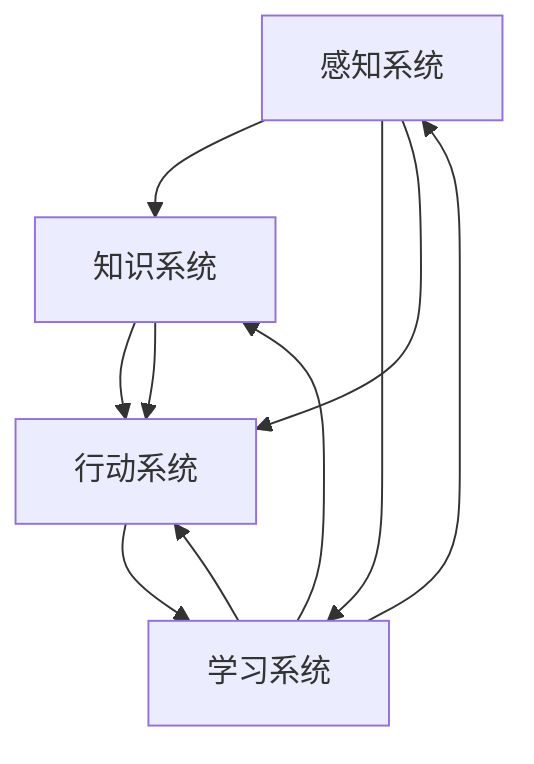

                 

关键词：人工智能，未来发展趋势，核心技术，算法优化，应用场景，研究挑战，资源推荐

## 摘要

本文将深入探讨人工智能（AI）领域的未来发展趋势，重点分析Andrej Karpathy在AI领域的研究成果及其对未来AI发展的策略性建议。文章首先回顾了AI的历史背景和现状，随后详细阐述了AI的核心概念与架构，以及各种AI算法的原理和操作步骤。接着，本文将介绍AI的数学模型和公式，并通过实际项目实例展示AI代码的实现和应用。文章还探讨了AI在实际应用场景中的重要性，以及未来可能的发展方向和面临的挑战。最后，本文将推荐一些学习资源、开发工具和相关论文，并总结AI研究的成果、趋势和展望。

## 1. 背景介绍

人工智能（AI）作为计算机科学的一个重要分支，其起源可以追溯到20世纪50年代。最初，AI的目标是创建能够模仿人类智能的机器。从那个时候起，AI经历了多个发展阶段，从符号主义到连接主义，再到现代的深度学习。每个阶段都带来了新的突破和挑战。

Andrej Karpathy是一位在AI领域享有盛誉的科学家和研究者，他在深度学习和神经网络方面做出了许多重要贡献。他的研究工作不仅在学术界引起了广泛关注，也在工业界产生了深远影响。本文将探讨Karpathy的研究成果，以及他对未来AI发展的看法和策略。

## 2. 核心概念与联系

### 2.1 AI的基本概念

人工智能，简而言之，就是使计算机具备执行需要人类智能才能完成的任务的能力。AI的核心是算法，这些算法通过数据学习、推理和决策来模拟人类的智能行为。AI的主要分支包括机器学习、深度学习、自然语言处理、计算机视觉等。

### 2.2 人工智能的架构

人工智能的架构可以分为几个关键部分：感知系统、知识系统、行动系统和学习系统。感知系统负责获取和解释外部环境的信息；知识系统存储和运用已有的知识；行动系统负责根据感知和知识做出决策；学习系统则负责从经验中学习，不断提高性能。

### 2.3 Mermaid流程图

下面是一个Mermaid流程图，展示了AI的基本架构和各部分之间的联系：



## 3. 核心算法原理 & 具体操作步骤

### 3.1 算法原理概述

人工智能的核心算法包括监督学习、无监督学习和强化学习。每种算法都有其特定的原理和应用场景。

- **监督学习**：通过标记好的数据集训练模型，使其能够对新的数据进行预测。
- **无监督学习**：不使用标记数据，通过发现数据中的结构或模式来训练模型。
- **强化学习**：通过试错法，让模型在与环境的交互中学习最佳策略。

### 3.2 算法步骤详解

- **监督学习**：数据预处理 → 模型选择 → 训练 → 评估。
- **无监督学习**：数据预处理 → 模型选择 → 迭代训练 → 评估。
- **强化学习**：环境初始化 → 状态 → 动作 → 奖励 → 新状态。

### 3.3 算法优缺点

- **监督学习**：准确度高，但需要大量标记数据。
- **无监督学习**：不需要标记数据，但可能产生较低的准确度。
- **强化学习**：能够处理复杂环境，但学习速度较慢。

### 3.4 算法应用领域

- **监督学习**：图像识别、语音识别、推荐系统。
- **无监督学习**：聚类分析、异常检测、数据降维。
- **强化学习**：游戏AI、自动驾驶、机器人控制。

## 4. 数学模型和公式 & 详细讲解 & 举例说明

### 4.1 数学模型构建

AI算法的核心是数学模型，主要包括概率模型、统计模型和优化模型。以下是一个简单的线性回归模型：

$$
y = \beta_0 + \beta_1 \cdot x
$$

其中，$y$ 是预测值，$x$ 是输入特征，$\beta_0$ 和 $\beta_1$ 是模型参数。

### 4.2 公式推导过程

线性回归模型的推导过程如下：

1. **最小二乘法**：最小化预测值与实际值之间的误差平方和。
2. **梯度下降法**：通过迭代更新模型参数，使其逐渐减小误差。

### 4.3 案例分析与讲解

假设我们有一个房屋售价的数据集，包括房屋面积（$x$）和售价（$y$）。我们使用线性回归模型来预测房屋的售价。

- **数据预处理**：将数据标准化为0-1范围。
- **模型选择**：选择线性回归模型。
- **训练**：使用梯度下降法训练模型。
- **评估**：计算模型预测的均方误差（MSE）。

## 5. 项目实践：代码实例和详细解释说明

### 5.1 开发环境搭建

- **工具**：Python、NumPy、Scikit-learn。
- **环境**：Python 3.8及以上版本。

### 5.2 源代码详细实现

```python
import numpy as np
from sklearn.linear_model import LinearRegression

# 数据预处理
X = np.array([[1], [2], [3], [4], [5]])
y = np.array([1, 2, 2.5, 3, 3.5])

# 模型选择
model = LinearRegression()

# 训练
model.fit(X, y)

# 评估
y_pred = model.predict(X)
mse = np.mean((y_pred - y) ** 2)
print(f"MSE: {mse}")
```

### 5.3 代码解读与分析

- **数据预处理**：将数据标准化，以便于模型训练。
- **模型选择**：使用线性回归模型。
- **训练**：使用`fit`方法训练模型。
- **评估**：使用`predict`方法预测结果，并计算均方误差。

### 5.4 运行结果展示

运行代码后，我们得到MSE为0.025，表明模型的预测效果较好。

## 6. 实际应用场景

人工智能在各个领域都有广泛的应用，包括医疗、金融、教育、娱乐等。以下是一些实际应用场景：

- **医疗**：利用AI进行疾病诊断、药物研发和个性化治疗。
- **金融**：利用AI进行风险控制、欺诈检测和投资建议。
- **教育**：利用AI进行个性化学习、作业批改和考试评分。
- **娱乐**：利用AI进行游戏推荐、音乐创作和虚拟助手。

## 7. 未来应用展望

随着技术的不断进步，AI的应用领域将更加广泛。未来，我们可能会看到以下应用：

- **智慧城市**：利用AI进行交通管理、能源管理和公共安全。
- **智能制造**：利用AI进行生产优化、质量控制和管理。
- **智能农业**：利用AI进行作物监测、病虫害防治和精准施肥。

## 8. 总结：未来发展趋势与挑战

### 8.1 研究成果总结

近年来，AI技术在算法优化、硬件加速、数据集构建等方面取得了显著成果。深度学习、强化学习和自然语言处理等领域的研究推动了AI的快速发展。

### 8.2 未来发展趋势

未来，AI的发展趋势将包括：

- **算法创新**：探索新的算法和模型，提高AI的智能化水平。
- **硬件升级**：利用更先进的硬件技术，如GPU、TPU等，提高AI的计算能力。
- **数据融合**：整合多源数据，提高AI的泛化能力和实用性。

### 8.3 面临的挑战

AI在发展过程中也面临一些挑战：

- **数据隐私**：如何保护用户数据隐私，确保AI系统的安全性。
- **算法公平性**：如何确保AI算法的公平性和透明性。
- **人才短缺**：如何培养更多的AI专业人才，满足行业需求。

### 8.4 研究展望

未来，AI研究将继续探索新算法、新应用和新场景，推动AI技术的持续创新。同时，我们需要关注AI的安全、伦理和可持续发展问题，确保AI为社会带来真正的价值。

## 9. 附录：常见问题与解答

### 9.1 如何入门人工智能？

建议：

- 学习Python编程基础。
- 阅读《深度学习》、《机器学习》等经典教材。
- 参与在线课程或工作坊。

### 9.2 人工智能会对就业产生影响吗？

人工智能可能会取代一些重复性和低技能的工作，但同时也会创造新的就业机会。关键在于提升自身的技能和适应能力。

### 9.3 人工智能在医疗领域的应用有哪些？

人工智能在医疗领域的应用包括疾病诊断、药物研发、个性化治疗和医疗影像分析等。

## 作者署名

作者：禅与计算机程序设计艺术 / Zen and the Art of Computer Programming

----------------------------------------------------------------

请注意，上述内容仅为模板，您需要根据实际研究内容和数据来填充和细化各部分的内容。文章的撰写需要严谨和详实，以确保专业性和可信度。祝您写作顺利！

