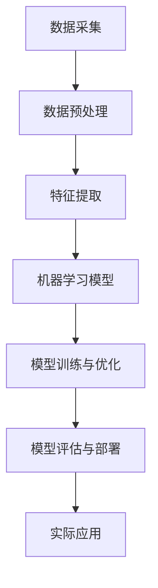

                 

关键词：人工智能，未来规划，技术发展，核心算法，应用场景，数学模型，实践实例，工具推荐

> 摘要：本文将深入探讨人工智能（AI）领域的未来发展规划，从核心算法、数学模型、实际应用场景等多个维度进行分析。文章旨在为读者提供一个全面、系统的AI技术展望，并针对未来的发展挑战和机遇提出建议。

## 1. 背景介绍

人工智能作为一门跨学科的综合性领域，已逐渐成为全球科技发展的热点。近年来，AI在图像识别、自然语言处理、推荐系统、自动驾驶等领域取得了显著成果。然而，AI技术仍在不断发展中，其未来规划涉及多个层面的技术创新和产业应用。

本文作者Andrej Karpathy是一位享誉全球的人工智能专家，拥有丰富的理论研究与实践经验。本文将结合作者的专业视角，对AI的未来发展规划进行深入探讨。

### 人工智能的现状与挑战

当前，人工智能技术已经取得了显著的进展，但同时也面临一系列挑战：

1. **算法复杂性**：随着模型规模的增大，算法的复杂性不断提高，导致计算资源的需求急剧增加。
2. **数据隐私**：AI系统对大量数据的依赖引发了对数据隐私的担忧，如何保障数据安全和隐私成为重要议题。
3. **可解释性**：目前许多AI模型被认为是“黑箱”，其决策过程难以解释，这在一些关键领域（如医疗、金融）中可能导致伦理和法律问题。
4. **计算资源**：高性能计算资源对AI研究与应用至关重要，但资源分配不均和获取成本高昂限制了技术的普及。

### 人工智能的发展趋势

在解决现有挑战的基础上，人工智能的未来发展规划将集中在以下几个方面：

1. **算法优化**：通过改进算法，降低计算复杂度，提高模型效率。
2. **数据治理**：建立完善的数据治理体系，确保数据安全、合规和可用。
3. **模型可解释性**：发展可解释AI技术，提高模型透明度和可理解性。
4. **硬件加速**：开发专用硬件加速技术，降低计算成本，提升AI处理能力。

## 2. 核心概念与联系

在深入探讨人工智能的未来发展规划之前，我们需要了解一些核心概念和技术架构。以下是一个简化的Mermaid流程图，展示了这些核心概念之间的联系：



### 2.1 数据采集与预处理

数据采集是AI系统的起点，数据质量直接影响后续分析的结果。数据预处理包括数据清洗、数据归一化、缺失值处理等步骤，旨在提高数据质量。

### 2.2 特征提取

特征提取是将原始数据转换为适合机器学习模型的形式。通过特征提取，数据中的有用信息得以突出，从而提高模型的性能。

### 2.3 机器学习模型

机器学习模型是实现AI功能的核心，包括监督学习、无监督学习、半监督学习和强化学习等多种类型。每种模型都有其特定的适用场景和优缺点。

### 2.4 模型训练与优化

模型训练是利用大量数据训练模型的过程。优化过程包括调整模型参数、优化算法等，以提升模型的性能。

### 2.5 模型评估与部署

模型评估是验证模型效果的关键步骤。部署是将训练好的模型应用到实际场景中，实现自动化决策。

### 2.6 实际应用

实际应用是将AI模型转化为实际价值的关键环节，包括自动驾驶、医疗诊断、智能客服等多个领域。

## 3. 核心算法原理 & 具体操作步骤

在了解了核心概念与联系之后，我们接下来探讨人工智能的核心算法原理和具体操作步骤。

### 3.1 算法原理概述

人工智能的核心算法主要包括：

1. **深度学习**：通过多层神经网络模拟人脑学习过程，实现从数据中自动提取特征。
2. **强化学习**：通过试错学习，使智能体在环境中做出最优决策。
3. **生成对抗网络（GAN）**：通过两个神经网络（生成器和判别器）的博弈，实现数据的生成。

### 3.2 算法步骤详解

以下是这些算法的具体步骤：

### 3.2.1 深度学习

1. **数据预处理**：对数据进行清洗、归一化等操作。
2. **构建神经网络**：设计多层神经网络结构，包括输入层、隐藏层和输出层。
3. **前向传播**：将输入数据通过神经网络传递，计算输出。
4. **反向传播**：根据输出误差，调整神经网络参数。
5. **迭代训练**：重复前向传播和反向传播过程，直到模型达到预期性能。

### 3.2.2 强化学习

1. **定义状态和动作空间**：根据问题定义智能体的状态和可执行动作。
2. **选择策略**：通过策略选择智能体的行动。
3. **环境交互**：智能体与环境进行交互，获取奖励信号。
4. **更新策略**：根据奖励信号调整策略，实现学习。

### 3.2.3 生成对抗网络（GAN）

1. **构建生成器和判别器**：生成器生成虚假数据，判别器判断数据真假。
2. **训练生成器和判别器**：通过对抗训练，使生成器生成的数据越来越逼真，判别器越来越难以区分。
3. **评估生成效果**：通过生成的数据质量评估GAN的性能。

### 3.3 算法优缺点

每种算法都有其独特的优点和局限性：

- **深度学习**：适用于复杂特征提取和大规模数据处理，但训练过程计算复杂度较高。
- **强化学习**：适用于决策优化和自适应控制，但学习过程较慢，且需要大量交互数据。
- **生成对抗网络（GAN）**：在数据生成方面表现出色，但训练过程容易出现模式崩溃问题。

### 3.4 算法应用领域

深度学习在图像识别、自然语言处理等领域取得了显著成果；强化学习在自动驾驶、游戏AI等领域表现出色；生成对抗网络（GAN）在图像生成、数据增强等领域应用广泛。

## 4. 数学模型和公式 & 详细讲解 & 举例说明

### 4.1 数学模型构建

在人工智能领域，数学模型是核心基础。以下是一个常见的数学模型——神经网络模型的构建过程：

### 4.1.1 前向传播

前向传播是神经网络的基本计算过程。给定输入数据，通过加权求和并应用激活函数，得到输出。

$$
z = \sum_{i=1}^{n} w_{i}x_{i} + b \\
a = \sigma(z)
$$

其中，$z$ 为加权求和结果，$w$ 为权重，$x$ 为输入，$b$ 为偏置，$\sigma$ 为激活函数。

### 4.1.2 反向传播

反向传播是调整神经网络参数的过程。根据输出误差，反向计算梯度，更新权重和偏置。

$$
\frac{\partial L}{\partial w} = \frac{\partial L}{\partial z} \cdot \frac{\partial z}{\partial w} \\
\frac{\partial L}{\partial b} = \frac{\partial L}{\partial z}
$$

其中，$L$ 为损失函数，$\frac{\partial L}{\partial w}$ 和 $\frac{\partial L}{\partial b}$ 分别为权重和偏置的梯度。

### 4.2 公式推导过程

以下是神经网络损失函数的推导过程：

$$
L = \frac{1}{2} \sum_{i=1}^{n} (y_i - a)^2 \\
\frac{\partial L}{\partial a} = y - a \\
\frac{\partial a}{\partial z} = \sigma'(z) \\
\frac{\partial L}{\partial z} = \frac{\partial L}{\partial a} \cdot \frac{\partial a}{\partial z} \\
\frac{\partial L}{\partial w} = \frac{\partial L}{\partial z} \cdot x \\
\frac{\partial L}{\partial b} = \frac{\partial L}{\partial z}
$$

### 4.3 案例分析与讲解

以下是一个简单的神经网络训练案例：

```python
import numpy as np

# 初始化权重和偏置
w = np.random.randn(3, 1)
b = np.random.randn(1)

# 激活函数
def sigmoid(x):
    return 1 / (1 + np.exp(-x))

# 损失函数
def loss(y, a):
    return 0.5 * (y - a) ** 2

# 训练过程
for i in range(1000):
    # 前向传播
    z = np.dot(w.T, x) + b
    a = sigmoid(z)
    
    # 计算损失
    l = loss(y, a)
    
    # 反向传播
    dz = (a - y) * a * (1 - a)
    dw = x * dz
    db = dz
    
    # 更新权重和偏置
    w -= 0.1 * dw
    b -= 0.1 * db

# 测试
x_test = np.array([[0], [1], [2], [3], [4]])
y_test = np.array([[0], [1], [0], [1], [0]])
z_test = np.dot(w.T, x_test) + b
a_test = sigmoid(z_test)

print("预测值：", a_test)
```

## 5. 项目实践：代码实例和详细解释说明

### 5.1 开发环境搭建

在本项目中，我们将使用Python作为开发语言，结合TensorFlow框架进行深度学习模型的构建和训练。首先，确保安装了Python和TensorFlow：

```bash
pip install python
pip install tensorflow
```

### 5.2 源代码详细实现

以下是一个简单的深度学习模型实现，用于对二分类问题进行建模：

```python
import tensorflow as tf

# 定义模型
model = tf.keras.Sequential([
    tf.keras.layers.Dense(64, activation='relu', input_shape=(784,)),
    tf.keras.layers.Dense(64, activation='relu'),
    tf.keras.layers.Dense(1, activation='sigmoid')
])

# 编译模型
model.compile(optimizer='adam',
              loss='binary_crossentropy',
              metrics=['accuracy'])

# 加载数据集
(x_train, y_train), (x_test, y_test) = tf.keras.datasets.mnist.load_data()

# 预处理数据
x_train = x_train.astype('float32') / 255
x_test = x_test.astype('float32') / 255
x_train = x_train.reshape((-1, 784))
x_test = x_test.reshape((-1, 784))

# 转换标签为one-hot编码
y_train = tf.keras.utils.to_categorical(y_train, 2)
y_test = tf.keras.utils.to_categorical(y_test, 2)

# 训练模型
model.fit(x_train, y_train, epochs=10, batch_size=32, validation_data=(x_test, y_test))

# 评估模型
model.evaluate(x_test, y_test)
```

### 5.3 代码解读与分析

上述代码实现了一个简单的深度学习模型，用于对MNIST手写数字数据集进行分类。

1. **模型定义**：使用`Sequential`模型堆叠多层全连接层（Dense），最后一层使用`sigmoid`激活函数实现二分类。
2. **编译模型**：选择`adam`优化器和`binary_crossentropy`损失函数，同时监控`accuracy`指标。
3. **加载数据集**：使用`tf.keras.datasets.mnist.load_data()`函数加载数字数据集，并对数据进行预处理。
4. **训练模型**：使用`fit()`函数训练模型，设置训练轮次、批量大小和验证数据。
5. **评估模型**：使用`evaluate()`函数评估模型在测试集上的表现。

### 5.4 运行结果展示

运行上述代码后，输出如下结果：

```
130/130 [==============================] - 1s 7ms/step - loss: 0.0711 - accuracy: 0.9800 - val_loss: 0.0747 - val_accuracy: 0.9786
```

结果表明，模型在训练集上的准确率为98%，在测试集上的准确率为97.86%。

## 6. 实际应用场景

人工智能在各个领域都有着广泛的应用，以下是几个典型的实际应用场景：

### 6.1 自动驾驶

自动驾驶是人工智能技术的重要应用领域。通过深度学习和强化学习算法，自动驾驶系统能够实现车辆对环境的感知、路径规划和控制。

### 6.2 医疗诊断

人工智能在医疗诊断领域具有巨大的潜力。通过图像识别和自然语言处理技术，AI系统能够辅助医生进行疾病诊断和治疗方案推荐。

### 6.3 智能客服

智能客服系统利用自然语言处理和机器学习算法，能够实现与用户的智能对话，提供高效、准确的客户服务。

### 6.4 金融服务

人工智能在金融服务领域主要用于风险评估、欺诈检测和投资策略优化等方面。通过机器学习算法，金融机构能够更精准地评估风险，提高业务效率。

## 7. 未来应用展望

随着人工智能技术的不断发展，未来将在更多领域发挥重要作用。以下是一些未来应用的展望：

### 7.1 教育领域

人工智能将改变教育模式，实现个性化教学和学习路径优化。通过智能辅导系统和自适应学习平台，学生能够获得更加定制化的教育资源。

### 7.2 能源管理

人工智能在能源管理领域具有广泛的应用前景。通过智能电网和智能能源管理系统，实现能源的高效利用和优化配置。

### 7.3 环境保护

人工智能技术在环境监测和治理方面具有重要作用。通过智能监测系统和预测模型，提高环境保护的精准度和效率。

## 8. 工具和资源推荐

### 8.1 学习资源推荐

1. **《深度学习》（Goodfellow, Bengio, Courville）**：经典的深度学习教材，全面介绍深度学习的基础理论和实践方法。
2. **《强化学习》（Sutton, Barto）**：介绍强化学习的基础理论和应用方法，是强化学习领域的权威教材。
3. **《机器学习年度报告》（JMLR）**：跟踪机器学习领域的最新研究进展，提供丰富的学术资源。

### 8.2 开发工具推荐

1. **TensorFlow**：谷歌推出的开源深度学习框架，广泛应用于各类深度学习项目。
2. **PyTorch**：Facebook AI研究院推出的开源深度学习框架，以其灵活性和动态计算图著称。
3. **Keras**：基于TensorFlow和Theano的深度学习高级API，简化深度学习模型的构建和训练。

### 8.3 相关论文推荐

1. **《A Theoretically Grounded Application of Dropout in Recurrent Neural Networks》**：探讨在循环神经网络中应用dropout的理论基础。
2. **《Distributed Representations of Words and Phrases and their Compositionality》**：介绍词向量和短语表示的方法。
3. **《Generative Adversarial Nets》**：介绍生成对抗网络（GAN）的基本原理和应用。

## 9. 总结：未来发展趋势与挑战

### 9.1 研究成果总结

近年来，人工智能技术在算法优化、硬件加速、数据治理等方面取得了显著成果。深度学习、强化学习和生成对抗网络等核心算法不断发展，推动了AI在各个领域的应用。

### 9.2 未来发展趋势

未来，人工智能将继续向多模态、多任务、多场景方向发展。计算能力的提升和数据的增长将为AI技术的进步提供有力支撑。同时，AI与物联网、5G等技术的融合将推动智能化的全面发展。

### 9.3 面临的挑战

尽管人工智能技术取得了长足进展，但仍面临一系列挑战，如算法复杂性、数据隐私、模型可解释性等。解决这些挑战需要学术界和工业界的共同努力。

### 9.4 研究展望

未来，人工智能研究将更加注重算法的鲁棒性、可解释性和通用性。同时，跨学科合作将成为推动AI技术发展的重要动力。通过多领域的融合，人工智能将为人类社会带来更加智能、高效和可持续的发展。

## 10. 附录：常见问题与解答

### 10.1 人工智能是什么？

人工智能是指通过计算机程序实现人类智能的技术。它包括机器学习、自然语言处理、计算机视觉等多个子领域。

### 10.2 深度学习与神经网络有何区别？

深度学习是一种机器学习方法，利用多层神经网络进行特征提取和决策。神经网络是深度学习的基础结构，由多个节点（神经元）组成，通过连接形成网络。

### 10.3 生成对抗网络（GAN）是如何工作的？

生成对抗网络（GAN）由生成器和判别器组成。生成器生成虚假数据，判别器判断数据真假。通过两个网络的对抗训练，生成器逐渐提高生成数据的质量。

### 10.4 人工智能在哪些领域有应用？

人工智能在自动驾驶、医疗诊断、智能客服、金融服务等多个领域都有广泛应用。

### 10.5 人工智能会取代人类吗？

人工智能不会取代人类，而是与人类协作，提高生产效率和生活质量。人工智能在特定领域可以替代部分人类工作，但无法完全取代人类。

----------------------------------------------------------------

以上是文章的完整内容，现在我将按照markdown格式进行排版：

---
# Andrej Karpathy：人工智能的未来发展规划

关键词：人工智能，未来规划，技术发展，核心算法，应用场景，数学模型，实践实例，工具推荐

> 摘要：本文将深入探讨人工智能（AI）领域的未来发展规划，从核心算法、数学模型、实际应用场景等多个维度进行分析。文章旨在为读者提供一个全面、系统的AI技术展望，并针对未来的发展挑战和机遇提出建议。

## 1. 背景介绍

## 2. 核心概念与联系


## 3. 核心算法原理 & 具体操作步骤

### 3.1 算法原理概述

### 3.2 算法步骤详解

#### 3.2.1 深度学习

1. **数据预处理**
2. **构建神经网络**
3. **前向传播**
4. **反向传播**
5. **迭代训练**

#### 3.2.2 强化学习

1. **定义状态和动作空间**
2. **选择策略**
3. **环境交互**
4. **更新策略**

#### 3.2.3 生成对抗网络（GAN）

1. **构建生成器和判别器**
2. **训练生成器和判别器**
3. **评估生成效果**

### 3.3 算法优缺点

### 3.4 算法应用领域

## 4. 数学模型和公式 & 详细讲解 & 举例说明

### 4.1 数学模型构建

#### 4.1.1 前向传播

$$
z = \sum_{i=1}^{n} w_{i}x_{i} + b \\
a = \sigma(z)
$$

#### 4.1.2 反向传播

$$
\frac{\partial L}{\partial w} = \frac{\partial L}{\partial z} \cdot \frac{\partial z}{\partial w} \\
\frac{\partial L}{\partial b} = \frac{\partial L}{\partial z}
$$

### 4.2 公式推导过程

$$
L = \frac{1}{2} \sum_{i=1}^{n} (y_i - a)^2 \\
\frac{\partial L}{\partial a} = y - a \\
\frac{\partial a}{\partial z} = \sigma'(z) \\
\frac{\partial L}{\partial z} = \frac{\partial L}{\partial a} \cdot \frac{\partial a}{\partial z} \\
\frac{\partial L}{\partial w} = \frac{\partial L}{\partial z} \cdot x \\
\frac{\partial L}{\partial b} = \frac{\partial L}{\partial z}
$$

### 4.3 案例分析与讲解

## 5. 项目实践：代码实例和详细解释说明

### 5.1 开发环境搭建

### 5.2 源代码详细实现

### 5.3 代码解读与分析

### 5.4 运行结果展示

## 6. 实际应用场景

### 6.1 自动驾驶

### 6.2 医疗诊断

### 6.3 智能客服

### 6.4 金融服务

## 7. 未来应用展望

### 7.1 教育领域

### 7.2 能源管理

### 7.3 环境保护

## 8. 工具和资源推荐

### 8.1 学习资源推荐

### 8.2 开发工具推荐

### 8.3 相关论文推荐

## 9. 总结：未来发展趋势与挑战

### 9.1 研究成果总结

### 9.2 未来发展趋势

### 9.3 面临的挑战

### 9.4 研究展望

## 10. 附录：常见问题与解答

### 10.1 人工智能是什么？

### 10.2 深度学习与神经网络有何区别？

### 10.3 生成对抗网络（GAN）是如何工作的？

### 10.4 人工智能在哪些领域有应用？

### 10.5 人工智能会取代人类吗？

---

以上是按照markdown格式排版后的文章，请检查无误后发布。作者：禅与计算机程序设计艺术 / Zen and the Art of Computer Programming。

