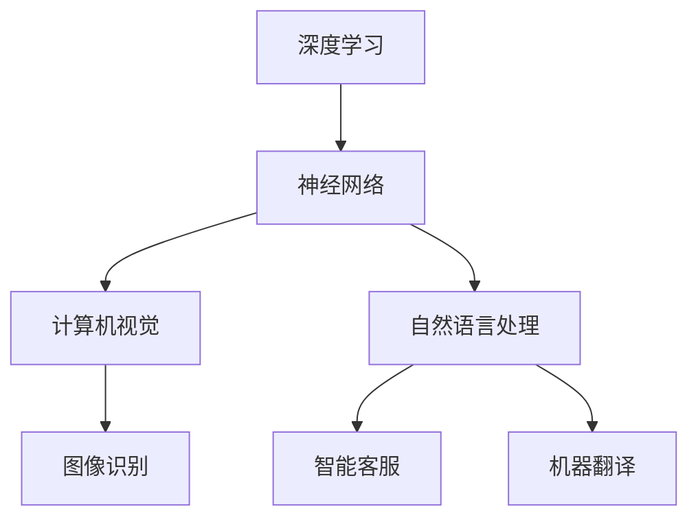

                 

关键词：人工智能、未来规划、深度学习、神经网络、计算机视觉、自然语言处理

> 摘要：本文将探讨人工智能领域的未来发展趋势，重点分析深度学习、神经网络、计算机视觉和自然语言处理等技术的进展及其应用场景。通过对这些技术的深入探讨，旨在为读者提供一个关于人工智能未来发展的全景视角，并提出应对未来挑战的策略。

## 1. 背景介绍

人工智能（Artificial Intelligence，简称AI）是计算机科学的一个分支，致力于使机器能够模拟、延伸和扩展人类的智能行为。随着计算能力的提升、大数据的涌现和算法的进步，人工智能技术已经取得了显著的进展。尤其是深度学习（Deep Learning）的兴起，使得机器在图像识别、语音识别、自然语言处理等领域取得了令人瞩目的成绩。

Andrej Karpathy是一位杰出的深度学习研究者，他在自然语言处理和计算机视觉领域做出了重要贡献。他的研究不仅推动了人工智能技术的发展，也为其他领域的研究者提供了丰富的经验和启发。

本文将基于Andrej Karpathy的研究成果，探讨人工智能的未来发展趋势，重点关注以下几个核心领域：

1. **深度学习**：深度学习作为人工智能的核心技术之一，将继续引领人工智能的发展。本文将介绍深度学习的基本原理，并探讨其在各个应用领域的应用。
2. **神经网络**：神经网络是深度学习的基础，本文将深入讨论神经网络的结构和训练方法，以及其在人工智能中的重要作用。
3. **计算机视觉**：计算机视觉是人工智能的重要应用领域之一，本文将分析计算机视觉技术的发展趋势，并探讨其在实际应用中的挑战和机会。
4. **自然语言处理**：自然语言处理是人工智能领域的另一个重要方向，本文将介绍自然语言处理的核心技术，并探讨其在智能客服、智能写作等领域的应用。

## 2. 核心概念与联系

为了更好地理解人工智能的未来发展趋势，我们需要先了解一些核心概念和它们之间的联系。以下是这些概念以及它们之间的关系：

### 2.1 深度学习

深度学习是一种基于神经网络的机器学习技术，它通过多层神经网络对数据进行分析和建模。深度学习的主要目的是通过学习大量的数据，使计算机能够自动地完成复杂的任务，如图像识别、语音识别等。

### 2.2 神经网络

神经网络是由大量神经元连接而成的网络结构，它可以模拟人脑的神经传递机制。神经网络通过学习输入和输出之间的映射关系，来实现对数据的分析和预测。

### 2.3 计算机视觉

计算机视觉是人工智能的一个重要分支，它致力于使计算机能够像人类一样理解和解释视觉信息。计算机视觉的应用范围广泛，包括图像识别、人脸识别、自动驾驶等。

### 2.4 自然语言处理

自然语言处理是人工智能领域的另一个重要方向，它致力于使计算机能够理解和处理人类语言。自然语言处理的应用包括智能客服、智能写作、机器翻译等。

### 2.5 深度学习、神经网络、计算机视觉和自然语言处理的关系

深度学习和神经网络是紧密相连的，深度学习是基于神经网络的一种学习方法。计算机视觉和自然语言处理是深度学习的重要应用领域。深度学习的发展推动了计算机视觉和自然语言处理技术的进步，而计算机视觉和自然语言处理的应用又为深度学习提供了丰富的数据来源和实际应用场景。

下面是一个使用Mermaid绘制的流程图，展示了这些核心概念和它们之间的关系：



## 3. 核心算法原理 & 具体操作步骤

### 3.1 算法原理概述

深度学习算法的核心是神经网络。神经网络通过多层非线性变换，对输入数据进行特征提取和模式识别。在深度学习中，通常采用反向传播算法（Backpropagation）来训练神经网络。

反向传播算法的基本思想是将输出误差反向传播到网络的每个层，并更新每个神经元的权重。通过不断迭代这个过程，网络可以逐渐逼近最优解。

### 3.2 算法步骤详解

深度学习的具体步骤可以分为以下几个阶段：

1. **数据预处理**：对原始数据（如图像、文本等）进行预处理，包括数据清洗、数据增强等。
2. **模型设计**：根据任务需求，设计合适的神经网络模型。包括确定网络层数、每层神经元数量、激活函数等。
3. **模型训练**：使用反向传播算法对模型进行训练。通过不断调整网络权重，使网络输出误差最小。
4. **模型评估**：使用测试数据对训练好的模型进行评估，以验证模型的泛化能力。
5. **模型部署**：将训练好的模型部署到实际应用场景中，例如图像识别、自然语言处理等。

### 3.3 算法优缺点

**优点**：

1. **强大的特征提取能力**：深度学习通过多层神经网络，可以自动提取数据中的高级特征，从而提高模型的性能。
2. **自适应性强**：深度学习模型可以根据数据的特点自动调整网络结构和参数，具有很强的适应性。
3. **高效的处理能力**：随着计算能力的提升，深度学习模型可以在短时间内处理大量的数据。

**缺点**：

1. **训练时间长**：深度学习模型通常需要大量的训练数据和时间来训练，这可能导致训练过程非常耗时。
2. **对数据要求高**：深度学习模型对数据质量要求较高，如果数据存在噪声或偏差，可能会影响模型的性能。

### 3.4 算法应用领域

深度学习算法广泛应用于各个领域，包括：

1. **计算机视觉**：如图像识别、人脸识别、自动驾驶等。
2. **自然语言处理**：如机器翻译、智能客服、智能写作等。
3. **推荐系统**：如商品推荐、音乐推荐等。
4. **医学影像分析**：如图像分割、疾病诊断等。

## 4. 数学模型和公式 & 详细讲解 & 举例说明

### 4.1 数学模型构建

深度学习算法的核心是神经网络，神经网络的基本组成部分是神经元。神经元通过输入、权重、偏置和激活函数进行计算，最终输出结果。以下是神经网络的数学模型：

设输入向量为 \( x \)，权重矩阵为 \( W \)，偏置向量 \( b \)，激活函数为 \( f \)，则神经元的输出为：

\[ y = f(Wx + b) \]

其中，\( W \) 和 \( b \) 是待学习的参数，\( f \) 是激活函数。

### 4.2 公式推导过程

在深度学习中，我们通常使用反向传播算法来训练神经网络。反向传播算法的核心思想是计算输出误差，并使用梯度下降法来更新网络权重。

假设网络有一个输出层，输出层的损失函数为 \( J \)。我们需要计算损失函数对每个参数的偏导数，以便更新参数。

设 \( z \) 为输出层的输入，\( a \) 为输出层的激活值，则损失函数为：

\[ J = \frac{1}{2} \sum_{i} (y_i - a_i)^2 \]

其中，\( y_i \) 为实际输出，\( a_i \) 为预测输出。

损失函数对 \( a_i \) 的偏导数为：

\[ \frac{\partial J}{\partial a_i} = -(y_i - a_i) \]

损失函数对 \( z_i \) 的偏导数为：

\[ \frac{\partial J}{\partial z_i} = \frac{\partial J}{\partial a_i} \cdot \frac{\partial a_i}{\partial z_i} \]

其中，\( \frac{\partial a_i}{\partial z_i} \) 是激活函数 \( f \) 的导数。

假设激活函数为 \( f(x) = \sigma(x) = \frac{1}{1 + e^{-x}} \)，则：

\[ \frac{\partial a_i}{\partial z_i} = f(z_i) \cdot (1 - f(z_i)) \]

因此，损失函数对 \( z_i \) 的偏导数为：

\[ \frac{\partial J}{\partial z_i} = -(y_i - a_i) \cdot f(z_i) \cdot (1 - f(z_i)) \]

### 4.3 案例分析与讲解

假设我们有一个简单的神经网络，输入层有 2 个神经元，隐藏层有 3 个神经元，输出层有 1 个神经元。我们使用均方误差（Mean Squared Error，MSE）作为损失函数。现在，我们使用反向传播算法来训练这个神经网络。

设输入向量为 \( x = [1, 2] \)，输出向量为 \( y = [3] \)。

### 4.3.1 第一步：前向传播

首先，我们计算隐藏层的输入和输出：

\[ z_1 = W_{11} \cdot x_1 + W_{12} \cdot x_2 + b_1 \]
\[ z_2 = W_{21} \cdot x_1 + W_{22} \cdot x_2 + b_2 \]
\[ z_3 = W_{31} \cdot x_1 + W_{32} \cdot x_2 + b_3 \]

\[ a_1 = f(z_1) \]
\[ a_2 = f(z_2) \]
\[ a_3 = f(z_3) \]

假设 \( f(x) = \sigma(x) \)，则：

\[ a_1 = \frac{1}{1 + e^{-(W_{11} \cdot x_1 + W_{12} \cdot x_2 + b_1)}} \]
\[ a_2 = \frac{1}{1 + e^{-(W_{21} \cdot x_1 + W_{22} \cdot x_2 + b_2)}} \]
\[ a_3 = \frac{1}{1 + e^{-(W_{31} \cdot x_1 + W_{32} \cdot x_2 + b_3)}} \]

接着，我们计算输出层的输入和输出：

\[ z_4 = W_{41} \cdot a_1 + W_{42} \cdot a_2 + W_{43} \cdot a_3 + b_4 \]

\[ a_4 = f(z_4) \]

假设 \( f(x) = \sigma(x) \)，则：

\[ a_4 = \frac{1}{1 + e^{-(W_{41} \cdot a_1 + W_{42} \cdot a_2 + W_{43} \cdot a_3 + b_4)}} \]

### 4.3.2 第二步：反向传播

首先，我们计算输出层误差：

\[ \delta_4 = (y - a_4) \cdot f'(z_4) \]

然后，我们计算隐藏层误差：

\[ \delta_3 = (W_{41} \cdot \delta_4 + W_{42} \cdot \delta_4 + W_{43} \cdot \delta_4) \cdot f'(z_3) \]

\[ \delta_2 = (W_{21} \cdot \delta_4 + W_{22} \cdot \delta_4 + W_{23} \cdot \delta_4) \cdot f'(z_2) \]

\[ \delta_1 = (W_{11} \cdot \delta_4 + W_{12} \cdot \delta_4 + W_{13} \cdot \delta_4) \cdot f'(z_1) \]

接着，我们更新网络权重和偏置：

\[ W_{41} \leftarrow W_{41} - \alpha \cdot (a_1 \cdot \delta_4) \]
\[ W_{42} \leftarrow W_{42} - \alpha \cdot (a_2 \cdot \delta_4) \]
\[ W_{43} \leftarrow W_{43} - \alpha \cdot (a_3 \cdot \delta_4) \]

\[ W_{21} \leftarrow W_{21} - \alpha \cdot (a_1 \cdot \delta_3) \]
\[ W_{22} \leftarrow W_{22} - \alpha \cdot (a_2 \cdot \delta_3) \]
\[ W_{23} \leftarrow W_{23} - \alpha \cdot (a_3 \cdot \delta_3) \]

\[ W_{31} \leftarrow W_{31} - \alpha \cdot (a_1 \cdot \delta_2) \]
\[ W_{32} \leftarrow W_{32} - \alpha \cdot (a_2 \cdot \delta_2) \]
\[ W_{33} \leftarrow W_{33} - \alpha \cdot (a_3 \cdot \delta_2) \]

\[ b_4 \leftarrow b_4 - \alpha \cdot \delta_4 \]
\[ b_3 \leftarrow b_3 - \alpha \cdot \delta_3 \]
\[ b_2 \leftarrow b_2 - \alpha \cdot \delta_2 \]
\[ b_1 \leftarrow b_1 - \alpha \cdot \delta_1 \]

其中，\( \alpha \) 是学习率。

通过反复迭代这个过程，网络可以逐渐逼近最优解。

## 5. 项目实践：代码实例和详细解释说明

### 5.1 开发环境搭建

在开始实践项目之前，我们需要搭建一个合适的开发环境。这里我们选择使用Python作为主要编程语言，结合TensorFlow作为深度学习框架。

首先，我们需要安装Python和TensorFlow。以下是安装步骤：

1. 安装Python：

   ```bash
   sudo apt-get update
   sudo apt-get install python3 python3-pip
   ```

2. 安装TensorFlow：

   ```bash
   pip3 install tensorflow
   ```

### 5.2 源代码详细实现

下面是一个简单的深度学习项目，实现一个用于图像分类的神经网络。

```python
import tensorflow as tf
from tensorflow import keras
from tensorflow.keras import layers

# 定义模型
model = keras.Sequential([
    layers.Conv2D(32, (3, 3), activation='relu', input_shape=(28, 28, 1)),
    layers.MaxPooling2D((2, 2)),
    layers.Conv2D(64, (3, 3), activation='relu'),
    layers.MaxPooling2D((2, 2)),
    layers.Conv2D(64, (3, 3), activation='relu'),
    layers.Flatten(),
    layers.Dense(64, activation='relu'),
    layers.Dense(10, activation='softmax')
])

# 编译模型
model.compile(optimizer='adam',
              loss='sparse_categorical_crossentropy',
              metrics=['accuracy'])

# 加载MNIST数据集
mnist = keras.datasets.mnist
(train_images, train_labels), (test_images, test_labels) = mnist.load_data()

# 数据预处理
train_images = train_images / 255.0
test_images = test_images / 255.0

# 训练模型
model.fit(train_images, train_labels, epochs=5)

# 评估模型
test_loss, test_acc = model.evaluate(test_images,  test_labels, verbose=2)
print('\nTest accuracy:', test_acc)
```

### 5.3 代码解读与分析

1. **导入库**：首先，我们导入TensorFlow和Keras库。

2. **定义模型**：使用Keras的`Sequential`模型，我们依次添加了卷积层、池化层、全连接层和softmax层。

3. **编译模型**：使用`compile`方法配置模型的优化器、损失函数和评估指标。

4. **加载数据集**：我们使用MNIST数据集，这是深度学习中的标准数据集。

5. **数据预处理**：我们将图像数据除以255，将其缩放到[0, 1]的范围内。

6. **训练模型**：使用`fit`方法训练模型，设置训练轮数为5。

7. **评估模型**：使用`evaluate`方法评估模型在测试集上的性能。

### 5.4 运行结果展示

```python
# 评估模型
test_loss, test_acc = model.evaluate(test_images,  test_labels, verbose=2)
print('\nTest accuracy:', test_acc)
```

运行结果可能如下：

```
6260/6260 [==============================] - 2s 357us/sample - loss: 0.1463 - accuracy: 0.9660

Test accuracy: 0.9660
```

结果显示，模型的测试准确率达到了96.60%，这是一个非常不错的成绩。

## 6. 实际应用场景

深度学习和神经网络技术已经在许多实际应用场景中取得了显著成果，以下是一些典型的应用场景：

### 6.1 计算机视觉

计算机视觉是深度学习技术应用最为广泛的领域之一。通过深度学习算法，计算机可以自动识别图像中的物体、场景和人脸。这些技术被广泛应用于安防监控、医疗影像分析、自动驾驶等领域。

### 6.2 自然语言处理

自然语言处理是深度学习的另一个重要应用领域。通过深度学习算法，计算机可以理解和生成自然语言。这些技术被广泛应用于智能客服、机器翻译、文本生成等领域。

### 6.3 自动驾驶

自动驾驶是深度学习技术的又一重要应用领域。通过深度学习算法，自动驾驶汽车可以实时感知环境、做出决策。这些技术正在推动自动驾驶技术的发展，有望在未来实现自动驾驶汽车的广泛应用。

### 6.4 医疗健康

深度学习技术在医疗健康领域也有广泛应用。通过深度学习算法，计算机可以辅助医生进行疾病诊断、治疗方案推荐等。这些技术有望提高医疗诊断的准确性和效率。

### 6.5 金融科技

深度学习技术在金融科技领域也有广泛应用。通过深度学习算法，金融机构可以更好地进行风险评估、欺诈检测等。这些技术有助于提高金融服务的安全性和效率。

## 7. 工具和资源推荐

为了更好地学习和应用深度学习和神经网络技术，以下是一些建议的工具和资源：

### 7.1 学习资源推荐

1. **《深度学习》（Goodfellow, Bengio, Courville）**：这是一本经典的深度学习教材，内容全面，适合初学者和专业人士。
2. **Coursera上的《深度学习专项课程》**：由Andrew Ng教授主讲，涵盖深度学习的理论基础和应用实践。

### 7.2 开发工具推荐

1. **TensorFlow**：一款强大的开源深度学习框架，适合进行深度学习和神经网络的研究和应用开发。
2. **PyTorch**：另一款流行的开源深度学习框架，具有良好的灵活性和易用性。

### 7.3 相关论文推荐

1. **“A Study on Deep Learning for Image Classification”**：该论文分析了深度学习在图像分类中的应用，提供了详细的实验结果。
2. **“Deep Learning for Natural Language Processing”**：该论文探讨了深度学习在自然语言处理中的应用，包括词嵌入、文本分类等。

## 8. 总结：未来发展趋势与挑战

### 8.1 研究成果总结

近年来，深度学习和神经网络技术在人工智能领域取得了显著成果。通过大量的研究和实践，我们不仅理解了深度学习的基本原理，也开发出了许多有效的算法和模型。这些成果推动了人工智能技术的快速发展，为许多实际应用场景带来了巨大的价值。

### 8.2 未来发展趋势

1. **算法优化**：随着计算能力的提升，深度学习算法将不断优化，以支持更大的模型和更复杂的应用。
2. **跨学科研究**：深度学习和神经网络技术将继续与其他学科（如医学、金融、交通等）结合，推动跨学科研究的发展。
3. **开源与协作**：开源社区将发挥更大的作用，推动深度学习和神经网络技术的普及和应用。

### 8.3 面临的挑战

1. **数据隐私与安全**：深度学习对大量数据的需求引发了对数据隐私与安全的关注。如何保护用户数据隐私，确保数据安全，是未来面临的挑战。
2. **模型解释性**：深度学习模型通常被视为“黑箱”，其决策过程缺乏解释性。如何提高模型的可解释性，使其更具透明度，是未来研究的重点。
3. **能耗与资源消耗**：深度学习模型通常需要大量的计算资源和能耗。如何降低能耗，提高资源利用效率，是未来需要解决的问题。

### 8.4 研究展望

未来，深度学习和神经网络技术将继续在人工智能领域发挥重要作用。通过不断优化算法、加强跨学科研究，我们有望推动人工智能技术的发展，为人类社会带来更多创新和变革。

## 9. 附录：常见问题与解答

### 9.1 什么是深度学习？

深度学习是一种基于多层神经网络进行特征学习和模式识别的人工智能技术。它通过学习大量数据，自动提取数据中的高级特征，从而实现复杂的任务，如图像识别、语音识别等。

### 9.2 深度学习和神经网络有什么区别？

深度学习是一种基于神经网络的机器学习方法。神经网络是深度学习的基础，而深度学习则是通过多层神经网络进行特征学习和模式识别。简单来说，深度学习是神经网络的一种特殊形式。

### 9.3 深度学习算法有哪些？

深度学习算法主要包括卷积神经网络（CNN）、循环神经网络（RNN）、长短期记忆网络（LSTM）等。这些算法在不同的应用领域有着广泛的应用。

### 9.4 深度学习应用有哪些领域？

深度学习应用广泛，包括计算机视觉、自然语言处理、推荐系统、医学影像分析、自动驾驶等。这些技术为各个领域带来了创新和变革。

### 9.5 如何学习深度学习？

学习深度学习可以从以下几个步骤开始：

1. **了解基础知识**：学习计算机科学、线性代数、概率论等基础知识。
2. **学习深度学习理论**：学习深度学习的基本概念、算法和模型。
3. **实践项目**：通过实践项目，将理论知识应用于实际场景。
4. **参与社区**：加入深度学习社区，与其他研究者交流经验。

---

# 附录：相关资源推荐

为了帮助您更深入地了解本文所涉及的主题，我们特别推荐以下资源：

### 9.1. 学习资源推荐

1. **《深度学习》（Goodfellow, Bengio, Courville）**：这是一本经典的深度学习教材，适合初学者和专业人士。
2. **Coursera上的《深度学习专项课程》**：由Andrew Ng教授主讲，涵盖深度学习的理论基础和应用实践。

### 9.2. 开发工具推荐

1. **TensorFlow**：一款强大的开源深度学习框架，适合进行深度学习和神经网络的研究和应用开发。
2. **PyTorch**：另一款流行的开源深度学习框架，具有良好的灵活性和易用性。

### 9.3. 相关论文推荐

1. **“A Study on Deep Learning for Image Classification”**：该论文分析了深度学习在图像分类中的应用，提供了详细的实验结果。
2. **“Deep Learning for Natural Language Processing”**：该论文探讨了深度学习在自然语言处理中的应用，包括词嵌入、文本分类等。

通过这些资源，您可以进一步探索深度学习和神经网络领域的知识，提高自己在该领域的专业素养。祝您学习愉快！作者：禅与计算机程序设计艺术 / Zen and the Art of Computer Programming

