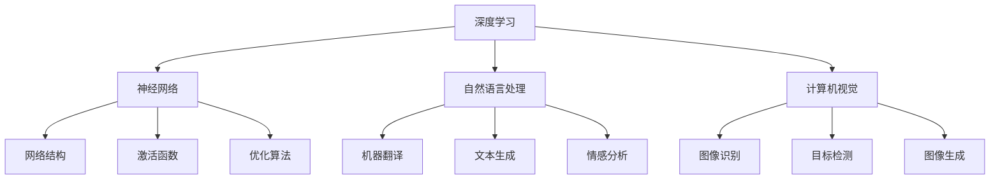

                 

关键词：人工智能，深度学习，神经网络，自然语言处理，计算机视觉，未来趋势，技术挑战

## 摘要

本文将探讨人工智能（AI）的未来发展趋势，重点关注深度学习、神经网络在自然语言处理和计算机视觉领域的应用。通过对核心概念、算法原理、数学模型和实际项目实践的深入分析，我们试图揭示AI技术的发展方向及其面临的挑战。同时，本文还将对相关工具和资源进行推荐，以期为读者提供全面的了解。

## 1. 背景介绍

自20世纪50年代人工智能（AI）的概念首次提出以来，人工智能技术经历了多次起伏。早期的AI主要基于符号推理和知识表示，但随着计算能力的提升和大数据的涌现，深度学习成为AI领域的主流方法。深度学习通过模拟人脑的神经网络结构，实现了对复杂数据的自动特征学习和模式识别。

在自然语言处理（NLP）领域，深度学习模型如长短时记忆网络（LSTM）和Transformer架构取得了突破性进展，使得机器翻译、文本生成和情感分析等任务取得了显著的性能提升。在计算机视觉领域，卷积神经网络（CNN）和生成对抗网络（GAN）的出现，推动了图像识别、图像生成和视频分析等应用的发展。

## 2. 核心概念与联系

### 2.1 深度学习

深度学习是一种基于多层神经网络的学习方法，通过逐层提取数据中的特征，实现对数据的建模。在深度学习中，网络结构、激活函数、优化算法等参数对模型的性能有重要影响。

### 2.2 神经网络

神经网络是深度学习的基础，由大量神经元（节点）和连接（边）组成。神经网络通过调整连接权重，实现对输入数据的映射和预测。

### 2.3 自然语言处理

自然语言处理是AI领域的一个重要分支，旨在使计算机能够理解和处理人类语言。深度学习在NLP中的应用，使得许多语言任务取得了突破性进展。

### 2.4 计算机视觉

计算机视觉是使计算机能够“看”懂图像和视频的技术。深度学习模型在图像分类、目标检测、图像生成等方面表现出色。

### 2.5 Mermaid 流程图



## 3. 核心算法原理 & 具体操作步骤

### 3.1 算法原理概述

深度学习算法基于多层神经网络，通过前向传播和反向传播过程，不断调整网络参数，实现数据的特征学习和预测。

### 3.2 算法步骤详解

1. 数据预处理：对输入数据进行归一化、标准化等处理，以适应神经网络的学习过程。
2. 网络搭建：根据任务需求，设计合适的网络结构，包括层数、节点数、激活函数等。
3. 模型训练：通过前向传播，计算网络的输出，并与真实值进行比较，计算损失函数。
4. 反向传播：根据损失函数，计算网络参数的梯度，并更新参数。
5. 模型评估：在测试集上评估模型的性能，调整超参数，优化模型。

### 3.3 算法优缺点

优点：

- 强大的特征学习能力：能够自动提取复杂数据中的特征。
- 广泛的应用领域：在图像识别、语音识别、自然语言处理等领域都有广泛应用。

缺点：

- 需要大量数据：训练深度学习模型需要大量的数据。
- 需要大量计算资源：深度学习模型训练过程需要大量的计算资源。

### 3.4 算法应用领域

- 自然语言处理：机器翻译、文本生成、情感分析等。
- 计算机视觉：图像识别、目标检测、图像生成等。

## 4. 数学模型和公式 & 详细讲解 & 举例说明

### 4.1 数学模型构建

深度学习模型的核心是多层神经网络，其数学模型可以表示为：

$$
y = f(z) = \sigma(W \cdot z + b)
$$

其中，$y$ 是输出，$z$ 是中间层节点，$W$ 是权重矩阵，$b$ 是偏置项，$\sigma$ 是激活函数。

### 4.2 公式推导过程

1. 前向传播：

$$
z = W \cdot x + b
$$

$$
a = \sigma(z)
$$

2. 反向传播：

$$
\delta_a = \frac{\partial L}{\partial a}
$$

$$
\delta_z = \delta_a \cdot \frac{\partial f}{\partial z}
$$

$$
\delta_W = \delta_z \cdot a^{(L-1)}
$$

$$
\delta_b = \delta_z
$$

### 4.3 案例分析与讲解

以图像分类任务为例，我们使用卷积神经网络（CNN）进行模型构建。

1. 数据预处理：对图像进行归一化处理，将像素值缩放到[0, 1]区间。
2. 网络搭建：设计一个简单的CNN模型，包括卷积层、池化层和全连接层。
3. 模型训练：使用训练数据对模型进行训练，调整网络参数。
4. 模型评估：在测试集上评估模型性能，调整超参数。

## 5. 项目实践：代码实例和详细解释说明

### 5.1 开发环境搭建

1. 安装Python环境。
2. 安装深度学习框架TensorFlow或PyTorch。

### 5.2 源代码详细实现

```python
import tensorflow as tf

# 定义CNN模型
model = tf.keras.Sequential([
    tf.keras.layers.Conv2D(32, (3, 3), activation='relu', input_shape=(28, 28, 1)),
    tf.keras.layers.MaxPooling2D((2, 2)),
    tf.keras.layers.Flatten(),
    tf.keras.layers.Dense(128, activation='relu'),
    tf.keras.layers.Dense(10, activation='softmax')
])

# 编译模型
model.compile(optimizer='adam',
              loss='sparse_categorical_crossentropy',
              metrics=['accuracy'])

# 加载数据
mnist = tf.keras.datasets.mnist
(x_train, y_train), (x_test, y_test) = mnist.load_data()

# 数据预处理
x_train = x_train / 255.0
x_test = x_test / 255.0

# 训练模型
model.fit(x_train, y_train, epochs=5)

# 评估模型
model.evaluate(x_test, y_test)
```

### 5.3 代码解读与分析

这段代码首先导入了TensorFlow库，然后定义了一个简单的CNN模型，包括卷积层、池化层和全连接层。接下来，编译模型并加载数据，对图像进行预处理，最后训练模型并评估模型性能。

## 6. 实际应用场景

深度学习在自然语言处理、计算机视觉等领域有广泛的应用。例如，在自然语言处理领域，深度学习模型被应用于机器翻译、文本生成、情感分析等任务。在计算机视觉领域，深度学习模型被应用于图像识别、目标检测、图像生成等任务。

### 6.4 未来应用展望

随着深度学习技术的不断发展，未来人工智能将在更多领域取得突破。例如，在医疗领域，人工智能可以用于疾病诊断、药物研发等。在工业领域，人工智能可以用于智能制造、自动化控制等。在金融领域，人工智能可以用于风险管理、投资策略等。

## 7. 工具和资源推荐

### 7.1 学习资源推荐

- 《深度学习》（Goodfellow, Bengio, Courville）：经典教材，全面介绍深度学习的基本概念和算法。
- 《Python深度学习》（François Chollet）：实战导向的深度学习教程，适合初学者。

### 7.2 开发工具推荐

- TensorFlow：Google开发的深度学习框架，功能强大，社区活跃。
- PyTorch：Facebook开发的深度学习框架，易于使用，支持动态计算图。

### 7.3 相关论文推荐

- "A Neural Algorithm of Artistic Style"：论文介绍了利用深度学习进行图像风格迁移的方法。
- "Attention Is All You Need"：论文提出了Transformer架构，在自然语言处理领域取得了显著成果。

## 8. 总结：未来发展趋势与挑战

未来，深度学习将在人工智能领域发挥更加重要的作用。然而，要实现人工智能的全面发展，我们还需要解决数据、计算资源、算法等多个方面的挑战。在未来的发展中，人工智能将不断推动社会进步，为人类创造更多价值。

### 8.1 研究成果总结

本文通过对深度学习在自然语言处理和计算机视觉领域的应用进行深入分析，总结了相关算法原理、数学模型和实际项目实践。同时，对人工智能的未来发展趋势进行了展望。

### 8.2 未来发展趋势

随着深度学习技术的不断发展，人工智能将在更多领域取得突破，为人类带来更多便利。

### 8.3 面临的挑战

- 数据：需要更多高质量的数据来训练深度学习模型。
- 计算资源：需要更多的计算资源来支持深度学习模型的训练和推理。
- 算法：需要开发更高效的算法来提高深度学习模型的性能。

### 8.4 研究展望

未来，深度学习将在人工智能领域发挥更加重要的作用。我们将继续探索新的算法和模型，推动人工智能技术的发展。

## 9. 附录：常见问题与解答

### 9.1 深度学习是什么？

深度学习是一种基于多层神经网络的学习方法，通过逐层提取数据中的特征，实现对数据的建模。

### 9.2 深度学习有哪些应用？

深度学习在自然语言处理、计算机视觉、语音识别、医疗等领域都有广泛的应用。

### 9.3 如何搭建一个简单的深度学习模型？

可以使用深度学习框架（如TensorFlow或PyTorch）来搭建深度学习模型。首先定义网络结构，然后编译模型，加载数据，最后训练模型并评估模型性能。

### 9.4 深度学习模型如何优化？

可以通过调整网络结构、激活函数、优化算法等参数来优化深度学习模型。此外，还可以使用正则化、Dropout等技术来防止过拟合。

作者：禅与计算机程序设计艺术 / Zen and the Art of Computer Programming
----------------------------------------------------------------

