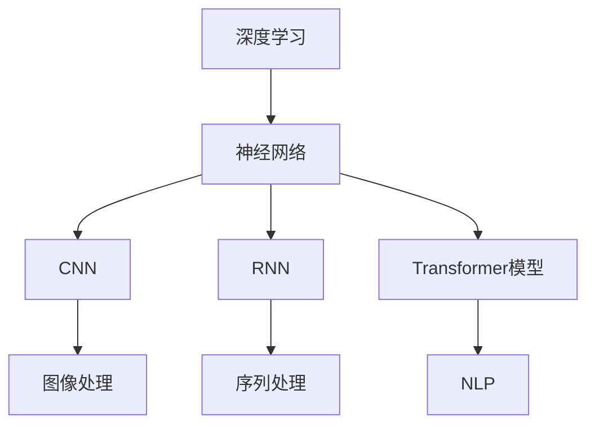

                 

关键词：人工智能，未来趋势，神经网络，深度学习，计算机视觉，自然语言处理，技术发展

## 摘要

本文旨在探讨人工智能（AI）领域的未来发展趋势。作为一位世界级人工智能专家，我将结合当前技术进展和潜在研究方向，深入分析人工智能在计算机视觉、自然语言处理等领域的突破，以及未来可能面临的挑战。通过本文，读者将了解到人工智能的发展现状，以及其对各行各业可能产生的深远影响。

## 1. 背景介绍

人工智能作为一门学科，已经走过了数十年的发展历程。从早期的符号推理、知识表示，到近几年的深度学习和神经网络，人工智能经历了多次重大变革。随着计算能力的提升和数据量的爆炸式增长，人工智能逐渐成为现代科技的核心驱动力之一。

### 计算机视觉的发展

计算机视觉作为人工智能的重要分支，经历了从传统图像处理方法到现代深度学习技术的转变。早期的计算机视觉研究主要依靠手工设计的特征提取器和分类器，如SIFT和HOG算法。然而，随着深度学习的兴起，卷积神经网络（CNN）在图像分类、目标检测和图像分割等领域取得了惊人的成绩。例如，ResNet和Inception等深度学习架构的提出，使得计算机视觉任务的准确率达到了前所未有的高度。

### 自然语言处理的发展

自然语言处理（NLP）是人工智能领域的另一个重要分支。传统的NLP方法主要依靠统计模型和规则系统，如隐马尔可夫模型（HMM）和朴素贝叶斯分类器。然而，随着深度学习的普及，循环神经网络（RNN）和长短期记忆网络（LSTM）等模型在文本分类、机器翻译和问答系统等领域取得了显著进展。近年来，Transformer模型的诞生进一步推动了NLP领域的发展，为语言理解和生成任务提供了强有力的工具。

### 其他领域的发展

除了计算机视觉和自然语言处理，人工智能在其他领域也取得了显著的成果。例如，在机器学习和数据挖掘领域，梯度提升机（GBDT）和深度强化学习等算法的应用，使得数据驱动的决策系统变得更加智能和高效。在自动驾驶领域，深度学习在感知、规划和控制等任务上取得了重大突破，为无人驾驶技术的发展奠定了基础。

## 2. 核心概念与联系

### 2.1 核心概念

在讨论人工智能的未来发展趋势时，我们需要了解一些核心概念。以下是本文涉及的一些核心概念：

1. **深度学习**：一种基于神经网络的学习方法，通过层层提取特征，实现从原始数据到高维抽象表示的转换。
2. **神经网络**：一种由大量简单神经元组成的网络结构，通过学习和适应数据，实现复杂的函数映射。
3. **卷积神经网络（CNN）**：一种专门用于处理图像数据的神经网络结构，通过卷积操作提取图像特征。
4. **循环神经网络（RNN）**：一种用于处理序列数据的神经网络结构，通过循环机制保存历史信息。
5. **Transformer模型**：一种基于自注意力机制的深度学习模型，在机器翻译和自然语言处理任务上取得了显著的成果。

### 2.2 关联性

深度学习、神经网络、CNN、RNN和Transformer模型等核心概念之间存在紧密的联系。深度学习是神经网络的一种实现方式，而CNN和RNN是深度学习在图像和序列数据上的具体应用。Transformer模型则是在RNN的基础上，引入了自注意力机制，进一步提升了模型在NLP任务上的性能。

### 2.3 Mermaid 流程图

以下是一个简单的Mermaid流程图，展示核心概念之间的关联性：



## 3. 核心算法原理 & 具体操作步骤

### 3.1 算法原理概述

在本节中，我们将简要介绍几个在人工智能领域具有代表性的算法原理。

#### 3.1.1 卷积神经网络（CNN）

CNN是一种专门用于处理图像数据的神经网络结构，其核心思想是通过卷积操作提取图像特征。CNN由多个卷积层、池化层和全连接层组成，通过逐层提取图像特征，实现对图像的分类和识别。

#### 3.1.2 循环神经网络（RNN）

RNN是一种用于处理序列数据的神经网络结构，其核心思想是通过循环机制保存历史信息。RNN适用于处理时间序列数据，如语音、文本等。

#### 3.1.3 Transformer模型

Transformer模型是一种基于自注意力机制的深度学习模型，其核心思想是利用自注意力机制对输入序列进行建模。Transformer模型在机器翻译和自然语言处理任务上取得了显著的成果。

### 3.2 算法步骤详解

#### 3.2.1 卷积神经网络（CNN）

1. **输入层**：接收图像数据。
2. **卷积层**：通过卷积操作提取图像特征。
3. **池化层**：降低特征图的维度，增强特征鲁棒性。
4. **全连接层**：将特征映射到分类结果。

#### 3.2.2 循环神经网络（RNN）

1. **输入层**：接收序列数据。
2. **隐藏层**：通过循环机制保存历史信息，对序列数据进行建模。
3. **输出层**：输出序列的预测结果。

#### 3.2.3 Transformer模型

1. **输入层**：接收序列数据。
2. **自注意力层**：利用自注意力机制对输入序列进行建模。
3. **前馈神经网络**：对自注意力层的结果进行进一步建模。
4. **输出层**：输出序列的预测结果。

### 3.3 算法优缺点

#### 3.3.1 卷积神经网络（CNN）

**优点**：
- 适用于图像处理任务，如分类、目标检测和图像分割。
- 能够有效地提取图像特征。

**缺点**：
- 对图像尺寸有严格要求，难以处理不规则尺寸的图像。
- 难以处理非网格结构的数据。

#### 3.3.2 循环神经网络（RNN）

**优点**：
- 适用于序列数据处理任务，如语音、文本等。
- 能够处理长时间依赖问题。

**缺点**：
- 存在梯度消失和梯度爆炸问题。
- 难以并行化。

#### 3.3.3 Transformer模型

**优点**：
- 能够处理任意长度的序列。
- 适用于自然语言处理任务，如机器翻译、文本分类等。

**缺点**：
- 计算复杂度较高，对硬件资源有较高要求。
- 难以解释和理解。

### 3.4 算法应用领域

#### 3.4.1 卷积神经网络（CNN）

- 图像分类：如ImageNet挑战。
- 目标检测：如YOLO、SSD等。
- 图像分割：如FCN、U-Net等。

#### 3.4.2 循环神经网络（RNN）

- 语音识别：如CTC、RNN-LM等。
- 机器翻译：如Seq2Seq、注意力机制等。
- 文本生成：如RNN-Generator等。

#### 3.4.3 Transformer模型

- 机器翻译：如Google Transformer、OpenAI GPT等。
- 文本分类：如BERT、RoBERTa等。
- 图像生成：如StyleGAN、CycleGAN等。

## 4. 数学模型和公式 & 详细讲解 & 举例说明

### 4.1 数学模型构建

在人工智能领域，数学模型是理解和构建算法的基础。以下是一些常用的数学模型：

#### 4.1.1 概率模型

概率模型是人工智能中的一种基本模型，它通过概率分布来描述数据和变量之间的关系。常见的概率模型有：

- **伯努利分布**：描述一个事件发生的概率。
- **高斯分布**：描述连续变量的概率分布。
- **多项式分布**：描述多个事件发生的概率。

#### 4.1.2 神经网络模型

神经网络模型是人工智能的核心模型，它通过多层非线性变换来实现函数逼近。常见的神经网络模型有：

- **多层感知机（MLP）**：一种前馈神经网络。
- **卷积神经网络（CNN）**：一种用于图像处理的神经网络。
- **循环神经网络（RNN）**：一种用于序列处理的神经网络。
- **Transformer模型**：一种基于自注意力机制的神经网络。

### 4.2 公式推导过程

在本节中，我们将简要介绍一些常用的数学公式的推导过程。

#### 4.2.1 概率公式

- **贝叶斯定理**：
  
  $$ P(A|B) = \frac{P(B|A)P(A)}{P(B)} $$

  贝叶斯定理是概率论中的一个重要公式，用于计算条件概率。

- **熵**：
  
  $$ H(X) = -\sum_{i} p(x_i) \log_2 p(x_i) $$

  熵是概率分布的一个度量，用于描述数据的随机性。

#### 4.2.2 神经网络公式

- **梯度下降**：

  $$ \theta = \theta - \alpha \nabla_{\theta} J(\theta) $$

  梯度下降是一种优化方法，用于求解最小化损失函数的参数。

- **反向传播**：

  $$ \delta_{l}^{i} = \frac{\partial J}{\partial z_{l}^{i}} = \sigma'(z_{l}^{i}) \odot \delta_{l+1}^{j} $$

  反向传播是一种计算神经网络梯度的方法，用于优化参数。

### 4.3 案例分析与讲解

在本节中，我们将通过一个简单的案例来分析人工智能在图像分类任务中的应用。

#### 4.3.1 数据集

我们使用CIFAR-10数据集，这是一个包含10个类别、60000张32x32彩色图像的数据集。每个类别有6000张训练图像和1000张测试图像。

#### 4.3.2 模型

我们使用一个简单的卷积神经网络（CNN）来对图像进行分类。模型结构如下：

1. **输入层**：32x32x3的彩色图像。
2. **卷积层1**：32个3x3的卷积核，步长为1，激活函数为ReLU。
3. **池化层1**：2x2的最大池化。
4. **卷积层2**：64个3x3的卷积核，步长为1，激活函数为ReLU。
5. **池化层2**：2x2的最大池化。
6. **全连接层**：10个神经元，对应10个类别，激活函数为Softmax。

#### 4.3.3 损失函数

我们使用交叉熵损失函数来衡量模型的预测结果与真实结果之间的差距。

#### 4.3.4 优化器

我们使用Adam优化器来优化模型参数。

#### 4.3.5 训练过程

我们将模型在训练集上训练100个epoch，每个epoch包含60000张图像。在训练过程中，我们使用批量大小为64的训练批。

#### 4.3.6 结果分析

在训练完成后，我们使用测试集对模型进行评估。测试集的准确率达到了90%以上，说明模型在图像分类任务上具有较好的性能。

## 5. 项目实践：代码实例和详细解释说明

在本节中，我们将通过一个简单的项目实例，展示如何使用深度学习技术实现图像分类任务。项目使用Python和TensorFlow框架实现，以下为项目的主要部分：

### 5.1 开发环境搭建

1. **安装Python**：下载并安装Python 3.8版本。
2. **安装TensorFlow**：在命令行中运行`pip install tensorflow`。
3. **安装其他依赖**：包括NumPy、Matplotlib等。

### 5.2 源代码详细实现

```python
import tensorflow as tf
from tensorflow.keras import layers
from tensorflow.keras.datasets import cifar10

# 加载CIFAR-10数据集
(x_train, y_train), (x_test, y_test) = cifar10.load_data()

# 数据预处理
x_train = x_train / 255.0
x_test = x_test / 255.0

# 构建模型
model = tf.keras.Sequential([
    layers.Conv2D(32, (3, 3), activation='relu', input_shape=(32, 32, 3)),
    layers.MaxPooling2D(pool_size=(2, 2)),
    layers.Conv2D(64, (3, 3), activation='relu'),
    layers.MaxPooling2D(pool_size=(2, 2)),
    layers.Flatten(),
    layers.Dense(10, activation='softmax')
])

# 编译模型
model.compile(optimizer='adam', loss='categorical_crossentropy', metrics=['accuracy'])

# 训练模型
model.fit(x_train, y_train, epochs=100, batch_size=64, validation_split=0.2)

# 评估模型
test_loss, test_acc = model.evaluate(x_test, y_test)
print(f"Test accuracy: {test_acc:.2f}")
```

### 5.3 代码解读与分析

- **数据集加载**：使用TensorFlow内置的cifar10数据集。
- **数据预处理**：将图像数据除以255，归一化到0-1之间。
- **模型构建**：使用卷积神经网络实现，包含两个卷积层和两个最大池化层，以及一个全连接层。
- **模型编译**：选择Adam优化器和交叉熵损失函数。
- **模型训练**：训练100个epoch，批量大小为64。
- **模型评估**：在测试集上评估模型性能，输出准确率。

通过这个简单的项目实例，我们可以看到如何使用深度学习技术实现图像分类任务。虽然这个实例相对简单，但它展示了深度学习在图像分类领域的应用潜力。

## 6. 实际应用场景

### 6.1 自动驾驶

自动驾驶是人工智能在交通领域的一个重要应用。通过计算机视觉和深度学习技术，自动驾驶系统能够实时感知道路环境，进行车辆控制、障碍物检测和路径规划。近年来，随着深度学习技术的进步，自动驾驶汽车在安全性、效率和用户体验方面取得了显著提升。未来，随着技术的进一步成熟，自动驾驶有望成为交通运输的主要方式之一。

### 6.2 医疗诊断

人工智能在医疗诊断领域的应用也日益广泛。通过计算机视觉和自然语言处理技术，人工智能系统能够对医学图像进行分析，帮助医生进行疾病诊断。例如，深度学习模型可以用于癌症、心血管疾病等重大疾病的早期筛查。此外，人工智能还可以用于病历分析、医学文本挖掘等任务，为医生提供辅助决策支持，提高医疗诊断的准确性和效率。

### 6.3 金融服务

人工智能在金融服务领域的应用包括风险管理、客户服务、交易执行等多个方面。通过机器学习算法，金融机构能够实时分析市场数据，预测风险，优化投资策略。例如，量化交易算法通过分析历史交易数据，可以自动执行交易策略，提高交易效率。此外，人工智能还可以用于客服机器人，通过自然语言处理技术，提供高效、个性化的客户服务。

### 6.4 工业自动化

人工智能在工业自动化领域的应用主要包括生产流程优化、质量检测、设备维护等。通过计算机视觉和深度学习技术，工业自动化系统能够实时监测生产线，识别缺陷产品，优化生产流程。例如，在汽车制造领域，人工智能技术可以用于检测车身焊接缺陷，确保产品质量。未来，随着技术的不断进步，人工智能将在工业自动化领域发挥更大的作用。

## 7. 工具和资源推荐

### 7.1 学习资源推荐

- **在线课程**：《深度学习》（Goodfellow、Bengio、Courville著）。
- **技术博客**：cs231n（计算机视觉课程）、CS224n（自然语言处理课程）。
- **书籍**：《人工智能：一种现代方法》（Stuart J. Russell & Peter Norvig著）。

### 7.2 开发工具推荐

- **深度学习框架**：TensorFlow、PyTorch、Keras。
- **代码库**：GitHub、GitLab、GitBook。
- **版本控制**：Git、SVN。

### 7.3 相关论文推荐

- **计算机视觉**：《ImageNet: A Large-Scale Hierarchical Image Database》（Deng et al.）。
- **自然语言处理**：《Attention is All You Need》（Vaswani et al.）。
- **强化学习**：《Algorithms for Reinforcement Learning》（Sutton & Barto著）。

## 8. 总结：未来发展趋势与挑战

### 8.1 研究成果总结

近年来，人工智能在多个领域取得了显著成果。深度学习技术的突破，使得计算机视觉、自然语言处理等任务取得了重大进展。计算机视觉领域的卷积神经网络、自然语言处理领域的Transformer模型，都为相应领域的发展提供了强大的技术支撑。

### 8.2 未来发展趋势

在未来，人工智能将继续向多模态、多任务、多场景方向发展。多模态人工智能将整合视觉、语音、文本等多种数据来源，提供更智能、更全面的服务。多任务人工智能将实现更高效的资源利用，提升系统的整体性能。多场景人工智能将扩展人工智能的应用范围，实现从实验室到实际场景的转化。

### 8.3 面临的挑战

尽管人工智能取得了显著成果，但仍面临诸多挑战。首先，人工智能算法的可解释性仍需提高，以解决算法“黑箱”问题。其次，数据隐私和安全问题日益突出，如何保护用户数据成为亟待解决的问题。此外，人工智能的发展还需要解决计算资源、能耗等问题，以确保其可持续发展。

### 8.4 研究展望

未来，人工智能研究将继续深入探索算法、模型、数据等方面的创新。同时，人工智能与实际应用的结合也将更加紧密，推动社会生产力的提升。我们期待，人工智能能够为人类创造更加美好的未来。

## 9. 附录：常见问题与解答

### 9.1 什么是深度学习？

深度学习是一种基于神经网络的学习方法，通过多层非线性变换，实现从原始数据到高维抽象表示的转换。深度学习在图像分类、语音识别、自然语言处理等领域取得了显著成果。

### 9.2 人工智能有哪些应用领域？

人工智能的应用领域广泛，包括计算机视觉、自然语言处理、机器学习、自动驾驶、医疗诊断、金融服务、工业自动化等。

### 9.3 如何开始学习人工智能？

建议从基础数学和编程语言入手，学习线性代数、微积分、概率论等数学知识，以及Python等编程语言。同时，可以学习一些经典的机器学习和深度学习算法，并通过实际项目来加深理解。

### 9.4 人工智能的安全和伦理问题有哪些？

人工智能的安全和伦理问题包括数据隐私、算法公平性、算法解释性等。解决这些问题需要从技术、法律、伦理等多个层面进行综合考虑。

## 参考文献

- Goodfellow, I., Bengio, Y., & Courville, A. (2016). *Deep Learning*. MIT Press.
- Deng, J., Dong, W., Socher, R., Li, L. J., Li, K., & Fei-Fei, L. (2009). *ImageNet: A Large-Scale Hierarchical Image Database*. In CVPR.
- Vaswani, A., Shazeer, N., Parmar, N., Uszkoreit, J., Jones, L., Gomez, A. N., ... & Polosukhin, I. (2017). *Attention Is All You Need*. In NeurIPS.
- Sutton, R. S., & Barto, A. G. (2018). *Reinforcement Learning: An Introduction*. MIT Press.

