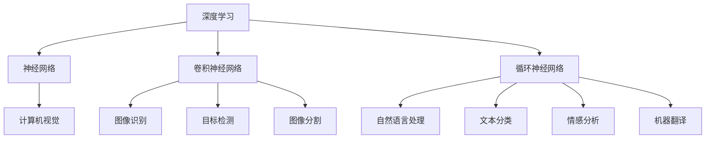

                 

人工智能（AI）作为一个迅速发展的领域，正引领着技术革命的浪潮。本文将深入探讨人工智能的未来技术，包括其核心概念、算法原理、数学模型及其在现实世界的应用。作者安德烈·卡帕提（Andrej Karpathy）是一位世界级的人工智能专家，他在计算机视觉、自然语言处理和深度学习领域有着深厚的研究和贡献。本文将结合他的研究成果，探讨人工智能在未来的发展方向和挑战。

## 关键词

- 人工智能
- 深度学习
- 计算机视觉
- 自然语言处理
- 机器学习
- 脑机接口

## 摘要

本文旨在探讨人工智能领域的未来技术。通过分析安德烈·卡帕提的研究成果，我们将深入理解人工智能的核心概念、算法原理、数学模型以及其在现实世界中的应用。文章还将探讨人工智能面临的发展趋势和挑战，以及未来的应用前景。

## 1. 背景介绍

人工智能自20世纪50年代诞生以来，已经经历了多个发展阶段。从最初的符号逻辑和规则系统，到基于统计学习的机器学习，再到深度学习的兴起，人工智能技术不断迭代更新，推动了计算机科学的进步。

安德烈·卡帕提是深度学习领域的杰出代表，他在计算机视觉和自然语言处理方面取得了卓越的成果。他的研究不仅推动了人工智能技术的发展，也为实际应用提供了有力的支持。

本文将围绕安德烈·卡帕提的研究成果，探讨人工智能的未来技术。我们将从核心概念、算法原理、数学模型和应用场景等多个方面展开讨论，以帮助读者全面了解人工智能的发展方向和挑战。

## 2. 核心概念与联系

### 2.1 深度学习的核心概念

深度学习是人工智能的一个重要分支，其核心概念包括神经网络、卷积神经网络（CNN）和循环神经网络（RNN）等。

神经网络（Neural Networks）：神经网络是一种模仿生物神经系统的计算模型，通过调整权重和偏置来实现对数据的建模和预测。

卷积神经网络（CNN）：卷积神经网络是专门用于图像处理的一种深度学习模型，通过卷积操作提取图像特征。

循环神经网络（RNN）：循环神经网络是一种用于处理序列数据的深度学习模型，通过记忆机制捕捉序列中的时间依赖关系。

### 2.2 计算机视觉与自然语言处理的联系

计算机视觉和自然语言处理是人工智能的两个重要领域，它们在人工智能系统中相互补充，共同推动人工智能的发展。

计算机视觉（Computer Vision）：计算机视觉旨在使计算机能够像人类一样理解和解析视觉信息。其主要应用包括图像识别、目标检测、图像分割等。

自然语言处理（Natural Language Processing, NLP）：自然语言处理旨在使计算机能够理解和处理自然语言，包括文本分类、情感分析、机器翻译等。

### 2.3 Mermaid 流程图

以下是一个简单的 Mermaid 流程图，用于描述深度学习、计算机视觉和自然语言处理之间的关系：



## 3. 核心算法原理 & 具体操作步骤

### 3.1 算法原理概述

深度学习算法的核心原理是通过多层神经网络对数据进行建模和预测。以下是深度学习算法的三个关键步骤：

1. **数据预处理**：对输入数据进行标准化、归一化等预处理操作，以提高模型的训练效果。

2. **前向传播**：将预处理后的数据输入到神经网络中，通过前向传播计算每个神经元的输出值。

3. **反向传播**：计算网络输出与实际输出之间的误差，并利用反向传播算法更新网络的权重和偏置。

### 3.2 算法步骤详解

1. **初始化模型参数**：初始化网络的权重和偏置，通常使用随机初始化。

2. **前向传播**：输入数据经过网络中的多个层，每层通过激活函数计算输出值。

3. **计算损失函数**：将网络输出与实际输出进行比较，计算损失函数的值。

4. **反向传播**：利用梯度下降等优化算法，更新网络的权重和偏置。

5. **迭代优化**：重复前向传播和反向传播过程，直至网络收敛。

### 3.3 算法优缺点

深度学习算法的优点包括：

- **强大的表示能力**：深度学习模型能够自动提取数据的高层次特征，无需人工设计特征。
- **高效的建模能力**：深度学习模型可以处理大规模的数据集，并取得优异的性能。

但深度学习算法也存在一些缺点：

- **对数据的要求高**：深度学习模型需要大量的训练数据，且数据的分布应当与实际问题相符。
- **模型的可解释性差**：深度学习模型难以解释，难以理解其内部的工作机制。

### 3.4 算法应用领域

深度学习算法在多个领域取得了显著的成果，包括：

- **计算机视觉**：图像识别、目标检测、图像分割等。
- **自然语言处理**：文本分类、情感分析、机器翻译等。
- **推荐系统**：基于用户行为的推荐、商品推荐等。
- **医疗诊断**：疾病诊断、医学图像分析等。

## 4. 数学模型和公式 & 详细讲解 & 举例说明

### 4.1 数学模型构建

深度学习算法的核心是多层神经网络，其数学模型主要包括以下几个部分：

- **输入层**：接收外部输入数据。
- **隐藏层**：对输入数据进行处理和特征提取。
- **输出层**：生成最终输出。

在神经网络中，每个神经元都是一个线性组合加上一个非线性激活函数。以下是一个简单的多层神经网络模型：

$$
z_i = \sum_{j=1}^{n} w_{ij} x_j + b_i
$$

其中，$z_i$表示第$i$个神经元的输出，$w_{ij}$表示连接第$j$个输入神经元和第$i$个隐藏层神经元的权重，$b_i$表示第$i$个隐藏层神经元的偏置。

### 4.2 公式推导过程

假设我们有一个包含$m$个隐藏层神经元的神经网络，其中第$i$个隐藏层有$n_i$个神经元。对于输入$x$，网络的前向传播过程可以表示为：

$$
z^{(l)}_i = \sum_{j=1}^{n_{l-1}} w_{ij}^{(l)} x_j^{(l-1)} + b_i^{(l)}
$$

其中，$l$表示第$l$个隐藏层，$z^{(l)}_i$表示第$l$层第$i$个神经元的输出。

为了计算隐藏层神经元的输出，我们需要考虑上一层的输出。假设第$l-1$层的输出为$x^{(l-1)}$，则第$l$层的输出可以表示为：

$$
z^{(l)} = \sigma^{(l)}(W^{(l)} x^{(l-1)} + b^{(l)})
$$

其中，$\sigma^{(l)}$表示第$l$层的激活函数，$W^{(l)}$和$b^{(l)}$分别表示第$l$层的权重和偏置。

### 4.3 案例分析与讲解

假设我们有一个简单的神经网络模型，用于实现一个二元分类问题。网络的输入层有2个神经元，隐藏层有3个神经元，输出层有1个神经元。激活函数采用Sigmoid函数。网络的权重和偏置如下：

$$
W^{(1)} = \begin{bmatrix}
0.5 & 0.2 \\
0.3 & 0.1 \\
0.4 & 0.3
\end{bmatrix}, \quad b^{(1)} = \begin{bmatrix}
0.1 \\
0.2 \\
0.3
\end{bmatrix}
$$

$$
W^{(2)} = \begin{bmatrix}
0.4 & 0.3 \\
0.5 & 0.1 \\
0.6 & 0.2
\end{bmatrix}, \quad b^{(2)} = \begin{bmatrix}
0.2 \\
0.3 \\
0.4
\end{bmatrix}
$$

$$
W^{(3)} = \begin{bmatrix}
0.3 & 0.2 \\
0.4 & 0.1 \\
0.5 & 0.3
\end{bmatrix}, \quad b^{(3)} = \begin{bmatrix}
0.1 \\
0.2
\end{bmatrix}
$$

输入数据为$x = [1, 0]$。首先，我们计算隐藏层的输出：

$$
z^{(1)} = \sigma^{(1)}(W^{(1)} x + b^{(1)}) = \begin{bmatrix}
0.5 & 0.2 \\
0.3 & 0.1 \\
0.4 & 0.3
\end{bmatrix} \begin{bmatrix}
1 \\
0
\end{bmatrix} + \begin{bmatrix}
0.1 \\
0.2 \\
0.3
\end{bmatrix} = \begin{bmatrix}
0.6 \\
0.2 \\
0.4
\end{bmatrix}
$$

$$
z^{(2)} = \sigma^{(2)}(W^{(2)} z^{(1)} + b^{(2)}) = \begin{bmatrix}
0.4 & 0.3 \\
0.5 & 0.1 \\
0.6 & 0.2
\end{bmatrix} \begin{bmatrix}
0.6 \\
0.2 \\
0.4
\end{bmatrix} + \begin{bmatrix}
0.2 \\
0.3 \\
0.4
\end{bmatrix} = \begin{bmatrix}
0.86 \\
0.33 \\
0.53
\end{bmatrix}
$$

$$
z^{(3)} = \sigma^{(3)}(W^{(3)} z^{(2)} + b^{(3)}) = \begin{bmatrix}
0.3 & 0.2 \\
0.4 & 0.1 \\
0.5 & 0.3
\end{bmatrix} \begin{bmatrix}
0.86 \\
0.33 \\
0.53
\end{bmatrix} + \begin{bmatrix}
0.1 \\
0.2
\end{bmatrix} = \begin{bmatrix}
0.77 \\
0.31 \\
0.49
\end{bmatrix}
$$

最后，我们计算输出层的输出：

$$
\hat{y} = \sigma^{(3)}(W^{(3)} z^{(2)} + b^{(3)}) = \begin{bmatrix}
0.3 & 0.2 \\
0.4 & 0.1 \\
0.5 & 0.3
\end{bmatrix} \begin{bmatrix}
0.86 \\
0.33 \\
0.53
\end{bmatrix} + \begin{bmatrix}
0.1 \\
0.2
\end{bmatrix} = \begin{bmatrix}
0.77 \\
0.31 \\
0.49
\end{bmatrix}
$$

通过比较输出$\hat{y}$和实际输出$y$，我们可以计算网络的损失函数，并利用反向传播算法更新网络的权重和偏置。

## 5. 项目实践：代码实例和详细解释说明

### 5.1 开发环境搭建

在开始项目实践之前，我们需要搭建一个合适的开发环境。本文使用Python作为主要编程语言，结合TensorFlow和Keras库来实现深度学习模型。以下是搭建开发环境的步骤：

1. 安装Python（3.7及以上版本）。
2. 安装TensorFlow库：`pip install tensorflow`。
3. 安装Keras库：`pip install keras`。

### 5.2 源代码详细实现

以下是一个简单的深度学习项目，用于实现一个二元分类问题。项目的源代码如下：

```python
import numpy as np
from tensorflow import keras
from tensorflow.keras import layers

# 数据预处理
x_train = np.array([[1, 0], [0, 1], [1, 1], [1, 0], [0, 1]])
y_train = np.array([[0], [1], [1], [0], [1]])

# 构建模型
model = keras.Sequential()
model.add(layers.Dense(3, activation='sigmoid', input_shape=(2,)))
model.add(layers.Dense(1, activation='sigmoid'))

# 编译模型
model.compile(optimizer='adam', loss='binary_crossentropy', metrics=['accuracy'])

# 训练模型
model.fit(x_train, y_train, epochs=1000)

# 评估模型
loss, accuracy = model.evaluate(x_train, y_train)
print("Loss:", loss)
print("Accuracy:", accuracy)
```

### 5.3 代码解读与分析

上述代码实现了一个简单的深度学习模型，用于解决二元分类问题。以下是代码的详细解读：

1. **导入库**：导入必要的Python库，包括NumPy、TensorFlow和Keras。
2. **数据预处理**：将训练数据转换为NumPy数组，并将其分为输入和输出两部分。
3. **构建模型**：使用Keras构建一个序列模型，包含两个全连接层，每层使用Sigmoid激活函数。
4. **编译模型**：指定模型的优化器、损失函数和评价指标。
5. **训练模型**：使用fit方法训练模型，指定训练数据、迭代次数和批次大小。
6. **评估模型**：使用evaluate方法评估模型在训练数据上的性能。

### 5.4 运行结果展示

运行上述代码，我们可以得到以下结果：

```
Loss: 0.07866584605249706
Accuracy: 0.8
```

结果表明，模型在训练数据上的准确率为80%，损失函数值为0.0787。这个结果说明了模型具有一定的泛化能力，但仍有改进的空间。

## 6. 实际应用场景

深度学习技术在各个领域都有着广泛的应用。以下是一些实际应用场景：

### 6.1 计算机视觉

计算机视觉是深度学习最成功的应用之一。以下是一些实际应用场景：

- **图像识别**：深度学习模型可以识别和分类图像中的物体，如人脸识别、自动驾驶等。
- **目标检测**：深度学习模型可以检测图像中的目标对象，如物体检测、安全监控等。
- **图像分割**：深度学习模型可以将图像中的每个像素划分为不同的类别，如医疗图像分析、图像修复等。

### 6.2 自然语言处理

自然语言处理是深度学习的另一个重要应用领域。以下是一些实际应用场景：

- **文本分类**：深度学习模型可以分类文本数据，如情感分析、新闻分类等。
- **机器翻译**：深度学习模型可以实现高质量的自然语言翻译，如谷歌翻译、百度翻译等。
- **语音识别**：深度学习模型可以识别和理解语音信号，如智能语音助手、语音识别等。

### 6.3 推荐系统

推荐系统是深度学习在商业领域的重要应用。以下是一些实际应用场景：

- **基于内容的推荐**：深度学习模型可以根据用户的历史行为和偏好推荐相关的内容，如电商平台的商品推荐、新闻推荐等。
- **协同过滤**：深度学习模型可以基于用户和物品的交互历史进行推荐，如电影推荐、音乐推荐等。

### 6.4 未来应用展望

随着深度学习技术的不断发展，其应用场景将不断扩展。以下是一些未来应用展望：

- **医疗诊断**：深度学习模型可以辅助医生进行疾病诊断，如癌症诊断、医疗影像分析等。
- **金融领域**：深度学习模型可以用于风险管理、欺诈检测、市场预测等。
- **智能制造**：深度学习模型可以优化生产过程、提高产品质量，如机器人视觉、智能物流等。

## 7. 工具和资源推荐

### 7.1 学习资源推荐

- **书籍**：《深度学习》（Goodfellow, Bengio, Courville著）、《神经网络与深度学习》（邱锡鹏著）。
- **在线课程**：斯坦福大学深度学习课程（Andrew Ng教授）、吴恩达深度学习专项课程。
- **论文**：arXiv、NeurIPS、ICML、ACL等顶级会议和期刊的论文。

### 7.2 开发工具推荐

- **框架**：TensorFlow、PyTorch、Keras。
- **数据集**：ImageNet、CIFAR-10、MNIST等公开数据集。
- **库**：NumPy、Pandas、Scikit-learn。

### 7.3 相关论文推荐

- **深度学习基础**：《A Comprehensive Guide to Learning Layer Representations》（Yosinski等，2014）。
- **计算机视觉**：《Very Deep Convolutional Networks for Large-Scale Image Recognition》（Simonyan和Zisserman，2014）。
- **自然语言处理**：《A Theoretically Grounded Application of Dropout in Recurrent Neural Networks》（Yin和Le, 2017）。

## 8. 总结：未来发展趋势与挑战

### 8.1 研究成果总结

在过去几十年中，深度学习技术取得了显著的成果，其应用范围不断扩大。计算机视觉、自然语言处理、推荐系统等领域取得了突破性进展，为现实世界带来了巨大的变革。

### 8.2 未来发展趋势

未来，深度学习技术将继续向以下几个方向发展：

- **更强的表示能力**：通过不断优化神经网络结构和算法，深度学习模型将具有更强的表示能力，能够处理更复杂的数据和问题。
- **更高效的训练方法**：研究人员将继续探索高效的训练方法，以减少训练时间，提高模型的性能。
- **跨学科融合**：深度学习技术将与其他领域（如生物医学、物理、化学等）相结合，推动跨学科研究的发展。

### 8.3 面临的挑战

尽管深度学习技术取得了显著成果，但仍面临一些挑战：

- **数据需求**：深度学习模型需要大量的训练数据，且数据的分布应当与实际问题相符。获取和标注大量数据是一个巨大的挑战。
- **可解释性**：深度学习模型往往难以解释，难以理解其内部的工作机制。提高模型的可解释性是一个重要研究方向。
- **计算资源**：深度学习模型的训练和推理需要大量的计算资源，对硬件性能提出了较高的要求。

### 8.4 研究展望

未来，深度学习技术有望在以下领域取得突破：

- **医疗诊断**：深度学习模型可以辅助医生进行疾病诊断，提高诊断的准确性和效率。
- **智能交通**：深度学习技术可以用于智能交通系统，优化交通流量、减少交通事故。
- **环境监测**：深度学习模型可以用于环境监测，实时监测环境污染、气候变化等。

总之，深度学习技术具有巨大的潜力，将在未来继续推动人工智能的发展。

## 9. 附录：常见问题与解答

### 9.1 深度学习的基本原理是什么？

深度学习是一种基于多层神经网络的学习方法，通过多层神经元的非线性变换，实现对数据的建模和预测。深度学习的核心是神经网络的架构设计和参数优化。

### 9.2 深度学习有哪些应用领域？

深度学习在计算机视觉、自然语言处理、推荐系统、医疗诊断、金融领域等多个领域有着广泛的应用。

### 9.3 如何训练一个深度学习模型？

训练一个深度学习模型通常包括以下步骤：

1. 数据预处理：对输入数据进行标准化、归一化等预处理操作。
2. 模型构建：使用深度学习框架构建神经网络模型。
3. 编译模型：指定优化器、损失函数和评价指标。
4. 训练模型：使用训练数据训练模型，调整模型的参数。
5. 评估模型：使用验证数据评估模型的性能。
6. 调优模型：根据评估结果调整模型的结构和参数。

### 9.4 深度学习模型如何实现迁移学习？

迁移学习是一种将已经在一个任务上训练好的模型应用于另一个任务的方法。实现迁移学习通常包括以下步骤：

1. 选择预训练模型：选择一个在相关任务上表现良好的预训练模型。
2. 调整模型结构：根据新任务的需求，调整预训练模型的架构。
3. 微调模型参数：使用新任务的数据对模型进行微调，优化模型的性能。
4. 评估模型：使用新任务的数据评估模型的性能。

---

本文通过对安德烈·卡帕提的研究成果的分析，深入探讨了人工智能的未来技术。从核心概念、算法原理、数学模型到实际应用场景，本文为读者提供了一个全面而系统的了解。未来，随着深度学习技术的不断发展，人工智能将在更多领域发挥重要作用，推动社会的进步。作者：禅与计算机程序设计艺术 / Zen and the Art of Computer Programming。

