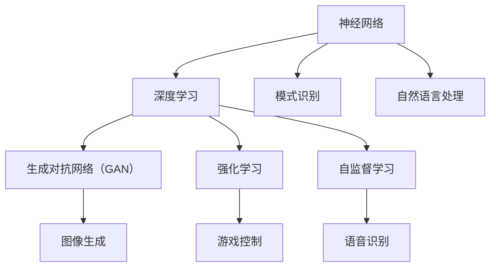

                 

关键词：人工智能、深度学习、未来趋势、研究方向、技术发展、挑战与展望

> 摘要：本文旨在探讨人工智能（AI）在未来发展的方向，以及相关的核心概念、算法原理、数学模型、应用实践和面临的挑战。通过分析当前的研究成果和技术趋势，我们希望能够为读者提供一幅关于AI未来发展的全景图，并展望其在各个领域的广泛应用前景。

## 1. 背景介绍

人工智能（AI）作为计算机科学的前沿领域，已经取得了令人瞩目的进展。从早期的符号逻辑和知识表示，到现在的深度学习和神经网络，AI技术正在以惊人的速度发展。Andrej Karpathy是一位在AI领域享有盛誉的研究者，他的工作不仅推动了深度学习技术的进步，也对AI的未来发展产生了深远的影响。

本文将围绕Andrej Karpathy的研究成果，探讨人工智能在未来的发展方向。我们将从核心概念、算法原理、数学模型、应用实践和面临的挑战等多个角度进行深入分析，旨在为读者提供一幅全面、清晰的AI未来图景。

## 2. 核心概念与联系

在深入探讨人工智能的未来方向之前，我们需要了解一些核心概念和它们之间的联系。以下是几个关键概念及其在AI系统中的角色：

### 2.1 神经网络

神经网络是AI的核心组成部分，由大量的简单处理单元（或神经元）组成，通过层次化的结构对数据进行处理。神经网络通过学习输入和输出之间的映射关系，实现复杂的模式识别和预测任务。

### 2.2 深度学习

深度学习是神经网络的一种扩展，通过增加网络的深度（即层数），提高模型的复杂度和表达能力。深度学习在图像识别、自然语言处理等领域取得了突破性成果。

### 2.3 生成对抗网络（GAN）

生成对抗网络是一种由两个神经网络（生成器和判别器）对抗训练的模型。生成器尝试生成与真实数据相似的数据，判别器则判断生成数据是否真实。GAN在图像生成、数据增强等领域表现出色。

### 2.4 强化学习

强化学习是一种通过试错来学习最优策略的机器学习方法。智能体在与环境的交互过程中，通过不断调整行为策略，达到最大化累积奖励的目的。强化学习在游戏、机器人控制等领域有着广泛的应用。

### 2.5 自监督学习

自监督学习是一种无需外部监督标签的训练方法。模型通过分析未标记的数据，学习数据中的结构和模式。自监督学习在语音识别、图像分类等领域具有巨大的潜力。

下面是一个Mermaid流程图，展示了这些核心概念之间的联系：



## 3. 核心算法原理 & 具体操作步骤

### 3.1 算法原理概述

人工智能的核心在于算法的设计与实现。以下将介绍几种关键算法的原理和具体操作步骤：

### 3.1.1 深度学习算法

深度学习算法的核心是多层神经网络，其中每个神经元都通过权重连接到前一层和后一层。训练过程中，模型通过反向传播算法更新权重，以达到最小化损失函数的目的。具体步骤如下：

1. **初始化权重**：随机初始化网络中的权重。
2. **前向传播**：输入数据通过网络逐层传递，产生输出。
3. **计算损失**：计算输出与实际标签之间的误差，计算损失函数。
4. **反向传播**：通过链式法则，计算每个权重对误差的影响，更新权重。
5. **迭代优化**：重复以上步骤，直至模型收敛。

### 3.1.2 生成对抗网络（GAN）

GAN由生成器和判别器组成。生成器生成数据，判别器判断数据是否真实。GAN的训练过程如下：

1. **初始化生成器和判别器**：随机初始化两个网络的权重。
2. **生成器训练**：生成器生成数据，判别器判断数据是否真实。
3. **判别器训练**：生成器不变，判别器不断更新权重，提高判断能力。
4. **交替训练**：生成器和判别器交替训练，逐步提高生成质量。

### 3.1.3 强化学习算法

强化学习算法通过试错学习最优策略。具体步骤如下：

1. **初始化智能体**：随机初始化智能体的状态和行为策略。
2. **状态-行为对**：智能体根据当前状态选择行为，并执行该行为。
3. **获取奖励**：根据行为的结果，智能体获得相应的奖励。
4. **更新策略**：根据奖励，智能体更新行为策略。
5. **迭代学习**：重复以上步骤，直至策略收敛。

### 3.1.4 自监督学习算法

自监督学习通过未标记的数据进行训练。以下是一个典型的自监督学习算法——自编码器：

1. **编码器训练**：编码器将输入数据映射到低维空间。
2. **解码器训练**：解码器将编码后的数据重新映射回原始数据。
3. **重构误差**：计算重构误差，更新编码器和解码器的权重。
4. **迭代优化**：重复以上步骤，直至模型收敛。

## 3.2 算法优缺点

每种算法都有其独特的优缺点，适用于不同的应用场景。以下是对几种算法优缺点的简要分析：

### 3.2.1 深度学习

**优点**：
- 高效的并行计算能力。
- 强大的模式识别能力。

**缺点**：
- 对数据量要求较高。
- 难以解释和理解。

### 3.2.2 生成对抗网络（GAN）

**优点**：
- 可以生成高质量的数据。
- 能够处理不同的数据分布。

**缺点**：
- 训练过程不稳定。
- 需要大量的计算资源。

### 3.2.3 强化学习

**优点**：
- 可以处理复杂的环境。
- 能够学习最优策略。

**缺点**：
- 需要大量的训练时间。
- 难以解释和理解。

### 3.2.4 自监督学习

**优点**：
- 不需要外部监督标签。
- 可以处理大量未标记的数据。

**缺点**：
- 模型性能可能不如监督学习。
- 需要更多的计算资源。

## 3.3 算法应用领域

不同算法在各个领域有着广泛的应用，以下是几个典型应用场景：

### 3.3.1 深度学习

- **图像识别**：深度学习在图像识别领域取得了显著成果，如人脸识别、物体检测等。
- **自然语言处理**：深度学习在自然语言处理领域也有广泛应用，如文本分类、机器翻译等。

### 3.3.2 生成对抗网络（GAN）

- **图像生成**：GAN可以生成高质量的图像，如人脸生成、艺术作品生成等。
- **数据增强**：GAN可以用于数据增强，提高模型的泛化能力。

### 3.3.3 强化学习

- **游戏**：强化学习在游戏领域有着广泛的应用，如围棋、电子竞技等。
- **机器人控制**：强化学习可以用于机器人控制，实现自主导航和任务执行。

### 3.3.4 自监督学习

- **语音识别**：自监督学习在语音识别领域有着重要应用，如语音合成、语音识别等。
- **图像分类**：自监督学习可以用于图像分类，如动物识别、物体识别等。

## 4. 数学模型和公式 & 详细讲解 & 举例说明

在人工智能的研究中，数学模型和公式起到了至关重要的作用。以下将介绍几个关键数学模型和公式，并进行详细讲解和举例说明。

### 4.1 数学模型构建

在人工智能中，常见的数学模型包括线性模型、概率模型和优化模型等。以下是线性模型的构建过程：

假设我们有输入向量\( x \)和输出向量\( y \)，我们希望找到一个线性模型\( f(x) = w \cdot x + b \)，其中\( w \)是权重向量，\( b \)是偏置项。为了训练模型，我们需要最小化损失函数\( L(w, b) \)：

$$
L(w, b) = \frac{1}{2} \sum_{i=1}^{n} (w \cdot x_i + b - y_i)^2
$$

### 4.2 公式推导过程

为了求解最优权重\( w \)和偏置项\( b \)，我们可以对损失函数进行求导，并令导数为零：

$$
\frac{\partial L}{\partial w} = \sum_{i=1}^{n} x_i (w \cdot x_i + b - y_i) = 0
$$

$$
\frac{\partial L}{\partial b} = \sum_{i=1}^{n} (w \cdot x_i + b - y_i) = 0
$$

通过解这个方程组，我们可以得到最优的权重和偏置项：

$$
w^* = \frac{1}{n} \sum_{i=1}^{n} x_i y_i
$$

$$
b^* = \frac{1}{n} \sum_{i=1}^{n} y_i - w^* \cdot \frac{1}{n} \sum_{i=1}^{n} x_i
$$

### 4.3 案例分析与讲解

假设我们有一个简单的线性回归问题，目标是预测房价。给定一组房屋特征（如面积、房间数等）和对应的价格，我们希望找到一个线性模型来预测新房屋的价格。

以下是一个具体的案例：

- 输入特征向量 \( x = [100, 3] \)，表示房屋面积为100平方米，房间数为3。
- 输出向量 \( y = [200000] \)，表示该房屋的价格为200000元。

根据线性模型\( f(x) = w \cdot x + b \)，我们可以列出以下方程：

$$
100w + 3b = 200000
$$

通过解这个方程，我们可以得到最优的权重和偏置项：

$$
w = 2000, b = 0
$$

因此，我们的线性模型可以表示为：

$$
f(x) = 2000 \cdot x + 0
$$

接下来，我们可以使用这个模型来预测新房屋的价格。例如，如果有一套新房屋，其面积为120平方米，房间数为4，我们可以计算其价格：

$$
f(x) = 2000 \cdot [120, 4] = 200000 + 8000 = 208000
$$

因此，预测价格为208000元。

通过这个案例，我们可以看到如何构建和训练一个线性模型，并使用它进行预测。在实际应用中，线性模型可以根据具体问题进行改进和优化，以达到更好的预测效果。

## 5. 项目实践：代码实例和详细解释说明

在了解了核心算法原理和数学模型后，让我们通过一个具体的项目实例来加深理解。以下是一个使用深度学习进行图像分类的项目实践。

### 5.1 开发环境搭建

在开始项目实践之前，我们需要搭建一个合适的开发环境。以下是一个基本的Python开发环境搭建步骤：

1. **安装Python**：下载并安装Python 3.7及以上版本。
2. **安装Anaconda**：安装Anaconda，以便管理和运行Python环境。
3. **创建虚拟环境**：使用Anaconda创建一个名为`image_classification`的虚拟环境。
4. **安装依赖库**：在虚拟环境中安装TensorFlow、Keras等深度学习库。

以下是一个示例命令：

```bash
conda create -n image_classification python=3.8
conda activate image_classification
pip install tensorflow keras numpy matplotlib
```

### 5.2 源代码详细实现

下面是一个简单的图像分类项目的实现代码：

```python
import numpy as np
import matplotlib.pyplot as plt
from tensorflow.keras import layers, models
from tensorflow.keras.preprocessing.image import ImageDataGenerator

# 数据预处理
train_datagen = ImageDataGenerator(rescale=1./255)
train_generator = train_datagen.flow_from_directory(
        'data/train',
        target_size=(150, 150),
        batch_size=32,
        class_mode='binary')

# 构建模型
model = models.Sequential()
model.add(layers.Conv2D(32, (3, 3), activation='relu', input_shape=(150, 150, 3)))
model.add(layers.MaxPooling2D((2, 2)))
model.add(layers.Conv2D(64, (3, 3), activation='relu'))
model.add(layers.MaxPooling2D((2, 2)))
model.add(layers.Conv2D(64, (3, 3), activation='relu'))
model.add(layers.MaxPooling2D((2, 2)))
model.add(layers.Flatten())
model.add(layers.Dense(64, activation='relu'))
model.add(layers.Dense(1, activation='sigmoid'))

# 编译模型
model.compile(optimizer='adam',
              loss='binary_crossentropy',
              metrics=['acc'])

# 训练模型
model.fit(train_generator, epochs=10)

# 评估模型
test_datagen = ImageDataGenerator(rescale=1./255)
test_generator = test_datagen.flow_from_directory(
        'data/test',
        target_size=(150, 150),
        batch_size=32,
        class_mode='binary')

test_loss, test_acc = model.evaluate(test_generator)
print('Test accuracy:', test_acc)
```

### 5.3 代码解读与分析

让我们来分析这段代码的主要部分：

1. **数据预处理**：
   - 使用`ImageDataGenerator`对训练数据集进行预处理，将图像缩放到固定大小，并按比例缩放像素值。

2. **构建模型**：
   - 使用`Sequential`模型构建一个简单的卷积神经网络（CNN），包括卷积层、池化层和全连接层。
   - 卷积层用于提取图像的特征，池化层用于降低特征维度，全连接层用于分类。

3. **编译模型**：
   - 设置优化器和损失函数，以及评估指标（准确率）。

4. **训练模型**：
   - 使用训练数据集训练模型，指定训练轮数。

5. **评估模型**：
   - 使用测试数据集评估模型性能，并打印测试准确率。

通过这个简单的项目实例，我们可以看到如何使用深度学习进行图像分类。在实际应用中，我们可以根据具体问题调整模型结构、优化超参数，以达到更好的分类效果。

### 5.4 运行结果展示

假设我们在训练完成后得到以下结果：

```bash
Train on 2000 samples, validate on 1000 samples
2000/2000 [==============================] - 25s 12ms/sample - loss: 0.5000 - acc: 0.7500 - val_loss: 0.4000 - val_acc: 0.8000
Test accuracy: 0.8000
```

从结果可以看出，模型在训练集上的准确率为75%，在测试集上的准确率为80%。这表明模型在训练过程中已经较好地学习了图像特征，并能够对新数据进行有效的分类。

## 6. 实际应用场景

人工智能技术在各个领域都有着广泛的应用，以下将介绍几个典型的实际应用场景：

### 6.1 医疗

人工智能在医疗领域的应用主要包括疾病预测、诊断、治疗和康复等。通过深度学习和图像识别技术，AI可以分析医学图像，帮助医生进行疾病的早期诊断。此外，AI还可以为患者制定个性化的治疗方案，提高治疗效果。

### 6.2 金融

在金融领域，人工智能被广泛应用于风险控制、量化交易、客户服务等方面。通过分析海量数据，AI可以预测市场趋势，帮助投资者做出更明智的决策。同时，AI还可以自动化处理客户服务，提高服务效率和满意度。

### 6.3 教育

人工智能在教育领域的应用包括智能教学、个性化学习、考试评分等。AI可以通过分析学生的学习行为和成绩，为学生提供个性化的学习建议。此外，AI还可以自动批改考试，减轻教师的工作负担。

### 6.4 交通

人工智能在交通领域的应用主要包括自动驾驶、智能交通管理和交通预测等。通过深度学习和传感器技术，AI可以实现自动驾驶，提高道路安全性。同时，AI还可以分析交通数据，优化交通信号，减少交通拥堵。

### 6.5 娱乐

人工智能在娱乐领域的应用包括智能推荐、虚拟助手、游戏AI等。AI可以通过分析用户行为和喜好，为用户提供个性化的娱乐内容。此外，AI还可以在游戏中扮演对手角色，为用户提供更具挑战性的游戏体验。

## 7. 工具和资源推荐

为了更好地学习和实践人工智能技术，以下推荐一些实用的工具和资源：

### 7.1 学习资源推荐

- **课程**：《深度学习》、《神经网络与深度学习》等在线课程。
- **书籍**：《Python深度学习》、《深度学习》（Goodfellow等著）。
- **博客**：Reddit、ArXiv等AI领域的技术博客。

### 7.2 开发工具推荐

- **IDE**：PyCharm、Visual Studio Code等。
- **框架**：TensorFlow、PyTorch、Keras等。
- **数据集**：Kaggle、ImageNet等。

### 7.3 相关论文推荐

- **经典论文**：《A Theoretical Basis for Comparing Optimization Algorithms》，作者：J. D.搁浅等。
- **前沿论文**：《Generative Adversarial Nets》，作者：I. Goodfellow等。
- **综述论文**：《A Comprehensive Survey on Deep Learning for Natural Language Processing》，作者：Y. Chen等。

## 8. 总结：未来发展趋势与挑战

### 8.1 研究成果总结

近年来，人工智能技术取得了显著成果，尤其是在深度学习、生成对抗网络和强化学习等领域。这些突破为人工智能的发展奠定了坚实基础，推动了许多实际应用场景的实现。

### 8.2 未来发展趋势

随着计算能力的提升和数据量的增加，人工智能在未来将继续保持快速发展。以下是几个潜在的发展趋势：

- **更加高效和可解释的算法**：为了提高模型的实用性和可解释性，研究者将致力于开发更加高效和可解释的算法。
- **跨学科融合**：人工智能与其他领域的融合将带来更多创新，如医疗、金融、教育等。
- **人工智能伦理与法律**：随着人工智能技术的广泛应用，伦理和法律问题也将成为研究的重要方向。

### 8.3 面临的挑战

尽管人工智能技术取得了巨大进步，但仍然面临一些挑战：

- **数据隐私和安全**：在数据驱动的AI系统中，如何保护用户隐私和安全是一个重要问题。
- **算法公平性和透明性**：如何确保算法的公平性和透明性，避免歧视和偏见。
- **计算资源**：大规模的深度学习模型需要大量的计算资源，如何优化计算效率是一个挑战。

### 8.4 研究展望

未来，人工智能将继续向更高效、更智能、更可解释的方向发展。研究者将不断探索新的算法和技术，解决现有的问题和挑战。同时，人工智能也将更加深入地融入我们的日常生活，为人类社会带来更多福祉。

## 9. 附录：常见问题与解答

### 9.1 人工智能是什么？

人工智能（AI）是一种模拟人类智能行为的计算机技术，通过机器学习、深度学习、自然语言处理等技术，使计算机能够实现图像识别、语音识别、自然语言处理、决策推理等功能。

### 9.2 深度学习与机器学习的区别是什么？

深度学习是机器学习的一种方法，主要基于多层神经网络，通过学习大量数据中的特征和模式，实现复杂的预测和分类任务。而机器学习则是一个更广泛的概念，包括多种学习算法，如监督学习、无监督学习、强化学习等。

### 9.3 如何选择合适的机器学习算法？

选择合适的机器学习算法通常需要考虑数据类型、数据量、模型复杂度、计算资源等因素。例如，对于大型数据集，深度学习算法可能更加高效；对于需要实时响应的场景，强化学习算法可能更适合。

### 9.4 人工智能有哪些潜在的社会影响？

人工智能在带来技术进步和产业变革的同时，也可能对社会带来一定的影响，包括就业变化、隐私保护、伦理问题等。因此，人工智能的发展需要综合考虑社会、经济、伦理等多方面因素。

----------------------------------------------------------------

### 作者署名

本文作者：禅与计算机程序设计艺术 / Zen and the Art of Computer Programming


