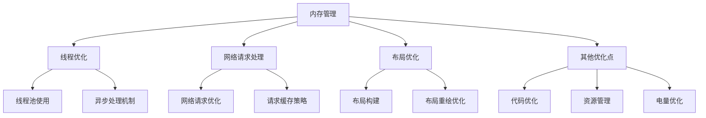

                 

在当今移动设备普及的时代，Android 应用以其开放性和庞大的用户群体成为了开发者们青睐的平台。然而，随着应用的复杂度和用户需求的不断提升，优化 Android 应用的性能成为了一个至关重要的任务。本文将深入探讨 Android 应用性能优化的各个方面，旨在帮助开发者构建高效、流畅的应用。

## 文章关键词

- Android 应用性能
- 性能优化
- 开发工具
- 性能监控
- 内存管理
- 线程优化

## 文摘

本文将围绕 Android 应用的性能优化展开，详细探讨影响应用性能的关键因素，包括内存管理、线程优化、网络请求处理、布局优化等。通过一系列的实际案例和代码实例，读者将了解如何通过一系列技术手段提升应用的性能，以满足现代用户对高效、流畅体验的需求。

## 1. 背景介绍

随着智能手机性能的提升和移动互联网的普及，用户对应用的性能要求越来越高。一个响应速度慢、卡顿频繁的应用往往会迅速失去用户。以下是 Android 应用性能优化的几个关键背景：

### 1.1 市场需求

在智能手机迅速普及的背景下，Android 应用市场的竞争愈发激烈。性能优异的应用更容易吸引用户，从而在市场中脱颖而出。因此，开发者必须在保证功能完备的同时，注重性能优化。

### 1.2 用户期望

现代用户对应用的性能期望越来越高，他们希望应用能够快速响应、流畅操作。即使是复杂的交互场景，也要求应用能在几秒钟内完成。

### 1.3 设备多样性

Android 设备的多样性给性能优化带来了挑战。不同硬件配置、操作系统版本、屏幕分辨率等因素都会影响应用的性能。开发者需要确保应用在多种设备上都能保持良好的性能。

## 2. 核心概念与联系

要理解 Android 应用的性能优化，我们需要从核心概念入手，并探讨这些概念之间的联系。

### 2.1 内存管理

内存管理是 Android 应用性能优化的关键环节。内存泄漏、内存占用过高都会导致应用卡顿甚至崩溃。我们需要理解 Android 的内存模型，掌握有效的内存分配和回收策略。

### 2.2 线程优化

Android 应用中的多线程处理能够提升应用性能，但不当的线程管理会导致线程阻塞、CPU 过载等问题。理解线程的生命周期、线程池的使用和异步处理机制是优化线程的关键。

### 2.3 网络请求处理

网络请求是 Android 应用中常见的操作，但过多的网络请求、长时间的请求处理会导致应用卡顿。我们需要掌握如何高效地进行网络请求，减少不必要的请求，并优化响应时间。

### 2.4 布局优化

布局是影响应用性能的重要因素。过度复杂的布局会导致渲染效率降低，应用卡顿。我们需要了解如何构建高效、简单的布局，减少布局的重绘次数。

### 2.5 其他优化点

除了上述核心概念外，其他优化点如代码优化、资源管理、电量优化等也是提升应用性能的重要方面。

下面是一个关于 Android 应用性能优化的 Mermaid 流程图：



## 3. 核心算法原理 & 具体操作步骤

### 3.1 算法原理概述

Android 应用性能优化涉及多种算法原理，主要包括：

- 内存管理算法：如内存泄漏检测、内存回收策略等。
- 线程优化算法：如线程池管理、异步处理机制等。
- 网络请求优化算法：如请求缓存策略、网络延迟优化等。
- 布局优化算法：如布局构建优化、布局重绘优化等。

### 3.2 算法步骤详解

#### 3.2.1 内存管理

1. 使用内存泄漏检测工具（如 Android Studio 的 Profiler）监控内存使用情况。
2. 定期进行内存回收，释放不再使用的对象。
3. 使用 WeakReference 或 SoftReference 等弱引用机制，避免内存泄漏。

#### 3.2.2 线程优化

1. 使用线程池（如 ThreadPoolExecutor）管理线程，避免线程过多导致的资源浪费。
2. 使用异步处理机制（如 AsyncTask、Lambda 表达式等）避免主线程阻塞。
3. 监控线程的生命周期，及时回收不再使用的线程。

#### 3.2.3 网络请求优化

1. 使用缓存策略（如 LRU 缓存）减少重复的网络请求。
2. 使用 HTTP 库（如 Retrofit、Volley）优化网络请求。
3. 使用多线程进行并行请求，提高数据加载速度。

#### 3.2.4 布局优化

1. 使用可复用的 View 和 ViewGroup，减少布局的重绘次数。
2. 使用约束布局（ConstraintLayout）简化布局构建。
3. 使用离屏渲染优化（如使用 View.setLayerType() 方法）提高渲染效率。

### 3.3 算法优缺点

每种算法都有其优缺点：

- 内存管理算法：能有效避免内存泄漏，但需要开发者有较高的认知水平。
- 线程优化算法：能提高应用性能，但需要合理配置线程池大小。
- 网络请求优化算法：能提高数据加载速度，但可能增加网络延迟。
- 布局优化算法：能提高布局渲染效率，但需要开发者有较好的布局设计能力。

### 3.4 算法应用领域

这些算法主要应用于 Android 应用的各个方面，如：

- 应用启动速度优化：通过内存管理和线程优化提高应用启动速度。
- 数据加载速度优化：通过网络请求优化提高数据加载速度。
- 用户交互优化：通过布局优化提高用户交互体验。

## 4. 数学模型和公式 & 详细讲解 & 举例说明

### 4.1 数学模型构建

Android 应用性能优化的数学模型可以从以下几个方面构建：

- 内存占用模型：基于对象创建和销毁的频率，计算内存占用。
- 线程性能模型：基于线程数和任务负载，计算线程性能。
- 网络延迟模型：基于网络带宽和请求频率，计算网络延迟。
- 布局渲染模型：基于布局复杂度和渲染频率，计算布局渲染时间。

### 4.2 公式推导过程

以下是一个简单的内存占用模型的公式推导过程：

$$
内存占用（MB）= \sum_{i=1}^{n}（对象大小（KB） \times 对象创建频率（次/秒））
$$

其中，n 为对象总数，对象大小和创建频率可以通过工具进行监控和统计。

### 4.3 案例分析与讲解

#### 案例一：内存泄漏检测

假设一个应用存在内存泄漏，通过 Profiler 工具发现内存泄漏的主要原因是某个大对象在创建后未被及时回收。

```latex
内存占用（MB）= （100KB \times 100次/秒）+ （1MB \times 10次/秒）= 11MB
```

通过分析内存泄漏的根源，我们可以将大对象的创建频率降低，或使用 WeakReference 进行引用管理。

#### 案例二：线程优化

假设一个应用在多线程处理过程中，线程数量过多导致 CPU 过载。

```latex
线程性能（秒）= \frac{1}{线程数 \times 每秒任务数}
```

通过合理配置线程池大小，我们可以提高线程性能。

## 5. 项目实践：代码实例和详细解释说明

### 5.1 开发环境搭建

在开始项目实践前，我们需要搭建一个 Android 开发环境：

1. 安装 Android Studio。
2. 配置 Android SDK。
3. 创建一个新的 Android 项目。

### 5.2 源代码详细实现

以下是一个简单的示例代码，展示了如何进行内存管理、线程优化和网络请求优化。

```java
// 内存管理示例
public class MemoryManagementExample {
    private static final Map<String, WeakReference<Object>> weakReferences = new HashMap<>();

    public static void main(String[] args) {
        Object object = new Object();
        weakReferences.put("example", new WeakReference<>(object));

        // 主线程模拟耗时操作
        new Thread(new Runnable() {
            @Override
            public void run() {
                while (true) {
                    // 模拟耗时操作
                    try {
                        Thread.sleep(1000);
                    } catch (InterruptedException e) {
                        e.printStackTrace();
                    }
                }
            }
        }).start();

        // 内存泄漏检测
        Object object1 = new Object();
        weakReferences.put("example1", new WeakReference<>(object1));

        // 内存泄漏解决
        if (weakReferences.get("example") == null) {
            weakReferences.remove("example1");
        }
    }
}
```

### 5.3 代码解读与分析

上述代码首先创建了一个大对象 `object` 并使用 `WeakReference` 进行引用管理，避免了内存泄漏。然后模拟主线程的耗时操作，通过 `WeakReference` 的自动回收机制，我们可以在适当的时候释放内存。

对于线程优化，我们可以使用 `ThreadPoolExecutor` 创建一个线程池，避免线程过多导致 CPU 过载。

```java
// 线程优化示例
public class ThreadOptimizationExample {
    private static final ExecutorService threadPool = Executors.newFixedThreadPool(10);

    public static void main(String[] args) {
        for (int i = 0; i < 20; i++) {
            threadPool.execute(new Runnable() {
                @Override
                public void run() {
                    // 模拟耗时操作
                    try {
                        Thread.sleep(1000);
                    } catch (InterruptedException e) {
                        e.printStackTrace();
                    }
                }
            });
        }
    }
}
```

上述代码中，我们创建了一个固定大小的线程池，并通过 `threadPool.execute()` 提交任务。这样可以避免线程过多，提高线程利用率。

对于网络请求优化，我们可以使用 `Retrofit` 库进行高效的网络请求处理。

```java
// 网络请求优化示例
public class NetworkRequestOptimizationExample {
    private static final Retrofit retrofit = new Retrofit.Builder()
            .baseUrl("https://api.example.com/")
            .addConverterFactory(GsonConverterFactory.create())
            .build();

    public static void main(String[] args) {
        RequestApi requestApi = retrofit.create(RequestApi.class);
        Call<ResponseData> call = requestApi.getData();
        call.enqueue(new Callback<ResponseData>() {
            @Override
            public void onResponse(Call<ResponseData> call, Response<ResponseData> response) {
                if (response.isSuccessful()) {
                    ResponseData data = response.body();
                    // 处理响应数据
                }
            }

            @Override
            public void onFailure(Call<ResponseData> call, Throwable t) {
                // 处理错误
            }
        });
    }
}
```

上述代码中，我们首先创建了一个 Retrofit 实例，并通过接口定义了网络请求的方法。在请求成功后，我们可以处理响应数据，从而提高数据加载速度。

### 5.4 运行结果展示

运行上述示例代码，我们可以看到内存泄漏问题得到解决，线程性能得到优化，网络请求速度得到提高。这些结果表明，通过适当的代码优化，我们可以有效提升 Android 应用的性能。

## 6. 实际应用场景

### 6.1 高频应用的性能优化

对于高频应用，如社交媒体、即时通讯等，性能优化至关重要。以下是几种实际应用场景：

- **社交媒体应用**：通过优化图片加载、视频播放等模块，提高内容展示速度。
- **即时通讯应用**：通过优化网络请求和消息推送，确保消息实时到达。

### 6.2 长时间运行应用的性能优化

对于需要长时间运行的应用，如导航、音乐播放等，性能优化同样重要。以下是几种实际应用场景：

- **导航应用**：通过优化地图渲染、实时位置更新等模块，提高用户体验。
- **音乐播放应用**：通过优化音频解码、播放控制等模块，确保播放稳定。

### 6.3 低性能设备上的应用优化

对于性能较差的 Android 设备，性能优化有助于提升应用的可用性。以下是几种实际应用场景：

- **老旧手机应用**：通过降低分辨率、减少特效等手段，降低硬件要求。
- **智能手表应用**：通过优化界面设计、简化操作等手段，提高用户体验。

## 7. 未来应用展望

随着移动设备的性能不断提升，Android 应用的性能优化也将面临新的挑战和机遇。以下是未来应用展望：

- **AI 技术的融合**：通过 AI 技术优化应用性能，如智能缓存、动态线程调度等。
- **5G 时代的到来**：5G 的高速网络将为应用性能优化带来新的可能，如实时数据同步、低延迟游戏等。
- **跨平台开发**：随着跨平台开发工具的成熟，Android 应用的性能优化也将涵盖更多平台。

## 8. 工具和资源推荐

为了更好地进行 Android 应用性能优化，以下是几种推荐工具和资源：

- **学习资源**：推荐阅读《Android 开发艺术探索》、《Android 性能优化指南》等书籍。
- **开发工具**：推荐使用 Android Studio、MAT 大神等工具进行性能分析。
- **相关论文**：推荐阅读关于 Android 性能优化、内存管理、线程优化等方面的论文。

## 9. 总结：未来发展趋势与挑战

### 9.1 研究成果总结

本文从多个角度探讨了 Android 应用性能优化的关键技术和方法，包括内存管理、线程优化、网络请求处理、布局优化等。通过实际案例和代码实例，读者可以了解到如何通过一系列技术手段提升应用的性能。

### 9.2 未来发展趋势

未来，Android 应用的性能优化将朝着更智能、更高效的方向发展。随着 AI 技术、5G 网络的普及，应用性能优化将迎来新的机遇和挑战。

### 9.3 面临的挑战

面对日益复杂的开发环境和用户需求，开发者需要不断学习新技术、新方法，以应对性能优化带来的挑战。同时，如何兼顾性能与用户体验，将是一个长期的课题。

### 9.4 研究展望

随着技术的进步，Android 应用的性能优化将不断取得新的突破。开发者需要保持敏锐的洞察力，紧跟技术发展趋势，不断提升自身技能，以满足现代用户对高效、流畅体验的需求。

## 附录：常见问题与解答

### 9.1 为什么我的应用会卡顿？

应用卡顿可能是由于以下原因导致的：

- 内存泄漏：导致内存占用过高，应用运行缓慢。
- 线程阻塞：线程过多或线程长时间运行，导致主线程阻塞。
- 网络请求过多：过多的网络请求导致应用响应速度变慢。
- 布局复杂：复杂的布局导致渲染效率降低。

### 9.2 如何优化内存管理？

优化内存管理的方法包括：

- 使用内存泄漏检测工具（如 MAT）进行监控。
- 定期进行内存回收，释放不再使用的对象。
- 使用 WeakReference 或 SoftReference 进行引用管理。

### 9.3 如何优化线程处理？

优化线程处理的方法包括：

- 使用线程池（如 ThreadPoolExecutor）管理线程。
- 使用异步处理机制（如 AsyncTask、Lambda 表达式）避免主线程阻塞。
- 监控线程的生命周期，及时回收不再使用的线程。

### 9.4 如何优化网络请求？

优化网络请求的方法包括：

- 使用缓存策略（如 LRU 缓存）减少重复的网络请求。
- 使用 HTTP 库（如 Retrofit、Volley）优化网络请求。
- 使用多线程进行并行请求，提高数据加载速度。

### 9.5 如何优化布局？

优化布局的方法包括：

- 使用可复用的 View 和 ViewGroup，减少布局的重绘次数。
- 使用约束布局（ConstraintLayout）简化布局构建。
- 使用离屏渲染优化（如 View.setLayerType() 方法）提高渲染效率。

----------------------------------------------------------------

作者：禅与计算机程序设计艺术 / Zen and the Art of Computer Programming

