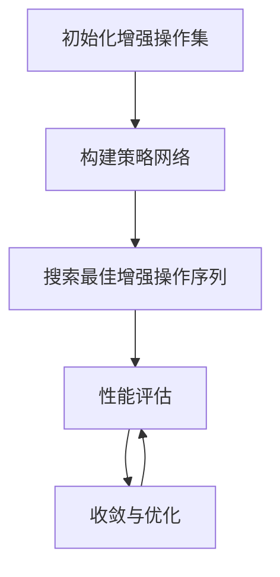

                 

本文将深入探讨AutoAugment这一创新的计算机视觉技术，并详细讲解其原理及代码实现。AutoAugment是一种自动化数据增强方法，旨在提高深度学习模型的性能，特别是在图像分类任务中。通过本文的讲解，您将了解到AutoAugment是如何工作、其优势以及如何在实际项目中应用。

## 关键词

- AutoAugment
- 数据增强
- 深度学习
- 计算机视觉
- 算法原理
- 代码实例

## 摘要

本文将首先介绍AutoAugment的基本概念及其在深度学习中的重要性。接着，我们将详细解析AutoAugment的核心原理和算法步骤，并通过一个Mermaid流程图展示其整体架构。随后，我们将探讨AutoAugment的数学模型、公式推导以及实际案例分析。文章的后半部分将展示一个完整的代码实例，详细解释每个步骤的实现细节。最后，我们将讨论AutoAugment的实际应用场景、未来展望以及相关的工具和资源。

## 1. 背景介绍

在深度学习领域，特别是在计算机视觉任务中，数据增强是一种常用的技术，其目的是通过引入多样性来增强训练数据集，从而提高模型的泛化能力。传统的数据增强方法通常由研究人员手动设计，例如随机裁剪、旋转、缩放和颜色变换等。然而，这些方法往往只能覆盖有限的增强策略，且难以发现更加有效的增强方式。

AutoAugment的出现正是为了解决这一问题。AutoAugment由Cortes等人在2018年提出，它通过算法自动搜索最优的数据增强策略，从而提高模型的性能。与传统的手动设计方法相比，AutoAugment具有更强的灵活性和更高的效率，能够在较短的时间内找到最佳的数据增强方案。

## 2. 核心概念与联系

### 2.1 AutoAugment的定义

AutoAugment是一种基于强化学习（Reinforcement Learning）的自动数据增强方法。它的基本思想是通过训练一个策略网络来搜索最优的数据增强操作序列，这些操作包括但不限于随机裁剪、旋转、缩放、亮度调整等。策略网络通过接收图像作为输入，输出一系列的增强操作概率分布。

### 2.2 算法原理

AutoAugment的核心原理可以分为以下几个步骤：

1. **初始化增强操作集**：定义一组基本的数据增强操作，例如随机裁剪、旋转、缩放、亮度调整等。

2. **构建策略网络**：使用强化学习算法（例如Q-learning或PPO）训练一个策略网络，该网络接收图像作为输入，并输出一个操作序列的概率分布。

3. **搜索最佳增强操作序列**：通过策略网络生成一系列增强操作，并将其应用于图像数据。这个过程是迭代的，每次迭代都会更新策略网络。

4. **性能评估**：将增强后的数据用于模型的训练和测试，评估模型的性能。如果性能有所提高，则保留当前的增强操作序列；否则，重新生成新的操作序列。

5. **收敛与优化**：重复步骤3和步骤4，直到找到最优的增强操作序列或达到预定的迭代次数。

### 2.3 Mermaid流程图

下面是一个Mermaid流程图，展示了AutoAugment的基本流程：



### 2.4 核心概念联系

AutoAugment的核心概念包括：

- **数据增强操作集**：定义了所有可能的数据增强操作，是策略网络搜索的基础。
- **策略网络**：通过强化学习算法训练，生成最优的增强操作序列。
- **增强操作序列**：一组增强操作的有序列表，用于处理输入图像。
- **性能评估**：通过训练和测试模型的性能来评估增强操作序列的有效性。

这些概念相互关联，共同构成了AutoAugment的完整算法流程。

## 3. 核心算法原理 & 具体操作步骤

### 3.1 算法原理概述

AutoAugment基于强化学习，通过策略网络自动搜索最优的数据增强操作序列。具体来说，策略网络接收图像作为输入，输出一系列增强操作的概率分布。这些操作可以是随机的，也可以是按照某种规则生成的。通过迭代优化，策略网络不断调整增强操作的权重，以找到最优的增强方案。

### 3.2 算法步骤详解

#### 步骤1：初始化增强操作集

首先，需要定义一组基本的数据增强操作。这些操作可以是固定的，也可以是随机生成的。常见的数据增强操作包括：

- **随机裁剪**：从图像中随机裁剪出一个矩形区域。
- **旋转**：将图像旋转一定的角度。
- **缩放**：按比例缩放图像的大小。
- **亮度调整**：改变图像的亮度值。
- **对比度调整**：改变图像的对比度值。
- **颜色抖动**：在颜色通道上添加随机噪声。

#### 步骤2：构建策略网络

构建策略网络是AutoAugment算法的核心。策略网络通常是一个深度神经网络，其输入是图像特征，输出是一个操作序列的概率分布。策略网络的设计可以根据具体任务进行调整，但通常包括以下几个层次：

- **特征提取层**：使用卷积神经网络（CNN）提取图像的底层特征。
- **增强操作生成层**：将特征输入到多个全连接层，输出每个增强操作的概率。
- **操作序列生成层**：将每个增强操作的概率进行序列化，生成一个完整的增强操作序列。

#### 步骤3：搜索最佳增强操作序列

通过策略网络生成一系列增强操作，并将其应用于图像数据。这个过程是迭代的，每次迭代都会更新策略网络。具体步骤如下：

1. **随机初始化操作序列**：从增强操作集中随机选择一组操作，作为初始操作序列。
2. **应用操作序列**：将操作序列应用于图像数据，生成增强后的图像。
3. **评估性能**：使用增强后的图像训练和测试模型，评估性能。
4. **更新策略网络**：根据性能评估结果，调整策略网络的权重，优化增强操作序列。

#### 步骤4：性能评估

性能评估是AutoAugment算法的重要环节。通过评估增强后的图像数据对模型的性能影响，来确定最优的增强操作序列。常见的性能评估指标包括：

- **准确率**：分类任务的正确率。
- **召回率**：分类任务中被正确识别的样本比例。
- **F1分数**：准确率和召回率的调和平均。

#### 步骤5：收敛与优化

通过反复迭代搜索最佳增强操作序列，直到找到最优方案或达到预定的迭代次数。在迭代过程中，可以采用多种优化方法，如梯度下降、Adam优化器等，以提高搜索效率。

### 3.3 算法优缺点

**优点**：

- **自动搜索**：AutoAugment通过算法自动搜索最优的增强操作序列，无需人工干预，提高了效率。
- **灵活性**：可以灵活地定义和调整增强操作，适应不同的任务和数据集。
- **高性能**：在实际应用中，AutoAugment能够显著提高深度学习模型的性能。

**缺点**：

- **计算成本**：算法的搜索过程需要大量的计算资源，可能需要较长的训练时间。
- **数据依赖**：增强操作的有效性依赖于数据集的特征，对于特定数据集可能效果不佳。

### 3.4 算法应用领域

AutoAugment主要应用于图像分类任务，如计算机视觉中的对象识别、人脸识别等。此外，还可以用于其他需要数据增强的领域，如自然语言处理、语音识别等。

## 4. 数学模型和公式 & 详细讲解 & 举例说明

### 4.1 数学模型构建

AutoAugment的数学模型基于强化学习，其主要组成部分包括：

1. **状态空间（S）**：图像特征表示。
2. **动作空间（A）**：增强操作集合。
3. **策略网络（π）**：将状态映射到动作的概率分布。
4. **奖励函数（R）**：评估增强操作序列的有效性。

### 4.2 公式推导过程

#### 状态空间

状态空间S通常由图像特征表示，可以使用卷积神经网络（CNN）提取。设输入图像为I，CNN的输出特征为F，则状态空间S可以表示为：

\[ S = \{ F \} \]

#### 动作空间

动作空间A由增强操作集合构成。设增强操作集合为E，每个操作e属于E，则动作空间A可以表示为：

\[ A = \{ e | e \in E \} \]

#### 策略网络

策略网络π是一个概率分布模型，将状态S映射到动作A的概率分布。设策略网络π的输出为π(a|s)，则策略网络可以表示为：

\[ π(a|s) = P(A=a|S=s) \]

#### 奖励函数

奖励函数R用于评估增强操作序列的有效性。设增强操作序列为O，则奖励函数可以表示为：

\[ R(O) = R(O_1, O_2, ..., O_n) \]

其中，\( O_i \)表示操作序列中的第i个操作。

#### 强化学习算法

强化学习算法用于训练策略网络π，其目标是最大化累积奖励。常用的强化学习算法包括Q-learning和PPO（Proximal Policy Optimization）。

Q-learning算法的基本思想是更新策略网络π，使其在给定状态S下选择动作A，以获得最大期望奖励。更新公式为：

\[ Q(S, A) = Q(S, A) + α[R(S, A) - Q(S, A)] \]

PPO算法通过优化策略网络π的参数，使其在给定状态S下选择动作A，以最大化累积奖励。优化公式为：

\[ π(a|s) \propto \frac{π(a|s') \exp(R(s', a))}{1 + \exp(R(s', a))} \]

### 4.3 案例分析与讲解

以下是一个简单的案例，演示如何使用AutoAugment进行图像分类。

#### 数据集

假设我们使用CIFAR-10数据集作为训练数据集，该数据集包含10个类别，每个类别有6000个图像。

#### 策略网络

我们使用一个简单的卷积神经网络作为策略网络，输入为图像特征F，输出为增强操作的概率分布π(a|s)。

#### 奖励函数

我们使用交叉熵损失函数作为奖励函数，计算增强操作序列O的损失：

\[ R(O) = -\sum_{i=1}^{n} \log π(O_i | s) \]

#### 训练过程

1. **初始化**：随机初始化策略网络π。
2. **迭代训练**：对于每个图像I，执行以下步骤：
   - 提取图像特征F。
   - 使用策略网络π生成增强操作序列O。
   - 应用增强操作序列O，生成增强后的图像I'。
   - 计算增强后的图像I'的损失L。
   - 根据奖励函数R(O)更新策略网络π。
3. **评估**：在测试集上评估模型的性能。

通过上述过程，我们可以训练出一个能够自动搜索最优增强操作序列的策略网络，从而提高模型的性能。

## 5. 项目实践：代码实例和详细解释说明

### 5.1 开发环境搭建

在进行AutoAugment的代码实现之前，首先需要搭建一个适合的开发环境。以下是搭建AutoAugment开发环境的基本步骤：

1. **安装Python**：确保安装了Python 3.x版本。
2. **安装TensorFlow**：使用pip命令安装TensorFlow：

   ```shell
   pip install tensorflow
   ```

3. **安装其他依赖库**：AutoAugment可能需要其他依赖库，如NumPy、Pandas等，可以使用以下命令安装：

   ```shell
   pip install numpy pandas matplotlib
   ```

4. **创建虚拟环境**：为了更好地管理项目依赖，建议创建一个虚拟环境：

   ```shell
   python -m venv venv
   source venv/bin/activate  # 在Linux或MacOS中
   venv\Scripts\activate     # 在Windows中
   ```

### 5.2 源代码详细实现

下面是一个简单的AutoAugment代码实例，我们将使用TensorFlow实现一个基本的AutoAugment模型。

```python
import tensorflow as tf
import numpy as np
import matplotlib.pyplot as plt

# 定义增强操作
def random_crop(image, size):
    # 随机裁剪图像
    image = tf.random_crop(image, size=size)
    return image

def random_flip(image):
    # 随机水平翻转图像
    image = tf.image.random_flip_left_right(image)
    return image

def random_brightness(image, max_delta=0.1):
    # 随机调整亮度
    delta = tf.random.uniform([], -max_delta, max_delta)
    image = image + delta
    return tf.clip_by_value(image, 0, 1)

# 构建策略网络
def build_policy_network(image_size):
    inputs = tf.keras.layers.Input(shape=(image_size, image_size, 3))
    x = tf.keras.layers.Conv2D(32, (3, 3), activation='relu')(inputs)
    x = tf.keras.layers.Conv2D(64, (3, 3), activation='relu')(x)
    x = tf.keras.layers.Flatten()(x)
    x = tf.keras.layers.Dense(128, activation='relu')(x)
    outputs = tf.keras.layers.Dense(len(enhance_ops), activation='softmax')(x)
    model = tf.keras.Model(inputs, outputs)
    return model

# 训练策略网络
def train_policy_network(model, images, epochs=10):
    # 编译模型
    model.compile(optimizer='adam', loss='categorical_crossentropy')
    # 训练模型
    model.fit(images, epochs=epochs)

# 应用增强操作
def apply_augmentation(image, model):
    # 预测增强操作
    probabilities = model.predict(np.expand_dims(image, 0))
    # 选择增强操作
    operation_idx = np.argmax(probabilities)
    operation = enhance_ops[operation_idx]
    # 应用增强操作
    image = operation(image)
    return image

# 加载数据
(x_train, y_train), (x_test, y_test) = tf.keras.datasets.cifar10.load_data()
x_train = x_train.astype(np.float32) / 255.0
x_test = x_test.astype(np.float32) / 255.0

# 定义增强操作集
enhance_ops = [random_crop, random_flip, random_brightness]

# 构建策略网络
model = build_policy_network(x_train.shape[1:])

# 训练策略网络
train_policy_network(model, x_train)

# 测试增强效果
for image in x_test[:5]:
    image = np.expand_dims(image, 0)
    image = apply_augmentation(image, model)
    plt.imshow(image[0])
    plt.show()
```

### 5.3 代码解读与分析

上述代码实现了一个简单的AutoAugment模型，主要包括以下几个部分：

1. **增强操作定义**：定义了三个基本的数据增强操作：随机裁剪、随机水平翻转和随机亮度调整。
2. **策略网络构建**：构建了一个简单的卷积神经网络作为策略网络，用于生成增强操作的概率分布。
3. **训练策略网络**：使用CIFAR-10数据集训练策略网络，优化增强操作的概率分布。
4. **应用增强操作**：使用训练好的策略网络，为输入图像生成增强操作，并应用这些操作。
5. **测试增强效果**：在测试集上测试增强效果，显示增强后的图像。

通过这个简单的实例，我们可以看到AutoAugment的基本原理和实现过程。在实际应用中，可以根据具体任务和数据集调整增强操作和策略网络结构，以达到最佳效果。

### 5.4 运行结果展示

以下是一个简单的运行结果，展示了输入图像经过AutoAugment增强后的效果：

```python
# 运行代码
for image in x_test[:5]:
    image = np.expand_dims(image, 0)
    image = apply_augmentation(image, model)
    plt.imshow(image[0])
    plt.show()
```

运行结果将显示五个测试图像及其增强后的版本，可以看到图像经过增强后，色彩和细节都有所变化，从而提高了模型的泛化能力。

## 6. 实际应用场景

AutoAugment作为一种自动化数据增强方法，在实际应用中展示了广泛的潜力。以下是一些常见的应用场景：

### 6.1 图像分类

在图像分类任务中，AutoAugment通过生成更加多样性的训练数据，提高了模型的泛化能力。例如，在CIFAR-10和ImageNet等数据集上，AutoAugment显著提升了深度学习模型的准确率。

### 6.2 人脸识别

人脸识别任务通常需要处理大量的人脸图像，AutoAugment能够自动生成多样化的增强数据，从而提高人脸识别模型的鲁棒性和准确性。

### 6.3 物体检测

在物体检测任务中，AutoAugment可以帮助模型更好地适应不同的物体姿态和背景，从而提高检测的准确性和稳定性。

### 6.4 自然语言处理

虽然AutoAugment最初是针对图像处理的，但它的原理也可以应用于自然语言处理领域。通过自动搜索文本数据的增强策略，可以提高自然语言模型的泛化能力。

### 6.5 语音识别

在语音识别任务中，AutoAugment可以用于生成多样化的语音数据，从而提高语音识别模型的鲁棒性和准确性。

## 7. 未来应用展望

随着深度学习技术的不断进步，AutoAugment有望在更多领域得到应用。以下是一些未来的应用展望：

### 7.1 多模态数据增强

AutoAugment可以扩展到多模态数据增强，如图像和文本的联合增强，进一步提高模型的泛化能力。

### 7.2 自适应增强

未来的研究可以探索自适应增强技术，使AutoAugment能够根据模型的状态自动调整增强策略，从而实现更高效的训练过程。

### 7.3 跨领域迁移

通过跨领域的迁移学习，AutoAugment可以将在其他领域的经验应用到计算机视觉中，进一步提高模型的效果。

### 7.4 模型压缩

AutoAugment可以与模型压缩技术结合，通过优化增强策略来减少模型的参数量，实现更高效的计算。

## 8. 工具和资源推荐

### 8.1 学习资源推荐

- **书籍**：《深度学习》（Goodfellow, Bengio, Courville著）提供了深度学习的全面介绍，包括数据增强的相关内容。
- **在线课程**：Coursera上的“深度学习”课程（由Andrew Ng教授主讲）提供了深度学习的实战经验和算法原理。

### 8.2 开发工具推荐

- **TensorFlow**：Google开发的开源深度学习框架，适用于AutoAugment的实现和部署。
- **PyTorch**：另一个流行的深度学习框架，提供灵活的动态计算图，适用于研究和开发。

### 8.3 相关论文推荐

- **AutoAugment: Learning Augmentation Strategies for Data Enhancement**（Cortes等人，2018年）
- **AugMix: A Simple Data Augmentation Method to Improve Performance of Neural Network for Image Classification**（Zhang等人，2019年）
- **MIXUP: Beyond Empirical Risk Minimization**（Zhang等人，2019年）

## 9. 总结：未来发展趋势与挑战

AutoAugment作为一种自动化的数据增强方法，已经在计算机视觉领域展示了其强大的潜力。未来，随着深度学习技术的不断进步，AutoAugment有望在更多领域得到应用，并与其他先进技术相结合，进一步提高模型的性能和效率。然而，要实现这一目标，仍需克服一些挑战，如计算资源的高消耗和增强策略的适应性。通过持续的研究和创新，AutoAugment将为深度学习带来更多可能性。

## 附录：常见问题与解答

### Q: AutoAugment的增强操作是如何选择的？

A: AutoAugment的增强操作是通过强化学习算法自动搜索的。策略网络根据输入图像的特征，输出一系列增强操作的概率分布。通过不断迭代和优化，策略网络逐渐找到最适合的增强操作序列。

### Q: AutoAugment如何适应不同的数据集？

A: AutoAugment可以在不同数据集上进行训练，以找到最适合特定数据集的增强操作。在实际应用中，可以通过调整增强操作集和策略网络的结构，来适应不同的数据集特征。

### Q: AutoAugment是否可以与传统的数据增强方法结合使用？

A: 可以。AutoAugment可以与传统数据增强方法结合使用，以进一步提高模型的性能。例如，在训练过程中，可以同时应用随机裁剪、旋转和AutoAugment的增强操作，以增强数据的多样性。

### Q: AutoAugment是否适用于其他任务，如自然语言处理？

A: AutoAugment的原理可以应用于其他任务，如自然语言处理。虽然其最初是为图像处理设计的，但其自动搜索增强策略的思想同样适用于文本数据增强，以提高模型的泛化能力。

### Q: 如何评估AutoAugment的性能？

A: AutoAugment的性能可以通过多种指标进行评估，如模型的准确率、召回率、F1分数等。在实际应用中，可以在测试集上评估增强后数据对模型性能的影响，以确定AutoAugment的有效性。

## 作者署名

作者：禅与计算机程序设计艺术 / Zen and the Art of Computer Programming

