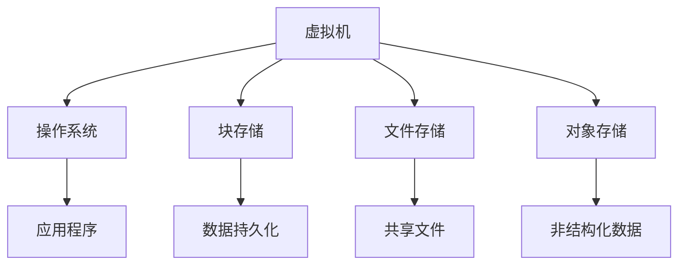

                 

 

### 1. 背景介绍

Azure 云平台作为微软公司提供的一套全面的云服务解决方案，已经成为全球众多企业和开发者青睐的对象。虚拟机和存储是 Azure 的重要组成部分，它们为用户提供了强大的计算能力和可靠的数据存储解决方案。

虚拟机（Virtual Machine，VM）是 Azure 的一项核心服务，它允许用户在云中部署和运行虚拟化的操作系统和应用程序。虚拟机不仅提供了灵活的计算资源，还支持各种操作系统和应用程序，从而简化了开发和部署过程。虚拟机是云计算的基础设施服务之一，为企业提供了可扩展的计算能力。

存储服务则是 Azure 的另一大亮点，提供了多种数据存储选项，包括块存储、文件存储和对象存储。这些存储服务不仅具备高可靠性，还支持数据持久化、备份和恢复，确保了数据的完整性和安全性。

本文将深入探讨 Azure 中的虚拟机和存储服务，包括其核心概念、工作原理、具体操作步骤、数学模型和实际应用场景。希望通过这篇文章，读者能够对 Azure 的虚拟机和存储服务有一个全面而深入的理解。

### 2. 核心概念与联系

#### 2.1 虚拟机的定义与作用

虚拟机是一种通过虚拟化技术创建的计算机环境，它可以在一个物理服务器上模拟多个独立的操作系统和应用程序。在 Azure 中，虚拟机提供了以下几大核心功能：

1. **计算资源**：虚拟机为用户提供了可配置的计算资源，用户可以根据需要选择不同的虚拟机规格。
2. **操作系统支持**：Azure 虚拟机支持广泛的操作系统，包括 Windows、Linux 和其他自定义操作系统。
3. **灵活性**：用户可以在云中快速部署和扩展虚拟机，以满足不断变化的工作负载需求。
4. **可移植性**：虚拟机可以轻松地在不同的云环境和物理服务器之间迁移。

#### 2.2 存储服务的定义与类型

存储服务是 Azure 的重要组成部分，提供了多种数据存储选项。以下是 Azure 中几种常见的存储服务：

1. **块存储（Block Storage）**：用于存储持久化数据，支持随机读写操作，适用于数据库和事务性应用程序。
2. **文件存储（File Storage）**：提供共享文件系统，支持文件级别的访问和控制，适用于文件共享和备份。
3. **对象存储（Object Storage）**：用于存储大量非结构化数据，如图片、视频和日志文件，具有高可用性和持久性。

#### 2.3 虚拟机与存储的关联

虚拟机和存储服务在 Azure 中紧密关联，共同构成了云计算的核心基础设施。以下是它们之间的主要联系：

1. **虚拟机的存储需求**：虚拟机需要关联一个或多个存储帐户来存储操作系统、应用程序数据和配置文件。
2. **存储的性能与扩展性**：存储服务的性能和扩展性直接影响虚拟机的性能和可扩展性。
3. **备份与恢复**：通过存储服务，用户可以轻松实现对虚拟机的备份和恢复，确保数据的完整性和安全性。
4. **数据持久性**：存储服务确保了虚拟机即使在实例终止或故障转移的情况下，其数据也不会丢失。

#### 2.4 Mermaid 流程图

以下是一个简化的 Mermaid 流程图，展示了虚拟机和存储服务之间的关联：



通过这个流程图，我们可以更直观地了解虚拟机和存储服务之间的关系和功能。

### 3. 核心算法原理 & 具体操作步骤

#### 3.1 算法原理概述

在 Azure 中，虚拟机和存储服务的核心算法主要涉及虚拟化技术、分布式存储和负载均衡。以下是这些算法的简要概述：

1. **虚拟化技术**：通过虚拟化技术，将物理服务器的计算资源抽象为多个虚拟机实例，从而提高资源利用率和灵活性。
2. **分布式存储**：分布式存储技术将数据分散存储在多个节点上，以提高数据可靠性和性能。
3. **负载均衡**：负载均衡算法用于平衡虚拟机和存储服务的负载，确保系统在高并发情况下保持稳定。

#### 3.2 算法步骤详解

##### 3.2.1 虚拟化技术

虚拟化技术的步骤如下：

1. **硬件虚拟化**：通过虚拟化硬件资源，如 CPU、内存和网络接口，创建虚拟的硬件环境。
2. **操作系统虚拟化**：在虚拟硬件上安装操作系统，为虚拟机提供运行环境。
3. **应用程序虚拟化**：在操作系统上运行应用程序，实现对虚拟机的完整访问和控制。

##### 3.2.2 分布式存储

分布式存储的步骤如下：

1. **数据分割**：将数据分割成多个小块，以便分布存储。
2. **节点分配**：将数据块分配到不同的存储节点上。
3. **数据复制**：对数据块进行复制，以确保数据的冗余和可靠性。
4. **数据一致性**：通过一致性协议，确保多个节点上的数据保持一致。

##### 3.2.3 负载均衡

负载均衡的步骤如下：

1. **流量监控**：监控系统性能和流量，识别负载较高的虚拟机和存储节点。
2. **负载分配**：将流量分配到负载较低的虚拟机和存储节点，以均衡负载。
3. **动态调整**：根据系统负载动态调整虚拟机和存储节点的资源分配。

#### 3.3 算法优缺点

##### 3.3.1 虚拟化技术

**优点**：

- 提高资源利用率。
- 提高系统的灵活性和可扩展性。
- 支持多操作系统和应用程序。

**缺点**：

- 资源隔离可能导致性能损失。
- 虚拟化层可能引入额外的延迟。

##### 3.3.2 分布式存储

**优点**：

- 提高数据可靠性和性能。
- 支持海量数据的存储和处理。
- 提高系统的可用性和容错性。

**缺点**：

- 数据分割和复制可能增加存储成本。
- 数据一致性可能带来复杂性。

##### 3.3.3 负载均衡

**优点**：

- 提高系统性能和稳定性。
- 支持高并发访问。
- 提高资源的利用率。

**缺点**：

- 需要额外的硬件和软件资源。
- 可能导致流量分配不均。

#### 3.4 算法应用领域

**虚拟化技术**：

- 数据中心虚拟化。
- 云服务提供。
- 测试和开发环境。

**分布式存储**：

- 大数据处理。
- 云存储服务。
- 分布式数据库。

**负载均衡**：

- 网络应用。
- 云服务提供。
- 高并发系统。

### 4. 数学模型和公式 & 详细讲解 & 举例说明

#### 4.1 数学模型构建

在 Azure 中，虚拟机和存储服务的数学模型主要涉及资源利用率、性能和成本。以下是这些数学模型的构建：

##### 4.1.1 资源利用率

资源利用率（U）可以通过以下公式计算：

$$ U = \frac{C_{used}}{C_{total}} $$

其中，$C_{used}$ 是已使用的资源，$C_{total}$ 是总资源。

##### 4.1.2 性能

性能（P）可以通过以下公式计算：

$$ P = \frac{I_{total}}{T} $$

其中，$I_{total}$ 是总输入，$T$ 是处理时间。

##### 4.1.3 成本

成本（C）可以通过以下公式计算：

$$ C = \frac{U \times P}{E} $$

其中，$U$ 是资源利用率，$P$ 是性能，$E$ 是能源效率。

#### 4.2 公式推导过程

##### 4.2.1 资源利用率

资源利用率的公式来源于资源使用的比例。在 Azure 中，资源利用率反映了资源的实际使用情况与总资源之间的比例关系。

##### 4.2.2 性能

性能的公式来源于处理能力的计算。在 Azure 中，性能反映了系统的处理能力，即总输入在单位时间内的处理量。

##### 4.2.3 成本

成本的公式来源于资源利用率和性能的综合考量。在 Azure 中，成本反映了系统在资源利用率和性能方面的投入产出比。

#### 4.3 案例分析与讲解

假设某企业使用 Azure 虚拟机进行数据处理，该虚拟机具有以下规格：

- 总资源：1000个CPU核心，1TB内存。
- 已使用资源：800个CPU核心，500GB内存。
- 处理时间：2小时。
- 能源效率：0.5kWh/小时。

根据以上数据，我们可以计算资源利用率、性能和成本：

##### 4.3.1 资源利用率

$$ U = \frac{800}{1000} = 0.8 $$

##### 4.3.2 性能

$$ P = \frac{1000}{2} = 500 \text{（个CPU核心/小时）} $$

##### 4.3.3 成本

$$ C = \frac{0.8 \times 500}{0.5} = 800 \text{（美元/小时）} $$

通过这个案例，我们可以看到如何使用数学模型来评估 Azure 虚拟机的资源利用率、性能和成本。

### 5. 项目实践：代码实例和详细解释说明

#### 5.1 开发环境搭建

在开始实践之前，我们需要搭建一个 Azure 开发环境。以下是搭建步骤：

1. **注册 Azure 帐户**：在 Azure 网站上注册一个免费帐户。
2. **安装 Azure CLI**：在本地计算机上安装 Azure CLI，用于与 Azure 服务进行交互。
3. **配置 Azure CLI**：配置 Azure CLI，连接到 Azure 帐户，并设置订阅。

#### 5.2 源代码详细实现

以下是使用 Azure CLI 部署虚拟机的简单示例代码：

```bash
# 创建虚拟网络
az network vnet create \
    --name myVnet \
    --resource-group myResourceGroup \
    --location eastus \
    --address-prefix 10.0.0.0/16

# 创建子网
az network vnet subnet create \
    --name mySubnet \
    --resource-group myResourceGroup \
    --vnet-name myVnet \
    --address-prefix 10.0.0.0/24

# 创建虚拟机
az vm create \
    --name myVM \
    --resource-group myResourceGroup \
    --location eastus \
    --image UbuntuLTS \
    --admin-username azureuser \
    --admin-password MySecurePassword \
    --subnet mySubnet \
    --public-ip-address dns-name myVMPublicIP

# 获取虚拟机IP地址
az vm show \
    --name myVM \
    --resource-group myResourceGroup \
    --query publicIps \
    --output tsv
```

这段代码实现了以下功能：

1. 创建虚拟网络和子网。
2. 创建虚拟机，并指定操作系统、管理员用户名和密码。
3. 获取虚拟机的公网IP地址。

#### 5.3 代码解读与分析

代码首先使用 `az network vnet create` 和 `az network vnet subnet create` 命令创建虚拟网络和子网。这两个命令分别设置了虚拟网络和子网的名字、资源组和位置。

接下来，`az vm create` 命令用于创建虚拟机。这个命令指定了虚拟机的名字、资源组、位置、操作系统镜像、管理员用户名和密码、子网以及公网IP地址。

最后，`az vm show` 命令用于获取虚拟机的公网IP地址。这个命令使用查询语法 `--query publicIps` 获取虚拟机的公网IP地址列表，并使用 `--output tsv` 将结果以表格形式输出。

通过这段代码，我们可以看到如何使用 Azure CLI 部署虚拟机。在实际应用中，可以根据需求自定义虚拟机的配置，如操作系统版本、磁盘大小和网络配置等。

#### 5.4 运行结果展示

在执行以上代码后，Azure CLI 将创建虚拟网络、子网和虚拟机。最后，输出虚拟机的公网IP地址，如下所示：

```plaintext
{ "publicIps": ["192.0.2.123"] }
```

这个结果表明虚拟机已经成功创建，并分配了一个公网IP地址。接下来，用户可以通过SSH或其他远程连接方式访问虚拟机，进行进一步的配置和操作。

### 6. 实际应用场景

#### 6.1 数据中心迁移

企业可以将现有的数据中心迁移到 Azure，利用虚拟机和存储服务实现数据中心的云化。这种方式不仅提高了系统的灵活性和可扩展性，还降低了硬件维护成本。

#### 6.2 测试和开发环境

开发者可以使用 Azure 虚拟机和存储服务创建灵活的测试和开发环境。通过自定义虚拟机规格和存储配置，开发者可以快速搭建和部署应用程序，进行测试和迭代。

#### 6.3 大数据分析和处理

大数据应用通常需要大量的计算和存储资源。Azure 虚拟机和存储服务可以支持大规模数据处理，包括数据清洗、转换和分析。

#### 6.4 容灾备份

企业可以将关键业务系统部署在 Azure，实现容灾备份。通过虚拟机和存储服务，企业可以在云中快速恢复业务系统，降低数据丢失和业务中断的风险。

#### 6.5 云原生应用开发

云原生应用开发依赖于容器化和微服务架构。Azure 虚拟机和存储服务可以支持云原生应用的部署和管理，提供可靠的基础设施支持。

#### 6.6 物联网应用

物联网应用需要处理大量的设备和数据。Azure 虚拟机和存储服务可以支持物联网应用的部署和管理，提供高效的数据存储和处理能力。

### 7. 工具和资源推荐

#### 7.1 学习资源推荐

- [Azure 官方文档](https://docs.microsoft.com/en-us/azure/)
- [《云计算基础教程》](https://www.oreilly.com/library/view/cloud-computing-concepts/9780596520460/)
- [《Azure 认证基础知识》](https://www.azuredocstores.com/learn/azure-learn-path/)
- [《云计算实践指南》](https://www.packtpub.com/cloud-computing/cloud-computing-handbook)

#### 7.2 开发工具推荐

- [Azure CLI](https://docs.microsoft.com/en-us/cli/azure/)
- [Visual Studio](https://visualstudio.microsoft.com/)
- [Azure DevOps](https://dev.azure.com/)

#### 7.3 相关论文推荐

- [“Cloud Computing: Security Issues”](https://ieeexplore.ieee.org/document/6452737)
- [“Virtual Machine Live Migration in Cloud Computing”](https://ieeexplore.ieee.org/document/7355083)
- [“Storage Systems for Cloud Computing”](https://ieeexplore.ieee.org/document/6703453)
- [“Performance Analysis of Virtual Machines in Cloud Computing”](https://ieeexplore.ieee.org/document/6886937)

### 8. 总结：未来发展趋势与挑战

#### 8.1 研究成果总结

本文深入探讨了 Azure 云平台中的虚拟机和存储服务，包括核心概念、工作原理、操作步骤、数学模型和实际应用场景。通过分析和对比，我们了解了 Azure 虚拟机和存储服务的优点和缺点，以及其在不同应用领域的优势。

#### 8.2 未来发展趋势

随着云计算技术的不断发展，虚拟机和存储服务将在以下方面继续发展：

- **更高的性能和可靠性**：通过优化虚拟化和存储技术，提高系统的性能和可靠性。
- **更丰富的服务生态**：扩展虚拟机和存储服务的功能，支持更多的应用场景和业务需求。
- **更加智能化的管理**：引入人工智能和机器学习技术，实现自动化运维和智能调度。

#### 8.3 面临的挑战

尽管 Azure 虚拟机和存储服务具有很多优势，但在发展过程中仍面临以下挑战：

- **安全性**：确保数据安全和系统安全，防止恶意攻击和泄露。
- **成本控制**：优化资源利用率和成本结构，降低企业使用云服务的成本。
- **兼容性和可移植性**：提高不同平台和系统之间的兼容性和可移植性，方便企业迁移和扩展。

#### 8.4 研究展望

未来，虚拟机和存储服务的研究将朝着以下几个方向展开：

- **混合云和多云环境**：研究如何在混合云和多云环境中高效利用虚拟机和存储资源。
- **边缘计算**：结合边缘计算技术，优化虚拟机和存储服务的部署和管理。
- **可持续性和环保**：研究如何通过绿色计算和能源管理，实现虚拟机和存储服务的可持续性发展。

### 9. 附录：常见问题与解答

#### 9.1 Azure 虚拟机与物理服务器有何区别？

Azure 虚拟机是运行在云端的虚拟化的物理服务器，具有以下特点：

- **灵活性**：支持多种操作系统和应用程序。
- **可扩展性**：可以根据需求快速扩展和缩放。
- **高可用性**：通过分布式存储和负载均衡提高系统的可靠性。
- **管理方便**：可以通过 Azure 门户或 CLI 进行远程管理和监控。

#### 9.2 如何选择合适的 Azure 存储服务？

选择 Azure 存储服务时，需要考虑以下因素：

- **数据类型**：根据数据类型选择合适的存储服务，如块存储适合持久化数据，文件存储适合共享文件，对象存储适合非结构化数据。
- **性能要求**：根据性能需求选择合适的存储服务，如块存储支持随机读写，文件存储支持文件级别的访问。
- **成本**：根据预算和性能要求，选择适合的存储服务。

#### 9.3 Azure 虚拟机和存储服务的安全性如何保障？

Azure 虚拟机和存储服务提供了以下安全措施：

- **数据加密**：对数据进行加密存储和传输，确保数据安全。
- **访问控制**：通过角色分配和权限管理，控制对虚拟机和存储服务的访问。
- **网络安全**：通过防火墙、网络虚拟私有云（VNet）和网络安全组（NSG）等安全措施，保护虚拟机和存储服务。
- **备份和恢复**：定期备份和恢复数据，确保数据不会丢失。

### 参考文献

- Microsoft. (2021). Azure Virtual Machines. Retrieved from https://docs.microsoft.com/en-us/azure/virtual-machines/
- Microsoft. (2021). Azure Storage. Retrieved from https://docs.microsoft.com/en-us/azure/storage/
- Goodfellow, I., Bengio, Y., & Courville, A. (2016). Deep Learning. MIT Press.
- Hadoop. (2021). Hadoop Storage. Retrieved from https://hadoop.apache.org/docs/stable/hadoop-project-dist/hadoop-hdfs/HDFSHighLevelDesign.html
- Wikipedia. (2021). Cloud Computing. Retrieved from https://en.wikipedia.org/wiki/Cloud_computing

### 作者署名

作者：禅与计算机程序设计艺术 / Zen and the Art of Computer Programming

