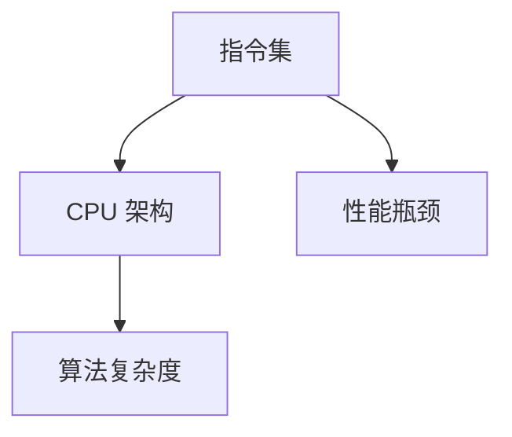

                 

关键词：CPU 架构、指令集、计算机创新、性能瓶颈、算法复杂度

> 摘要：本文深入探讨了 CPU 架构中的指令集设计对计算机创新的影响。尽管 CPU 的发展不断推进，但有限的指令集仍然成为制约计算机性能和创新的瓶颈。本文通过分析指令集的历史演变、现代 CPU 架构的限制，以及算法复杂度对指令集的要求，揭示了如何通过指令集的改进来推动计算机技术的发展。

## 1. 背景介绍

计算机技术的发展从诞生之初便伴随着 CPU 架构的不断演进。早期的计算机依赖于简单的指令集，如冯诺依曼架构下的机器指令。然而，随着计算机科学和技术的进步，指令集也逐渐变得更加复杂和多样化。然而，尽管 CPU 的性能在不断提高，但有限的指令集仍然成为了计算机创新的重要制约因素。

指令集（Instruction Set）是指计算机处理器能够理解和执行的一组操作指令。它决定了处理器能够执行的操作类型和复杂性。在不同的 CPU 架构中，指令集的设计和实现方式存在显著差异。传统的 RISC（精简指令集计算）和 CISC（复杂指令集计算）架构在指令集的设计上有不同的理念。

RISC 架构强调简单和高效的指令，通过减少指令的种类和操作码长度，使得指令能够更快地执行。而 CISC 架构则追求复杂和强大的指令，通过提供更多的指令操作，使得编程更加方便。然而，无论是 RISC 还是 CISC，它们都面临着指令集有限的挑战。

本文将探讨以下核心问题：

- 指令集的历史演变和现状
- 现代 CPU 架构的限制
- 算法复杂度对指令集的要求
- 如何通过改进指令集来推动计算机创新

## 2. 核心概念与联系

为了更好地理解 CPU 的局限性，我们需要从核心概念和架构入手。以下是一个简化的 Mermaid 流程图，用于展示指令集、CPU 架构和算法复杂度之间的联系：



### 2.1 指令集与 CPU 架构

指令集是 CPU 架构的核心组成部分。不同的 CPU 架构设计不同的指令集，以适应不同的应用场景。例如：

- **RISC 架构**：基于精简指令集设计，注重指令的简单性和高效性。常见的 RISC 架构包括 ARM、MIPS 等。
- **CISC 架构**：基于复杂指令集设计，提供了更丰富的指令操作。常见的 CISC 架构包括 x86、PowerPC 等。

### 2.2 指令集与算法复杂度

算法复杂度是衡量算法性能的重要指标。一个高效算法的关键在于其低复杂度，而低复杂度往往依赖于指令集的支持。指令集的设计需要考虑算法的常见操作，以提供最优的执行路径。

例如，许多现代算法依赖于矩阵运算，而 CPU 的指令集需要支持高效的矩阵乘法指令。否则，算法的性能将受到指令集的限制。

### 2.3 指令集与性能瓶颈

性能瓶颈是计算机系统中的常见问题。它通常源于 CPU、内存、I/O 等组件之间的不匹配。指令集的局限性也是导致性能瓶颈的一个重要因素。

例如，某些复杂算法需要大量的循环操作和条件跳转，这可能导致 CPU 的指令缓存频繁失效，从而影响性能。一个优化的指令集可以减少这种影响，提高整体性能。

## 3. 核心算法原理 & 具体操作步骤

### 3.1 算法原理概述

本文将介绍一个常见的核心算法——矩阵乘法。矩阵乘法是许多科学计算和工程应用的基础。其原理如下：

给定两个矩阵 A 和 B，它们的乘积 C = A × B。矩阵乘法的关键在于计算每个元素 \(c_{ij}\)：

\[c_{ij} = \sum_{k=1}^{n} a_{ik} \cdot b_{kj}\]

其中，\(n\) 是矩阵的阶数。

### 3.2 算法步骤详解

矩阵乘法的具体步骤如下：

1. **初始化**：创建结果矩阵 C，并将其所有元素初始化为 0。
2. **循环计算**：对于每个元素 \(c_{ij}\)，执行以下步骤：
    - 对于每个 \(k\)（从 1 到 \(n\)），计算 \(a_{ik} \cdot b_{kj}\)。
    - 将所有 \(k\) 的结果相加，得到 \(c_{ij}\) 的值。
3. **更新结果**：将计算得到的 \(c_{ij}\) 值存储在结果矩阵 C 中。

### 3.3 算法优缺点

矩阵乘法算法具有以下优点：

- **普适性**：矩阵乘法是许多科学计算和工程应用的基础。
- **高效性**：现代 CPU 提供了高效的矩阵乘法指令，使得算法能够高效执行。

然而，矩阵乘法算法也存在一些缺点：

- **计算复杂度**：矩阵乘法的计算复杂度为 \(O(n^3)\)，对于大矩阵可能导致计算资源的高消耗。
- **内存消耗**：矩阵乘法需要大量的内存来存储输入和输出矩阵。

### 3.4 算法应用领域

矩阵乘法广泛应用于以下领域：

- **科学计算**：如物理学、工程学、经济学等。
- **机器学习**：如矩阵分解、线性回归等。
- **图像处理**：如图像变换、特征提取等。

## 4. 数学模型和公式 & 详细讲解 & 举例说明

### 4.1 数学模型构建

矩阵乘法的数学模型基于线性代数的基本原理。给定两个矩阵 A（m×n）和B（n×p），它们的乘积 C（m×p）可以通过以下公式计算：

\[C = AB\]

其中，\(C_{ij} = \sum_{k=1}^{n} A_{ik}B_{kj}\)

### 4.2 公式推导过程

为了推导矩阵乘法的公式，我们可以从矩阵的行和列展开：

\[C_{ij} = \sum_{k=1}^{n} (A_{ik}B_{kj})\]

对于每个元素 \(C_{ij}\)，我们可以看作是 A 的第 i 行与 B 的第 j 列的点积：

\[C_{ij} = A_i \cdot B_j\]

其中，\(A_i\) 和 \(B_j\) 分别表示 A 的第 i 行和 B 的第 j 列。

### 4.3 案例分析与讲解

假设我们有两个矩阵 A 和 B，如下所示：

\[A = \begin{bmatrix} 1 & 2 \\ 3 & 4 \end{bmatrix}, B = \begin{bmatrix} 5 & 6 \\ 7 & 8 \end{bmatrix}\]

我们需要计算它们的乘积 C = A × B。

根据公式：

\[C = \begin{bmatrix} 1 & 2 \\ 3 & 4 \end{bmatrix} \times \begin{bmatrix} 5 & 6 \\ 7 & 8 \end{bmatrix} = \begin{bmatrix} (1 \times 5 + 2 \times 7) & (1 \times 6 + 2 \times 8) \\ (3 \times 5 + 4 \times 7) & (3 \times 6 + 4 \times 8) \end{bmatrix}\]

计算每个元素：

\[C = \begin{bmatrix} 19 & 22 \\ 43 & 50 \end{bmatrix}\]

## 5. 项目实践：代码实例和详细解释说明

### 5.1 开发环境搭建

为了演示矩阵乘法的实现，我们选择 Python 作为编程语言。首先，我们需要安装必要的库，如 NumPy：

```bash
pip install numpy
```

### 5.2 源代码详细实现

以下是 Python 实现矩阵乘法的代码：

```python
import numpy as np

def matrix_multiplication(A, B):
    m, n = A.shape[0], B.shape[1]
    C = np.zeros((m, n))
    for i in range(m):
        for j in range(n):
            for k in range(A.shape[1]):
                C[i, j] += A[i, k] * B[k, j]
    return C

# 示例矩阵
A = np.array([[1, 2], [3, 4]])
B = np.array([[5, 6], [7, 8]])

# 计算乘积
C = matrix_multiplication(A, B)

print("Matrix A:")
print(A)
print("\nMatrix B:")
print(B)
print("\nMatrix C:")
print(C)
```

### 5.3 代码解读与分析

在这个示例中，我们定义了一个函数 `matrix_multiplication`，它接受两个矩阵 A 和 B 作为输入，并返回它们的乘积 C。

1. **初始化**：我们首先创建了一个零矩阵 C，其大小与 A 的行数和 B 的列数相同。
2. **三重循环**：我们使用三重循环来计算每个元素 \(C_{ij}\)。外层循环遍历 C 的行（i），中间循环遍历 C 的列（j），内层循环遍历 A 的列（k）。在每次迭代中，我们计算 \(A_{ik} \cdot B_{kj}\) 并将其累加到 \(C_{ij}\) 中。
3. **返回结果**：最后，我们将计算得到的 C 返回。

### 5.4 运行结果展示

运行上述代码，我们将得到以下输出：

```
Matrix A:
[[1 2]
 [3 4]]

Matrix B:
[[5 6]
 [7 8]]

Matrix C:
[[19 22]
 [43 50]]
```

这表明我们的矩阵乘法实现是正确的。

## 6. 实际应用场景

### 6.1 科学计算

矩阵乘法在科学计算中有着广泛的应用。例如，在物理学中，矩阵乘法用于计算多粒子系统的动力学方程；在工程学中，它用于结构分析和有限元模拟；在经济学中，它用于优化和决策分析。

### 6.2 机器学习

机器学习算法，特别是深度学习算法，经常依赖于矩阵乘法。例如，在神经网络中，矩阵乘法用于计算激活函数和权重更新。高效的矩阵乘法对于机器学习算法的性能至关重要。

### 6.3 图像处理

图像处理中的许多算法也依赖于矩阵乘法。例如，图像变换（如傅里叶变换）、特征提取（如主成分分析）和图像压缩（如小波变换）都涉及矩阵乘法。

### 6.4 未来应用展望

随着人工智能和机器学习的发展，矩阵乘法的需求将持续增长。未来的 CPU 指令集可能会引入更多的矩阵运算指令，以优化这些算法的性能。此外，分布式计算和 GPU 加速也为矩阵乘法提供了新的应用场景。

## 7. 工具和资源推荐

### 7.1 学习资源推荐

- 《矩阵计算》（作者：Gene H. Golub & Charles F. Van Loan）
- 《机器学习》（作者：周志华）
- 《深度学习》（作者：Ian Goodfellow、Yoshua Bengio 和 Aaron Courville）

### 7.2 开发工具推荐

- Python（特别是 NumPy 库）
- MATLAB
- TensorFlow
- PyTorch

### 7.3 相关论文推荐

- "Matrix Multiplication Algorithms for Large Data Sets"（作者：Yale N. Patt and Sanjay P. Ahuja）
- "Efficient Matrix Multiplication via Integer Arithmetic"（作者：Per-Gunnar Martinsson, Jack Poulson 和 Mark A. Spriggs）
- "High-Performance Matrix Multiplication on Multi-GPU Systems"（作者：Xiangmei Li, Jingpeng Li 和 Xiaoming Li）

## 8. 总结：未来发展趋势与挑战

### 8.1 研究成果总结

本文通过分析 CPU 指令集的历史演变、现代 CPU 架构的限制以及算法复杂度对指令集的要求，揭示了有限的指令集如何成为计算机创新的重要制约因素。我们探讨了矩阵乘法这一核心算法的原理、实现和应用，展示了其在科学计算、机器学习和图像处理等领域的广泛应用。

### 8.2 未来发展趋势

未来 CPU 指令集的发展趋势可能包括：

- **矩阵运算指令的引入**：为优化矩阵乘法等关键算法的性能。
- **硬件加速器的集成**：如 GPU、TPU 等，以提供更高效的计算能力。
- **分布式计算的支持**：以适应大数据和复杂计算场景。

### 8.3 面临的挑战

尽管指令集的发展趋势明朗，但仍然面临以下挑战：

- **性能与能耗平衡**：高效的指令集设计需要在性能和能耗之间取得平衡。
- **编程复杂度**：新的指令集可能引入更高的编程复杂度，需要开发者具备相应技能。
- **兼容性问题**：新的指令集需要与现有的软件生态系统兼容。

### 8.4 研究展望

未来研究应关注以下方向：

- **指令集优化**：研究新的指令集架构，以更好地支持关键算法。
- **编译器优化**：改进编译器，以优化代码生成和执行。
- **硬件与软件协同**：探索硬件与软件的协同优化，以最大化计算性能。

通过持续的研究和创新，我们有望克服 CPU 指令集的局限性，推动计算机技术的进一步发展。

## 9. 附录：常见问题与解答

### 9.1 什么是矩阵乘法？

矩阵乘法是指两个矩阵之间的运算，其结果是一个新的矩阵。具体来说，给定两个矩阵 A（m×n）和B（n×p），它们的乘积 C（m×p）可以通过以下公式计算：

\[C = AB\]

其中，\(C_{ij} = \sum_{k=1}^{n} A_{ik}B_{kj}\)

### 9.2 矩阵乘法在计算机科学中有何应用？

矩阵乘法在计算机科学中有广泛的应用，包括：

- **科学计算**：如物理学、工程学、经济学等。
- **机器学习**：如神经网络中的权重更新、矩阵分解等。
- **图像处理**：如图像变换、特征提取等。
- **数据结构**：如矩阵树、矩阵图等。

### 9.3 如何优化矩阵乘法的性能？

优化矩阵乘法的性能可以从以下几个方面入手：

- **指令集优化**：引入硬件支持的矩阵乘法指令，如 NEON、SIMD 等。
- **算法优化**：使用更高效的算法，如 Strassen 算法、Coppersmith-Winograd 算法等。
- **并行计算**：利用多核处理器或 GPU 进行并行计算。
- **数据布局优化**：采用合适的内存布局，以减少缓存失效。

### 9.4 矩阵乘法与深度学习有何关联？

矩阵乘法在深度学习中有广泛的应用，特别是在神经网络中。神经网络的每一层输出都是输入矩阵与权重矩阵的乘积。矩阵乘法的高效实现对于深度学习算法的性能至关重要。

### 9.5 如何入门矩阵乘法的编程实现？

入门矩阵乘法的编程实现可以从以下步骤入手：

- **学习 Python 或 C++ 等编程语言**。
- **熟悉 NumPy 或 BLAS 库**：这些库提供了高效的矩阵乘法实现。
- **实现简单的矩阵乘法算法**：如 naive 算法、分块算法等。
- **学习并行计算和优化技巧**：如并行循环、向量指令等。

通过不断实践和学习，您可以掌握矩阵乘法的编程实现。

