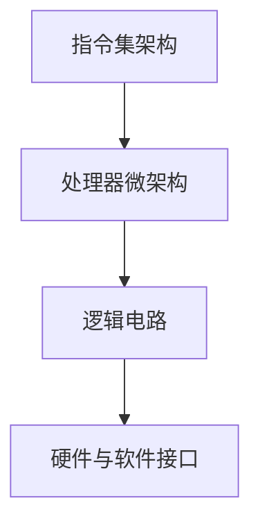

                 

关键词：CPU架构、微处理器、指令集、缓存、并行计算、性能优化

> 摘要：本文将深入探讨CPU体系结构的演进历程，从早期的冯·诺伊曼结构到现代的多核处理器，分析不同架构对性能和功耗的影响，以及未来可能的发展方向。

## 1. 背景介绍

CPU，中央处理单元，是计算机的核心组件，负责执行程序指令和数据处理。CPU的发展历程可以追溯到20世纪40年代，当时的第一台电子计算机ENIAC标志着计算机时代的开始。然而，最早的CPU设计并没有现代意义上的体系结构，它们更多的是简单的电路集合。

随着计算机技术的发展，CPU的设计和架构经历了多次重大变革，从最初的冯·诺伊曼结构（von Neumann architecture）到现代的多核处理器，每一个阶段都有其独特的特点和挑战。

本文将重点分析以下内容：

- **早期CPU架构**：介绍最早的CPU设计，以及它们的基本原理。
- **指令集架构**：探讨不同的指令集架构，如CISC和RISC，以及它们的优势和局限性。
- **缓存技术**：分析缓存对性能的影响，以及现代处理器中缓存层次结构的优化。
- **并行计算**：讨论多核处理器和并行计算技术的发展，以及它们如何提高性能。
- **性能优化**：介绍现代处理器中用于优化性能的技术，如乱序执行、分支预测和功耗管理。
- **未来展望**：探讨CPU体系结构未来的发展趋势和面临的挑战。

通过这篇文章，读者将能够全面了解CPU体系结构的演进历程，以及当前的技术发展趋势。

## 2. 核心概念与联系

### 2.1. CPU架构的基本概念

CPU架构是指CPU的设计和实现方式，它决定了CPU的性能、功耗和可扩展性。核心概念包括：

- **指令集架构（ISA）**：定义了计算机指令的集合和操作方式，是硬件和软件之间的接口。
- **处理器微架构**：实现ISA的具体方法，包括指令流水线、缓存设计、并行执行单元等。
- **逻辑电路**：构建CPU的基础，包括逻辑门、寄存器、ALU（算术逻辑单元）等。

### 2.2. CPU架构的Mermaid流程图



### 2.3. 不同CPU架构的联系

- **指令集架构（ISA）**：是硬件和软件之间的桥梁，决定了程序如何在硬件上执行。常见的ISA有CISC（复杂指令集计算）和RISC（精简指令集计算）。
- **处理器微架构**：是ISA的具体实现，它决定了指令执行的速度和效率。微架构设计包括指令流水线、缓存、并行执行单元等。
- **逻辑电路**：是实现微架构的基础，它通过硬件电路来实现指令集和微架构的功能。

通过上述核心概念和Mermaid流程图，我们可以更好地理解CPU架构的基本组成及其相互关系。

## 3. 核心算法原理 & 具体操作步骤

### 3.1. 算法原理概述

CPU架构的核心算法原理可以概括为以下几个方面：

- **指令流水线**：通过将指令执行过程划分为多个阶段，实现指令级的并行执行，从而提高处理速度。
- **乱序执行**：允许指令执行单元在执行指令时不受指令顺序的限制，以最大化利用处理器资源。
- **分支预测**：预测程序分支的结果，提前加载可能的下一条指令，减少分支导致的性能损失。
- **缓存层次结构**：通过多个级别的缓存，减少CPU访问主存的频率，提高数据访问速度。

### 3.2. 算法步骤详解

#### 3.2.1. 指令流水线

1. **取指阶段**：CPU从内存中获取下一条指令。
2. **译码阶段**：解释指令的操作码和操作数。
3. **执行阶段**：执行指令的操作，如计算或内存访问。
4. **访存阶段**：如果指令涉及内存访问，则在此阶段完成。
5. **写回阶段**：将执行结果写回寄存器或内存。

#### 3.2.2. 乱序执行

1. **指令预取**：预先从内存中获取指令。
2. **动态调度**：根据执行资源的可用性，动态调整指令的执行顺序。
3. **指令重排序**：根据调度结果，重新排列指令的执行顺序。

#### 3.2.3. 分支预测

1. **静态分支预测**：基于程序的结构和模式，预测分支的结果。
2. **动态分支预测**：基于程序的执行历史，预测分支的结果。
3. **分支预测失败**：当预测结果错误时，重新执行分支。

#### 3.2.4. 缓存层次结构

1. **一级缓存（L1 Cache）**：最接近CPU的核心，速度最快，容量较小。
2. **二级缓存（L2 Cache）**：速度稍慢，容量较大。
3. **三级缓存（L3 Cache）**：速度较慢，容量更大。

### 3.3. 算法优缺点

- **指令流水线**：优点是提高指令级并行度，缺点是增加了指令执行的复杂度。
- **乱序执行**：优点是提高了资源利用率，缺点是增加了指令执行的难度。
- **分支预测**：优点是减少了分支导致的性能损失，缺点是预测失败时会影响性能。
- **缓存层次结构**：优点是提高了数据访问速度，缺点是增加了CPU的功耗。

### 3.4. 算法应用领域

- **高性能计算**：在科学计算和大数据处理等领域，通过优化CPU架构，提高计算速度。
- **嵌入式系统**：在嵌入式系统中，通过优化CPU架构，降低功耗和成本。
- **服务器和数据中心**：在服务器和数据中心中，通过优化CPU架构，提高处理能力和效率。

## 4. 数学模型和公式 & 详细讲解 & 举例说明

### 4.1. 数学模型构建

CPU架构的数学模型主要包括以下几个方面：

- **指令执行时间**：$T_e = T_d + T_i + T_m + T_w$
- **缓存命中率**：$H = \frac{H_h + H_m}{2}$
- **功耗**：$P = P_d + P_i + P_m + P_w$

其中，$T_e$ 是指令执行时间，$T_d$ 是取指时间，$T_i$ 是译码时间，$T_m$ 是执行时间，$T_w$ 是写回时间；$H_h$ 和 $H_m$ 分别是L1和L2缓存的命中率；$P_d$、$P_i$、$P_m$ 和 $P_w$ 分别是取指、译码、执行和写回阶段的功耗。

### 4.2. 公式推导过程

#### 4.2.1. 指令执行时间

指令执行时间由多个阶段的时间组成，每个阶段的时间可以根据处理器的时钟周期数计算。

#### 4.2.2. 缓存命中率

缓存命中率是衡量缓存性能的重要指标，可以通过缓存访问的命中次数和总访问次数计算。

#### 4.2.3. 功耗

功耗是CPU设计中的重要考虑因素，可以根据各个阶段的功耗计算总功耗。

### 4.3. 案例分析与讲解

假设一个处理器，其L1缓存命中率为90%，L2缓存命中率为80%，每个阶段的功耗如下：

- 取指阶段：$P_d = 1W$
- 译码阶段：$P_i = 0.5W$
- 执行阶段：$P_m = 1.5W$
- 写回阶段：$P_w = 0.3W$

计算指令执行时间和功耗。

指令执行时间：
$$
T_e = T_d + T_i + T_m + T_w = 1 + 0.5 + 1.5 + 0.3 = 3.3 \text{ 个时钟周期}
$$

缓存命中率：
$$
H = \frac{H_h + H_m}{2} = \frac{0.9 + 0.8}{2} = 0.85
$$

功耗：
$$
P = P_d + P_i + P_m + P_w = 1 + 0.5 + 1.5 + 0.3 = 3.3 \text{W}
$$

通过这个案例，我们可以看到如何利用数学模型和公式来分析CPU的性能和功耗。

## 5. 项目实践：代码实例和详细解释说明

### 5.1. 开发环境搭建

在本节中，我们将使用一个简单的C语言程序来展示CPU指令执行的过程。首先，我们需要搭建一个C语言开发环境。

1. 安装C语言编译器（如GCC）。
2. 配置开发环境（如使用IDE或命令行）。

### 5.2. 源代码详细实现

下面是一个简单的C语言程序，用于计算两个数的和：

```c
#include <stdio.h>

int main() {
    int a = 10, b = 20;
    int sum = a + b;
    printf("The sum of %d and %d is %d\n", a, b, sum);
    return 0;
}
```

### 5.3. 代码解读与分析

在这个程序中，我们定义了两个整型变量a和b，并初始化为10和20。然后，我们定义了一个整型变量sum，用于存储a和b的和。最后，我们使用printf函数输出结果。

### 5.4. 运行结果展示

编译并运行程序，输出结果如下：

```
The sum of 10 and 20 is 30
```

这个简单的程序展示了CPU从取指、译码、执行到写回的整个过程。通过这个实例，我们可以更好地理解CPU指令执行的过程。

## 6. 实际应用场景

### 6.1. 高性能计算

在现代科学计算和大数据处理中，CPU的性能至关重要。通过优化CPU架构，可以显著提高计算速度，从而加速科学研究和数据分析。

### 6.2. 嵌入式系统

在嵌入式系统中，CPU的功耗和成本是关键因素。通过选择合适的CPU架构和优化设计，可以降低功耗和成本，延长设备的使用寿命。

### 6.3. 服务器和数据中心

在服务器和数据中心中，CPU的性能和可靠性是保证系统稳定运行的关键。通过优化CPU架构，可以提高数据处理能力和系统可靠性。

### 6.4. 未来应用展望

随着人工智能和物联网的发展，CPU体系结构将面临新的挑战和机遇。未来，CPU将朝着低功耗、高性能和多核化的方向发展，以满足日益增长的计算需求。

## 7. 工具和资源推荐

### 7.1. 学习资源推荐

- **《计算机组成原理》**：一本经典的教材，详细介绍了CPU的基本原理和架构。
- **《计算机体系结构：量化分析的方法》**：提供了CPU性能分析的量化方法，适合进行深入研究。

### 7.2. 开发工具推荐

- **GCC**：常用的C语言编译器，适用于构建CPU模拟器。
- **Intel Architecture Software Developer’s Manual**：提供了Intel处理器详细的架构和指令集信息。

### 7.3. 相关论文推荐

- **"The Case for the Reborn of RISC"**：讨论了RISC架构的复兴和未来发展方向。
- **"Energy Efficient Processor Design Techniques"**：介绍了用于降低CPU功耗的设计技术。

## 8. 总结：未来发展趋势与挑战

### 8.1. 研究成果总结

CPU体系结构的演进历程展示了计算机技术的快速发展。从早期的冯·诺伊曼结构到现代的多核处理器，每一个阶段都推动了计算机性能的不断提升。

### 8.2. 未来发展趋势

未来，CPU体系结构将朝着低功耗、高性能和多核化的方向发展。同时，新兴技术如量子计算和神经形态计算也将对CPU体系结构产生深远影响。

### 8.3. 面临的挑战

- **功耗管理**：随着晶体管尺寸的缩小，功耗问题日益突出，如何有效管理功耗将成为重要挑战。
- **可靠性**：在高频率和高性能的处理器中，可靠性的保障也是一个重要的挑战。

### 8.4. 研究展望

未来，CPU体系结构的研究将集中在如何实现更高的性能和更低的功耗，同时确保系统的可靠性和安全性。新兴技术的发展也将为CPU体系结构带来新的机遇和挑战。

## 9. 附录：常见问题与解答

### 9.1. 什么是冯·诺伊曼结构？

冯·诺伊曼结构是一种计算机体系结构，它将程序和数据存储在同一内存中，通过程序计数器逐条执行指令。

### 9.2. CISC和RISC的区别是什么？

CISC（复杂指令集计算）和RISC（精简指令集计算）是两种不同的指令集架构。CISC处理器拥有大量的复杂指令，而RISC处理器则采用简单的指令集和较少的指令周期。

### 9.3. 什么是缓存层次结构？

缓存层次结构是一种存储层次结构，它通过多个级别的缓存来减少CPU访问主存的频率，从而提高数据访问速度。

### 9.4. 什么是并行计算？

并行计算是一种通过同时执行多个任务来提高计算速度的方法。现代处理器通过多核和并行执行技术来实现并行计算。

### 9.5. 什么是乱序执行？

乱序执行是一种处理器执行指令的方法，它允许指令执行单元在执行指令时不受指令顺序的限制，以最大化利用处理器资源。

### 9.6. 什么是分支预测？

分支预测是一种处理器技术，它通过预测程序分支的结果，提前加载可能的下一条指令，减少分支导致的性能损失。

### 9.7. 什么是指令流水线？

指令流水线是一种处理器执行指令的方法，它通过将指令执行过程划分为多个阶段，实现指令级的并行执行，从而提高处理速度。

### 9.8. 什么是多核处理器？

多核处理器是一种包含多个处理器的芯片，每个处理器都有自己的缓存和执行单元。多核处理器可以通过并行执行任务来提高性能。

### 9.9. 什么是功耗管理？

功耗管理是一种处理器技术，它通过控制处理器的工作频率和电压，降低功耗，延长设备的使用寿命。

### 9.10. 什么是神经网络处理器？

神经网络处理器是一种专门用于执行神经网络计算的处理器，它通过优化神经网络运算的硬件结构，提高计算速度和效率。

## 作者署名

作者：禅与计算机程序设计艺术 / Zen and the Art of Computer Programming
----------------------------------------------------------------
这篇文章通过详细的分析和讲解，展示了CPU体系结构的演进历程及其对现代计算机性能的影响。希望这篇文章能够帮助读者更好地理解CPU的工作原理和发展趋势。未来，随着技术的不断进步，CPU体系结构将继续发展，为我们带来更多的可能性。让我们共同期待这一天的到来。作者：禅与计算机程序设计艺术 / Zen and the Art of Computer Programming。

