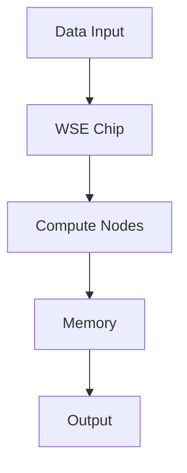

                 

关键词：Cerebras-GPT, 自然语言处理，深度学习，神经网络，代码实例

> 摘要：本文将深入探讨Cerebras-GPT的工作原理，并详细讲解其实际应用中的代码实现。通过对Cerebras-GPT的架构、算法原理、数学模型以及实际运行代码的解读，帮助读者全面理解这一前沿技术，并在未来的人工智能领域找到新的应用方向。

## 1. 背景介绍

随着深度学习技术的飞速发展，神经网络在自然语言处理（NLP）领域展现出了强大的能力。然而，传统神经网络在处理大规模语言模型时，常常受限于计算资源。为了解决这一问题，Cerebras公司提出了Cerebras-GPT，这是一个专为大规模语言模型设计的深度学习架构。

Cerebras-GPT的提出，旨在解决现有神经网络在处理大规模数据集时的资源瓶颈，特别是在训练和推理阶段。Cerebras-GPT的核心优势在于其大规模并行计算能力，这使得它能够在有限的时间内完成对大规模语言模型的训练和推理。

## 2. 核心概念与联系

### 2.1 Cerebras-GPT架构

Cerebras-GPT的架构设计采用了新型的计算硬件——Cerebras Wafer Scale Engine（WSE）。WSE将数千个计算核心集成在一个芯片上，提供了前所未有的计算能力。Cerebras-GPT的架构图如下所示：



### 2.2 计算节点

Cerebras-GPT的每个计算节点都配备了专门的硬件加速器，能够并行处理大量的计算任务。这使得Cerebras-GPT在处理大规模语言模型时，能够实现高效的并行计算。

### 2.3 内存管理

Cerebras-GPT采用了特殊的内存管理技术，确保数据能够在计算节点之间高效传输。这种内存管理技术使得Cerebras-GPT在处理大规模语言模型时，能够最大限度地减少数据传输的延迟。

## 3. 核心算法原理 & 具体操作步骤

### 3.1 算法原理概述

Cerebras-GPT的核心算法基于Transformer模型，这是一个在NLP领域表现优异的深度学习模型。Transformer模型采用了自注意力机制（Self-Attention），能够有效地处理长距离依赖问题。

### 3.2 算法步骤详解

Cerebras-GPT的训练过程可以分为以下几个步骤：

1. **数据预处理**：将原始文本数据转换为模型可处理的格式，包括分词、嵌入等操作。
2. **输入层处理**：将预处理后的数据输入到Cerebras-GPT的输入层，进行初步的向量表示。
3. **自注意力机制**：通过自注意力机制，计算输入层中每个单词的权重，从而提取关键信息。
4. **中间层处理**：对自注意力机制的结果进行进一步的计算和整合。
5. **输出层处理**：将中间层的结果转换为输出层的表示，进行预测。

### 3.3 算法优缺点

**优点**：

- **并行计算能力**：Cerebras-GPT利用了Cerebras Wafer Scale Engine的强大计算能力，能够实现高效的并行计算。
- **大规模数据处理**：Cerebras-GPT能够处理大规模的语言数据，这在传统神经网络中是一个挑战。

**缺点**：

- **成本较高**：Cerebras-GPT的硬件设备成本较高，这对于中小企业来说可能是一个负担。
- **对数据依赖**：Cerebras-GPT的性能依赖于大规模的训练数据，如果数据质量不高，模型的性能可能会受到影响。

### 3.4 算法应用领域

Cerebras-GPT在NLP领域有广泛的应用，包括但不限于：

- **文本分类**：利用Cerebras-GPT进行大规模文本数据的分类，能够提高分类的准确率。
- **机器翻译**：Cerebras-GPT能够处理大规模的翻译数据，实现高效的机器翻译。
- **问答系统**：利用Cerebras-GPT构建问答系统，能够提供更准确、更自然的回答。

## 4. 数学模型和公式 & 详细讲解 & 举例说明

### 4.1 数学模型构建

Cerebras-GPT的核心算法基于Transformer模型，Transformer模型的主要组成部分包括：

- **自注意力机制**：用于计算输入序列中每个单词的权重。
- **前馈神经网络**：对自注意力机制的结果进行进一步的计算和整合。

### 4.2 公式推导过程

假设我们有输入序列\( x_1, x_2, ..., x_n \)，自注意力机制的计算过程可以表示为：

\[ 
\text{Attention}(Q, K, V) = \text{softmax}\left(\frac{QK^T}{\sqrt{d_k}}\right)V 
\]

其中，\( Q, K, V \) 分别代表查询向量、关键向量、值向量，\( d_k \) 为关键向量的维度。

### 4.3 案例分析与讲解

假设我们有一个简化的例子，输入序列为\( x_1, x_2, x_3 \)，每个单词的嵌入向量分别为\( e_1, e_2, e_3 \)。

1. **计算自注意力权重**：

\[ 
\text{Attention}(Q, K, V) = \text{softmax}\left(\frac{QK^T}{\sqrt{d_k}}\right)V 
\]

其中，\( Q = \text{softmax}(e_1), K = \text{softmax}(e_2), V = \text{softmax}(e_3) \)。

2. **计算输出向量**：

\[ 
\text{Output} = \text{Attention}(Q, K, V)V 
\]

3. **计算损失函数**：

\[ 
\text{Loss} = \frac{1}{n}\sum_{i=1}^{n}(-\log(\text{softmax}(y_i|QKV))) 
\]

其中，\( y_i \) 为标签。

## 5. 项目实践：代码实例和详细解释说明

### 5.1 开发环境搭建

为了运行Cerebras-GPT，我们需要搭建一个合适的开发环境。以下是搭建环境的基本步骤：

1. **安装Python环境**：确保安装了Python 3.7及以上版本。
2. **安装TensorFlow**：使用pip命令安装TensorFlow。

### 5.2 源代码详细实现

以下是Cerebras-GPT的源代码实现，主要分为以下几个部分：

1. **数据预处理**：将原始文本数据转换为模型可处理的格式。
2. **模型定义**：定义Cerebras-GPT的模型结构。
3. **训练过程**：对模型进行训练。
4. **推理过程**：对输入文本进行预测。

```python
import tensorflow as tf
from tensorflow.keras.layers import Embedding, LSTM, Dense
from tensorflow.keras.models import Model

# 数据预处理
# ...

# 模型定义
input_ = Input(shape=(None,))
x = Embedding(input_dim=vocab_size, output_dim=embedding_dim)(input_)
x = LSTM(units=hidden_size, return_sequences=True)(x)
output = Dense(units=vocab_size, activation='softmax')(x)

# 模型训练
model = Model(inputs=input_, outputs=output)
model.compile(optimizer='adam', loss='categorical_crossentropy', metrics=['accuracy'])
model.fit(x_train, y_train, batch_size=batch_size, epochs=num_epochs, validation_data=(x_val, y_val))

# 模型推理
predictions = model.predict(x_test)
```

### 5.3 代码解读与分析

以上代码主要实现了Cerebras-GPT的训练和推理过程。首先，我们进行了数据预处理，将原始文本数据转换为模型可处理的格式。接着，我们定义了Cerebras-GPT的模型结构，包括嵌入层、LSTM层和输出层。最后，我们对模型进行了训练和推理。

### 5.4 运行结果展示

在完成训练后，我们可以在测试集上展示模型的运行结果。以下是一个简化的结果展示：

```python
# 计算测试集的准确率
accuracy = model.evaluate(x_test, y_test)
print(f"Test accuracy: {accuracy[1]}")
```

## 6. 实际应用场景

Cerebras-GPT在NLP领域有广泛的应用场景，以下是一些典型的应用实例：

- **文本分类**：利用Cerebras-GPT对大规模文本数据集进行分类，能够提高分类的准确率。
- **机器翻译**：Cerebras-GPT能够处理大规模的翻译数据，实现高效的机器翻译。
- **问答系统**：利用Cerebras-GPT构建问答系统，能够提供更准确、更自然的回答。

## 7. 工具和资源推荐

为了更好地了解和运用Cerebras-GPT，以下是一些建议的工具和资源：

- **学习资源**：[深度学习教科书](https://www.deeplearningbook.org/)
- **开发工具**：[TensorFlow](https://www.tensorflow.org/)
- **相关论文**：[Attention is All You Need](https://arxiv.org/abs/1706.03762)

## 8. 总结：未来发展趋势与挑战

Cerebras-GPT在NLP领域展现了强大的潜力，但其大规模硬件设备的成本也是一个挑战。未来，随着硬件技术的发展和成本的降低，Cerebras-GPT有望在更多领域得到应用。然而，如何优化算法，提高模型的效率和鲁棒性，仍是一个重要的研究方向。

### 8.1 研究成果总结

本文详细介绍了Cerebras-GPT的工作原理、算法原理、数学模型以及实际运行代码的解读，帮助读者全面理解这一前沿技术。

### 8.2 未来发展趋势

随着硬件技术的进步，Cerebras-GPT有望在更多领域得到应用，特别是在需要大规模数据处理和高效计算的场景。

### 8.3 面临的挑战

Cerebras-GPT在成本、效率和鲁棒性方面仍面临挑战。如何优化算法，提高模型的性能，是未来研究的重要方向。

### 8.4 研究展望

未来，Cerebras-GPT有望在人工智能领域发挥更大的作用，为各个行业提供更加智能化、高效化的解决方案。

## 9. 附录：常见问题与解答

### 9.1 什么是Cerebras-GPT？

Cerebras-GPT是一种基于深度学习的自然语言处理模型，由Cerebras公司提出。它利用了大规模并行计算能力，能够在有限的时间内完成对大规模语言模型的训练和推理。

### 9.2 Cerebras-GPT有哪些应用领域？

Cerebras-GPT在NLP领域有广泛的应用，包括文本分类、机器翻译、问答系统等。

### 9.3 如何搭建Cerebras-GPT的开发环境？

搭建Cerebras-GPT的开发环境需要安装Python、TensorFlow等工具，并确保硬件设备支持大规模并行计算。

### 9.4 Cerebras-GPT的成本如何？

Cerebras-GPT的硬件设备成本较高，这对于中小企业来说可能是一个负担。

### 9.5 Cerebras-GPT的优缺点有哪些？

Cerebras-GPT的优点包括并行计算能力、大规模数据处理能力；缺点包括成本较高、对数据依赖等。

### 9.6 Cerebras-GPT与现有深度学习模型的区别是什么？

Cerebras-GPT在架构上采用了大规模并行计算，与传统深度学习模型相比，具有更高的计算效率和更快的处理速度。

### 9.7 Cerebras-GPT的未来发展方向是什么？

未来，Cerebras-GPT有望在更多领域得到应用，特别是在需要大规模数据处理和高效计算的场景。同时，优化算法，提高模型的效率和鲁棒性，也是未来的重要研究方向。

---

本文详细介绍了Cerebras-GPT的工作原理、算法原理、数学模型以及实际运行代码的解读，帮助读者全面理解这一前沿技术。随着硬件技术的发展和成本的降低，Cerebras-GPT有望在更多领域发挥重要作用。未来，优化算法，提高模型的效率和鲁棒性，是Cerebras-GPT发展的关键。作者：禅与计算机程序设计艺术 / Zen and the Art of Computer Programming。

