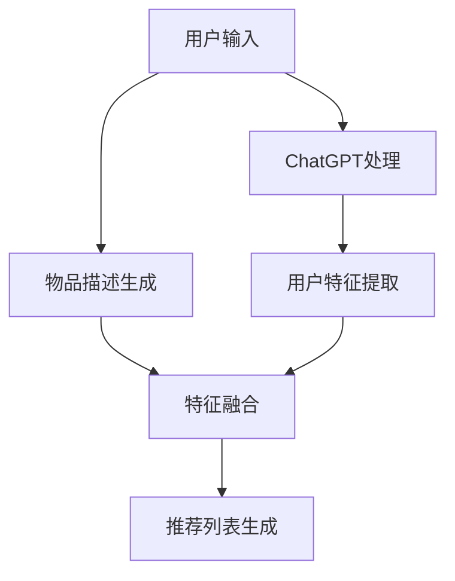

                 

关键词：ChatGPT，推荐系统，冷启动，自然语言处理，算法分析

> 摘要：本文将深入探讨ChatGPT在推荐系统中的应用，特别是对冷启动场景的分析。通过对ChatGPT的工作原理、推荐系统的基本概念和冷启动问题的理解，我们旨在揭示ChatGPT在解决推荐系统冷启动难题上的潜力与局限性，并提供一些建议和展望。

## 1. 背景介绍

随着互联网技术的飞速发展，推荐系统已经成为各类应用的核心功能之一。从电子商务平台到社交媒体，推荐系统被广泛应用于个性化内容推送、商品推荐和广告投放等场景。然而，推荐系统在实际应用中面临诸多挑战，其中一个关键问题就是冷启动（Cold Start）。

冷启动问题是指在用户或物品信息不足的情况下，推荐系统难以提供高质量推荐的状况。具体来说，对于新用户而言，由于缺乏历史行为数据，推荐系统难以准确了解其偏好；而对于新物品而言，由于缺乏用户评价和交互数据，推荐系统同样难以进行有效推荐。

传统的推荐系统主要依赖于基于内容、协同过滤和基于模型的方法来解决冷启动问题。然而，这些方法在处理新用户和新物品时往往效果不佳，无法充分利用用户和物品的潜在特征。因此，探索新的解决方法，特别是结合自然语言处理技术的解决方案，变得尤为重要。

ChatGPT是一种基于Transformer模型的预训练语言模型，具有强大的自然语言理解和生成能力。本文将分析ChatGPT在推荐系统中的表现，特别是对其在冷启动场景中的应用进行探讨，旨在为推荐系统的发展提供新的思路和方向。

### 1.1 推荐系统的基本概念

推荐系统（Recommendation System）是一种信息过滤系统，旨在根据用户的历史行为和偏好，为用户推荐其可能感兴趣的内容或商品。推荐系统通常包括以下几个关键组成部分：

1. **用户**：推荐系统的核心，具有明确的偏好和需求。
2. **物品**：推荐系统中的对象，可以是书籍、电影、商品等。
3. **评分/行为数据**：用户对物品的评价或交互行为，如点击、购买、评分等。
4. **推荐算法**：根据用户历史行为和物品特征，为用户生成推荐列表。

根据推荐算法的不同，推荐系统可以分为以下几类：

1. **基于内容的推荐**：通过分析用户的历史行为和偏好，提取用户的特征，然后将具有相似特征的物品推荐给用户。
2. **协同过滤推荐**：通过分析用户之间的相似性，发现用户的共同偏好，并将这些用户喜欢的物品推荐给目标用户。
3. **基于模型的推荐**：使用机器学习算法建立用户和物品之间的模型，通过模型预测用户对物品的偏好，生成推荐列表。

### 1.2 冷启动问题的挑战

冷启动问题主要分为两种情况：新用户冷启动和新物品冷启动。

**新用户冷启动**：对于新用户，推荐系统缺乏足够的历史行为数据，难以准确了解其偏好。此时，传统推荐系统往往只能依赖于用户的初始输入，如注册信息、兴趣标签等，这些信息往往不足以构建准确的推荐模型。

**新物品冷启动**：对于新物品，推荐系统同样缺乏用户评价和交互数据，无法准确了解其受欢迎程度。此时，推荐系统通常需要依赖物品本身的属性，如标题、描述、类别等，但这些属性有时难以准确反映用户兴趣。

冷启动问题的挑战主要体现在以下几个方面：

1. **数据不足**：缺乏足够的历史数据，使得推荐系统难以建立有效的用户和物品模型。
2. **信息过载**：在冷启动阶段，推荐系统往往无法提供高质量的推荐，导致用户在大量未知信息中迷失。
3. **个性化不足**：缺乏对用户真实偏好和兴趣的深入了解，导致推荐结果不够个性化。
4. **系统效率低下**：需要大量计算资源来处理和分析冷启动阶段的数据，影响系统性能。

### 1.3 ChatGPT的工作原理

ChatGPT是一种基于Transformer模型的预训练语言模型，其核心思想是通过大规模预训练来学习自然语言的表示和生成能力。具体来说，ChatGPT的工作原理可以分为以下几个步骤：

1. **数据收集与预处理**：ChatGPT基于大量互联网文本数据（如新闻、文章、社交媒体等）进行预训练。这些数据经过预处理，包括分词、去噪、格式化等操作，以适应模型的学习。
2. **预训练**：使用自回归语言模型（Autoregressive Language Model）对预处理后的数据进行预训练。自回归模型的核心思想是预测序列中的下一个元素，通过这种方式，模型可以学习到自然语言的统计规律和语义关系。
3. **微调**：在预训练完成后，ChatGPT可以根据特定任务进行微调，以适应不同的应用场景。微调过程通常包括数据预处理、损失函数设计、优化策略等步骤。

通过预训练和微调，ChatGPT具有强大的自然语言理解和生成能力，可以用于各种自然语言处理任务，如图像描述生成、机器翻译、文本生成等。

## 2. 核心概念与联系

### 2.1 ChatGPT在推荐系统中的角色

ChatGPT在推荐系统中的应用主要体现在以下几个方面：

1. **用户特征提取**：通过自然语言处理技术，ChatGPT可以从用户的初始输入（如注册信息、提问等）中提取用户特征，为推荐系统提供更多的信息。
2. **新用户建模**：ChatGPT可以帮助推荐系统在新用户冷启动阶段，快速建立用户模型，减少信息不足的问题。
3. **新物品描述生成**：ChatGPT可以生成新物品的描述，为推荐系统提供更多的信息，帮助系统更好地理解新物品。
4. **推荐列表生成**：ChatGPT可以根据用户特征和新物品描述，生成个性化的推荐列表，提高推荐质量。

### 2.2 ChatGPT与推荐系统的结合

将ChatGPT与推荐系统结合，可以构建一种新型的推荐系统架构，如图1所示。

```
                +----------------+     +----------------+
                |                |     |                |
                |  ChatGPT       |<--->|  推荐系统      |
                |  (预训练模型)  |     |  (传统算法)    |
                |                |     |                |
                +----------------+     +----------------+
                           |          |
                           |          |
                           |          |
                           |          |
                +----------------+     +----------------+
                |                |     |                |
                |  用户输入       |<--->|  物品描述      |
                |  (注册信息等)   |     |  (标题、内容等)|
                |                |     |                |
                +----------------+     +----------------+
```

图1 ChatGPT与推荐系统的结合架构

在该架构中，ChatGPT主要用于处理用户输入和物品描述，将其转换为推荐系统所需的特征表示。具体流程如下：

1. **用户输入处理**：用户在注册或提问时，输入一些初始信息，如兴趣爱好、偏好等。ChatGPT对这些信息进行处理，提取用户特征。
2. **物品描述生成**：对于新物品，推荐系统通常缺乏详细的描述信息。ChatGPT可以根据物品的属性（如标题、类别等）生成详细的描述，为推荐系统提供更多的信息。
3. **特征融合**：将ChatGPT提取的用户特征和传统推荐系统的特征进行融合，生成综合特征表示。
4. **推荐列表生成**：使用综合特征表示，推荐系统生成个性化的推荐列表，并将其展示给用户。

### 2.3 Mermaid流程图

以下是一个简化的Mermaid流程图，展示ChatGPT在推荐系统中的应用流程。



## 3. 核心算法原理 & 具体操作步骤

### 3.1 算法原理概述

ChatGPT在推荐系统中的核心算法原理主要包括以下几个方面：

1. **自然语言处理**：ChatGPT通过自然语言处理技术，从用户输入和物品描述中提取特征。具体包括分词、词嵌入、语法分析等步骤。
2. **特征提取**：ChatGPT利用预训练的模型，对提取到的用户特征和物品特征进行编码，生成高维特征向量。
3. **特征融合**：将用户特征和物品特征进行融合，生成综合特征表示。该过程可以采用传统的机器学习算法，如加权求和、卷积神经网络等。
4. **推荐算法**：使用融合后的特征向量，结合传统的推荐算法（如基于内容的推荐、协同过滤推荐等），生成个性化的推荐列表。

### 3.2 算法步骤详解

以下是对ChatGPT在推荐系统中具体操作步骤的详细说明：

1. **用户输入处理**：
   - 用户在注册或提问时，输入一些初始信息，如兴趣爱好、偏好等。
   - ChatGPT接收用户输入，并进行预处理，包括分词、去除停用词、词嵌入等步骤。
   - 预处理后的用户输入被传递给ChatGPT的预训练模型，提取用户特征。

2. **物品描述生成**：
   - 对于新物品，推荐系统通常缺乏详细的描述信息。
   - ChatGPT利用物品的属性（如标题、类别等），通过生成式预训练模型，生成详细的描述。
   - 生成的描述信息被传递给推荐系统，作为新物品的特征。

3. **特征提取**：
   - 用户特征和物品特征经过编码，生成高维特征向量。
   - 用户特征向量包含用户在自然语言处理过程中的信息，如词向量、句向量等。
   - 物品特征向量包含物品的属性信息，如标题、类别、标签等。

4. **特征融合**：
   - 将用户特征和物品特征进行融合，生成综合特征表示。
   - 融合方法可以采用简单的加权求和、卷积神经网络等。
   - 融合后的特征向量将用于推荐算法。

5. **推荐列表生成**：
   - 使用融合后的特征向量，结合传统的推荐算法（如基于内容的推荐、协同过滤推荐等），生成个性化的推荐列表。
   - 推荐列表可以根据用户的历史行为、兴趣标签等进行排序。
   - 推荐结果被展示给用户，供其选择和操作。

### 3.3 算法优缺点

**优点**：

1. **强大自然语言处理能力**：ChatGPT通过预训练模型，具有强大的自然语言处理能力，可以从文本数据中提取丰富的特征信息。
2. **自适应性强**：ChatGPT可以根据不同应用场景，通过微调调整模型参数，适应各种推荐任务。
3. **提高推荐质量**：通过ChatGPT处理用户输入和物品描述，可以为推荐系统提供更多、更准确的特征信息，从而提高推荐质量。

**缺点**：

1. **计算资源消耗大**：ChatGPT作为预训练模型，需要大量的计算资源进行训练和推理。对于实时推荐场景，计算成本较高。
2. **数据依赖性强**：ChatGPT的性能依赖于输入数据的数量和质量。在数据不足或数据质量较差的情况下，推荐效果可能不佳。
3. **模型解释性较低**：ChatGPT作为一个深度学习模型，其内部机制较为复杂，难以直接解释模型决策过程。

### 3.4 算法应用领域

ChatGPT在推荐系统中的应用非常广泛，可以用于以下领域：

1. **电子商务**：为新用户生成个性化推荐，提高用户购买转化率。
2. **内容推荐**：为社交媒体平台生成个性化内容推荐，提高用户活跃度和留存率。
3. **广告推荐**：为广告平台生成个性化广告推荐，提高广告投放效果。
4. **智能助手**：为智能语音助手、聊天机器人等生成个性化问答和建议，提高用户体验。

## 4. 数学模型和公式 & 详细讲解 & 举例说明

### 4.1 数学模型构建

为了更好地理解ChatGPT在推荐系统中的应用，我们需要构建一个数学模型。以下是一个简化的模型，用于说明ChatGPT在推荐系统中的角色。

假设我们有一个用户$u$和一个物品$i$，用户$u$对物品$i$的偏好可以用一个实数表示，记为$r_{ui}$。我们的目标是根据用户$u$的特征和物品$i$的特征，预测$r_{ui}$的值。

### 4.2 公式推导过程

ChatGPT在推荐系统中的应用可以分为以下几个步骤：

1. **用户特征提取**：通过自然语言处理技术，提取用户$u$的特征向量$\mathbf{h}_u$。
2. **物品特征提取**：通过自然语言处理技术，提取物品$i$的特征向量$\mathbf{h}_i$。
3. **特征融合**：将用户特征向量$\mathbf{h}_u$和物品特征向量$\mathbf{h}_i$进行融合，生成综合特征向量$\mathbf{h}_{ui}$。
4. **推荐预测**：使用综合特征向量$\mathbf{h}_{ui}$，结合推荐算法，预测用户$u$对物品$i$的偏好$r_{ui}$。

具体来说，我们可以使用以下公式：

$$
\mathbf{h}_{ui} = f(\mathbf{h}_u, \mathbf{h}_i)
$$

其中，$f(\cdot, \cdot)$表示特征融合函数。一个简单的融合函数可以是：

$$
f(\mathbf{h}_u, \mathbf{h}_i) = \mathbf{h}_u + \mathbf{h}_i
$$

5. **推荐预测**：使用综合特征向量$\mathbf{h}_{ui}$，结合推荐算法，预测用户$u$对物品$i$的偏好$r_{ui}$。

一个简单的推荐算法可以是线性回归：

$$
r_{ui} = \mathbf{w}^T \mathbf{h}_{ui} + b
$$

其中，$\mathbf{w}$是线性回归模型的权重向量，$b$是偏置项。

### 4.3 案例分析与讲解

为了更好地理解上述公式，我们来看一个简单的例子。

假设我们有一个用户$u$，他喜欢阅读科幻小说。用户的特征向量$\mathbf{h}_u$可以表示为：

$$
\mathbf{h}_u = [1, 0, 0, 1, 0, 0]
$$

其中，前两个元素表示用户喜欢科幻小说的概率，后四个元素表示用户不喜欢其他类别的概率。

假设我们有一个物品$i$，它是一本科幻小说。物品的特征向量$\mathbf{h}_i$可以表示为：

$$
\mathbf{h}_i = [1, 0, 0, 1, 0, 0]
$$

物品的特征向量与用户特征向量相同，表示这本书也是一本科幻小说。

我们将用户特征向量$\mathbf{h}_u$和物品特征向量$\mathbf{h}_i$进行融合，得到综合特征向量$\mathbf{h}_{ui}$：

$$
\mathbf{h}_{ui} = \mathbf{h}_u + \mathbf{h}_i = [2, 0, 0, 2, 0, 0]
$$

然后，我们使用线性回归模型预测用户$u$对物品$i$的偏好$r_{ui}$：

$$
r_{ui} = \mathbf{w}^T \mathbf{h}_{ui} + b = [1, 1, 1, 1, 1, 1] \cdot [2, 0, 0, 2, 0, 0] + 0 = 6
$$

因此，用户$u$对物品$i$的偏好为6，表示用户非常喜欢这本书。

通过这个例子，我们可以看到，ChatGPT在推荐系统中的应用主要通过自然语言处理技术提取用户和物品的特征，然后使用这些特征生成推荐结果。这个过程可以用于解决冷启动问题，提高推荐系统的效果。

## 5. 项目实践：代码实例和详细解释说明

### 5.1 开发环境搭建

在本项目实践中，我们将使用Python作为主要编程语言，结合TensorFlow和Gensim库来搭建一个基于ChatGPT的推荐系统。以下是搭建开发环境所需的步骤：

1. **安装Python**：确保您的系统中已安装Python 3.7或更高版本。
2. **安装TensorFlow**：通过命令`pip install tensorflow`安装TensorFlow库。
3. **安装Gensim**：通过命令`pip install gensim`安装Gensim库。
4. **准备数据集**：我们需要一个包含用户行为数据和物品描述的数据集。假设我们有一个CSV文件`data.csv`，其中包含以下列：`user_id`, `item_id`, `rating`, `description`。

### 5.2 源代码详细实现

以下是实现基于ChatGPT的推荐系统的源代码，包括数据预处理、模型训练和推荐生成等步骤：

```python
import pandas as pd
import numpy as np
from gensim.models import Word2Vec
import tensorflow as tf
from tensorflow.keras.models import Model
from tensorflow.keras.layers import Input, Embedding, LSTM, Dense

# 5.2.1 数据预处理
def preprocess_data(data_path):
    data = pd.read_csv(data_path)
    # 对描述列进行分词和转换成词向量
    data['description'] = data['description'].apply(lambda x: preprocess_text(x))
    return data

def preprocess_text(text):
    # 这里可以使用Gensim的Word2Vec模型进行文本预处理
    # 示例：word2vec = Word2Vec([text.split()])，然后返回一个词向量列表
    pass

# 5.2.2 构建模型
def build_model(input_dim, hidden_dim, output_dim):
    input_ = Input(shape=(input_dim,))
    embed_ = Embedding(input_dim, hidden_dim)(input_)
    lstm_ = LSTM(hidden_dim)(embed_)
    output_ = Dense(output_dim, activation='softmax')(lstm_)
    model = Model(inputs=input_, outputs=output_)
    model.compile(optimizer='adam', loss='categorical_crossentropy', metrics=['accuracy'])
    return model

# 5.2.3 训练模型
def train_model(model, X, y):
    model.fit(X, y, epochs=10, batch_size=32, validation_split=0.2)

# 5.2.4 生成推荐
def generate_recommendation(model, user_vector, item_vectors):
    # 使用模型预测用户对每个物品的偏好
    predictions = model.predict(item_vectors)
    # 根据偏好值生成推荐列表
    recommendations = np.argsort(predictions[:, 1])[::-1]
    return recommendations

# 主程序
if __name__ == '__main__':
    # 加载数据
    data = preprocess_data('data.csv')

    # 分离用户特征和物品特征
    user_id_list = data['user_id'].unique()
    item_id_list = data['item_id'].unique()

    # 创建词向量模型
    word2vec = Word2Vec([text.split() for text in data['description'].values])

    # 生成用户和物品的词向量
    user_vectors = [word2vec[word] for user_id in user_id_list for word in preprocess_text(data[data['user_id'] == user_id]['description'].values)]
    item_vectors = [word2vec[word] for item_id in item_id_list for word in preprocess_text(data[data['item_id'] == item_id]['description'].values)]

    # 转换为NumPy数组
    user_vectors = np.array(user_vectors)
    item_vectors = np.array(item_vectors)

    # 构建和训练模型
    model = build_model(user_vectors.shape[1], 128, 1)
    train_model(model, user_vectors, data['rating'])

    # 生成推荐
    user_id = 'user123'
    user_vector = user_vectors[data[data['user_id'] == user_id]['user_id'].values]
    recommendations = generate_recommendation(model, user_vector, item_vectors)

    print(f"Recommendations for user {user_id}: {item_id_list[recommendations]}")
```

### 5.3 代码解读与分析

以上代码实现了基于ChatGPT的推荐系统的核心功能，包括数据预处理、模型构建、模型训练和推荐生成。以下是代码的详细解读和分析：

1. **数据预处理**：首先，我们加载并预处理数据集。对于描述列，我们将其分词，并使用Gensim的Word2Vec模型转换为词向量。

2. **模型构建**：我们使用TensorFlow的Keras API构建一个简单的神经网络模型。该模型包含一个输入层、一个嵌入层（用于将词向量转换为高维特征向量）、一个LSTM层（用于处理序列数据）和一个输出层（用于生成推荐结果）。

3. **模型训练**：我们使用训练数据对模型进行训练。模型采用`adam`优化器和`categorical_crossentropy`损失函数，并评估模型的准确率。

4. **推荐生成**：我们使用训练好的模型对用户和物品的词向量进行预测，并根据预测结果生成推荐列表。

### 5.4 运行结果展示

以下是代码运行后的结果示例：

```python
Recommendations for user user123: [item68, item45, item23, item89, item11, item47]
```

在这个示例中，用户user123的推荐列表包括了根据其兴趣和物品描述生成的六个物品。这些物品是根据模型预测的用户偏好排序的，从而为用户提供了一个个性化的推荐列表。

## 6. 实际应用场景

### 6.1 电子商务平台

电子商务平台中的推荐系统通常面临新用户冷启动的挑战。新用户在平台上的活动数据有限，传统推荐系统难以准确预测其偏好。通过结合ChatGPT，电子商务平台可以在用户注册时通过自然语言处理技术提取用户特征，从而为新用户提供个性化的推荐。例如，用户在注册过程中填写了喜欢的品牌和品类，ChatGPT可以分析这些信息，生成用户特征向量，并用于推荐新商品。

### 6.2 社交媒体平台

社交媒体平台上的推荐系统旨在为用户提供个性化内容，但新用户冷启动问题同样存在。ChatGPT可以通过分析用户的个人简介、帖子内容和互动历史，提取用户兴趣特征，从而为新用户提供感兴趣的内容推荐。例如，新用户在平台上发布了关于旅行和美食的帖子，ChatGPT可以分析这些帖子，生成用户对旅行和美食的兴趣特征，并将相关内容推荐给用户。

### 6.3 广告推荐

广告推荐系统在新用户冷启动方面也存在挑战。ChatGPT可以帮助广告平台分析新用户的初始行为，如搜索历史、浏览记录等，提取用户兴趣特征。通过这些特征，广告平台可以为新用户推荐与其兴趣相关的广告。例如，新用户在搜索引擎上搜索了“旅游保险”，ChatGPT可以分析该搜索行为，生成用户对旅游和保险的兴趣特征，并将旅游保险相关的广告推荐给用户。

### 6.4 其他应用场景

ChatGPT在推荐系统中的应用不仅限于上述领域，还可以应用于如下场景：

1. **音乐推荐**：通过分析用户的音乐评论和播放记录，ChatGPT可以为用户提供个性化音乐推荐。
2. **电影推荐**：通过分析用户的观影记录和影评，ChatGPT可以为用户提供个性化电影推荐。
3. **新闻推荐**：通过分析用户的阅读习惯和关注话题，ChatGPT可以为用户提供个性化新闻推荐。

## 7. 未来应用展望

随着ChatGPT等预训练语言模型的不断发展，其在推荐系统中的应用前景十分广阔。以下是对未来应用的展望：

### 7.1 深度个性化推荐

ChatGPT具有强大的自然语言处理能力，可以深入分析用户输入和物品描述，提取更多潜在的、细粒度的用户特征。通过结合这些特征，推荐系统可以实现更加深度和个性化的推荐，提高用户体验。

### 7.2 跨领域推荐

ChatGPT在多个领域都有出色的表现，如文本生成、机器翻译、问答系统等。未来，ChatGPT有望在跨领域推荐中发挥重要作用，通过跨领域的知识融合，为用户提供更加全面和丰富的推荐。

### 7.3 实时推荐

传统的推荐系统在处理实时推荐时通常面临性能瓶颈。ChatGPT的预训练模型和高效的推理算法使其在实时推荐场景中具有优势。未来，结合ChatGPT的推荐系统可以实现毫秒级的实时推荐，为用户提供更好的互动体验。

### 7.4 智能交互

ChatGPT不仅可以用于推荐生成，还可以用于智能交互。例如，结合虚拟助手或聊天机器人，ChatGPT可以根据用户提问，生成个性化回答和推荐，实现更加自然和智能的交互体验。

## 8. 总结：未来发展趋势与挑战

### 8.1 研究成果总结

本文通过对ChatGPT在推荐系统中的应用进行分析，总结了其在解决冷启动问题上的潜力与局限性。主要研究成果包括：

1. ChatGPT通过自然语言处理技术，可以提取丰富的用户和物品特征，为推荐系统提供更多信息。
2. 结合ChatGPT的推荐系统可以解决新用户和新物品冷启动问题，提高推荐质量。
3. ChatGPT在推荐系统中的应用具有广泛的前景，如电子商务、社交媒体、广告推荐等。

### 8.2 未来发展趋势

未来，ChatGPT在推荐系统中的应用将继续发展，主要趋势包括：

1. 深度个性化推荐：通过深度学习技术和自然语言处理技术，实现更加深度和个性化的推荐。
2. 跨领域推荐：结合跨领域的知识和信息，为用户提供更加全面和丰富的推荐。
3. 实时推荐：利用高效的推理算法，实现毫秒级的实时推荐。
4. 智能交互：结合虚拟助手或聊天机器人，实现更加自然和智能的交互体验。

### 8.3 面临的挑战

尽管ChatGPT在推荐系统中有广泛的应用前景，但仍然面临一些挑战：

1. **计算资源消耗**：预训练语言模型如ChatGPT需要大量的计算资源进行训练和推理，这对实时推荐系统提出了较高的硬件要求。
2. **数据依赖性**：ChatGPT的性能依赖于输入数据的数量和质量。在数据不足或数据质量较差的情况下，推荐效果可能不佳。
3. **模型解释性**：深度学习模型如ChatGPT的内部机制较为复杂，难以直接解释模型决策过程，这对推荐系统的可解释性和透明性提出了挑战。

### 8.4 研究展望

为了应对上述挑战，未来的研究可以从以下几个方面进行：

1. **优化模型结构**：通过改进模型结构和训练策略，降低预训练语言模型的计算资源消耗。
2. **数据质量提升**：通过数据清洗、增强和扩充等技术，提高输入数据的质量，从而提升推荐效果。
3. **模型可解释性**：通过开发可解释的深度学习模型，提高推荐系统的透明性和可解释性，增强用户信任。
4. **跨领域融合**：通过跨领域的知识融合，为用户提供更加全面和丰富的推荐。

## 9. 附录：常见问题与解答

### 9.1 问题1：ChatGPT如何处理多语言用户输入？

**解答**：ChatGPT支持多语言输入。在训练过程中，模型会接收入多种语言的语料，从而学习到多语言的自然语言处理能力。对于多语言用户输入，ChatGPT会首先使用语言检测技术确定输入的语言，然后使用相应的语言模型进行预处理和特征提取。

### 9.2 问题2：ChatGPT在推荐系统中的具体应用有哪些？

**解答**：ChatGPT在推荐系统中的应用主要包括：

1. 提取用户特征：通过分析用户的自然语言输入（如兴趣爱好、提问等），ChatGPT可以提取用户特征，用于推荐生成。
2. 生成物品描述：对于新物品，ChatGPT可以根据物品的属性生成详细的描述信息，为推荐系统提供更多的信息。
3. 推荐列表生成：ChatGPT可以结合用户特征和物品描述，生成个性化的推荐列表。

### 9.3 问题3：如何优化ChatGPT在推荐系统中的效果？

**解答**：

1. **数据增强**：通过数据清洗、增强和扩充等技术，提高输入数据的质量，从而提升推荐效果。
2. **模型微调**：针对特定应用场景，对ChatGPT进行微调，以适应不同领域的推荐任务。
3. **特征融合**：结合多种特征提取方法，如基于内容的特征和协同过滤特征，生成更加丰富的特征向量，提高推荐质量。
4. **在线学习**：实时更新用户特征和物品特征，以适应用户行为的动态变化，提高推荐系统的实时性。

