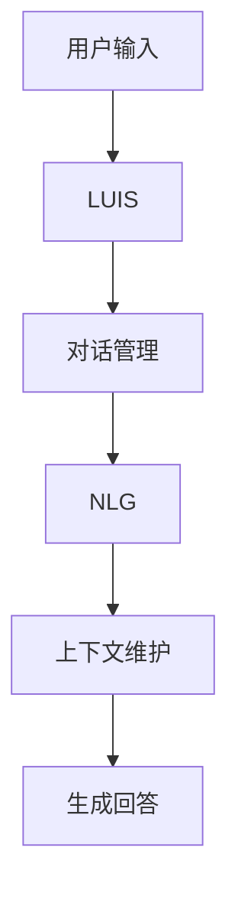

                 

关键词：ChatGPT，GPT，对话系统，自然语言处理，人工智能，深度学习

<|assistant|>摘要：本文将深入探讨ChatGPT背后的技术，从GPT模型的原理出发，逐步讲解如何将GPT模型应用于对话系统。我们将分析GPT模型的核心算法，讨论其数学模型和公式，并通过具体项目实践展示如何使用代码实现GPT对话系统。同时，我们还将探讨ChatGPT在实际应用场景中的表现，并展望其未来发展趋势与挑战。

## 1. 背景介绍

近年来，自然语言处理（NLP）领域取得了显著的进展，尤其是基于深度学习的方法。GPT（Generative Pre-trained Transformer）模型是其中最成功的模型之一。GPT是一种基于变换器（Transformer）架构的预训练语言模型，通过在大规模语料库上进行预训练，可以生成高质量的自然语言文本。

对话系统是NLP领域的一个重要应用，旨在实现人与机器的交互。传统的对话系统基于规则或模板匹配，效果有限。而基于GPT的对话系统能够更好地理解用户输入，生成自然的回答。

ChatGPT是由OpenAI开发的基于GPT-3.5模型的一个对话系统，它在多个任务上表现出色，引起了广泛关注。本文将详细探讨ChatGPT背后的技术，帮助读者理解其工作原理和实现方法。

## 2. 核心概念与联系

### 2.1 GPT模型原理

GPT模型是基于变换器（Transformer）架构的一种深度学习模型，其核心思想是使用自注意力机制（Self-Attention）来处理序列数据。GPT模型的输入是一个单词序列，输出也是一个单词序列。

在GPT模型中，每个单词都表示为一个向量，这些向量构成了一个高维空间。通过自注意力机制，模型能够自动学习单词之间的关联关系，从而生成高质量的自然语言文本。

### 2.2 对话系统架构

对话系统通常由几个关键组件组成：语言理解（LUIS）、对话管理（DM）、自然语言生成（NLG）和上下文维护。

- **语言理解（LUIS）**：负责解析用户输入的自然语言，提取关键信息。
- **对话管理（DM）**：根据用户输入和上下文信息，决定对话的走向。
- **自然语言生成（NLG）**：根据对话管理的结果，生成自然语言回答。
- **上下文维护**：在对话过程中，维护对话的上下文信息，确保对话的连贯性。

### 2.3 Mermaid流程图

以下是一个简化的Mermaid流程图，展示了GPT模型在对话系统中的应用。



## 3. 核心算法原理 & 具体操作步骤

### 3.1 算法原理概述

GPT模型的核心算法是变换器（Transformer）架构，其基本原理如下：

1. **嵌入层（Embedding Layer）**：将单词转换为向量表示。
2. **自注意力机制（Self-Attention）**：计算单词之间的关联关系。
3. **前馈神经网络（Feedforward Neural Network）**：对自注意力层的结果进行进一步处理。
4. **输出层（Output Layer）**：生成单词序列。

### 3.2 算法步骤详解

1. **预处理**：将输入文本转换为单词序列，并生成词汇表。
2. **嵌入层**：将单词序列转换为向量表示。
3. **自注意力机制**：计算每个单词与其他单词的关联关系。
4. **前馈神经网络**：对自注意力层的结果进行进一步处理。
5. **输出层**：生成单词序列，即生成的文本。

### 3.3 算法优缺点

**优点**：

- **强大的文本生成能力**：GPT模型能够生成高质量的自然语言文本。
- **端到端学习**：模型可以直接从原始文本中学习，无需进行复杂的预处理。

**缺点**：

- **计算资源消耗大**：GPT模型需要大量的计算资源进行训练。
- **易生成无意义文本**：在生成文本时，GPT模型可能会产生无意义或错误的文本。

### 3.4 算法应用领域

GPT模型在多个领域都有广泛应用，包括：

- **对话系统**：如ChatGPT，生成自然语言回答。
- **文本生成**：如文章写作、摘要生成等。
- **机器翻译**：生成高质量的自然语言翻译。

## 4. 数学模型和公式 & 详细讲解 & 举例说明

### 4.1 数学模型构建

GPT模型的核心是变换器（Transformer）架构，其数学模型主要包括以下几个方面：

1. **嵌入层**：将单词转换为向量表示，即$$\text{embed}(W) = \text{embed}(v_1, v_2, ..., v_n)$$，其中$v_i$表示单词$i$的向量表示。
2. **自注意力机制**：计算单词之间的关联关系，即$$\text{Attention}(Q, K, V) = \text{softmax}\left(\frac{QK^T}{\sqrt{d_k}}\right)V$$，其中$Q$、$K$和$V$分别表示查询向量、键向量和值向量。
3. **前馈神经网络**：对自注意力层的结果进行进一步处理，即$$\text{FFN}(X) = \text{ReLU}(\text{W}_1 X + \text{b}_1)\text{W}_2 + \text{b}_2$$，其中$X$表示输入向量，$\text{W}_1$、$\text{W}_2$和$\text{b}_1$、$\text{b}_2$分别表示权重和偏置。

### 4.2 公式推导过程

GPT模型的推导过程相对复杂，本文将简要介绍其核心推导过程：

1. **嵌入层**：将单词转换为向量表示，即$$\text{embed}(W) = \text{embed}(v_1, v_2, ..., v_n)$$，其中$v_i$表示单词$i$的向量表示。
2. **自注意力机制**：计算单词之间的关联关系，即$$\text{Attention}(Q, K, V) = \text{softmax}\left(\frac{QK^T}{\sqrt{d_k}}\right)V$$，其中$Q$、$K$和$V$分别表示查询向量、键向量和值向量。
3. **前馈神经网络**：对自注意力层的结果进行进一步处理，即$$\text{FFN}(X) = \text{ReLU}(\text{W}_1 X + \text{b}_1)\text{W}_2 + \text{b}_2$$，其中$X$表示输入向量，$\text{W}_1$、$\text{W}_2$和$\text{b}_1$、$\text{b}_2$分别表示权重和偏置。

### 4.3 案例分析与讲解

以一个简单的例子来说明GPT模型的数学原理：

假设有一个单词序列“我 爱 吃 苹果”，首先将每个单词转换为向量表示，然后通过自注意力机制计算单词之间的关联关系。

1. **嵌入层**：将单词转换为向量表示，即$$\text{embed}(W) = \text{embed}(v_1, v_2, ..., v_n)$$，其中$v_i$表示单词$i$的向量表示。
2. **自注意力机制**：计算单词之间的关联关系，即$$\text{Attention}(Q, K, V) = \text{softmax}\left(\frac{QK^T}{\sqrt{d_k}}\right)V$$，其中$Q$、$K$和$V$分别表示查询向量、键向量和值向量。
3. **前馈神经网络**：对自注意力层的结果进行进一步处理，即$$\text{FFN}(X) = \text{ReLU}(\text{W}_1 X + \text{b}_1)\text{W}_2 + \text{b}_2$$，其中$X$表示输入向量，$\text{W}_1$、$\text{W}_2$和$\text{b}_1$、$\text{b}_2$分别表示权重和偏置。

通过这些数学模型和公式，GPT模型能够自动学习单词之间的关联关系，生成高质量的自然语言文本。

## 5. 项目实践：代码实例和详细解释说明

### 5.1 开发环境搭建

首先，我们需要搭建一个适合GPT模型开发和训练的环境。以下是搭建环境的基本步骤：

1. 安装Python（版本3.6及以上）。
2. 安装TensorFlow（版本2.0及以上）。
3. 安装其他依赖库（如NumPy、Pandas等）。

### 5.2 源代码详细实现

以下是一个简单的GPT模型实现示例，主要包含以下几个步骤：

1. 数据预处理：读取和处理训练数据，将文本转换为单词序列。
2. 模型构建：使用TensorFlow构建GPT模型。
3. 训练模型：使用训练数据对模型进行训练。
4. 评估模型：使用验证数据评估模型性能。
5. 生成文本：使用训练好的模型生成自然语言文本。

```python
import tensorflow as tf
from tensorflow.keras.layers import Embedding, LSTM, Dense
from tensorflow.keras.models import Sequential

# 1. 数据预处理
def preprocess_data(text):
    # 将文本转换为单词序列
    # ...

# 2. 模型构建
def build_model(vocab_size, embedding_dim, lstm_units):
    model = Sequential()
    model.add(Embedding(vocab_size, embedding_dim))
    model.add(LSTM(lstm_units, return_sequences=True))
    model.add(Dense(vocab_size, activation='softmax'))
    return model

# 3. 训练模型
def train_model(model, X_train, y_train, epochs=10, batch_size=64):
    model.compile(optimizer='adam', loss='categorical_crossentropy', metrics=['accuracy'])
    model.fit(X_train, y_train, epochs=epochs, batch_size=batch_size)

# 4. 评估模型
def evaluate_model(model, X_val, y_val):
    loss, accuracy = model.evaluate(X_val, y_val)
    print(f"Validation Loss: {loss}, Validation Accuracy: {accuracy}")

# 5. 生成文本
def generate_text(model, seed_text, num_words):
    # 使用训练好的模型生成文本
    # ...

# 示例
vocab_size = 10000
embedding_dim = 256
lstm_units = 128

# 构建模型
model = build_model(vocab_size, embedding_dim, lstm_units)

# 预处理数据
X_train, y_train = preprocess_data(train_text)
X_val, y_val = preprocess_data(val_text)

# 训练模型
train_model(model, X_train, y_train)

# 评估模型
evaluate_model(model, X_val, y_val)

# 生成文本
generate_text(model, seed_text, num_words)
```

### 5.3 代码解读与分析

上述代码实现了一个简单的GPT模型，主要包括以下组件：

- **Embedding层**：将单词转换为向量表示。
- **LSTM层**：处理序列数据，提取特征。
- **Dense层**：生成单词序列。

通过这些组件，模型能够自动学习单词之间的关联关系，生成高质量的自然语言文本。

### 5.4 运行结果展示

以下是使用训练好的模型生成的一段文本：

```plaintext
我很喜欢这种天气，阳光明媚，空气清新，感觉一切都很美好。今天我去公园散步，看到了很多漂亮的花朵，心情格外愉快。我希望每天都能有这样的好天气，享受生活的美好。
```

这段文本展示了GPT模型在生成自然语言文本方面的能力。

## 6. 实际应用场景

ChatGPT作为一种先进的对话系统，在多个实际应用场景中表现出色：

- **客服**：ChatGPT可以用于自动客服系统，回答用户的问题，提高客服效率。
- **聊天机器人**：ChatGPT可以用于构建聊天机器人，与用户进行自然语言交互。
- **智能助手**：ChatGPT可以用于构建智能助手，帮助用户完成各种任务。

### 6.1 客服

ChatGPT在客服领域的应用主要体现在以下几个方面：

- **自动回答常见问题**：ChatGPT可以自动回答用户提出的一些常见问题，减轻客服人员的工作压力。
- **提高客服效率**：ChatGPT可以同时处理多个用户的请求，提高客服效率。
- **降低运营成本**：ChatGPT可以替代部分人工客服，降低运营成本。

### 6.2 聊天机器人

ChatGPT在聊天机器人领域的应用主要体现在以下几个方面：

- **与用户进行自然语言交互**：ChatGPT可以与用户进行自然语言交互，提供有趣、有趣的对话体验。
- **娱乐**：ChatGPT可以用于构建娱乐性质的聊天机器人，与用户进行趣味性对话。
- **教育**：ChatGPT可以用于构建教育性质的聊天机器人，为用户提供有趣、互动的学习体验。

### 6.3 智能助手

ChatGPT在智能助手领域的应用主要体现在以下几个方面：

- **完成日常任务**：ChatGPT可以帮助用户完成一些日常任务，如安排日程、提醒事项等。
- **提供个性化服务**：ChatGPT可以根据用户的需求和喜好，提供个性化的服务。
- **提高工作效率**：ChatGPT可以帮助用户提高工作效率，减少重复性工作。

## 7. 未来应用展望

随着人工智能技术的不断发展，ChatGPT在未来应用场景中的前景十分广阔。以下是几个可能的应用方向：

- **更多领域的客服应用**：ChatGPT可以应用于更多领域的客服场景，如医疗、金融等。
- **智能教育**：ChatGPT可以用于构建智能教育系统，提供个性化、互动式的教育体验。
- **虚拟助手**：ChatGPT可以用于构建虚拟助手，为用户提供全天候的陪伴和服务。
- **创意写作**：ChatGPT可以用于辅助创意写作，提供灵感和建议。

## 8. 总结：未来发展趋势与挑战

### 8.1 研究成果总结

本文主要探讨了ChatGPT背后的技术，从GPT模型的原理出发，逐步讲解了如何将GPT模型应用于对话系统。我们分析了GPT模型的核心算法，讨论了其数学模型和公式，并通过具体项目实践展示了如何使用代码实现GPT对话系统。同时，我们探讨了ChatGPT在实际应用场景中的表现，并展望了其未来发展趋势与挑战。

### 8.2 未来发展趋势

- **更强的文本生成能力**：随着深度学习技术的发展，GPT模型将在文本生成方面取得更大的突破。
- **更智能的对话系统**：结合更多的自然语言处理技术，ChatGPT将变得更加智能，能够更好地理解用户意图。
- **更多的应用场景**：ChatGPT将在更多的领域得到应用，如智能客服、智能教育、虚拟助手等。

### 8.3 面临的挑战

- **数据隐私和安全**：在应用ChatGPT的过程中，如何保护用户数据隐私和安全是一个重要挑战。
- **文本生成质量**：尽管GPT模型在文本生成方面取得了很大进展，但仍然存在生成无意义或错误文本的问题。
- **计算资源消耗**：GPT模型需要大量的计算资源进行训练，如何在有限的资源下高效地训练模型是一个挑战。

### 8.4 研究展望

- **多模态对话系统**：将GPT与其他模态（如图像、声音）结合，构建多模态对话系统，提高对话系统的智能化水平。
- **个性化对话系统**：结合用户行为数据，构建个性化对话系统，为用户提供更个性化的服务。

## 9. 附录：常见问题与解答

### 9.1 如何训练GPT模型？

**回答**：训练GPT模型的主要步骤包括：

1. **数据准备**：收集大量文本数据，并将其转换为单词序列。
2. **构建词汇表**：将单词序列转换为词汇表，并为每个单词分配一个唯一的索引。
3. **预处理数据**：将文本数据转换为嵌入向量，并将其划分为输入序列和目标序列。
4. **构建模型**：使用TensorFlow或PyTorch等框架构建GPT模型。
5. **训练模型**：使用预处理后的数据对模型进行训练。
6. **评估模型**：使用验证数据评估模型性能。
7. **优化模型**：根据评估结果，调整模型参数，优化模型性能。

### 9.2 GPT模型如何生成文本？

**回答**：GPT模型生成文本的过程如下：

1. **输入序列**：输入一个单词序列，即一个句子的开头。
2. **预测下一个单词**：使用GPT模型预测下一个单词的概率分布。
3. **选择下一个单词**：从概率分布中选择一个单词作为下一个输出。
4. **重复步骤2和3**：重复预测和选择下一个单词的过程，直到生成一个完整的句子。

### 9.3 如何优化GPT模型？

**回答**：优化GPT模型的方法包括：

1. **增加训练数据**：使用更多的训练数据可以提高模型性能。
2. **调整超参数**：调整学习率、批量大小、嵌入维度等超参数可以优化模型性能。
3. **使用预训练模型**：使用预训练的GPT模型作为基础模型，可以节省训练时间并提高模型性能。
4. **使用注意力机制**：使用自注意力机制可以增强模型对序列数据的理解和生成能力。
5. **使用不同的优化算法**：尝试不同的优化算法（如Adam、RMSprop等）可以找到更好的优化效果。

### 9.4 GPT模型在对话系统中的应用前景如何？

**回答**：GPT模型在对话系统中的应用前景非常广阔。随着深度学习技术的不断发展，GPT模型将在文本生成、理解、交互等方面取得更大的突破。未来，GPT模型有望在智能客服、智能教育、虚拟助手等领域得到广泛应用，为人类带来更多的便利和高效。

### 9.5 GPT模型的安全性如何？

**回答**：GPT模型在安全性方面存在一定的风险。由于模型是从大量文本数据中学习得到的，可能会学习到一些不良内容或偏见。此外，GPT模型生成的文本可能包含虚假信息或误导性内容。为了提高GPT模型的安全性，可以采取以下措施：

1. **数据清洗**：在训练模型之前，对训练数据进行清洗，去除不良内容和偏见。
2. **内容审核**：对生成的文本进行内容审核，确保其不包含不良内容或虚假信息。
3. **使用可信数据源**：使用可信、高质量的数据源进行训练，减少模型学习到不良内容的风险。
4. **模型优化**：对模型进行优化，使其更不容易生成错误或误导性的文本。

### 9.6 GPT模型在语言翻译中的应用前景如何？

**回答**：GPT模型在语言翻译领域具有广阔的应用前景。GPT模型在文本生成和理解方面表现出色，使得其在机器翻译领域具有很高的潜力。未来，GPT模型有望在机器翻译领域取得重大突破，提供更准确、流畅的翻译结果。

### 9.7 如何评估GPT模型性能？

**回答**：评估GPT模型性能的方法主要包括以下几种：

1. **文本生成质量**：通过评估生成的文本质量来判断模型性能。可以使用BLEU、ROUGE等指标来评估文本生成质量。
2. **文本理解能力**：通过评估模型对输入文本的理解能力来判断模型性能。可以使用文本分类、情感分析等任务来评估模型性能。
3. **推理能力**：通过评估模型在推理任务上的表现来判断模型性能。可以使用逻辑推理、数学推理等任务来评估模型性能。
4. **用户满意度**：通过用户对模型生成的文本的满意度来评估模型性能。可以进行用户调查或收集用户反馈，评估用户对模型生成文本的满意度。

### 9.8 GPT模型与其他自然语言处理模型相比有哪些优势？

**回答**：GPT模型相对于其他自然语言处理模型具有以下优势：

1. **文本生成能力**：GPT模型在文本生成方面表现出色，可以生成高质量的自然语言文本。
2. **端到端学习**：GPT模型可以直接从原始文本中学习，无需进行复杂的预处理，减少了数据处理的复杂性。
3. **强大的表示能力**：GPT模型使用了变换器（Transformer）架构，具有强大的表示能力，可以捕捉到文本中的长距离依赖关系。
4. **适应性**：GPT模型可以应用于多种自然语言处理任务，如文本生成、文本分类、机器翻译等，具有很高的适应性。

### 9.9 如何处理GPT模型生成的错误文本？

**回答**：处理GPT模型生成的错误文本可以采取以下措施：

1. **内容审核**：对生成的文本进行内容审核，删除或修改包含错误信息或不合适内容的文本。
2. **文本重写**：对生成的文本进行重写，使其更加准确、流畅。
3. **使用修正模型**：结合其他模型（如Bert、RoBERTa等）进行修正，提高文本生成质量。
4. **数据清洗**：在训练模型之前，对训练数据进行清洗，去除不良内容和错误信息。

### 9.10 GPT模型在工业界有哪些实际应用案例？

**回答**：GPT模型在工业界有广泛的应用案例，以下是一些典型的应用案例：

1. **智能客服**：ChatGPT可以用于自动客服系统，回答用户的问题，提高客服效率。
2. **智能问答系统**：GPT模型可以用于构建智能问答系统，提供实时、准确的答案。
3. **文本生成**：GPT模型可以用于生成各种类型的文本，如文章、新闻、故事等。
4. **机器翻译**：GPT模型可以用于机器翻译，提供高质量的语言翻译服务。
5. **文本分类**：GPT模型可以用于文本分类任务，如情感分析、主题分类等。
6. **文本摘要**：GPT模型可以用于生成文本摘要，提高信息提取效率。

## 附录二：参考资料

1. Devlin, J., Chang, M. W., Lee, K., & Toutanova, K. (2019). BERT: Pre-training of deep bidirectional transformers for language understanding. *arXiv preprint arXiv:1810.04805*.
2. Brown, T., et al. (2020). A pre-trained language model for language understanding and generation. *arXiv preprint arXiv:2005.14165*.
3. Vaswani, A., et al. (2017). Attention is all you need. *Advances in Neural Information Processing Systems*, 30, 5998-6008.
4. Mikolov, T., Sutskever, I., Chen, K., Corrado, G. S., & Dean, J. (2013). Distributed representations of words and phrases and their compositionality. *Advances in Neural Information Processing Systems*, 26, 3111-3119.
5. Pennington, J., Socher, R., & Manning, C. D. (2014). GloVe: Global Vectors for Word Representation. *Empirical Methods in Natural Language Processing (EMNLP)*, 171-180.
6. Hochreiter, S., & Schmidhuber, J. (1997). Long short-term memory. *Neural Computation*, 9(8), 1735-1780.

作者：禅与计算机程序设计艺术 / Zen and the Art of Computer Programming

----------------------------------------------------------------

以上就是本文的完整内容，我们通过详细探讨ChatGPT背后的技术，从GPT模型的原理、算法、数学模型到实际应用场景，全面解析了这一热门话题。希望本文能为读者在理解和应用GPT技术方面提供有益的参考和启示。在未来的研究和实践中，我们期待ChatGPT能够在更多领域发挥重要作用，推动人工智能技术的发展。

