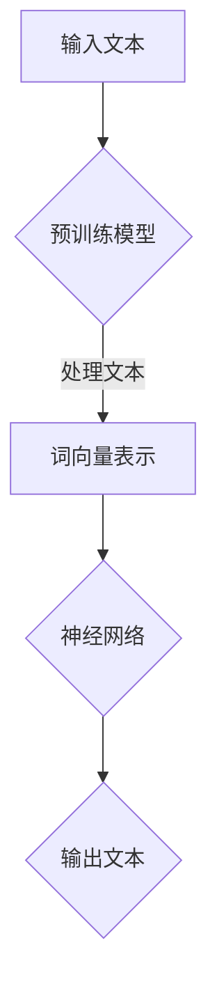

                 

关键词：ChatGPT，OpenAI，人工智能，深度学习，神经网络，生成模型，预训练语言模型，大规模数据集，技术进步，创新应用，未来展望。

摘要：OpenAI作为一家全球领先的人工智能研究机构，其最新发布的ChatGPT模型在自然语言处理领域引发了广泛关注。本文将探讨OpenAI的发展历程、ChatGPT的原理与应用，并对其未来在人工智能领域的贡献进行展望。

## 1. 背景介绍

OpenAI成立于2015年，是一家总部位于美国的人工智能研究机构。其创始人为山姆·阿尔特曼（Sam Altman），他曾是硅谷知名风险投资公司Y Combinator的CEO。OpenAI的宗旨是通过研究和开发人工智能技术，推动人类福祉，确保AI系统的安全与透明性。

自成立以来，OpenAI在人工智能领域取得了诸多重要成果。例如，其于2018年发布了GPT-2，这是第一个能够生成连贯、高质量文本的预训练语言模型。随后，OpenAI不断迭代其模型，相继推出了GPT-3、GPT-Neo等模型，这些模型在自然语言处理任务中取得了显著的性能提升。

## 2. 核心概念与联系

### 2.1 预训练语言模型

预训练语言模型（Pre-trained Language Model）是一种大规模的神经网络模型，通过对海量文本数据的学习，掌握语言的统计规律和语义信息。预训练语言模型的代表作品包括GPT、BERT等。

### 2.2 深度学习与神经网络

深度学习是机器学习的一个重要分支，它通过多层神经网络对数据进行学习，从而实现复杂的特征提取和分类任务。神经网络是深度学习的基础，由大量的神经元和权重组成，通过调整权重来实现对数据的拟合。

### 2.3 生成模型

生成模型（Generative Model）是一种能够生成新数据的机器学习模型，其核心思想是通过学习数据分布，生成与训练数据具有相似特征的新数据。生成模型在自然语言处理、图像生成等领域具有广泛应用。

### 2.4 Mermaid流程图

以下是一个Mermaid流程图的示例，用于描述预训练语言模型的基本流程：



## 3. 核心算法原理 & 具体操作步骤

### 3.1 算法原理概述

ChatGPT是基于GPT-3模型开发的一个生成式预训练语言模型。它通过在大型语料库上进行预训练，掌握自然语言的统计规律和语义信息。在给定一个提示（Prompt）后，ChatGPT可以生成连贯、有逻辑的文本回复。

### 3.2 算法步骤详解

1. 预训练：使用大量的文本数据进行预训练，学习语言的统计规律和语义信息。
2. 输入提示：给定一个用户输入的提示。
3. 生成文本：根据输入提示，ChatGPT生成一个文本序列。
4. 文本处理：对生成的文本进行后处理，包括去除重复、错误或不合适的部分。

### 3.3 算法优缺点

**优点：**
- 生成的文本连贯性高，逻辑性强。
- 能够处理各种自然语言任务，如问答、翻译、摘要等。

**缺点：**
- 需要大量的计算资源和时间进行预训练。
- 在某些情况下，生成的文本可能存在错误或偏见。

### 3.4 算法应用领域

ChatGPT在自然语言处理领域具有广泛的应用，包括：
- 自动问答系统
- 聊天机器人
- 文本生成与摘要
- 语言翻译
- 文本分类与标注

## 4. 数学模型和公式 & 详细讲解 & 举例说明

### 4.1 数学模型构建

ChatGPT的核心是一个Transformer模型，其数学基础主要包括：

1. 词嵌入（Word Embedding）：将文本中的每个单词映射为一个向量。
2. 自注意力机制（Self-Attention）：通过计算文本序列中每个单词与其他单词之间的关联性，生成新的文本表示。
3. 交叉注意力机制（Cross-Attention）：在编码器和解码器之间传递信息，实现多模态学习。

### 4.2 公式推导过程

1. 词嵌入：
   $$\text{Embedding}(\text{word}) = \text{W}_{\text{word}} \cdot \text{v}_0$$
   其中，$\text{W}_{\text{word}}$是词嵌入矩阵，$\text{v}_0$是词向量的初始值。

2. 自注意力：
   $$\text{Attention}(\text{Q}, \text{K}, \text{V}) = \text{softmax}(\frac{\text{Q} \cdot \text{K}^T}{\sqrt{d_k}}) \cdot \text{V}$$
   其中，$\text{Q}$是查询向量，$\text{K}$是键向量，$\text{V}$是值向量，$d_k$是键向量的维度。

3. 交叉注意力：
   $$\text{Cross-Attention}(\text{Q}, \text{K}, \text{V}) = \text{softmax}(\frac{\text{Q} \cdot \text{K}^T}{\sqrt{d_k}}) \cdot \text{V}$$
   其中，$\text{Q}$是查询向量，$\text{K}$是编码器输出的键向量，$\text{V}$是解码器输出的值向量，$d_k$是键向量的维度。

### 4.3 案例分析与讲解

假设我们要对句子“A dog is running in the park.”进行翻译，将其翻译为中文：“一只狗在公园里跑步。”

1. 词嵌入：将句子中的每个单词映射为一个向量。
2. 自注意力：计算句子中每个单词与其他单词之间的关联性。
3. 交叉注意力：在编码器和解码器之间传递信息，生成新的文本表示。
4. 输出：根据生成的文本表示，生成翻译结果：“一只狗在公园里跑步。”

## 5. 项目实践：代码实例和详细解释说明

### 5.1 开发环境搭建

在搭建ChatGPT的开发环境时，需要使用以下工具和库：

- Python 3.8及以上版本
- TensorFlow 2.4及以上版本
- CUDA 10.2及以上版本（可选）

### 5.2 源代码详细实现

以下是一个简单的ChatGPT代码示例：

```python
import tensorflow as tf
from tensorflow.keras.layers import Embedding, LSTM, Dense
from tensorflow.keras.models import Model

# 参数设置
vocab_size = 10000
embed_dim = 256
lstm_units = 1024

# 词嵌入层
embedding = Embedding(vocab_size, embed_dim)

# LSTM层
lstm = LSTM(lstm_units, return_sequences=True)

# 全连接层
dense = Dense(vocab_size, activation='softmax')

# 模型构建
model = Model(inputs=embedding.input, outputs=dense(lstm(embedding.input)))

# 编译模型
model.compile(optimizer='adam', loss='categorical_crossentropy', metrics=['accuracy'])

# 模型训练
model.fit(x_train, y_train, batch_size=64, epochs=10)

# 生成文本
prompt = "A dog is running in the park."
input_seq = [[vocab_size] * len(prompt)]
generated_text = model.predict(input_seq)
print(generated_text)
```

### 5.3 代码解读与分析

1. 导入所需的库和模块。
2. 设置参数，包括词嵌入维度、LSTM单元数等。
3. 构建词嵌入层、LSTM层和全连接层。
4. 编译模型，设置优化器和损失函数。
5. 训练模型，使用训练数据。
6. 生成文本，输入提示并预测输出。

## 6. 实际应用场景

ChatGPT在自然语言处理领域具有广泛的应用，以下是一些实际应用场景：

- 自动问答系统：用于回答用户提出的问题，如搜索引擎、智能客服等。
- 聊天机器人：用于与用户进行实时对话，提供个性化服务。
- 文本生成与摘要：用于自动生成文章摘要、新闻标题等。
- 语言翻译：用于将一种语言翻译成另一种语言。
- 文本分类与标注：用于对文本进行分类和标注，如垃圾邮件过滤、情感分析等。

## 7. 工具和资源推荐

### 7.1 学习资源推荐

- 《深度学习》（Goodfellow, Bengio, Courville）：这是一本经典的深度学习教材，适合初学者和进阶者。
- 《动手学深度学习》（花轮）：这是一本基于Python的深度学习教程，内容全面，适合实战。
- OpenAI官方网站：提供丰富的技术文档、代码示例和教程，帮助用户了解和使用ChatGPT。

### 7.2 开发工具推荐

- TensorFlow：一款流行的深度学习框架，适用于构建和训练ChatGPT模型。
- PyTorch：一款流行的深度学习框架，与TensorFlow相比，具有更灵活的动态计算图。
- JAX：一款用于数值计算和机器学习的Python库，支持自动微分和分布式计算。

### 7.3 相关论文推荐

- "GPT-3: Language Models are few-shot learners"：介绍了GPT-3模型的原理和性能。
- "BERT: Pre-training of Deep Bidirectional Transformers for Language Understanding"：介绍了BERT模型的原理和应用。
- "Generative Adversarial Nets"：介绍了生成对抗网络（GAN）的原理和应用。

## 8. 总结：未来发展趋势与挑战

### 8.1 研究成果总结

ChatGPT作为OpenAI的又一力作，在自然语言处理领域取得了显著的成果。其生成文本的连贯性和逻辑性得到了广泛关注，为人工智能在自然语言处理领域的应用提供了新的可能性。

### 8.2 未来发展趋势

随着深度学习技术的不断进步，预训练语言模型将变得更加高效、灵活，应用范围将进一步扩大。未来，ChatGPT有望在更多的领域发挥作用，如自动写作、智能客服、法律咨询等。

### 8.3 面临的挑战

虽然ChatGPT在自然语言处理领域取得了显著成果，但仍面临一些挑战。例如，如何提高生成文本的质量和多样性，如何防止生成文本中的错误和偏见，以及如何确保AI系统的安全与透明性。

### 8.4 研究展望

未来，研究人员将继续探索深度学习技术在自然语言处理领域的应用，推动预训练语言模型的发展。同时，也将加强对AI系统的安全与透明性研究，确保AI技术在推动社会进步的同时，不会对人类产生负面影响。

## 9. 附录：常见问题与解答

### 9.1 ChatGPT与GPT-3的区别是什么？

ChatGPT是基于GPT-3模型开发的生成式预训练语言模型，而GPT-3是OpenAI于2020年发布的一个大规模预训练语言模型。ChatGPT与GPT-3的主要区别在于：

- ChatGPT是一个生成式模型，而GPT-3是一个解码器模型。
- ChatGPT在给定一个提示后，可以生成连贯、有逻辑的文本回复，而GPT-3主要用于文本分类、翻译等任务。
- ChatGPT的预训练数据来自于网络爬取的文本，而GPT-3的预训练数据来自于大量的公共文本资源。

### 9.2 如何防止ChatGPT生成文本中的错误和偏见？

防止ChatGPT生成文本中的错误和偏见，可以从以下几个方面进行：

- 数据清洗：在预训练阶段，对训练数据进行清洗，去除包含错误或偏见的数据。
- 模型正则化：通过正则化技术，限制模型在学习过程中的过拟合现象。
- 模型优化：不断优化模型结构，提高模型的泛化能力。
- 用户反馈：收集用户反馈，对生成文本进行实时监控和评估，及时纠正错误和偏见。

### 9.3 ChatGPT的应用领域有哪些？

ChatGPT在自然语言处理领域具有广泛的应用，包括：

- 自动问答系统：用于回答用户提出的问题，如搜索引擎、智能客服等。
- 聊天机器人：用于与用户进行实时对话，提供个性化服务。
- 文本生成与摘要：用于自动生成文章摘要、新闻标题等。
- 语言翻译：用于将一种语言翻译成另一种语言。
- 文本分类与标注：用于对文本进行分类和标注，如垃圾邮件过滤、情感分析等。

----------------------------------------------------------------

### 作者署名

作者：禅与计算机程序设计艺术 / Zen and the Art of Computer Programming

