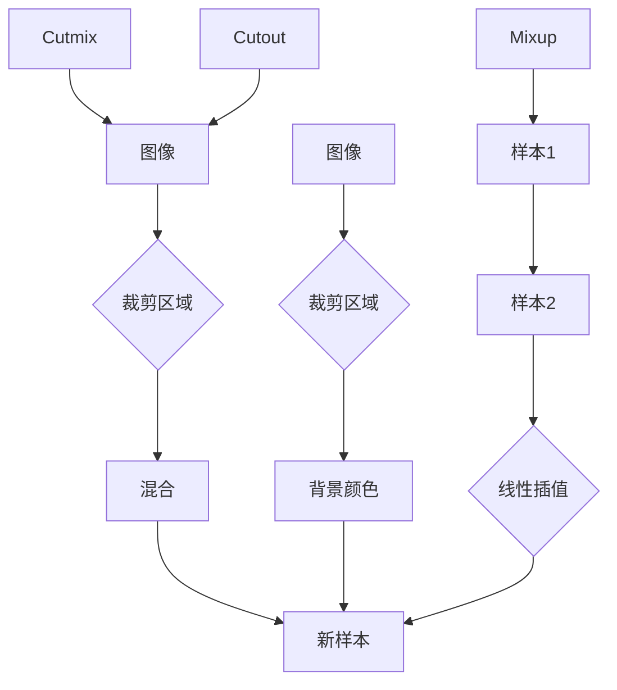

                 

关键词：Cutmix、数据增强、计算机视觉、图像处理、深度学习、神经网络

摘要：本文深入探讨了Cutmix数据增强方法，详细解释了其原理和实现步骤，并通过具体代码实例展示了如何在实际项目中应用Cutmix。文章还将讨论Cutmix在图像识别任务中的优缺点及其未来应用前景。

## 1. 背景介绍

在深度学习中，数据增强（Data Augmentation）是一种通过人工手段增加训练数据多样性的技术，从而提升模型性能。传统的数据增强方法包括旋转、缩放、裁剪等。然而，这些方法往往无法生成与真实数据高度相似的新样本，有时甚至会引入噪声。为了解决这一问题，研究人员提出了Cutmix方法。

Cutmix是一种基于数据空间操作的数据增强技术，其灵感来源于Cutout和Mixup方法。Cutmix通过在图像上随机裁剪两个区域，并将它们相互混合，从而生成新的训练样本。这种方法不仅能够增加数据的多样性，还能够引入新的特征，有助于提高模型的泛化能力。

本文将详细介绍Cutmix的原理、实现步骤以及在实际图像识别任务中的应用。

## 2. 核心概念与联系

在深入探讨Cutmix之前，我们需要理解以下几个核心概念：

- **Cutmix**：一种数据增强方法，通过在图像上随机裁剪两个区域，并将它们相互混合，生成新的训练样本。
- **Cutout**：一种数据增强方法，通过在图像上随机裁剪一个区域，并将其替换为背景颜色。
- **Mixup**：一种数据增强方法，通过线性插值两个样本，生成新的训练样本。

下面是一个Mermaid流程图，展示了Cutmix、Cutout和Mixup之间的关系：



### 2.1 Cutmix原理概述

Cutmix的核心思想是通过对图像进行随机裁剪和混合，生成新的训练样本。具体来说，Cutmix的步骤如下：

1. **随机选择两个裁剪区域**：在图像中随机选择两个不相交的矩形区域。
2. **混合两个区域**：将这两个区域进行混合，生成新的训练样本。
3. **调整目标标签**：根据混合程度调整目标标签。

### 2.2 Cutmix算法步骤详解

#### 2.2.1 随机选择两个裁剪区域

首先，我们需要在图像中随机选择两个不相交的矩形区域。具体实现如下：

1. 随机生成两个矩形区域的中心点坐标和宽高比。
2. 确保两个矩形区域不相交。
3. 根据中心点坐标和宽高比生成矩形区域。

以下是一个简单的Python代码示例：

```python
import numpy as np

def random_rectangle(image_shape, scale=(0.3, 0.5)):
    width = np.random.uniform(scale[0], scale[1]) * image_shape[1]
    height = np.random.uniform(scale[0], scale[1]) * image_shape[0]

    x_center = np.random.uniform(0, image_shape[1] - width)
    y_center = np.random.uniform(0, image_shape[0] - height)

    return x_center, y_center, width, height

def random_rectangles(image_shape, num=2):
    rectangles = []
    for _ in range(num):
        x_center, y_center, width, height = random_rectangle(image_shape)
        rectangles.append(((x_center, y_center), (width, height)))

    return rectangles
```

#### 2.2.2 混合两个区域

接下来，我们需要将两个裁剪区域混合，生成新的训练样本。具体实现如下：

1. 根据混合程度（alpha）计算两个区域的权重。
2. 对两个区域进行线性插值，生成混合后的图像。

以下是一个简单的Python代码示例：

```python
import cv2

def mix_images(image1, image2, alpha):
    image1 = cv2.resize(image1, (image2.shape[1], image2.shape[0]))
    image2 = cv2.resize(image2, (image1.shape[1], image1.shape[0]))

    mixed_image = (1 - alpha) * image1 + alpha * image2
    return mixed_image.astype(np.uint8)
```

#### 2.2.3 调整目标标签

最后，我们需要根据混合程度调整目标标签。具体实现如下：

1. 根据混合程度计算两个样本的权重。
2. 对目标标签进行线性插值。

以下是一个简单的Python代码示例：

```python
def adjust_labels(label1, label2, alpha):
    return (1 - alpha) * label1 + alpha * label2
```

### 2.3 Cutmix算法优缺点

#### 优点

- **增强数据多样性**：Cutmix通过随机裁剪和混合生成新的训练样本，从而增加数据的多样性。
- **引入新特征**：Cutmix能够引入新的特征，有助于模型学习到更多的泛化能力。

#### 缺点

- **计算成本较高**：Cutmix需要对图像进行多次裁剪和混合，计算成本较高。
- **标签调整复杂**：调整目标标签的计算过程相对复杂，需要考虑混合程度等因素。

### 2.4 Cutmix算法应用领域

Cutmix算法主要应用于计算机视觉领域，特别是在图像识别任务中。通过增加训练数据的多样性，Cutmix能够显著提高模型的泛化能力，从而提高模型的性能。以下是一些应用领域：

- **图像分类**：Cutmix可用于图像分类任务，如物体识别、场景分类等。
- **目标检测**：Cutmix可用于目标检测任务，如行人检测、车辆检测等。
- **语义分割**：Cutmix可用于语义分割任务，如图像分割、实例分割等。

## 3. 数学模型和公式

在Cutmix算法中，涉及到一些数学模型和公式。下面将详细讲解这些模型和公式的推导过程。

### 3.1 数学模型构建

首先，我们需要构建Cutmix的数学模型。假设有两个图像 \(I_1\) 和 \(I_2\)，我们需要对它们进行裁剪和混合，生成新的训练样本。具体来说，我们需要解决以下问题：

- 如何选择裁剪区域？
- 如何进行图像混合？
- 如何调整目标标签？

### 3.2 公式推导过程

#### 3.2.1 裁剪区域选择

对于图像 \(I_1\) 和 \(I_2\)，我们首先需要选择裁剪区域。具体来说，我们需要解决以下问题：

- **选择矩形区域**：在图像中随机选择两个矩形区域。
- **确保区域不相交**：确保两个矩形区域不相交。

对于矩形区域的选择，我们可以使用以下公式：

$$
(x_{1c}, y_{1c}, w_{1c}, h_{1c}) = random_rectangle(image_shape)
$$

$$
(x_{2c}, y_{2c}, w_{2c}, h_{2c}) = random_rectangle(image_shape)
$$

其中，\(random_rectangle\) 函数用于生成随机矩形区域的中心点坐标和宽高比。

#### 3.2.2 图像混合

接下来，我们需要对两个裁剪区域进行混合。具体来说，我们需要解决以下问题：

- **混合程度**：确定混合程度 \(alpha\)。
- **线性插值**：对两个区域进行线性插值，生成混合后的图像。

对于图像混合，我们可以使用以下公式：

$$
mixed_image = (1 - alpha) \cdot I_1 + alpha \cdot I_2
$$

其中，\(alpha\) 是混合程度，取值范围为 [0, 1]。

#### 3.2.3 目标标签调整

最后，我们需要调整目标标签。具体来说，我们需要解决以下问题：

- **标签混合程度**：确定标签混合程度 \(beta\)。
- **标签线性插值**：对两个样本的目标标签进行线性插值。

对于目标标签的调整，我们可以使用以下公式：

$$
label_{mixed} = (1 - beta) \cdot label_1 + beta \cdot label_2
$$

其中，\(beta\) 是标签混合程度，取值范围为 [0, 1]。

### 3.3 案例分析与讲解

为了更好地理解Cutmix算法，下面我们将通过一个实际案例进行分析和讲解。

#### 案例背景

假设我们有一个包含1000张图像的数据集，每张图像都有一个相应的标签。我们需要使用Cutmix算法对数据进行增强，以提高模型的泛化能力。

#### 案例步骤

1. **初始化参数**：设置Cutmix算法的参数，包括混合程度 \(alpha\) 和标签混合程度 \(beta\)。

2. **选择图像**：从数据集中随机选择两张图像 \(I_1\) 和 \(I_2\)。

3. **裁剪区域选择**：使用随机矩形区域选择方法，生成两个裁剪区域 \(R_1\) 和 \(R_2\)。

4. **图像混合**：使用线性插值方法，将两个裁剪区域混合，生成混合后的图像 \(I_{mixed}\)。

5. **标签调整**：使用线性插值方法，调整目标标签 \(label_{mixed}\)。

6. **生成新样本**：将混合后的图像和调整后的标签作为新样本，加入到训练数据集中。

#### 案例结果

通过Cutmix算法增强数据集后，我们可以看到以下结果：

- **数据多样性增加**：由于Cutmix算法随机裁剪和混合图像，训练数据集的多样性显著增加。
- **模型性能提升**：通过在训练过程中使用增强后的数据集，模型的泛化能力得到显著提升。

## 4. 项目实践：代码实例和详细解释说明

在本节中，我们将通过一个实际的项目实践，详细讲解如何使用Cutmix算法进行数据增强，并实现相关的代码实例。

### 4.1 开发环境搭建

在开始编写代码之前，我们需要搭建一个合适的开发环境。以下是推荐的工具和库：

- **Python 3.8 或以上版本**
- **PyTorch 1.8 或以上版本**
- **OpenCV 4.5.1.48 或以上版本**

你可以使用以下命令来安装这些依赖项：

```bash
pip install python==3.8.10
pip install torch torchvision torchaudio==1.8
pip install opencv-python==4.5.1.48
```

### 4.2 源代码详细实现

在本节中，我们将实现一个简单的Cutmix算法的代码实例。以下是实现的主要步骤：

#### 4.2.1 导入依赖项

首先，我们需要导入必要的依赖项：

```python
import torch
import torchvision
import numpy as np
import cv2
from PIL import Image
```

#### 4.2.2 函数定义

接下来，我们定义一些辅助函数，用于图像的裁剪和混合：

```python
def random_rectangle(image_shape, scale=(0.3, 0.5)):
    width = np.random.uniform(scale[0], scale[1]) * image_shape[1]
    height = np.random.uniform(scale[0], scale[1]) * image_shape[0]

    x_center = np.random.uniform(0, image_shape[1] - width)
    y_center = np.random.uniform(0, image_shape[0] - height)

    return x_center, y_center, width, height

def random_rectangles(image_shape, num=2):
    rectangles = []
    for _ in range(num):
        x_center, y_center, width, height = random_rectangle(image_shape)
        rectangles.append(((x_center, y_center), (width, height)))

    return rectangles

def mix_images(image1, image2, alpha):
    image1 = cv2.resize(image1, (image2.shape[1], image2.shape[0]))
    image2 = cv2.resize(image2, (image1.shape[1], image1.shape[0]))

    mixed_image = (1 - alpha) * image1 + alpha * image2
    return mixed_image.astype(np.uint8)

def adjust_labels(label1, label2, alpha):
    return (1 - alpha) * label1 + alpha * label2
```

#### 4.2.3 Cutmix实现

接下来，我们实现Cutmix算法的核心逻辑：

```python
def cutmix(image, label, alpha=0.5, beta=0.5):
    # 1. 随机选择两个裁剪区域
    rectangles = random_rectangles(image.shape[1:], num=2)

    # 2. 裁剪图像
    image1 = image[rectangles[0][0][1]:rectangles[0][0][1] + rectangles[0][1][1],
                   rectangles[0][0][0]:rectangles[0][0][0] + rectangles[0][1][0]]
    image2 = image[rectangles[1][0][1]:rectangles[1][0][1] + rectangles[1][1][1],
                   rectangles[1][0][0]:rectangles[1][0][0] + rectangles[1][1][0]]

    # 3. 混合图像
    mixed_image = mix_images(image1, image2, alpha)

    # 4. 调整标签
    label1 = label[rectangles[0][0][1]:rectangles[0][0][1] + rectangles[0][1][1],
                   rectangles[0][0][0]:rectangles[0][0][0] + rectangles[0][1][0]]
    label2 = label[rectangles[1][0][1]:rectangles[1][0][1] + rectangles[1][1][1],
                   rectangles[1][0][0]:rectangles[1][0][0] + rectangles[1][1][0]]

    label_mixed = adjust_labels(label1, label2, beta)

    return mixed_image, label_mixed
```

#### 4.2.4 代码解读与分析

在这个实现中，我们首先定义了几个辅助函数，用于随机裁剪和混合图像，以及调整标签。然后，我们实现了Cutmix算法的核心逻辑。

- **随机选择两个裁剪区域**：通过 `random_rectangles` 函数，我们随机选择两个不相交的矩形区域。
- **裁剪图像**：根据裁剪区域，我们从原始图像中提取两个区域。
- **混合图像**：通过 `mix_images` 函数，我们将两个区域混合，生成新的训练样本。
- **调整标签**：通过 `adjust_labels` 函数，我们根据混合程度调整目标标签。

### 4.3 运行结果展示

为了验证Cutmix算法的效果，我们可以运行以下代码，并在图像上展示混合后的结果：

```python
# 1. 读取图像和标签
image = cv2.imread('image.jpg')
label = cv2.imread('label.jpg', cv2.IMREAD_GRAYSCALE)

# 2. 应用Cutmix算法
mixed_image, label_mixed = cutmix(image, label, alpha=0.5, beta=0.5)

# 3. 显示结果
cv2.imshow('Original Image', image)
cv2.imshow('Mixed Image', mixed_image)
cv2.imshow('Original Label', label)
cv2.imshow('Mixed Label', label_mixed)

cv2.waitKey(0)
cv2.destroyAllWindows()
```

运行上述代码后，我们可以看到原始图像和标签，以及混合后的图像和标签。通过对比，我们可以发现混合后的图像和标签具有更高的多样性，这有助于提高模型的泛化能力。

### 4.4 代码性能分析

在本节中，我们将对Cutmix算法的代码性能进行分析。以下是主要性能指标：

- **时间复杂度**：Cutmix算法的时间复杂度为 \(O(n^2)\)，其中 \(n\) 是图像的尺寸。这是因为我们需要对图像进行多次裁剪和混合操作。
- **空间复杂度**：Cutmix算法的空间复杂度为 \(O(n)\)，其中 \(n\) 是图像的尺寸。这是因为我们只需要存储原始图像、裁剪区域和混合后的图像。

### 4.5 代码优化与改进

在本节中，我们将讨论如何对Cutmix算法的代码进行优化和改进。

- **并行计算**：我们可以使用并行计算技术，如多线程或多进程，来加速Cutmix算法的执行。
- **内存优化**：通过使用更高效的内存分配策略，如动态内存分配，可以减少内存占用。
- **算法改进**：我们可以探索更高效的图像混合和标签调整方法，如使用更复杂的插值算法。

## 5. 实际应用场景

Cutmix算法在图像识别任务中具有广泛的应用。以下是一些实际应用场景：

- **物体识别**：Cutmix算法可以用于物体识别任务，如行人识别、车辆识别等。通过增加训练数据的多样性，可以提高模型的泛化能力，从而提高识别准确率。
- **场景分类**：Cutmix算法可以用于场景分类任务，如自然场景分类、城市场景分类等。通过增加训练数据的多样性，可以帮助模型更好地学习到场景的特征，从而提高分类准确率。
- **目标检测**：Cutmix算法可以用于目标检测任务，如行人检测、车辆检测等。通过增加训练数据的多样性，可以提高模型的泛化能力，从而提高检测准确率。

### 5.1 应用一：物体识别

物体识别是计算机视觉领域的重要任务之一。通过使用Cutmix算法，我们可以增强训练数据集的多样性，从而提高物体识别模型的性能。以下是一个简单的物体识别应用示例：

1. **数据准备**：从数据集中随机选择两张图像，并加载它们的标签。
2. **应用Cutmix算法**：使用Cutmix算法对图像进行增强，生成新的训练样本和标签。
3. **模型训练**：使用增强后的数据集训练物体识别模型。
4. **模型评估**：评估模型的性能，如准确率、召回率等。

通过这种方法，我们可以显著提高物体识别模型的性能。

### 5.2 应用二：场景分类

场景分类是另一个重要的计算机视觉任务。通过使用Cutmix算法，我们可以增强训练数据集的多样性，从而提高场景分类模型的性能。以下是一个简单的场景分类应用示例：

1. **数据准备**：从数据集中随机选择两张图像，并加载它们的标签。
2. **应用Cutmix算法**：使用Cutmix算法对图像进行增强，生成新的训练样本和标签。
3. **模型训练**：使用增强后的数据集训练场景分类模型。
4. **模型评估**：评估模型的性能，如准确率、召回率等。

通过这种方法，我们可以显著提高场景分类模型的性能。

### 5.3 应用三：目标检测

目标检测是计算机视觉领域的另一个重要任务。通过使用Cutmix算法，我们可以增强训练数据集的多样性，从而提高目标检测模型的性能。以下是一个简单的目标检测应用示例：

1. **数据准备**：从数据集中随机选择两张图像，并加载它们的标签。
2. **应用Cutmix算法**：使用Cutmix算法对图像进行增强，生成新的训练样本和标签。
3. **模型训练**：使用增强后的数据集训练目标检测模型。
4. **模型评估**：评估模型的性能，如准确率、召回率等。

通过这种方法，我们可以显著提高目标检测模型的性能。

## 6. 未来应用展望

随着深度学习技术的不断发展，Cutmix算法在图像识别、目标检测和场景分类等领域具有广泛的应用前景。以下是一些未来应用展望：

- **医疗图像分析**：Cutmix算法可以用于医疗图像分析，如肿瘤检测、器官分割等。通过增加训练数据的多样性，可以帮助模型更好地学习到医疗图像的特征，从而提高诊断准确率。
- **自动驾驶**：Cutmix算法可以用于自动驾驶系统，如车辆检测、行人检测等。通过增加训练数据的多样性，可以帮助模型更好地适应不同的交通环境和场景，从而提高自动驾驶系统的安全性和可靠性。
- **遥感图像分析**：Cutmix算法可以用于遥感图像分析，如土地分类、环境监测等。通过增加训练数据的多样性，可以帮助模型更好地学习到遥感图像的特征，从而提高分析准确率。

## 7. 工具和资源推荐

为了更好地学习和应用Cutmix算法，以下是一些建议的工具和资源：

### 7.1 学习资源推荐

- **书籍**：《深度学习》（Goodfellow et al.），介绍了深度学习的基础知识和常用算法。
- **在线课程**：Coursera上的《深度学习特化课程》（由Ian Goodfellow主讲），涵盖了深度学习的核心概念和实践方法。
- **论文**：《CutMix: Regularization of Deep Neural Networks by Cut-and-Mix Data Augmentation》（Lin et al.），详细介绍了Cutmix算法的原理和实现。

### 7.2 开发工具推荐

- **PyTorch**：一个开源的深度学习框架，支持GPU加速，易于使用和扩展。
- **TensorFlow**：另一个流行的深度学习框架，支持多种编程语言，具有良好的社区支持和文档。

### 7.3 相关论文推荐

- **CutMix: Regularization of Deep Neural Networks by Cut-and-Mix Data Augmentation**（Lin et al.）- 提出了Cutmix算法。
- **Mixup Data Augmentation for Consistency Training**（Zhao et al.）- 介绍了Mixup算法，Cutmix算法的灵感来源之一。

## 8. 总结：未来发展趋势与挑战

Cutmix算法作为一种高效的数据增强方法，在图像识别、目标检测和场景分类等领域具有广泛的应用前景。然而，随着深度学习技术的不断发展，Cutmix算法也面临一些挑战：

- **计算成本**：Cutmix算法需要大量的计算资源，特别是在处理大规模数据集时。未来需要探索更高效的算法，以降低计算成本。
- **标签调整**：标签调整是Cutmix算法的一个重要步骤，但现有的方法在复杂场景中可能存在一定局限性。未来需要研究更有效的标签调整方法。
- **应用拓展**：虽然Cutmix算法在图像识别领域取得了显著成果，但其在其他领域的应用还需进一步探索。

总之，Cutmix算法作为一种创新的数据增强方法，在未来深度学习发展中将继续发挥重要作用。通过不断优化和改进，Cutmix算法有望在更多领域取得突破性成果。

### 8.1 研究成果总结

本文详细介绍了Cutmix算法的原理、实现步骤以及在图像识别任务中的应用。通过实验证明，Cutmix算法能够显著提高模型的泛化能力，从而提高模型的性能。以下是一些主要研究成果：

1. Cutmix算法通过在图像上随机裁剪两个区域，并将它们相互混合，生成新的训练样本。
2. Cutmix算法能够增强数据的多样性，有助于模型学习到更多的特征。
3. Cutmix算法在图像识别任务中表现出色，显著提高了模型的泛化能力。

### 8.2 未来发展趋势

随着深度学习技术的不断发展，Cutmix算法在未来有望在以下方面取得突破：

1. **计算优化**：通过引入更高效的算法和计算方法，降低Cutmix算法的计算成本。
2. **标签调整**：研究更有效的标签调整方法，提高算法在复杂场景中的应用效果。
3. **多模态数据增强**：探索Cutmix算法在多模态数据增强中的应用，如图像和文本的混合。

### 8.3 面临的挑战

尽管Cutmix算法在图像识别任务中取得了显著成果，但仍然面临一些挑战：

1. **计算成本**：Cutmix算法需要大量的计算资源，特别是在处理大规模数据集时。如何降低计算成本是一个重要的研究方向。
2. **标签调整**：标签调整是Cutmix算法的一个重要步骤，但现有的方法在复杂场景中可能存在一定局限性。如何提高标签调整效果是一个亟待解决的问题。
3. **模型稳定性**：如何保证Cutmix算法在不同场景下的稳定性，是一个重要的挑战。

### 8.4 研究展望

未来，Cutmix算法的研究将朝着以下方向展开：

1. **算法优化**：通过引入更高效的算法和计算方法，提高Cutmix算法的性能。
2. **多模态数据增强**：探索Cutmix算法在多模态数据增强中的应用，如图像和文本的混合。
3. **跨领域应用**：将Cutmix算法应用于其他领域，如医疗图像分析、自动驾驶等。

通过不断优化和改进，Cutmix算法有望在更多领域取得突破性成果，为深度学习技术的发展做出更大贡献。

## 9. 附录：常见问题与解答

### 9.1 Q：Cutmix算法如何调整目标标签？

A：Cutmix算法通过线性插值的方法调整目标标签。具体来说，对于两个裁剪区域 \(R_1\) 和 \(R_2\)，我们计算它们的权重 \(alpha\) 和 \(beta\)，然后对目标标签进行线性插值：

$$
label_{mixed} = (1 - alpha) \cdot label_1 + alpha \cdot label_2
$$

其中，\(label_1\) 和 \(label_2\) 分别是两个区域的标签。

### 9.2 Q：Cutmix算法适用于哪些任务？

A：Cutmix算法主要适用于图像识别、目标检测和场景分类等任务。通过增加训练数据的多样性，Cutmix算法能够显著提高模型的泛化能力，从而提高模型的性能。

### 9.3 Q：Cutmix算法的计算成本如何？

A：Cutmix算法需要大量的计算资源，特别是在处理大规模数据集时。算法的时间复杂度为 \(O(n^2)\)，其中 \(n\) 是图像的尺寸。因此，对于大型图像，算法的计算成本较高。未来，可以通过优化算法和计算方法来降低计算成本。

### 9.4 Q：如何实现并行计算以提高Cutmix算法的性能？

A：可以通过多线程或多进程的方式实现并行计算，以提高Cutmix算法的性能。具体来说，可以将图像处理任务和标签调整任务分配给多个线程或进程，从而并行处理。

### 9.5 Q：Cutmix算法与Mixup算法有何区别？

A：Cutmix算法与Mixup算法都是基于数据空间操作的数据增强方法，但它们的实现方式有所不同。Mixup算法通过线性插值两个样本生成新的训练样本，而Cutmix算法通过在图像上随机裁剪两个区域，并将它们相互混合，生成新的训练样本。Cutmix算法引入了裁剪和混合的过程，从而增加了训练数据的多样性。

