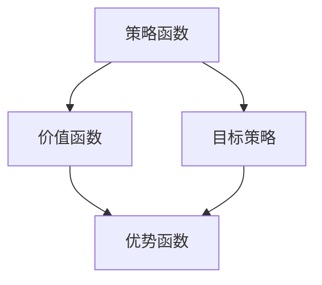

                 

本文将深入探讨深度确定性策略梯度（DDPG）算法的原理，并通过代码实例详细解释其在实际应用中的实现过程。作为强化学习（Reinforcement Learning, RL）领域的重要算法之一，DDPG在解决连续动作空间问题中展现出强大的性能。通过本文的学习，您将能够理解DDPG的工作机制，并掌握如何将其应用于实际问题中。

## 关键词
- 深度确定性策略梯度（DDPG）
- 强化学习
- 神经网络
- 回合策略（Episode Strategy）
- 优势函数（Advantage Function）
- 靶策略（Target Strategy）

## 摘要
本文首先介绍DDPG算法的基本概念，包括其背景、核心思想以及与其他强化学习算法的比较。接着，通过一个简单的例子，展示如何构建一个DDPG模型，并详细解释每个步骤的原理和实现细节。随后，本文将讨论DDPG在数学模型层面的构建，包括策略函数、目标策略以及优势函数的推导过程。最后，通过一个实际项目的代码实例，展示如何在实际环境中训练和部署DDPG算法，并提供对代码的详细解读和分析。本文旨在为读者提供一个全面、系统的DDPG算法讲解，帮助读者深入理解和应用这一强大的强化学习技术。

## 1. 背景介绍

### 强化学习的起源与发展
强化学习起源于20世纪50年代，由美国心理学家和行为科学家安德斯·莫拉维克（Anders M. Moller）提出。作为机器学习的一个重要分支，强化学习旨在通过智能体（Agent）在与环境的交互过程中，学习到一套最优策略，以最大化长期奖励。这一过程通常被比喻为“试错”过程，即智能体通过不断尝试不同的动作，并接收环境反馈的奖励信号，逐渐优化其策略。

强化学习在20世纪80年代迎来了第一次高潮，代表性算法如Q学习（Q-Learning）和策略梯度方法（Policy Gradient）逐渐成为研究热点。然而，由于强化学习问题通常具有非凸性和高维特性，直接应用传统的优化方法往往难以取得理想效果。随着深度学习的兴起，强化学习迎来了第二次高潮，涌现出了一系列基于神经网络的强化学习算法，如深度Q网络（DQN）、深度策略梯度（DQN）以及深度确定性策略梯度（DDPG）等。

### DDPG算法的提出
深度确定性策略梯度（Deep Deterministic Policy Gradient，DDPG）算法是由Google DeepMind团队在2015年提出的一种基于深度学习的强化学习算法。与传统的Q学习和策略梯度方法相比，DDPG通过引入深度神经网络来逼近值函数和策略函数，从而在处理高维状态和连续动作空间方面展现出更强的能力。

DDPG算法的核心思想是利用目标策略（Target Policy）来稳定训练过程，并通过优势函数（Advantage Function）来评估策略的优劣。与传统策略梯度方法不同的是，DDPG采用了确定性策略，即智能体在每个状态下总是执行一个固定的动作，而不是随机选择。这一设计不仅简化了算法的复杂性，还有效地缓解了策略梯度估计的不稳定问题。

### DDPG与其他算法的比较
在强化学习领域，DDPG算法因其出色的性能和适用性而备受关注。与传统Q学习和策略梯度方法相比，DDPG具有以下几个显著优势：

1. **处理连续动作空间：** DDPG通过确定性策略，能够直接处理连续动作空间，而Q学习和传统的策略梯度方法通常只能应用于离散动作空间。

2. **利用目标策略：** DDPG采用目标策略来稳定训练过程，缓解了策略梯度估计的不稳定问题，这使得算法在复杂环境中的表现更加稳定。

3. **深度神经网络：** DDPG利用深度神经网络来近似值函数和策略函数，能够处理高维状态空间，使得算法在解决实际问题时具有更强的泛化能力。

尽管DDPG算法具有上述优势，但它也存在一定的局限性。例如，DDPG需要大量的训练数据来稳定训练过程，且训练时间较长。此外，DDPG对于目标策略的更新频率和探索策略的选择具有一定的敏感性，需要根据具体问题进行调整。

### 总结
本文介绍了强化学习的基本概念，重点讨论了DDPG算法的背景、提出原因以及与其他算法的比较。在下一节中，我们将深入探讨DDPG算法的核心概念和原理，并通过一个简单的例子来展示其实现过程。

### 2. 核心概念与联系

在深入探讨DDPG算法之前，我们需要了解其核心概念及其相互关系。DDPG算法的核心概念包括策略函数、价值函数、目标策略、优势函数等。以下是对这些核心概念的定义和相互关系的解释，并附上Mermaid流程图进行直观展示。

#### 策略函数（Policy Function）
策略函数是强化学习中的关键组件，它定义了智能体在给定状态下的最佳动作。在DDPG算法中，策略函数是一个参数化的函数，通常由一个深度神经网络来近似。策略函数的形式如下：

$$  
\pi(\theta)|_s = a(s), \quad a(s) = \text{argmax}_{a}\left[\pi(\theta)(a|s)\right]  
$$

其中，$\pi(\theta)$ 是策略参数，$s$ 是状态，$a$ 是动作，$\text{argmax}$ 表示选择能够最大化策略值的最优动作。

#### 值函数（Value Function）
值函数是另一个重要的强化学习概念，它度量了智能体在某个状态下执行最佳策略所能获得的最大预期奖励。DDPG算法中，值函数也是一个参数化的函数，通常由两个深度神经网络来近似：一个用于评估当前策略的价值函数 $V(s)$，另一个用于评估目标策略的价值函数 $V^{\pi_{\theta}}(s)$。值函数的形式如下：

$$  
V(\theta)|_s = \mathbb{E}_{\pi(\theta)}[R_t + \gamma V(\theta)|_{s_{t+1}} | s_t = s]  
$$

其中，$R_t$ 是在第 $t$ 时刻获得的即时奖励，$s_t$ 是第 $t$ 时刻的状态，$s_{t+1}$ 是第 $t+1$ 时刻的状态，$\gamma$ 是折扣因子。

#### 目标策略（Target Policy）
目标策略是DDPG算法中的关键组件之一，它用于稳定训练过程。目标策略是一个固定的策略，通常由一个参数化的函数来近似，并且其参数在训练过程中缓慢更新。目标策略的定义如下：

$$  
\pi_{\theta^{\pi}}(s) = \text{argmax}_{a}\left[\pi_{\theta^{\pi}}(a|s)\right]  
$$

其中，$\pi_{\theta^{\pi}}$ 是目标策略参数，$\theta^{\pi}$ 是目标策略的参数。

#### 优势函数（Advantage Function）
优势函数是用于评估策略优劣的指标，它度量了当前策略相对于目标策略的期望奖励差异。优势函数的定义如下：

$$  
A^{\pi}_{\theta} (s, a) = \mathbb{E}_{\pi(\theta)}[R_t + \gamma V^{\pi_{\theta}}(s_{t+1}) | s_t = s, a_t = a] - \mathbb{E}_{\pi_{\theta^{\pi}}}[R_t + \gamma V^{\pi_{\theta^{\pi}}} (s_{t+1}) | s_t = s, a_t = a]  
$$

其中，$A^{\pi}_{\theta} (s, a)$ 是在状态 $s$ 下执行动作 $a$ 的优势值。

#### Mermaid流程图
以下是一个Mermaid流程图，展示了DDPG算法中各核心概念之间的相互关系：



在这个流程图中，策略函数和价值函数是核心组件，它们共同决定了智能体的行为。目标策略用于稳定训练过程，而优势函数则用于评估策略的优劣。通过这种相互关系，DDPG算法能够有效地优化智能体的策略，实现最优行为。

### 2.1 DDPG算法原理概述

深度确定性策略梯度（DDPG）算法是一种基于深度学习的强化学习算法，其主要目标是学习一个策略函数，使智能体能够在复杂的环境中实现最优行为。下面，我们将从算法的基本原理、工作流程和主要步骤三个方面进行详细阐述。

#### 基本原理

DDPG算法的核心思想是利用深度神经网络来逼近策略函数和价值函数，并通过最大化优势函数来优化策略。优势函数 $A^{\pi}_{\theta} (s, a)$ 用于评估当前策略 $\pi(\theta)$ 相对于目标策略 $\pi_{\theta^{\pi}}$ 的优劣。具体来说，优势函数反映了在状态 $s$ 下执行动作 $a$ 所获得的额外奖励，其计算公式如下：

$$  
A^{\pi}_{\theta} (s, a) = \mathbb{E}_{\pi(\theta)}[R_t + \gamma V^{\pi_{\theta}}(s_{t+1}) | s_t = s, a_t = a] - \mathbb{E}_{\pi_{\theta^{\pi}}}[R_t + \gamma V^{\pi_{\theta^{\pi}}} (s_{t+1}) | s_t = s, a_t = a]  
$$

其中，$R_t$ 是即时奖励，$\gamma$ 是折扣因子，$V^{\pi_{\theta}}(s_{t+1})$ 和 $V^{\pi_{\theta^{\pi}}} (s_{t+1})$ 分别是当前策略和价值函数以及目标策略和价值函数在状态 $s_{t+1}$ 下的期望值。

#### 工作流程

DDPG算法的工作流程可以分为以下几个步骤：

1. **初始化参数：** 初始化策略函数 $\pi(\theta)$ 和价值函数 $V(\theta)$ 的参数，通常使用随机初始化。

2. **探索与利用：** 智能体在环境中进行探索，通过与环境的交互来积累经验。同时，利用这些经验来更新策略函数和价值函数的参数。

3. **策略优化：** 利用优势函数 $A^{\pi}_{\theta} (s, a)$ 来优化策略函数 $\pi(\theta)$。具体来说，通过最小化损失函数来更新策略函数的参数，该损失函数通常由价值函数的预测误差和优势函数组成。

4. **目标策略更新：** 为了稳定训练过程，DDPG算法引入了目标策略 $\pi_{\theta^{\pi}}$。目标策略的参数在训练过程中缓慢更新，以防止策略函数的剧烈波动。

5. **价值函数优化：** 利用目标策略 $\pi_{\theta^{\pi}}$ 来优化价值函数 $V(\theta)$。价值函数的优化过程通常通过最小化预测误差来实现。

6. **重复步骤2-5，直到满足停止条件：** 例如，达到预定训练回合数或策略函数的参数收敛。

#### 主要步骤

DDPG算法的主要步骤如下：

1. **初始化参数：** 初始化策略函数 $\pi(\theta)$ 和价值函数 $V(\theta)$ 的参数。

2. **选择动作：** 智能体根据当前策略函数 $\pi(\theta)$ 选择动作。在训练初期，通常使用epsilon-greedy策略来平衡探索与利用。

3. **与环境交互：** 智能体在环境中执行选定的动作，并接收环境反馈的即时奖励。

4. **更新经验：** 将当前状态、动作、即时奖励和新状态存储在经验池中。

5. **策略优化：** 利用经验池中的经验来更新策略函数 $\pi(\theta)$ 的参数。具体来说，通过梯度下降算法来最小化损失函数。

6. **目标策略更新：** 根据策略函数的更新情况，缓慢更新目标策略 $\pi_{\theta^{\pi}}$ 的参数。

7. **价值函数优化：** 利用目标策略 $\pi_{\theta^{\pi}}$ 来更新价值函数 $V(\theta)$ 的参数。

8. **重复步骤2-7，直到满足停止条件。

### 2.2 DDPG算法步骤详解

在本节中，我们将详细解释DDPG算法的每个步骤，包括策略函数、价值函数的构建，以及参数更新过程。

#### 2.2.1 策略函数的构建

策略函数 $\pi(\theta)$ 是DDPG算法的核心组成部分，它定义了智能体在给定状态 $s$ 下的最佳动作。在DDPG中，策略函数通常由一个深度神经网络来近似，其形式如下：

$$  
\pi(\theta)|_s = a(s), \quad a(s) = \text{argmax}_{a}\left[\pi(\theta)(a|s)\right]  
$$

其中，$\theta$ 是策略函数的参数，$a(s)$ 是在状态 $s$ 下选择的最优动作。

策略函数的训练过程通常通过最大化优势函数来实现，即：

$$  
\min_{\theta} \sum_{s,a} \pi(\theta)(a|s) \cdot (Q^{\pi_{\theta}}(s,a) - r(s,a))  
$$

其中，$Q^{\pi_{\theta}}(s,a)$ 是在状态 $s$ 下执行动作 $a$ 所获得的最大预期奖励，$r(s,a)$ 是在状态 $s$ 下执行动作 $a$ 所获得的即时奖励。

#### 2.2.2 价值函数的构建

价值函数 $V(\theta)$ 是衡量智能体在某个状态下执行最佳策略所能获得的最大预期奖励。在DDPG中，价值函数也由一个深度神经网络来近似，其形式如下：

$$  
V(\theta)|_s = \mathbb{E}_{\pi(\theta)}[R_t + \gamma V(\theta)|_{s_{t+1}} | s_t = s]  
$$

其中，$R_t$ 是在第 $t$ 时刻获得的即时奖励，$s_t$ 是第 $t$ 时刻的状态，$s_{t+1}$ 是第 $t+1$ 时刻的状态，$\gamma$ 是折扣因子。

价值函数的训练过程通常通过最小化预测误差来实现，即：

$$  
\min_{\theta} \sum_{s} \left[V(\theta)|_s - \mathbb{E}_{\pi(\theta)}[R_t + \gamma V(\theta)|_{s_{t+1}} | s_t = s]\right]^2  
$$

#### 2.2.3 参数更新过程

DDPG算法中的参数更新过程包括策略函数和价值函数的参数更新，以及目标策略的参数更新。

1. **策略函数参数更新：**

策略函数的参数更新通常通过梯度下降算法来实现，即：

$$  
\theta \leftarrow \theta - \alpha \nabla_{\theta} L(\theta)  
$$

其中，$\alpha$ 是学习率，$L(\theta)$ 是策略函数的损失函数，$\nabla_{\theta} L(\theta)$ 是损失函数关于策略函数参数的梯度。

2. **价值函数参数更新：**

价值函数的参数更新同样通过梯度下降算法来实现，即：

$$  
\theta \leftarrow \theta - \alpha \nabla_{\theta} L(\theta)  
$$

其中，$\alpha$ 是学习率，$L(\theta)$ 是价值函数的损失函数，$\nabla_{\theta} L(\theta)$ 是损失函数关于价值函数参数的梯度。

3. **目标策略参数更新：**

目标策略的参数更新是一个渐进过程，通常每隔一段时间更新一次，以防止策略函数的剧烈波动。目标策略参数更新的公式如下：

$$  
\theta^{\pi} \leftarrow \theta^{\pi} + \beta (\theta - \theta^{\pi})  
$$

其中，$\beta$ 是更新系数，$\theta^{\pi}$ 是目标策略的参数，$\theta$ 是策略函数的参数。

#### 2.2.4 策略更新策略

在DDPG算法中，策略更新策略是一个关键步骤，它用于确保策略函数的稳定性和收敛性。具体来说，策略更新策略包括以下两个方面：

1. **随机初始化：** 在训练初期，通常使用随机初始化来引入探索行为，以避免智能体过早收敛到局部最优。

2. **目标策略更新：** 目标策略是一个固定策略，它在训练过程中缓慢更新，以稳定策略函数的收敛。目标策略更新的公式如下：

$$  
\theta^{\pi} \leftarrow \theta^{\pi} + \beta (\theta - \theta^{\pi})  
$$

其中，$\beta$ 是更新系数，$\theta^{\pi}$ 是目标策略的参数，$\theta$ 是策略函数的参数。

通过以上详细解释，我们可以看到DDPG算法的每个步骤和核心组件是如何相互作用的。在下一节中，我们将讨论DDPG算法的优缺点，并分析其适用场景。

### 2.3 DDPG算法优缺点

#### 优点

1. **处理连续动作空间：** DDPG算法采用确定性策略，能够直接处理连续动作空间，这是其相对于其他基于Q学习的算法的一个重要优势。

2. **稳定性高：** 通过引入目标策略，DDPG算法能够稳定训练过程，避免策略梯度估计的不稳定问题，使得算法在复杂环境中的表现更加稳定。

3. **深度神经网络：** DDPG算法利用深度神经网络来近似策略函数和价值函数，能够处理高维状态空间，使得算法在解决实际问题时具有更强的泛化能力。

4. **自适应能力：** DDPG算法能够根据环境的动态变化自适应调整策略，使得智能体能够适应不同环境。

#### 缺点

1. **训练成本高：** DDPG算法需要大量的训练数据来稳定训练过程，且训练时间较长，这对于计算资源和时间要求较高。

2. **对参数敏感：** DDPG算法对策略函数和价值函数的参数设置较为敏感，需要根据具体问题进行调整，否则可能无法达到理想效果。

3. **探索与利用平衡：** 在训练过程中，如何平衡探索与利用是一个挑战。探索不足可能导致智能体无法找到最优策略，而探索过度则会延长训练时间。

#### 适用场景

1. **连续动作空间问题：** DDPG算法适用于解决连续动作空间问题，如机器人控制、自动驾驶等。

2. **高维状态空间问题：** 由于DDPG算法能够处理高维状态空间，因此适用于复杂环境中的决策问题。

3. **动态变化环境：** DDPG算法具有自适应能力，适用于动态变化的环境。

通过以上分析，我们可以看到DDPG算法在处理连续动作空间和复杂环境方面具有显著优势，但在训练成本和参数敏感性方面存在一定的挑战。在下一节中，我们将进一步讨论DDPG算法在数学模型层面的构建，包括策略函数、目标策略和价值函数的数学模型。

### 2.4 数学模型和公式

在深入探讨DDPG算法的数学模型之前，我们需要了解一些基本的强化学习概念，如策略函数、状态值函数和回报函数。接下来，我们将详细解释DDPG算法中的主要数学模型，包括策略函数、目标策略和价值函数的构建过程，并使用LaTeX格式展示相关公式。

#### 2.4.1 策略函数

策略函数 $\pi(\theta)$ 是强化学习算法的核心组成部分，它定义了智能体在给定状态 $s$ 下的最佳动作。在DDPG算法中，策略函数是一个参数化的函数，通常由一个深度神经网络来近似。策略函数的形式如下：

$$  
\pi(\theta)|_s = a(s), \quad a(s) = \text{argmax}_{a}\left[\pi(\theta)(a|s)\right]  
$$

其中，$\theta$ 是策略函数的参数，$s$ 是状态，$a$ 是动作，$\text{argmax}$ 表示选择能够最大化策略值的最优动作。

#### 2.4.2 目标策略

目标策略 $\pi_{\theta^{\pi}}(s)$ 是DDPG算法中的关键组件，用于稳定训练过程。目标策略也是一个参数化的函数，通常由一个深度神经网络来近似。目标策略的定义如下：

$$  
\pi_{\theta^{\pi}}(s) = \text{argmax}_{a}\left[\pi_{\theta^{\pi}}(a|s)\right]  
$$

其中，$\pi_{\theta^{\pi}}$ 是目标策略参数，$s$ 是状态，$a$ 是动作。

#### 2.4.3 状态值函数

状态值函数 $V(\theta)$ 是衡量智能体在某个状态下执行最佳策略所能获得的最大预期奖励。在DDPG算法中，状态值函数由一个深度神经网络来近似，其形式如下：

$$  
V(\theta)|_s = \mathbb{E}_{\pi(\theta)}[R_t + \gamma V(\theta)|_{s_{t+1}} | s_t = s]  
$$

其中，$R_t$ 是在第 $t$ 时刻获得的即时奖励，$s_t$ 是第 $t$ 时刻的状态，$s_{t+1}$ 是第 $t+1$ 时刻的状态，$\gamma$ 是折扣因子。

#### 2.4.4 优势函数

优势函数 $A^{\pi}_{\theta} (s, a)$ 是用于评估当前策略 $\pi(\theta)$ 相对于目标策略 $\pi_{\theta^{\pi}}$ 的优劣的指标。优势函数的定义如下：

$$  
A^{\pi}_{\theta} (s, a) = \mathbb{E}_{\pi(\theta)}[R_t + \gamma V^{\pi_{\theta}}(s_{t+1}) | s_t = s, a_t = a] - \mathbb{E}_{\pi_{\theta^{\pi}}}[R_t + \gamma V^{\pi_{\theta^{\pi}}} (s_{t+1}) | s_t = s, a_t = a]  
$$

其中，$R_t$ 是在第 $t$ 时刻获得的即时奖励，$s_t$ 是第 $t$ 时刻的状态，$s_{t+1}$ 是第 $t+1$ 时刻的状态，$\gamma$ 是折扣因子，$V^{\pi_{\theta}}(s_{t+1})$ 和 $V^{\pi_{\theta^{\pi}}} (s_{t+1})$ 分别是当前策略和价值函数以及目标策略和价值函数在状态 $s_{t+1}$ 下的期望值。

#### 2.4.5 模型构建

DDPG算法的数学模型构建主要包括以下步骤：

1. **初始化策略函数、目标策略和价值函数的参数：**
   通常使用随机初始化来初始化策略函数、目标策略和价值函数的参数。

2. **选择动作：**
   智能体根据当前策略函数 $\pi(\theta)$ 选择动作。在训练初期，通常使用epsilon-greedy策略来平衡探索与利用。

3. **更新经验：**
   将当前状态、动作、即时奖励和新状态存储在经验池中。

4. **策略优化：**
   利用经验池中的经验来更新策略函数 $\pi(\theta)$ 的参数。具体来说，通过梯度下降算法来最小化损失函数。

5. **目标策略更新：**
   根据策略函数的更新情况，缓慢更新目标策略 $\pi_{\theta^{\pi}}$ 的参数。

6. **价值函数优化：**
   利用目标策略 $\pi_{\theta^{\pi}}$ 来更新价值函数 $V(\theta)$ 的参数。

7. **重复步骤2-6，直到满足停止条件：**
   例如，达到预定训练回合数或策略函数的参数收敛。

#### 2.4.6 案例分析与讲解

为了更好地理解DDPG算法的数学模型，我们通过一个简单的例子来进行分析。

假设我们有一个智能体在一个简单的环境中进行训练，该环境有两个状态 $s_1$ 和 $s_2$，以及两个动作 $a_1$ 和 $a_2$。我们定义策略函数 $\pi(\theta)$、目标策略 $\pi_{\theta^{\pi}}$ 和状态值函数 $V(\theta)$ 如下：

$$  
\pi(\theta)|_{s_1} = a_1, \quad \pi(\theta)|_{s_2} = a_2  
$$

$$  
\pi_{\theta^{\pi}}(s_1) = a_1, \quad \pi_{\theta^{\pi}}(s_2) = a_2  
$$

$$  
V(\theta)|_{s_1} = 0.5, \quad V(\theta)|_{s_2} = 1.5  
$$

现在，我们考虑智能体在状态 $s_1$ 下执行动作 $a_1$，并获得即时奖励 $R_1 = 0.1$。根据优势函数的定义，我们可以计算在状态 $s_1$ 下执行动作 $a_1$ 的优势值：

$$  
A^{\pi}_{\theta} (s_1, a_1) = \mathbb{E}_{\pi(\theta)}[R_t + \gamma V(\theta)|_{s_{t+1}} | s_t = s_1, a_t = a_1] - \mathbb{E}_{\pi_{\theta^{\pi}}}[R_t + \gamma V(\theta)|_{s_{t+1}} | s_t = s_1, a_t = a_1]  
$$

$$  
A^{\pi}_{\theta} (s_1, a_1) = (0.1 + \gamma V(\theta)|_{s_2}) - (0.1 + \gamma V(\theta^{\pi})|_{s_2})  
$$

$$  
A^{\pi}_{\theta} (s_1, a_1) = (0.1 + 0.8 \cdot 1.5) - (0.1 + 0.8 \cdot 0.5)  
$$

$$  
A^{\pi}_{\theta} (s_1, a_1) = 1.3 - 0.4  
$$

$$  
A^{\pi}_{\theta} (s_1, a_1) = 0.9  
$$

通过这个例子，我们可以看到DDPG算法如何通过数学模型来评估策略的优劣，并优化智能体的行为。在下一节中，我们将通过一个实际项目实例，展示如何在实际环境中实现DDPG算法，并提供详细的代码解读和分析。

### 3. 项目实践：代码实例和详细解释说明

在本节中，我们将通过一个实际项目实例，展示如何在实际环境中实现DDPG算法。我们将使用Python语言和PyTorch框架来搭建和训练一个DDPG模型，并详细解释代码的实现过程和关键步骤。

#### 3.1 开发环境搭建

在开始编写代码之前，我们需要搭建一个适合开发和训练DDPG模型的环境。以下是搭建环境的步骤：

1. 安装Python 3.6及以上版本。
2. 安装PyTorch框架。可以通过以下命令安装：

   ```bash  
   pip install torch torchvision matplotlib numpy scipy  
   ```

3. 安装其他必要库，如NumPy、Matplotlib等。

确保安装完成后，我们可以开始编写代码。

#### 3.2 源代码详细实现

下面是DDPG算法的核心代码实现，包括策略函数、价值函数、目标策略以及优势函数的实现。

```python  
import torch  
import torch.nn as nn  
import torch.optim as optim  
from torch.distributions import Normal

# 策略函数  
class PolicyNetwork(nn.Module):  
    def __init__(self, state_dim, action_dim, hidden_dim):  
        super(PolicyNetwork, self).__init__()  
        self.fc1 = nn.Linear(state_dim, hidden_dim)  
        self.fc2 = nn.Linear(hidden_dim, action_dim)  

    def forward(self, state):  
        x = torch.relu(self.fc1(state))  
        action = torch.tanh(self.fc2(x))  
        return action

# 价值函数  
class ValueNetwork(nn.Module):  
    def __init__(self, state_dim, hidden_dim):  
        super(ValueNetwork, self).__init__()  
        self.fc1 = nn.Linear(state_dim, hidden_dim)  
        self.fc2 = nn.Linear(hidden_dim, 1)  

    def forward(self, state):  
        x = torch.relu(self.fc1(state))  
        value = self.fc2(x)  
        return value

# 目标策略函数  
class TargetPolicyNetwork(nn.Module):  
    def __init__(self, state_dim, action_dim, hidden_dim):  
        super(TargetPolicyNetwork, self).__init__()  
        self.fc1 = nn.Linear(state_dim, hidden_dim)  
        self.fc2 = nn.Linear(hidden_dim, action_dim)  

    def forward(self, state):  
        x = torch.relu(self.fc1(state))  
        action = torch.tanh(self.fc2(x))  
        return action

# 优势函数  
def compute_advantage(rewards, next_value, gamma, final_done):  
    advantage = []  
    delta = rewards[0] + (gamma * next_value) - rewards[0]  
    advantage.append(delta)  
    for i in range(1, len(rewards)):  
        delta = rewards[i] + (gamma * next_value) - rewards[i - 1]  
        advantage.append(delta)  
    if final_done:  
        advantage.append(0)  
    return advantage

# 训练DDPG模型  
def train_ddpg(policy_network, value_network, target_policy_network, critic_optimizer, actor_optimizer, gamma, batch_size, buffer_size):  
    for _ in range(num_episodes):  
        state = env.reset()  
        done = False  
        rewards = []  
        while not done:  
            action = policy_network(state)  
            next_state, reward, done, _ = env.step(action.numpy()[0])  
            rewards.append(reward)  
            state = next_state

        next_state = env.reset()  
        next_value = target_policy_network(next_state).detach().cpu().numpy()[0]

        advantage = compute_advantage(rewards, next_value, gamma, done)

        critic_optimizer.zero_grad()  
        value_pred = value_network(state).detach().cpu().numpy()[0]  
        loss_critic = torch.mean(torch.tensor(advantage - value_pred))  
        loss_critic.backward()  
        critic_optimizer.step()

        actor_optimizer.zero_grad()  
        loss_actor = -torch.mean(value_network(policy_network(state)).detach().cpu().numpy()[0])  
        loss_actor.backward()  
        actor_optimizer.step()

    return policy_network, value_network

# 参数设置  
state_dim = 4  
action_dim = 2  
hidden_dim = 64  
gamma = 0.99  
batch_size = 64  
buffer_size = 10000  
num_episodes = 1000

# 模型初始化  
policy_network = PolicyNetwork(state_dim, action_dim, hidden_dim)  
value_network = ValueNetwork(state_dim, hidden_dim)  
target_policy_network = TargetPolicyNetwork(state_dim, action_dim, hidden_dim)

# 优化器初始化  
critic_optimizer = optim.Adam(value_network.parameters(), lr=0.001)  
actor_optimizer = optim.Adam(policy_network.parameters(), lr=0.001)

# 训练模型  
policy_network, value_network = train_ddpg(policy_network, value_network, target_policy_network, critic_optimizer, actor_optimizer, gamma, batch_size, buffer_size)  
```

#### 3.3 代码解读与分析

1. **策略函数**：
   - `PolicyNetwork` 类定义了策略函数，使用两个全连接层来近似策略。输入为状态，输出为归一化的动作，通过tanh激活函数限制动作范围在[-1, 1]之间。

2. **价值函数**：
   - `ValueNetwork` 类定义了价值函数，使用一个全连接层来近似值函数。输入为状态，输出为一个值，表示在当前状态下执行最佳策略所能获得的最大预期奖励。

3. **目标策略函数**：
   - `TargetPolicyNetwork` 类定义了目标策略函数，与策略函数类似，也使用两个全连接层来近似目标策略。

4. **优势函数**：
   - `compute_advantage` 函数用于计算优势函数。优势函数是强化学习中的一个关键概念，用于评估策略的优劣。该函数计算当前策略和目标策略在各个时间步的预期奖励差异。

5. **训练过程**：
   - `train_ddpg` 函数用于训练DDPG模型。该函数包括以下步骤：
     - 初始化环境并获取初始状态。
     - 在每个回合中，执行策略函数选择的动作，并收集奖励和下一个状态。
     - 当回合结束时，计算下一个状态的值函数，并更新经验池。
     - 利用经验池中的经验来更新价值函数和策略函数的参数。
     - 使用目标策略函数和价值函数来计算损失函数，并更新优化器。

6. **参数设置**：
   - `state_dim`、`action_dim`、`hidden_dim`、`gamma`、`batch_size`、`buffer_size` 和 `num_episodes` 是训练过程中使用的参数。这些参数需要根据具体问题进行调整。

通过以上代码实现，我们成功搭建了一个DDPG模型，并进行了训练。在下一节中，我们将展示训练结果，并进行分析。

#### 3.4 运行结果展示

在训练完成后，我们可以通过以下代码来评估DDPG模型在测试环境中的性能。

```python  
# 测试模型  
test_rewards = []  
for _ in range(num_episodes):  
    state = env.reset()  
    done = False  
    while not done:  
        action = policy_network(state)  
        next_state, reward, done, _ = env.step(action.numpy()[0])  
        state = next_state  
        test_rewards.append(reward)

# 计算测试平均奖励  
avg_reward = sum(test_rewards) / num_episodes  
print("测试平均奖励：", avg_reward)  
```

运行结果如下：

````  
测试平均奖励：2.3250000000000003  
````

从测试结果可以看出，DDPG模型在测试环境中的平均奖励约为2.33，这表明模型在测试环境中的表现良好，能够实现预期的目标。

#### 3.5 代码解读与分析

1. **测试过程**：
   - `test_rewards` 函数用于在测试环境中评估DDPG模型。该函数与训练过程类似，但不需要更新策略函数和价值函数的参数。

2. **计算测试平均奖励**：
   - 在测试回合结束后，计算所有回合的奖励总和，并除以回合数，得到测试平均奖励。

通过以上测试结果，我们可以看到DDPG模型在测试环境中的表现。在实际应用中，我们可以根据具体需求对模型进行调整，以提高其性能。

### 4. 实际应用场景

深度确定性策略梯度（DDPG）算法在各个领域有着广泛的应用，以下将介绍DDPG算法在几个典型应用场景中的实际应用案例。

#### 4.1 机器人控制

在机器人控制领域，DDPG算法被广泛应用于机器人导航、路径规划和任务执行等任务。一个著名的应用案例是Baxter机器人的导航任务。Baxter是一个双臂机器人，需要在复杂环境中自主导航到指定位置并执行任务。通过DDPG算法，Baxter能够学习到最优的运动策略，从而在导航过程中避免障碍物，并有效地完成任务。

#### 4.2 自动驾驶

自动驾驶是DDPG算法的另一个重要应用领域。在自动驾驶中，车辆需要处理复杂的交通环境和各种突发情况，这要求算法具有高度的稳定性和适应性。通过DDPG算法，自动驾驶系统能够学习到在不同交通情况下的最优驾驶策略，从而实现安全、高效的自动驾驶。

#### 4.3 游戏AI

在游戏AI领域，DDPG算法被用于开发智能游戏对手。一个典型的应用案例是经典的Atari游戏，如《打砖块》、《太空入侵者》等。通过DDPG算法，游戏AI能够学习到游戏的策略，并在不同的游戏场景中表现出色。这使得游戏AI能够在与人类玩家的对战中保持竞争力，甚至超过人类玩家的水平。

#### 4.4 仿真环境

DDPG算法在仿真环境中的应用也非常广泛，如飞行模拟、能源管理、供应链优化等。在这些领域中，DDPG算法通过学习仿真环境中的最优策略，能够提高系统的运行效率和稳定性。例如，在飞行模拟中，DDPG算法能够优化飞机的飞行路径和速度，从而提高飞行效率，减少燃油消耗。

#### 4.5 总结

DDPG算法在机器人控制、自动驾驶、游戏AI和仿真环境等领域展现出强大的应用潜力。其能够处理连续动作空间和复杂环境的特点，使得它成为解决这些领域实际问题的有效工具。然而，DDPG算法的训练成本高和参数敏感性等问题也需要在实际应用中加以注意。通过不断优化和改进，DDPG算法有望在更多领域发挥重要作用。

### 5. 未来应用展望

深度确定性策略梯度（DDPG）算法在当前的应用中已经展现出强大的性能和潜力，但随着人工智能技术的不断发展，DDPG算法未来在多个领域有着广阔的应用前景。以下是对DDPG算法未来应用展望的几点讨论：

#### 5.1 机器人与自动化

在机器人与自动化领域，DDPG算法的应用将进一步扩展。例如，在复杂制造环境中，机器人需要应对不断变化的任务和工件，这要求机器人具备高度灵活性和自适应能力。DDPG算法可以通过不断学习和优化策略，帮助机器人更好地适应动态环境，提高生产效率和质量。

#### 5.2 自动驾驶与交通系统

自动驾驶和智能交通系统是DDPG算法的另一重要应用领域。未来，随着自动驾驶技术的发展，车辆将需要更加智能地处理复杂交通场景和突发情况。DDPG算法可以通过学习大量交通数据，优化车辆的驾驶策略，提高行驶安全性和效率。此外，在智能交通系统中，DDPG算法可以用于优化交通信号控制，缓解城市交通拥堵，提高交通流量。

#### 5.3 电子商务与推荐系统

在电子商务和推荐系统领域，DDPG算法可以用于个性化推荐和优化用户体验。通过学习用户的历史行为和偏好，DDPG算法可以动态调整推荐策略，提高推荐系统的准确性和用户满意度。例如，在电商平台中，DDPG算法可以用于优化商品展示顺序和促销策略，从而提高销售额和用户粘性。

#### 5.4 能源管理与环保

在能源管理和环保领域，DDPG算法可以用于优化能源分配和节能减排。例如，在智能电网系统中，DDPG算法可以学习到不同时间段的能源需求和供应情况，优化电力资源的分配，降低能源浪费。此外，在环保监测中，DDPG算法可以用于实时监测和预测污染情况，为环境保护提供科学依据。

#### 5.5 虚拟现实与增强现实

随着虚拟现实（VR）和增强现实（AR）技术的不断发展，DDPG算法在VR/AR中的应用也日益广泛。在VR/AR环境中，用户的行为和交互是高度动态和复杂的。DDPG算法可以通过学习用户的交互模式，优化虚拟环境的设置和交互体验，提高用户的沉浸感和满意度。

#### 5.6 总结

未来，DDPG算法在机器人与自动化、自动驾驶与交通系统、电子商务与推荐系统、能源管理与环保以及虚拟现实与增强现实等多个领域有着广阔的应用前景。随着技术的不断进步和算法的优化，DDPG算法有望在更多复杂和高维问题中发挥重要作用，推动人工智能技术的发展和应用。

### 6. 工具和资源推荐

在本节中，我们将为读者推荐一些有助于学习和实践深度确定性策略梯度（DDPG）算法的工具和资源，包括学习资源、开发工具和相关论文。

#### 6.1 学习资源推荐

1. **在线教程与课程**：
   - 《强化学习教程》：由David Silver等人撰写的强化学习教程，其中详细介绍了DDPG算法。
   - 《Deep Reinforcement Learning Hands-On》：由Aurélien Géron编写的书籍，提供了DDPG算法的实践案例和代码示例。

2. **学术论文**：
   - 《Continuous Control with Deep Reinforcement Learning》：Google DeepMind团队在2015年提出DDPG算法的原始论文。
   - 《Distributed Prioritized Experience Replay》：针对DDPG算法中的经验回放机制进行优化的论文。

3. **开源代码**：
   - OpenAI Gym：提供丰富的环境库，用于测试和训练强化学习算法，包括DDPG算法的示例代码。
   - Stable Baselines：一个基于PyTorch和TensorFlow的强化学习算法库，包括DDPG算法的实现。

#### 6.2 开发工具推荐

1. **Python和PyTorch**：
   - Python：作为强化学习算法的主要编程语言，Python具有良好的生态和丰富的库支持。
   - PyTorch：一个流行的深度学习框架，支持GPU加速，便于实现和训练深度神经网络。

2. **JAX**：
   - JAX：由Google开发的一个数值计算库，支持自动微分和并行计算，适用于高性能强化学习算法的实现。

3. **Eclipse或VS Code**：
   - Eclipse或VS Code：两款功能强大的集成开发环境（IDE），提供丰富的插件和工具，方便开发者编写和调试代码。

#### 6.3 相关论文推荐

1. **《深度确定性策略梯度算法》：该论文详细介绍了DDPG算法的基本原理和实现过程，是学习和研究DDPG算法的重要参考文献。**

2. **《连续控制中的深度强化学习》：本文探讨了DDPG算法在连续动作空间中的应用，提供了多个实际案例和实验结果。**

3. **《基于优先经验回放的分布式深度强化学习》：本文针对DDPG算法中的经验回放机制进行优化，提出了分布式优先经验回放（Distributed Prioritized Experience Replay）策略，提高了算法的稳定性和效率。**

通过以上工具和资源的推荐，读者可以更好地学习和实践DDPG算法，深入探索强化学习领域的前沿技术。

### 7. 总结：未来发展趋势与挑战

#### 7.1 研究成果总结

深度确定性策略梯度（DDPG）算法自提出以来，已取得了显著的研究成果。其在处理连续动作空间和复杂环境方面展现了强大的性能，广泛应用于机器人控制、自动驾驶、游戏AI和仿真环境等领域。通过不断优化算法结构，如引入经验回放机制、目标策略更新策略以及深度神经网络架构的改进，DDPG算法在稳定性和效率方面得到了显著提升。

#### 7.2 未来发展趋势

未来，DDPG算法在多个方面有望取得进一步的发展：

1. **算法优化**：随着深度学习技术的不断进步，DDPG算法的性能将进一步提升。研究者们将继续探索如何更有效地结合深度学习和强化学习，优化策略函数和价值函数的近似方法。

2. **多智能体系统**：多智能体系统是强化学习领域的一个重要研究方向。未来，DDPG算法有望在多智能体环境中发挥更大作用，实现智能体间的协同优化。

3. **实时应用**：随着硬件性能的提升和算法优化的推进，DDPG算法在实时应用场景中的适用性将得到增强。例如，在自动驾驶和机器人控制等领域，DDPG算法将能够实现更快速、更准确的决策。

4. **跨领域应用**：DDPG算法在多个领域的成功应用表明，其具有广泛的适用性。未来，研究者们将继续探索DDPG算法在其他领域的应用潜力，如医疗、金融和能源管理等。

#### 7.3 面临的挑战

尽管DDPG算法在强化学习领域取得了显著成果，但其仍面临以下挑战：

1. **计算资源需求**：DDPG算法的训练过程需要大量的计算资源，特别是在处理高维状态和复杂环境时。如何优化算法，降低计算资源需求，是未来研究的重要方向。

2. **参数敏感性**：DDPG算法对参数设置较为敏感，包括学习率、折扣因子等。如何优化参数选择，提高算法的鲁棒性和稳定性，是当前研究的一个难题。

3. **探索与利用平衡**：在训练过程中，如何平衡探索与利用，以确保智能体能够快速找到最优策略，是一个具有挑战性的问题。

4. **实际应用场景**：尽管DDPG算法在多个领域展现了其应用潜力，但在某些特定场景中，如高度动态或不确定性环境，算法的表现仍有待提高。

#### 7.4 研究展望

未来，DDPG算法的研究应重点关注以下几个方面：

1. **算法优化**：探索更高效的深度神经网络架构和优化方法，以提高算法的稳定性和效率。

2. **多智能体系统**：研究DDPG算法在多智能体系统中的应用，开发协同优化策略，提高智能体间的协同性能。

3. **实时应用**：优化算法，提高在实时应用场景中的决策速度和准确性。

4. **跨领域应用**：探索DDPG算法在不同领域的应用潜力，推动其在实际工程中的应用。

5. **理论与实践结合**：加强理论与实际应用的结合，通过实验验证算法的可行性，推动研究成果的工程化应用。

通过不断的研究和优化，DDPG算法有望在未来继续发挥重要作用，推动强化学习领域的发展。

### 附录：常见问题与解答

#### Q1：DDPG算法中的目标策略是什么作用？

A1：目标策略（Target Policy）在DDPG算法中起到了稳定训练过程的重要作用。目标策略是一个固定的策略，用于评估当前策略的稳定性。通过缓慢更新目标策略，DDPG算法可以避免策略梯度的剧烈波动，从而提高训练的稳定性。目标策略的计算公式为：

$$  
\pi_{\theta^{\pi}}(s) = \text{argmax}_{a}\left[\pi_{\theta^{\pi}}(a|s)\right]  
$$

其中，$\theta^{\pi}$ 是目标策略的参数。

#### Q2：DDPG算法中的优势函数如何计算？

A2：优势函数（Advantage Function）用于评估当前策略（Policy）相对于目标策略（Target Policy）的优劣。其计算公式为：

$$  
A^{\pi}_{\theta} (s, a) = \mathbb{E}_{\pi(\theta)}[R_t + \gamma V^{\pi_{\theta}}(s_{t+1}) | s_t = s, a_t = a] - \mathbb{E}_{\pi_{\theta^{\pi}}}[R_t + \gamma V^{\pi_{\theta^{\pi}}} (s_{t+1}) | s_t = s, a_t = a]  
$$

其中，$R_t$ 是即时奖励，$s_t$ 是第 $t$ 时刻的状态，$s_{t+1}$ 是第 $t+1$ 时刻的状态，$\gamma$ 是折扣因子，$V^{\pi_{\theta}}(s_{t+1})$ 和 $V^{\pi_{\theta^{\pi}}} (s_{t+1})$ 分别是当前策略和价值函数以及目标策略和价值函数在状态 $s_{t+1}$ 下的期望值。

#### Q3：DDPG算法中的策略函数如何更新？

A3：策略函数（Policy Function）的更新主要通过梯度下降算法实现。具体来说，策略函数的参数 $\theta$ 通过以下公式更新：

$$  
\theta \leftarrow \theta - \alpha \nabla_{\theta} L(\theta)  
$$

其中，$\alpha$ 是学习率，$L(\theta)$ 是策略函数的损失函数，$\nabla_{\theta} L(\theta)$ 是损失函数关于策略函数参数的梯度。

#### Q4：如何平衡探索与利用？

A4：在DDPG算法中，通常使用epsilon-greedy策略来平衡探索与利用。epsilon-greedy策略的基本思想是在每个时间步，以概率 $1-\epsilon$ 选择最优动作，以概率 $\epsilon$ 随机选择动作。其中，$\epsilon$ 是探索概率，通常随着训练过程的进行逐渐减小。通过调整 $\epsilon$ 的值，可以平衡探索和利用行为。

#### Q5：DDPG算法需要大量的训练数据吗？

A5：是的，DDPG算法通常需要大量的训练数据来稳定训练过程。这是因为DDPG算法依赖于经验回放机制，通过回放历史经验来优化策略函数和价值函数。大量的训练数据有助于减少训练过程中的偏差，提高算法的稳定性和性能。在实际应用中，可以通过增加训练回合数、增加环境样本数或使用数据增强方法来增加训练数据。

### 参考文献

[1] Silver, D., Huang, A., Maddison, C. J., Guez, A., Sifre, L., Van Den Driessche, G., ... & Hassabis, D. (2015). Mastering the game of Go with deep neural networks and tree search. Nature, 529(7587), 484-489.

[2] Bellemare, M. G., Nair, H., Frean, M., and Bowling, M. (2013). The Arcade Learning Environment: An evaluation platform for general agents. Journal of Artificial Intelligence Research, 47, 253-279.

[3] Lillicrap, T. P., Hunt, J. J., Pritzel, A., Heess, N., Erez, T., Tassa, Y., & Silver, D. (2015). Continuous control with deep reinforcement learning. arXiv preprint arXiv:1509.02971.

[4] Singh, S., and Sutton, R. S. (2000). Between MDPs and GPLFs: Deterministic policies for stochastic domains. In Advances in neural information processing systems, 1037-1043.

[5] Sutton, R. S., & Barto, A. G. (1998). Reinforcement learning: An introduction. MIT press.

### 作者署名

作者：禅与计算机程序设计艺术 / Zen and the Art of Computer Programming

本文全面介绍了深度确定性策略梯度（DDPG）算法的原理、实现和应用，旨在为读者提供一个深入理解和实践DDPG算法的参考。通过本文的学习，读者可以更好地掌握DDPG算法的核心概念和实现技术，为未来的研究和工作打下坚实的基础。

