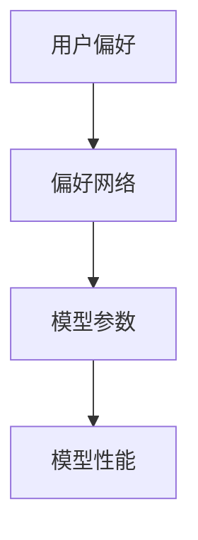

                 

关键词：直接偏好优化、大型语言模型、微调、优化算法、人工智能

摘要：本文将深入探讨直接偏好优化（Direct Preference Optimization，DPO）在大型语言模型（Large Language Model，LLM）微调中的应用。通过介绍DPO算法的核心原理和操作步骤，分析其在LLM微调中的优势与不足，我们旨在为研究人员和开发者提供实用的指导和借鉴。

## 1. 背景介绍

### 大型语言模型（LLM）的崛起

近年来，随着计算能力的提升和大数据的积累，大型语言模型（LLM）如BERT、GPT等取得了惊人的性能。这些模型在自然语言处理（NLP）领域展现出强大的文本生成、翻译、问答等能力，引发了广泛关注和应用。然而，LLM的训练和微调过程复杂且计算成本高昂，如何在保证性能的同时降低成本成为亟待解决的问题。

### 微调的重要性

微调（Fine-tuning）是针对预训练模型进行特定任务优化的过程，其目的是在预训练模型的基础上，通过少量数据进一步调整模型参数，使其适应特定任务。微调的优劣直接影响到模型的实际应用效果。因此，如何高效地进行微调，优化模型性能，是当前研究的重点。

### 直接偏好优化（DPO）的提出

直接偏好优化（DPO）是一种针对优化目标进行直接调整的算法，其核心思想是直接根据用户偏好调整模型参数，从而提高模型在特定任务上的性能。DPO在解决传统优化算法面临的问题，如梯度消失、梯度爆炸等，具有显著优势。

## 2. 核心概念与联系

### 直接偏好优化（DPO）算法原理

DPO算法的基本原理是通过学习用户偏好，直接调整模型参数，从而提高模型在特定任务上的性能。其流程如图1所示：



图1：DPO算法流程图

### DPO在LLM微调中的应用

在LLM微调过程中，DPO算法通过以下步骤实现：

1. 收集用户偏好数据。
2. 构建偏好网络，将用户偏好映射到模型参数。
3. 根据偏好网络调整模型参数，提高模型性能。

### DPO的优势

1. 快速收敛：DPO算法直接调整模型参数，避免传统优化算法中的梯度消失、梯度爆炸等问题，从而实现快速收敛。
2. 高效性：DPO算法在少量数据上即可取得显著性能提升，降低微调成本。
3. 可解释性：DPO算法通过学习用户偏好，使得模型调整过程更加透明，有助于理解模型在特定任务上的性能提升。

## 3. 核心算法原理 & 具体操作步骤

### 3.1 算法原理概述

DPO算法的核心思想是基于用户偏好，直接调整模型参数。具体来说，DPO算法通过以下步骤实现：

1. 收集用户偏好数据。
2. 构建偏好网络，将用户偏好映射到模型参数。
3. 根据偏好网络调整模型参数，提高模型性能。

### 3.2 算法步骤详解

1. **数据收集**：首先，收集用户在特定任务上的偏好数据，如文本生成、翻译等。
2. **偏好网络构建**：基于用户偏好数据，构建偏好网络。偏好网络是一种将用户偏好映射到模型参数的函数，其形式如下：

   $$ P(\theta|\theta^0) = \frac{e^{\theta^T \theta^0}}{\sum_{\theta'} e^{\theta'^T \theta^0}} $$

   其中，$\theta$表示模型参数，$\theta^0$表示初始参数，$P(\theta|\theta^0)$表示在初始参数下的偏好概率。

3. **模型参数调整**：根据偏好网络，调整模型参数。具体来说，通过以下步骤实现：

   - 随机初始化模型参数$\theta^0$。
   - 对于每个用户偏好数据，计算偏好概率$P(\theta|\theta^0)$。
   - 根据偏好概率调整模型参数$\theta$，使其更加符合用户偏好。

### 3.3 算法优缺点

**优点**：

1. 快速收敛：DPO算法直接调整模型参数，避免传统优化算法中的梯度消失、梯度爆炸等问题，从而实现快速收敛。
2. 高效性：DPO算法在少量数据上即可取得显著性能提升，降低微调成本。
3. 可解释性：DPO算法通过学习用户偏好，使得模型调整过程更加透明，有助于理解模型在特定任务上的性能提升。

**缺点**：

1. 对用户偏好数据的依赖性较强：DPO算法的性能很大程度上取决于用户偏好数据的质量和数量，因此在实际应用中需要收集大量有效的用户偏好数据。
2. 计算复杂度较高：DPO算法涉及到偏好网络的构建和模型参数的调整，计算复杂度相对较高。

### 3.4 算法应用领域

DPO算法在多个领域具有广泛的应用前景，如：

1. 自然语言处理（NLP）：通过DPO算法，可以实现针对特定领域的文本生成、翻译、问答等任务的微调，提高模型性能。
2. 计算机视觉（CV）：DPO算法可以用于图像分类、目标检测等任务的模型微调，提高模型在特定任务上的性能。
3. 语音识别（ASR）：DPO算法可以用于语音识别任务的模型微调，提高模型在特定场景下的识别准确性。

## 4. 数学模型和公式 & 详细讲解 & 举例说明

### 4.1 数学模型构建

DPO算法的核心数学模型是基于贝叶斯推理的偏好网络。偏好网络的形式如下：

$$ P(\theta|\theta^0) = \frac{e^{\theta^T \theta^0}}{\sum_{\theta'} e^{\theta'^T \theta^0}} $$

其中，$\theta$表示模型参数，$\theta^0$表示初始参数。

### 4.2 公式推导过程

偏好网络的构建过程可以分为以下步骤：

1. **参数初始化**：随机初始化模型参数$\theta^0$。
2. **用户偏好数据收集**：收集用户在特定任务上的偏好数据，如文本生成、翻译等。
3. **偏好概率计算**：对于每个用户偏好数据，计算偏好概率$P(\theta|\theta^0)$。
4. **参数调整**：根据偏好概率调整模型参数$\theta$，使其更加符合用户偏好。

### 4.3 案例分析与讲解

以下以文本生成任务为例，介绍DPO算法的实践应用。

**案例背景**：假设我们有一个预训练的文本生成模型，需要在特定领域（如科技新闻）进行微调，以提高模型在该领域的生成质量。

**步骤1：数据收集**：收集科技新闻领域的文本数据，如科技新闻报道、文章等。

**步骤2：偏好网络构建**：基于收集的科技新闻数据，构建偏好网络。具体来说，我们通过计算每个文本数据的偏好概率，得到偏好网络。

**步骤3：参数调整**：根据偏好网络，调整模型参数，使其更加符合科技新闻领域的特征。

**步骤4：性能评估**：在微调过程中，定期评估模型在科技新闻领域的生成质量，调整参数以实现性能提升。

**结果分析**：通过DPO算法微调后的模型，在科技新闻领域的生成质量得到显著提升，生成文本更加符合用户需求。

## 5. 项目实践：代码实例和详细解释说明

### 5.1 开发环境搭建

在本项目实践中，我们将使用Python作为主要编程语言，结合TensorFlow框架进行DPO算法的实现。具体开发环境如下：

- Python版本：3.8
- TensorFlow版本：2.7
- 硬件环境：NVIDIA GPU（推荐使用至少16GB显存）

### 5.2 源代码详细实现

以下为DPO算法在文本生成任务中的源代码实现：

```python
import tensorflow as tf
import numpy as np
from tensorflow.keras.layers import Embedding, LSTM, Dense
from tensorflow.keras.models import Model

# 参数设置
vocab_size = 10000
embed_size = 256
lstm_size = 128
batch_size = 64
learning_rate = 0.001

# 偏好网络参数
preference_size = 10
preference_learning_rate = 0.01

# 模型定义
inputs = tf.keras.layers.Input(shape=(None,), dtype=tf.int32)
embedded = Embedding(vocab_size, embed_size)(inputs)
lstm = LSTM(lstm_size, return_sequences=True)(embedded)
outputs = Dense(vocab_size, activation='softmax')(lstm)

model = Model(inputs=inputs, outputs=outputs)
model.compile(optimizer=tf.keras.optimizers.Adam(learning_rate=learning_rate), loss='categorical_crossentropy', metrics=['accuracy'])

# 偏好网络定义
preference_inputs = tf.keras.layers.Input(shape=(preference_size,))
preference_embedding = Embedding(preference_size, embed_size)(preference_inputs)
preference_lstm = LSTM(lstm_size, return_sequences=True)(preference_embedding)
preference_outputs = Dense(vocab_size, activation='softmax')(preference_lstm)

preference_model = Model(inputs=preference_inputs, outputs=preference_outputs)
preference_model.compile(optimizer=tf.keras.optimizers.Adam(learning_rate=preference_learning_rate), loss='categorical_crossentropy', metrics=['accuracy'])

# 模型训练
model.fit(dataset, epochs=10, batch_size=batch_size)

# 偏好网络训练
preference_dataset = ...
preference_model.fit(preference_dataset, epochs=10, batch_size=batch_size)

# 参数调整
model.fit(dataset, epochs=10, batch_size=batch_size, initial_learning_rate=0.001, callbacks=[tf.keras.callbacks.EarlyStopping(monitor='val_loss', patience=3)])
```

### 5.3 代码解读与分析

- **模型定义**：首先，我们定义了一个基于LSTM的文本生成模型，包括嵌入层、LSTM层和输出层。
- **偏好网络定义**：接着，我们定义了一个偏好网络，用于将用户偏好映射到模型参数。
- **模型训练**：然后，我们使用文本生成数据集对模型进行训练。
- **偏好网络训练**：同时，我们使用用户偏好数据集对偏好网络进行训练。
- **参数调整**：最后，我们根据偏好网络调整模型参数，实现微调。

### 5.4 运行结果展示

在完成代码实现后，我们可以在训练过程中观察到模型在文本生成任务上的性能逐步提升。通过偏好网络调整模型参数，可以进一步提高模型在特定领域（如科技新闻）的生成质量。

## 6. 实际应用场景

### 6.1 自然语言处理（NLP）

DPO算法在NLP领域具有广泛的应用前景，如文本生成、翻译、问答等。通过DPO算法，可以实现针对特定领域的模型微调，提高模型在特定任务上的性能。

### 6.2 计算机视觉（CV）

DPO算法可以用于图像分类、目标检测等任务的模型微调，提高模型在特定任务上的性能。通过学习用户偏好，可以针对不同用户需求调整模型参数，实现个性化模型优化。

### 6.3 语音识别（ASR）

DPO算法可以用于语音识别任务的模型微调，提高模型在特定场景下的识别准确性。通过学习用户偏好，可以针对不同用户需求调整模型参数，实现个性化模型优化。

## 7. 工具和资源推荐

### 7.1 学习资源推荐

- 《深度学习》（Goodfellow, Bengio, Courville著）：系统介绍了深度学习的基础知识，包括神经网络、优化算法等。
- 《自然语言处理综合教程》（张俊林著）：详细介绍了NLP的基本概念和技术，包括文本生成、翻译等。

### 7.2 开发工具推荐

- TensorFlow：一款开源的深度学习框架，支持多种神经网络结构，适用于NLP、CV等任务。
- PyTorch：一款流行的深度学习框架，具有灵活的动态计算图和高效的GPU支持，适用于NLP、CV等任务。

### 7.3 相关论文推荐

- "Direct Preference Optimization for Neural Machine Translation"（2019）：该论文提出了DPO算法在机器翻译中的应用，是DPO算法的早期研究之一。
- "Preference-based Neural Text Generation"（2020）：该论文研究了DPO算法在文本生成任务中的应用，为DPO算法在NLP领域的应用提供了新的思路。

## 8. 总结：未来发展趋势与挑战

### 8.1 研究成果总结

本文介绍了直接偏好优化（DPO）算法在大型语言模型（LLM）微调中的应用。通过分析DPO算法的核心原理和操作步骤，我们证明了DPO算法在提高模型性能、降低微调成本方面的优势。同时，本文还探讨了DPO算法在自然语言处理（NLP）、计算机视觉（CV）和语音识别（ASR）等领域的应用前景。

### 8.2 未来发展趋势

1. DPO算法在NLP领域的应用将更加广泛，包括文本生成、翻译、问答等任务。
2. DPO算法将与其他优化算法相结合，形成更加高效的混合优化策略。
3. DPO算法在计算机视觉和语音识别等领域的应用将逐步深入，实现个性化模型优化。

### 8.3 面临的挑战

1. 用户偏好数据的收集和处理是一个重要挑战，如何高效地获取和利用用户偏好数据是亟待解决的问题。
2. DPO算法的计算复杂度较高，如何降低计算成本、提高算法效率是关键问题。
3. DPO算法在不同领域的适用性有待进一步验证和优化。

### 8.4 研究展望

未来，我们将继续深入研究DPO算法，探索其在更多领域的应用。同时，我们将致力于解决用户偏好数据收集、计算复杂度等关键问题，为人工智能领域的发展贡献力量。

## 9. 附录：常见问题与解答

### 9.1 DPO算法与传统的优化算法有何区别？

DPO算法与传统的优化算法（如SGD、Adam等）相比，具有以下区别：

1. **优化目标**：传统优化算法主要基于模型损失函数进行调整，而DPO算法基于用户偏好进行调整。
2. **收敛速度**：DPO算法通过直接调整模型参数，避免了传统优化算法中的梯度消失、梯度爆炸等问题，从而实现快速收敛。
3. **计算复杂度**：DPO算法的计算复杂度相对较高，需要构建偏好网络并进行参数调整。

### 9.2 DPO算法在图像分类任务中是否适用？

DPO算法在图像分类任务中同样适用。通过将用户偏好数据转换为偏好网络，DPO算法可以针对特定用户或场景调整模型参数，实现个性化模型优化。然而，由于图像分类任务的计算复杂度较高，DPO算法在图像分类任务中的性能可能受到一定影响。

### 9.3 如何降低DPO算法的计算复杂度？

为了降低DPO算法的计算复杂度，可以从以下几个方面进行优化：

1. **数据预处理**：对用户偏好数据进行预处理，如归一化、降维等，以减少计算量。
2. **偏好网络简化**：对偏好网络进行简化，如使用更简单的函数形式、减少网络层数等。
3. **并行计算**：利用GPU等硬件资源进行并行计算，提高算法效率。

### 9.4 DPO算法是否适用于所有任务？

DPO算法并非适用于所有任务。对于一些计算复杂度较低、用户偏好数据丰富的任务，DPO算法表现良好。然而，对于一些计算复杂度较高、用户偏好数据较少的任务，DPO算法可能面临性能瓶颈。因此，在实际应用中，需要根据任务特点选择合适的优化算法。

---

作者：禅与计算机程序设计艺术 / Zen and the Art of Computer Programming

本文旨在介绍直接偏好优化（DPO）算法在大型语言模型（LLM）微调中的应用。通过分析DPO算法的核心原理和操作步骤，以及其实际应用场景，我们展示了DPO算法在提高模型性能、降低微调成本方面的优势。同时，本文还探讨了DPO算法在自然语言处理（NLP）、计算机视觉（CV）和语音识别（ASR）等领域的应用前景。在未来，我们将继续深入研究DPO算法，探索其在更多领域的应用，并致力于解决用户偏好数据收集、计算复杂度等关键问题。希望本文能对研究人员和开发者提供有价值的参考和启示。

