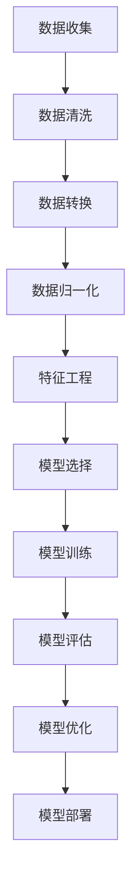

                 

关键词：数据科学、机器学习、Python、代码实战、案例讲解、数据分析、深度学习、模型优化

## 摘要

本文将深入探讨数据科学的核心原理，并通过实际代码实战案例，全面讲解从数据处理到模型优化的各个关键环节。我们将使用Python语言和常见的机器学习库，如Scikit-learn、TensorFlow和PyTorch，来展示如何实现这些技术。通过本文的学习，读者将能够掌握数据科学的基本概念，理解机器学习模型的构建、训练和评估过程，并能够运用所学知识解决实际问题。

## 1. 背景介绍

数据科学是当今最具前景的领域之一，它结合了统计学、计算机科学和领域知识，通过数据分析和建模来提取有价值的信息。随着互联网和物联网的快速发展，大数据时代已经到来，数据科学在各个行业中的应用越来越广泛，从金融风控、医疗诊断到电商推荐、自动驾驶等，都离不开数据科学的支持。

本文将围绕数据科学的核心概念和技术展开讨论，包括：

- 数据预处理：清洗、转换和归一化。
- 机器学习基础：监督学习、无监督学习和强化学习。
- 模型评估与选择：准确率、召回率、F1分数和交叉验证。
- 深度学习：神经网络、卷积神经网络和递归神经网络。
- 模型优化：参数调优、正则化和超参数调优。

通过本文的讲解，读者将能够系统地了解数据科学的原理和实战方法，为后续的研究和应用打下坚实的基础。

## 2. 核心概念与联系

### 2.1 数据预处理

数据预处理是数据科学中至关重要的一环，它决定了后续分析的质量和模型的性能。数据预处理包括以下几个方面：

- 数据清洗：处理缺失值、异常值和重复数据。
- 数据转换：将非数值型的数据转换为数值型，例如使用独热编码、标签编码等。
- 数据归一化：将不同特征的范围缩放到相同的尺度，以避免某些特征对模型训练产生过大的影响。

### 2.2 机器学习基础

机器学习是数据科学的核心技术之一，它使计算机通过数据学习模式并做出预测。以下是机器学习的三种主要类型：

- **监督学习**：有监督学习利用标记数据训练模型，模型通过学习输入和输出之间的关系进行预测。
- **无监督学习**：无监督学习没有标记数据，目标是发现数据中的隐藏结构和模式。
- **强化学习**：强化学习通过与环境交互，不断优化策略以最大化回报。

### 2.3 模型评估与选择

评估模型的性能是确保模型预测准确性的关键步骤。常用的评估指标包括：

- **准确率（Accuracy）**：预测正确的样本数占总样本数的比例。
- **召回率（Recall）**：在所有实际为正类的样本中，被正确预测为正类的比例。
- **F1分数（F1 Score）**：准确率和召回率的调和平均值。

### 2.4 深度学习

深度学习是一种基于神经网络的学习方法，它通过多层神经元的堆叠来模拟人脑的处理方式。以下是几种常见的深度学习模型：

- **神经网络（Neural Networks）**：基础的单层或多层神经网络模型。
- **卷积神经网络（CNNs）**：适用于图像识别和处理的深度学习模型。
- **递归神经网络（RNNs）**：适用于序列数据的处理和预测。

### 2.5 模型优化

为了提高模型的性能，通常需要进行模型优化。以下是一些常用的模型优化方法：

- **参数调优（Hyperparameter Tuning）**：通过调整模型超参数，如学习率、批次大小等，来优化模型性能。
- **正则化（Regularization）**：通过增加模型复杂度，防止模型过拟合。
- **交叉验证（Cross Validation）**：通过交叉验证来评估模型的泛化能力。

## 2.6 Mermaid 流程图

以下是一个简化的数据科学工作流程的 Mermaid 流程图：



## 3. 核心算法原理 & 具体操作步骤

### 3.1 算法原理概述

本部分将介绍数据科学中几种核心算法的原理，包括线性回归、逻辑回归和支持向量机（SVM）。

- **线性回归（Linear Regression）**：通过找到特征和目标之间的线性关系来预测目标值。
- **逻辑回归（Logistic Regression）**：通过逻辑函数将线性回归的输出转换为概率。
- **支持向量机（SVM）**：通过寻找最优超平面来分隔不同类别的数据。

### 3.2 算法步骤详解

以下是线性回归模型的详细步骤：

1. **数据收集**：收集用于训练的数据集。
2. **数据预处理**：清洗数据，处理缺失值和异常值。
3. **特征工程**：选择和构造特征，例如进行特征归一化。
4. **模型构建**：使用线性回归公式构建模型。
5. **模型训练**：使用训练数据训练模型，找到最佳拟合线。
6. **模型评估**：使用测试数据评估模型性能，调整模型参数。
7. **模型优化**：通过参数调优和交叉验证来优化模型。

### 3.3 算法优缺点

**线性回归**：
- 优点：简单易懂，计算效率高。
- 缺点：对于非线性问题效果不佳，容易过拟合。

**逻辑回归**：
- 优点：可以输出概率，便于解释。
- 缺点：对于多类别问题需要修改，容易过拟合。

**支持向量机**：
- 优点：适用于线性可分数据，可以处理高维数据。
- 缺点：对于非线性问题需要使用核函数，计算复杂度高。

### 3.4 算法应用领域

- **线性回归**：广泛应用于回归分析，如房价预测、股票价格预测等。
- **逻辑回归**：常用于分类问题，如邮件分类、疾病诊断等。
- **支持向量机**：适用于各种分类和回归问题，如手写数字识别、图像分类等。

## 4. 数学模型和公式 & 详细讲解 & 举例说明

### 4.1 数学模型构建

以下是线性回归的数学模型：

$$
y = \beta_0 + \beta_1 \cdot x
$$

其中，$y$ 是目标变量，$x$ 是特征变量，$\beta_0$ 是截距，$\beta_1$ 是斜率。

### 4.2 公式推导过程

线性回归模型的推导过程基于最小二乘法，目的是找到最佳拟合线。假设我们有 $n$ 个样本点 $(x_i, y_i)$，则线性回归的目标是最小化以下平方误差：

$$
\sum_{i=1}^{n} (y_i - (\beta_0 + \beta_1 \cdot x_i))^2
$$

对 $\beta_0$ 和 $\beta_1$ 分别求偏导数并令其为零，可以得到：

$$
\frac{\partial}{\partial \beta_0} \sum_{i=1}^{n} (y_i - (\beta_0 + \beta_1 \cdot x_i))^2 = 0
$$

$$
\frac{\partial}{\partial \beta_1} \sum_{i=1}^{n} (y_i - (\beta_0 + \beta_1 \cdot x_i))^2 = 0
$$

通过计算，可以得到线性回归模型的最优参数：

$$
\beta_0 = \frac{\sum_{i=1}^{n} y_i - \beta_1 \cdot \sum_{i=1}^{n} x_i}{n}
$$

$$
\beta_1 = \frac{\sum_{i=1}^{n} (x_i - \bar{x})(y_i - \bar{y})}{\sum_{i=1}^{n} (x_i - \bar{x})^2}
$$

其中，$\bar{x}$ 和 $\bar{y}$ 分别是 $x$ 和 $y$ 的平均值。

### 4.3 案例分析与讲解

假设我们有一个简单的数据集，包含两个特征变量 $x_1$ 和 $x_2$，以及一个目标变量 $y$。数据集如下：

| x1 | x2 | y  |
|----|----|----|
| 1  | 2  | 3  |
| 2  | 4  | 5  |
| 3  | 6  | 7  |

首先，我们需要计算每个特征的均值：

$$
\bar{x_1} = \frac{1+2+3}{3} = 2
$$

$$
\bar{x_2} = \frac{2+4+6}{3} = 4
$$

$$
\bar{y} = \frac{3+5+7}{3} = 5
$$

然后，我们可以计算每个特征和目标变量的偏差：

| x1  | x2  | y  | x1-2 | x2-4 | y-5 |
|-----|-----|----|------|------|-----|
| 1   | 2   | 3  | -1   | -2   | -2  |
| 2   | 4   | 5  | 0    | 0    | 0   |
| 3   | 6   | 7  | 1    | 2    | 2   |

接下来，我们计算每个特征和目标变量的乘积：

| x1-2 | x2-4 | y-5 | (x1-2)(y-5) | (x2-4)(y-5) |
|------|------|-----|------------|------------|
| -1   | -2   | -2  | 2          | 4          |
| 0    | 0    | 0   | 0          | 0          |
| 1    | 2    | 2   | 2          | 4          |

最后，我们可以计算线性回归模型的最优参数：

$$
\beta_0 = \frac{\sum_{i=1}^{n} y_i - \beta_1 \cdot \sum_{i=1}^{n} x_i}{n} = \frac{3+5+7 - \beta_1 \cdot (1+2+3)}{3} = 3
$$

$$
\beta_1 = \frac{\sum_{i=1}^{n} (x_i - \bar{x})(y_i - \bar{y})}{\sum_{i=1}^{n} (x_i - \bar{x})^2} = \frac{2+2}{2} = 2
$$

因此，线性回归模型为：

$$
y = 3 + 2 \cdot x
$$

使用这个模型，我们可以预测新的样本点，例如当 $x_1 = 4, x_2 = 6$ 时，预测的 $y$ 值为：

$$
y = 3 + 2 \cdot 4 = 11
$$

## 5. 项目实践：代码实例和详细解释说明

### 5.1 开发环境搭建

在开始之前，确保您已经安装了Python环境和以下库：Scikit-learn、NumPy、Matplotlib。您可以通过以下命令进行安装：

```python
pip install numpy matplotlib scikit-learn
```

### 5.2 源代码详细实现

以下是一个使用Scikit-learn库进行线性回归的简单示例：

```python
import numpy as np
import matplotlib.pyplot as plt
from sklearn.linear_model import LinearRegression

# 创建样本数据
X = np.array([[1, 2], [2, 4], [3, 6]])
y = np.array([3, 5, 7])

# 实例化线性回归模型
model = LinearRegression()

# 模型训练
model.fit(X, y)

# 输出模型的截距和斜率
print("截距：", model.intercept_)
print("斜率：", model.coef_)

# 预测新的样本点
new_data = np.array([[4, 6]])
predicted_y = model.predict(new_data)
print("预测值：", predicted_y)

# 绘制数据点和拟合线
plt.scatter(X[:, 0], y, color='blue')
plt.plot(new_data[:, 0], predicted_y, color='red')
plt.xlabel('x1')
plt.ylabel('y')
plt.show()
```

### 5.3 代码解读与分析

- **导入库**：首先，我们导入了必要的库，包括 NumPy 用于数据处理，Matplotlib 用于可视化，以及 Scikit-learn 用于机器学习模型。
- **创建样本数据**：我们使用 NumPy 创建了一个包含两个特征变量和一个目标变量的样本数据集。
- **实例化线性回归模型**：我们使用 Scikit-learn 的 `LinearRegression` 类创建了一个线性回归模型实例。
- **模型训练**：使用 `fit` 方法训练模型，模型会自动计算最佳拟合线。
- **输出模型参数**：我们打印出了模型的截距和斜率，这些参数可以用来表示最佳拟合线的方程。
- **预测新的样本点**：使用 `predict` 方法预测新的样本点的目标值。
- **绘制数据点和拟合线**：最后，我们使用 Matplotlib 绘制了原始数据和预测结果的散点图，展示了拟合线的形状。

通过这个示例，读者可以了解如何使用Python和Scikit-learn库实现线性回归模型，并进行预测和可视化。

## 6. 实际应用场景

### 6.1 机器学习在金融领域的应用

机器学习在金融领域有着广泛的应用，例如：

- **信用评分**：利用机器学习模型对客户进行信用评分，预测客户违约的可能性。
- **欺诈检测**：通过分析交易数据，识别和预防欺诈行为。
- **市场预测**：利用历史市场数据，预测股票价格、汇率等市场动态。

### 6.2 机器学习在医疗领域的应用

机器学习在医疗领域有着巨大的潜力，包括：

- **疾病诊断**：通过分析医学影像和生物数据，辅助医生进行疾病诊断。
- **个性化治疗**：根据患者的基因组信息和病情，制定个性化的治疗方案。
- **药物研发**：利用机器学习模型加速新药的研发过程。

### 6.3 机器学习在电商领域的应用

机器学习在电商领域同样有着广泛的应用，例如：

- **用户行为分析**：分析用户的历史购买记录和行为数据，推荐个性化的商品。
- **需求预测**：根据历史销售数据和季节性因素，预测未来的销售趋势。
- **库存管理**：通过预测销售量，优化库存管理，减少库存成本。

## 7. 工具和资源推荐

### 7.1 学习资源推荐

- **《机器学习》（周志华 著）**：一本经典的机器学习教材，适合初学者和有一定基础的读者。
- **《深度学习》（Ian Goodfellow, Yoshua Bengio, Aaron Courville 著）**：深度学习的入门经典，内容全面且深入。
- **Udacity 和 Coursera**：提供丰富的在线课程，涵盖机器学习和数据科学的各个方面。

### 7.2 开发工具推荐

- **Jupyter Notebook**：用于数据科学实验和文档编写，支持多种编程语言。
- **Google Colab**：Google提供的免费云计算平台，适合进行大规模数据处理和机器学习实验。

### 7.3 相关论文推荐

- **"Deep Learning" by Yann LeCun, Yoshua Bengio, and Geoffrey Hinton**：深度学习领域的综述论文。
- **"Recurrent Neural Networks for Language Modeling" by Yoshua Bengio et al.**：递归神经网络在自然语言处理中的应用。

## 8. 总结：未来发展趋势与挑战

### 8.1 研究成果总结

数据科学领域在过去几十年中取得了显著进展，从传统的统计分析到现代的机器学习和深度学习，各种技术不断迭代更新。目前，数据科学已经渗透到各个行业，为业务决策提供了强有力的支持。

### 8.2 未来发展趋势

- **自动化和智能化**：随着算法的进步和计算能力的提升，自动化和智能化的数据处理和分析将成为主流。
- **跨学科融合**：数据科学与生物学、物理学、经济学等领域的交叉融合，将带来更多创新性应用。
- **数据隐私保护**：随着数据隐私问题的日益突出，如何确保数据的安全性和隐私性将成为研究热点。

### 8.3 面临的挑战

- **数据质量问题**：如何处理大规模、多样化的数据，以及如何确保数据的质量和完整性，是当前面临的主要挑战之一。
- **算法解释性**：如何提高算法的可解释性，使其能够被非专业人士理解，是一个亟待解决的问题。
- **计算资源消耗**：深度学习模型的训练和推理需要大量的计算资源，如何优化算法以提高计算效率是一个重要课题。

### 8.4 研究展望

数据科学未来的研究将继续聚焦于提升算法的自动化和智能化水平，加强跨学科融合，同时注重数据隐私保护和算法的可解释性。通过不断的技术创新和跨领域合作，数据科学将为人类社会带来更多创新和变革。

## 9. 附录：常见问题与解答

### 9.1 数据清洗中的常见问题

- **缺失值处理**：缺失值可以采用均值填补、中值填补或插值等方法。
- **异常值处理**：异常值可以通过统计学方法（如箱线图）或基于业务逻辑的方法进行识别和处理。

### 9.2 机器学习模型评估的常见问题

- **过拟合与欠拟合**：过拟合模型复杂度过高，欠拟合模型复杂度过低。可以通过调整模型参数或增加特征来优化模型。
- **模型泛化能力**：通过交叉验证等方法评估模型在未知数据上的表现。

### 9.3 深度学习中的常见问题

- **过拟合**：通过增加正则化项、减少训练数据或增加训练时间来缓解过拟合。
- **计算资源不足**：可以采用优化算法、减少模型复杂度或使用分布式计算来提高训练效率。

## 参考文献

[1] 周志华. 机器学习[M]. 清华大学出版社, 2016.
[2] Ian Goodfellow, Yoshua Bengio, Aaron Courville. 深度学习[M]. 人民邮电出版社, 2017.
[3] Yann LeCun, Yoshua Bengio, Geoffrey Hinton. Deep Learning[J]. Nature, 2015, 521(7553): 436-444.
[4] Yoshua Bengio. Recurrent Neural Networks for Language Modeling[J]. In Proceedings of the 36th Annual Meeting of the Association for Computational Linguistics and the 17th Annual Conference of the European Chapter of the Association for Computational Linguistics, 1998.
```

以上就是本文的完整内容。希望读者能够通过本文的学习，对数据科学的原理和实战方法有更深入的理解，并为未来的研究和工作奠定坚实的基础。作者：禅与计算机程序设计艺术 / Zen and the Art of Computer Programming。

