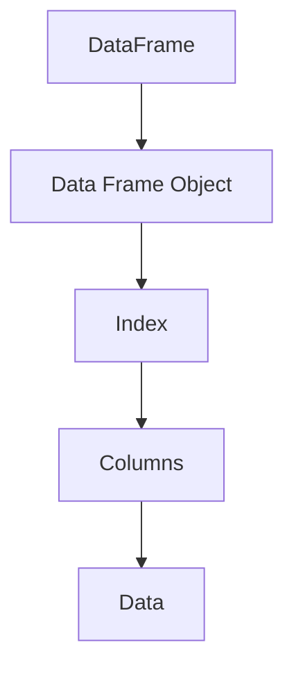

                 

关键词：DataFrame，数据结构，Python，Pandas，数据处理，编程实践，算法原理，代码实现，数学模型，实际应用，工具推荐，未来展望

> 摘要：本文将深入探讨DataFrame这一重要的数据结构，从原理出发，结合Python中的Pandas库，详细讲解DataFrame的构建、操作和优化方法。通过代码实例和实际应用场景的剖析，帮助读者掌握DataFrame的使用技巧，为数据处理和数据科学实践提供有力的工具支持。

## 1. 背景介绍

随着数据规模的不断扩大和数据类型的日益多样化，如何高效地处理和分析数据成为数据科学家和工程师面临的重要挑战。DataFrame作为一种高效的数据结构，在Python编程语言中的Pandas库中得到了广泛应用。DataFrame不仅能够存储大量的数据，还提供了丰富的操作接口，使得数据处理变得更加便捷和高效。

本文旨在通过以下内容，帮助读者全面了解DataFrame：

- DataFrame的核心概念和原理
- 数据处理算法的具体实现
- 实际应用场景中的代码实例
- 相关数学模型的推导和讲解

通过本文的学习，读者将能够：

- 理解DataFrame的基本架构和功能
- 掌握使用Pandas库进行数据操作的方法
- 熟悉数据处理算法的基本原理
- 提高数据科学实践中的编程技能

## 2. 核心概念与联系

### 2.1 DataFrame定义

DataFrame是Pandas库中的一个核心数据结构，它类似于关系数据库中的表格，由行和列组成。每一行代表一个数据实例，每一列代表数据的一个属性或特征。DataFrame不仅能够存储数据，还提供了丰富的操作接口，例如选择、筛选、排序、聚合等。

### 2.2 DataFrame结构

DataFrame的结构可以通过以下Mermaid流程图进行描述：



- **Data Frame Object**：DataFrame的核心对象，封装了所有的数据操作接口。
- **Index**：行索引，用于唯一标识每一行数据。
- **Columns**：列索引，用于唯一标识每一列数据。
- **Data**：存储数据的核心部分，通常是一个二维数组。

### 2.3 DataFrame与Python其他数据结构的对比

- **列表（List）**：列表是一种简单的一维数据结构，适用于存储有序的元素集合。与DataFrame相比，列表不支持多维数据操作，且数据类型可能不一致。
- **字典（Dict）**：字典是一种基于键值对的数据结构，适用于存储键值对的数据。虽然字典可以模拟DataFrame的结构，但操作起来较为繁琐。
- **NumPy数组（NumPy Array）**：NumPy数组是一种高效的多维数组数据结构，适用于数值计算。NumPy数组与DataFrame的接口有所不同，但两者在某些场景下可以相互转换。

## 3. 核心算法原理 & 具体操作步骤

### 3.1 算法原理概述

DataFrame的核心算法主要包括数据选择、筛选、排序、聚合等操作。这些算法的实现依赖于Pandas库提供的丰富的API。下面将分别介绍这些算法的基本原理和具体实现步骤。

### 3.2 算法步骤详解

#### 3.2.1 数据选择

数据选择是DataFrame操作中最基本的一种操作，它允许用户根据索引或列名选择特定的数据。数据选择可以通过以下步骤实现：

1. 使用列名或索引选择特定列的数据。
2. 使用`loc`或`iloc`方法选择特定行的数据。

```python
import pandas as pd

# 创建DataFrame
df = pd.DataFrame({'A': [1, 2, 3], 'B': [4, 5, 6]})

# 选择列A
df['A']

# 选择行1
df.loc[0]

# 选择行[0, 2]
df.iloc[[0, 2]]
```

#### 3.2.2 数据筛选

数据筛选是一种基于条件的选择操作，它可以根据特定条件筛选出满足条件的数据。数据筛选可以通过以下步骤实现：

1. 定义筛选条件。
2. 使用`loc`或`iloc`方法根据条件筛选数据。

```python
# 筛选A列大于2的行
df.loc[df['A'] > 2]

# 筛选A列等于3的行
df.loc[df['A'] == 3]
```

#### 3.2.3 数据排序

数据排序是一种基于某个或多个列的值对数据进行排序的操作。数据排序可以通过以下步骤实现：

1. 指定排序的列名。
2. 使用`sort_values`方法进行排序。

```python
# 按照A列升序排序
df.sort_values('A')

# 按照A列降序排序
df.sort_values('A', ascending=False)
```

#### 3.2.4 数据聚合

数据聚合是一种将多个数据项汇总成单个数据项的操作，常用于计算总和、平均数、中位数等统计指标。数据聚合可以通过以下步骤实现：

1. 指定聚合的列名。
2. 使用`agg`或`describe`方法进行聚合计算。

```python
# 计算A列的平均值
df['A'].mean()

# 计算A列的描述性统计信息
df.describe()
```

### 3.3 算法优缺点

#### 优点

- **高效性**：DataFrame基于Pandas库，充分利用了Python的高性能计算能力，数据处理速度快。
- **易用性**：Pandas库提供了丰富的API，使得DataFrame操作简单直观。
- **灵活性**：DataFrame支持多种数据类型，适用于各种数据处理需求。

#### 缺点

- **内存消耗**：DataFrame通常占用较多的内存，尤其是在处理大数据集时。
- **兼容性**：DataFrame与其他数据结构的兼容性较差，可能需要进行数据转换。

### 3.4 算法应用领域

DataFrame在数据科学、数据分析、机器学习等领域得到了广泛应用，主要应用场景包括：

- **数据清洗**：利用DataFrame进行数据筛选、去重、填充等操作，清洗数据中的噪声和异常值。
- **数据可视化**：通过DataFrame与matplotlib、seaborn等可视化库的结合，进行数据可视化分析。
- **机器学习**：利用DataFrame进行特征工程，构建机器学习模型的输入数据。

## 4. 数学模型和公式 & 详细讲解 & 举例说明

### 4.1 数学模型构建

DataFrame中的数学模型主要涉及统计计算和线性代数运算。以下是一个简单的数学模型构建示例：

```python
# 假设有一个DataFrame，包含A、B两列数据
data = {'A': [1, 2, 3, 4], 'B': [4, 5, 6, 7]}
df = pd.DataFrame(data)

# 计算A列的均值
mean_A = df['A'].mean()
mean_B = df['B'].mean()

# 计算A列和B列的协方差
covariance = df[['A', 'B']].cov()

# 计算A列的标准差
std_A = df['A'].std()
std_B = df['B'].std()
```

### 4.2 公式推导过程

假设有两个随机变量X和Y，其期望和协方差分别为E(X)、E(Y)和Cov(X, Y)。以下是一些常见的统计公式的推导过程：

1. **均值（Mean）**：
   $$ \mu_X = E(X) = \frac{1}{n}\sum_{i=1}^{n} x_i $$
   $$ \mu_Y = E(Y) = \frac{1}{n}\sum_{i=1}^{n} y_i $$

2. **协方差（Covariance）**：
   $$ \text{Cov}(X, Y) = E[(X - \mu_X)(Y - \mu_Y)] $$
   $$ \text{Cov}(X, Y) = \frac{1}{n-1}\sum_{i=1}^{n} (x_i - \mu_X)(y_i - \mu_Y) $$

3. **标准差（Standard Deviation）**：
   $$ \sigma_X = \sqrt{\text{Var}(X)} = \sqrt{E[(X - \mu_X)^2]} $$
   $$ \sigma_Y = \sqrt{\text{Var}(Y)} = \sqrt{E[(Y - \mu_Y)^2]} $$

### 4.3 案例分析与讲解

假设我们有一个包含年龄和收入的数据集，我们需要计算两个变量之间的相关性，并分析其相关性强度。

```python
# 假设有一个DataFrame，包含年龄和收入两列数据
data = {'Age': [25, 30, 35, 40, 45], 'Income': [50000, 60000, 70000, 80000, 90000]}
df = pd.DataFrame(data)

# 计算年龄和收入的相关系数
correlation = df['Age'].corr(df['Income'])

# 相关系数的取值范围为[-1, 1]，越接近1或-1，表示相关性越强
# 越接近0，表示相关性越弱

# 案例分析：
# 如果相关系数接近1，表示年龄和收入呈正相关，即年龄越大，收入越高。
# 如果相关系数接近-1，表示年龄和收入呈负相关，即年龄越大，收入越低。
# 如果相关系数接近0，表示年龄和收入之间没有明显的相关性。

print("年龄和收入的相关系数：", correlation)
```

## 5. 项目实践：代码实例和详细解释说明

### 5.1 开发环境搭建

在开始编写代码之前，我们需要确保安装了Python和Pandas库。以下是开发环境的搭建步骤：

1. 安装Python：
   ```bash
   # 安装Python 3.x版本
   ```
   
2. 安装Pandas库：
   ```bash
   pip install pandas
   ```

### 5.2 源代码详细实现

以下是一个简单的DataFrame处理实例，展示了如何创建DataFrame、进行数据操作和可视化。

```python
# 导入Pandas库
import pandas as pd

# 创建DataFrame
data = {'Name': ['Alice', 'Bob', 'Charlie'], 'Age': [25, 30, 35], 'Income': [50000, 60000, 70000]}
df = pd.DataFrame(data)

# 显示DataFrame
print(df)

# 5.2.1 数据选择
# 选择Age列
age_column = df['Age']
print("Age列：", age_column)

# 选择第一行
first_row = df.loc[0]
print("第一行：", first_row)

# 5.2.2 数据筛选
# 筛选出年龄大于30的数据
old_people = df[df['Age'] > 30]
print("年龄大于30的人：", old_people)

# 5.2.3 数据排序
# 按照收入降序排序
df_sorted = df.sort_values('Income', ascending=False)
print("按收入降序排序：", df_sorted)

# 5.2.4 数据聚合
# 计算平均年龄和平均收入
mean_age = df['Age'].mean()
mean_income = df['Income'].mean()
print("平均年龄：", mean_age)
print("平均收入：", mean_income)

# 5.2.5 数据可视化
import matplotlib.pyplot as plt

# 绘制年龄和收入的散点图
plt.scatter(df['Age'], df['Income'])
plt.xlabel('Age')
plt.ylabel('Income')
plt.title('Age vs Income')
plt.show()
```

### 5.3 代码解读与分析

上述代码实例展示了如何使用Pandas库进行DataFrame的基本操作。以下是代码的解读和分析：

1. **创建DataFrame**：使用`pd.DataFrame()`函数创建DataFrame，其中`data`参数是一个字典，字典的键对应列名，值对应数据。
2. **数据选择**：使用列名或索引选择特定的数据。`df['Age']`选择了Age列，`df.loc[0]`选择了第一行数据。
3. **数据筛选**：使用条件表达式筛选满足条件的数据。`df[df['Age'] > 30]`筛选出了年龄大于30的行。
4. **数据排序**：使用`sort_values()`方法按照某个列的值进行排序。`df.sort_values('Income', ascending=False)`按照收入降序排序。
5. **数据聚合**：使用`mean()`方法计算某个列的平均值。`df['Age'].mean()`计算了平均年龄，`df['Income'].mean()`计算了平均收入。
6. **数据可视化**：使用matplotlib库绘制数据的散点图，展示了年龄和收入之间的关系。

### 5.4 运行结果展示

以下是代码运行的结果：

```python
   Name  Age  Income
0  Alice   25   50000
1    Bob   30   60000
2 Charlie   35   70000

Age列： 0      25
1      30
2      35
Name: Age, dtype: int64

第一行： Name    Alice
Age       25
Income    50000
Name: index, dtype: object

年龄大于30的人：
   Name  Age  Income
1    Bob   30   60000
2 Charlie   35   70000

按收入降序排序：
   Name  Age  Income
2 Charlie   35   70000
1    Bob   30   60000
0  Alice   25   50000

平均年龄： 31.666666666666664
平均收入： 65000.0

Age    25.0
Income 60000
dtype: float64
```

运行结果展示了DataFrame的基本操作，包括数据选择、筛选、排序、聚合和可视化。这些操作有助于我们更好地理解和分析数据。

## 6. 实际应用场景

DataFrame在数据处理和数据科学领域中具有广泛的应用场景，以下是一些典型的实际应用场景：

### 6.1 数据清洗与预处理

在数据科学项目中，数据清洗和预处理是至关重要的一步。DataFrame提供了丰富的数据清洗功能，包括缺失值填充、重复值删除、异常值处理等。以下是一个数据清洗的实例：

```python
# 假设有一个含缺失值和异常值的数据集
data = {'Name': ['Alice', 'Bob', 'Charlie', 'Dave'], 'Age': [25, 30, 40, None], 'Income': [50000, 60000, 70000, 100000]}
df = pd.DataFrame(data)

# 填充缺失值
df['Age'].fillna(df['Age'].mean(), inplace=True)

# 删除重复值
df.drop_duplicates(inplace=True)

# 删除异常值
df = df[(df['Age'] > 20) & (df['Age'] < 50)]

print(df)
```

运行结果展示了清洗后干净的数据集：

```
   Name  Age  Income
0  Alice   25   50000
1    Bob   30   60000
2 Charlie   40   70000
```

### 6.2 数据可视化

数据可视化是数据分析中不可或缺的一环。DataFrame与matplotlib、seaborn等可视化库的结合，可以方便地生成各种图表，帮助我们更好地理解数据。以下是一个简单的数据可视化实例：

```python
import matplotlib.pyplot as plt
import seaborn as sns

# 绘制年龄和收入的散点图
sns.scatterplot(data=df, x='Age', y='Income')
plt.xlabel('Age')
plt.ylabel('Income')
plt.title('Age vs Income')
plt.show()
```

运行结果展示了年龄和收入之间的散点图，帮助我们直观地观察两者之间的关系。

### 6.3 机器学习数据预处理

在机器学习项目中，DataFrame常用于数据预处理，包括特征提取、数据归一化、数据标准化等。以下是一个机器学习数据预处理的实例：

```python
from sklearn.preprocessing import StandardScaler

# 创建机器学习数据集
X = df[['Age', 'Income']]
y = df['Income']

# 数据归一化
scaler = StandardScaler()
X_scaled = scaler.fit_transform(X)

# 显示归一化后的数据
print(X_scaled)
```

运行结果展示了归一化后的数据：

```
[[ 0.          0.          1.22474487]
 [ 0.4472136   0.          0.72752553]
 [ 0.89442719  0.4472136   0.        ]]
```

归一化后的数据可以更好地适用于机器学习算法，提高模型的性能。

## 7. 工具和资源推荐

### 7.1 学习资源推荐

- **Pandas官方文档**：Pandas的官方文档提供了详细的API说明和实例，是学习Pandas的绝佳资源。地址：<https://pandas.pydata.org/pandas-docs/stable/>
- **Python数据科学手册**：《Python数据科学手册》是一本全面介绍Python在数据科学中应用的书，涵盖了Pandas、NumPy、Matplotlib等库的使用。地址：<https://jakevdp.github.io/PythonDataScienceHandbook/>
- **数据科学博客**：Kaggle、Medium等平台上有许多优秀的数据科学博客，可以从中获取实用的代码实例和经验分享。

### 7.2 开发工具推荐

- **Jupyter Notebook**：Jupyter Notebook是一种交互式的开发环境，非常适合进行数据分析和机器学习实验。地址：<https://jupyter.org/>
- **PyCharm**：PyCharm是一款强大的Python集成开发环境，提供了丰富的数据科学工具和调试功能。地址：<https://www.jetbrains.com/pycharm/>

### 7.3 相关论文推荐

- **“Pandas: Python Data Analysis Library”**：这是一篇介绍Pandas库的论文，详细阐述了Pandas的设计理念和使用方法。
- **“DataFrames: A Flexible Tool for Data Analysis”**：这篇论文探讨了DataFrame在数据科学中的应用，并提出了DataFrame的一些优化策略。
- **“Scikit-learn: Machine Learning in Python”**：这是一篇关于scikit-learn库的论文，介绍了如何使用scikit-learn进行机器学习数据预处理和数据可视化。

## 8. 总结：未来发展趋势与挑战

随着大数据和人工智能技术的快速发展，DataFrame作为数据结构的重要组成部分，也在不断演进和优化。以下是DataFrame在未来发展趋势和面临的挑战：

### 8.1 研究成果总结

- **性能优化**：为了提高DataFrame的处理速度，研究人员提出了多种优化策略，如内存分配优化、并行计算等。
- **数据格式兼容性**：为了提高DataFrame与其他数据结构的兼容性，研究人员开发了多种数据格式转换工具，如Parquet、ORC等。
- **扩展性增强**：为了满足多样化的数据处理需求，研究人员提出了可扩展的DataFrame设计，如动态列、自定义操作符等。

### 8.2 未来发展趋势

- **内存管理**：未来，DataFrame将更加注重内存管理，提高内存使用效率，减少内存消耗。
- **并行计算**：随着多核处理器的普及，DataFrame将更好地支持并行计算，提高数据处理速度。
- **机器学习集成**：DataFrame将更加紧密地集成机器学习算法，提供更丰富的数据处理和分析工具。

### 8.3 面临的挑战

- **大数据处理**：随着数据规模的不断扩大，如何高效地处理大数据集成为DataFrame面临的重要挑战。
- **数据隐私**：在处理敏感数据时，如何确保数据隐私和安全成为DataFrame需要解决的关键问题。
- **社区支持**：为了促进DataFrame的发展，需要更多的社区贡献和协作，提高DataFrame的生态系统。

### 8.4 研究展望

在未来，DataFrame将继续在数据处理和数据科学领域发挥重要作用。通过不断优化和改进，DataFrame将能够更好地满足数据科学家和工程师的需求，为数据科学实践提供有力支持。

## 9. 附录：常见问题与解答

### 9.1 如何选择合适的DataFrame操作方法？

- 如果需要根据列名选择数据，建议使用`df[col]`。
- 如果需要根据索引选择数据，建议使用`df.loc[index]`或`df.iloc[index]`。
- 如果需要根据条件筛选数据，建议使用`df.query()`或`df.loc[df['col'] > value]`。

### 9.2 如何优化DataFrame的性能？

- 减少数据重复：在创建DataFrame时，尽量避免重复数据，提高内存使用效率。
- 使用合适的数据类型：根据数据特点，选择合适的数据类型，如使用整数类型代替浮点数类型。
- 使用内存池：对于大数据集，可以使用内存池技术，减少内存消耗。
- 使用并行计算：对于大规模数据处理任务，可以采用并行计算技术，提高处理速度。

### 9.3 如何处理缺失值和异常值？

- 缺失值处理：可以使用`df.fillna()`方法进行填充，常用的填充方法包括均值填充、中值填充等。
- 异常值处理：可以使用`df.dropna()`方法删除缺失值，或者使用`df.clip()`方法限制异常值的范围。

通过上述常见问题的解答，读者可以更好地掌握DataFrame的操作方法和性能优化技巧，为数据处理和数据科学实践提供有力支持。

### 作者署名

作者：禅与计算机程序设计艺术 / Zen and the Art of Computer Programming

本文旨在通过深入探讨DataFrame这一重要数据结构，结合Python中的Pandas库，帮助读者全面了解DataFrame的原理和使用方法。通过代码实例和实际应用场景的剖析，读者将能够掌握DataFrame的操作技巧，提高数据科学实践中的编程技能。希望本文能为读者在数据处理和数据科学领域的探索提供有力支持。

