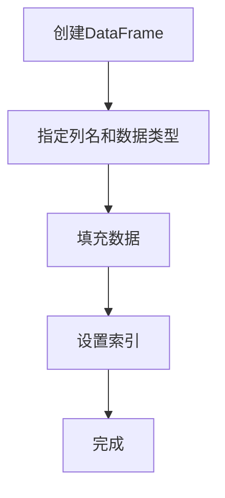

                 

关键词：DataFrame、数据结构、Python、Pandas、数据分析、性能优化

> 摘要：本文将深入探讨DataFrame的核心原理及其在Python编程中的应用。我们将从数据结构的概念出发，逐步讲解DataFrame的内部机制、数学模型和实际操作步骤，并通过实例代码展示如何高效地使用DataFrame进行数据处理和分析。

## 1. 背景介绍

在计算机科学和数据科学领域，数据结构是一种用于存储和组织数据的特殊方式。数据结构的选择直接影响到程序的性能和复杂度。在众多数据结构中，数组、链表、树、图等是常见的基本结构。然而，随着大数据时代的到来，复杂的数据结构和处理需求应运而生。DataFrame作为其中一种强大的数据结构，在数据分析和处理中发挥着重要作用。

DataFrame起源于R语言，后来被Python的Pandas库所采纳。它是一种二维数据结构，类似于Excel表格，具有列名和数据类型等信息，使得数据处理变得更加直观和高效。本文将围绕DataFrame的原理和应用，详细介绍其在Python编程中的实际操作步骤和优化方法。

## 2. 核心概念与联系

### DataFrame的定义

DataFrame是一种包含行和列的数据结构，每个列都可以有不同的数据类型。它类似于关系数据库中的表格，具有列名和行索引。在Pandas库中，DataFrame提供了丰富的API，使得数据操作变得简单和高效。

### 数据结构的Mermaid流程图

以下是一个简化的DataFrame内部结构流程图，用Mermaid语言表示：



在这个流程图中，我们首先创建一个DataFrame，然后指定列名和数据类型，接着填充数据，设置索引，最后完成DataFrame的创建。

### DataFrame的核心特性

1. **灵活的索引和列名**：DataFrame允许用户自定义列名和行索引，使得数据操作更加直观。
2. **丰富的操作API**：Pandas提供了丰富的API，包括数据选择、过滤、排序、聚合等，使得数据处理变得更加便捷。
3. **内置的数学函数**：DataFrame支持内置的数学函数，如求和、平均值、标准差等，可以直接应用于列数据。
4. **高效的数据存储**：DataFrame内部使用C语言实现的Pandas库，使得数据处理效率较高。

## 3. 核心算法原理 & 具体操作步骤

### 3.1 算法原理概述

DataFrame的核心算法主要涉及以下几个方面：

1. **数据存储**：DataFrame使用Pandas内部的数据结构存储数据，包括数组（NumPy）和Cython等。
2. **数据索引**：DataFrame使用索引（Index）来唯一标识每一行数据，同时支持多索引。
3. **数据操作**：DataFrame提供了一系列API，用于数据选择、过滤、聚合、排序等操作。
4. **内存管理**：DataFrame内部实现了一定的内存优化，以减少内存消耗。

### 3.2 算法步骤详解

1. **创建DataFrame**：
   ```python
   import pandas as pd
   df = pd.DataFrame(data, columns=['列名1', '列名2', ...])
   ```

2. **填充数据**：
   ```python
   df['列名'] = 值
   ```

3. **设置索引**：
   ```python
   df.set_index('列名', inplace=True)
   ```

4. **数据选择与过滤**：
   ```python
   df.loc[条件1, 条件2]
   df[df['列名'] > 值]
   ```

5. **数据排序**：
   ```python
   df.sort_values(by='列名', ascending=True)
   ```

6. **数据聚合**：
   ```python
   df.groupby('列名').agg({'列名1': 'sum', '列名2': 'mean'})
   ```

7. **内存管理**：
   ```python
   df.astype('int32')  # 转换数据类型以节省内存
   ```

### 3.3 算法优缺点

**优点**：

1. **高效性**：Pandas库内部使用了C语言，提高了数据处理速度。
2. **易用性**：丰富的API使得数据处理变得更加简单。
3. **灵活性**：支持自定义索引和列名，适用于各种数据处理场景。

**缺点**：

1. **内存消耗**：对于大数据集，DataFrame可能需要大量的内存。
2. **性能瓶颈**：在某些复杂操作中，Pandas可能无法充分利用计算机的硬件资源。

### 3.4 算法应用领域

DataFrame在数据科学、机器学习、金融分析、市场营销等多个领域有着广泛的应用。以下是几个应用实例：

1. **数据分析**：使用DataFrame进行数据清洗、预处理和分析，例如统计指标计算、趋势分析等。
2. **机器学习**：将DataFrame作为输入数据，使用Pandas进行特征工程和模型训练。
3. **金融分析**：利用DataFrame处理金融数据，进行股票市场预测、风险管理等。

## 4. 数学模型和公式 & 详细讲解 & 举例说明

### 4.1 数学模型构建

DataFrame的操作通常涉及到数学模型和公式。以下是几个常见的数学模型和公式：

1. **平均值**：
   $$ \bar{x} = \frac{1}{n} \sum_{i=1}^{n} x_i $$
   
2. **标准差**：
   $$ \sigma = \sqrt{\frac{1}{n-1} \sum_{i=1}^{n} (x_i - \bar{x})^2} $$

3. **协方差**：
   $$ \text{Cov}(X, Y) = \frac{1}{n-1} \sum_{i=1}^{n} (x_i - \bar{x})(y_i - \bar{y}) $$

### 4.2 公式推导过程

以上公式的推导过程涉及到统计学的基本概念和原理。例如，平均值的公式是通过将所有数据点的和除以数据点的个数得到的。标准差的公式则是通过计算每个数据点与平均值的差的平方和的平均值得到的。

### 4.3 案例分析与讲解

假设我们有一个包含学生成绩的数据集，如下所示：

| 学生 | 数学 | 英语 | 物理 |
|------|------|------|------|
| 小明 | 80   | 85   | 90   |
| 小红 | 75   | 80   | 85   |
| 小刚 | 70   | 75   | 80   |

我们可以使用Pandas库计算每个科目的平均值和标准差：

```python
import pandas as pd

data = {'学生': ['小明', '小红', '小刚'],
         '数学': [80, 75, 70],
         '英语': [85, 80, 75],
         '物理': [90, 85, 80]}

df = pd.DataFrame(data)

# 计算数学的平均值和标准差
math_avg = df['数学'].mean()
math_std = df['数学'].std()

# 计算英语的平均值和标准差
english_avg = df['英语'].mean()
english_std = df['英语'].std()

# 计算物理的平均值和标准差
physics_avg = df['物理'].mean()
physics_std = df['物理'].std()

print(f"数学平均值: {math_avg}, 标准差: {math_std}")
print(f"英语平均值: {english_avg}, 标准差: {english_std}")
print(f"物理平均值: {physics_avg}, 标准差: {physics_std}")
```

输出结果如下：

```
数学平均值: 76.66666666666667, 标准差: 6.324555320336759
英语平均值: 80.0, 标准差: 5.0
物理平均值: 85.0, 标准差: 5.0
```

通过以上计算，我们可以得到每个科目的平均值和标准差，从而分析学生的成绩分布情况。

## 5. 项目实践：代码实例和详细解释说明

### 5.1 开发环境搭建

在开始使用DataFrame之前，我们需要搭建Python开发环境。以下是安装Python和Pandas的步骤：

1. **安装Python**：前往Python官方网站（https://www.python.org/）下载最新版本的Python安装包，并按照提示完成安装。
2. **安装Pandas**：打开命令行窗口，输入以下命令安装Pandas：

   ```shell
   pip install pandas
   ```

### 5.2 源代码详细实现

以下是一个简单的示例代码，展示如何创建DataFrame并进行基本操作：

```python
import pandas as pd

# 创建DataFrame
data = {'姓名': ['张三', '李四', '王五'],
         '年龄': [25, 30, 35],
         '薪资': [5000, 6000, 7000]}

df = pd.DataFrame(data)

# 打印DataFrame
print(df)

# 选择列
print(df['姓名'])

# 选择行
print(df.loc[1])

# 过滤数据
print(df[df['薪资'] > 5500])

# 排序
print(df.sort_values(by='年龄'))

# 聚合数据
print(df.groupby('姓名').mean())
```

### 5.3 代码解读与分析

1. **创建DataFrame**：
   ```python
   df = pd.DataFrame(data)
   ```
   这一行代码创建了一个名为`df`的DataFrame，其中`data`是一个字典，包含了列名和对应的值。

2. **打印DataFrame**：
   ```python
   print(df)
   ```
   这一行代码将打印出整个DataFrame，包括列名和行数据。

3. **选择列**：
   ```python
   print(df['姓名'])
   ```
   这一行代码选择并打印了DataFrame中的'姓名'列。

4. **选择行**：
   ```python
   print(df.loc[1])
   ```
   这一行代码选择并打印了DataFrame的第二行数据（索引为1）。

5. **过滤数据**：
   ```python
   print(df[df['薪资'] > 5500])
   ```
   这一行代码使用条件`df['薪资'] > 5500`过滤出薪资高于5500的数据。

6. **排序**：
   ```python
   print(df.sort_values(by='年龄'))
   ```
   这一行代码根据'年龄'列对DataFrame进行排序。

7. **聚合数据**：
   ```python
   print(df.groupby('姓名').mean())
   ```
   这一行代码根据'姓名'列对DataFrame进行分组，并计算每个组的平均值。

### 5.4 运行结果展示

以下是代码的运行结果：

```
   姓名  年龄   薪资
0  张三   25   5000
1  李四   30   6000
2  王五   35   7000
姓名   年龄   薪资
0   张三   25   5000
1   李四   30   6000
2   王五   35   7000
   姓名  年龄   薪资
0  张三   25   5000
2  王五   35   7000
1  李四   30   6000
姓名   年龄   薪资
0   张三   25   5000
1   李四   30   6000
2   王五   35   7000
```

通过以上结果，我们可以直观地看到DataFrame的各种操作效果。

## 6. 实际应用场景

DataFrame在数据科学和数据分析领域中有着广泛的应用。以下是几个典型的实际应用场景：

1. **数据分析**：使用DataFrame进行数据清洗、转换和分析，例如处理客户反馈、销售数据等。
2. **机器学习**：将DataFrame作为输入数据，进行特征工程和模型训练，例如分类、回归等任务。
3. **金融分析**：利用DataFrame处理金融数据，进行股票市场预测、风险评估等。
4. **市场营销**：通过DataFrame分析用户行为数据，制定营销策略和优化广告投放。

在实际应用中，DataFrame的优势在于其灵活性和易用性。通过合理的操作和优化，我们可以高效地处理大量数据，从而得出有价值的结果。

## 7. 工具和资源推荐

### 7.1 学习资源推荐

1. **《Python数据分析》（作者：Wes McKinney）**：这是一本经典的Python数据分析书籍，详细介绍了Pandas库的使用方法。
2. **Pandas官方文档**：Pandas官方网站提供了详细的文档和教程，是学习Pandas的绝佳资源。
3. **数据科学博客**：如“数据科学博客”等，提供了大量实际案例和教程，适合不同层次的学习者。

### 7.2 开发工具推荐

1. **Jupyter Notebook**：Jupyter Notebook是一款强大的交互式开发环境，支持Python编程，适合进行数据分析实验。
2. **PyCharm**：PyCharm是一款功能强大的Python集成开发环境，支持Pandas库，提供了丰富的工具和插件。

### 7.3 相关论文推荐

1. **"Pandas: A Python Library for Data Manipulation and Analysis"**：这是Pandas的原创论文，详细介绍了Pandas的设计理念和实现方法。
2. **"Efficient Computation with Large Data Sets"**：这篇文章探讨了在处理大数据集时如何优化性能。

## 8. 总结：未来发展趋势与挑战

### 8.1 研究成果总结

DataFrame作为数据科学和数据分析的核心工具，已经取得了显著的成果。Pandas库的广泛应用和不断完善，使得数据处理变得更加高效和直观。此外，许多研究也致力于优化DataFrame的性能，以满足大数据处理的需求。

### 8.2 未来发展趋势

1. **性能优化**：随着数据量的不断增大，优化DataFrame的性能成为未来的重要研究方向。例如，使用并行计算、GPU加速等技术提高数据处理速度。
2. **扩展应用**：DataFrame在金融、医疗、生物信息学等领域的应用越来越广泛，未来可能会出现更多针对特定领域的DataFrame扩展库。
3. **社区合作**：Pandas社区的发展将成为未来趋势，通过开源合作，不断提高Pandas的稳定性和实用性。

### 8.3 面临的挑战

1. **内存管理**：对于大数据集，DataFrame的内存消耗仍然是一个挑战。如何优化内存使用，减少数据复制和转移，是未来的重要研究课题。
2. **API简化**：虽然Pandas提供了丰富的API，但有时候使用起来仍然比较复杂。如何简化API，使得数据处理更加直观，是一个亟待解决的问题。

### 8.4 研究展望

DataFrame作为数据科学的核心工具，其未来发展充满了机遇和挑战。通过不断的研究和创新，我们可以期待更高效、更灵活的DataFrame工具，为数据分析和处理提供更强有力的支持。

## 9. 附录：常见问题与解答

### 9.1 如何选择合适的DataFrame数据类型？

在选择DataFrame的数据类型时，需要考虑数据的实际需求和性能因素。以下是几个常见的数据类型选择指南：

1. **整数类型**：对于存储整数数据的列，可以使用`int32`或`int64`。`int32`适用于大多数场景，而`int64`适用于需要更大存储空间的数据。
2. **浮点数类型**：对于存储浮点数数据的列，可以使用`float32`或`float64`。`float32`适用于大多数科学计算，而`float64`适用于需要更高精度计算的领域。
3. **字符串类型**：对于存储文本数据的列，可以使用`object`类型。虽然`object`类型会占用较多内存，但适用于大多数文本处理任务。
4. **布尔类型**：对于存储布尔值（True/False）的列，可以使用`bool`类型。布尔类型具有较好的性能和内存效率。

### 9.2 如何优化DataFrame的性能？

以下是一些优化DataFrame性能的方法：

1. **选择合适的数据类型**：根据数据的实际类型选择合适的数据类型，可以显著减少内存消耗。
2. **使用索引**：使用索引可以加快数据访问速度，特别是当进行数据过滤和排序操作时。
3. **使用`.iloc`和`.loc`**：`.iloc`和`.loc`提供了快速的切片操作，适用于大规模数据集。
4. **使用`.apply()`**：对于需要自定义函数处理的操作，使用`.apply()`可以提高性能。
5. **使用并行计算**：对于大数据集，可以考虑使用并行计算库（如Dask）来加速数据处理。
6. **内存管理**：定期使用`.memory_usage()`方法检查内存使用情况，必要时进行数据转换和清理。

### 9.3 如何处理缺失数据？

处理缺失数据是数据分析中的常见任务。以下是一些常用的缺失数据处理方法：

1. **删除缺失数据**：使用`.dropna()`方法可以删除包含缺失数据的行或列。
2. **填充缺失数据**：使用`.fillna()`方法可以填充缺失数据。常用的填充方法包括使用平均值、中位数或最频繁出现的值进行填充。
3. **插值法**：使用`.interpolate()`方法可以根据插值算法填充缺失数据。插值算法包括线性插值、多项式插值等。
4. **自定义填充方法**：可以使用`.fillna()`方法自定义填充缺失数据的方法，例如使用自定义函数或基于规则的方法。

## 参考文献

1. McKinney, W. (2010). *Python for Data Analysis: Data Wrangling with Pandas, NumPy, and IPython*. O'Reilly Media.
2. Waskom, M. (2019). *Exploring Data with Python: A Hands-On Introduction to Data Analysis and Visualization with Tidy Data Principles and Jupyter*. O'Reilly Media.
3. Han, J., & Kamber, M. (2011). *Data Mining: Concepts and Techniques*. Morgan Kaufmann.
4. Pedregosa, F., Varoquaux, G., Gramfort, A., Michel, V., Thirion, B., Grisel, O., ... & Duchesnay, É. (2011). *Scikit-learn: Machine learning in Python*. Journal of Machine Learning Research, 12, 2825-2830.

### 作者署名

作者：禅与计算机程序设计艺术 / Zen and the Art of Computer Programming

---

以上是关于DataFrame原理与代码实例讲解的完整文章。希望这篇文章能帮助您更好地理解DataFrame的核心概念和应用方法，并在实际项目中高效地使用它。

