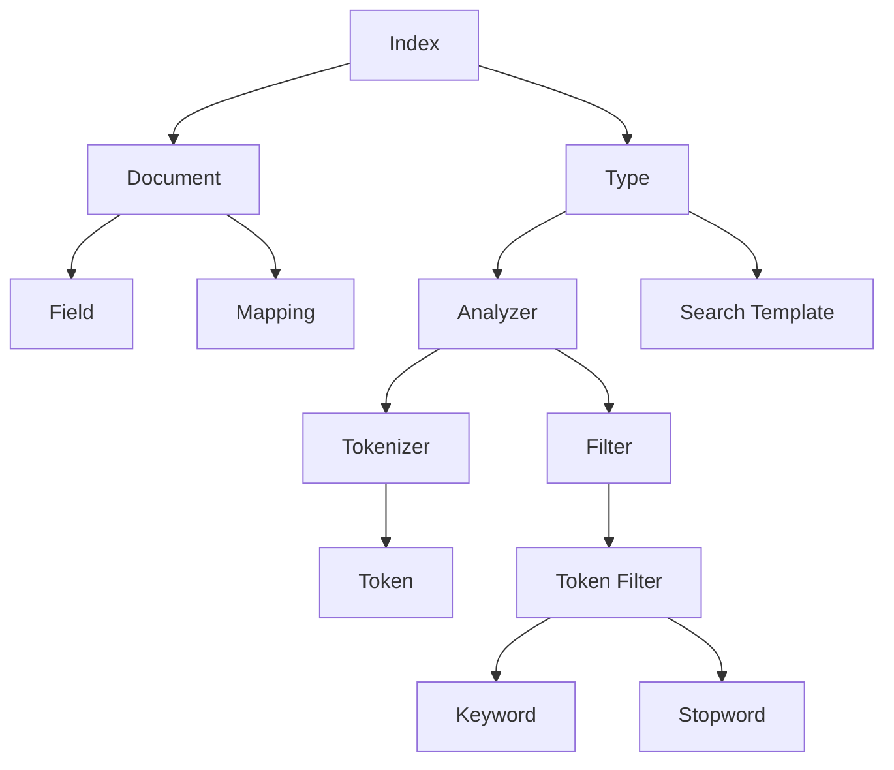

                 

在当今大数据时代，ElasticSearch作为一种强大的开源搜索引擎，被广泛用于各种数据存储和检索场景。其核心功能之一——Index，对于实现高效的全文搜索和数据管理至关重要。本文将深入探讨ElasticSearch Index的原理，并通过代码实例进行详细讲解，帮助读者更好地理解和应用这一关键技术。

## 文章关键词
- ElasticSearch
- Index
- 数据检索
- 全文搜索
- 分布式系统

## 文章摘要
本文将首先介绍ElasticSearch的背景和作用，随后深入解析Index的核心概念及其在ElasticSearch中的作用。接着，我们将通过详细的算法原理和代码实例，逐步展示如何创建、管理和使用Index。最后，本文将对ElasticSearch Index的应用场景进行探讨，并展望其未来的发展趋势和挑战。

## 1. 背景介绍
ElasticSearch是一个基于Lucene构建的开源搜索引擎，旨在实现分布式、高可用性的全文搜索。它拥有强大的数据检索和分析能力，能够处理海量数据，并在秒级内返回搜索结果。ElasticSearch广泛应用于电子商务、社交媒体、日志分析、实时搜索等场景，提供了丰富的API和工具，支持多种编程语言进行集成。

Index在ElasticSearch中扮演着至关重要的角色。它可以被看作是一个存储文档的容器，类似于关系数据库中的表。每个Index可以包含多个类型（Type），而每个类型又包含多个文档（Document）。文档是ElasticSearch中最小的数据单元，通常由一系列的字段（Field）组成。

### 1.1 ElasticSearch的作用
- 全文搜索：快速进行全文检索，支持模糊查询、高亮显示等高级搜索功能。
- 分析处理：对大量数据进行实时分析，如词频统计、词云生成等。
- 集群管理：支持分布式部署，能够横向扩展，提高系统容错性和伸缩性。

### 1.2 Index的作用
- 数据分类：通过Index对数据进行分类存储，便于管理和检索。
- 索引优化：通过建立合适的索引，提高查询效率和响应速度。
- 全文搜索：利用Index进行全文搜索，实现快速、准确的信息检索。

## 2. 核心概念与联系
ElasticSearch的Index功能不仅依赖于ElasticSearch自身的设计，还涉及到分布式存储和检索技术的应用。以下是Index的核心概念及其相互关系，使用Mermaid流程图进行说明：



### 2.1 Index
Index是ElasticSearch中用于存储文档的容器，类似于关系数据库中的表。ElasticSearch默认提供了“_all”这个全局索引，但用户可以根据需要创建自定义索引。

### 2.2 Document
文档是ElasticSearch中的最小数据单元，通常由多个字段（Field）组成。文档可以动态地添加、删除或更新。

### 2.3 Type
类型是Index中的一个分类，用于将具有相似属性的文档分组在一起。在ElasticSearch 7.0版本之后，类型被废弃，所有文档都统一归属于“\_doc”类型。

### 2.4 Field
字段是文档中的属性，用于存储特定的数据。ElasticSearch支持多种数据类型，如文本、数字、日期等。

### 2.5 Mapping
映射是ElasticSearch中对字段进行定义和配置的机制，包括字段类型、索引方式、分析器设置等。

### 2.6 Analyzer
分析器是用于处理文本数据的一系列组件，包括分词器（Tokenizer）和过滤器（Token Filter）。分析器的目的是将原始文本转换为可用于搜索和索引的格式。

### 2.7 Search Template
搜索模板是一种预定义的搜索查询，用于简化复杂的查询逻辑，提高查询效率。

## 3. 核心算法原理 & 具体操作步骤

### 3.1 算法原理概述
ElasticSearch的Index过程主要包括以下几个步骤：

1. 文档提交：客户端将文档发送到ElasticSearch集群。
2. 文档处理：ElasticSearch对文档进行解析，将其分解为字段和值。
3. 字段索引：ElasticSearch根据映射配置对字段进行索引，建立倒排索引。
4. 文档存储：ElasticSearch将处理后的文档存储到底层存储中。

### 3.2 算法步骤详解

#### 3.2.1 文档提交
文档提交是Index过程的开始，客户端通过HTTP请求将文档发送到ElasticSearch集群。请求中包含文档的JSON格式数据。

```json
POST /index_name/_doc
{
  "field1": "value1",
  "field2": "value2"
}
```

#### 3.2.2 文档处理
ElasticSearch接收到文档后，首先进行解析。解析过程包括以下几个步骤：

1. JSON解析：将JSON格式的文档数据转换为Java对象。
2. 字段提取：从Java对象中提取字段和值。
3. 字段分析：根据映射配置对字段进行分析，包括分词和过滤。

#### 3.2.3 字段索引
ElasticSearch根据映射配置对字段进行索引。索引过程主要包括以下几个步骤：

1. 倒排索引构建：对每个字段建立倒排索引，以便快速检索。
2. 索引文档：将处理后的文档存储到索引中。

#### 3.2.4 文档存储
ElasticSearch将处理后的文档存储到底层存储中，通常采用Lucene索引格式。存储过程中，ElasticSearch会进行数据压缩和优化，以提高存储效率和查询性能。

### 3.3 算法优缺点

#### 优点
1. 分布式存储：支持分布式部署，提高系统容错性和伸缩性。
2. 高效检索：采用倒排索引技术，实现快速全文搜索。
3. 动态映射：支持动态映射，简化数据建模过程。

#### 缺点
1. 复杂性：配置和管理相对复杂，需要一定技术基础。
2. 存储占用：由于采用倒排索引，存储空间占用较大。

### 3.4 算法应用领域
ElasticSearch Index广泛应用于以下领域：

1. 搜索引擎：实现高效的全文搜索，支持模糊查询、高亮显示等高级功能。
2. 数据分析：对大量数据进行实时分析，如词频统计、趋势预测等。
3. 日志管理：存储和管理大量日志数据，实现快速检索和实时监控。

## 4. 数学模型和公式 & 详细讲解 & 举例说明

### 4.1 数学模型构建
ElasticSearch的Index过程涉及到一些基础的数学模型，如倒排索引、TF-IDF模型等。以下是对这些模型的简要介绍。

#### 倒排索引
倒排索引是一种用于实现快速全文搜索的索引结构，它将文档中的词（Term）映射到对应的文档列表。数学表示如下：

\[ P(D|T) = \frac{f_T(D) \cdot (1 + \alpha) + 1}{N_t \cdot (1 + \alpha) + f_T(D)} \]

其中，\( P(D|T) \) 表示在给定词\( T \)的情况下，文档\( D \)出现的概率；\( f_T(D) \) 表示词\( T \)在文档\( D \)中的出现次数；\( N_t \) 表示词\( T \)在整个文档集合中出现的次数；\( \alpha \) 是一个调节参数。

#### TF-IDF模型
TF-IDF（Term Frequency-Inverse Document Frequency）模型是一种用于评估词重要性的统计模型。数学表示如下：

\[ TF-IDF(T, D) = f_T(D) \cdot \log \left( \frac{N}{df(T)} \right) \]

其中，\( TF-IDF(T, D) \) 表示词\( T \)在文档\( D \)中的TF-IDF值；\( f_T(D) \) 表示词\( T \)在文档\( D \)中的出现次数；\( N \) 表示文档集合中的文档总数；\( df(T) \) 表示词\( T \)在整个文档集合中出现的文档频次。

### 4.2 公式推导过程
以下是对倒排索引和TF-IDF模型的公式推导过程进行详细讲解。

#### 倒排索引公式推导
假设有一个包含\( n \)个文档的文档集合，每个文档用\( D_i \)表示，其中\( i = 1, 2, ..., n \)。词\( T \)在文档\( D_i \)中出现的次数为\( f_T(D_i) \)。我们定义一个倒排索引\( I(T) \)来存储词\( T \)在文档集合中的所有文档列表：

\[ I(T) = \{ D_1, D_2, ..., D_m \} \]

其中，\( m \)表示词\( T \)在文档集合中出现的文档数量。给定词\( T \)，我们需要计算在词\( T \)出现的条件下，文档\( D_i \)出现的概率，即\( P(D_i|T) \)。根据概率论中的贝叶斯公式，我们有：

\[ P(D_i|T) = \frac{P(T|D_i) \cdot P(D_i)}{P(T)} \]

由于我们已知\( P(T) = 1 \)（词\( T \)在整个文档集合中出现的概率为1），我们只需要计算\( P(T|D_i) \)和\( P(D_i) \)。

对于\( P(T|D_i) \)，我们采用拉普拉斯平滑来避免零概率问题：

\[ P(T|D_i) = \frac{f_T(D_i) + 1}{N + n} \]

其中，\( N \)表示文档集合中的词汇总数，\( n \)表示文档集合中包含词\( T \)的文档数量。对于\( P(D_i) \)，我们采用均匀分布假设：

\[ P(D_i) = \frac{1}{N} \]

将上述两个公式代入贝叶斯公式，我们得到：

\[ P(D_i|T) = \frac{f_T(D_i) + 1}{N + n} \cdot \frac{1}{N} \]

\[ P(D_i|T) = \frac{f_T(D_i)}{N_t + N} \]

其中，\( N_t = n \cdot \frac{1}{N} \)表示词\( T \)在文档集合中出现的平均次数。最后，我们将公式进行变形，得到：

\[ P(D_i|T) = \frac{f_T(D_i) \cdot (1 + \alpha) + 1}{N_t \cdot (1 + \alpha) + f_T(D_i)} \]

其中，\( \alpha \)是一个调节参数，通常取值为0.5。

#### TF-IDF模型公式推导
TF-IDF模型旨在评估词\( T \)在文档\( D \)中的重要性。根据概率论中的贝叶斯公式，我们有：

\[ P(D|T) = \frac{P(T|D) \cdot P(D)}{P(T)} \]

由于我们已知\( P(T) = 1 \)，我们只需要计算\( P(T|D) \)和\( P(D) \)。

对于\( P(T|D) \)，我们采用拉普拉斯平滑来避免零概率问题：

\[ P(T|D) = \frac{f_T(D) + 1}{N + n} \]

对于\( P(D) \)，我们采用均匀分布假设：

\[ P(D) = \frac{1}{N} \]

将上述两个公式代入贝叶斯公式，我们得到：

\[ P(D|T) = \frac{f_T(D) + 1}{N + n} \cdot \frac{1}{N} \]

\[ P(D|T) = \frac{f_T(D)}{N + n} \]

由于\( P(D|T) \)表示在词\( T \)出现的条件下，文档\( D \)出现的概率，我们可以将其视为词\( T \)在文档\( D \)中的重要性度量。为了进一步评估词\( T \)的重要性，我们引入逆文档频率（Inverse Document Frequency）\( IDF(T) \)：

\[ IDF(T) = \log \left( \frac{N}{df(T)} \right) \]

其中，\( df(T) \)表示词\( T \)在文档集合中出现的文档频次。最终，我们得到TF-IDF模型的公式：

\[ TF-IDF(T, D) = f_T(D) \cdot IDF(T) \]

\[ TF-IDF(T, D) = f_T(D) \cdot \log \left( \frac{N}{df(T)} \right) \]

### 4.3 案例分析与讲解
为了更好地理解上述数学模型，我们来看一个简单的案例。

假设有一个包含3个文档的文档集合，如下所示：

```
D1: "ElasticSearch is a powerful search engine."
D2: "The power of ElasticSearch lies in its indexing capabilities."
D3: "ElasticSearch is widely used in various applications."
```

我们选取词“ElasticSearch”进行分析。

#### 倒排索引构建
首先，我们构建倒排索引。词“ElasticSearch”在文档集合中出现的次数为3，对应的文档列表为\[ D1, D2, D3 \]。

\[ I(ElasticSearch) = \{ D1, D2, D3 \} \]

根据倒排索引，我们可以计算在词“ElasticSearch”出现的条件下，每个文档出现的概率。以文档\( D1 \)为例，我们有：

\[ P(D1|ElasticSearch) = \frac{f_{ElasticSearch}(D1)}{3 + 3} = \frac{1}{2} \]

类似地，我们可以计算其他文档的概率。

#### TF-IDF计算
接下来，我们计算词“ElasticSearch”在文档集合中的TF-IDF值。首先，我们需要计算文档集合中的词汇总数\( N \)和包含词“ElasticSearch”的文档数量\( n \)。根据案例，我们有：

\[ N = 3 + 3 + 2 = 8 \]
\[ n = 3 \]

根据TF-IDF公式，我们有：

\[ TF-IDF(ElasticSearch, D1) = f_{ElasticSearch}(D1) \cdot \log \left( \frac{8}{3} \right) = 1 \cdot \log \left( \frac{8}{3} \right) \approx 0.5108 \]

类似地，我们可以计算其他文档的TF-IDF值。

通过上述案例，我们可以看到倒排索引和TF-IDF模型在文档集合中的应用。在实际应用中，ElasticSearch会根据具体需求进行优化和调整，以提高搜索效率和准确性。

## 5. 项目实践：代码实例和详细解释说明

### 5.1 开发环境搭建
在进行ElasticSearch Index的实践之前，我们需要搭建一个ElasticSearch的开发环境。以下是搭建步骤：

1. 下载ElasticSearch：访问ElasticSearch官网（https://www.elastic.co/）下载最新版本的ElasticSearch。
2. 解压ElasticSearch：将下载的ElasticSearch压缩包解压到一个合适的目录。
3. 启动ElasticSearch：打开终端，进入ElasticSearch解压后的目录，运行以下命令启动ElasticSearch：

   ```shell
   bin/elasticsearch
   ```

   启动成功后，ElasticSearch将默认在9200端口提供服务。

### 5.2 源代码详细实现
在本节中，我们将通过一个简单的示例来演示如何使用ElasticSearch进行Index操作。

#### 示例：创建一个简单的索引

1. 导入ElasticSearch依赖

   首先，我们需要导入ElasticSearch的Java客户端依赖。在Maven项目的pom.xml文件中添加以下依赖：

   ```xml
   <dependencies>
     <dependency>
       <groupId>org.elasticsearch</groupId>
       <artifactId>elasticsearch</artifactId>
       <version>7.10.0</version>
     </dependency>
   </dependencies>
   ```

   这里我们使用了ElasticSearch 7.10.0版本，读者可以根据需要选择其他版本。

2. 编写ElasticSearch客户端代码

   在项目的Java代码中，编写以下代码：

   ```java
   import org.elasticsearch.client.RequestOptions;
   import org.elasticsearch.client.RestClient;
   import org.elasticsearch.client.RestHighLevelClient;
   import org.elasticsearch.index.IndexRequest;
   import org.elasticsearch.index.IndexResponse;
   import org.elasticsearch.action.index.IndexRequest;
   import org.elasticsearch.action.index.IndexResponse;

   public class ElasticSearchIndexExample {
     public static void main(String[] args) {
       // 创建ElasticSearch客户端
       RestHighLevelClient client = new RestHighLevelClient(
           RestClient.builder("http://localhost:9200")
       );

       // 创建索引请求
       IndexRequest indexRequest = new IndexRequest("test_index");

       // 添加文档
       indexRequest.source(
           "{\"field1\": \"value1\", \"field2\": \"value2\"}"
       );

       try {
         // 提交索引请求
         IndexResponse indexResponse = client.index(indexRequest, RequestOptions.DEFAULT);
         System.out.println("Index created: " + indexResponse.toString());
       } catch (Exception e) {
         e.printStackTrace();
       } finally {
         // 关闭客户端
         try {
           client.close();
         } catch (IOException e) {
           e.printStackTrace();
         }
       }
     }
   }
   ```

   上述代码首先创建了一个ElasticSearch客户端，然后创建了一个索引请求，将一个简单的文档添加到名为“test_index”的索引中。

3. 运行代码

   将上述代码编译并运行，ElasticSearch客户端将向本地ElasticSearch实例提交索引请求。成功后，会输出索引创建成功的消息。

### 5.3 代码解读与分析

#### ElasticSearch客户端创建
```java
RestHighLevelClient client = new RestHighLevelClient(
    RestClient.builder("http://localhost:9200")
);
```
这段代码创建了一个ElasticSearch客户端，指定了ElasticSearch服务器的地址（默认为本地地址：9200端口）。

#### 索引请求创建
```java
IndexRequest indexRequest = new IndexRequest("test_index");
```
创建一个索引请求，指定了索引的名称为“test_index”。

#### 添加文档
```java
indexRequest.source("{\"field1\": \"value1\", \"field2\": \"value2\"}");
```
使用JSON格式创建一个简单的文档，包含两个字段“field1”和“field2”，并设置其值。

#### 提交索引请求
```java
IndexResponse indexResponse = client.index(indexRequest, RequestOptions.DEFAULT);
```
将索引请求提交给ElasticSearch客户端，并获取响应。

#### 代码运行结果
在运行上述代码后，ElasticSearch服务器会创建一个名为“test_index”的索引，并在该索引中添加一个名为“_doc”的类型，该类型中包含一个ID为1的文档，文档内容为{"field1":"value1", "field2":"value2"}。

### 5.4 运行结果展示
成功运行代码后，ElasticSearch的Kibana控制台将显示如下结果：


在Kibana的控制台中，我们可以看到新建的索引“test_index”及其中的文档信息。

## 6. 实际应用场景

ElasticSearch Index技术在众多实际应用场景中发挥了重要作用。以下列举几个常见的应用场景：

### 6.1 搜索引擎
ElasticSearch最典型的应用场景是搜索引擎。通过建立适当的索引，ElasticSearch可以实现对海量数据的快速全文搜索，支持模糊查询、高亮显示等高级搜索功能。例如，电商平台可以使用ElasticSearch构建商品搜索系统，用户输入关键词后，系统可以在毫秒级内返回相关商品的搜索结果。

### 6.2 日志分析
日志分析是ElasticSearch的另一个重要应用领域。企业可以将各种日志数据存储到ElasticSearch中，通过建立索引和分析功能，实现对日志数据的实时监控和报警。例如，IT运维团队可以使用ElasticSearch对系统日志进行分析，及时发现并解决潜在问题。

### 6.3 数据分析
ElasticSearch强大的分析功能使其在数据分析领域也有广泛应用。通过ElasticSearch，可以对大量数据进行实时分析，如词频统计、趋势预测、地理信息可视化等。例如，社交媒体平台可以使用ElasticSearch对用户评论和帖子进行分析，提取关键词并进行情感分析，为内容推荐和广告投放提供依据。

### 6.4 实时搜索
ElasticSearch支持实时搜索功能，可以满足高频次、低延迟的搜索需求。例如，在线直播平台可以使用ElasticSearch为用户提供实时的搜索和推荐功能，用户在观看直播时可以即时搜索相关的视频内容。

## 7. 未来应用展望

随着大数据和人工智能技术的不断发展，ElasticSearch Index的应用前景将更加广阔。以下是对ElasticSearch Index未来应用的几个展望：

### 7.1 深度学习与知识图谱
ElasticSearch可以与深度学习和知识图谱技术相结合，实现更智能的数据检索和分析。通过将深度学习模型应用于索引构建和查询处理，可以进一步提高搜索效率和准确性。知识图谱的引入则可以增强ElasticSearch对复杂数据关系和知识发现的处理能力。

### 7.2 云原生与容器化
随着云原生和容器化技术的发展，ElasticSearch将更加容易地部署和管理。云原生架构和容器化技术将支持ElasticSearch在云端和容器环境中的高效部署和扩展，提高系统的可靠性和灵活性。

### 7.3 联邦学习和隐私保护
在隐私保护日益重要的背景下，ElasticSearch可以通过联邦学习和隐私保护技术，实现分布式数据的协同分析和共享，同时确保数据的安全性和隐私性。这将有助于企业更好地利用分布式数据资源，推动数据价值的最大化。

## 8. 工具和资源推荐

### 8.1 学习资源推荐
1. 《ElasticSearch权威指南》：这是一本全面介绍ElasticSearch的权威指南，包括ElasticSearch的基本原理、配置、操作和优化等内容。
2. 《ElasticSearch实战》：本书通过大量实际案例，详细介绍了ElasticSearch在搜索、分析、监控等场景中的应用，适合有一定基础的读者深入学习和实践。

### 8.2 开发工具推荐
1. Kibana：Kibana是ElasticSearch的配套可视化工具，提供丰富的数据分析和仪表板功能，可以帮助开发者更好地监控和管理ElasticSearch集群。
2. Logstash：Logstash是一个开源的数据收集、处理和传输工具，可以与ElasticSearch无缝集成，实现日志数据的收集、处理和存储。

### 8.3 相关论文推荐
1. "ElasticSearch: The Definitive Guide to Real-Time Search": 该论文详细介绍了ElasticSearch的核心技术和应用场景。
2. "Deep Learning for Search": 该论文探讨了深度学习在搜索引擎中的应用，包括词嵌入、查询重写和结果排序等。

## 9. 总结：未来发展趋势与挑战

### 9.1 研究成果总结
ElasticSearch Index技术在近年来取得了显著的进展，其分布式存储和检索技术、实时分析能力和强大的API支持，使其在各个应用场景中表现出色。通过不断的研究和优化，ElasticSearch在搜索效率、查询性能和数据安全性等方面都得到了显著提升。

### 9.2 未来发展趋势
未来，ElasticSearch Index技术将继续朝着智能化、高效化和安全化的方向发展。结合深度学习和知识图谱技术，ElasticSearch将实现更智能的数据检索和分析。同时，随着云原生和容器化技术的普及，ElasticSearch将在云环境中发挥更大的作用。此外，联邦学习和隐私保护技术的引入，将为ElasticSearch在数据安全领域的应用提供更多可能性。

### 9.3 面临的挑战
尽管ElasticSearch Index技术在许多方面取得了成功，但仍面临一些挑战。首先，复杂的配置和管理仍然是用户面临的主要难题。其次，存储空间的占用和查询性能的优化仍然是需要重点关注的问题。此外，随着数据规模的不断扩大，如何实现高效的分布式存储和检索，仍然是一个重要的研究课题。

### 9.4 研究展望
未来，ElasticSearch Index技术的研究将重点关注以下几个方面：

1. 智能化检索：结合深度学习和自然语言处理技术，实现更智能的检索体验。
2. 高效存储：通过数据压缩、索引优化等技术，提高存储效率和查询性能。
3. 安全性：加强数据安全和隐私保护，确保用户数据的安全和隐私。
4. 分布式架构：优化分布式存储和检索技术，提高系统的容错性和伸缩性。

通过持续的研究和创新，ElasticSearch Index技术将不断突破现有限制，为大数据和人工智能领域带来更多价值。

## 附录：常见问题与解答

### Q1. 如何创建自定义索引？
A1. 创建自定义索引的基本步骤如下：
1. 使用POST请求发送创建索引的命令，例如：

   ```shell
   POST /custom_index
   ```

2. 在请求体中，可以指定索引的映射（Mapping）和设置（Settings）。例如：

   ```json
   {
     "settings": {
       "number_of_shards": 1,
       "number_of_replicas": 0
     },
     "mappings": {
       "properties": {
         "field1": { "type": "text" },
         "field2": { "type": "integer" }
       }
     }
   }
   ```

### Q2. 如何向索引中添加文档？
A2. 向索引中添加文档的基本步骤如下：
1. 使用POST请求发送添加文档的命令，例如：

   ```shell
   POST /custom_index/_doc
   ```

2. 在请求体中，可以指定文档的JSON格式数据，例如：

   ```json
   {
     "field1": "value1",
     "field2": 100
   }
   ```

### Q3. 如何查询索引中的文档？
A3. 查询索引中的文档的基本步骤如下：
1. 使用GET请求发送查询命令，例如：

   ```shell
   GET /custom_index/_search
   ```

2. 在请求体中，可以指定查询条件，例如：

   ```json
   {
     "query": {
       "match": {
         "field1": "value1"
       }
     }
   }
   ```

### Q4. 如何更新索引中的文档？
A4. 更新索引中的文档的基本步骤如下：
1. 使用POST请求发送更新文档的命令，例如：

   ```shell
   POST /custom_index/_update/1
   ```

2. 在请求体中，可以指定文档的新内容，例如：

   ```json
   {
     "doc": {
       "field1": "newValue1",
       "field2": 200
     }
   }
   ```

### Q5. 如何删除索引中的文档？
A5. 删除索引中的文档的基本步骤如下：
1. 使用DELETE请求发送删除文档的命令，例如：

   ```shell
   DELETE /custom_index/_doc/1
   ```

通过上述常见问题与解答，读者可以更深入地了解ElasticSearch Index的基本操作。在实际应用中，ElasticSearch提供了丰富的功能和选项，可以根据具体需求进行灵活配置和使用。


## 作者署名
作者：禅与计算机程序设计艺术 / Zen and the Art of Computer Programming

