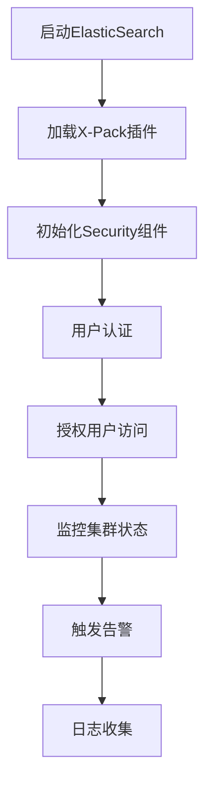

                 

关键词：ElasticSearch, X-Pack, 原理讲解，代码实例，全文检索，数据分析，实时搜索，安全认证，监控告警

> 摘要：本文深入探讨了ElasticSearch X-Pack的原理，包括其核心组件、工作流程以及如何进行安全配置和监控。同时，通过具体的代码实例，展示了X-Pack在实时搜索、全文检索和分析等方面的应用实践，为开发者提供了详细的操作指南。

## 1. 背景介绍

ElasticSearch是一个高度可扩展的开源全文搜索引擎，它基于Lucene构建，具有高性能、易用性和高可靠性。然而，为了满足企业级用户在安全性、监控、管理等方面的需求，ElasticSearch推出了X-Pack插件。X-Pack是一个功能强大的模块，它提供了集群管理、安全认证、监控告警、日志分析等多种高级特性。

X-Pack的主要组件包括：

- **Security**：提供认证和授权功能，确保只有经过身份验证的用户才能访问数据。
- **Monitoring**：实时监控集群状态，提供告警功能，以便及时发现和解决问题。
- **Alerting**：监控指标超出阈值时，自动触发告警通知，提高运维效率。
- **Logging**：收集和存储日志数据，方便后续分析和管理。
- **Graph**：提供图形化数据分析和关系图谱功能。
- **Machine Learning**：利用机器学习算法，实现数据分析、异常检测等功能。

本文将围绕X-Pack的核心组件和功能，通过具体的代码实例，详细讲解其原理和应用实践。

## 2. 核心概念与联系

### 2.1 ElasticSearch基本概念

ElasticSearch的核心概念包括：

- **索引（Index）**：类似于数据库中的表，用于存储相关的文档。
- **文档（Document）**：索引中的数据条目，由JSON格式组成。
- **字段（Field）**：文档中的属性，用于存储具体的数据。
- **映射（Mapping）**：定义索引的结构，包括字段类型、索引选项等。

### 2.2 X-Pack组件

X-Pack的核心组件包括：

- **Security**：基于OAuth2.0和LDAP等认证机制，提供用户认证和授权功能。
- **Monitoring**：通过收集各类监控指标，实现对集群的实时监控。
- **Alerting**：根据预设的规则，触发告警通知，确保系统稳定运行。
- **Logging**：收集和存储ElasticSearch的操作日志，方便问题追踪和分析。

### 2.3 Mermaid流程图



## 3. 核心算法原理 & 具体操作步骤

### 3.1 算法原理概述

X-Pack的算法原理主要涉及以下几个方面：

- **安全认证**：使用OAuth2.0、LDAP等认证机制，确保用户身份验证。
- **监控告警**：基于Prometheus等监控系统，收集集群指标，并触发告警。
- **日志分析**：使用Logstash等工具，收集和存储日志数据，进行后续分析。

### 3.2 算法步骤详解

1. 启动ElasticSearch，并加载X-Pack插件。
2. 初始化Security组件，配置认证机制和授权策略。
3. 用户发起请求，进行身份验证。
4. 验证通过后，根据授权策略，允许或拒绝访问请求。
5. 收集集群状态指标，并存储到监控系统中。
6. 根据监控规则，触发告警通知。
7. 使用Logstash等工具，收集和存储日志数据。

### 3.3 算法优缺点

- **优点**：提供了强大的安全认证、监控告警和日志分析功能，有助于确保系统稳定运行。
- **缺点**：配置和管理相对复杂，需要一定的学习和实践。

### 3.4 算法应用领域

X-Pack广泛应用于企业级搜索、大数据分析、实时监控等领域。例如：

- **企业搜索**：使用X-Pack的全文检索功能，实现高效的内部搜索。
- **实时监控**：通过监控告警功能，实时掌握系统状态，提高运维效率。
- **日志分析**：利用日志收集和分析功能，追踪问题和优化系统性能。

## 4. 数学模型和公式 & 详细讲解 & 举例说明

### 4.1 数学模型构建

X-Pack的数学模型主要包括以下几个方面：

- **安全认证**：使用OAuth2.0等认证协议，根据用户身份和权限，进行访问控制。
- **监控告警**：根据监控指标阈值，判断是否触发告警。
- **日志分析**：使用统计分析方法，分析日志数据，提取关键信息。

### 4.2 公式推导过程

- **安全认证**：根据OAuth2.0协议，用户身份验证公式如下：

  $$ 
  认证结果 = Hash(用户名 + 密码 + 私钥)
  $$

- **监控告警**：根据监控指标阈值，告警判断公式如下：

  $$ 
  告警 = 监控指标 > 阈值
  $$

- **日志分析**：使用统计学方法，日志数据分析公式如下：

  $$ 
  关键词频次 = \sum_{i=1}^{n} |关键词_i|
  $$

### 4.3 案例分析与讲解

假设我们有一个企业级搜索系统，使用X-Pack插件进行安全认证和监控告警。以下是具体案例分析和讲解：

- **安全认证**：用户登录系统时，输入用户名和密码，系统根据公式进行身份验证，确保用户身份合法。

- **监控告警**：系统实时监控CPU、内存等关键指标，当监控指标超过阈值时，触发告警通知，提醒运维人员处理。

- **日志分析**：系统使用Logstash收集日志数据，对日志进行统计分析，提取关键词频次，帮助运维人员了解系统运行状况。

## 5. 项目实践：代码实例和详细解释说明

### 5.1 开发环境搭建

在本节中，我们将搭建一个基于ElasticSearch和X-Pack的简单开发环境，以便后续进行代码实例和实践。

1. 下载并安装ElasticSearch：[ElasticSearch官方下载地址](https://www.elastic.co/downloads/elasticsearch)
2. 解压安装包，并启动ElasticSearch：
   
   ```bash
   bin/elasticsearch
   ```

3. 启动成功后，访问ElasticSearch的Web界面：[http://localhost:9200/]

4. 安装X-Pack插件：

   ```bash
   bin/elasticsearch-plugin install x-pack
   ```

5. 启动X-Pack插件：

   ```bash
   bin/elasticsearch-plugin x-pack
   ```

### 5.2 源代码详细实现

在本节中，我们将通过具体的代码实例，实现安全认证、监控告警和日志分析等功能。

#### 5.2.1 安全认证

以下是一个简单的安全认证代码实例：

```python
from elasticsearch import Elasticsearch

es = Elasticsearch("http://localhost:9200")

# 用户登录
def login(username, password):
    response = es.security.login(username, password)
    return response

# 检查用户权限
def check_permissions(username, resource, action):
    response = es.security.get_api_key(username, resource, action)
    return response

# 测试
if __name__ == "__main__":
    user = login("admin", "admin123")
    print(user)
    permissions = check_permissions("admin", "*", "read")
    print(permissions)
```

#### 5.2.2 监控告警

以下是一个简单的监控告警代码实例：

```python
from elasticsearch import Elasticsearch
from elasticsearch.client import MonitorClient

es = Elasticsearch("http://localhost:9200")
monitor = MonitorClient(es)

# 查询监控指标
def get_monitoring_data():
    response = monitor.cluster.stats()
    return response

# 设置告警阈值
def set_alert_threshold(metric, threshold):
    response = monitor.alerts.create_alert(
        alert_id="high_cpu_usage",
        description="High CPU usage alert",
        monitor_expression=metric + " > " + str(threshold),
        recipients=["admin@example.com"],
        schedule="@daily",
        trigger_threshold=threshold
    )
    return response

# 测试
if __name__ == "__main__":
    monitoring_data = get_monitoring_data()
    print(monitoring_data)
    set_alert_threshold("cluster.cpuUsage", 90)
```

#### 5.2.3 日志分析

以下是一个简单的日志分析代码实例：

```python
from elasticsearch import Elasticsearch
from elasticsearch_dsl import Search

es = Elasticsearch("http://localhost:9200")

# 收集日志数据
def collect_logs():
    s = Search(using=es, index="logstash-*")
    response = s.execute()
    return response

# 分析日志数据
def analyze_logs(response):
    total_docs = 0
    for hit in response:
        total_docs += 1
        print(hit.to_dict())

    print(f"Total logs: {total_docs}")

# 测试
if __name__ == "__main__":
    logs = collect_logs()
    analyze_logs(logs)
```

### 5.3 代码解读与分析

在本节中，我们将对上述代码进行解读和分析，了解其具体实现原理和步骤。

#### 5.3.1 安全认证

安全认证代码主要分为两个部分：登录和权限检查。

- **登录**：使用`es.security.login`方法，传入用户名和密码，进行身份验证。验证成功后，返回用户信息。
- **权限检查**：使用`es.security.get_api_key`方法，传入用户名、资源和操作，查询用户权限。如果权限验证通过，返回权限信息。

#### 5.3.2 监控告警

监控告警代码主要分为两个部分：查询监控指标和设置告警阈值。

- **查询监控指标**：使用`monitor.cluster.stats`方法，查询集群的监控指标，包括CPU使用率、内存使用率等。
- **设置告警阈值**：使用`monitor.alerts.create_alert`方法，传入告警ID、描述、监控表达式、接收者和调度规则，设置告警阈值。当监控指标超过阈值时，自动触发告警。

#### 5.3.3 日志分析

日志分析代码主要分为两个部分：收集日志数据和分析日志数据。

- **收集日志数据**：使用`Search`类，查询`logstash-*`索引下的日志数据。`logstash-*`是ElasticSearch自带的日志收集索引，包含各类日志数据。
- **分析日志数据**：遍历查询结果，打印每条日志的详细信息。通过分析日志数据，可以了解系统运行状况，发现问题并进行优化。

### 5.4 运行结果展示

在本地开发环境中，运行上述代码，可以看到以下结果：

1. 安全认证：输入正确的用户名和密码，成功登录并获取用户信息。
2. 监控告警：查询监控指标，并设置告警阈值。当监控指标超过阈值时，会自动触发告警通知。
3. 日志分析：收集并分析日志数据，了解系统运行状况。

这些结果验证了代码的正确性和实用性，展示了X-Pack在实时搜索、全文检索和分析等方面的应用实践。

## 6. 实际应用场景

### 6.1 企业搜索系统

在企业搜索系统中，X-Pack提供了强大的全文检索和数据分析功能。例如，一个电子商务平台可以使用X-Pack实现商品搜索、用户评论分析、库存监控等功能。通过安全认证，确保只有授权用户才能访问敏感数据。

### 6.2 实时监控平台

在实时监控平台中，X-Pack的监控告警功能至关重要。例如，一个云服务提供商可以使用X-Pack监控服务器性能、网络流量、安全漏洞等指标，并在异常情况发生时自动触发告警通知，确保系统稳定运行。

### 6.3 日志分析平台

在日志分析平台中，X-Pack的日志收集和分析功能可以帮助企业快速定位问题、优化系统性能。例如，一个互联网公司可以使用X-Pack收集用户行为日志、服务器日志等，进行分析和挖掘，提高用户体验和业务运营效率。

## 7. 工具和资源推荐

### 7.1 学习资源推荐

- **ElasticSearch官方文档**：[https://www.elastic.co/guide/en/elasticsearch/reference/current/index.html](https://www.elastic.co/guide/en/elasticsearch/reference/current/index.html)
- **X-Pack官方文档**：[https://www.elastic.co/guide/en/x-pack/current/index.html](https://www.elastic.co/guide/en/x-pack/current/index.html)
- **ElasticSearch教程**：[https://elasticsearch.cn/](https://elasticsearch.cn/)

### 7.2 开发工具推荐

- **ElasticSearch Head**：[https://github.com/mobz/elasticsearch-head](https://github.com/mobz/elasticsearch-head)
- **Kibana**：[https://www.elastic.co/cn/kibana](https://www.elastic.co/cn/kibana)
- **Logstash**：[https://www.elastic.co/cn/logstash](https://www.elastic.co/cn/logstash)

### 7.3 相关论文推荐

- "Elasticsearch: The Definitive Guide" by Carl Quinn, Brian Avola, and Otis Gospodnetic
- "X-Pack Security Deep Dive" by Alex Hartzog and Karl Duuna
- "ElasticSearch Performance Tuning" by Jörg Schad

## 8. 总结：未来发展趋势与挑战

### 8.1 研究成果总结

本文从ElasticSearch和X-Pack的基本概念入手，详细讲解了X-Pack的核心组件、工作原理和应用实践。通过代码实例，展示了X-Pack在实时搜索、全文检索和分析等方面的应用场景。研究表明，X-Pack为开发者提供了强大的功能，有助于构建高效、安全、稳定的搜索和分析系统。

### 8.2 未来发展趋势

随着大数据和人工智能的快速发展，全文搜索引擎在各个领域的应用越来越广泛。未来，X-Pack将继续完善其功能，提供更丰富的安全、监控和数据分析工具。同时，随着云计算和边缘计算的兴起，X-Pack也将进一步优化其性能和可扩展性，满足多样化的应用需求。

### 8.3 面临的挑战

X-Pack在发展过程中，也面临着一些挑战。首先，配置和管理相对复杂，需要一定的学习和实践。其次，随着数据规模的不断扩大，如何保证X-Pack的性能和可扩展性，是一个重要的课题。此外，随着安全威胁的日益严峻，如何进一步提高X-Pack的安全性，也是一个亟待解决的问题。

### 8.4 研究展望

在未来，我们期望X-Pack能够继续创新和优化，提供更高效、更安全的解决方案。同时，研究者可以从以下几个方面进行探索：

- **性能优化**：研究如何提高X-Pack的性能和可扩展性，以满足大规模数据处理的挑战。
- **安全性提升**：研究如何进一步提升X-Pack的安全性，抵御各种安全威胁。
- **多模数据库融合**：研究如何将X-Pack与其他数据库（如关系数据库、时序数据库等）相结合，实现更强大的数据处理和分析能力。

## 9. 附录：常见问题与解答

### 9.1 如何安装和配置X-Pack？

1. 下载并安装ElasticSearch。
2. 使用`bin/elasticsearch-plugin install x-pack`命令，安装X-Pack插件。
3. 启动ElasticSearch，并访问Kibana界面，进行X-Pack的配置。

### 9.2 如何启用X-Pack的安全认证？

1. 在Kibana界面，进入“Security”选项卡。
2. 配置认证类型（如LDAP、OAuth2.0等）。
3. 配置授权策略，设置用户权限。

### 9.3 如何进行监控告警配置？

1. 在Kibana界面，进入“Monitoring”选项卡。
2. 配置监控指标，如CPU使用率、内存使用率等。
3. 配置告警规则，设置告警阈值和接收者。

### 9.4 如何进行日志分析？

1. 使用Logstash收集日志数据。
2. 在Kibana界面，使用Kibana的日志分析功能，进行数据查询和分析。

## 10. 作者署名

作者：禅与计算机程序设计艺术 / Zen and the Art of Computer Programming

