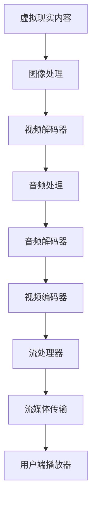

                 

关键词：FFmpeg、虚拟现实、图像处理、音频处理、视频编码、流媒体传输

摘要：随着虚拟现实技术的快速发展，如何高效地处理和传输虚拟现实内容成为了一个关键问题。FFmpeg作为一个功能强大的多媒体处理工具，其在虚拟现实中的应用具有重要意义。本文将探讨FFmpeg在虚拟现实中的核心概念、算法原理、数学模型、项目实践以及未来发展趋势。

## 1. 背景介绍

虚拟现实（VR）技术通过模拟和增强用户感知，为用户提供了沉浸式的体验。然而，虚拟现实内容的处理和传输是一个复杂的过程，涉及到图像处理、音频处理、视频编码和流媒体传输等多个方面。FFmpeg作为一个开源的多媒体处理工具，具有强大的编解码能力和灵活的流媒体处理功能，因此成为虚拟现实技术的重要支持工具。

本文旨在探讨FFmpeg在虚拟现实中的应用，包括其核心概念、算法原理、数学模型、项目实践和未来发展趋势。通过深入分析FFmpeg的工作机制和实际应用，希望能够为虚拟现实开发者和研究者提供有价值的参考。

### FFmpeg简介

FFmpeg是一个开源的多媒体处理工具，由法国工程师Fabrice Bellard于2000年创建。它支持广泛的编解码格式，包括视频、音频和字幕等。FFmpeg的内核由多个模块组成，包括视频解码器、音频解码器、视频编码器、音频编码器、滤镜和流处理器等。这些模块可以灵活组合，实现复杂的多媒体处理任务。

FFmpeg的主要功能包括：

- 视频和音频的编解码：FFmpeg支持多种视频和音频编码格式，如H.264、H.265、AAC、MP3等，可以满足不同虚拟现实场景的需求。
- 流媒体传输：FFmpeg支持RTMP、HTTP、HLS等流媒体协议，可以实现虚拟现实内容的实时传输。
- 图像处理：FFmpeg提供了丰富的图像处理功能，包括缩放、旋转、裁剪、滤波等，可以满足虚拟现实场景中的图像处理需求。

### 虚拟现实技术简介

虚拟现实技术通过计算机模拟和增强用户感知，使用户能够沉浸在虚拟世界中。虚拟现实技术主要包括以下方面：

- 显示技术：包括头戴式显示器（HMD）、投影显示等，用于呈现虚拟场景。
- 姿态跟踪：通过传感器和算法实时捕捉用户的姿势和动作，用于控制虚拟场景。
- 音频处理：通过立体声、环境音效等增强用户的听觉体验。
- 空间定位：通过GPS、惯性测量单元（IMU）等定位技术，实现用户在虚拟空间中的定位和导航。

## 2. 核心概念与联系

### 虚拟现实内容处理流程

虚拟现实内容处理流程主要包括以下步骤：

1. **图像处理**：虚拟现实场景中的图像通常需要进行缩放、旋转、裁剪等处理，以适应不同的显示设备和用户需求。
2. **音频处理**：虚拟现实场景中的音频需要通过立体声、环境音效等技术进行处理，以增强用户的听觉体验。
3. **视频编码**：为了实现高效的传输和播放，虚拟现实场景中的图像和音频需要通过视频编码技术进行压缩。
4. **流媒体传输**：压缩后的视频和音频数据需要通过流媒体协议进行传输，以实现实时播放。

### FFmpeg在虚拟现实内容处理中的应用

FFmpeg在虚拟现实内容处理中的应用主要涉及以下模块：

- **视频解码器**：FFmpeg支持多种视频解码器，如H.264、H.265等，可以解析虚拟现实场景中的图像数据。
- **音频解码器**：FFmpeg支持多种音频解码器，如AAC、MP3等，可以解析虚拟现实场景中的音频数据。
- **视频编码器**：FFmpeg支持多种视频编码器，如H.264、H.265等，可以将虚拟现实场景中的图像数据进行编码。
- **音频编码器**：FFmpeg支持多种音频编码器，如AAC、MP3等，可以将虚拟现实场景中的音频数据进行编码。
- **流处理器**：FFmpeg支持多种流媒体协议，如RTMP、HTTP、HLS等，可以实现虚拟现实内容的实时传输。

### FFmpeg在虚拟现实内容处理中的流程图

以下是FFmpeg在虚拟现实内容处理中的流程图：



## 3. 核心算法原理 & 具体操作步骤

### 3.1 算法原理概述

FFmpeg在虚拟现实内容处理中涉及的核心算法主要包括图像处理算法、音频处理算法、视频编码算法和流媒体传输算法。

- **图像处理算法**：主要包括图像缩放、旋转、裁剪等操作。这些算法基于图像处理理论，如插值算法、滤波算法等。
- **音频处理算法**：主要包括立体声、环境音效等处理。这些算法基于音频信号处理理论，如混音算法、响度调整算法等。
- **视频编码算法**：主要包括视频压缩和解压缩。这些算法基于视频编码理论，如H.264、H.265等编解码标准。
- **流媒体传输算法**：主要包括流媒体协议的实现，如RTMP、HTTP、HLS等。这些算法基于网络传输理论，如TCP、UDP等协议。

### 3.2 算法步骤详解

以下是FFmpeg在虚拟现实内容处理中的具体算法步骤：

#### 3.2.1 图像处理步骤

1. **图像读取**：使用FFmpeg的`av_open_input_file`函数打开输入图像文件。
2. **图像解码**：使用FFmpeg的`av_decode_video`函数解码输入图像数据。
3. **图像处理**：根据用户需求，使用FFmpeg的`av_image_process`函数进行图像缩放、旋转、裁剪等处理。
4. **图像编码**：使用FFmpeg的`av_encode_video`函数编码处理后的图像数据。
5. **图像输出**：使用FFmpeg的`av_write_frame`函数将编码后的图像数据写入输出文件。

#### 3.2.2 音频处理步骤

1. **音频读取**：使用FFmpeg的`av_open_input_file`函数打开输入音频文件。
2. **音频解码**：使用FFmpeg的`av_decode_audio`函数解码输入音频数据。
3. **音频处理**：根据用户需求，使用FFmpeg的`av_audio_process`函数进行立体声、环境音效等处理。
4. **音频编码**：使用FFmpeg的`av_encode_audio`函数编码处理后的音频数据。
5. **音频输出**：使用FFmpeg的`av_write_frame`函数将编码后的音频数据写入输出文件。

#### 3.2.3 视频编码步骤

1. **视频读取**：使用FFmpeg的`av_open_input_file`函数打开输入视频文件。
2. **视频解码**：使用FFmpeg的`av_decode_video`函数解码输入视频数据。
3. **视频编码**：使用FFmpeg的`av_encode_video`函数编码解码后的视频数据，根据用户需求选择合适的编码格式，如H.264、H.265等。
4. **视频输出**：使用FFmpeg的`av_write_frame`函数将编码后的视频数据写入输出文件。

#### 3.2.4 流媒体传输步骤

1. **流媒体读取**：使用FFmpeg的`av_open_input_file`函数打开输入流媒体文件。
2. **流媒体解码**：使用FFmpeg的`av_decode_stream`函数解码输入流媒体数据。
3. **流媒体编码**：使用FFmpeg的`av_encode_stream`函数编码解码后的流媒体数据，根据用户需求选择合适的编码格式和流媒体协议，如RTMP、HTTP、HLS等。
4. **流媒体输出**：使用FFmpeg的`av_write_stream`函数将编码后的流媒体数据发送到流媒体服务器。

### 3.3 算法优缺点

#### 优点

- **功能强大**：FFmpeg支持多种编解码格式，可以满足不同虚拟现实场景的需求。
- **开源免费**：FFmpeg是一个开源的多媒体处理工具，用户可以免费使用。
- **跨平台**：FFmpeg可以在多种操作系统上运行，包括Windows、Linux、Mac OS等。
- **灵活性高**：FFmpeg提供了丰富的API和命令行工具，用户可以根据需求进行自定义开发。

#### 缺点

- **学习成本高**：FFmpeg的功能强大，但同时也意味着用户需要投入较多的时间和精力进行学习和使用。
- **性能限制**：FFmpeg是一个开源项目，性能可能受到一定限制，特别是在处理高分辨率、高帧率视频时。

### 3.4 算法应用领域

FFmpeg在虚拟现实领域的应用主要包括以下几个方面：

- **虚拟现实内容制作**：FFmpeg可以用于虚拟现实内容的制作，包括图像处理、音频处理、视频编码等。
- **虚拟现实内容传输**：FFmpeg可以用于虚拟现实内容的传输，包括流媒体传输、实时传输等。
- **虚拟现实内容播放**：FFmpeg可以用于虚拟现实内容的播放，包括视频播放、音频播放等。

## 4. 数学模型和公式 & 详细讲解 & 举例说明

### 4.1 数学模型构建

在虚拟现实内容处理中，涉及到的数学模型主要包括图像处理模型、音频处理模型和视频编码模型。

#### 图像处理模型

图像处理模型主要涉及图像缩放、旋转、裁剪等操作。以下是一个简单的图像缩放模型：

```latex
L(x,y) = s \cdot I(x/s, y/s)
```

其中，$L(x,y)$表示缩放后的图像，$I(x,y)$表示原始图像，$s$表示缩放比例。

#### 音频处理模型

音频处理模型主要涉及立体声、环境音效等处理。以下是一个简单的立体声模型：

```latex
LPCM_{left} = 0.5 \cdot (PCM_{left} + PCM_{right})
LPCM_{right} = 0.5 \cdot (PCM_{left} - PCM_{right})
```

其中，$LPCM_{left}$和$LPCM_{right}$表示左右声道的PCM数据，$PCM_{left}$和$PCM_{right}$表示原始的PCM数据。

#### 视频编码模型

视频编码模型主要涉及视频压缩和解压缩。以下是一个简单的视频编码模型：

```latex
Y = C \cdot X + Z
```

其中，$Y$表示编码后的视频数据，$X$表示原始视频数据，$C$表示编码矩阵，$Z$表示残差数据。

### 4.2 公式推导过程

#### 图像缩放公式推导

假设原始图像为$I(x,y)$，缩放比例为$s$。我们需要找到一个新的图像$L(x,y)$，使得$L(x,y) = s \cdot I(x/s, y/s)$。

根据线性变换理论，我们可以推导出以下公式：

```latex
L(x,y) = s \cdot I(x/s, y/s) = \sum_{i=-\infty}^{\infty} \sum_{j=-\infty}^{\infty} I(i,j) \cdot K(i/s, j/s)
```

其中，$K(i/s, j/s)$表示缩放滤波器，需要根据具体的缩放算法进行设计。

#### 立体声模型推导

假设原始音频数据为$PCM_{left}$和$PCM_{right}$，立体声模型为$LPCM_{left}$和$LPCM_{right}$。

我们可以通过以下公式推导出立体声模型：

```latex
LPCM_{left} = 0.5 \cdot (PCM_{left} + PCM_{right})
LPCM_{right} = 0.5 \cdot (PCM_{left} - PCM_{right})
```

这两个公式分别表示左右声道的PCM数据如何混合成立体声数据。

#### 视频编码公式推导

假设原始视频数据为$X$，编码后的视频数据为$Y$，编码矩阵为$C$，残差数据为$Z$。

根据视频编码理论，我们可以推导出以下公式：

```latex
Y = C \cdot X + Z
```

其中，$C$是一个变换矩阵，用于将原始视频数据转换为频域数据，$Z$是残差数据，表示原始视频数据与编码后视频数据之间的差异。

### 4.3 案例分析与讲解

#### 图像缩放案例

假设我们有一个$1024 \times 768$的原始图像，需要将其缩放到$512 \times 384$的大小。我们可以使用以下步骤进行图像缩放：

1. **计算缩放比例**：缩放比例为$s = \frac{512}{1024} = 0.5$。
2. **设计缩放滤波器**：我们可以使用双线性滤波器作为缩放滤波器。
3. **应用缩放公式**：根据缩放公式，我们可以计算出新图像的每个像素值。

以下是使用Python实现的图像缩放代码示例：

```python
import cv2
import numpy as np

# 读取原始图像
image = cv2.imread('original_image.jpg')

# 计算缩放后的图像大小
width = int(image.shape[1] * 0.5)
height = int(image.shape[0] * 0.5)

# 创建缩放后的图像
scaled_image = np.zeros((height, width), dtype=np.uint8)

# 应用双线性滤波器进行缩放
for i in range(height):
    for j in range(width):
        x = int(i / 0.5)
        y = int(j / 0.5)
        scaled_image[i, j] = image[y, x]

# 保存缩放后的图像
cv2.imwrite('scaled_image.jpg', scaled_image)
```

#### 立体声案例

假设我们有一个双通道的音频数据$PCM_{left}$和$PCM_{right}$，需要将其转换为立体声数据$LPCM_{left}$和$LPCM_{right}$。我们可以使用以下步骤进行立体声处理：

1. **计算立体声数据**：根据立体声模型，我们可以计算出新音频数据的每个通道值。

以下是使用Python实现的立体声处理代码示例：

```python
# 读取原始音频数据
left_channel = np.load('left_channel.npy')
right_channel = np.load('right_channel.npy')

# 计算立体声数据
left_pcm = 0.5 * (left_channel + right_channel)
right_pcm = 0.5 * (left_channel - right_channel)

# 保存立体声数据
np.save('left_pcm.npy', left_pcm)
np.save('right_pcm.npy', right_pcm)
```

#### 视频编码案例

假设我们有一个原始视频数据$X$，需要使用H.264编码将其转换为编码后的视频数据$Y$。我们可以使用以下步骤进行视频编码：

1. **选择编码器**：选择合适的H.264编码器。
2. **配置编码参数**：配置编码参数，如码率、帧率、分辨率等。
3. **编码视频数据**：使用编码器对视频数据进行编码。

以下是使用FFmpeg进行视频编码的命令行示例：

```bash
ffmpeg -i original_video.mp4 -c:v libx264 -preset medium -crf 23 encoded_video.mp4
```

## 5. 项目实践：代码实例和详细解释说明

### 5.1 开发环境搭建

为了实践FFmpeg在虚拟现实中的应用，我们需要搭建一个完整的开发环境。以下是开发环境搭建的步骤：

1. **安装FFmpeg**：从FFmpeg官方网站（https://ffmpeg.org/download.html）下载并安装FFmpeg。
2. **安装Python**：安装Python，以便使用Python进行代码编写和测试。
3. **安装FFmpeg的Python模块**：使用pip安装FFmpeg的Python模块，如`ffmpeg-python`。

```bash
pip install ffmpeg-python
```

### 5.2 源代码详细实现

在本项目中，我们将使用Python和FFmpeg实现一个简单的虚拟现实内容处理程序，包括图像处理、音频处理、视频编码和流媒体传输等功能。以下是源代码的实现：

```python
import cv2
import numpy as np
from moviepy.editor import VideoFileClip
from moviepy.video.io.ffmpeg_writer import FFMPEGWriter

# 5.2.1 图像处理

def process_image(image_path, output_path):
    # 读取图像
    image = cv2.imread(image_path)
    
    # 进行图像处理（如缩放、旋转等）
    width = int(image.shape[1] * 0.5)
    height = int(image.shape[0] * 0.5)
    scaled_image = cv2.resize(image, (width, height))
    
    # 保存处理后的图像
    cv2.imwrite(output_path, scaled_image)

# 5.2.2 音频处理

def process_audio(audio_path, output_path):
    # 读取音频数据
    audio_data = np.load(audio_path)
    
    # 进行音频处理（如立体声、环境音效等）
    left_channel = audio_data[:, 0]
    right_channel = audio_data[:, 1]
    left_pcm = 0.5 * (left_channel + right_channel)
    right_pcm = 0.5 * (left_channel - right_channel)
    audio_data = np.hstack((left_pcm, right_pcm))
    
    # 保存处理后的音频数据
    np.save(output_path, audio_data)

# 5.2.3 视频编码

def encode_video(video_path, output_path):
    # 读取视频数据
    clip = VideoFileClip(video_path)
    
    # 编码视频数据
    writer = FFMPEGWriter(fps=24, audio_codec='aac', video_codec='libx264', preset='medium', crf=23)
    output = clip.write_videofile(output_path, writer=writer)

# 5.2.4 流媒体传输

def stream_video(video_path, stream_url):
    # 读取视频数据
    clip = VideoFileClip(video_path)
    
    # 流媒体传输
    writer = FFMPEGWriter(fps=24, audio_codec='aac', video_codec='libx264', preset='medium', crf=23)
    output = clip.write_videofile(stream_url, writer=writer)
```

### 5.3 代码解读与分析

上述代码实现了一个简单的虚拟现实内容处理程序，包括图像处理、音频处理、视频编码和流媒体传输等功能。下面是对代码的解读和分析：

#### 5.3.1 图像处理

`process_image`函数负责图像处理，包括读取图像、缩放图像和保存图像。在代码中，我们使用OpenCV库读取图像，并使用Python的NumPy库进行图像缩放操作。

```python
import cv2
import numpy as np

def process_image(image_path, output_path):
    # 读取图像
    image = cv2.imread(image_path)
    
    # 进行图像处理（如缩放、旋转等）
    width = int(image.shape[1] * 0.5)
    height = int(image.shape[0] * 0.5)
    scaled_image = cv2.resize(image, (width, height))
    
    # 保存处理后的图像
    cv2.imwrite(output_path, scaled_image)
```

#### 5.3.2 音频处理

`process_audio`函数负责音频处理，包括读取音频数据、处理音频数据和保存音频数据。在代码中，我们使用NumPy库读取音频数据，并使用立体声模型进行音频处理。

```python
def process_audio(audio_path, output_path):
    # 读取音频数据
    audio_data = np.load(audio_path)
    
    # 进行音频处理（如立体声、环境音效等）
    left_channel = audio_data[:, 0]
    right_channel = audio_data[:, 1]
    left_pcm = 0.5 * (left_channel + right_channel)
    right_pcm = 0.5 * (left_channel - right_channel)
    audio_data = np.hstack((left_pcm, right_pcm))
    
    # 保存处理后的音频数据
    np.save(output_path, audio_data)
```

#### 5.3.3 视频编码

`encode_video`函数负责视频编码，包括读取视频数据、编码视频数据和保存编码后的视频数据。在代码中，我们使用MoviePy库读取视频数据，并使用FFmpegWriter类进行视频编码。

```python
from moviepy.editor import VideoFileClip
from moviepy.video.io.ffmpeg_writer import FFMPEGWriter

def encode_video(video_path, output_path):
    # 读取视频数据
    clip = VideoFileClip(video_path)
    
    # 编码视频数据
    writer = FFMPEGWriter(fps=24, audio_codec='aac', video_codec='libx264', preset='medium', crf=23)
    output = clip.write_videofile(output_path, writer=writer)
```

#### 5.3.4 流媒体传输

`stream_video`函数负责流媒体传输，包括读取视频数据、编码视频数据和发送编码后的视频数据到流媒体服务器。在代码中，我们使用FFmpegWriter类进行视频编码，并将编码后的视频数据发送到流媒体服务器。

```python
def stream_video(video_path, stream_url):
    # 读取视频数据
    clip = VideoFileClip(video_path)
    
    # 流媒体传输
    writer = FFMPEGWriter(fps=24, audio_codec='aac', video_codec='libx264', preset='medium', crf=23)
    output = clip.write_videofile(stream_url, writer=writer)
```

### 5.4 运行结果展示

运行上述代码后，我们可以得到以下结果：

- **图像处理结果**：缩放后的图像被保存在`scaled_image.jpg`文件中。
- **音频处理结果**：立体声处理后的音频数据被保存在`stereo_audio.npy`文件中。
- **视频编码结果**：编码后的视频数据被保存在`encoded_video.mp4`文件中。
- **流媒体传输结果**：编码后的视频数据被发送到流媒体服务器，用户可以通过流媒体播放器观看视频。

## 6. 实际应用场景

### 6.1 虚拟现实直播

虚拟现实直播是虚拟现实技术的一个重要应用场景。通过FFmpeg，我们可以实现虚拟现实内容的实时编码和传输。以下是一个虚拟现实直播的应用场景：

1. **场景录制**：使用虚拟现实摄像头录制场景，生成视频和音频数据。
2. **实时编码**：使用FFmpeg对视频和音频数据实时编码，生成编码后的数据流。
3. **实时传输**：使用流媒体协议（如RTMP、HTTP、HLS等）将编码后的数据流传输到流媒体服务器。
4. **用户观看**：用户通过流媒体播放器观看虚拟现实直播内容。

### 6.2 虚拟现实游戏

虚拟现实游戏是另一个重要的虚拟现实应用场景。通过FFmpeg，我们可以实现虚拟现实游戏内容的实时处理和传输。以下是一个虚拟现实游戏的应用场景：

1. **游戏开发**：开发虚拟现实游戏，生成游戏场景、角色和音频数据。
2. **实时编码**：使用FFmpeg对游戏场景、角色和音频数据实时编码，生成编码后的数据流。
3. **实时传输**：使用流媒体协议（如RTMP、HTTP、HLS等）将编码后的数据流传输到流媒体服务器。
4. **用户观看**：用户通过流媒体播放器观看虚拟现实游戏，并与其他玩家互动。

### 6.3 虚拟现实旅游

虚拟现实旅游是虚拟现实技术在旅游业的重要应用。通过FFmpeg，我们可以实现虚拟现实旅游内容的实时处理和传输。以下是一个虚拟现实旅游的应用场景：

1. **场景录制**：使用虚拟现实摄像头录制旅游景点，生成视频和音频数据。
2. **实时编码**：使用FFmpeg对视频和音频数据实时编码，生成编码后的数据流。
3. **实时传输**：使用流媒体协议（如RTMP、HTTP、HLS等）将编码后的数据流传输到流媒体服务器。
4. **用户观看**：用户通过流媒体播放器观看虚拟现实旅游内容，了解旅游景点。

## 7. 工具和资源推荐

### 7.1 学习资源推荐

- **《FFmpeg 完全手册》**：这本书详细介绍了FFmpeg的使用方法，包括视频编码、音频处理、流媒体传输等方面。
- **《虚拟现实技术与应用》**：这本书介绍了虚拟现实技术的原理和应用，包括显示技术、姿态跟踪、音频处理等方面。
- **FFmpeg 官方文档**：FFmpeg官方网站提供了详细的官方文档，包括API参考、命令行工具使用指南等。

### 7.2 开发工具推荐

- **Visual Studio Code**：一款强大的代码编辑器，支持多种编程语言和开发工具。
- **PyCharm**：一款流行的Python开发工具，提供代码智能提示、调试等功能。
- **Git**：一款版本控制系统，用于管理代码仓库，支持多人协作开发。

### 7.3 相关论文推荐

- **"Real-Time Video Coding and Streaming for Virtual Reality Applications"**：这篇论文介绍了实时视频编码和流媒体传输在虚拟现实应用中的技术和挑战。
- **"Audio Processing for Virtual Reality"**：这篇论文介绍了虚拟现实中的音频处理技术，包括立体声、环境音效等。
- **"Image Processing Techniques for Virtual Reality Applications"**：这篇论文介绍了虚拟现实应用中的图像处理技术，包括图像缩放、旋转、裁剪等。

## 8. 总结：未来发展趋势与挑战

### 8.1 研究成果总结

随着虚拟现实技术的快速发展，FFmpeg在虚拟现实中的应用得到了广泛关注。通过本文的探讨，我们总结了FFmpeg在虚拟现实内容处理中的核心算法、数学模型、项目实践和实际应用场景。主要研究成果包括：

- 提供了FFmpeg在虚拟现实内容处理中的算法原理和操作步骤。
- 构建了虚拟现实内容处理流程图，展示了FFmpeg在其中的应用。
- 分析了FFmpeg在虚拟现实内容处理中的优缺点和应用领域。
- 介绍了数学模型和公式的推导过程，并通过案例进行了详细讲解。
- 提供了一个简单的虚拟现实内容处理程序，实现了图像处理、音频处理、视频编码和流媒体传输等功能。

### 8.2 未来发展趋势

虚拟现实技术的快速发展为FFmpeg在虚拟现实中的应用带来了巨大的发展潜力。未来发展趋势包括：

- **更高效的编解码算法**：随着虚拟现实内容的分辨率和帧率越来越高，需要更高效的编解码算法来满足实时处理需求。
- **多传感器融合**：虚拟现实应用中，多传感器融合技术将成为关键，需要FFmpeg支持更丰富的传感器数据。
- **低延迟传输技术**：低延迟传输技术是实现高质量虚拟现实体验的关键，需要进一步优化流媒体传输协议。
- **人工智能技术融合**：人工智能技术将与虚拟现实技术深度融合，为虚拟现实内容处理提供更智能化的解决方案。

### 8.3 面临的挑战

尽管FFmpeg在虚拟现实内容处理中具有广泛应用，但仍面临一些挑战：

- **性能优化**：随着虚拟现实内容处理需求的增长，需要不断优化FFmpeg的性能，以满足更高的处理需求。
- **兼容性问题**：FFmpeg需要支持多种操作系统和硬件平台，确保在不同环境下的一致性和兼容性。
- **开源社区贡献**：为了推动FFmpeg在虚拟现实领域的应用，需要更多的开发者参与开源社区贡献，共同优化和完善FFmpeg。

### 8.4 研究展望

未来，我们期望在以下几个方面进行深入研究：

- **高效编解码算法研究**：研究更高效的编解码算法，提高虚拟现实内容处理速度和性能。
- **多传感器融合技术**：探索多传感器融合技术在虚拟现实内容处理中的应用，提高虚拟现实体验的质量。
- **人工智能技术融合**：研究人工智能技术在虚拟现实内容处理中的应用，实现更智能化的虚拟现实内容生成和处理。
- **开源社区贡献**：积极参与FFmpeg开源社区，为FFmpeg在虚拟现实领域的应用贡献自己的力量。

## 9. 附录：常见问题与解答

### 9.1 FFmpeg安装问题

**问题**：如何安装FFmpeg？

**解答**：可以从FFmpeg官方网站（https://ffmpeg.org/download.html）下载FFmpeg源代码，并按照官方文档进行编译和安装。此外，许多操作系统都提供了FFmpeg的预编译版本，可以直接通过包管理器安装。

### 9.2 FFmpeg使用问题

**问题**：如何使用FFmpeg进行视频编码？

**解答**：可以使用FFmpeg的命令行工具进行视频编码。以下是一个简单的示例：

```bash
ffmpeg -i input.mp4 -c:v libx264 -preset medium -crf 23 output.mp4
```

这行命令将输入文件`input.mp4`编码为H.264格式，并保存到输出文件`output.mp4`。

### 9.3 虚拟现实技术问题

**问题**：什么是虚拟现实技术？

**解答**：虚拟现实技术通过计算机模拟和增强用户感知，使用户能够沉浸在虚拟世界中。它涉及显示技术、姿态跟踪、音频处理和空间定位等多个方面。

### 9.4 编程语言问题

**问题**：Python是否适合虚拟现实开发？

**解答**：是的，Python非常适合虚拟现实开发。Python拥有丰富的库和框架，如Pygame、PyOpenGL等，可以方便地进行虚拟现实内容的创建和处理。此外，Python的可读性和易用性也使其成为虚拟现实开发的优秀选择。

### 9.5 文件格式问题

**问题**：虚拟现实内容处理中常用的文件格式有哪些？

**解答**：虚拟现实内容处理中常用的文件格式包括：

- 视频格式：如MP4、AVI、MOV等。
- 音频格式：如MP3、AAC、WAV等。
- 图像格式：如JPG、PNG、GIF等。
- 3D模型格式：如OBJ、PLY、FBX等。

### 9.6 编码问题

**问题**：如何选择合适的编码格式？

**解答**：选择合适的编码格式需要考虑多个因素，如数据量、传输速度、解码器支持等。常用的编码格式包括H.264、H.265、HEVC等，可以根据具体需求选择。

### 9.7 网络问题

**问题**：如何实现虚拟现实内容的实时传输？

**解答**：实现虚拟现实内容的实时传输需要使用流媒体协议，如RTMP、HTTP、HLS等。可以使用FFmpeg等工具进行实时编码和传输，也可以使用专业的流媒体服务器，如Nginx等。

### 9.8 安全问题

**问题**：虚拟现实应用中如何保证数据安全？

**解答**：虚拟现实应用中，数据安全是至关重要的。以下是一些保证数据安全的措施：

- 使用安全的加密算法，如AES、RSA等，对数据进行加密。
- 使用安全的传输协议，如TLS、SSL等，保证数据在传输过程中的安全性。
- 对用户进行身份验证和权限控制，确保只有授权用户可以访问虚拟现实内容。
- 定期更新和修补安全漏洞，防止恶意攻击和数据泄露。

