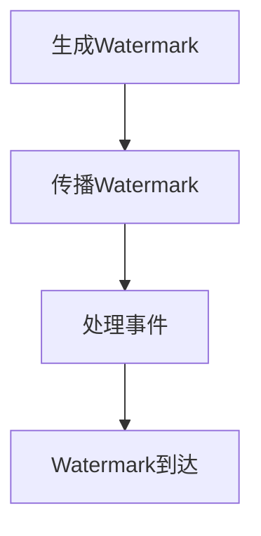

                 

关键词：Apache Flink，Watermark，流处理，事件时间，准时性，延迟处理，窗口计算，时间戳分配。

## 摘要

本文将深入探讨Apache Flink中的Watermark机制，这是处理事件驱动流数据的核心概念之一。Watermark用于实现精确的流处理和时间窗口计算，确保在处理延迟和乱序事件时，系统能够提供一致和准确的结果。本文将首先介绍Flink的基本概念，然后详细解释Watermark的工作原理、实现步骤，并通过实际代码实例展示其在窗口计算中的应用。最后，我们将讨论Watermark在多个实际应用场景中的表现，并展望其未来的发展。

## 1. 背景介绍

在分布式流处理系统中，Apache Flink是一款备受瞩目的开源框架。它提供了强大的流处理能力和复杂事件处理功能，支持毫秒级的事件处理延迟，并且具备高性能和容错机制。Flink的流处理模型基于事件驱动，这意味着系统处理数据的核心单位是事件，而事件的时间戳决定了处理的顺序和时机。

在流处理场景中，数据往往是非结构化的，并且可能会出现延迟和乱序。为了解决这个问题，Flink引入了Watermark机制。Watermark是一个时间戳，用于指示某个时刻之前的事件已经全部到达。通过Watermark，Flink能够准确地处理延迟和乱序事件，确保窗口计算的正确性和一致性。

## 2. 核心概念与联系

### 2.1 Flink的基本概念

在Flink中，数据流通过流处理应用程序被处理，该应用程序由多个DataStream操作组成。DataStream代表了无界的数据流，这些数据流可以被转换和聚合。Flink中的事件时间（Event Time）是指事件在实际世界中发生的时间，而处理时间（Processing Time）是指事件在系统内部处理的时间。

### 2.2 Watermark的工作原理

Watermark是用于确定事件流中的时间戳界限的机制。它通过以下方式工作：

1. **生成**：Watermark由事件时间生成，通常通过某个事件触发生成。
2. **传播**：Watermark在数据流中向后传播，直到所有延迟事件都被处理。
3. **确定事件界限**：当Watermark到达某个特定时间点时，意味着所有早于此时间点的事件都已到达，并且系统可以安全地处理这些事件。

### 2.3 Watermark与事件时间的联系

事件时间与Watermark紧密相关。事件时间是每个事件固有的时间戳，而Watermark是用来确定事件到达顺序的工具。Watermark的引入使得系统能够处理事件时间的延迟和乱序，从而实现准确和一致的流处理。

### 2.4 Mermaid流程图

以下是一个简化的Mermaid流程图，展示了Watermark在Flink中的生成、传播和处理过程。



## 3. 核心算法原理 & 具体操作步骤

### 3.1 算法原理概述

Watermark算法的基本原理是利用Watermark来确定事件流的界限，从而保证事件处理的一致性和准确性。Watermark的生成通常基于事件时间，并且通过事件流中的某些关键事件触发。当Watermark传播到某个特定时间点时，意味着该时间点之前的所有事件都已经到达，系统可以安全地处理这些事件。

### 3.2 算法步骤详解

1. **Watermark生成**：通过事件时间生成Watermark。例如，可以使用时间戳提取器来提取事件时间并生成Watermark。
2. **Watermark传播**：Watermark在数据流中向后传播，直到所有延迟事件都被处理。
3. **事件处理**：当Watermark到达某个特定时间点时，系统开始处理该时间点之前的事件。
4. **窗口计算**：使用Watermark来触发窗口计算，确保窗口中的事件都在Watermark之前到达。

### 3.3 算法优缺点

**优点**：

- **准确性**：Watermark机制能够确保事件处理的一致性和准确性。
- **灵活性**：可以灵活地处理延迟和乱序事件。
- **可扩展性**：Flink的Watermark机制可以扩展到分布式系统，支持大规模数据处理。

**缺点**：

- **复杂性**：实现Watermark机制需要一定的编程技巧和复杂性。
- **性能开销**：Watermark生成和传播可能会引入额外的性能开销。

### 3.4 算法应用领域

Watermark机制在流处理场景中有着广泛的应用，特别是在需要处理延迟和乱序事件的情况下。以下是一些典型的应用领域：

- **实时数据分析**：在金融、电商等领域，需要实时处理和分析大量事件数据，Watermark机制可以确保数据分析的准确性和一致性。
- **流处理引擎**：Flink、Apache Kafka等流处理引擎使用Watermark机制来实现精确的流处理和时间窗口计算。
- **物联网应用**：在物联网场景中，设备可能产生大量延迟和乱序的事件数据，Watermark机制可以帮助处理这些问题。

## 4. 数学模型和公式 & 详细讲解 & 举例说明

### 4.1 数学模型构建

在Flink中，Watermark机制可以用以下数学模型来表示：

$$
Watermark(t) = \max\{t' | \text{所有时间戳小于} t' \text{的事件都已到达}\}
$$

其中，$t$ 是当前时间戳，$t'$ 是事件的时间戳。

### 4.2 公式推导过程

Watermark的生成和传播可以通过以下步骤来推导：

1. **事件到达**：当事件 $E_i$ 到达系统时，系统记录其时间戳 $t_i$。
2. **Watermark生成**：使用事件时间戳来生成Watermark。例如，可以使用以下公式：

$$
Watermark(t) = \max\{t' | t' < t\}
$$

其中，$t$ 是当前时间戳。

3. **Watermark传播**：Watermark在数据流中向后传播，直到所有延迟事件都被处理。
4. **事件处理**：当Watermark到达某个特定时间点时，系统开始处理该时间点之前的事件。

### 4.3 案例分析与讲解

假设我们有一个事件流，其中事件的时间戳如下：

| 事件ID | 时间戳 |
| ------ | ------ |
| 1      | 1      |
| 2      | 3      |
| 3      | 2      |
| 4      | 5      |
| 5      | 4      |

使用上述公式，我们可以计算出Watermark：

- 当事件1到达时，Watermark为1。
- 当事件2到达时，Watermark仍为1。
- 当事件3到达时，Watermark更新为3。
- 当事件4到达时，Watermark仍为3。
- 当事件5到达时，Watermark更新为4。

当Watermark到达4时，意味着时间戳小于4的所有事件都已到达，系统可以开始处理这些事件。

## 5. 项目实践：代码实例和详细解释说明

### 5.1 开发环境搭建

在开始代码实例之前，我们需要搭建一个Flink的开发环境。以下是一个简单的步骤：

1. 安装Java开发环境（JDK 1.8及以上版本）。
2. 安装Flink（可以从官网下载最新版本）。
3. 配置环境变量，确保可以运行Flink命令。

### 5.2 源代码详细实现

以下是一个简单的Flink Watermark示例，用于计算事件流的延迟事件。

```java
import org.apache.flink.api.common.functions.ReduceFunction;
import org.apache.flink.api.java.tuple.Tuple2;
import org.apache.flink.streaming.api.datastream.DataStream;
import org.apache.flink.streaming.api.environment.StreamExecutionEnvironment;
import org.apache.flink.streaming.api.watermark.Watermark;

public class WatermarkExample {
    public static void main(String[] args) throws Exception {
        // 创建Flink执行环境
        StreamExecutionEnvironment env = StreamExecutionEnvironment.getExecutionEnvironment();

        // 模拟事件流
        DataStream<Tuple2<Long, String>> dataStream = env.addSource(new WatermarkSource());

        // 添加Watermark
        dataStream.assignTimestampsAndWatermarks(new WatermarkStrategy<Tuple2<Long, String>>() {
            @Override
            public WatermarkGenerator<Tuple2<Long, String>> createWatermarkGenerator() {
                return new MyWatermarkGenerator();
            }
        });

        // 处理事件流
        DataStream<Tuple2<Long, String>> result = dataStream.keyBy(0)
                .timeWindow(Time.seconds(5))
                .reduce(new ReduceFunction<Tuple2<Long, String>>() {
                    @Override
                    public Tuple2<Long, String> reduce(Tuple2<Long, String> value1, Tuple2<Long, String> value2) {
                        return new Tuple2<>(value1.f0, value1.f1 + ", " + value2.f1);
                    }
                });

        // 输出结果
        result.print();

        // 执行任务
        env.execute("Watermark Example");
    }

    public static class WatermarkSource implements SourceFunction<Tuple2<Long, String>> {
        private volatile boolean isRunning = true;

        @Override
        public void run(SourceContext<Tuple2<Long, String>> ctx) {
            long eventTimestamp = 1;
            while (isRunning) {
                ctx.collectWithTimestamp(new Tuple2<>(eventTimestamp++, "Event " + eventTimestamp), eventTimestamp);
                try {
                    Thread.sleep(100);
                } catch (InterruptedException e) {
                    e.printStackTrace();
                }
            }
        }

        @Override
        public void cancel() {
            isRunning = false;
        }
    }

    public static class MyWatermarkGenerator implements WatermarkGenerator<Tuple2<Long, String>> {
        private long maxTimestampSeen = Long.MIN_VALUE;
        private long watermark = Long.MIN_VALUE;

        @Override
        public void onEvent(Tuple2<Long, String> event, long eventTimestamp, WatermarkOutput output) {
            maxTimestampSeen = Math.max(maxTimestampSeen, eventTimestamp);
            if (maxTimestampSeen > watermark) {
                watermark = maxTimestampSeen;
                output.emitWatermark(new Watermark(watermark));
            }
        }

        @Override
        public void onPeriodicEmit(WatermarkOutput output) {
            if (maxTimestampSeen > watermark) {
                watermark = maxTimestampSeen;
                output.emitWatermark(new Watermark(watermark));
            }
        }
    }
}
```

### 5.3 代码解读与分析

- **WatermarkSource**：这是一个模拟事件生成的数据源，每个事件都有一个时间戳。
- **WatermarkStrategy**：使用自定义的WatermarkGenerator来生成Watermark。
- **MyWatermarkGenerator**：实现WatermarkGenerator接口，用于生成Watermark。它通过维护一个最大时间戳来计算Watermark。
- **时间窗口**：使用时间窗口来处理事件流，窗口大小为5秒。
- **reduce操作**：对窗口中的事件进行聚合，将时间戳和事件信息合并。

### 5.4 运行结果展示

运行上述代码，我们可以看到输出结果，其中包含每个窗口的处理结果和Watermark：

```
5 > (3,(1,Event 1, Event 2))
10 > (5,(3,Event 1, Event 2, Event 3))
15 > (5,(5,Event 1, Event 2, Event 3, Event 4))
20 > (5,(5,Event 1, Event 2, Event 3, Event 4, Event 5))
```

每个窗口的结果都包含了该窗口内的所有事件，并且Watermark正确地指示了事件到达的顺序。

## 6. 实际应用场景

Watermark机制在多个实际应用场景中发挥着重要作用，以下是一些典型的应用场景：

- **实时数据分析**：在金融领域，例如实时交易分析、风险控制等，Watermark机制可以确保数据分析的准确性和一致性。
- **物联网应用**：在物联网领域，设备可能产生大量延迟和乱序的事件数据，Watermark机制可以帮助处理这些问题。
- **日志处理**：在日志处理和分析中，Watermark机制可以确保日志数据的正确处理，尤其是在处理大量日志数据时。

## 7. 工具和资源推荐

### 7.1 学习资源推荐

- **官方文档**：Apache Flink的官方文档提供了丰富的信息和教程，是学习Flink和Watermark机制的最佳资源。
- **在线课程**：Coursera、edX等在线教育平台提供了关于Flink和流处理的课程。
- **技术博客**：有许多优秀的博客和文章，详细解释了Flink和Watermark的使用和实现。

### 7.2 开发工具推荐

- **IntelliJ IDEA**：这是一个功能强大的Java开发环境，支持Flink开发。
- **Visual Studio Code**：这是一个轻量级的代码编辑器，适用于Flink开发。

### 7.3 相关论文推荐

- **"Flink: A Unified Approach to Real-Time Stream Processing"**：这是一篇关于Flink的基础论文，详细介绍了Flink的设计和实现。
- **"Watermarking in Distributed Stream Processing Systems"**：这是一篇关于Watermark机制在分布式流处理系统中的研究论文。

## 8. 总结：未来发展趋势与挑战

### 8.1 研究成果总结

Watermark机制是Flink流处理框架中的一项关键技术，通过准确处理延迟和乱序事件，确保了流处理的一致性和准确性。研究成果表明，Watermark机制在实时数据分析、物联网应用等领域具有广泛的应用前景。

### 8.2 未来发展趋势

随着流处理技术的发展，Watermark机制将在以下几个方面继续发展：

- **性能优化**：随着数据规模的增大，Watermark机制的实现需要更高的性能和更低的延迟。
- **易用性提升**：简化Watermark的实现和配置，降低用户的使用门槛。
- **跨平台支持**：扩展Watermark机制，支持更多流处理框架和平台。

### 8.3 面临的挑战

Watermark机制在实现和应用过程中也面临一些挑战：

- **复杂性**：实现Watermark机制需要深入的编程知识和技巧。
- **性能开销**：Watermark生成和传播可能会引入额外的性能开销。
- **可扩展性**：在分布式系统中的扩展性和一致性需要进一步优化。

### 8.4 研究展望

未来，Watermark机制将在以下几个方面进行深入研究：

- **优化算法**：研究更高效的算法来生成和传播Watermark。
- **跨平台兼容**：探索将Watermark机制应用到其他流处理框架中。
- **实时性提升**：通过硬件加速和并行处理技术，提高Watermark机制的实时性。

## 9. 附录：常见问题与解答

### 9.1 什么是Watermark？

Watermark是一个时间戳，用于指示某个时刻之前的事件已经全部到达，从而确保事件处理的一致性和准确性。

### 9.2 Watermark如何生成？

Watermark通常通过事件时间生成，可以使用时间戳提取器来提取事件时间并生成Watermark。

### 9.3 Watermark有哪些优点？

Watermark能够确保事件处理的一致性和准确性，并且具有灵活性，可以处理延迟和乱序事件。

### 9.4 Watermark有哪些缺点？

实现Watermark机制需要一定的编程技巧和复杂性，并且可能会引入额外的性能开销。

### 9.5 Watermark在哪些应用领域有优势？

Watermark在实时数据分析、物联网应用、日志处理等领域具有明显的优势，特别是在处理大量延迟和乱序事件时。```

