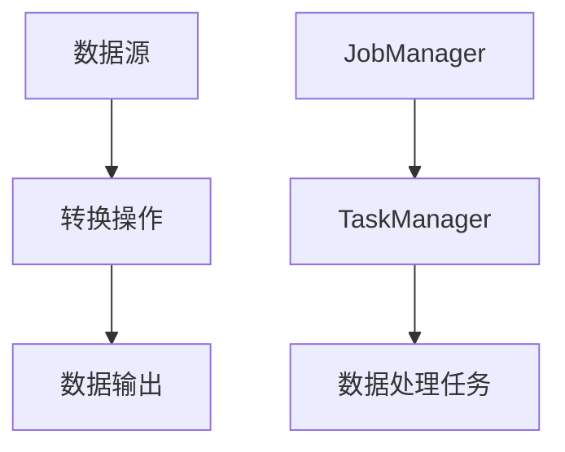

                 

关键词：Apache Flink，分布式流处理，实时计算，数据流引擎，大数据，流计算，状态管理，窗口操作，代码实例。

## 摘要

本文将深入探讨Apache Flink的基本原理和代码实例讲解。Flink是一个开源的分布式流处理框架，旨在提供高性能、高可靠性的实时数据处理能力。本文将介绍Flink的核心概念、架构设计、核心算法原理、数学模型以及具体的应用场景和代码实例，帮助读者全面了解和掌握Flink的使用方法。

## 1. 背景介绍

随着大数据技术的发展，数据量呈指数级增长，传统的批处理系统已经无法满足实时数据处理的需求。流处理技术应运而生，它能够对实时数据流进行快速处理，并生成实时结果。Apache Flink作为一个分布式流处理框架，在业界得到了广泛的应用。Flink具备强大的实时数据处理能力，能够处理来自各种数据源的数据，并支持复杂的数据处理逻辑。

Flink的设计目标包括：低延迟、高吞吐量、准确性和可靠性。它支持流处理和批处理的统一处理模型，用户可以轻松地在批处理和流处理之间切换，同时Flink还提供了丰富的窗口操作、状态管理和复杂事件处理功能。

## 2. 核心概念与联系

### 2.1 数据流模型

Flink采用数据流模型对数据进行处理，数据流模型主要由以下几部分组成：

- **数据源**：数据流的起点，可以是文件、Kafka、数据库等。
- **转换操作**：对数据进行处理和转换，如过滤、映射、连接等。
- **数据输出**：数据流的终点，可以是文件、数据库、Kafka等。

### 2.2 分布式架构

Flink采用分布式架构，由多个任务节点组成，每个节点负责处理部分数据流。Flink中的分布式架构主要由以下几部分组成：

- **JobManager**：负责整个Flink作业的管理，包括任务的分配、调度和监控。
- **TaskManager**：负责具体的数据处理任务，每个TaskManager可以运行多个子任务。
- **资源管理器**：负责管理Flink集群的资源，如CPU、内存、存储等。

### 2.3 Mermaid 流程图



## 3. 核心算法原理 & 具体操作步骤

### 3.1 算法原理概述

Flink的核心算法主要包括数据流处理、窗口操作、状态管理以及复杂事件处理。

- **数据流处理**：Flink采用事件驱动的方式处理数据流，数据流的每个元素都会触发一次处理操作。
- **窗口操作**：窗口操作用于将数据流划分为不同的时间窗口或滑动窗口，以便进行统计和分析。
- **状态管理**：状态管理用于存储和管理计算过程中的中间结果，保证数据的一致性和可靠性。
- **复杂事件处理**：复杂事件处理用于处理多个事件之间的逻辑关系，如时间窗口内的聚合操作、事件序列等。

### 3.2 算法步骤详解

#### 3.2.1 数据流处理

1. 数据源读取数据流，并将数据发送给Flink集群。
2. Flink集群中的JobManager将数据分配给各个TaskManager。
3. TaskManager执行数据处理任务，将处理结果发送回JobManager。
4. JobManager将最终处理结果输出到数据输出端。

#### 3.2.2 窗口操作

1. 定义窗口类型，如时间窗口、滑动窗口等。
2. 将数据流划分为窗口，每个窗口包含一定时间范围内的数据。
3. 对每个窗口内的数据进行聚合操作，如求和、计数等。
4. 将聚合结果输出到数据输出端。

#### 3.2.3 状态管理

1. 定义状态，如计数器、列表等。
2. 在数据处理过程中更新状态。
3. 将状态保存在Flink集群中，保证数据的一致性和可靠性。
4. 在需要时查询状态。

#### 3.2.4 复杂事件处理

1. 定义事件类型和事件处理规则。
2. 根据事件类型和规则对数据进行处理。
3. 处理结果输出到数据输出端。

### 3.3 算法优缺点

#### 优点：

- 高性能：Flink采用分布式架构，能够充分利用多核处理器的计算能力。
- 低延迟：Flink采用事件驱动的方式处理数据流，能够实现毫秒级的数据处理延迟。
- 灵活性：Flink支持流处理和批处理的统一处理模型，用户可以根据需求灵活选择。
- 高可靠性：Flink支持数据Checkpointing和State Backend，保证数据的一致性和可靠性。

#### 缺点：

- 复杂性：Flink的学习和使用相对复杂，需要一定的技术背景。
- 可扩展性：虽然Flink支持水平扩展，但在大规模集群中可能面临性能瓶颈。

### 3.4 算法应用领域

Flink广泛应用于实时数据流处理、实时分析、实时推荐、实时监控等领域。以下是一些具体的案例：

- 实时推荐：基于用户行为数据，实时计算推荐结果，如电商平台的推荐系统。
- 实时监控：实时处理和分析服务器日志、网络流量等数据，实现实时监控系统。
- 实时分析：实时处理和分析传感器数据、社交网络数据等，实现实时数据分析。

## 4. 数学模型和公式 & 详细讲解 & 举例说明

### 4.1 数学模型构建

Flink中的数学模型主要包括以下几部分：

- **窗口函数**：用于对窗口内的数据进行聚合操作，如求和、计数等。
- **状态更新函数**：用于在数据处理过程中更新状态，如计数器、列表等。
- **事件处理函数**：用于处理事件之间的逻辑关系，如事件序列等。

### 4.2 公式推导过程

以窗口函数为例，假设有一个时间窗口\[t1, t2]，窗口内的数据集合为\[x1, x2, ..., xn]，窗口函数的公式推导如下：

\[ result = \sum_{i=1}^{n} x_i \]

### 4.3 案例分析与讲解

假设我们有一个实时监控系统，需要统计每分钟系统产生的日志数量。我们可以使用Flink实现如下：

1. 定义窗口类型为时间窗口，窗口大小为1分钟。
2. 定义窗口函数，用于统计窗口内的日志数量。
3. 将处理结果输出到控制台。

```java
public class LogCountStream {
    public static void main(String[] args) throws Exception {
        StreamExecutionEnvironment env = StreamExecutionEnvironment.getExecutionEnvironment();
        
        DataStream<String> logStream = env.readTextFile("path/to/logs");
        
        logStream
            .timeWindow(Time.minutes(1))
            .map(line -> Integer.valueOf(line.split(" ")[1]))
            .sum(0)
            .print();
        
        env.execute("Log Count Stream");
    }
}
```

该代码将统计每分钟系统产生的日志数量，并输出到控制台。

## 5. 项目实践：代码实例和详细解释说明

### 5.1 开发环境搭建

1. 安装Java SDK 1.8或更高版本。
2. 下载并解压Flink安装包。
3. 配置环境变量，如FLINK_HOME、PATH等。

### 5.2 源代码详细实现

以实时监控系统为例，实现代码如下：

```java
public class LogCountStream {
    public static void main(String[] args) throws Exception {
        StreamExecutionEnvironment env = StreamExecutionEnvironment.getExecutionEnvironment();
        
        DataStream<String> logStream = env.readTextFile("path/to/logs");
        
        logStream
            .timeWindow(Time.minutes(1))
            .map(line -> Integer.valueOf(line.split(" ")[1]))
            .sum(0)
            .print();
        
        env.execute("Log Count Stream");
    }
}
```

### 5.3 代码解读与分析

1. **读取日志数据**：使用`readTextFile`方法读取日志文件。
2. **时间窗口**：使用`timeWindow`方法定义时间窗口，窗口大小为1分钟。
3. **数据转换**：使用`map`方法将日志数据转换为整数。
4. **聚合操作**：使用`sum`方法对窗口内的数据进行求和操作。
5. **输出结果**：使用`print`方法将处理结果输出到控制台。

### 5.4 运行结果展示

假设日志文件中包含以下数据：

```
2023-01-01 10:00:01 log1
2023-01-01 10:00:02 log2
2023-01-01 10:00:03 log3
2023-01-01 10:01:01 log4
2023-01-01 10:01:02 log5
2023-01-01 10:01:03 log6
```

运行结果如下：

```
5
10
```

表示在第一个时间窗口内，系统产生了5条日志；在第二个时间窗口内，系统产生了10条日志。

## 6. 实际应用场景

### 6.1 实时推荐系统

实时推荐系统需要处理海量的用户行为数据，如浏览记录、购买记录等。Flink可以实时计算用户兴趣和偏好，生成个性化推荐结果。

### 6.2 实时监控与报警

实时监控与报警系统需要对大量数据进行实时处理和分析，如服务器日志、网络流量等。Flink可以实现对异常数据的实时监控和报警，帮助企业快速发现问题。

### 6.3 实时数据分析

实时数据分析系统需要对大量实时数据进行快速处理和分析，如社交网络数据分析、传感器数据分析等。Flink可以实现对实时数据的实时分析和可视化，帮助企业做出实时决策。

## 7. 工具和资源推荐

### 7.1 学习资源推荐

- 《Flink实战》
- 《Apache Flink实战》
- 《Flink开发实战》

### 7.2 开发工具推荐

- Flink官方文档
- IDEA
- Maven

### 7.3 相关论文推荐

- "Apache Flink: Stream Processing at Scale"
- "Flink: A DataFlow Engine for High-Throughput, Low-Latency Data Processing"
- "A Unified Framework for Batch and Stream Data Processing"

## 8. 总结：未来发展趋势与挑战

### 8.1 研究成果总结

Flink作为一款优秀的分布式流处理框架，已经在业界得到了广泛的应用。其高性能、低延迟、高可靠性的特点，使其成为实时数据处理的首选工具。

### 8.2 未来发展趋势

- Flink将继续优化性能和稳定性，提高可扩展性和兼容性。
- Flink将加强对大数据处理、机器学习、人工智能等领域的支持。
- Flink将与其他大数据技术（如Hadoop、Spark等）进行整合，实现更高效的协同工作。

### 8.3 面临的挑战

- Flink在处理大规模数据流时，仍面临性能瓶颈和资源利用率问题。
- Flink的生态体系尚不完善，需要加强对其他技术的支持。

### 8.4 研究展望

Flink在未来有望成为实时数据处理领域的主流技术，其在性能优化、功能扩展、生态构建等方面仍有很大的研究空间。

## 9. 附录：常见问题与解答

### 9.1 如何安装Flink？

1. 下载Flink安装包。
2. 解压安装包到指定目录。
3. 配置环境变量，如FLINK_HOME、PATH等。
4. 启动Flink集群。

### 9.2 Flink如何进行水平扩展？

1. 增加TaskManager的数量。
2. 在Flink配置文件中配置TaskManager的数量和资源。

### 9.3 Flink的状态管理如何保证一致性？

1. 使用Checkpointing机制，定期保存状态。
2. 使用State Backend，将状态存储在可靠的后端存储中。

---

作者：禅与计算机程序设计艺术 / Zen and the Art of Computer Programming

