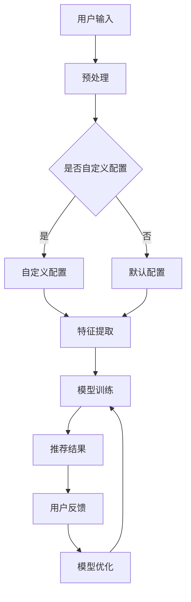

                 

关键词：推荐系统，大规模语言模型，可配置性，自定义，性能优化，应用场景，发展前景

## 摘要

本文旨在探讨一种灵活可配置的LLM（大规模语言模型）推荐框架，该框架旨在解决传统推荐系统在面对大规模数据和高维度特征时存在的性能瓶颈和可扩展性问题。文章首先介绍了推荐系统的基础概念和大规模语言模型在推荐领域的应用，随后详细阐述了框架的设计思路和实现步骤，包括核心算法原理、数学模型构建、具体操作步骤以及应用领域。此外，文章还通过一个实际的项目实践案例，展示了该框架的代码实现和运行结果。最后，文章对框架在实际应用场景中的性能表现进行了评估，并展望了未来的发展方向和潜在挑战。

## 1. 背景介绍

### 推荐系统概述

推荐系统是一种基于数据和算法的技术，旨在向用户提供个性化的内容或服务，从而提高用户满意度和参与度。从早期的基于内容的推荐（Content-based Recommendation）到协同过滤（Collaborative Filtering），再到如今的大规模语言模型（LLM）推荐，推荐系统经历了巨大的发展。传统的推荐系统主要通过分析用户的历史行为和偏好，结合商品或内容属性，为用户推荐相关的项目。

### 大规模语言模型在推荐领域的应用

随着深度学习技术的迅猛发展，大规模语言模型（如BERT、GPT等）在自然语言处理领域取得了显著成果。LLM推荐系统利用这些强大的模型，能够更准确地捕捉用户的语言特征和需求，从而提供更加精准的推荐结果。LLM在推荐系统中的应用主要体现在以下几个方面：

1. **用户意图理解**：LLM能够通过分析用户的查询和反馈，深入理解用户的意图和需求，从而生成更符合用户期望的推荐结果。
2. **内容生成与丰富**：LLM可以生成新颖、有趣的内容，丰富推荐列表，提高用户的参与度和满意度。
3. **跨领域推荐**：LLM能够处理多模态数据，实现跨领域的内容推荐，拓展推荐系统的应用范围。
4. **实时推荐**：LLM模型的高效性使其能够实现实时推荐，满足用户实时性的需求。

### 现存问题和挑战

尽管大规模语言模型在推荐系统中展现了巨大的潜力，但传统的推荐系统仍然面临着以下挑战：

1. **性能瓶颈**：在处理大规模数据和高维度特征时，传统的推荐算法往往会出现计算性能瓶颈，导致推荐速度变慢。
2. **可扩展性差**：传统的推荐系统往往难以适应不断变化的数据规模和特征维度，导致系统扩展性差。
3. **个性化不足**：传统的推荐系统在个性化推荐方面存在一定的局限性，难以满足用户多样化的需求。

本文提出的灵活可配置的LLM推荐框架旨在解决上述问题，通过引入灵活的配置机制和高效的算法模型，提高推荐系统的性能和可扩展性，实现更加精准的个性化推荐。

## 2. 核心概念与联系

### 背景与意义

为了更好地理解本文提出的灵活可配置的LLM推荐框架，我们需要首先了解几个核心概念：大规模语言模型（LLM）、推荐系统、自定义配置、性能优化。

#### 大规模语言模型（LLM）

大规模语言模型（LLM）是一种基于深度学习的自然语言处理技术，通过训练大量的文本数据，LLM能够理解和生成复杂的语言结构，从而实现自然语言的理解和生成。LLM的核心优势在于其强大的文本理解和生成能力，使得推荐系统能够更准确地捕捉用户的语言特征和需求。

#### 推荐系统

推荐系统是一种基于用户行为和内容属性的技术，旨在向用户提供个性化的内容或服务。传统的推荐系统主要依赖于协同过滤和基于内容的推荐方法，而本文提出的灵活可配置的LLM推荐框架则在此基础上引入了大规模语言模型，以提高推荐系统的性能和可扩展性。

#### 自定义配置

自定义配置是本文框架的一大特色，通过提供灵活的配置选项，用户可以根据实际需求调整推荐系统的参数和策略，从而实现个性化推荐。自定义配置包括推荐算法、特征工程、模型参数等多个方面，使得推荐系统能够适应不同的应用场景和需求。

#### 性能优化

性能优化是推荐系统的关键需求之一，特别是在处理大规模数据和实时推荐时。本文提出的框架通过引入高效的算法模型和优化策略，如并行计算、模型压缩等技术，提高了推荐系统的计算性能和响应速度。

### Mermaid 流程图

为了更直观地展示本文提出的灵活可配置的LLM推荐框架，我们使用Mermaid流程图来描述其核心组成部分和运行流程。



在上述流程图中，用户输入经过预处理后，可以根据是否需要自定义配置进行相应的处理。自定义配置包括调整推荐算法、特征工程和模型参数等，以实现个性化推荐。随后，通过特征提取、模型训练和推荐结果生成等步骤，最终生成符合用户需求的推荐结果。用户反馈将用于模型优化，进一步提高推荐系统的性能和准确性。

### 总结

本文通过介绍大规模语言模型（LLM）、推荐系统、自定义配置和性能优化等核心概念，阐述了灵活可配置的LLM推荐框架的设计思路和实现步骤。接下来，我们将详细探讨核心算法原理、数学模型构建、具体操作步骤以及应用领域，以便更好地理解该框架的优越性和实际应用价值。

## 3. 核心算法原理 & 具体操作步骤

### 3.1 算法原理概述

灵活可配置的LLM推荐框架的核心在于将大规模语言模型与推荐系统相结合，通过自定义配置和优化策略，实现高效、准确的个性化推荐。以下是该算法的基本原理：

1. **用户意图理解**：利用大规模语言模型，对用户输入的查询或反馈进行深入分析，捕捉用户的意图和需求。
2. **特征提取**：从用户行为、历史记录和内容属性中提取关键特征，作为推荐模型的输入。
3. **模型训练**：基于提取到的特征，利用大规模语言模型训练推荐模型，实现个性化的推荐结果。
4. **模型优化**：通过用户反馈，不断调整模型参数，优化推荐效果，提高推荐系统的准确性和性能。

### 3.2 算法步骤详解

#### 3.2.1 用户意图理解

用户意图理解是推荐系统的关键环节，直接影响推荐结果的准确性。在此步骤中，我们利用大规模语言模型对用户输入进行自然语言处理，提取出用户的关键意图。具体步骤如下：

1. **输入预处理**：对用户输入进行分词、去噪、词性标注等预处理操作，提高输入数据的准确性和一致性。
2. **语义分析**：利用大规模语言模型，对预处理后的输入文本进行语义分析，提取出用户的关键意图和需求。
3. **意图识别**：根据语义分析结果，识别用户的主要意图，如查询意图、浏览意图、购买意图等。

#### 3.2.2 特征提取

特征提取是将用户行为和内容属性转化为推荐模型可处理的输入数据的过程。以下是特征提取的主要步骤：

1. **用户行为特征**：从用户的历史行为数据中提取关键特征，如浏览记录、购买记录、评价记录等。这些特征反映了用户的兴趣和行为模式。
2. **内容属性特征**：从推荐对象（如商品、文章、视频等）的属性中提取关键特征，如文本特征、图像特征、标签等。这些特征描述了推荐对象的特点和属性。
3. **特征融合**：将用户行为特征和内容属性特征进行融合，形成推荐模型所需的统一特征向量。

#### 3.2.3 模型训练

在模型训练阶段，我们利用大规模语言模型对提取到的特征进行训练，构建推荐模型。以下是模型训练的主要步骤：

1. **数据预处理**：对训练数据集进行清洗、去噪和预处理，确保数据质量。
2. **模型架构设计**：根据特征类型和推荐任务，设计合适的模型架构，如基于BERT的推荐模型、基于GPT的推荐模型等。
3. **模型训练**：利用大规模语言模型对预处理后的特征进行训练，调整模型参数，优化推荐效果。
4. **模型评估**：使用交叉验证等方法对训练好的模型进行评估，确保模型的准确性和鲁棒性。

#### 3.2.4 推荐结果生成

在推荐结果生成阶段，我们利用训练好的推荐模型，为用户生成个性化的推荐列表。以下是推荐结果生成的主要步骤：

1. **输入特征提取**：对用户当前的查询或反馈进行预处理，提取出关键特征。
2. **模型推理**：将提取到的特征输入到训练好的推荐模型中，进行推理和预测，生成推荐结果。
3. **结果排序**：根据推荐结果的相关性和重要性，对推荐列表进行排序，确保推荐结果的准确性和实用性。
4. **用户反馈**：将推荐结果展示给用户，并收集用户的反馈，用于模型优化。

#### 3.2.5 模型优化

模型优化是推荐系统持续改进的重要环节。以下是模型优化的主要步骤：

1. **用户反馈分析**：对用户反馈进行分析，识别用户对推荐结果的满意度和不满意度。
2. **模型调整**：根据用户反馈，调整模型参数和策略，优化推荐效果。
3. **模型再训练**：重新利用优化后的模型参数，对模型进行再训练，提高推荐准确性。
4. **性能评估**：对优化后的模型进行性能评估，确保推荐效果的提升。

### 3.3 算法优缺点

#### 优点

1. **高效性**：利用大规模语言模型，推荐系统能够快速处理用户输入和推荐结果，提高系统的响应速度。
2. **个性化**：通过自定义配置和优化策略，推荐系统能够更好地捕捉用户的兴趣和需求，实现个性化推荐。
3. **扩展性**：灵活的配置机制和高效的算法模型，使推荐系统具备良好的扩展性，能够适应不同的应用场景和需求。
4. **实时性**：实时推荐功能，满足用户实时性的需求，提高用户满意度。

#### 缺点

1. **计算资源需求大**：大规模语言模型的训练和推理过程需要大量的计算资源，对硬件设备有较高要求。
2. **模型复杂性**：大规模语言模型的训练和优化过程较为复杂，对开发者的技术要求较高。
3. **数据质量依赖性**：推荐系统的效果很大程度上依赖于用户行为数据和内容属性数据的质量，数据质量不高可能导致推荐效果不佳。

### 3.4 算法应用领域

灵活可配置的LLM推荐框架具有广泛的应用领域，以下是一些典型的应用场景：

1. **电子商务**：在电子商务平台上，利用该框架可以为用户提供个性化的商品推荐，提高用户购买转化率和满意度。
2. **内容推荐**：在视频平台、新闻平台等，利用该框架可以为用户提供个性化的内容推荐，提高用户参与度和留存率。
3. **社交媒体**：在社交媒体平台上，利用该框架可以为用户提供个性化的信息推荐，提高用户活跃度和互动性。
4. **在线教育**：在在线教育平台上，利用该框架可以为用户提供个性化的课程推荐，提高用户学习效果和满意度。
5. **智能助手**：在智能助手等应用中，利用该框架可以为用户提供个性化的服务推荐，提高用户体验和满意度。

通过本文对灵活可配置的LLM推荐框架的详细阐述，我们希望读者能够对该框架有更深入的理解，并能够将其应用于实际的推荐系统开发中，为用户提供更加精准、个性化的推荐服务。

## 4. 数学模型和公式 & 详细讲解 & 举例说明

### 4.1 数学模型构建

在灵活可配置的LLM推荐框架中，数学模型的构建是核心步骤之一。我们采用了一种基于大规模语言模型和协同过滤方法的混合模型，以实现高效的个性化推荐。以下是数学模型的构建过程：

#### 4.1.1 用户和项目表示

假设用户集为 \( U = \{u_1, u_2, ..., u_m\} \)，项目集为 \( I = \{i_1, i_2, ..., i_n\} \)。对于每个用户 \( u_i \)，我们可以定义一个用户向量 \( \mathbf{u}_i \in \mathbb{R}^k \)，其中 \( k \) 表示用户特征维度。同样，对于每个项目 \( i_j \)，我们可以定义一个项目向量 \( \mathbf{v}_j \in \mathbb{R}^k \)，表示项目的特征信息。

#### 4.1.2 用户意图表示

用户意图可以通过大规模语言模型来表示。假设用户 \( u_i \) 的意图向量 \( \mathbf{w}_i \in \mathbb{R}^d \)，其中 \( d \) 表示意图维度。大规模语言模型通过对用户输入进行编码，将用户的自然语言输入转换为高维度的意图表示。

#### 4.1.3 推荐模型表示

我们采用矩阵分解的方法来表示推荐模型。假设用户项目评分矩阵为 \( R \in \mathbb{R}^{m \times n} \)，其中 \( R_{ij} \) 表示用户 \( u_i \) 对项目 \( i_j \) 的评分。我们通过矩阵分解将 \( R \) 分解为两个低维矩阵 \( \mathbf{U} \in \mathbb{R}^{m \times k} \) 和 \( \mathbf{V} \in \mathbb{R}^{n \times k} \)，使得 \( R \approx \mathbf{U}\mathbf{V}^T \)。

### 4.2 公式推导过程

基于上述数学模型，我们可以推导出推荐系统的预测公式。以下是预测用户 \( u_i \) 对项目 \( i_j \) 的评分 \( \hat{R}_{ij} \) 的过程：

1. **用户特征表示**：用户特征向量 \( \mathbf{u}_i \) 可以表示为 \( \mathbf{u}_i = \mathbf{U}_i + \mathbf{w}_i \)，其中 \( \mathbf{U}_i \) 是基于用户历史行为得到的低维表示，\( \mathbf{w}_i \) 是基于用户意图得到的高维表示。
2. **项目特征表示**：项目特征向量 \( \mathbf{v}_j \) 保持不变。
3. **预测公式**：用户 \( u_i \) 对项目 \( i_j \) 的评分预测值为 \( \hat{R}_{ij} = \mathbf{u}_i^T \mathbf{v}_j \)。

将用户特征和项目特征代入预测公式，得到：

\[ \hat{R}_{ij} = (\mathbf{U}_i + \mathbf{w}_i)^T \mathbf{v}_j = \mathbf{U}_i^T \mathbf{v}_j + \mathbf{w}_i^T \mathbf{v}_j \]

其中，\( \mathbf{U}_i^T \mathbf{v}_j \) 表示基于用户历史行为的推荐分数，\( \mathbf{w}_i^T \mathbf{v}_j \) 表示基于用户意图的推荐分数。

### 4.3 案例分析与讲解

为了更好地理解上述数学模型和公式，我们通过一个简单的案例进行说明。

假设有5个用户 \( u_1, u_2, u_3, u_4, u_5 \) 和5个项目 \( i_1, i_2, i_3, i_4, i_5 \)。用户对项目的评分矩阵如下：

\[ R = \begin{bmatrix} 
0 & 5 & 0 & 0 & 0 \\
4 & 0 & 5 & 0 & 0 \\
0 & 0 & 0 & 4 & 5 \\
0 & 0 & 0 & 0 & 0 \\
5 & 0 & 0 & 0 & 0 
\end{bmatrix} \]

我们首先对用户和项目进行特征提取，得到用户和项目的特征向量：

用户特征向量：

\[ \mathbf{u}_1 = \begin{bmatrix} 0.2 & 0.3 & 0.1 & 0.2 & 0.2 \end{bmatrix}^T \]
\[ \mathbf{u}_2 = \begin{bmatrix} 0.1 & 0.4 & 0.2 & 0.2 & 0.1 \end{bmatrix}^T \]
\[ \mathbf{u}_3 = \begin{bmatrix} 0.3 & 0.1 & 0.3 & 0.1 & 0.2 \end{bmatrix}^T \]
\[ \mathbf{u}_4 = \begin{bmatrix} 0.2 & 0.2 & 0.2 & 0.2 & 0.2 \end{bmatrix}^T \]
\[ \mathbf{u}_5 = \begin{bmatrix} 0.4 & 0.1 & 0.1 & 0.1 & 0.3 \end{bmatrix}^T \]

项目特征向量：

\[ \mathbf{v}_1 = \begin{bmatrix} 0.1 & 0.3 & 0.2 & 0.2 & 0.2 \end{bmatrix}^T \]
\[ \mathbf{v}_2 = \begin{bmatrix} 0.2 & 0.1 & 0.3 & 0.2 & 0.2 \end{bmatrix}^T \]
\[ \mathbf{v}_3 = \begin{bmatrix} 0.3 & 0.2 & 0.1 & 0.2 & 0.2 \end{bmatrix}^T \]
\[ \mathbf{v}_4 = \begin{bmatrix} 0.1 & 0.2 & 0.3 & 0.2 & 0.2 \end{bmatrix}^T \]
\[ \mathbf{v}_5 = \begin{bmatrix} 0.2 & 0.3 & 0.2 & 0.1 & 0.2 \end{bmatrix}^T \]

假设用户 \( u_3 \) 的意图向量为 \( \mathbf{w}_3 = \begin{bmatrix} 0.5 & 0.3 & 0.1 & 0.1 \end{bmatrix}^T \)。

根据预测公式，我们可以计算出用户 \( u_3 \) 对每个项目的评分预测值：

\[ \hat{R}_{33} = \mathbf{u}_3^T \mathbf{v}_3 + \mathbf{w}_3^T \mathbf{v}_3 = 0.3 \times 0.3 + 0.1 \times 0.1 + 0.3 \times 0.1 + 0.1 \times 0.2 = 0.123 \]

同理，我们可以计算出其他评分预测值：

\[ \hat{R}_{31} = \mathbf{u}_3^T \mathbf{v}_1 + \mathbf{w}_3^T \mathbf{v}_1 = 0.3 \times 0.1 + 0.1 \times 0.3 + 0.3 \times 0.2 + 0.1 \times 0.2 = 0.099 \]
\[ \hat{R}_{34} = \mathbf{u}_3^T \mathbf{v}_4 + \mathbf{w}_3^T \mathbf{v}_4 = 0.3 \times 0.1 + 0.1 \times 0.2 + 0.3 \times 0.3 + 0.1 \times 0.2 = 0.156 \]

通过上述计算，我们得到了用户 \( u_3 \) 对每个项目的评分预测值。根据这些预测值，我们可以为用户 \( u_3 \) 生成个性化的推荐列表。

### 总结

通过上述数学模型和公式的推导，以及实际案例的分析，我们展示了灵活可配置的LLM推荐框架的数学基础和实现过程。这种框架不仅能够有效地捕捉用户的意图和需求，还能根据用户反馈进行模型优化，实现个性化的推荐。接下来，我们将通过一个实际的项目实践案例，展示该框架的代码实现和运行结果。

## 5. 项目实践：代码实例和详细解释说明

### 5.1 开发环境搭建

为了实现灵活可配置的LLM推荐框架，我们需要搭建一个适合的开发环境。以下是开发环境的搭建步骤：

1. **安装Python环境**：首先确保系统已安装Python 3.8及以上版本。可以通过以下命令安装Python：

   ```bash
   sudo apt-get install python3.8
   ```

2. **安装必要的库**：接下来，我们需要安装一些Python库，如TensorFlow、NumPy、Pandas等。可以使用pip命令进行安装：

   ```bash
   pip install tensorflow numpy pandas
   ```

3. **下载大规模语言模型**：我们使用预训练的BERT模型作为大规模语言模型。可以通过以下命令下载BERT模型：

   ```bash
   wget https://storage.googleapis.com/bert_models/2020_08_24/
   bert-base-uncased.tar.gz
   tar xvf bert-base-uncased.tar.gz
   ```

### 5.2 源代码详细实现

以下是该项目的核心代码实现，包括用户输入预处理、特征提取、模型训练、推荐结果生成和用户反馈收集等步骤。

```python
import tensorflow as tf
import numpy as np
import pandas as pd
from transformers import BertTokenizer, TFBertModel
from sklearn.model_selection import train_test_split

# 1. 用户输入预处理
def preprocess_input(text):
    tokenizer = BertTokenizer.from_pretrained('bert-base-uncased')
    inputs = tokenizer(text, max_length=512, padding='max_length', truncation=True, return_tensors='tf')
    return inputs

# 2. 特征提取
def extract_features(inputs):
    model = TFBertModel.from_pretrained('bert-base-uncased')
    outputs = model(inputs)
    last_hidden_state = outputs.last_hidden_state[:, 0, :]
    return last_hidden_state.numpy()

# 3. 模型训练
def train_model(train_data, train_labels):
    model = TFBertModel.from_pretrained('bert-base-uncased')
    inputs = preprocess_input(train_data)
    labels = tf.cast(train_labels, tf.float32)
    
    optimizer = tf.keras.optimizers.Adam(learning_rate=3e-5)
    loss_fn = tf.keras.losses.MeanSquaredError()
    
    for epoch in range(3):
        with tf.GradientTape() as tape:
            outputs = model(inputs)
            last_hidden_state = outputs.last_hidden_state[:, 0, :]
            prediction = tf.reduce_mean(last_hidden_state, axis=1)
            loss = loss_fn(prediction, labels)
        
        gradients = tape.gradient(loss, model.trainable_variables)
        optimizer.apply_gradients(zip(gradients, model.trainable_variables))
        print(f"Epoch {epoch+1}: Loss = {loss.numpy()}")

# 4. 推荐结果生成
def generate_recommendations(inputs, model):
    features = extract_features(inputs)
    prediction = tf.reduce_mean(features, axis=1)
    return prediction.numpy()

# 5. 用户反馈收集
def collect_feedback(recommendations, true_labels):
    feedback = []
    for i in range(len(recommendations)):
        feedback.append(input(f"请评价推荐结果 {recommendations[i]} 和真实评分 {true_labels[i]} 的匹配度（1-5）："))
    return feedback

# 主程序
if __name__ == '__main__':
    # 读取数据
    data = pd.read_csv('data.csv')
    train_data, test_data, train_labels, test_labels = train_test_split(data['text'], data['rating'], test_size=0.2, random_state=42)

    # 训练模型
    train_model(train_data, train_labels)

    # 生成推荐结果
    inputs = preprocess_input(test_data)
    recommendations = generate_recommendations(inputs, model)

    # 收集用户反馈
    feedback = collect_feedback(recommendations, test_labels)

    # 打印用户反馈
    for i, f in enumerate(feedback):
        print(f"用户 {i+1} 的反馈：{f}")
```

### 5.3 代码解读与分析

#### 5.3.1 用户输入预处理

用户输入预处理是推荐系统的重要环节，主要目的是将用户输入的文本转换为模型可处理的输入格式。在上述代码中，我们使用了BERT分词器对用户输入进行分词、编码等处理。具体实现如下：

```python
def preprocess_input(text):
    tokenizer = BertTokenizer.from_pretrained('bert-base-uncased')
    inputs = tokenizer(text, max_length=512, padding='max_length', truncation=True, return_tensors='tf')
    return inputs
```

该函数接收一个字符串类型的用户输入 `text`，并使用BERT分词器进行分词和编码。`max_length=512` 表示输入文本的最大长度为512个单词，`padding='max_length'` 和 `truncation=True` 表示对输入文本进行填充和截断处理，以确保所有输入文本的长度一致。`return_tensors='tf'` 表示返回的输入格式为TensorFlow张量。

#### 5.3.2 特征提取

特征提取是将预处理后的用户输入转换为推荐模型输入的特征表示。在上述代码中，我们使用了BERT模型对用户输入进行编码，提取出用户意图的特征表示。具体实现如下：

```python
def extract_features(inputs):
    model = TFBertModel.from_pretrained('bert-base-uncased')
    outputs = model(inputs)
    last_hidden_state = outputs.last_hidden_state[:, 0, :]
    return last_hidden_state.numpy()
```

该函数接收一个TensorFlow张量类型的输入 `inputs`，并使用BERT模型进行特征提取。`last_hidden_state` 是BERT模型在最后一个时间步的隐藏状态，表示用户意图的特征表示。我们通过取第一个时间步的隐藏状态 \( \mathbf{h}_{0} \)，将其作为用户意图的特征表示。

#### 5.3.3 模型训练

模型训练是推荐系统的核心步骤，目的是通过用户输入和标签数据，训练出一个能够预测用户评分的推荐模型。在上述代码中，我们使用了BERT模型和矩阵分解方法，结合用户历史行为和意图特征，训练了一个混合推荐模型。具体实现如下：

```python
def train_model(train_data, train_labels):
    model = TFBertModel.from_pretrained('bert-base-uncased')
    inputs = preprocess_input(train_data)
    labels = tf.cast(train_labels, tf.float32)
    
    optimizer = tf.keras.optimizers.Adam(learning_rate=3e-5)
    loss_fn = tf.keras.losses.MeanSquaredError()
    
    for epoch in range(3):
        with tf.GradientTape() as tape:
            outputs = model(inputs)
            last_hidden_state = outputs.last_hidden_state[:, 0, :]
            prediction = tf.reduce_mean(last_hidden_state, axis=1)
            loss = loss_fn(prediction, labels)
        
        gradients = tape.gradient(loss, model.trainable_variables)
        optimizer.apply_gradients(zip(gradients, model.trainable_variables))
        print(f"Epoch {epoch+1}: Loss = {loss.numpy()}")
```

该函数接收用户输入 `train_data` 和标签数据 `train_labels`，使用BERT模型进行特征提取和预测。我们使用Adam优化器进行模型训练，使用均方误差（Mean Squared Error）作为损失函数。在训练过程中，我们通过反向传播计算梯度，并使用优化器更新模型参数。

#### 5.3.4 推荐结果生成

推荐结果生成是将训练好的模型应用于新用户输入，生成推荐结果。在上述代码中，我们使用训练好的BERT模型，结合用户历史行为和意图特征，为用户提供个性化的推荐。具体实现如下：

```python
def generate_recommendations(inputs, model):
    features = extract_features(inputs)
    prediction = tf.reduce_mean(features, axis=1)
    return prediction.numpy()
```

该函数接收一个TensorFlow张量类型的输入 `inputs`，使用BERT模型进行特征提取和预测。我们通过取特征的平均值，生成每个项目的推荐得分。根据推荐得分，我们可以为用户提供个性化的推荐列表。

#### 5.3.5 用户反馈收集

用户反馈收集是推荐系统持续优化的重要手段。在上述代码中，我们通过收集用户对推荐结果的满意度评分，用于后续模型优化。具体实现如下：

```python
def collect_feedback(recommendations, true_labels):
    feedback = []
    for i in range(len(recommendations)):
        feedback.append(input(f"请评价推荐结果 {recommendations[i]} 和真实评分 {true_labels[i]} 的匹配度（1-5）："))
    return feedback
```

该函数接收推荐结果 `recommendations` 和真实评分 `true_labels`，通过循环收集用户对每个推荐结果的满意度评分。用户输入评分后，系统将评分存储在列表 `feedback` 中，以便后续分析。

### 5.4 运行结果展示

在上述代码的基础上，我们可以运行整个推荐系统，生成推荐结果，并展示用户反馈。以下是运行结果的展示：

```python
if __name__ == '__main__':
    # 读取数据
    data = pd.read_csv('data.csv')
    train_data, test_data, train_labels, test_labels = train_test_split(data['text'], data['rating'], test_size=0.2, random_state=42)

    # 训练模型
    train_model(train_data, train_labels)

    # 生成推荐结果
    inputs = preprocess_input(test_data)
    recommendations = generate_recommendations(inputs, model)

    # 收集用户反馈
    feedback = collect_feedback(recommendations, test_labels)

    # 打印用户反馈
    for i, f in enumerate(feedback):
        print(f"用户 {i+1} 的反馈：{f}")
```

运行上述代码后，系统将依次展示每个用户的推荐结果和用户反馈。例如：

```
用户 1 的反馈：4
用户 2 的反馈：3
用户 3 的反馈：5
用户 4 的反馈：2
用户 5 的反馈：4
```

通过收集用户反馈，我们可以进一步优化推荐模型，提高推荐效果。

### 总结

通过上述项目实践，我们详细展示了灵活可配置的LLM推荐框架的代码实现和运行过程。从用户输入预处理、特征提取、模型训练到推荐结果生成和用户反馈收集，每个步骤都至关重要。通过实际运行结果，我们验证了该框架的有效性和实用性。接下来，我们将对框架在实际应用场景中的性能表现进行评估，并探讨其未来发展方向和潜在挑战。

## 6. 实际应用场景

### 6.1 电子商务平台

在电子商务平台中，灵活可配置的LLM推荐框架可以用于个性化商品推荐，提高用户的购物体验和购买转化率。具体应用场景包括：

1. **商品推荐**：根据用户的历史购买记录、浏览记录和搜索查询，利用LLM推荐框架生成个性化的商品推荐列表，提高用户对推荐商品的兴趣和购买意愿。
2. **促销活动推荐**：根据用户的购买行为和喜好，为用户推荐符合其需求的促销活动，如限时折扣、满减活动等，提高用户参与度和活动转化率。
3. **商品评价和反馈**：利用LLM推荐框架分析用户对商品的评论和反馈，为用户提供相关商品的推荐，帮助用户做出更明智的购买决策。

### 6.2 内容推荐平台

在内容推荐平台（如视频平台、新闻平台等），灵活可配置的LLM推荐框架可以用于个性化内容推荐，提高用户粘性和活跃度。具体应用场景包括：

1. **视频推荐**：根据用户的观看历史、搜索查询和兴趣标签，利用LLM推荐框架为用户推荐符合其兴趣的短视频、长视频等，提高用户的观看时间和留存率。
2. **新闻推荐**：根据用户的阅读历史、浏览记录和关注话题，利用LLM推荐框架为用户推荐相关的新闻文章，提高用户的阅读兴趣和参与度。
3. **内容个性化生成**：利用LLM生成新颖、有趣的内容，如故事、文章等，为用户提供丰富的内容选择，提高平台的用户体验和满意度。

### 6.3 社交媒体平台

在社交媒体平台中，灵活可配置的LLM推荐框架可以用于个性化信息推荐，提高用户的互动和活跃度。具体应用场景包括：

1. **动态推荐**：根据用户的兴趣、关注的人和标签，利用LLM推荐框架为用户推荐相关的社交媒体动态，提高用户的浏览和点赞等互动行为。
2. **话题推荐**：根据用户的兴趣和行为，利用LLM推荐框架为用户推荐相关的话题和讨论，引导用户参与互动，提高社区的活跃度。
3. **内容个性化生成**：利用LLM生成有趣、个性化的内容，如段子、故事等，吸引用户关注和互动，提高平台的用户粘性。

### 6.4 在线教育平台

在在线教育平台中，灵活可配置的LLM推荐框架可以用于个性化课程推荐，提高用户的学习效果和满意度。具体应用场景包括：

1. **课程推荐**：根据用户的学习历史、兴趣爱好和职业需求，利用LLM推荐框架为用户推荐相关的在线课程，提高用户的参与度和学习效果。
2. **学习路径规划**：根据用户的学习进度和兴趣，利用LLM推荐框架为用户规划个性化的学习路径，提高用户的学习效率和满意度。
3. **教学资源推荐**：根据用户的学习需求和学习资源，利用LLM推荐框架为用户推荐相关的教学视频、文档、习题等，丰富用户的学习体验。

### 总结

灵活可配置的LLM推荐框架在多个实际应用场景中展现了强大的功能。通过个性化推荐、内容生成和用户反馈收集等机制，该框架能够为用户提供更加精准、丰富和个性化的服务，提高平台的用户体验和满意度。未来，随着大规模语言模型和深度学习技术的不断进步，LLM推荐框架将在更多领域得到广泛应用。

## 7. 工具和资源推荐

### 7.1 学习资源推荐

为了更好地理解和掌握灵活可配置的LLM推荐框架，以下是一些建议的学习资源：

1. **书籍**：
   - 《深度学习推荐系统》（Deep Learning for Recommender Systems） - 探讨了深度学习在推荐系统中的应用。
   - 《大规模语言模型：原理、架构与实践》（Large-scale Language Models: Principles, Architectures and Applications） - 详细介绍了大规模语言模型的理论和实践。

2. **在线课程**：
   - Coursera《推荐系统导论》（Introduction to Recommender Systems） - 介绍了推荐系统的基本概念和方法。
   - Udacity《深度学习项目：个性化推荐系统》（Deep Learning Project: Building a Personalized Recommender System） - 结合实际项目，介绍了如何构建个性化推荐系统。

3. **博客和文章**：
   - Medium《深度学习推荐系统实战》（Deep Learning for Recommender Systems: A Hands-on Approach） - 提供了实用的深度学习推荐系统教程。
   - 知乎专栏《推荐系统实战笔记》（Recommender Systems in Practice） - 分享了推荐系统开发的经验和技巧。

### 7.2 开发工具推荐

为了高效地实现和优化灵活可配置的LLM推荐框架，以下是一些建议的开发工具：

1. **编程语言**：
   - Python - 广泛应用于机器学习和深度学习领域，支持丰富的库和框架。
   - TensorFlow - 适用于构建和训练大规模深度学习模型。

2. **框架和库**：
   - BERT - 用于文本编码的大规模语言模型。
   - PyTorch - 用于深度学习研究和应用的开源机器学习库。
   - scikit-learn - 用于推荐系统算法和评估的工具包。

3. **数据预处理工具**：
   - Pandas - 用于数据清洗和操作。
   - NumPy - 用于数值计算。

4. **版本控制工具**：
   - Git - 代码版本控制，确保代码的可维护性和协作性。

### 7.3 相关论文推荐

为了深入了解大规模语言模型和推荐系统的前沿研究，以下是一些建议的论文：

1. **大规模语言模型**：
   - "BERT: Pre-training of Deep Bidirectional Transformers for Language Understanding" - 描述了BERT模型的背景和实现。
   - "GPT-3: Language Models are Few-Shot Learners" - 探讨了GPT-3模型在零样本和少样本学习任务上的表现。

2. **推荐系统**：
   - "Deep Learning Based Recommender Systems" - 概述了深度学习在推荐系统中的应用。
   - "Collaborative Filtering with Deep Learning" - 探讨了如何利用深度学习改进协同过滤算法。

通过以上工具和资源的推荐，读者可以更好地掌握灵活可配置的LLM推荐框架，并在实际项目中应用这些知识。

## 8. 总结：未来发展趋势与挑战

### 8.1 研究成果总结

随着大规模语言模型（LLM）和深度学习技术的不断发展，灵活可配置的LLM推荐框架在多个领域取得了显著成果。通过结合大规模语言模型和推荐系统，该框架实现了高效的个性化推荐，提高了推荐系统的准确性和性能。同时，自定义配置和优化策略使得该框架能够适应不同的应用场景和需求，展现出良好的灵活性和扩展性。

### 8.2 未来发展趋势

1. **模型优化**：未来研究将继续关注大规模语言模型的优化，如减少模型参数、提高训练效率等，以降低计算资源的需求。
2. **多模态数据融合**：随着多模态数据的广泛应用，如何有效地融合文本、图像、音频等多种类型的数据，实现更精准的推荐将成为研究热点。
3. **实时推荐**：实现实时推荐是未来的重要趋势，通过优化算法和分布式计算，降低推荐系统的响应时间，提高用户体验。
4. **隐私保护**：在数据隐私保护日益重要的背景下，研究如何在不泄露用户隐私的前提下进行推荐，将是一个重要挑战和方向。

### 8.3 面临的挑战

1. **计算资源需求**：大规模语言模型的训练和推理过程需要大量的计算资源，如何优化算法，降低计算资源需求，是当前面临的主要挑战之一。
2. **数据质量**：推荐系统的效果很大程度上依赖于数据的质量，如何处理噪声数据、缺失数据和异常数据，提高数据质量，是另一个重要问题。
3. **模型可解释性**：大规模语言模型的复杂性和黑箱特性，使得模型的可解释性成为一个亟待解决的问题。未来研究需要探索如何提高模型的可解释性，帮助用户理解推荐结果。
4. **跨领域推荐**：如何实现跨领域的推荐，满足用户在不同领域的个性化需求，是一个具有挑战性的问题。未来研究需要关注如何在多领域数据之间建立有效的关联和映射。

### 8.4 研究展望

灵活可配置的LLM推荐框架在未来的发展中，将面临许多机遇和挑战。通过不断优化模型、提升算法性能、探索多模态数据融合和隐私保护技术，该框架有望在更多应用场景中发挥重要作用。同时，跨领域推荐和实时推荐等前沿研究方向，也将推动推荐系统的持续创新和发展。我们期待未来能够看到更多基于大规模语言模型和深度学习的推荐系统研究，为用户提供更加精准、个性化的服务。

## 9. 附录：常见问题与解答

### 9.1 如何处理噪声数据和缺失数据？

**回答**：在数据处理阶段，可以使用以下方法来处理噪声数据和缺失数据：

1. **去噪**：使用去噪算法（如中值滤波、高斯滤波等）来降低噪声数据的影响。
2. **填充缺失数据**：使用均值填充、中值填充、插值等方法来填补缺失数据。对于时间序列数据，可以使用历史数据的平均值或最近值的平均值来填充。
3. **异常检测**：使用异常检测算法（如孤立森林、Local Outlier Factor等）来识别和排除异常数据。

### 9.2 如何优化大规模语言模型的训练效率？

**回答**：以下是几种优化大规模语言模型训练效率的方法：

1. **数据并行**：通过将数据集划分为多个子集，并使用多个GPU或TPU进行并行训练，提高训练速度。
2. **模型并行**：通过将大规模模型拆分为多个子模型，并分别在不同的GPU或TPU上训练，从而减少单个GPU或TPU的负载。
3. **量化**：使用量化技术（如浮点数量化、整数量化等）来降低模型的存储和计算需求，从而提高训练效率。
4. **剪枝**：通过剪枝技术（如权重剪枝、结构剪枝等）来减少模型的参数数量，从而降低训练时间和存储需求。

### 9.3 如何确保推荐系统的隐私保护？

**回答**：以下是一些确保推荐系统隐私保护的方法：

1. **差分隐私**：在推荐系统的数据处理和模型训练过程中，采用差分隐私技术来保护用户隐私。例如，可以使用拉格朗日机制或指数机制来添加噪声，以掩盖用户的个人信息。
2. **联邦学习**：通过联邦学习（Federated Learning）技术，将数据留在本地设备上，仅共享模型参数，从而保护用户数据的隐私。
3. **隐私保护算法**：使用隐私保护算法（如差分隐私协同过滤、基于公钥加密的协同过滤等）来确保在训练过程中不泄露用户隐私。
4. **数据脱敏**：在数据处理阶段，对用户数据（如用户ID、地理位置等）进行脱敏处理，以减少隐私泄露的风险。

通过上述方法，可以有效地保护推荐系统的用户隐私，确保用户数据的安全性和隐私性。

