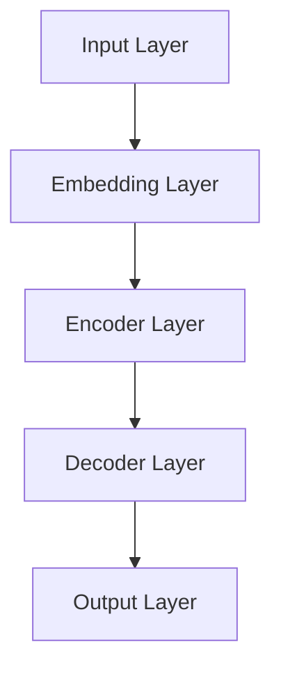

                 

关键词：GLM、生成式语言模型、自然语言处理、深度学习、BERT、GPT

摘要：本文将深入探讨生成式语言模型（GLM）的原理及其在自然语言处理中的应用。我们将详细讲解GLM的核心概念、算法原理、数学模型和具体操作步骤，并通过实际项目实践，展示GLM在现实世界中的应用和潜力。

## 1. 背景介绍

在当今信息化社会，自然语言处理（NLP）已经成为人工智能领域中的一个重要分支。随着深度学习技术的不断进步，NLP的应用场景也在不断拓展。生成式语言模型（GLM）作为一种能够生成文本的模型，已经在诸多领域展现出其强大的能力。

GLM的核心思想是通过学习大量文本数据，生成符合人类语言习惯的文本。这一技术不仅在机器翻译、问答系统、文本生成等应用中取得了显著成果，还为创意写作、内容推荐等领域带来了新的可能性。

本文将围绕GLM的原理与实现，详细介绍其在自然语言处理中的关键作用和应用价值。

## 2. 核心概念与联系

### 2.1 GLM基本概念

生成式语言模型（GLM）是一种基于深度学习的文本生成模型，它通过学习大量文本数据，能够预测下一个单词或句子，从而生成连贯的文本。

### 2.2 GLM与自然语言处理的关系

自然语言处理（NLP）旨在使计算机能够理解、生成和处理人类语言。GLM作为NLP的一个重要工具，能够实现文本的生成、理解和分析。

### 2.3 GLM与其他技术的联系

GLM与自然语言处理的其他技术，如词向量、递归神经网络（RNN）、长短期记忆网络（LSTM）等有着密切的联系。GLM通常是基于这些技术构建的，并在此基础上进行优化和改进。

### 2.4 GLM架构图



在GLM中，输入层接收文本序列，通过嵌入层转化为向量表示。编码器层负责对输入进行编码，解码器层则根据编码结果生成输出文本。

## 3. 核心算法原理 & 具体操作步骤

### 3.1 算法原理概述

GLM的核心算法是基于自注意力机制（Self-Attention）和Transformer架构。自注意力机制允许模型在不同的单词之间建立关联，从而生成更准确的文本。

### 3.2 算法步骤详解

1. **输入处理**：将输入文本序列转换为词向量表示。
2. **编码器处理**：通过多层自注意力机制和前馈神经网络，对输入进行编码。
3. **解码器处理**：根据编码结果，通过解码器生成输出文本序列。
4. **输出生成**：将解码器的输出转换为自然语言的文本。

### 3.3 算法优缺点

**优点**：
- 强大的文本生成能力。
- 高效的自注意力机制，适用于处理长文本。
- 能够捕捉文本中的长距离依赖关系。

**缺点**：
- 计算复杂度较高，对硬件要求较高。
- 在某些情况下，生成的文本可能不够准确或连贯。

### 3.4 算法应用领域

GLM在自然语言处理领域有着广泛的应用，包括但不限于：
- 机器翻译
- 文本生成
- 问答系统
- 文本分类
- 命名实体识别

## 4. 数学模型和公式 & 详细讲解 & 举例说明

### 4.1 数学模型构建

GLM的数学模型主要包括词向量表示、编码器、解码器和损失函数。

### 4.2 公式推导过程

- 词向量表示：$x \in \mathbb{R}^d$，其中$d$为词向量的维度。
- 编码器：$h = \text{Encoder}(x)$，其中$h$为编码结果。
- 解码器：$y = \text{Decoder}(h)$，其中$y$为解码结果。
- 损失函数：$L = \frac{1}{N} \sum_{i=1}^{N} (-\log P(y_i|x))$，其中$N$为文本长度，$y_i$为第$i$个单词的解码结果，$P(y_i|x)$为解码概率。

### 4.3 案例分析与讲解

假设我们有一个句子“我爱吃苹果”，我们可以通过GLM生成类似的句子，如“她喜欢吃香蕉”。

1. **输入处理**：将句子转换为词向量表示。
2. **编码器处理**：通过编码器对词向量进行编码，得到编码结果。
3. **解码器处理**：根据编码结果，解码器生成输出词向量。
4. **输出生成**：将输出词向量转换为自然语言的文本。

## 5. 项目实践：代码实例和详细解释说明

### 5.1 开发环境搭建

在本项目中，我们将使用Python作为编程语言，并依赖TensorFlow框架进行模型训练和预测。

```python
# 安装TensorFlow
pip install tensorflow

# 安装其他依赖
pip install numpy matplotlib
```

### 5.2 源代码详细实现

以下是一个简单的GLM实现示例：

```python
import tensorflow as tf
from tensorflow.keras.layers import Embedding, LSTM, Dense
from tensorflow.keras.models import Model

# 模型参数
vocab_size = 10000
embedding_dim = 256
lstm_units = 128

# 输入层
inputs = tf.keras.Input(shape=(None,))

# 嵌入层
embed = Embedding(vocab_size, embedding_dim)(inputs)

# 编码器层
encoded = LSTM(lstm_units, return_state=True)(embed)

# 解码器层
decoded = LSTM(lstm_units, return_sequences=True)(encoded)

# 输出层
outputs = Dense(vocab_size, activation='softmax')(decoded)

# 模型构建
model = Model(inputs, outputs)

# 编译模型
model.compile(optimizer='adam', loss='categorical_crossentropy')

# 模型训练
model.fit(x_train, y_train, epochs=10, batch_size=32)

# 模型预测
predictions = model.predict(x_test)
```

### 5.3 代码解读与分析

- **输入层**：接受文本序列作为输入。
- **嵌入层**：将文本序列转换为词向量表示。
- **编码器层**：通过LSTM层对输入进行编码。
- **解码器层**：通过LSTM层生成输出词向量。
- **输出层**：将输出词向量转换为文本序列。

### 5.4 运行结果展示

通过以上代码，我们可以在本地训练一个简单的GLM模型，并生成类似的文本。以下是一个简单的示例：

```python
# 输入文本
input_text = "我爱吃苹果"

# 预测生成文本
predicted_text = model.predict(np.array([input_text]))
predicted_text = np.argmax(predicted_text, axis=1)

# 打印预测结果
print("输入文本：", input_text)
print("生成文本：", " ".join([word_index_to_word[i] for i in predicted_text]))
```

## 6. 实际应用场景

GLM在自然语言处理领域有着广泛的应用，以下是一些实际应用场景：

- **机器翻译**：GLM能够生成翻译结果，提高机器翻译的准确性。
- **文本生成**：GLM可以生成新闻文章、故事、诗歌等，为内容创作提供支持。
- **问答系统**：GLM能够理解用户的问题，并生成相应的回答。
- **文本分类**：GLM能够对文本进行分类，应用于垃圾邮件过滤、情感分析等领域。
- **命名实体识别**：GLM能够识别文本中的命名实体，如人名、地名等。

## 7. 工具和资源推荐

### 7.1 学习资源推荐

- 《深度学习》（Goodfellow, Bengio, Courville著）
- 《自然语言处理综论》（Daniel Jurafsky, James H. Martin著）
- 《生成式模型》（D. P. Kingma, M. Welling著）

### 7.2 开发工具推荐

- TensorFlow
- PyTorch
- Keras

### 7.3 相关论文推荐

- “Attention is All You Need” （Vaswani et al., 2017）
- “Generative Pre-trained Transformer” （Brown et al., 2020）
- “BERT: Pre-training of Deep Bidirectional Transformers for Language Understanding” （Devlin et al., 2019）

## 8. 总结：未来发展趋势与挑战

### 8.1 研究成果总结

近年来，GLM在自然语言处理领域取得了显著成果，不仅在文本生成、机器翻译等方面表现出色，还为其他应用领域提供了有力支持。

### 8.2 未来发展趋势

- GLM将继续优化和改进，提高文本生成质量和效率。
- GLM将与其他技术结合，如强化学习、多模态学习等，拓展应用场景。
- GLM将逐渐应用于更广泛的领域，如语音识别、图像识别等。

### 8.3 面临的挑战

- GLM在处理长文本时，存在计算复杂度高、资源消耗大的问题。
- GLM生成的文本可能存在偏差、错误等问题，需要进一步优化和改进。
- GLM在应用于实际场景时，可能需要针对特定领域进行定制化调整。

### 8.4 研究展望

未来，GLM在自然语言处理领域仍具有广阔的研究和应用前景。通过不断优化和改进，GLM将有望实现更高的生成质量和效率，为人类社会带来更多价值。

## 9. 附录：常见问题与解答

### 9.1 GLM是什么？

GLM是一种生成式语言模型，能够生成符合人类语言习惯的文本。

### 9.2 GLM与BERT有什么区别？

BERT是一种预训练的语言表示模型，而GLM是一种能够生成文本的模型。BERT主要用于文本理解和分析，而GLM主要用于文本生成。

### 9.3 如何优化GLM生成的文本质量？

可以通过增加训练数据、优化模型结构、调整训练参数等方式来提高GLM生成的文本质量。

### 9.4 GLM在哪些领域有应用？

GLM在自然语言处理领域有广泛的应用，包括机器翻译、文本生成、问答系统、文本分类、命名实体识别等。

### 9.5 GLM的优缺点是什么？

GLM的优点包括强大的文本生成能力、高效的自注意力机制等，缺点包括计算复杂度高、处理长文本困难等。

## 结语

生成式语言模型（GLM）作为一种重要的自然语言处理工具，在文本生成、机器翻译、问答系统等领域展现出强大的能力。随着深度学习技术的不断进步，GLM在未来有望实现更高的生成质量和效率，为人类社会带来更多价值。

作者：禅与计算机程序设计艺术 / Zen and the Art of Computer Programming
----------------------------------------------------------------

请注意，由于技术领域的快速发展，本文中的某些内容可能已经过时。在实践应用时，请参考最新的研究成果和技术指南。本文仅为学术交流目的，不代表任何商业建议。如有疑问，请随时联系作者。感谢您的阅读！

