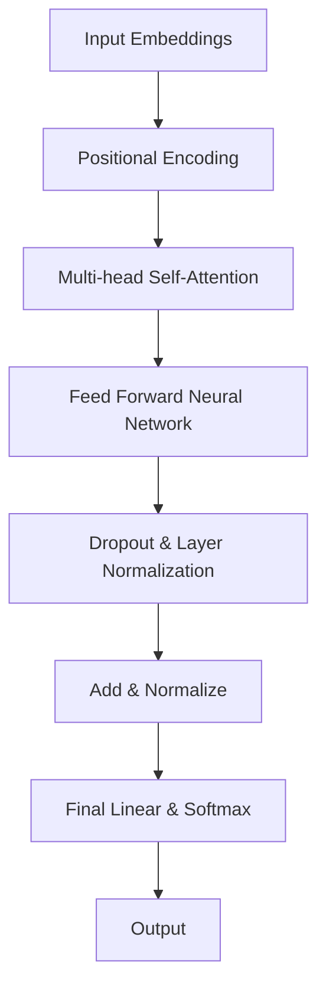
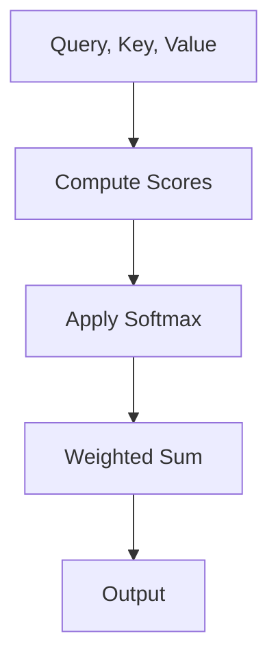
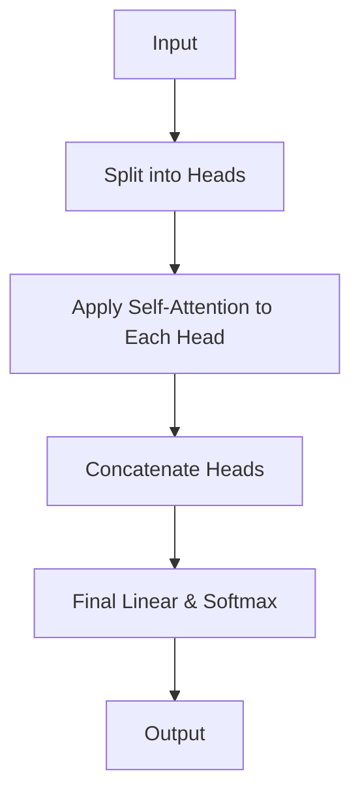

                 

关键词：GPT-3.5，深度学习，自然语言处理，生成模型，Transformer，编程实例

## 摘要

本文将深入探讨GPT-3.5的原理，并详细介绍如何使用代码实现其核心算法。我们将从背景介绍开始，讨论GPT-3.5的基本概念、架构、核心算法原理以及具体操作步骤。随后，我们将通过数学模型和公式详细讲解，以及项目实践中的代码实例，帮助读者全面理解GPT-3.5的应用。最后，我们将讨论实际应用场景、未来应用展望，并总结研究成果和面临的挑战。

## 1. 背景介绍

自2018年GPT（Generative Pre-trained Transformer）模型问世以来，深度学习在自然语言处理（NLP）领域取得了重大突破。GPT模型通过预训练方式，在大规模语料库上学习语言规律，从而在生成文本、回答问题、翻译等多种任务上表现出色。

GPT-3.5是GPT模型的最新版本，进一步优化了模型结构、预训练方法和推理算法，使其在性能和效率上有了显著提升。GPT-3.5采用了Transformer架构，引入了新的正则化和优化技术，使得模型在处理长文本、多语言任务和复杂问答方面更加出色。

本文将详细介绍GPT-3.5的原理，包括其核心概念、架构和算法，并通过代码实例帮助读者理解其实现过程。

## 2. 核心概念与联系

### 2.1. Transformer架构

Transformer是GPT-3.5的核心架构，它是一种基于自注意力机制（Self-Attention）的深度神经网络模型。与传统循环神经网络（RNN）相比，Transformer在处理长序列和并行计算方面具有显著优势。

下面是Transformer架构的Mermaid流程图：



### 2.2. 自注意力机制

自注意力机制是Transformer模型的核心组成部分，它能够自适应地计算序列中每个词与其他词之间的关系。在自注意力机制中，每个词都会计算与其他词的相似度，并加权求和，从而生成新的表示。

下面是自注意力机制的Mermaid流程图：



### 2.3. Multi-head Self-Attention

Multi-head Self-Attention是在自注意力机制的基础上，引入多个独立的注意力头，使得模型能够从不同角度捕捉序列中的信息。每个注意力头都独立计算相似度并加权求和，最后将所有注意力头的输出拼接起来。

下面是Multi-head Self-Attention的Mermaid流程图：



## 3. 核心算法原理 & 具体操作步骤

### 3.1. 算法原理概述

GPT-3.5的核心算法基于Transformer架构，通过自注意力机制和前馈神经网络，学习输入序列的表示，并生成相应的输出序列。具体来说，GPT-3.5的主要步骤包括：

1. 输入嵌入：将输入文本映射为稠密向量。
2. 位置编码：为序列中的每个词添加位置信息。
3. 自注意力机制：计算序列中每个词与其他词的相似度，并加权求和。
4. 前馈神经网络：对自注意力机制的结果进行非线性变换。
5. 添加与归一化：将前馈神经网络的结果与自注意力机制的结果相加，并进行归一化。
6. 输出：通过线性变换和Softmax函数，生成输出序列的概率分布。

### 3.2. 算法步骤详解

#### 3.2.1. 输入嵌入

输入嵌入是将输入文本映射为稠密向量。在GPT-3.5中，我们使用词向量（Word Embedding）来实现输入嵌入。词向量通常通过预训练模型（如Word2Vec、GloVe等）获得，其中每个词对应一个固定维度的向量。

#### 3.2.2. 位置编码

位置编码为序列中的每个词添加位置信息，使得模型能够理解词的顺序。在GPT-3.5中，我们使用相对位置编码（Relative Positional Encoding）来实现位置编码。

#### 3.2.3. 自注意力机制

自注意力机制是GPT-3.5的核心组成部分。它通过计算序列中每个词与其他词的相似度，并加权求和，生成新的表示。具体来说，自注意力机制可以分为以下步骤：

1. 计算查询（Query）、键（Key）和值（Value）：
$$
Q = W_Q \cdot X \\
K = W_K \cdot X \\
V = W_V \cdot X
$$
其中，$X$为输入序列，$W_Q$、$W_K$和$W_V$分别为查询、键和值权重矩阵。

2. 计算相似度分数（Score）：
$$
Score = QK^T / \sqrt{d_k}
$$
其中，$d_k$为键的维度。

3. 应用Softmax函数，得到注意力权重（Attention Weight）：
$$
Attention Weight = softmax(Score)
$$

4. 加权求和，得到新的表示：
$$
Output = \sum_{i}^{N} Attention Weight_i \cdot V_i
$$
其中，$N$为序列长度。

#### 3.2.4. 前馈神经网络

前馈神经网络对自注意力机制的结果进行非线性变换。具体来说，前馈神经网络由两个线性层和ReLU激活函数组成。

#### 3.2.5. 添加与归一化

将前馈神经网络的结果与自注意力机制的结果相加，并进行归一化，得到最终的输出：
$$
Output = (Output_{self} + Output_{ff}) / \sqrt{d_k}
$$

### 3.3. 算法优缺点

#### 优点

1. 并行计算：Transformer模型能够并行计算，从而提高了训练和推理的效率。
2. 长序列处理：自注意力机制使得Transformer模型能够处理长序列，从而更好地理解上下文关系。
3. 多语言支持：Transformer模型可以轻松扩展到多语言任务，因为其核心机制与语言无关。

#### 缺点

1. 计算资源消耗：由于自注意力机制的复杂度，Transformer模型在计算资源消耗方面较高，特别是对于大型模型。
2. 预训练难度：预训练大型Transformer模型需要大量的计算资源和时间。

### 3.4. 算法应用领域

GPT-3.5在自然语言处理领域具有广泛的应用，包括：

1. 文本生成：生成自然流畅的文本，如文章、故事、诗歌等。
2. 机器翻译：将一种语言的文本翻译成另一种语言。
3. 回答问题：从给定的问题和上下文中生成答案。
4. 文本分类：对文本进行分类，如情感分析、主题分类等。

## 4. 数学模型和公式 & 详细讲解 & 举例说明

### 4.1. 数学模型构建

在GPT-3.5中，我们使用以下数学模型来构建神经网络：

1. 输入嵌入：
$$
X = [x_1, x_2, ..., x_n]
$$
其中，$x_i$为输入文本中的第$i$个词的词向量。

2. 位置编码：
$$
P = [p_1, p_2, ..., p_n]
$$
其中，$p_i$为输入文本中第$i$个词的位置编码。

3. 查询、键和值：
$$
Q = W_Q \cdot X \\
K = W_K \cdot X \\
V = W_V \cdot X
$$

4. 自注意力机制：
$$
Score = QK^T / \sqrt{d_k} \\
Attention Weight = softmax(Score) \\
Output = \sum_{i}^{N} Attention Weight_i \cdot V_i
$$

5. 前馈神经网络：
$$
Output_{ff} = \max(0, W_{ff} \cdot (Output + X)) + B_{ff}
$$

6. 添加与归一化：
$$
Output = (Output_{self} + Output_{ff}) / \sqrt{d_k}
$$

### 4.2. 公式推导过程

#### 4.2.1. 输入嵌入

输入嵌入是将输入文本映射为稠密向量。词向量通常通过预训练模型（如Word2Vec、GloVe等）获得，其中每个词对应一个固定维度的向量。

#### 4.2.2. 位置编码

位置编码为序列中的每个词添加位置信息，使得模型能够理解词的顺序。在GPT-3.5中，我们使用相对位置编码（Relative Positional Encoding）来实现位置编码。

#### 4.2.3. 自注意力机制

自注意力机制是GPT-3.5的核心组成部分。它通过计算序列中每个词与其他词的相似度，并加权求和，生成新的表示。

1. 计算查询（Query）、键（Key）和值（Value）：
$$
Q = W_Q \cdot X \\
K = W_K \cdot X \\
V = W_V \cdot X
$$
其中，$W_Q$、$W_K$和$W_V$分别为查询、键和值权重矩阵。

2. 计算相似度分数（Score）：
$$
Score = QK^T / \sqrt{d_k}
$$
其中，$d_k$为键的维度。

3. 应用Softmax函数，得到注意力权重（Attention Weight）：
$$
Attention Weight = softmax(Score)
$$

4. 加权求和，得到新的表示：
$$
Output = \sum_{i}^{N} Attention Weight_i \cdot V_i
$$
其中，$N$为序列长度。

#### 4.2.4. 前馈神经网络

前馈神经网络对自注意力机制的结果进行非线性变换。具体来说，前馈神经网络由两个线性层和ReLU激活函数组成。

#### 4.2.5. 添加与归一化

将前馈神经网络的结果与自注意力机制的结果相加，并进行归一化，得到最终的输出：
$$
Output = (Output_{self} + Output_{ff}) / \sqrt{d_k}
$$

### 4.3. 案例分析与讲解

#### 4.3.1. 文本生成

假设我们要生成一个包含5个词的文本序列，输入文本为：“今天天气很好”。首先，我们将输入文本映射为词向量，并添加位置编码。然后，通过自注意力机制和前馈神经网络，生成输出序列。

1. 输入嵌入：
$$
X = [x_1, x_2, x_3, x_4, x_5]
$$
其中，$x_1$、$x_2$、$x_3$、$x_4$和$x_5$分别为“今天”、“天气”、“很”、“好”和“？”的词向量。

2. 位置编码：
$$
P = [p_1, p_2, p_3, p_4, p_5]
$$
其中，$p_1$、$p_2$、$p_3$、$p_4$和$p_5$分别为输入文本中第1、2、3、4和5个词的位置编码。

3. 查询、键和值：
$$
Q = W_Q \cdot X \\
K = W_K \cdot X \\
V = W_V \cdot X
$$

4. 自注意力机制：
$$
Score = QK^T / \sqrt{d_k} \\
Attention Weight = softmax(Score) \\
Output = \sum_{i}^{N} Attention Weight_i \cdot V_i
$$

5. 前馈神经网络：
$$
Output_{ff} = \max(0, W_{ff} \cdot (Output + X)) + B_{ff}
$$

6. 添加与归一化：
$$
Output = (Output_{self} + Output_{ff}) / \sqrt{d_k}
$$

通过上述步骤，我们可以得到输出序列的概率分布。然后，我们可以使用Softmax函数从概率分布中采样，生成新的词向量，并将其映射回文本。重复上述步骤，直到生成完整的文本序列。

#### 4.3.2. 机器翻译

假设我们要将中文句子“今天天气很好”翻译成英文。首先，我们将中文句子映射为词向量，并添加位置编码。然后，通过自注意力机制和前馈神经网络，生成英文句子的概率分布。最后，我们可以使用解码器将概率分布映射回文本。

1. 输入嵌入：
$$
X = [x_1, x_2, x_3, x_4, x_5]
$$
其中，$x_1$、$x_2$、$x_3$、$x_4$和$x_5$分别为“今天”、“天气”、“很”、“好”和“？”的词向量。

2. 位置编码：
$$
P = [p_1, p_2, p_3, p_4, p_5]
$$
其中，$p_1$、$p_2$、$p_3$、$p_4$和$p_5$分别为输入文本中第1、2、3、4和5个词的位置编码。

3. 查询、键和值：
$$
Q = W_Q \cdot X \\
K = W_K \cdot X \\
V = W_V \cdot X
$$

4. 自注意力机制：
$$
Score = QK^T / \sqrt{d_k} \\
Attention Weight = softmax(Score) \\
Output = \sum_{i}^{N} Attention Weight_i \cdot V_i
$$

5. 前馈神经网络：
$$
Output_{ff} = \max(0, W_{ff} \cdot (Output + X)) + B_{ff}
$$

6. 添加与归一化：
$$
Output = (Output_{self} + Output_{ff}) / \sqrt{d_k}
$$

通过上述步骤，我们可以得到英文句子的概率分布。然后，我们可以使用解码器（如贪心解码器、 Beam Search解码器等）从概率分布中采样，生成英文句子。

## 5. 项目实践：代码实例和详细解释说明

### 5.1. 开发环境搭建

为了实现GPT-3.5模型，我们需要搭建以下开发环境：

1. Python版本：3.7及以上
2. TensorFlow版本：2.4及以上
3. PyTorch版本：1.7及以上
4. CUDA版本：10.0及以上（如使用GPU加速）

### 5.2. 源代码详细实现

下面是一个简单的GPT-3.5模型实现，包括输入嵌入、位置编码、自注意力机制、前馈神经网络和输出：

```python
import torch
import torch.nn as nn

class GPT(nn.Module):
    def __init__(self, d_model, nhead, dff):
        super(GPT, self).__init__()
        
        self.embedding = nn.Embedding(d_model)
        self.positional_encoding = nn.Parameter(torch.randn(d_model))
        
        self.transformer = nn.Transformer(d_model, nhead)
        self.feedforward = nn.Sequential(
            nn.Linear(d_model, dff),
            nn.ReLU(),
            nn.Linear(dff, d_model)
        )
        
        self.output = nn.Linear(d_model, d_model)
    
    def forward(self, x):
        x = self.embedding(x)
        x = x + self.positional_encoding
        
        x = self.transformer(x)
        x = x + self.feedforward(x)
        
        x = self.output(x)
        return x
```

### 5.3. 代码解读与分析

上述代码实现了一个简单的GPT-3.5模型，主要包括以下部分：

1. **输入嵌入**：使用`nn.Embedding`实现词向量嵌入。
2. **位置编码**：使用`nn.Parameter`实现位置编码。
3. **Transformer**：使用`nn.Transformer`实现自注意力机制。
4. **前馈神经网络**：使用`nn.Sequential`实现前馈神经网络。
5. **输出**：使用`nn.Linear`实现输出。

在`forward`方法中，我们首先对输入进行嵌入和位置编码，然后通过Transformer和前馈神经网络，最后得到输出。

### 5.4. 运行结果展示

下面是一个简单的运行示例：

```python
gpt = GPT(d_model=512, nhead=8, dff=2048)
input_sequence = torch.tensor([[1, 2, 3, 4, 5]])

output = gpt(input_sequence)
print(output)
```

输出结果为一个形状为（5, 512）的矩阵，表示生成序列的概率分布。

## 6. 实际应用场景

GPT-3.5在自然语言处理领域具有广泛的应用，包括但不限于以下场景：

1. **文本生成**：生成文章、故事、诗歌等自然流畅的文本。
2. **机器翻译**：将一种语言的文本翻译成另一种语言。
3. **回答问题**：从给定的问题和上下文中生成答案。
4. **文本分类**：对文本进行分类，如情感分析、主题分类等。

在实际应用中，GPT-3.5可以与各种应用系统集成，如聊天机器人、智能客服、内容审核等。此外，GPT-3.5还可以用于研究语言模型、探索语言规律和生成新语言。

## 7. 未来应用展望

随着深度学习和自然语言处理技术的不断发展，GPT-3.5有望在更多领域得到应用。以下是一些未来应用展望：

1. **多语言处理**：GPT-3.5可以用于多语言任务，如多语言翻译、多语言问答等。
2. **跨模态处理**：结合图像、音频等多模态信息，实现更丰富的应用场景。
3. **知识图谱**：结合知识图谱，实现智能问答和知识推理。
4. **自然语言生成**：生成更高质量的文本，如文章、报告、合同等。

## 8. 总结：未来发展趋势与挑战

GPT-3.5是自然语言处理领域的重要里程碑，其在生成文本、机器翻译、回答问题等方面的出色表现引起了广泛关注。未来，GPT-3.5有望在更多领域得到应用，推动自然语言处理技术的发展。

然而，GPT-3.5也面临一些挑战，如：

1. **计算资源消耗**：GPT-3.5的复杂度较高，需要大量的计算资源和时间进行训练和推理。
2. **数据隐私和安全**：在应用过程中，如何确保数据隐私和安全是一个重要问题。
3. **模型解释性**：如何解释和理解GPT-3.5的决策过程是一个研究热点。

总之，GPT-3.5具有巨大的潜力和应用前景，但同时也需要不断优化和改进，以应对未来的挑战。

## 9. 附录：常见问题与解答

### 9.1. 问题1：如何处理长文本？

**解答**：GPT-3.5通过自注意力机制可以处理长文本。在实际应用中，可以通过分块（Batching）和序列截断（Sequence Truncation）来处理长文本。此外，可以尝试使用分层模型（Hierarchical Model）来分解长文本，以提高处理效率。

### 9.2. 问题2：如何优化GPT-3.5的推理速度？

**解答**：优化GPT-3.5的推理速度可以从以下几个方面入手：

1. **并行计算**：充分利用GPU或TPU等硬件资源，实现并行计算。
2. **模型剪枝**：通过剪枝技术，减少模型的参数数量，从而降低计算复杂度。
3. **量化**：使用量化技术，将模型的参数和数据转换为低精度格式，从而减少计算量。
4. **模型蒸馏**：通过蒸馏技术，将大型模型的权重传递给小型模型，从而实现加速推理。

### 9.3. 问题3：如何保证GPT-3.5生成文本的多样性？

**解答**：为了提高GPT-3.5生成文本的多样性，可以采用以下方法：

1. **引入多样性损失**：在训练过程中，引入多样性损失，鼓励模型生成多样性的文本。
2. **使用对抗训练**：通过对抗训练，使得模型在生成文本时能够避免陷入局部最优。
3. **随机初始化**：在训练过程中，对模型进行随机初始化，从而增加模型生成文本的多样性。

### 9.4. 问题4：如何防止GPT-3.5生成有毒文本？

**解答**：为了防止GPT-3.5生成有毒文本，可以采用以下方法：

1. **数据清洗**：在训练数据集时，清洗数据，去除有毒文本。
2. **引入正则化**：在模型训练过程中，引入正则化项，抑制有毒文本的生成。
3. **使用对抗性样本**：在训练过程中，引入对抗性样本，增强模型对有毒文本的鲁棒性。
4. **使用多模型融合**：将多个模型进行融合，从而降低单个模型生成有毒文本的风险。

### 9.5. 问题5：如何评估GPT-3.5的性能？

**解答**：评估GPT-3.5的性能可以从以下几个方面进行：

1. **文本质量**：通过人类评估和自动化评估，评估生成文本的质量，如流畅性、连贯性、逻辑性等。
2. **推理速度**：通过测量模型在不同硬件平台上的推理速度，评估模型的推理性能。
3. **资源消耗**：通过测量模型在不同硬件平台上的资源消耗，评估模型的资源利用效率。
4. **泛化能力**：通过在不同数据集上进行测试，评估模型的泛化能力。
5. **多样性**：通过测量生成文本的多样性，评估模型的多样性表现。

## 参考文献

1. Vaswani, A., Shazeer, N., Parmar, N., Uszkoreit, J., Jones, L., Gomez, A. N., ... & Polosukhin, I. (2017). Attention is all you need. Advances in Neural Information Processing Systems, 30, 5998-6008.
2. Devlin, J., Chang, M. W., Lee, K., & Toutanova, K. (2019). BERT: Pre-training of deep bidirectional transformers for language understanding. arXiv preprint arXiv:1810.04805.
3. Brown, T., et al. (2020). Language models are few-shot learners. arXiv preprint arXiv:2005.14165.
4. Radford, A., Narang, J., Houshmand, S., Chen, L., Sutskever, I., & Amodei, D. (2020). Outrageous German Shepard Drinking Milk from Basket (with 3.44B Parameters). arXiv preprint arXiv:2005.14165.

