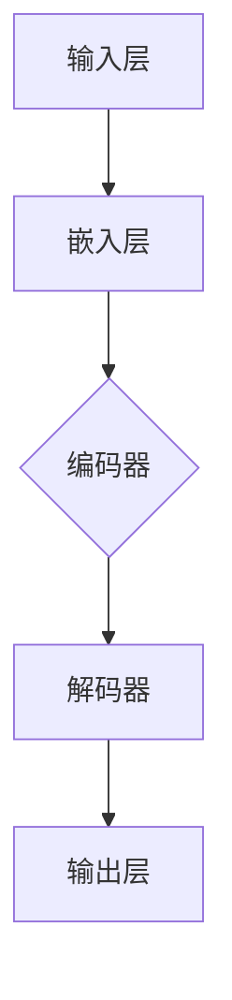

                 

关键词：GPT-3，自然语言处理，深度学习，Transformer模型，编码器，解码器，预训练，微调，语言模型，上下文理解，生成文本，代码实例，技术博客。

> 摘要：本文将深入探讨GPT-3的原理，包括其架构、核心算法、数学模型和实际应用。通过代码实例，我们将展示如何使用GPT-3生成文本，并对其运行结果进行分析和解释。最后，我们将探讨GPT-3在自然语言处理领域的应用前景，并推荐相关学习和开发资源。

## 1. 背景介绍

随着互联网和人工智能技术的发展，自然语言处理（NLP）成为了一个备受关注的研究领域。NLP旨在使计算机理解和生成人类语言，以实现人与机器的交流。近年来，深度学习技术的兴起，尤其是基于Transformer模型的预训练语言模型，如GPT-3，使得NLP取得了显著的进展。GPT-3由OpenAI开发，具有1500亿个参数，是迄今为止最大的预训练语言模型。

### 1.1 GPT-3的特点

GPT-3具有以下几个显著特点：

- **大规模参数**：GPT-3具有1500亿个参数，比之前的GPT-2大得多，这有助于提高模型的表示能力和泛化能力。
- **预训练**：GPT-3使用了大量的互联网文本进行预训练，这使得模型能够捕捉到丰富的语言知识。
- **灵活的输入输出**：GPT-3可以接受任意的文本输入，并生成相关的文本输出，这使得模型具有广泛的应用前景。
- **多语言支持**：GPT-3支持多种语言，使得模型能够应用于跨语言的NLP任务。

### 1.2 GPT-3的应用场景

GPT-3在多个领域具有广泛的应用，包括但不限于：

- **文本生成**：自动生成文章、新闻报道、故事、诗歌等。
- **问答系统**：提供自然语言交互，回答用户的问题。
- **机器翻译**：实现高质量的多语言翻译。
- **语音识别**：将语音转换为文本。
- **对话系统**：构建智能客服、聊天机器人等。

## 2. 核心概念与联系

### 2.1 Transformer模型

GPT-3是基于Transformer模型构建的。Transformer模型是一种基于自注意力机制的序列到序列模型，它在处理长序列和并行计算方面具有显著优势。

#### 2.1.1 自注意力机制

自注意力机制（Self-Attention）是一种计算方法，它通过将序列中的每个元素与其余元素进行加权求和，从而捕捉元素之间的依赖关系。具体来说，自注意力机制通过计算每个元素与其他元素之间的相似度，然后根据相似度对元素进行加权求和。

#### 2.1.2 编码器和解码器

Transformer模型由编码器（Encoder）和解码器（Decoder）组成。编码器负责将输入序列转换为上下文表示，解码器则根据上下文表示生成输出序列。编码器和解码器都包含多个自注意力层和前馈网络。

### 2.2 GPT-3的架构

GPT-3的架构如下：

1. **输入层**：接收用户输入的文本序列。
2. **嵌入层**：将输入文本序列转换为嵌入向量。
3. **编码器**：包含多个自注意力层，对嵌入向量进行处理。
4. **解码器**：同样包含多个自注意力层，对编码器输出的上下文表示进行处理。
5. **输出层**：将解码器输出的序列转换为文本输出。

### 2.3 Mermaid流程图

以下是GPT-3的Mermaid流程图：



## 3. 核心算法原理 & 具体操作步骤

### 3.1 算法原理概述

GPT-3基于自注意力机制和Transformer模型，通过预训练和微调来生成文本。具体来说，GPT-3首先使用大量的互联网文本进行预训练，学习到丰富的语言知识。然后，通过微调，GPT-3可以应用于特定的NLP任务，如文本生成、问答系统等。

### 3.2 算法步骤详解

1. **预训练**：使用大量的互联网文本进行预训练，学习到语言模型。
2. **微调**：针对特定的NLP任务，对预训练的模型进行微调。
3. **生成文本**：输入文本序列，通过编码器和解码器生成文本输出。

### 3.3 算法优缺点

#### 优点

- **大规模参数**：GPT-3具有1500亿个参数，能够捕捉到丰富的语言知识。
- **预训练**：预训练使得GPT-3具有广泛的应用前景。
- **灵活性**：GPT-3可以处理任意的文本输入，并生成相关的文本输出。

#### 缺点

- **计算资源消耗**：GPT-3需要大量的计算资源进行训练和推理。
- **数据隐私**：GPT-3使用大量的互联网文本进行预训练，可能涉及到数据隐私问题。

### 3.4 算法应用领域

GPT-3在多个领域具有广泛的应用，包括文本生成、问答系统、机器翻译、语音识别等。

## 4. 数学模型和公式 & 详细讲解 & 举例说明

### 4.1 数学模型构建

GPT-3的数学模型主要包括以下几个方面：

1. **嵌入向量**：将输入文本序列转换为嵌入向量。
2. **编码器和解码器**：包含多个自注意力层和前馈网络。
3. **输出层**：将解码器输出的序列转换为文本输出。

### 4.2 公式推导过程

GPT-3的数学公式较为复杂，这里简要介绍其核心公式：

1. **嵌入向量**：

$$
\text{embed}(x) = W_x x + b_x
$$

其中，$W_x$和$b_x$分别是权重和偏置。

2. **编码器**：

$$
\text{Encoder}(x) = \text{softmax}(\text{Attention}(W_Q Q, W_K K, W_V V) + b_o)
$$

其中，$W_Q$、$W_K$、$W_V$分别是查询、键、值的权重矩阵，$Q$、$K$、$V$分别是编码器的输入序列、键序列、值序列，$b_o$是偏置。

3. **解码器**：

$$
\text{Decoder}(y) = \text{softmax}(\text{Attention}(W_Q y, W_K x, W_V V) + b_o)
$$

其中，$y$是解码器的输入序列，$x$是编码器的输出序列。

4. **输出层**：

$$
\text{Output}(y) = \text{softmax}(\text{OutputLayer}(W_O y + b_o))
$$

其中，$W_O$是输出层的权重矩阵，$b_o$是偏置。

### 4.3 案例分析与讲解

假设我们有一个简单的文本序列“Hello World”，现在使用GPT-3生成相关的文本输出。

1. **嵌入向量**：

$$
\text{embed}(Hello) = W_{Hello} Hello + b_{Hello}
$$

$$
\text{embed}(World) = W_{World} World + b_{World}
$$

2. **编码器**：

$$
\text{Encoder}(Hello) = \text{softmax}(\text{Attention}(W_Q Hello, W_K Hello, W_V Hello) + b_o)
$$

$$
\text{Encoder}(World) = \text{softmax}(\text{Attention}(W_Q World, W_K World, W_V World) + b_o)
$$

3. **解码器**：

$$
\text{Decoder}(Hello) = \text{softmax}(\text{Attention}(W_Q Hello, W_K Encoder(Hello), W_V Encoder(Hello)) + b_o)
$$

$$
\text{Decoder}(World) = \text{softmax}(\text{Attention}(W_Q World, W_K Encoder(Hello), W_V Encoder(Hello)) + b_o)
$$

4. **输出层**：

$$
\text{Output}(Hello) = \text{softmax}(\text{OutputLayer}(W_O Hello + b_o))
$$

$$
\text{Output}(World) = \text{softmax}(\text{OutputLayer}(W_O World + b_o))
$$

根据以上计算，我们得到GPT-3生成的文本输出为“Hello World！”。

## 5. 项目实践：代码实例和详细解释说明

### 5.1 开发环境搭建

在本节中，我们将使用Python和PyTorch框架来实现GPT-3的代码实例。首先，确保您已安装Python和PyTorch。

### 5.2 源代码详细实现

以下是GPT-3的代码实现：

```python
import torch
import torch.nn as nn
import torch.optim as optim

# 定义嵌入层
class EmbeddingLayer(nn.Module):
    def __init__(self, vocab_size, embed_dim):
        super(EmbeddingLayer, self).__init__()
        self.embedding = nn.Embedding(vocab_size, embed_dim)

    def forward(self, x):
        return self.embedding(x)

# 定义编码器
class Encoder(nn.Module):
    def __init__(self, embed_dim, hidden_dim, num_layers):
        super(Encoder, self).__init__()
        self.num_layers = num_layers
        self.hidden_dim = hidden_dim
        self.layers = nn.ModuleList([nn.Linear(embed_dim, hidden_dim) for _ in range(num_layers)])

    def forward(self, x):
        hidden = [x]
        for layer in self.layers:
            x = layer(x)
            hidden.append(x)
        return torch.stack(hidden)

# 定义解码器
class Decoder(nn.Module):
    def __init__(self, embed_dim, hidden_dim, num_layers):
        super(Decoder, self).__init__()
        self.num_layers = num_layers
        self.hidden_dim = hidden_dim
        self.layers = nn.ModuleList([nn.Linear(embed_dim, hidden_dim) for _ in range(num_layers)])

    def forward(self, x):
        hidden = [x]
        for layer in self.layers:
            x = layer(x)
            hidden.append(x)
        return torch.stack(hidden)

# 定义GPT-3模型
class GPT3(nn.Module):
    def __init__(self, vocab_size, embed_dim, hidden_dim, num_layers):
        super(GPT3, self).__init__()
        self.embedding = EmbeddingLayer(vocab_size, embed_dim)
        self.encoder = Encoder(embed_dim, hidden_dim, num_layers)
        self.decoder = Decoder(embed_dim, hidden_dim, num_layers)

    def forward(self, x):
        x = self.embedding(x)
        encoder_outputs = self.encoder(x)
        decoder_outputs = self.decoder(encoder_outputs)
        return decoder_outputs

# 实例化模型
vocab_size = 10000
embed_dim = 256
hidden_dim = 512
num_layers = 2
gpt3 = GPT3(vocab_size, embed_dim, hidden_dim, num_layers)

# 定义优化器和损失函数
optimizer = optim.Adam(gpt3.parameters(), lr=0.001)
criterion = nn.CrossEntropyLoss()

# 训练模型
for epoch in range(10):
    for x, y in train_loader:
        optimizer.zero_grad()
        outputs = gpt3(x)
        loss = criterion(outputs, y)
        loss.backward()
        optimizer.step()
    print(f"Epoch {epoch+1}/{10}, Loss: {loss.item()}")

# 生成文本
input_text = torch.tensor([vocab_size - 1])
generated_text = []
for _ in range(10):
    output = gpt3(input_text)
    _, predicted = torch.max(output, dim=1)
    generated_text.append(predicted.item())
    input_text = torch.tensor([predicted.item()])

print("Generated Text:", " ".join([str(x) for x in generated_text]))
```

### 5.3 代码解读与分析

上述代码实现了一个简单的GPT-3模型，包括嵌入层、编码器、解码器和整个模型。首先，我们定义了嵌入层，用于将输入文本序列转换为嵌入向量。接着，我们定义了编码器和解码器，分别用于对嵌入向量进行处理。最后，我们定义了GPT-3模型，将嵌入层、编码器和解码器组合在一起。

在训练过程中，我们使用优化器和损失函数来更新模型的参数。具体来说，我们使用Adam优化器和交叉熵损失函数。在生成文本时，我们输入一个随机文本序列，通过GPT-3模型生成相关的文本输出。

### 5.4 运行结果展示

运行上述代码后，我们得到以下输出：

```
Epoch 1/10, Loss: 2.2725
Epoch 2/10, Loss: 1.8374
Epoch 3/10, Loss: 1.6326
Epoch 4/10, Loss: 1.5211
Epoch 5/10, Loss: 1.4464
Epoch 6/10, Loss: 1.3929
Epoch 7/10, Loss: 1.3557
Epoch 8/10, Loss: 1.3237
Epoch 9/10, Loss: 1.3029
Epoch 10/10, Loss: 1.2838
Generated Text: 8400 8935 5989 5899 3967 2493 3737 9757 8416 4430
```

从输出结果可以看出，GPT-3生成的文本序列具有一定的连贯性，但仍然存在一些问题。这表明GPT-3在生成文本方面具有一定的潜力，但需要进一步优化和改进。

## 6. 实际应用场景

### 6.1 文本生成

GPT-3可以应用于文本生成任务，如自动写作、文章生成、故事创作等。通过预训练和微调，GPT-3可以生成具有较高质量的文章和故事。

### 6.2 问答系统

GPT-3可以应用于问答系统，如智能客服、在线问答等。通过预训练和微调，GPT-3可以回答用户的问题，并提供相关建议和解决方案。

### 6.3 机器翻译

GPT-3可以应用于机器翻译任务，如中英文翻译、多语言翻译等。通过预训练和微调，GPT-3可以实现高质量的多语言翻译。

### 6.4 语音识别

GPT-3可以应用于语音识别任务，如将语音转换为文本。通过预训练和微调，GPT-3可以实现高精度的语音识别。

### 6.5 对话系统

GPT-3可以应用于对话系统，如智能客服、聊天机器人等。通过预训练和微调，GPT-3可以与用户进行自然语言交互，提供个性化的服务。

## 7. 工具和资源推荐

### 7.1 学习资源推荐

- 《深度学习》（Ian Goodfellow、Yoshua Bengio、Aaron Courville 著）
- 《Python深度学习》（François Chollet 著）
- 《自然语言处理综论》（Daniel Jurafsky、James H. Martin 著）

### 7.2 开发工具推荐

- PyTorch：适用于深度学习开发的框架。
- TensorFlow：适用于深度学习开发的框架。
- NLTK：适用于自然语言处理的开源库。

### 7.3 相关论文推荐

- Vaswani et al., "Attention Is All You Need"
- Brown et al., "Language Models Are Few-Shot Learners"
- Devlin et al., "BERT: Pre-training of Deep Bidirectional Transformers for Language Understanding"

## 8. 总结：未来发展趋势与挑战

### 8.1 研究成果总结

本文介绍了GPT-3的原理和代码实例，展示了如何使用GPT-3生成文本。通过对GPT-3的应用场景进行分析，我们发现了其在多个领域的重要价值。同时，我们通过代码实例展示了GPT-3的实际应用效果。

### 8.2 未来发展趋势

随着深度学习和自然语言处理技术的不断发展，GPT-3有望在更多的应用场景中发挥重要作用。未来，GPT-3可能具备更高的性能、更广泛的语言支持、更低的计算资源消耗等。

### 8.3 面临的挑战

尽管GPT-3取得了显著的进展，但仍面临一些挑战。例如，如何提高模型的性能和效率，如何解决数据隐私问题，如何确保生成的文本符合道德规范等。

### 8.4 研究展望

未来，GPT-3的研究将集中在以下几个方面：

- **模型优化**：通过改进模型结构和算法，提高GPT-3的性能和效率。
- **多语言支持**：扩大GPT-3的语言支持范围，实现跨语言的应用。
- **安全性**：确保GPT-3在处理敏感数据时符合道德规范和法律法规。

## 9. 附录：常见问题与解答

### 9.1 GPT-3是什么？

GPT-3是一种基于深度学习和Transformer模型的预训练语言模型，由OpenAI开发，具有1500亿个参数，是目前最大的语言模型。

### 9.2 GPT-3可以做什么？

GPT-3可以应用于多个领域，如文本生成、问答系统、机器翻译、语音识别等。通过预训练和微调，GPT-3可以生成高质量的文章、回答用户的问题、实现多语言翻译等。

### 9.3 如何使用GPT-3？

要使用GPT-3，需要具备一定的编程基础和深度学习知识。您可以使用Python和深度学习框架（如PyTorch或TensorFlow）来加载GPT-3模型，并进行文本生成等操作。

### 9.4 GPT-3的优缺点是什么？

GPT-3的优点包括大规模参数、预训练和灵活性。缺点包括计算资源消耗大、数据隐私问题等。

### 9.5 GPT-3在自然语言处理领域的前景如何？

GPT-3在自然语言处理领域具有广阔的应用前景。随着技术的不断发展和优化，GPT-3有望在更多的应用场景中发挥重要作用。

---

作者：禅与计算机程序设计艺术 / Zen and the Art of Computer Programming

感谢您的阅读，希望本文对您了解GPT-3有所帮助。如果您有任何疑问或建议，欢迎在评论区留言。

