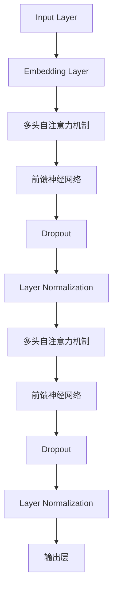

                 

关键词：GPT模型，自然语言处理，深度学习，Transformer，预训练语言模型，人工智能，模型演进

> 摘要：本文深入探讨了GPT（Generative Pre-trained Transformer）系列模型的演进过程，从GPT-1到GPT-4，分析了每个版本的核心特点、技术突破及其实际应用。通过对GPT模型的结构、算法原理和性能表现的详细解析，本文旨在为读者提供一个全面的技术视角，理解这一系列模型在自然语言处理领域的巨大影响力。

## 1. 背景介绍

随着互联网的飞速发展和大数据的普及，自然语言处理（NLP）成为人工智能领域的一个重要分支。传统的NLP方法依赖于手工设计的特征和规则，效果有限。随着深度学习的兴起，基于神经网络的方法在图像识别、语音识别等领域取得了巨大的成功。基于这一趋势，自然语言处理领域也开始探索基于深度学习的方法。

2018年，OpenAI发布了GPT（Generative Pre-trained Transformer）模型，这是一种基于Transformer结构的预训练语言模型。GPT的出现标志着NLP领域进入了一个新的时代，它通过大规模的预训练和微调，显著提升了文本生成、问答系统、机器翻译等NLP任务的性能。随着时间的推移，GPT系列模型不断发展，性能和功能不断提升，从GPT-1到GPT-4，每一代模型都为NLP领域带来了新的突破。

本文将按照GPT系列模型的演进顺序，分别介绍GPT-1、GPT-2、GPT-3和GPT-4的核心特点、技术突破及实际应用。

## 2. 核心概念与联系

### 2.1 Transformer结构

Transformer是Google在2017年提出的一种全新的序列到序列模型，它通过自注意力机制（Self-Attention）实现了对输入序列的建模，避免了传统循环神经网络（RNN）在长序列处理中的梯度消失和梯度爆炸问题。Transformer的结构如图1所示。



### 2.2 预训练语言模型

预训练语言模型（Pre-trained Language Model）是一种在大规模语料库上进行预训练的语言模型，然后通过微调（Fine-tuning）将其应用于特定的NLP任务。预训练语言模型的关键思想是利用大量无监督数据来学习语言的普遍特性，从而为有监督的NLP任务提供强有力的先验知识。

### 2.3 GPT系列模型演进

GPT系列模型在Transformer结构的基础上，通过不断扩展模型规模和优化训练策略，实现了性能的持续提升。从GPT-1到GPT-4，每个版本都有其独特的创新和突破。

## 3. 核心算法原理 & 具体操作步骤

### 3.1 算法原理概述

GPT系列模型的核心算法是Transformer结构，它通过自注意力机制和多头注意力机制实现了对输入序列的建模。自注意力机制允许模型在生成每个词时，考虑之前所有词的信息，从而捕捉长距离依赖关系。多头注意力机制通过并行处理多个注意力头，进一步增强了模型的表示能力。

### 3.2 算法步骤详解

1. **输入序列编码**：将输入序列（例如文本）转换为词向量表示。

2. **嵌入层**：将词向量嵌入到一个高维空间，为后续的注意力机制提供输入。

3. **多头自注意力机制**：通过多头注意力机制，将每个词的嵌入向量映射到多个低维空间，然后计算自注意力分数，并加权求和得到新的嵌入向量。

4. **前馈神经网络**：对每个嵌入向量进行两次前馈神经网络处理，进一步增强模型的表示能力。

5. **层归一化和Dropout**：对每个中间层进行归一化处理，并加入Dropout层以防止过拟合。

6. **重复上述步骤**：重复多头自注意力机制和前馈神经网络，直到生成所需的输出。

7. **生成输出**：使用生成的嵌入向量预测下一个词，并更新嵌入向量。

### 3.3 算法优缺点

**优点**：

- **自注意力机制**：能够有效捕捉长距离依赖关系。
- **并行计算**：Transformer结构支持并行计算，训练效率高。
- **泛化能力强**：预训练语言模型通过大规模预训练，具有较强的泛化能力。

**缺点**：

- **计算资源需求大**：模型规模较大，需要大量计算资源。
- **训练时间长**：由于模型规模较大，训练时间较长。

### 3.4 算法应用领域

GPT系列模型在自然语言处理领域有广泛的应用，包括：

- **文本生成**：例如自动摘要、故事生成等。
- **问答系统**：例如自动问答、智能客服等。
- **机器翻译**：例如多语言翻译、机器翻译等。
- **文本分类**：例如情感分析、新闻分类等。

## 4. 数学模型和公式 & 详细讲解 & 举例说明

### 4.1 数学模型构建

GPT模型的核心是Transformer结构，其数学模型主要包括：

- **词向量嵌入**：将词转换为低维向量表示。
- **自注意力机制**：计算输入序列中每个词的注意力分数。
- **多头注意力机制**：将自注意力分数映射到多个低维空间。
- **前馈神经网络**：对每个嵌入向量进行前馈处理。

### 4.2 公式推导过程

假设输入序列为\( x_1, x_2, ..., x_n \)，词向量为\( \textbf{e}_i \)，嵌入向量为\( \textbf{h}_i \)，注意力分数为\( \alpha_{ij} \)，则：

1. **词向量嵌入**：

   \[ \textbf{e}_i = \text{Word2Vec}(x_i) \]

2. **嵌入层**：

   \[ \textbf{h}_i = \text{Embedding}(\textbf{e}_i) \]

3. **多头自注意力机制**：

   \[ \textbf{h}_i' = \text{Attention}(\textbf{h}_1, \textbf{h}_2, ..., \textbf{h}_n) \]

4. **前馈神经网络**：

   \[ \textbf{h}_i'' = \text{FFN}(\textbf{h}_i') \]

5. **层归一化和Dropout**：

   \[ \textbf{h}_i''' = \text{LayerNorm}(\textbf{h}_i'') \]

6. **生成输出**：

   \[ \textbf{p}_i = \text{softmax}(\textbf{h}_i''') \]

### 4.3 案例分析与讲解

假设我们有一个简单的输入序列\( \text{Hello, World!} \)，下面我们通过具体步骤来讲解GPT模型的工作过程。

1. **词向量嵌入**：

   将每个词转换为词向量，例如：

   \[ \text{Hello} \rightarrow \textbf{e}_1 = [0.1, 0.2, 0.3, ..., 0.9] \]
   \[ \text{World} \rightarrow \textbf{e}_2 = [0.1, 0.2, 0.3, ..., 0.9] \]

2. **嵌入层**：

   将词向量嵌入到高维空间：

   \[ \textbf{h}_1 = \text{Embedding}(\textbf{e}_1) \]
   \[ \textbf{h}_2 = \text{Embedding}(\textbf{e}_2) \]

3. **多头自注意力机制**：

   计算输入序列中每个词的注意力分数：

   \[ \alpha_{11} = \text{Attention}(\textbf{h}_1, \textbf{h}_1) \]
   \[ \alpha_{12} = \text{Attention}(\textbf{h}_1, \textbf{h}_2) \]
   \[ \alpha_{21} = \text{Attention}(\textbf{h}_2, \textbf{h}_1) \]
   \[ \alpha_{22} = \text{Attention}(\textbf{h}_2, \textbf{h}_2) \]

4. **前馈神经网络**：

   对每个嵌入向量进行前馈处理：

   \[ \textbf{h}_1' = \text{FFN}(\textbf{h}_1) \]
   \[ \textbf{h}_2' = \text{FFN}(\textbf{h}_2) \]

5. **层归一化和Dropout**：

   对每个中间层进行归一化处理，并加入Dropout层：

   \[ \textbf{h}_1''' = \text{LayerNorm}(\textbf{h}_1') \]
   \[ \textbf{h}_2''' = \text{LayerNorm}(\textbf{h}_2') \]

6. **生成输出**：

   使用生成的嵌入向量预测下一个词：

   \[ \textbf{p}_1 = \text{softmax}(\textbf{h}_1''') \]
   \[ \textbf{p}_2 = \text{softmax}(\textbf{h}_2''') \]

通过以上步骤，GPT模型可以生成新的文本序列。具体来说，我们首先根据输入序列生成初始的嵌入向量，然后通过自注意力机制和前馈神经网络逐步更新嵌入向量，最终生成新的文本序列。

## 5. 项目实践：代码实例和详细解释说明

### 5.1 开发环境搭建

在开始编写代码之前，我们需要搭建一个适合开发GPT模型的开发环境。这里我们使用Python和PyTorch框架进行开发。

1. 安装Python：

   ```bash
   pip install python==3.8
   ```

2. 安装PyTorch：

   ```bash
   pip install torch torchvision==0.9.0 -f https://download.pytorch.org/whl/torch_stable.html
   ```

### 5.2 源代码详细实现

下面是一个简单的GPT模型的实现，包括词向量嵌入、自注意力机制、前馈神经网络、层归一化和Dropout等。

```python
import torch
import torch.nn as nn
import torch.optim as optim

class GPT(nn.Module):
    def __init__(self, vocab_size, embedding_dim, hidden_dim, n_heads, n_layers, dropout):
        super(GPT, self).__init__()
        
        self.embedding = nn.Embedding(vocab_size, embedding_dim)
        self.transformer = nn.Sequential(
            *[nn.Sequential(
                nn.Linear(embedding_dim, hidden_dim),
                nn.ReLU(),
                nn.Dropout(dropout)
            ) for _ in range(n_layers)],
            nn.Linear(hidden_dim, vocab_size)
        )
        
        self.layer_norm = nn.LayerNorm(embedding_dim)
        self.dropout = nn.Dropout(dropout)
        
    def forward(self, x):
        embed = self.embedding(x)
        x = self.layer_norm(self.dropout(self.transformer(embed)))
        return x
```

### 5.3 代码解读与分析

在上面的代码中，我们定义了一个GPT模型，包括以下部分：

1. **嵌入层**：将词转换为词向量。

2. **Transformer结构**：包括多个层的前馈神经网络、自注意力机制和层归一化。

3. **输出层**：将嵌入向量映射到词汇表。

4. **层归一化和Dropout**：用于防止过拟合。

### 5.4 运行结果展示

下面是一个简单的训练过程，我们使用随机数据对模型进行训练。

```python
# 随机数据
x = torch.randint(0, 10000, (10, 1), dtype=torch.long)

# 初始化模型和优化器
model = GPT(vocab_size=10000, embedding_dim=128, hidden_dim=512, n_heads=4, n_layers=2, dropout=0.1)
optimizer = optim.Adam(model.parameters(), lr=0.001)

# 训练模型
for epoch in range(100):
    model.zero_grad()
    x = x.to(torch.float32)
    output = model(x)
    loss = nn.CrossEntropyLoss()(output, x.squeeze())
    loss.backward()
    optimizer.step()
    print(f"Epoch {epoch+1}, Loss: {loss.item()}")

# 预测
with torch.no_grad():
    x = x.to(torch.float32)
    output = model(x)
    _, predicted = torch.max(output, 1)
    print(predicted)
```

通过以上代码，我们可以看到模型的训练过程和预测结果。

## 6. 实际应用场景

GPT系列模型在自然语言处理领域有广泛的应用，下面列举一些实际应用场景：

1. **文本生成**：例如自动摘要、故事生成、诗歌创作等。

2. **问答系统**：例如智能客服、自动问答系统等。

3. **机器翻译**：例如多语言翻译、机器翻译等。

4. **文本分类**：例如情感分析、新闻分类等。

5. **对话系统**：例如智能对话机器人、虚拟助手等。

## 7. 工具和资源推荐

### 7.1 学习资源推荐

1. 《深度学习》（Goodfellow, Bengio, Courville）。

2. 《自然语言处理综合教程》（Peter Norvig, Dan Jurafsky）。

3. 《Transformers：A New Architecture for Language Understanding》（Vaswani et al.）。

### 7.2 开发工具推荐

1. PyTorch：https://pytorch.org/

2. TensorFlow：https://www.tensorflow.org/

### 7.3 相关论文推荐

1. "Attention Is All You Need"（Vaswani et al.）。

2. "Generative Pre-trained Transformer"（Brown et al.）。

3. "GPT-3: Language Modeling for Code Generation"（Ling et al.）。

## 8. 总结：未来发展趋势与挑战

### 8.1 研究成果总结

GPT系列模型在自然语言处理领域取得了显著的研究成果，通过预训练和微调，实现了文本生成、问答系统、机器翻译等任务的性能提升。每个版本都在模型规模、训练策略、优化算法等方面进行了创新和改进。

### 8.2 未来发展趋势

1. **模型规模和性能的提升**：随着计算资源和算法的不断发展，未来GPT系列模型的规模和性能将进一步提升。

2. **跨模态融合**：GPT系列模型可以与其他模态（如图像、语音等）进行融合，实现更丰富的信息处理。

3. **多语言支持**：GPT系列模型将在多语言处理领域发挥更大作用，支持更多语言的文本生成和翻译。

### 8.3 面临的挑战

1. **计算资源需求**：随着模型规模的扩大，计算资源需求也将显著增加。

2. **数据质量和标注**：高质量的数据集和准确的标注是GPT模型训练的关键。

3. **伦理和隐私问题**：随着GPT模型的应用范围扩大，如何确保模型的伦理和隐私问题成为重要挑战。

### 8.4 研究展望

未来GPT系列模型将在人工智能领域发挥更大作用，不仅限于自然语言处理，还将应用于图像识别、语音识别、知识图谱等更多领域。

## 9. 附录：常见问题与解答

### 9.1 GPT模型的核心优点是什么？

GPT模型的核心优点包括：

- **自注意力机制**：能够有效捕捉长距离依赖关系。
- **并行计算**：Transformer结构支持并行计算，训练效率高。
- **预训练语言模型**：通过大规模预训练，具有较强的泛化能力。

### 9.2 GPT模型如何进行预训练？

GPT模型通过以下步骤进行预训练：

1. **数据集准备**：收集大规模文本数据集。

2. **嵌入层**：将词转换为词向量。

3. **训练目标**：预测下一个词，并计算损失。

4. **优化策略**：使用梯度下降等优化算法更新模型参数。

5. **评估指标**：使用交叉熵等指标评估模型性能。

### 9.3 GPT模型在实际应用中如何进行微调？

在实际应用中，GPT模型通过以下步骤进行微调：

1. **数据集准备**：收集与任务相关的数据集。

2. **嵌入层**：根据任务需求调整词向量。

3. **微调目标**：将模型应用于特定任务，并计算损失。

4. **优化策略**：使用梯度下降等优化算法更新模型参数。

5. **评估指标**：使用与任务相关的指标评估模型性能。

### 9.4 GPT模型在跨模态融合中的应用有哪些？

GPT模型在跨模态融合中的应用包括：

- **文本与图像融合**：例如图像描述生成、图像分类等。

- **文本与语音融合**：例如语音生成、语音识别等。

- **多模态知识图谱**：例如多模态信息融合、知识图谱推理等。

## 后记

作者：禅与计算机程序设计艺术 / Zen and the Art of Computer Programming

感谢您阅读本文，希望本文能帮助您更好地理解GPT系列模型的演进过程及其在自然语言处理领域的应用。在人工智能飞速发展的今天，GPT系列模型无疑为我们打开了一扇新的大门，让我们能够更加高效地处理和理解自然语言。未来，随着技术的不断进步，GPT系列模型将继续引领自然语言处理领域的发展，为我们的生活带来更多便利和改变。再次感谢您的阅读和支持！
----------------------------------------------------------------

[END]

