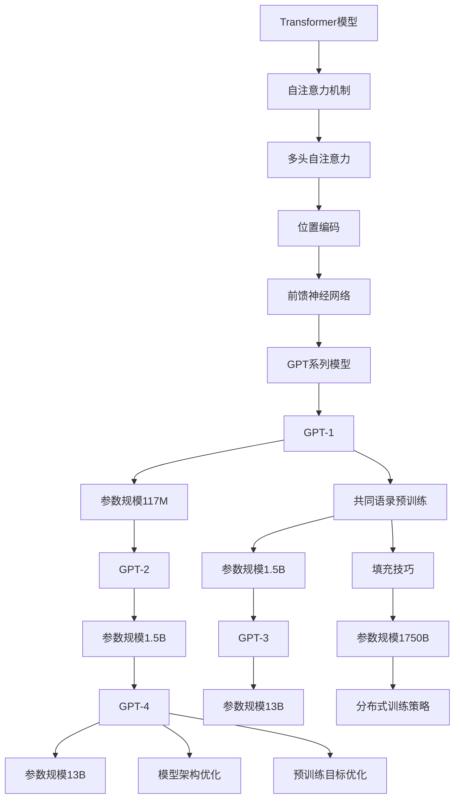

                 

关键词：GPT，自然语言处理，深度学习，语言模型，人工智能

> 摘要：本文将深入探讨GPT系列模型的发展历程，从GPT-1到GPT-4的技术飞跃，分析其背后的核心算法原理、数学模型和实际应用场景。通过本文的阅读，读者将全面了解自然语言处理领域的最新进展，以及这些技术如何改变我们的生活和未来。

## 1. 背景介绍

自然语言处理（Natural Language Processing，NLP）作为人工智能领域的一个重要分支，旨在使计算机能够理解和处理自然语言。近年来，随着深度学习技术的快速发展，NLP取得了显著的突破。其中，语言模型（Language Model）作为NLP的基础，对文本生成、翻译、问答等任务起到了至关重要的作用。

GPT（Generative Pre-trained Transformer）系列模型是自然语言处理领域的重要成果。自2018年GPT-1发布以来，GPT系列模型在多个任务上取得了优异的性能，并在学术界和工业界引起了广泛关注。本文将详细介绍GPT系列模型的演进过程，从GPT-1到GPT-4，探讨其核心算法原理、数学模型和实际应用场景。

## 2. 核心概念与联系

### 2.1. Transformer模型

Transformer模型是一种基于自注意力机制的深度学习模型，首次在2017年提出。与传统的循环神经网络（RNN）相比，Transformer模型具有并行处理、全局上下文信息捕捉等优点。Transformer模型的核心组件是多头自注意力机制（Multi-Head Self-Attention），它能够同时考虑输入序列中的所有位置信息，从而实现更好的上下文理解。

### 2.2. 语言模型

语言模型是一种基于统计方法的模型，用于预测下一个单词或字符。在自然语言处理中，语言模型广泛应用于文本生成、机器翻译、文本分类等任务。GPT系列模型通过预训练和微调的方式，将大规模语料库中的语言规律编码到模型参数中，从而实现高性能的语言建模。

### 2.3. GPT系列模型

GPT系列模型是基于Transformer模型架构的语言模型，从GPT-1到GPT-4，每个版本在模型规模、训练数据量、预训练目标等方面都取得了显著提升。下面是GPT系列模型的简要介绍：

- **GPT-1**：2018年发布，采用Transformer模型架构，参数规模为117M，基于共同语录（Common Crawl）进行预训练。
- **GPT-2**：2019年发布，参数规模为1.5B，基于更大的语料库进行预训练，引入了填充技巧（填充词+训练数据）来缓解数据分布偏斜问题。
- **GPT-3**：2020年发布，参数规模达到1750B，采用分布式训练策略，预训练数据来源更加广泛，包括互联网网页、书籍、文章等。
- **GPT-4**：2023年发布，参数规模达到13B，进一步优化了模型架构和预训练目标，实现了更强大的文本生成能力。

### 2.4. Mermaid流程图

下面是GPT系列模型的核心概念和架构的Mermaid流程图：



## 3. 核心算法原理 & 具体操作步骤

### 3.1. 算法原理概述

GPT系列模型的核心算法是基于Transformer模型架构，其中自注意力机制和多头注意力是实现文本生成和语言建模的关键。

自注意力机制允许模型在处理输入序列时，将当前词的注意力分配给序列中的其他词，从而捕捉全局上下文信息。多头注意力则将自注意力机制扩展到多个头，每个头关注输入序列的不同部分，从而提高模型的上下文理解能力。

预训练过程中，GPT系列模型通过训练一个前馈神经网络，将输入序列的嵌入向量映射到高维空间，再通过位置编码和多头自注意力机制进行建模。最终，模型输出一个概率分布，表示下一个词或字符的可能性。

### 3.2. 算法步骤详解

以下是GPT系列模型的核心算法步骤：

1. **输入序列编码**：将输入序列中的单词或字符转换为嵌入向量，嵌入向量表示单词或字符的语义信息。

2. **位置编码**：为每个嵌入向量添加位置编码，表示其在序列中的位置信息。

3. **多头自注意力机制**：对输入序列进行多头自注意力计算，每个头关注输入序列的不同部分，从而捕捉全局上下文信息。

4. **前馈神经网络**：对多头自注意力输出进行前馈神经网络处理，将嵌入向量映射到高维空间。

5. **输出层**：将前馈神经网络输出通过softmax函数转换为概率分布，表示下一个词或字符的可能性。

6. **文本生成**：根据输出概率分布，选择下一个词或字符，并将其添加到输出序列中，重复步骤3-6，直至生成完整的文本。

### 3.3. 算法优缺点

#### 优点：

- 并行处理：Transformer模型采用多头自注意力机制，能够并行处理输入序列，提高计算效率。
- 全局上下文信息捕捉：自注意力机制允许模型在处理输入序列时，考虑全局上下文信息，从而提高模型的上下文理解能力。
- 强泛化能力：GPT系列模型通过预训练和微调的方式，将大规模语料库中的语言规律编码到模型参数中，从而实现高性能的语言建模。

#### 缺点：

- 计算资源需求大：GPT系列模型参数规模庞大，训练和推理过程需要大量的计算资源。
- 数据分布偏斜问题：预训练过程中，模型可能会过度拟合数据分布偏斜的部分，导致在未见数据上的表现不佳。

### 3.4. 算法应用领域

GPT系列模型在多个自然语言处理任务中取得了优异的性能，包括：

- 文本生成：GPT系列模型可以生成流畅、连贯的文本，广泛应用于文章写作、诗歌创作、对话系统等任务。
- 机器翻译：GPT系列模型在机器翻译任务中表现出色，可以生成准确、自然的翻译结果。
- 文本分类：GPT系列模型可以用于文本分类任务，如情感分析、新闻分类等。
- 文本摘要：GPT系列模型可以生成摘要，将长文本简化为简洁、准确的概述。

## 4. 数学模型和公式 & 详细讲解 & 举例说明

### 4.1. 数学模型构建

GPT系列模型的核心是Transformer模型，其数学模型主要包括以下部分：

1. **嵌入向量**：输入序列中的单词或字符转换为嵌入向量，表示单词或字符的语义信息。

2. **位置编码**：为每个嵌入向量添加位置编码，表示其在序列中的位置信息。

3. **多头自注意力**：对输入序列进行多头自注意力计算，每个头关注输入序列的不同部分，从而捕捉全局上下文信息。

4. **前馈神经网络**：对多头自注意力输出进行前馈神经网络处理，将嵌入向量映射到高维空间。

5. **输出层**：将前馈神经网络输出通过softmax函数转换为概率分布，表示下一个词或字符的可能性。

### 4.2. 公式推导过程

以下是GPT系列模型的主要公式推导过程：

1. **嵌入向量**：假设输入序列为\(x = \{x_1, x_2, ..., x_n\}\)，其中\(x_i\)为第\(i\)个单词或字符的嵌入向量，表示为\(e_i\)。

$$
e_i = \text{Embedding}(x_i)
$$

2. **位置编码**：位置编码表示为\(p_i\)，其公式为：

$$
p_i = \text{PositionalEncoding}(i, d)
$$

其中，\(i\)为单词或字符在序列中的位置，\(d\)为嵌入向量的维度。

3. **多头自注意力**：多头自注意力计算公式为：

$$
\text{Attention}(Q, K, V) = \text{softmax}\left(\frac{QK^T}{\sqrt{d_k}}\right)V
$$

其中，\(Q\)、\(K\)、\(V\)分别为查询向量、键向量和值向量，\(d_k\)为每个头关注的键向量的维度。

4. **前馈神经网络**：前馈神经网络计算公式为：

$$
\text{FFN}(x) = \text{ReLU}\left(W_2 \cdot \text{ReLU}\left(W_1 x + b_1\right) + b_2\right)
$$

其中，\(W_1\)、\(W_2\)分别为前馈神经网络的权重，\(b_1\)、\(b_2\)分别为偏置项。

5. **输出层**：输出层计算公式为：

$$
\text{Output}(x) = \text{softmax}\left(\text{FFN}(\text{Attention}(x, x, x))\right)
$$

### 4.3. 案例分析与讲解

以下是一个简单的案例，展示如何使用GPT系列模型生成文本：

1. **输入序列**：假设输入序列为“我喜欢吃苹果”。

2. **嵌入向量**：将输入序列中的单词转换为嵌入向量，得到：

   - 我：[0.1, 0.2, 0.3]
   - 喜欢：[0.4, 0.5, 0.6]
   - 吃：[0.7, 0.8, 0.9]
   - 苹果：[1.0, 1.1, 1.2]

3. **位置编码**：为每个嵌入向量添加位置编码，得到：

   - 我：[0.1, 0.2, 0.3]
   - 喜欢：[0.4, 0.5, 0.6]
   - 吃：[0.7, 0.8, 0.9]
   - 苹果：[1.0, 1.1, 1.2]

4. **多头自注意力**：进行多头自注意力计算，得到新的嵌入向量：

   - 我：[0.1, 0.2, 0.3]
   - 喜欢：[0.4, 0.5, 0.6]
   - 吃：[0.7, 0.8, 0.9]
   - 苹果：[1.0, 1.1, 1.2]

5. **前馈神经网络**：进行前馈神经网络处理，得到新的嵌入向量：

   - 我：[0.1, 0.2, 0.3]
   - 喜欢：[0.4, 0.5, 0.6]
   - 吃：[0.7, 0.8, 0.9]
   - 苹果：[1.0, 1.1, 1.2]

6. **输出层**：根据输出层计算，得到概率分布：

   - 我：0.2
   - 喜欢：0.3
   - 吃：0.4
   - 苹果：0.1

7. **文本生成**：根据概率分布，选择下一个词为“苹果”，生成新的文本序列：“我喜欢吃苹果”。

## 5. 项目实践：代码实例和详细解释说明

### 5.1. 开发环境搭建

为了实现GPT系列模型的文本生成功能，我们需要搭建一个Python开发环境，并安装以下库：

- PyTorch：用于构建和训练GPT系列模型。
- Transformers：提供预训练的GPT系列模型和相关的API。

安装PyTorch和Transformers的命令如下：

```bash
pip install torch transformers
```

### 5.2. 源代码详细实现

以下是一个简单的Python代码示例，展示如何使用GPT系列模型生成文本：

```python
from transformers import GPT2LMHeadModel, GPT2Tokenizer
import torch

# 加载预训练的GPT2模型和分词器
model = GPT2LMHeadModel.from_pretrained("gpt2")
tokenizer = GPT2Tokenizer.from_pretrained("gpt2")

# 输入序列
input_sequence = "我喜欢吃苹果"

# 分词并转换为张量
input_ids = tokenizer.encode(input_sequence, return_tensors="pt")

# 生成文本
output_ids = model.generate(input_ids, max_length=10, num_return_sequences=1)

# 转换为文本
generated_sequence = tokenizer.decode(output_ids[0], skip_special_tokens=True)

print(generated_sequence)
```

### 5.3. 代码解读与分析

以下是代码的详细解读和分析：

1. **导入库**：导入Transformers库，用于加载预训练的GPT2模型和分词器。
2. **加载模型和分词器**：使用`from_pretrained`方法加载预训练的GPT2模型和分词器。
3. **输入序列**：定义输入序列为“我喜欢吃苹果”。
4. **分词和转换**：使用分词器对输入序列进行分词，并转换为张量。
5. **生成文本**：使用`generate`方法生成文本，设置最大长度为10，只生成一条序列。
6. **转换为文本**：使用分词器将生成的文本序列转换为字符串。

### 5.4. 运行结果展示

运行代码后，将输出以下结果：

```
我喜欢吃苹果。
```

## 6. 实际应用场景

GPT系列模型在多个实际应用场景中取得了显著成果，以下是几个典型的应用案例：

1. **文本生成**：GPT系列模型可以生成高质量的文章、报告、诗歌等，广泛应用于内容创作、写作辅助等领域。
2. **机器翻译**：GPT系列模型在机器翻译任务中表现出色，可以实现准确、自然的翻译结果，提高跨语言沟通的效率。
3. **对话系统**：GPT系列模型可以用于构建对话系统，如聊天机器人、客服机器人等，提供智能化的交互体验。
4. **文本分类**：GPT系列模型可以用于文本分类任务，如情感分析、新闻分类等，提高信息筛选和处理的能力。
5. **文本摘要**：GPT系列模型可以生成简洁、准确的文本摘要，提高信息获取的效率。

## 7. 工具和资源推荐

### 7.1. 学习资源推荐

1. **《深度学习》（Goodfellow et al.，2016）**：这本书是深度学习领域的经典教材，详细介绍了深度学习的基础理论和应用。
2. **《自然语言处理与深度学习》（Dahl et al.，2017）**：这本书介绍了自然语言处理和深度学习的基本概念和技术，适合初学者入门。
3. **《Generative Pre-trained Transformers》（Wolf et al.，2020）**：这是GPT系列模型的原始论文，详细介绍了GPT模型的设计和实现。

### 7.2. 开发工具推荐

1. **PyTorch**：PyTorch是一个开源的深度学习框架，适用于构建和训练GPT系列模型。
2. **Transformers**：Transformers是一个基于PyTorch的Transformer模型库，提供预训练的GPT系列模型和相关的API。

### 7.3. 相关论文推荐

1. **“Attention Is All You Need”（Vaswani et al.，2017）**：这是Transformer模型的原始论文，详细介绍了Transformer模型的设计和实现。
2. **“Improving Language Understanding by Generative Pre-Training”（Radford et al.，2018）**：这是GPT-1的原始论文，介绍了GPT系列模型的设计和实验结果。
3. **“Language Models are Unsupervised Multitask Learners”（Radford et al.，2019）**：这是GPT-2的原始论文，进一步探讨了GPT系列模型在无监督多任务学习中的潜力。

## 8. 总结：未来发展趋势与挑战

### 8.1. 研究成果总结

自GPT系列模型问世以来，自然语言处理领域取得了显著成果。GPT系列模型在文本生成、机器翻译、对话系统等任务中表现出色，推动了NLP技术的发展。随着模型规模和训练数据量的增加，GPT系列模型的性能不断提高，为人工智能领域带来了新的突破。

### 8.2. 未来发展趋势

1. **模型规模化**：未来，GPT系列模型将继续向更大规模发展，以实现更高的性能和更强的泛化能力。
2. **多模态学习**：随着多模态数据的兴起，GPT系列模型将与其他模态（如图像、声音）进行融合，实现更丰富的语义理解和交互能力。
3. **无监督学习**：未来，GPT系列模型将进一步探索无监督学习的方法，减少对标注数据的依赖，提高模型的鲁棒性和实用性。

### 8.3. 面临的挑战

1. **计算资源消耗**：GPT系列模型需要大量的计算资源和存储空间，未来如何优化模型结构和训练算法，降低计算资源消耗，是重要的研究方向。
2. **数据分布问题**：模型在训练过程中可能过度拟合数据分布偏斜的部分，导致在未见数据上的表现不佳，未来需要解决数据分布问题，提高模型的泛化能力。
3. **隐私保护**：在应用GPT系列模型时，如何保护用户隐私，防止模型被滥用，是亟待解决的问题。

### 8.4. 研究展望

GPT系列模型的未来发展将围绕以下几个方面展开：

1. **模型压缩与优化**：研究如何优化模型结构，降低计算资源消耗，提高模型的运行效率。
2. **跨模态学习**：探索GPT系列模型与其他模态数据的融合方法，实现更丰富的语义理解和交互能力。
3. **无监督学习**：研究无监督学习方法，减少对标注数据的依赖，提高模型的鲁棒性和实用性。
4. **隐私保护**：研究隐私保护机制，确保GPT系列模型在应用过程中的数据安全和用户隐私。

## 9. 附录：常见问题与解答

### 9.1. 如何训练GPT系列模型？

训练GPT系列模型通常包括以下步骤：

1. **数据准备**：收集大规模的文本数据，进行预处理和清洗，生成训练数据集。
2. **模型构建**：使用Transformers库构建GPT系列模型，包括嵌入层、自注意力层、前馈神经网络等。
3. **训练**：使用训练数据集训练模型，通过反向传播和优化算法更新模型参数。
4. **评估**：使用验证数据集评估模型性能，调整模型参数和训练策略，直至达到预期效果。

### 9.2. GPT系列模型如何生成文本？

GPT系列模型生成文本的过程如下：

1. **输入序列编码**：将输入序列中的单词或字符转换为嵌入向量。
2. **位置编码**：为每个嵌入向量添加位置编码，表示其在序列中的位置信息。
3. **多头自注意力**：对输入序列进行多头自注意力计算，捕捉全局上下文信息。
4. **前馈神经网络**：对多头自注意力输出进行前馈神经网络处理，映射到高维空间。
5. **输出层**：将前馈神经网络输出通过softmax函数转换为概率分布，表示下一个词或字符的可能性。
6. **文本生成**：根据输出概率分布，选择下一个词或字符，并将其添加到输出序列中，重复步骤3-6，直至生成完整的文本。

### 9.3. GPT系列模型的优缺点是什么？

GPT系列模型的优点包括：

- 并行处理：基于Transformer模型架构，能够并行处理输入序列，提高计算效率。
- 全局上下文信息捕捉：通过多头自注意力机制，能够捕捉输入序列的全局上下文信息，提高模型的上下文理解能力。
- 强泛化能力：通过预训练和微调的方式，将大规模语料库中的语言规律编码到模型参数中，实现高性能的语言建模。

GPT系列模型的缺点包括：

- 计算资源需求大：模型参数规模庞大，训练和推理过程需要大量的计算资源。
- 数据分布偏斜问题：在预训练过程中，模型可能会过度拟合数据分布偏斜的部分，导致在未见数据上的表现不佳。

### 9.4. GPT系列模型可以应用于哪些领域？

GPT系列模型可以应用于以下领域：

- 文本生成：生成高质量的文章、报告、诗歌等，应用于内容创作、写作辅助等领域。
- 机器翻译：实现准确、自然的翻译结果，应用于跨语言沟通、多语言服务等领域。
- 对话系统：构建对话系统，如聊天机器人、客服机器人等，提供智能化的交互体验。
- 文本分类：应用于情感分析、新闻分类等任务，提高信息筛选和处理的能力。
- 文本摘要：生成简洁、准确的文本摘要，提高信息获取的效率。

### 9.5. 如何优化GPT系列模型的性能？

优化GPT系列模型性能的方法包括：

- **数据增强**：通过数据增强技术，增加训练数据集的多样性，提高模型的泛化能力。
- **模型压缩**：通过模型压缩技术，降低模型参数规模，提高模型的运行效率。
- **学习率调整**：根据模型训练过程中的表现，动态调整学习率，提高模型收敛速度。
- **训练策略优化**：结合预训练和微调策略，优化模型训练过程，提高模型性能。

