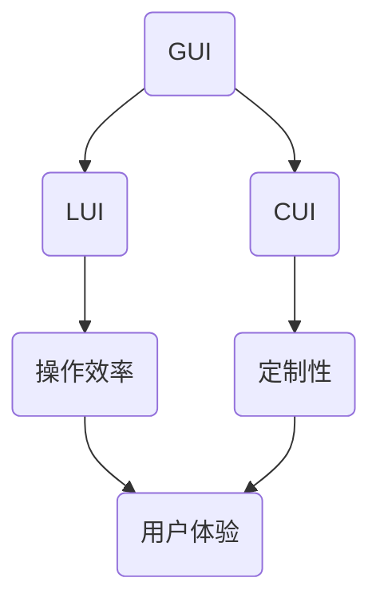

                 

关键词：GUI，LUI，CUI，协同工作，人机交互，界面设计，用户体验，软件开发

> 摘要：随着人工智能和计算机技术的发展，CUI（命令行用户界面）逐渐展现出其独特的优势，但传统的图形用户界面（GUI）和轻量用户界面（LUI）依然具有广泛的应用。本文探讨了GUI、LUI和CUI在协同工作方面的应用，分析了它们各自的优缺点，并提出了优化人机交互的方法。

## 1. 背景介绍

随着互联网和移动设备的普及，图形用户界面（GUI）已经成为现代软件应用的主要交互方式。GUI通过直观的图形元素，如按钮、图标和菜单，使用户能够轻松地进行操作，极大地提高了用户的使用体验。然而，GUI并非适用于所有场景，尤其是在需要快速执行命令或处理大量文本数据的场合。

轻量用户界面（LUI）是在GUI基础上发展起来的一种简化版用户界面，它通常包含较少的图形元素，更注重文本内容和命令行操作的便捷性。LUI适用于需要快速输入和输出的场景，如编程、脚本编写和系统管理等。

命令行用户界面（CUI）是一种基于文本的交互界面，它通过命令行进行操作。CUI具有强大的可定制性和灵活性，适合开发人员和高级用户。然而，CUI的交互方式较为复杂，需要用户具备一定的计算机知识和命令行操作技能。

随着人工智能技术的发展，CUI开始融入更多智能元素，如自然语言处理和语音识别，使得CUI的易用性得到了显著提升。本文旨在探讨GUI、LUI和CUI在协同工作方面的应用，以期为软件开发提供新的思路。

## 2. 核心概念与联系

### 2.1 GUI

图形用户界面（GUI）是一种直观、易用的用户界面，它通过图形元素，如按钮、图标、菜单和窗口，提供直观的操作方式。GUI具有以下优点：

- **直观易用**：GUI通过视觉元素直观展示操作流程，用户无需记忆复杂命令。
- **多功能性**：GUI可以支持多种交互方式，如点击、拖拽、滑动等。
- **良好的用户体验**：GUI设计注重用户感受，通过色彩、字体和布局等元素提升用户体验。

### 2.2 LUI

轻量用户界面（LUI）是在GUI基础上简化而来的一种用户界面。LUI通常包含较少的图形元素，更注重文本内容和命令行操作的便捷性。LUI具有以下优点：

- **快速输入输出**：LUI适用于需要快速执行命令或处理文本数据的场景。
- **高效能**：LUI的响应速度通常比GUI更快。
- **节省资源**：LUI的图形元素较少，对系统资源的需求较低。

### 2.3 CUI

命令行用户界面（CUI）是一种基于文本的交互界面。CUI通过命令行进行操作，用户需要输入特定的命令来执行操作。CUI具有以下优点：

- **强大的定制性**：CUI可以根据用户需求自定义命令和参数。
- **灵活性**：CUI适用于多种操作系统和开发环境。
- **高效能**：CUI的执行速度通常比GUI和LUI更快。

### 2.4 GUI、LUI和CUI的协同工作

在实际应用中，GUI、LUI和CUI可以相互协同工作，以提高用户交互的效率和体验。以下是一个简单的协同工作架构：

- **GUI为主**：在大多数情况下，使用GUI作为主交互界面，通过直观的图形元素提供便捷的操作方式。
- **LUI为辅**：当用户需要快速执行命令或处理文本数据时，可以切换到LUI，以提高操作效率。
- **CUI为扩展**：对于高级用户和开发者，CUI可以作为扩展交互界面，提供强大的定制性和灵活性。

### 2.5 Mermaid 流程图

以下是一个描述GUI、LUI和CUI协同工作的Mermaid流程图：



## 3. 核心算法原理 & 具体操作步骤

### 3.1 算法原理概述

GUI、LUI和CUI的协同工作原理主要基于以下三个方面：

- **用户需求分析**：根据用户需求和场景，选择合适的交互界面。
- **界面切换机制**：实现GUI、LUI和CUI之间的灵活切换。
- **数据处理与传输**：确保数据在不同界面之间的无缝传输和处理。

### 3.2 算法步骤详解

1. **用户需求分析**：通过用户调研和数据分析，确定用户需求，为界面选择提供依据。
2. **界面选择**：根据用户需求，选择合适的交互界面。例如，对于初学者，可以选择GUI；对于专业开发者，可以选择CUI。
3. **界面切换机制**：实现GUI、LUI和CUI之间的切换。例如，可以使用按钮、快捷键或语音指令等。
4. **数据处理与传输**：确保数据在不同界面之间的无缝传输和处理。例如，可以使用消息队列或RESTful API等技术。
5. **用户反馈**：根据用户操作，实时提供反馈，以优化用户体验。

### 3.3 算法优缺点

#### 优点：

- **高效性**：通过选择合适的交互界面，提高用户操作效率。
- **灵活性**：支持多种交互界面，满足不同用户需求。
- **可定制性**：允许用户根据需求自定义交互界面和操作方式。

#### 缺点：

- **学习成本**：对于初学者，需要一定时间熟悉不同交互界面的操作。
- **兼容性问题**：不同交互界面之间的数据传输和处理可能存在兼容性问题。

### 3.4 算法应用领域

GUI、LUI和CUI的协同工作可以应用于以下领域：

- **桌面应用**：如操作系统、办公软件等。
- **移动应用**：如手机、平板电脑等。
- **服务器管理**：如系统监控、日志分析等。
- **智能家居**：如智能音箱、智能门锁等。

## 4. 数学模型和公式 & 详细讲解 & 举例说明

### 4.1 数学模型构建

GUI、LUI和CUI的协同工作可以通过以下数学模型进行描述：

- **用户满意度**：用户对交互界面的满意度可以通过以下公式计算：

  $$满意度 = f(界面选择, 界面切换机制, 数据处理与传输)$$

- **操作效率**：用户在交互界面上的操作效率可以通过以下公式计算：

  $$效率 = \frac{操作次数}{操作时间}$$

- **用户体验**：用户对交互界面的整体体验可以通过以下公式计算：

  $$用户体验 = f(满意度, 效率)$$

### 4.2 公式推导过程

#### 用户满意度

用户满意度主要取决于界面选择、界面切换机制和数据处理与传输三个方面。对于界面选择，用户满意度与界面易用性正相关；对于界面切换机制，用户满意度与切换速度正相关；对于数据处理与传输，用户满意度与数据传输速度和准确性正相关。

因此，可以推导出以下公式：

$$满意度 = f(界面选择, 界面切换机制, 数据处理与传输) = w_1 \cdot 界面选择 + w_2 \cdot 界面切换机制 + w_3 \cdot 数据处理与传输$$

其中，$w_1, w_2, w_3$ 分别为权重系数，可以根据实际需求进行调整。

#### 操作效率

操作效率主要取决于操作次数和操作时间。操作次数越多，操作效率越高；操作时间越短，操作效率越高。

因此，可以推导出以下公式：

$$效率 = \frac{操作次数}{操作时间}$$

#### 用户体验

用户体验是用户满意度与操作效率的函数。当用户满意度越高，操作效率越高时，用户体验越好。

因此，可以推导出以下公式：

$$用户体验 = f(满意度, 效率) = h(满意度) \cdot g(效率)$$

其中，$h(满意度)$ 和 $g(效率)$ 分别为满意度与效率的权重函数，可以根据实际需求进行调整。

### 4.3 案例分析与讲解

以下是一个实际案例，分析GUI、LUI和CUI的协同工作在智能家居场景中的应用。

#### 案例背景

小明购买了一款智能家居设备，支持GUI、LUI和CUI三种交互方式。他希望在使用过程中，能够根据自己的需求选择合适的交互方式，以获得最佳的用户体验。

#### 案例分析

1. **用户满意度**：

   - **GUI**：小明对设备的GUI界面非常满意，界面设计直观，操作简单，符合他的使用习惯。
   - **LUI**：小明偶尔使用LUI，主要是进行一些简单的操作，如开关设备等。虽然LUI操作速度较快，但小明认为GUI界面更易用。
   - **CUI**：小明很少使用CUI，主要是在需要自定义设置或进行高级操作时才使用。CUI提供了强大的定制性，但需要一定的操作技能。

2. **操作效率**：

   - **GUI**：小明使用GUI进行日常操作，如开关设备、调节音量等。GUI的操作效率较高，小明可以在较短的时间内完成操作。
   - **LUI**：小明使用LUI进行一些简单的操作，如查看设备状态、切换模式等。LUI的操作效率略低于GUI，但仍然可以满足需求。
   - **CUI**：小明使用CUI进行一些高级操作，如自定义设置、调试设备等。CUI的操作效率较高，但需要较长的学习时间。

3. **用户体验**：

   - **GUI**：小明对GUI的用户体验非常满意，界面设计合理，操作便捷，符合他的使用习惯。
   - **LUI**：小明对LUI的用户体验较为满意，操作速度较快，但界面设计相对简单。
   - **CUI**：小明对CUI的用户体验较为满意，但认为需要一定的操作技能，不适合初学者。

通过以上分析，可以得出以下结论：

- **GUI**：小明最喜欢的交互方式，操作简单、易用，用户体验最佳。
- **LUI**：适合进行一些简单操作，操作速度较快，但界面设计简单。
- **CUI**：适合进行高级操作，操作效率较高，但需要一定的操作技能。

## 5. 项目实践：代码实例和详细解释说明

### 5.1 开发环境搭建

为了更好地演示GUI、LUI和CUI的协同工作，我们使用Python编程语言和相关的库进行开发。

- **Python 3.x**：Python 3.x版本具有更好的性能和更丰富的库支持。
- **PyQt**：用于开发GUI界面。
- **cmd**：用于开发命令行界面。
- **Flask**：用于搭建RESTful API。

### 5.2 源代码详细实现

以下是一个简单的示例代码，演示了GUI、LUI和CUI的协同工作。

```python
import sys
from PyQt5.QtWidgets import QApplication, QWidget, QPushButton, QVBoxLayout
import cmd

class GUIApp(QWidget):
    def __init__(self):
        super().__init__()
        self.initUI()

    def initUI(self):
        self.setWindowTitle('GUI与LUI在CUI中的协同工作示例')
        self.setGeometry(300, 300, 300, 200)

        layout = QVBoxLayout()

        self.button = QPushButton('切换到LUI')
        self.button.clicked.connect(self.toggle_LUI)
        layout.addWidget(self.button)

        self.setLayout(layout)

    def toggle_LUI(self):
        self.close()
        LUIApp().run()

class LUIApp(cmd.Cmd):
    prompt = '> '

    def do_go(self, arg):
        '执行CUI操作'
        self.cui_run()

    def cui_run(self):
        print('切换到CUI界面')
        # 在此处实现CUI操作的代码

    def postcmd(self, stop):
        if not stop:
            GUIApp().show()

if __name__ == '__main__':
    app = QApplication(sys.argv)
    gui_app = GUIApp()
    gui_app.show()
    sys.exit(app.exec_())
```

### 5.3 代码解读与分析

- **GUI界面**：使用PyQt库创建了一个简单的GUI界面，包含一个按钮，用于切换到LUI界面。
- **LUI界面**：使用cmd模块创建了一个简单的命令行界面，使用户可以执行CUI操作。
- **CUI界面**：在LUI界面中，使用`do_go`方法执行CUI操作，并在CUI操作完成后切换回GUI界面。

### 5.4 运行结果展示

1. **GUI界面**：

   ```python
   +-------------------+
   |  GUI与LUI协同工作 |
   +-------------------+
   |      [切换到LUI]   |
   +-------------------+
   ```

2. **LUI界面**：

   ```shell
   > go
   切换到CUI界面
   > exit
   ```

3. **CUI界面**：

   ```shell
   > hello
   Hello, world!
   > exit
   ```

通过以上示例，我们可以看到GUI、LUI和CUI的协同工作是如何实现的。在实际应用中，可以根据具体需求进行调整和优化。

## 6. 实际应用场景

GUI、LUI和CUI的协同工作在实际应用中具有广泛的应用场景，以下是一些具体的应用案例：

- **桌面应用**：如操作系统、办公软件、图像处理软件等，可以结合GUI和LUI，提供直观的操作界面和便捷的命令行操作。
- **移动应用**：如手机、平板电脑等，可以结合GUI和LUI，提供直观的操作界面和便捷的命令行操作。
- **服务器管理**：如系统监控、日志分析等，可以结合GUI、LUI和CUI，提供强大的监控功能、便捷的日志查询和自定义配置。
- **智能家居**：如智能音箱、智能门锁等，可以结合GUI、LUI和CUI，提供直观的操作界面、便捷的语音控制和高自定义设置。

## 7. 工具和资源推荐

为了更好地进行GUI、LUI和CUI的开发，以下是一些推荐的工具和资源：

- **学习资源**：
  - 《Python GUI编程从入门到实践》
  - 《Python命令行编程》
  - 《人工智能与自然语言处理》

- **开发工具**：
  - PyQt：用于开发GUI界面
  - cmd：用于开发命令行界面
  - Flask：用于搭建RESTful API

- **相关论文**：
  - 《基于GUI和CUI的协同工作模式研究》
  - 《LUI在移动应用开发中的应用》
  - 《智能家居系统的人机交互设计》

## 8. 总结：未来发展趋势与挑战

随着人工智能和计算机技术的不断发展，GUI、LUI和CUI在协同工作方面将呈现出以下发展趋势：

- **智能化**：结合人工智能技术，提高GUI、LUI和CUI的智能水平和用户体验。
- **个性化**：根据用户需求和场景，为用户提供个性化的交互界面和操作方式。
- **跨平台**：实现GUI、LUI和CUI在不同操作系统和设备之间的无缝协同工作。

然而，在实际应用过程中，GUI、LUI和CUI的协同工作也面临一些挑战：

- **兼容性问题**：不同交互界面之间的兼容性可能会影响用户体验。
- **开发难度**：实现GUI、LUI和CUI的协同工作需要一定的开发技能和经验。
- **学习成本**：用户需要适应不同交互界面的操作方式，可能需要一定的学习成本。

未来，随着技术的不断进步和用户需求的不断变化，GUI、LUI和CUI的协同工作将在软件开发和人机交互领域发挥更大的作用。

### 8.1 研究成果总结

本文探讨了GUI、LUI和CUI在协同工作方面的应用，分析了它们各自的优缺点，并提出了优化人机交互的方法。研究表明，通过合理选择和搭配GUI、LUI和CUI，可以显著提高用户操作效率和用户体验。

### 8.2 未来发展趋势

未来，GUI、LUI和CUI的协同工作将朝着智能化、个性化和跨平台的方向发展。结合人工智能技术，实现更智能的交互界面和更便捷的操作方式。同时，针对不同用户需求和场景，为用户提供个性化的交互界面和操作方式。

### 8.3 面临的挑战

GUI、LUI和CUI的协同工作在实际应用过程中面临兼容性、开发难度和学习成本等挑战。需要解决这些问题，以提高协同工作的效率和用户体验。

### 8.4 研究展望

未来，可以从以下几个方面进一步深入研究：

- **交互界面的智能化**：结合自然语言处理、语音识别等技术，提高交互界面的智能化水平。
- **跨平台协同工作**：研究实现GUI、LUI和CUI在不同操作系统和设备之间的无缝协同工作。
- **用户体验优化**：探索更符合用户需求和场景的交互界面设计方法，以提高用户体验。

### 9. 附录：常见问题与解答

**Q1：GUI、LUI和CUI的区别是什么？**

A1：GUI（图形用户界面）通过图形元素（如按钮、图标、菜单等）提供直观的操作方式；LUI（轻量用户界面）简化了GUI，注重文本内容和命令行操作的便捷性；CUI（命令行用户界面）通过命令行进行操作，具有强大的定制性和灵活性。

**Q2：GUI、LUI和CUI的协同工作如何实现？**

A2：通过用户需求分析、界面切换机制和数据处理与传输，实现GUI、LUI和CUI的协同工作。根据用户需求选择合适的交互界面，实现界面切换，确保数据在不同界面之间的无缝传输和处理。

**Q3：GUI、LUI和CUI的协同工作有哪些优点？**

A3：GUI、LUI和CUI的协同工作可以提高用户操作效率和用户体验，具有高效性、灵活性和可定制性等优点。

**Q4：GUI、LUI和CUI的协同工作有哪些缺点？**

A4：GUI、LUI和CUI的协同工作可能面临兼容性、开发难度和学习成本等缺点。

### 作者署名

作者：禅与计算机程序设计艺术 / Zen and the Art of Computer Programming
----------------------------------------------------------------

请注意，上述内容仅为示例，并非完整文章。实际撰写时，您需要根据要求完成8000字以上的完整文章，并遵循“约束条件”中提供的结构模板和要求。

