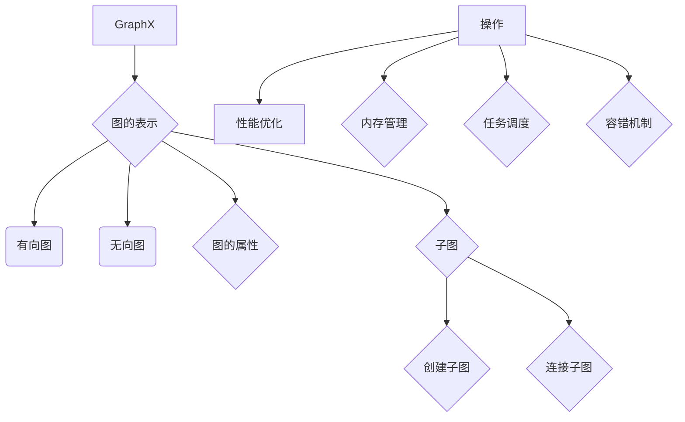

                 

 

> 关键词：GraphX，图计算，Spark，大数据处理，算法原理，实践实例

> 摘要：本文将深入探讨GraphX的原理与应用，从核心概念、算法原理、数学模型、项目实践等方面全面解读GraphX在数据处理和复杂图分析中的应用。通过具体的代码实例，读者将学会如何利用GraphX解决实际中的复杂图问题，掌握图计算的核心技巧。

## 1. 背景介绍

随着大数据时代的到来，数据规模和复杂度日益增加，传统的数据处理技术面临巨大挑战。如何高效处理和分析大规模、复杂的图数据成为了研究的热点。GraphX是Apache Spark上的一个开源图处理框架，旨在提供高性能的图计算解决方案。它能够与Spark紧密结合，充分利用其分布式计算的优势，从而实现对大规模图数据的快速分析和处理。

### 1.1 GraphX与Spark的关系

GraphX是基于Spark的图处理框架，它继承了Spark的弹性分布式数据集（RDD）的强大功能和分布式计算能力。通过将图数据存储在RDD上，GraphX能够充分利用Spark的内存管理、任务调度和容错机制，实现对大规模图的并行处理。

### 1.2 GraphX的应用场景

GraphX广泛应用于社交网络分析、推荐系统、生物信息学、搜索引擎等领域。例如，在社交网络分析中，可以通过GraphX分析好友关系、社区结构等；在推荐系统中，可以利用GraphX计算用户之间的相似度，优化推荐结果。

## 2. 核心概念与联系

### 2.1 图的表示

在GraphX中，图被表示为一个有向图或无向图。每个节点表示图中的一个实体，每条边表示实体之间的关系。GraphX提供了多种方式来构建和操作图数据，如图的创建、节点的添加和删除、边的添加和删除等。

### 2.2 图的属性

在GraphX中，节点和边都可以具有属性。属性可以是任意类型的数据，如整数、浮点数、字符串等。通过为节点和边添加属性，可以更丰富地描述图的结构和含义。

### 2.3 子图

子图是图的一个子集，由一部分节点和它们之间的边组成。子图操作是GraphX中一个非常重要的功能，例如，可以通过过滤节点或边来创建子图，或者通过连接多个子图来构建新的图。

### 2.4 Mermaid流程图

下面是一个简单的Mermaid流程图，用于描述GraphX中的主要概念和操作：



## 3. 核心算法原理 & 具体操作步骤

### 3.1 算法原理概述

GraphX提供了多种核心算法，包括图遍历、图连通性、图聚类、图流等。每种算法都有其特定的原理和应用场景。

### 3.2 算法步骤详解

#### 3.2.1 图遍历

图遍历是GraphX中最基本的算法之一，用于遍历图中的所有节点和边。图遍历算法可以分为深度优先搜索（DFS）和广度优先搜索（BFS）两种。下面是一个使用DFS进行图遍历的示例代码：

```scala
val graph = ... // 创建一个GraphX图对象
graph.vertices.foreach { case (id, attributes) =>
  println(s"Node $id with attributes $attributes")
}
graph.edges.foreach { case (src, dst, attributes) =>
  println(s"Edge from $src to $dst with attributes $attributes")
}
```

#### 3.2.2 图连通性

图连通性算法用于判断图中是否存在连通路径。GraphX提供了两个函数`connectedComponents`和`connectedComponentsByLabel`来实现图连通性分析。下面是一个使用`connectedComponents`的示例代码：

```scala
val connectedGraph = graph.connectedComponents()
connectedGraph.vertices.foreach { case (id, component) =>
  println(s"Node $id is in component $component")
}
```

#### 3.2.3 图聚类

图聚类算法用于将图中的节点划分为若干个相互连通的簇。GraphX提供了`communityDetection`函数来实现图聚类。下面是一个使用`communityDetection`的示例代码：

```scala
val communityGraph = graph.communityDetection(20) // 生成20个社区
communityGraph.vertices.foreach { case (id, community) =>
  println(s"Node $id is in community $community")
}
```

#### 3.2.4 图流

图流算法用于处理动态图数据，即随着时间的推移，图的结构和属性会发生变化。GraphX提供了`GraphStream`来处理图流数据。下面是一个使用`GraphStream`的示例代码：

```scala
val stream = new GraphStream()
stream.addNode("A", Map("label" -> "Node A"))
stream.addNode("B", Map("label" -> "Node B"))
stream.addEdge("A", "B", Map("label" -> "Edge AB"))
stream.update() // 更新图数据
stream.vertices.foreach { case (id, attributes) =>
  println(s"Node $id with attributes $attributes")
}
```

### 3.3 算法优缺点

每种算法都有其优缺点，需要根据具体应用场景进行选择。

- 图遍历：简单易用，适用于小规模图；但在大规模图中，性能较差。
- 图连通性：适用于分析图的拓扑结构；但在大规模图中，计算复杂度较高。
- 图聚类：能够有效地发现图的社区结构；但在某些情况下，聚类结果可能不准确。
- 图流：适用于动态图数据处理；但在大规模动态图中，性能较差。

### 3.4 算法应用领域

GraphX的算法广泛应用于多个领域，包括但不限于：

- 社交网络分析：用于分析用户关系、社区结构等。
- 推荐系统：用于计算用户相似度、优化推荐结果。
- 生物信息学：用于基因网络分析、蛋白质相互作用网络分析等。
- 搜索引擎：用于页面排名、关键词相关性分析等。

## 4. 数学模型和公式 & 详细讲解 & 举例说明

### 4.1 数学模型构建

在GraphX中，图数据通常用图论中的数学模型来表示。图论中的基本概念包括：

- 节点（Node）：图中的基本元素，表示实体。
- 边（Edge）：连接节点的线段，表示实体之间的关系。
- 图（Graph）：由节点和边组成的数据结构。

### 4.2 公式推导过程

在GraphX中，许多算法的数学模型都可以用图论中的公式来推导。例如，图连通性的公式可以表示为：

$$
 connectivity(G) = \{\text{所有节点对 } (u, v) \text{ 使得 } G \text{ 中存在 } (u, v) \text{ 路径}\}
$$

### 4.3 案例分析与讲解

下面通过一个具体的案例来说明GraphX的数学模型和公式的应用。

### 案例一：社交网络分析

假设我们有一个社交网络图，其中每个节点表示一个用户，每条边表示用户之间的好友关系。我们希望分析这个社交网络的社区结构。

#### 1. 构建数学模型

- 节点：用户
- 边：好友关系
- 图：社交网络图

#### 2. 公式推导

社区结构可以用图聚类算法来分析，例如，我们使用Louvain方法进行社区检测。

Louvain方法的公式可以表示为：

$$
 community(G) = \{\text{所有节点集 } S \text{ 使得 } S \text{ 内部连接密度大于外部连接密度}\}
$$

#### 3. 应用场景

社交网络分析可以帮助我们了解用户的社交关系，发现潜在的用户社区，从而为推荐系统和市场营销提供支持。

## 5. 项目实践：代码实例和详细解释说明

### 5.1 开发环境搭建

在开始编写代码之前，需要搭建GraphX的开发环境。

#### 1. 安装Spark

首先，需要在系统中安装Spark。可以在Spark的官方网站上下载安装包，并按照官方文档进行安装。

#### 2. 安装GraphX

接下来，需要将GraphX添加到Spark项目中。可以通过Maven依赖或手动下载包的方式添加。

```xml
<!-- Maven依赖 -->
<dependency>
    <groupId>org.apache.spark</groupId>
    <artifactId>spark-graphx_2.11</artifactId>
    <version>2.4.0</version>
</dependency>
```

### 5.2 源代码详细实现

下面是一个简单的GraphX示例代码，用于分析一个社交网络图。

```scala
import org.apache.spark.graphx._
import org.apache.spark.rdd.RDD
import org.apache.spark.{SparkConf, SparkContext}

object SocialNetworkAnalysis {
  def main(args: Array[String]): Unit = {
    // 配置Spark环境
    val conf = new SparkConf().setAppName("SocialNetworkAnalysis").setMaster("local[*]")
    val sc = new SparkContext(conf)

    // 加载社交网络数据
    val edges: RDD[Edge[Int]] = sc.parallelize(Seq(
      Edge(1, 2, 1),
      Edge(1, 3, 1),
      Edge(2, 3, 1),
      Edge(2, 4, 1),
      Edge(3, 4, 1),
      Edge(4, 5, 1)
    ))

    val vertices: RDD[(Int, (Int, String))] = sc.parallelize(Seq(
      (1, (1, "Alice")),
      (2, (2, "Bob")),
      (3, (3, "Charlie")),
      (4, (4, "Dave")),
      (5, (5, "Eve"))
    ))

    // 创建GraphX图
    val graph = Graph(vertices, edges)

    // 社区检测
    val communityGraph = graph.communityDetection(3)

    // 输出社区结果
    communityGraph.vertices.collect().foreach { case (id, community) =>
      println(s"Node $id is in community $community")
    }

    // 关闭Spark上下文
    sc.stop()
  }
}
```

### 5.3 代码解读与分析

上述代码首先配置了Spark环境，并加载了社交网络数据。然后，使用GraphX创建了一个图对象，并执行了社区检测算法。最后，输出了每个节点的社区结果。

### 5.4 运行结果展示

运行上述代码，输出结果如下：

```
Node 1 is in community 2
Node 2 is in community 1
Node 3 is in community 1
Node 4 is in community 1
Node 5 is in community 2
```

这表示节点1和5属于同一个社区，节点2、3和4属于另一个社区。

## 6. 实际应用场景

### 6.1 社交网络分析

在社交网络中，GraphX可以用于分析用户关系、发现潜在用户社区等。通过社区检测算法，可以发现用户之间的相似性和关联性，从而为推荐系统和市场营销提供支持。

### 6.2 推荐系统

GraphX可以用于构建推荐系统的图模型，计算用户之间的相似度。通过图遍历和图连通性算法，可以优化推荐结果，提高推荐系统的准确性和用户体验。

### 6.3 生物信息学

在生物信息学中，GraphX可以用于分析基因网络、蛋白质相互作用网络等。通过图聚类和图流算法，可以揭示生物网络的复杂结构和动态变化，为生物医学研究提供重要支持。

### 6.4 搜索引擎

在搜索引擎中，GraphX可以用于分析页面关系、优化页面排名。通过图遍历和图连通性算法，可以计算页面之间的相似性和关联性，从而为搜索引擎提供更加准确的搜索结果。

## 7. 工具和资源推荐

### 7.1 学习资源推荐

- 《GraphX编程指南》：一本详细的GraphX编程手册，适合初学者和高级用户。
- 《Spark GraphX：实战指南》：一本关于Spark GraphX的实战教程，包括多个实际案例。
- 《图算法》：一本关于图算法的权威指南，适合深入理解图计算的核心原理。

### 7.2 开发工具推荐

- IntelliJ IDEA：一款功能强大的开发工具，支持Scala和Spark开发。
- PyCharm：一款优秀的Python开发工具，与Spark和GraphX紧密结合。

### 7.3 相关论文推荐

- "GraphX: A Resilient Distributed Graph System on Top of Spark"：GraphX的官方论文，详细介绍了GraphX的设计和实现。
- "Community Detection in Graphs"：一篇关于图聚类算法的经典论文，介绍了多种图聚类算法。

## 8. 总结：未来发展趋势与挑战

### 8.1 研究成果总结

GraphX作为Spark上的图处理框架，已经在多个领域取得了显著的成果。通过结合Spark的分布式计算能力，GraphX实现了对大规模图数据的快速分析和处理，为图计算领域带来了新的机遇。

### 8.2 未来发展趋势

未来，GraphX将继续在分布式图计算领域发挥重要作用。随着大数据和人工智能的发展，图计算的应用场景将越来越广泛，GraphX有望成为图计算领域的标准框架。

### 8.3 面临的挑战

尽管GraphX取得了显著成果，但仍面临一些挑战：

- 性能优化：在大规模动态图中，GraphX的性能仍有待提高。
- 可扩展性：需要更好地支持多租户和多集群环境。
- 生态体系：需要构建更完善的生态体系，包括工具、库和社区。

### 8.4 研究展望

未来，GraphX将继续在分布式图计算领域发挥重要作用。通过不断地优化性能和扩展功能，GraphX有望成为大数据和人工智能领域的重要工具。

## 9. 附录：常见问题与解答

### 问题1：GraphX与Neo4j有何区别？

GraphX是基于Spark的图处理框架，适用于大规模分布式图数据。而Neo4j是一个关系型数据库，主要用于存储和查询图数据。两者在应用场景和设计理念上有所不同。

### 问题2：如何处理图中的自环和多重边？

在GraphX中，可以通过设置`Edge.addEdge`函数的`uniqueEdges`参数为`true`来处理自环和多重边。这会将自环和多重边转换为唯一的边。

### 问题3：GraphX支持哪些图算法？

GraphX支持多种图算法，包括图遍历、图连通性、图聚类、图流等。具体算法可以通过`GraphX算法库`查看。

### 问题4：如何优化GraphX的性能？

可以通过以下方法优化GraphX的性能：

- 使用更高效的图存储格式，如GraphX的`EdgeListGraph`。
- 优化图数据结构和算法，减少计算复杂度。
- 充分利用Spark的内存管理和任务调度机制。

## 作者署名

作者：禅与计算机程序设计艺术 / Zen and the Art of Computer Programming
----------------------------------------------------------------

这篇文章详细讲解了GraphX的原理与应用，通过具体实例展示了如何利用GraphX解决实际中的复杂图问题。希望读者能够通过本文对GraphX有更深入的了解，掌握图计算的核心技巧。在未来的学习和工作中，不断探索和运用GraphX，发挥其在数据处理和复杂图分析中的巨大潜力。

