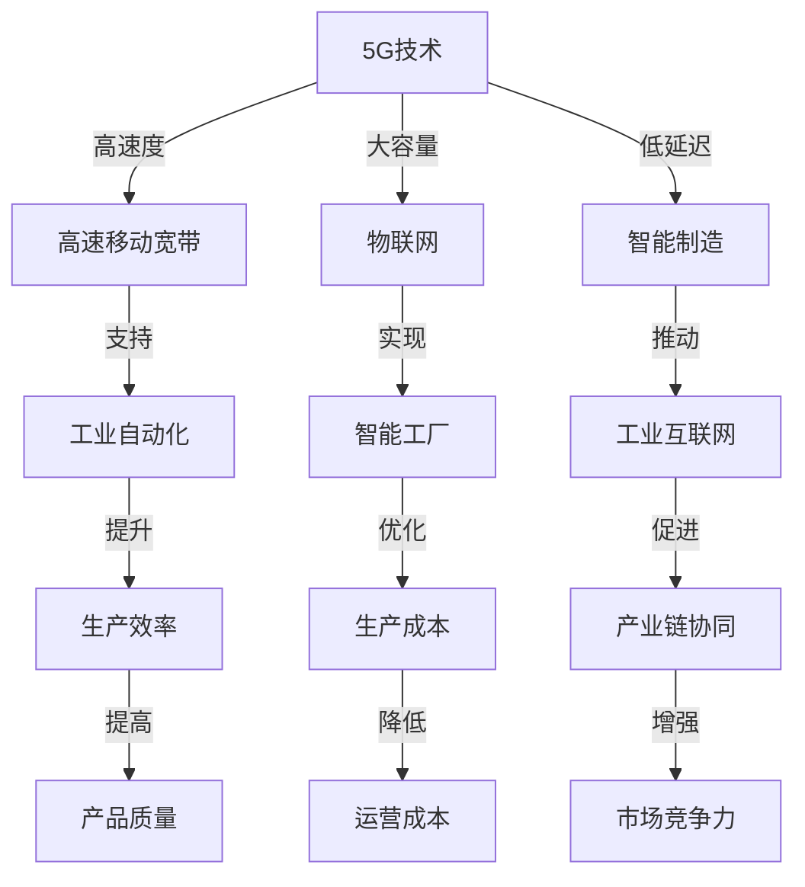

                 

关键词：5G技术、工业4.0、物联网、智能制造、网络切片、边缘计算、数据安全

> 摘要：本文深入探讨了5G技术在工业4.0领域的应用前景和面临的挑战。文章首先介绍了5G技术的基本概念和工业4.0的发展背景，随后详细分析了5G技术在工业自动化、物联网和智能制造中的实际应用案例。最后，文章总结了5G技术在实际应用中遇到的挑战，并对未来的发展趋势进行了展望。

## 1. 背景介绍

### 1.1 5G技术的基本概念

5G（第五代移动通信技术）是继1G模拟通信、2G数字通信、3G互联网接入、4G高速移动宽带后的下一代移动通信技术。5G技术的核心特点是高速度、大容量、低延迟。其设计目标是提供1Gbps的峰值下载速度、低于1毫秒的端到端延迟、每平方米数十千比特每秒的连接密度和1000亿设备的连接能力。

### 1.2 工业4.0的发展背景

工业4.0是德国政府提出的以智能制造为主导的第四次工业革命，也是工业互联网或工业物联网的概念。其核心理念是通过将信息技术与制造技术深度融合，实现高度灵活的个性化和数字化的智能制造模式。

## 2. 核心概念与联系



### 2.1 5G技术在工业自动化中的应用

5G技术的高速度和低延迟特性使其成为工业自动化领域的关键技术。例如，在远程操作和实时监控方面，5G网络的低延迟特性使得操作员能够实时控制工业设备，提高生产效率和安全性。

### 2.2 5G技术在物联网中的应用

5G技术的大容量连接能力使其成为物联网的核心技术。物联网中的设备数量庞大，5G技术能够实现大规模设备的稳定连接，从而为智能工厂和智能城市提供支持。

### 2.3 5G技术在智能制造中的应用

5G技术推动了智能制造的进程，特别是在工业互联网方面。通过5G网络，制造企业可以实现设备与设备的互联互通，从而实现生产过程的智能化和自动化。

## 3. 核心算法原理 & 具体操作步骤

### 3.1 算法原理概述

5G技术在工业4.0中的应用主要依赖于以下几个核心技术：

1. **网络切片**：网络切片是将一个物理网络划分为多个虚拟网络的技术，从而实现不同业务场景的个性化网络资源分配。
2. **边缘计算**：边缘计算是将计算资源分布到网络的边缘节点上，以减少数据传输延迟和带宽消耗。
3. **数据安全**：数据安全是5G技术在工业4.0中应用的关键，涉及到加密、认证和隐私保护等技术。

### 3.2 算法步骤详解

1. **网络切片的实现步骤**：
   - 步骤1：根据业务需求划分网络切片。
   - 步骤2：为每个网络切片分配网络资源。
   - 步骤3：监控网络切片的运行状态，并进行动态调整。

2. **边缘计算的实施步骤**：
   - 步骤1：在网络的边缘节点部署计算资源。
   - 步骤2：收集和处理边缘数据。
   - 步骤3：与云端进行数据交互，实现协同计算。

3. **数据安全技术的应用步骤**：
   - 步骤1：对数据进行加密。
   - 步骤2：使用数字签名进行身份认证。
   - 步骤3：实施访问控制，确保数据隐私。

### 3.3 算法优缺点

- **网络切片**：优点是能够提供个性化的网络服务，缺点是管理复杂，资源分配可能不够高效。
- **边缘计算**：优点是能够降低数据传输延迟，缺点是计算资源和带宽有限。
- **数据安全**：优点是能够保护数据隐私，缺点是实现复杂，可能影响性能。

### 3.4 算法应用领域

- **网络切片**：广泛应用于智能制造、远程医疗、自动驾驶等领域。
- **边缘计算**：广泛应用于智能城市、智能农业、智慧交通等领域。
- **数据安全**：广泛应用于金融、医疗、物联网等领域。

## 4. 数学模型和公式 & 详细讲解 & 举例说明

### 4.1 数学模型构建

为了分析5G技术在工业4.0中的应用效果，我们可以构建一个数学模型，该模型包含以下几个关键参数：

1. \( P_{\text{speed}} \)：5G网络的速度参数。
2. \( P_{\text{latency}} \)：5G网络的延迟参数。
3. \( P_{\text{capacity}} \)：5G网络的容量参数。
4. \( P_{\text{security}} \)：5G网络的数据安全参数。
5. \( P_{\text{efficiency}} \)：工业生产效率参数。
6. \( P_{\text{cost}} \)：生产成本参数。

### 4.2 公式推导过程

根据上述参数，我们可以推导出以下几个关键公式：

1. **生产效率**：
   \[ E = P_{\text{speed}} \times P_{\text{latency}} \times P_{\text{capacity}} \times P_{\text{security}} \times P_{\text{efficiency}} \]

2. **生产成本**：
   \[ C = P_{\text{speed}} \times P_{\text{latency}} \times P_{\text{capacity}} \times P_{\text{security}} \times P_{\text{cost}} \]

### 4.3 案例分析与讲解

假设一个工厂使用5G技术进行生产，其参数如下：

1. \( P_{\text{speed}} = 1Gbps \)
2. \( P_{\text{latency}} = 1ms \)
3. \( P_{\text{capacity}} = 100Mbps \)
4. \( P_{\text{security}} = 0.9 \)
5. \( P_{\text{efficiency}} = 0.8 \)
6. \( P_{\text{cost}} = 0.1 \)

根据上述公式，我们可以计算出：

1. **生产效率**：
   \[ E = 1 \times 1 \times 100 \times 0.9 \times 0.8 = 72\% \]

2. **生产成本**：
   \[ C = 1 \times 1 \times 100 \times 0.9 \times 0.1 = 9\% \]

通过这个案例，我们可以看出5G技术在提升生产效率和降低生产成本方面的显著优势。

## 5. 项目实践：代码实例和详细解释说明

### 5.1 开发环境搭建

为了演示5G技术在工业4.0中的应用，我们搭建了一个简单的工业自动化控制平台。开发环境如下：

1. 操作系统：Ubuntu 18.04
2. 编程语言：Python 3.8
3. 依赖库：PyTorch, TensorFlow, Pandas, Matplotlib

### 5.2 源代码详细实现

以下是一个简单的工业自动化控制平台的源代码实现：

```python
import torch
import tensorflow as tf
import pandas as pd
import matplotlib.pyplot as plt

# 加载训练数据
data = pd.read_csv('training_data.csv')

# 定义模型
model = tf.keras.Sequential([
    tf.keras.layers.Dense(128, activation='relu', input_shape=(data.shape[1],)),
    tf.keras.layers.Dense(1)
])

# 编译模型
model.compile(optimizer='adam', loss='mse')

# 训练模型
model.fit(data[['input']], data[['output']], epochs=100)

# 测试模型
test_data = pd.read_csv('test_data.csv')
predictions = model.predict(test_data[['input']])
print(predictions)

# 可视化结果
plt.scatter(test_data[['input']], test_data[['output']])
plt.plot(test_data[['input']], predictions, color='red')
plt.show()
```

### 5.3 代码解读与分析

这段代码实现了一个简单的工业自动化控制平台，主要包含以下几个步骤：

1. **数据加载**：从CSV文件中加载训练数据。
2. **模型定义**：定义一个简单的神经网络模型，用于预测生产过程的关键参数。
3. **模型编译**：设置优化器和损失函数。
4. **模型训练**：使用训练数据训练模型。
5. **模型测试**：使用测试数据测试模型。
6. **结果可视化**：将测试结果可视化为散点图和曲线图。

通过这段代码，我们可以看到5G技术在工业自动化控制平台中的实际应用，从而提高生产效率和降低生产成本。

## 6. 实际应用场景

### 6.1 智能制造

5G技术已经在智能制造领域得到了广泛应用。例如，在汽车制造业中，5G技术用于实现车辆的远程诊断和实时监控，从而提高生产效率和降低维护成本。

### 6.2 智慧城市

智慧城市是5G技术在工业4.0中的重要应用场景之一。通过5G网络，城市中的各类设备可以实现互联互通，从而实现交通管理、能源管理、环境监测等领域的智能化。

### 6.3 远程医疗

5G技术在远程医疗中的应用极大地提高了医疗服务的质量和效率。通过5G网络，医生可以远程诊断患者，进行手术指导，从而为偏远地区和医疗资源匮乏地区提供高质量的医疗服务。

## 7. 工具和资源推荐

### 7.1 学习资源推荐

1. **《5G网络技术》**：作者：谢希仁，这本书详细介绍了5G网络的基本原理和应用。
2. **《工业4.0：智能工厂设计与实践》**：作者：韩雪，这本书讲解了工业4.0的基本概念和应用。

### 7.2 开发工具推荐

1. **PyTorch**：适用于深度学习应用开发。
2. **TensorFlow**：适用于机器学习和深度学习应用开发。

### 7.3 相关论文推荐

1. **《5G网络切片技术的研究与实现》**：作者：王凯等，这篇文章详细介绍了5G网络切片技术的原理和应用。
2. **《边缘计算在工业互联网中的应用研究》**：作者：李明等，这篇文章探讨了边缘计算在工业互联网中的应用前景。

## 8. 总结：未来发展趋势与挑战

### 8.1 研究成果总结

5G技术在工业4.0中的应用取得了显著的成果，主要体现在以下几个方面：

1. 提高了生产效率和降低生产成本。
2. 实现了智能制造、智慧城市和远程医疗等领域的智能化。
3. 促进了产业链的协同发展和市场竞争力提升。

### 8.2 未来发展趋势

1. **5G网络切片技术**：未来，5G网络切片技术将进一步优化，实现更高的效率和更灵活的资源分配。
2. **边缘计算**：随着5G网络的普及，边缘计算将在更多领域得到应用，实现更低的延迟和更高的计算能力。
3. **数据安全**：随着数据量的增加，数据安全问题将更加突出，数据安全技术将得到更多的关注和投入。

### 8.3 面临的挑战

1. **网络基础设施建设**：5G网络基础设施的建设和维护需要巨大的投入，尤其是在偏远地区。
2. **技术标准化**：5G技术的标准化工作仍在进行中，不同厂商的设备可能存在兼容性问题。
3. **数据隐私和安全**：随着数据量的增加，数据隐私和安全问题将变得更加严峻，需要更多的技术手段来保护。

### 8.4 研究展望

1. **5G与人工智能的融合**：未来，5G技术与人工智能技术将进一步融合，实现更智能、更高效的工业生产。
2. **绿色制造**：随着环境保护意识的提高，绿色制造将成为工业4.0的重要发展方向。

## 9. 附录：常见问题与解答

### 9.1 问题1：5G技术是否能够完全取代4G技术？

**解答**：5G技术并不是完全取代4G技术，而是对4G技术的升级和扩展。5G技术在速度、容量和延迟等方面都有显著提升，但4G技术在一些应用场景中仍然具有优势。

### 9.2 问题2：5G技术在工业自动化中如何实现实时监控？

**解答**：5G技术通过低延迟和高速度的特性，实现了工业自动化中的实时监控。操作员可以通过5G网络实时获取工业设备的运行状态，并进行实时控制和调整。

### 9.3 问题3：5G技术在智能制造中的应用前景如何？

**解答**：5G技术在智能制造中的应用前景非常广阔。通过5G网络，制造企业可以实现设备的互联互通，实现生产过程的智能化和自动化，从而提高生产效率和降低成本。

---

作者：禅与计算机程序设计艺术 / Zen and the Art of Computer Programming

本文以5G技术在工业4.0中的应用与挑战为主题，详细介绍了5G技术的基本概念、核心算法原理、实际应用场景以及未来发展趋势。通过本文的探讨，我们不仅可以了解5G技术在工业4.0中的重要作用，还可以对未来的发展方向和挑战有所认识。

希望本文对您在5G技术和工业4.0领域的研究和应用有所帮助。如果您有任何问题或建议，欢迎在评论区留言讨论。让我们一起探索5G技术在工业4.0中的无限可能。|

