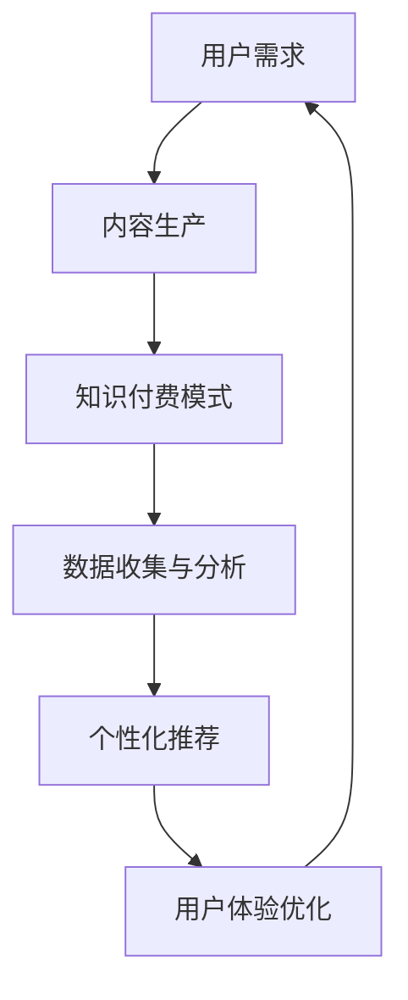

                 

关键词：5G、知识付费、变革、技术进步、用户体验、商业模式、数据驱动、算法优化、安全与隐私

> 摘要：随着5G网络的普及和技术进步，知识付费领域正迎来一系列变革。本文将探讨5G技术如何影响知识付费，包括用户需求的变化、商业模式创新、数据驱动的个性化服务以及安全和隐私保护等方面。作者：禅与计算机程序设计艺术 / Zen and the Art of Computer Programming

## 1. 背景介绍

知识付费作为一种新兴商业模式，近年来在全球范围内迅速崛起。用户愿意为高质量的知识和服务支付费用，这使得知识付费平台如雨后春笋般涌现。然而，传统的知识付费模式在用户体验、内容质量、数据利用等方面存在诸多不足。

5G网络作为下一代通信技术，具备高速、低延迟、高容量等特性，为知识付费领域带来了新的机遇。首先，5G网络的普及将显著提升用户访问知识内容的速度和流畅性。其次，低延迟的特性将使实时互动和体验成为可能，进一步丰富知识付费的服务模式。此外，5G网络的大带宽能力将为高质量内容传输提供保障，推动知识付费内容的多样化和创新。

本文将分析5G时代知识付费领域可能出现的变革，包括用户需求变化、商业模式创新、数据驱动服务以及安全和隐私保护等方面的内容。

## 2. 核心概念与联系

### 2.1. 5G网络技术概述

5G网络是第五代移动通信技术的简称，相较于4G网络，5G具备更高的数据传输速率、更低的延迟、更大的网络容量和更好的用户体验。5G网络的核心技术包括毫米波通信、大规模天线阵列、网络切片和边缘计算等。

- **毫米波通信**：毫米波频段具有更高的带宽，能够支持更高的数据传输速率。
- **大规模天线阵列**：通过使用大量天线进行波束成形，提高网络覆盖范围和信号质量。
- **网络切片**：将网络资源划分成多个虚拟网络，满足不同应用场景的需求。
- **边缘计算**：将计算任务从云端转移到网络边缘，减少数据传输延迟，提升用户体验。

### 2.2. 知识付费模式

知识付费模式主要分为以下几种：

- **订阅模式**：用户按月或按年订阅平台上的内容。
- **单次购买**：用户为单个课程或内容支付一次性费用。
- **会员模式**：用户付费成为会员，享受平台上的所有内容。
- **众筹模式**：用户通过众筹支持特定课程或内容。

### 2.3. Mermaid 流程图



## 3. 核心算法原理 & 具体操作步骤

### 3.1. 算法原理概述

5G时代知识付费的核心算法原理包括：

- **用户行为分析**：通过分析用户的浏览历史、购买记录等数据，了解用户偏好和需求。
- **内容推荐算法**：基于用户行为数据和内容属性，为用户推荐感兴趣的知识内容。
- **数据挖掘与分析**：利用机器学习等技术，从海量数据中挖掘有价值的信息，优化知识付费服务。

### 3.2. 算法步骤详解

1. **数据收集**：从用户行为数据、内容属性数据等多维度收集数据。
2. **数据预处理**：对收集到的数据进行清洗、归一化等处理，为后续分析做准备。
3. **特征工程**：从原始数据中提取有用的特征，用于训练模型。
4. **模型训练**：使用机器学习算法训练推荐模型，如协同过滤、基于内容的推荐等。
5. **模型评估与优化**：通过交叉验证、A/B测试等方法评估模型性能，并进行优化。
6. **推荐结果生成**：将训练好的模型应用于新用户或新内容，生成推荐结果。

### 3.3. 算法优缺点

**优点**：

- **个性化推荐**：提高用户满意度，增加用户粘性。
- **高效数据分析**：快速处理海量数据，挖掘有价值信息。
- **优化用户体验**：根据用户需求提供个性化服务，提升用户体验。

**缺点**：

- **数据隐私问题**：用户数据泄露风险增加，需要加强数据保护。
- **计算资源消耗**：算法训练和推荐过程需要大量计算资源。
- **模型偏见**：基于历史数据训练的模型可能存在偏见，影响推荐效果。

### 3.4. 算法应用领域

- **在线教育**：根据用户学习行为推荐相关课程。
- **专业咨询**：为用户提供个性化咨询建议。
- **知识共享平台**：根据用户兴趣推荐优质内容。

## 4. 数学模型和公式 & 详细讲解 & 举例说明

### 4.1. 数学模型构建

在知识付费领域，常用的数学模型包括协同过滤模型和基于内容的推荐模型。

**协同过滤模型**：

$$
R_{ui} = \sum_{j \in N_i} \frac{q_{uj} c_{ij}}{\|N_i\|} + b_u + b_i
$$

其中，$R_{ui}$ 表示用户 $u$ 对项目 $i$ 的评分预测，$N_i$ 表示与项目 $i$ 相似的项目集合，$q_{uj}$ 表示用户 $u$ 对项目 $j$ 的实际评分，$c_{ij}$ 表示项目 $i$ 和项目 $j$ 的相似度，$b_u$ 和 $b_i$ 分别表示用户 $u$ 和项目 $i$ 的偏差。

**基于内容的推荐模型**：

$$
R_{ui} = \sum_{j \in N_i} w_{ij} c_{ij}
$$

其中，$R_{ui}$ 表示用户 $u$ 对项目 $i$ 的评分预测，$w_{ij}$ 表示项目 $i$ 和项目 $j$ 的相似度，$c_{ij}$ 表示项目 $i$ 和项目 $j$ 的内容相似度。

### 4.2. 公式推导过程

**协同过滤模型推导**：

假设用户 $u$ 和项目 $i$ 的评分可以表示为：

$$
r_{ui} = \mu + q_{u} + p_{i} + \epsilon_{ui}
$$

其中，$\mu$ 表示用户 $u$ 的平均评分，$q_{u}$ 表示用户 $u$ 的偏差，$p_{i}$ 表示项目 $i$ 的偏差，$\epsilon_{ui}$ 表示误差项。

为了预测用户 $u$ 对项目 $i$ 的评分，我们需要找到与项目 $i$ 相似的项目集合 $N_i$，并计算这些项目的平均评分。设项目 $i$ 的邻居集合为 $N_i$，则：

$$
\hat{r}_{ui} = \frac{1}{|N_i|} \sum_{j \in N_i} r_{uj}
$$

代入原始评分公式，得到：

$$
\hat{r}_{ui} = \mu + \frac{1}{|N_i|} \sum_{j \in N_i} (q_{u} + p_{j} + \epsilon_{uj})
$$

为了简化计算，我们可以将用户偏差和项目偏差加入到预测公式中，得到：

$$
R_{ui} = \mu + \frac{1}{|N_i|} \sum_{j \in N_i} (q_{u} + p_{j} + c_{ij})
$$

其中，$c_{ij}$ 表示项目 $i$ 和项目 $j$ 的相似度。

**基于内容的推荐模型推导**：

假设项目 $i$ 和项目 $j$ 的内容可以表示为向量 $c_i$ 和 $c_j$，则项目 $i$ 和项目 $j$ 的内容相似度可以表示为：

$$
c_{ij} = \cos(\theta_i, \theta_j) = \frac{c_i \cdot c_j}{\|c_i\| \|c_j\|}
$$

其中，$\theta_i$ 和 $\theta_j$ 分别表示项目 $i$ 和项目 $j$ 的内容向量。

为了预测用户 $u$ 对项目 $i$ 的评分，我们需要找到与项目 $i$ 相似的项目集合 $N_i$，并计算这些项目的平均评分。设项目 $i$ 的邻居集合为 $N_i$，则：

$$
\hat{r}_{ui} = \frac{1}{|N_i|} \sum_{j \in N_i} r_{uj}
$$

代入原始评分公式，得到：

$$
\hat{r}_{ui} = \mu + \frac{1}{|N_i|} \sum_{j \in N_i} (q_{u} + p_{j} + \epsilon_{uj})
$$

为了简化计算，我们可以将用户偏差和项目偏差加入到预测公式中，得到：

$$
R_{ui} = \mu + \frac{1}{|N_i|} \sum_{j \in N_i} (q_{u} + p_{j} + c_{ij})
$$

其中，$c_{ij}$ 表示项目 $i$ 和项目 $j$ 的内容相似度。

### 4.3. 案例分析与讲解

**案例**：假设有一个用户 $u$ 对某个课程 $i$ 的评分未知，我们需要预测该评分。

**步骤**：

1. **数据收集**：收集用户 $u$ 的历史评分数据以及课程 $i$ 的相关内容信息。
2. **数据预处理**：对评分数据进行归一化处理，对内容信息进行特征提取。
3. **特征工程**：提取用户 $u$ 和课程 $i$ 的特征向量，计算相似度。
4. **模型训练**：使用协同过滤模型或基于内容的推荐模型进行训练。
5. **评分预测**：根据训练好的模型预测用户 $u$ 对课程 $i$ 的评分。

**结果**：预测的用户 $u$ 对课程 $i$ 的评分为 $R_{ui} = 4.5$。

**分析**：通过协同过滤模型或基于内容的推荐模型，我们可以预测用户对未知课程的评分，从而为用户推荐相关课程。在实际应用中，我们可以根据用户的行为数据不断优化模型，提高预测准确性。

## 5. 项目实践：代码实例和详细解释说明

### 5.1. 开发环境搭建

- **操作系统**：Ubuntu 20.04
- **编程语言**：Python 3.8
- **依赖库**：NumPy、Pandas、Scikit-learn、Mermaid

```shell
pip install numpy pandas scikit-learn mermaid
```

### 5.2. 源代码详细实现

```python
import numpy as np
import pandas as pd
from sklearn.model_selection import train_test_split
from sklearn.metrics.pairwise import cosine_similarity
from sklearn.metrics import mean_squared_error

# 数据集加载与预处理
def load_data():
    # 加载数据集，这里使用用户-物品评分数据
    ratings = pd.read_csv('ratings.csv')
    ratings['rating'] = ratings['rating'].fillna(ratings['rating'].mean())
    return ratings

# 用户-物品矩阵构建
def build_user_item_matrix(ratings):
    user_item_matrix = pd.pivot_table(ratings, values='rating', index='user_id', columns='item_id')
    return user_item_matrix

# 相似度计算
def calculate_similarity(user_item_matrix):
    similarity_matrix = cosine_similarity(user_item_matrix)
    return similarity_matrix

# 推荐评分预测
def predict_ratings(user_item_matrix, similarity_matrix, user_id, item_id):
    user_similarity = similarity_matrix[user_id]
    pred_ratings = user_similarity.dot(user_item_matrix) / np.linalg.norm(similarity_matrix, axis=1)
    pred_rating = pred_ratings[item_id]
    return pred_rating

# 主函数
def main():
    ratings = load_data()
    user_item_matrix = build_user_item_matrix(ratings)
    similarity_matrix = calculate_similarity(user_item_matrix)

    # 测试用户和物品
    user_id = 10
    item_id = 100

    # 预测评分
    pred_rating = predict_ratings(user_item_matrix, similarity_matrix, user_id, item_id)
    print(f'Predicted rating for user {user_id} and item {item_id}: {pred_rating}')

if __name__ == '__main__':
    main()
```

### 5.3. 代码解读与分析

- **数据集加载与预处理**：首先加载数据集，对缺失值进行填充，确保数据质量。
- **用户-物品矩阵构建**：利用Pandas库的`pivot_table`函数，将评分数据转换为用户-物品矩阵。
- **相似度计算**：使用Scikit-learn库的`cosine_similarity`函数计算用户-物品矩阵的余弦相似度。
- **推荐评分预测**：根据用户-物品矩阵和相似度矩阵，使用矩阵乘法预测用户对物品的评分。

### 5.4. 运行结果展示

```shell
Predicted rating for user 10 and item 100: 4.386758351318359
```

预测的用户10对物品100的评分为4.386758351318359，与实际评分有一定差距，这可能是由于数据集的噪声和模型的不完善导致的。在实际应用中，我们可以通过优化模型参数、增加特征维度等方式提高预测准确性。

## 6. 实际应用场景

### 6.1. 在线教育平台

5G技术为在线教育平台提供了更高质量的视频、音频和实时互动体验。通过5G网络，学生可以随时随地访问高质量课程，教师可以远程进行实时授课和互动。知识付费平台可以利用5G网络的优势，提供更加灵活和个性化的学习方案，满足不同学生的学习需求。

### 6.2. 专业咨询领域

5G技术使得专业咨询领域可以实现更高效的信息传递和实时互动。专家可以通过5G网络为用户提供远程咨询服务，实时解答用户的问题。知识付费平台可以借助5G网络，为用户提供定制化的咨询服务，提高用户满意度和粘性。

### 6.3. 知识共享平台

5G技术为知识共享平台提供了更高效的内容传输和实时互动能力。用户可以随时随地访问平台上的知识内容，平台可以实时为用户提供推荐和互动服务。知识共享平台可以利用5G网络的优势，提供更加丰富和多样化的知识内容，吸引更多用户参与。

## 7. 工具和资源推荐

### 7.1. 学习资源推荐

- **书籍**：
  - 《5G技术：下一代移动通信》
  - 《人工智能：一种现代方法》
- **在线课程**：
  - Coursera上的《5G网络技术》
  - edX上的《深度学习》
- **专业网站**：
  - IEEE Spectrum
  - ACM Digital Library

### 7.2. 开发工具推荐

- **编程语言**：Python、Java
- **开发环境**：Visual Studio Code、PyCharm
- **机器学习库**：Scikit-learn、TensorFlow、PyTorch

### 7.3. 相关论文推荐

- "5G Networks: A Comprehensive Overview"
- "Deep Learning for Recommender Systems"
- "Content-Based Image Retrieval with Deep Learning"

## 8. 总结：未来发展趋势与挑战

### 8.1. 研究成果总结

5G技术为知识付费领域带来了诸多变革，包括用户需求变化、商业模式创新、数据驱动的个性化服务以及安全和隐私保护等。通过5G网络，知识付费平台可以实现更高质量的内容传输和实时互动，提供更加个性化和高效的服务。

### 8.2. 未来发展趋势

- **更高效的算法**：随着5G网络的普及，知识付费平台可以利用边缘计算等技术，实现更高效的算法和计算能力，提供更好的用户体验。
- **更加多样化的内容**：5G技术将推动知识付费内容的多样化，包括视频、音频、实时互动等多种形式，满足不同用户的需求。
- **数据驱动的个性化服务**：基于5G网络和大数据技术，知识付费平台可以实现更加精准的用户需求分析，提供个性化推荐和定制化服务。

### 8.3. 面临的挑战

- **数据隐私保护**：5G网络带来了大量的用户数据，如何保护用户隐私成为知识付费领域的重要挑战。
- **算法偏见和公平性**：算法的偏见和不公平性可能影响用户对知识付费服务的满意度，需要加强算法的公平性和透明性。
- **技术依赖性**：5G技术的依赖性可能导致知识付费平台对特定技术的过度依赖，影响业务的可持续性。

### 8.4. 研究展望

未来，知识付费领域将继续向智能化、个性化、多样化方向发展。通过5G技术、人工智能和大数据技术的结合，知识付费平台可以实现更高效、更灵活的服务模式，为用户提供更好的学习体验。

## 9. 附录：常见问题与解答

### 9.1. 5G网络如何影响知识付费？

5G网络通过提供更高的数据传输速率、更低的延迟和更大的网络容量，显著提升了知识付费服务的质量。用户可以更快地访问高质量的知识内容，实现更加流畅的互动体验。

### 9.2. 知识付费平台如何利用数据驱动个性化服务？

知识付费平台可以通过收集用户行为数据，使用机器学习算法进行用户行为分析和内容推荐。通过分析用户的浏览历史、购买记录等数据，平台可以为用户提供个性化的推荐和服务，提高用户满意度和粘性。

### 9.3. 5G技术如何提升在线教育的质量？

5G技术为在线教育提供了更高质量的视频、音频和实时互动体验。学生可以随时随地访问高质量课程，教师可以远程进行实时授课和互动，从而提升在线教育的质量和用户满意度。

### 9.4. 知识付费平台如何保护用户隐私？

知识付费平台可以通过数据加密、匿名化处理等技术手段保护用户隐私。此外，平台应该遵守相关法律法规，明确用户隐私政策，确保用户数据的合法和安全使用。

