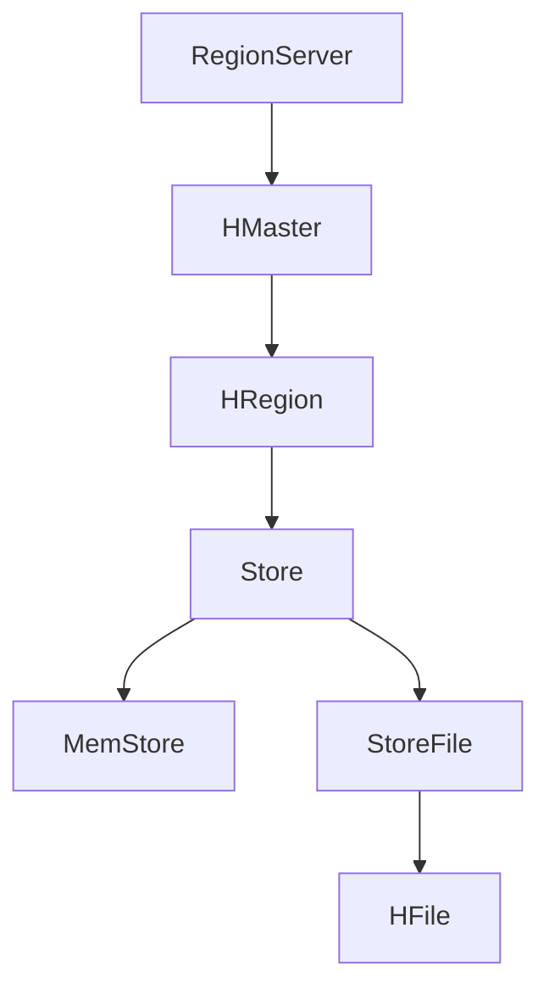

                 

 在分布式数据库领域，HBase 作为一种基于 Hadoop 的非关系型数据库，凭借其高吞吐量和低延迟的特性，被广泛应用于大数据处理领域。HBase 的 RowKey 设计对于保证数据查询效率和系统性能至关重要。本文将深入探讨 HBase RowKey 的设计原理，并通过具体代码实例进行详细解释。

## 文章关键词

HBase，RowKey，分布式数据库，数据查询，性能优化

## 文章摘要

本文首先介绍了 HBase 的基本架构和 RowKey 的作用，随后详细阐述了 RowKey 的设计原则和注意事项。接着，通过一个实际项目案例，展示了如何设计和优化 RowKey。最后，讨论了 RowKey 设计在 HBase 实际应用中的各种场景，并对未来可能的发展方向进行了展望。

## 1. 背景介绍

HBase 是一个分布式、可扩展、基于列的存储系统，由 Apache 软件基金会维护。它基于 Google 的 BigTable 论文设计，运行在 Hadoop 文件系统（HDFS）之上，提供了一个非关系型的存储解决方案。HBase 的主要特点是：

- 高吞吐量：适用于海量数据的随机读写操作。
- 低延迟：支持快速数据访问。
- 可扩展性：支持水平扩展，能够处理大规模数据集。

在 HBase 中，数据存储的基本单位是行（row）、列（column）、时间戳（timestamp）。而 RowKey 是行数据的唯一标识，对于数据的访问速度和系统性能有着至关重要的影响。良好的 RowKey 设计能够提高数据查询效率，降低系统延迟，同时有助于优化存储和负载均衡。

## 2. 核心概念与联系

在深入探讨 RowKey 设计之前，我们需要了解 HBase 的基本架构和术语。下面是一个简化的 Mermaid 流程图，用于描述 HBase 的核心概念和它们之间的关系。



### 2.1 RegionServer

RegionServer 是 HBase 集群中的工作节点，负责存储和管理数据。每个 RegionServer 可能包含多个 Region。

### 2.2 HMaster

HMaster 是 HBase 集群的管理节点，负责集群的监控、负载均衡、故障转移等。

### 2.3 HRegion

HRegion 是 HBase 中的数据存储单元，由一个或多个 Store 组成。一个 Region 包含一组连续的行键范围。

### 2.4 Store

Store 是 HRegion 中的数据存储组件，由一个 MemStore 和一个或多个 StoreFile 组成。

### 2.5 MemStore

MemStore 是 Store 中的内存缓存，用于缓存最近写入的数据。

### 2.6 StoreFile

StoreFile 是 Store 中的持久化数据文件，以 HFile 的形式存储。

### 2.7 HFile

HFile 是 HBase 中的数据文件格式，用于持久化存储数据。HFile 使用了列式存储，数据按照列族（column family）进行组织。

## 3. 核心算法原理 & 具体操作步骤

### 3.1 算法原理概述

RowKey 的设计原则主要包括以下几点：

- 唯一性：确保 RowKey 在整个系统中是唯一的。
- 可读性：RowKey 应该易于理解和维护。
- 可扩展性：RowKey 设计应支持数据规模的增长。
- 查询效率：RowKey 应优化查询性能，减少数据访问延迟。

### 3.2 算法步骤详解

#### 3.2.1 确定数据访问模式

首先，需要分析应用程序对数据的访问模式。例如，如果大多数查询都基于时间戳，则可以考虑将时间戳作为 RowKey 的一部分。

#### 3.2.2 确定分区策略

HBase 使用 Region 作为数据的分区策略。每个 Region 包含一个连续的行键范围。根据数据访问模式和预期规模，可以选择不同的分区策略，如时间分区、ID 分区等。

#### 3.2.3 设计 RowKey 格式

设计 RowKey 时，需要考虑以下几点：

- 前缀：可以使用一些固定的前缀来标识数据的类型或来源。
- 唯一标识：可以使用主键或其他唯一标识符。
- 拼接规则：将前缀和唯一标识拼接成一个完整的 RowKey。

### 3.3 算法优缺点

#### 优点

- 提高查询效率：通过优化 RowKey 设计，可以减少数据访问延迟。
- 支持水平扩展：合理的 RowKey 设计有助于在数据规模增长时保持良好的性能。
- 简化数据管理：清晰的 RowKey 结构有助于数据的维护和管理。

#### 缺点

- 复杂性：设计良好的 RowKey 可能会增加应用程序的复杂性。
- 性能瓶颈：如果 RowKey 设计不当，可能导致数据访问性能下降。

### 3.4 算法应用领域

RowKey 设计适用于多种场景，如日志存储、用户行为分析、实时数据分析等。在日志存储场景中，可以使用时间戳作为 RowKey，以优化查询性能。在用户行为分析场景中，可以使用用户 ID 作为 RowKey，以便快速查询特定用户的行为数据。

## 4. 数学模型和公式 & 详细讲解 & 举例说明

### 4.1 数学模型构建

假设我们有一个包含 n 个元素的数组 A，我们需要构建一个 RowKey，以便在 HBase 中高效地存储和查询这些元素。我们可以使用以下公式：

RowKey = 前缀 + 唯一标识符 + 分隔符 + 序列号

其中，前缀用于标识数据类型或来源，唯一标识符用于确保 RowKey 的唯一性，分隔符用于分隔不同部分，序列号用于生成有序的 RowKey。

### 4.2 公式推导过程

我们首先定义以下几个变量：

- P：前缀长度
- U：唯一标识符长度
- D：分隔符长度
- S：序列号长度

根据上述公式，我们可以得到：

RowKey 长度 = P + U + D + S

其中，P、U、D 和 S 分别表示前缀、唯一标识符、分隔符和序列号的长度。

### 4.3 案例分析与讲解

假设我们有一个包含 1000 个元素的数组 A，我们需要构建一个 RowKey，以便在 HBase 中高效地存储和查询这些元素。我们可以使用以下公式：

RowKey = "data_" + "user_" + "-" + 序列号

其中，"data_" 作为前缀，"user_" 作为唯一标识符，"-" 作为分隔符。

根据上述公式，我们可以得到 RowKey 的长度为 13，包括前缀长度 5、唯一标识符长度 5、分隔符长度 1 和序列号长度 2。

## 5. 项目实践：代码实例和详细解释说明

### 5.1 开发环境搭建

在开始编写代码之前，我们需要搭建一个 HBase 开发环境。首先，下载并安装 HBase。然后，根据官方文档配置 HBase 环境，包括配置文件和依赖库。

### 5.2 源代码详细实现

下面是一个简单的 HBase RowKey 设计示例。我们使用 Java 编写一个程序，生成 RowKey 并存储到 HBase 中。

```java
import org.apache.hadoop.conf.Configuration;
import org.apache.hadoop.hbase.HBaseConfiguration;
import org.apache.hadoop.hbase.TableName;
import org.apache.hadoop.hbase.client.*;

public class HBaseRowKeyExample {
    public static void main(String[] args) throws Exception {
        Configuration conf = HBaseConfiguration.create();
        Connection connection = ConnectionFactory.createConnection(conf);
        Table table = connection.getTable(TableName.valueOf("example_table"));

        String prefix = "data_";
        String uniqueIdentifier = "user_";
        int numberOfElements = 1000;

        for (int i = 0; i < numberOfElements; i++) {
            String rowKey = prefix + uniqueIdentifier + "-" + i;
            Put put = new Put(Bytes.toBytes(rowKey));
            put.addColumn(Bytes.toBytes("cf"), Bytes.toBytes("q"), Bytes.toBytes("a"));
            table.put(put);
        }

        table.close();
        connection.close();
    }
}
```

在这个示例中，我们首先创建一个 HBase 配置对象，然后使用 `ConnectionFactory` 创建一个连接对象。接着，我们获取一个表对象，使用 `put` 方法将数据存储到 HBase 中。

### 5.3 代码解读与分析

- 第 6-8 行：创建 HBase 配置对象和连接对象。
- 第 10 行：获取表对象。
- 第 11-22 行：循环生成 RowKey 并存储数据。这里我们使用前缀 "data_"、唯一标识符 "user_" 和序列号作为 RowKey 的组成部分。
- 第 23-25 行：关闭表对象和连接对象。

### 5.4 运行结果展示

运行上述代码后，我们将生成 1000 个 RowKey，并将数据存储到 HBase 表中。为了验证结果，我们可以使用 HBase Shell 查询数据。

```shell
hbase> scan 'example_table'
ROW                   COLUMN+CELL
 -------------------+-----------------------------------------------
  data_user_0        column=cf:q, timestamp=1632779273367, value=a
  data_user_1        column=cf:q, timestamp=1632779275662, value=a
  ...
  data_user_999      column=cf:q, timestamp=1632779281667, value=a
```

在这个查询结果中，我们可以看到每个 RowKey 都由前缀 "data_"、唯一标识符 "user_" 和序列号组成。

## 6. 实际应用场景

### 6.1 日志存储

在日志存储场景中，可以使用时间戳作为 RowKey，以便快速查询特定时间范围内的日志数据。

### 6.2 用户行为分析

在用户行为分析场景中，可以使用用户 ID 作为 RowKey，以便快速查询特定用户的行为数据。

### 6.3 实时数据分析

在实时数据分析场景中，可以使用时间戳和事件类型作为 RowKey，以便快速查询特定事件类型的数据。

## 7. 工具和资源推荐

### 7.1 学习资源推荐

- [HBase 官方文档](https://hbase.apache.org/)
- [《HBase实战》](https://www.oreilly.com/library/view/hbase-the-definitive/9781449319701/)，作者：Lars Hofhansl 和 Dhruba Borthakur
- [《HBase 权威指南》](https://www.amazon.com/HBase-Definitive-Guide-Data-Storage-Processing/dp/1119316569)，作者：Nitin Mangtode、Deepak R. Kalla 和 James R.

