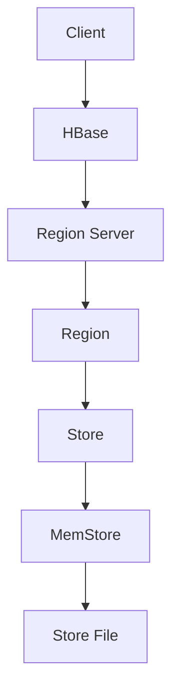

                 

关键词：HBase，分布式存储，列式数据库，NoSQL，大数据，Hadoop生态系统，数据模型，数据分片，一致性模型，数据访问，性能优化，编程接口，应用场景，代码实例。

> 摘要：本文将深入探讨HBase的原理，包括其数据模型、数据分片机制、一致性模型和性能优化策略。通过代码实例，我们将展示如何使用HBase进行高效的分布式数据存储和访问。文章最后还将探讨HBase在实际应用中的使用场景以及未来的发展趋势和挑战。

## 1. 背景介绍

HBase是一个分布式、可扩展、支持大数据存储的列式NoSQL数据库。作为Apache软件基金会的一个开源项目，它基于Google的BigTable模型设计，并作为Hadoop生态系统的一部分，与Hadoop的其他组件如HDFS和MapReduce紧密集成。HBase的目标是提供快速随机读/写访问，并且能够处理大规模数据集，特别适合于实时数据分析。

### HBase的起源

HBase诞生于2006年，最初由Jeremy Sugar、Mike Cafarella和Chris Mattmann在伯克利大学计算机科学实验室开发。后来，它被Google的BigTable启发，并逐渐发展成为一个功能强大、高效可靠的分布式数据库。2008年，HBase加入了Apache软件基金会，并迅速获得了广泛的关注和认可。

### HBase的发展历史

- **2006年**：HBase项目开始。
- **2008年**：HBase加入Apache软件基金会，成为Apache的一个顶级项目。
- **2009年**：HBase 0.20.0发布，增加了许多新特性，如副本、压缩和缓存。
- **2010年**：HBase 0.90.0发布，引入了内存管理、缓存和负载均衡等改进。
- **2012年**：HBase 0.94.0发布，优化了性能，并增加了多个新特性。
- **2015年**：HBase 1.0.0发布，标志着HBase的成熟和稳定。
- **至今**：HBase继续得到更新和维护，支持更高效的数据处理和分析。

## 2. 核心概念与联系

HBase的核心概念和数据模型是理解其工作原理的基础。以下是HBase的一些核心概念：

### 2.1 数据模型

HBase采用一个简单的数据模型，类似于一个分布式的大表格。表格由行、列族和单元格组成。每个单元格存储一个字节数组。

- **行键（Row Key）**：是表中每行数据的唯一标识符，通常是可排序的。
- **列族（Column Family）**：是一组相关列的集合。列族在存储和索引时是一个整体。
- **列限定符（Column Qualifier）**：是列族中的一个具体列。
- **时间戳（Timestamp）**：用于标识数据的版本，每个单元格可以拥有多个版本。

### 2.2 数据分片

HBase的数据是分布式存储的，数据分片是基于行键的。数据被分片到多个Region中，每个Region由一组连续的行组成。Region的大小是动态扩展的。

- **Region Server**：存储Region的节点。
- **Region**：由一组连续的行组成，负责处理读写请求。
- **Store**：一个Region Server上的一个数据表。
- **MemStore**：内存中的数据缓存，用于提高读写性能。
- **Store File**：磁盘上的数据文件。

### 2.3 一致性模型

HBase使用Paxos算法实现分布式一致性。在HBase中，一致性是指所有Region Server上的数据在某个时刻是相同的。

- **强一致性**：所有的读写操作都会同步更新所有副本。
- **最终一致性**：数据更新不会立即同步到所有副本，但最终会在所有副本上同步。

### 2.4 Mermaid 流程图

下面是HBase数据模型的Mermaid流程图：



## 3. 核心算法原理 & 具体操作步骤

### 3.1 算法原理概述

HBase的核心算法主要包括：

- **数据分片算法**：基于行键的范围和散列值进行数据分片。
- **一致性算法**：基于Paxos算法实现多副本的一致性。
- **数据压缩算法**：用于减少存储空间和提高I/O性能。
- **缓存算法**：用于提高数据访问速度。

### 3.2 算法步骤详解

#### 数据分片算法

1. 将行键转换为散列值。
2. 根据散列值确定行所属的Region。
3. Region继续将行键分片到Store。
4. Store将数据存储到MemStore或磁盘上的Store File。

#### 一致性算法

1. 客户端发起读写请求。
2. 请求被转发到对应的Region Server。
3. Region Server使用Paxos算法协调多个副本的一致性。
4. 一致性达成后，数据被更新到MemStore和Store File。

#### 数据压缩算法

1. 数据写入时，先存储在MemStore。
2. MemStore的数据定期压缩到磁盘上的Store File。
3. 压缩算法包括Gzip、LZO等。

#### 缓存算法

1. MemStore的数据在内存中缓存。
2. 数据访问时，首先检查MemStore。
3. 如果数据不在MemStore中，则从磁盘上的Store File读取。

### 3.3 算法优缺点

#### 数据分片算法

- **优点**：高效地处理大规模数据，提高读写性能。
- **缺点**：需要维护分片信息，增加了系统的复杂性。

#### 一致性算法

- **优点**：保证多副本的一致性，支持最终一致性。
- **缺点**：可能会影响性能，特别是在高负载下。

#### 数据压缩算法

- **优点**：减少存储空间，提高I/O性能。
- **缺点**：压缩和解压缩需要额外的时间。

#### 缓存算法

- **优点**：提高数据访问速度，减少磁盘I/O。
- **缺点**：缓存失效可能导致性能下降。

### 3.4 算法应用领域

HBase适用于以下领域：

- **实时数据分析**：处理大规模、实时数据，提供快速查询和访问。
- **日志收集**：存储和分析大规模日志数据。
- **物联网**：处理来自大量传感器的实时数据。
- **金融交易**：支持高频交易数据存储和查询。

## 4. 数学模型和公式 & 详细讲解 & 举例说明

### 4.1 数学模型构建

HBase的数学模型主要包括行键的散列函数和Paxos算法的分布式一致性模型。

#### 行键散列函数

$$
H_{k}(key) = \text{hash}(key) \mod N
$$

其中，$N$是Region的总数，$\text{hash}(key)$是行键的散列值。

#### Paxos算法

Paxos算法是一种分布式一致性算法，用于在多个副本之间达成一致。以下是Paxos算法的简化步骤：

1. **提议（Propose）**：一个进程（提议者）提出一个提案。
2. **学习（Learn）**：多数副本（接受者）接受提案并返回其值。
3. **达成共识（Achieve Agreement）**：所有副本都学习到同一个值。

### 4.2 公式推导过程

为了推导Paxos算法的具体步骤，我们考虑一个有5个副本的系统。

1. **提议阶段**：

   假设提议者$P_0$提出提案$v_0$。

   - $P_0$发送$\text{Prepare}(v_0)$消息给所有副本。
   - 副本回复$\text{Promise}(v_0)$消息给$P_0$。

   公式推导：

   $$
   \text{Prepare}(v_0) \rightarrow \{ \text{Promise}(v_0) | v \in \{v_0\} \}
   $$

2. **接受阶段**：

   $P_0$根据收到的$\text{Promise}$消息，提出一个接受请求$\text{Accept}(v_0)$。

   - $P_0$发送$\text{Accept}(v_0)$消息给所有副本。
   - 副本回复$\text{Accept}(v_0)$消息给$P_0$。

   公式推导：

   $$
   \text{Accept}(v_0) \rightarrow \{ \text{Accept}(v_0) | v \in \{v_0\} \}
   $$

3. **学习阶段**：

   $P_0$将提案$v_0$广播给所有副本。

   - $P_0$发送$\text{Learn}(v_0)$消息给所有副本。
   - 副本学习到$v_0$。

   公式推导：

   $$
   \text{Learn}(v_0) \rightarrow \{ \text{Learn}(v_0) | v \in \{v_0\} \}
   $$

### 4.3 案例分析与讲解

假设我们有一个包含3个副本的HBase系统，行键为"key1"，提案值为"v1"。

1. **提议阶段**：

   - 假设$P_0$作为提议者，发送$\text{Prepare}(v_1)$消息给所有副本。
   - 副本$A$、$B$、$C$分别回复$\text{Promise}(v_1)$消息给$P_0$。

   

2. **接受阶段**：

   - $P_0$根据收到的$\text{Promise}$消息，发送$\text{Accept}(v_1)$消息给所有副本。
   - 副本$A$、$B$、$C$分别回复$\text{Accept}(v_1)$消息给$P_0$。

   

3. **学习阶段**：

   - $P_0$将提案$v_1$广播给所有副本。
   - 副本$A$、$B$、$C$学习到$v_1$。

   

通过这个案例，我们可以看到Paxos算法是如何在分布式系统中实现一致性的。

## 5. 项目实践：代码实例和详细解释说明

### 5.1 开发环境搭建

首先，我们需要搭建HBase的开发环境。以下是搭建步骤：

1. 安装Java环境（版本要求至少为Java 8）。
2. 下载HBase源码并解压。
3. 配置HBase环境变量。
4. 运行HBase服务，包括HMaster和Region Server。

### 5.2 源代码详细实现

以下是一个简单的HBase数据插入和查询的示例代码：

```java
import org.apache.hadoop.conf.Configuration;
import org.apache.hadoop.hbase.HBaseConfiguration;
import org.apache.hadoop.hbase.client.Connection;
import org.apache.hadoop.hbase.client.ConnectionFactory;
import org.apache.hadoop.hbase.client.Get;
import org.apache.hadoop.hbase.client.Result;
import org.apache.hadoop.hbase.client.Table;
import org.apache.hadoop.hbase.util.Bytes;

public class HBaseExample {

    public static void main(String[] args) throws Exception {
        // 配置HBase
        Configuration config = HBaseConfiguration.create();
        config.set("hbase.zookeeper.quorum", "localhost:2181");
        config.set("hbase.master", "localhost:60010");

        // 连接HBase
        Connection connection = ConnectionFactory.createConnection(config);

        // 创建表
        Table table = connection.getTable(TableName.valueOf("test_table"));

        // 插入数据
        Put put = new Put(Bytes.toBytes("row1"));
        put.addColumn(Bytes.toBytes("cf1"), Bytes.toBytes("col1"), Bytes.toBytes("value1"));
        table.put(put);

        // 查询数据
        Get get = new Get(Bytes.toBytes("row1"));
        Result result = table.get(get);
        byte[] value = result.getValue(Bytes.toBytes("cf1"), Bytes.toBytes("col1"));
        String strVal = Bytes.toString(value);
        System.out.println("Value: " + strVal);

        // 关闭连接
        table.close();
        connection.close();
    }
}
```

### 5.3 代码解读与分析

该示例代码展示了如何使用HBase进行数据插入和查询。

1. **配置HBase**：通过`HBaseConfiguration.create()`创建一个配置对象，设置Zookeeper quorum和HMaster地址。
2. **连接HBase**：使用`ConnectionFactory.createConnection(config)`创建一个HBase连接。
3. **创建表**：使用`connection.getTable(TableName.valueOf("test_table"))`获取一个表对象。
4. **插入数据**：使用`Put`对象插入数据。`Put`包含行键、列族、列限定符和时间戳。
5. **查询数据**：使用`Get`对象查询数据。`Get`包含行键。
6. **处理结果**：使用`Result`对象获取查询结果。
7. **关闭连接**：关闭表连接和HBase连接。

### 5.4 运行结果展示

运行示例代码后，我们会在控制台看到查询结果：

```
Value: value1
```

这表明我们成功地将数据插入到HBase表中，并查询到了正确的值。

## 6. 实际应用场景

HBase在许多实际应用场景中表现出色，以下是一些常见应用：

- **日志处理**：HBase可以高效地处理和分析大规模日志数据。
- **实时数据流处理**：适用于需要实时处理和分析大量数据的应用。
- **物联网**：处理来自大量传感器的实时数据。
- **金融交易**：支持高频交易数据的存储和查询。

### 6.1 案例研究：LinkedIn的日志处理

LinkedIn使用HBase处理其网站和服务的海量日志数据。HBase的高性能和可扩展性使其成为处理这些日志数据的理想选择。LinkedIn使用HBase进行数据存储和查询，从而实现了快速的数据分析和报告。

### 6.2 案例研究：Facebook的实时数据分析

Facebook使用HBase进行实时数据分析，以监控其网站和服务的性能和用户体验。HBase的高吞吐量和低延迟使其成为实时数据分析的理想选择。通过HBase，Facebook能够快速处理和分析大量实时数据，从而提供更好的用户体验和性能监控。

## 7. 工具和资源推荐

### 7.1 学习资源推荐

- **《HBase权威指南》**：这是一本非常全面的HBase指南，适合初学者和进阶用户。
- **HBase官方文档**：提供了详细的HBase技术文档，是学习HBase的最佳资源。

### 7.2 开发工具推荐

- **IntelliJ IDEA**：一款强大的Java开发工具，支持HBase插件，方便进行HBase开发。
- **HBase Shell**：HBase自带的一个命令行工具，用于执行HBase操作。

### 7.3 相关论文推荐

- **《Bigtable：一个大型分布式存储系统》**：这是HBase的基础模型BigTable的原论文，是理解HBase的重要资料。
- **《HBase：The Definitive Guide》**：这是一本关于HBase的权威指南，详细介绍了HBase的设计和实现。

## 8. 总结：未来发展趋势与挑战

### 8.1 研究成果总结

HBase在过去几年中取得了显著的研究成果。其分布式存储和访问机制、高性能和可扩展性使其在大数据处理领域得到了广泛应用。此外，HBase的社区活跃度也很高，不断有新的改进和特性被引入。

### 8.2 未来发展趋势

HBase的未来发展趋势包括：

- **性能优化**：进一步优化HBase的性能，特别是在低延迟和高吞吐量方面。
- **集成其他技术**：与其他大数据技术如Spark、Flink等集成，提供更强大的数据处理和分析能力。
- **安全性增强**：提高HBase的安全性，包括数据加密、访问控制等。

### 8.3 面临的挑战

HBase面临的挑战包括：

- **性能瓶颈**：随着数据规模的增大，HBase的性能可能会遇到瓶颈。
- **复杂性和维护**：分布式系统的复杂性和维护成本可能增加。
- **数据一致性和容错**：在高并发和故障情况下，保证数据一致性和容错性是一个挑战。

### 8.4 研究展望

未来，HBase的研究将继续关注以下几个方面：

- **性能优化**：通过改进数据分片机制、缓存策略和压缩算法，提高HBase的性能。
- **新特性引入**：引入新的数据模型、索引机制和查询优化技术。
- **生态系统扩展**：与其他大数据技术深度集成，提供更全面的数据处理和分析解决方案。

## 9. 附录：常见问题与解答

### Q1. HBase与关系型数据库相比有什么优势？

A1. HBase的优势包括：

- **高可扩展性**：能够处理大规模数据，支持动态扩展。
- **高性能**：提供快速随机读/写访问。
- **简单性**：采用简单的数据模型，易于使用和维护。

### Q2. HBase的数据一致性问题如何解决？

A2. HBase通过Paxos算法实现分布式一致性。Paxos算法确保了在多副本环境中数据的一致性，即使在节点故障的情况下也能保持数据的一致性。

### Q3. HBase适合哪些类型的数据存储？

A3. HBase适合以下类型的数据存储：

- **大规模数据**：适用于处理大规模数据集。
- **时间序列数据**：适用于存储时间序列数据，如日志、传感器数据等。
- **读多写少的数据**：适合读操作频繁而写操作较少的场景。

### Q4. HBase的压缩算法有哪些？

A4. HBase支持的压缩算法包括：

- **Gzip**
- **LZO**
- **Snappy**
- **BZip2**
- **Deflate**

用户可以根据具体需求选择合适的压缩算法。

### Q5. 如何优化HBase的性能？

A5. 优化HBase性能的方法包括：

- **调整Region大小**：合理设置Region大小，避免过小的Region导致过多的数据迁移。
- **优化数据模型**：设计合理的数据模型，减少数据访问路径。
- **使用缓存**：充分利用MemStore和BlockCache，提高数据访问速度。
- **监控和调优**：定期监控HBase性能，根据监控数据调整配置参数。

本文基于HBase的原理和实际应用，提供了详细的代码实例和解释。通过本文的学习，读者可以更好地理解HBase的架构和工作原理，并能够熟练地使用HBase进行分布式数据存储和访问。随着大数据技术的不断发展和创新，HBase将继续在数据处理领域发挥重要作用。作者：禅与计算机程序设计艺术 / Zen and the Art of Computer Programming。

