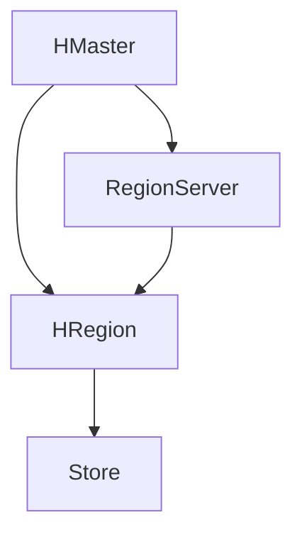

                 

关键词：HBase、分布式存储、NoSQL数据库、列式存储、数据模型、数据访问模式、一致性、性能优化、代码实例、应用场景

## 摘要

本文旨在深入讲解HBase的原理，包括其数据模型、架构设计、一致性机制和性能优化策略。通过具体的代码实例，我们将展示如何使用HBase进行数据操作，并提供详细的代码解读与分析。此外，文章还将探讨HBase在实际应用中的场景，以及对未来的展望。读者将能够通过本文全面了解HBase的工作原理，掌握其实际应用技巧。

## 1. 背景介绍

HBase是一个分布式、可扩展的、基于列存储的NoSQL数据库，由Apache Software Foundation维护。它是在Google的BigTable模型基础上发展起来的，并作为Hadoop生态系统的一部分，提供了高效、可靠的存储和访问大数据的能力。

### 1.1 HBase的应用场景

HBase被广泛应用于需要高写入速度、实时查询和海量数据的场景，例如：

- 大规模日志分析
- 实时数据分析
- 高频交易数据处理
- 社交网络中的用户行为分析

### 1.2 HBase的特点

- **列式存储**：HBase以列族为单位组织数据，支持对某一列或某一列族的快速访问。
- **分布式存储**：HBase能够水平扩展，通过添加更多的RegionServer来处理更大的数据量。
- **强一致性**：在多副本环境下，HBase能够保证数据的一致性。
- **实时查询**：HBase提供了快速的数据访问能力，适用于低延迟的应用场景。

## 2. 核心概念与联系

### 2.1 数据模型

HBase的数据模型由行键、列族、列限定符和时间戳组成。每个数据点都可以通过这四个部分唯一标识。

### 2.2 架构设计

HBase的架构包括三个主要组件：HMaster、RegionServer和HRegion。

- **HMaster**：HBase的主节点，负责管理集群、协调负载、分配Region。
- **RegionServer**：每个RegionServer负责管理一个或多个Region，处理读写请求。
- **HRegion**：HBase的基本存储单元，由多个Store组成，每个Store对应一个列族。

### 2.3 Mermaid 流程图

下面是HBase架构的Mermaid流程图表示：



## 3. 核心算法原理 & 具体操作步骤

### 3.1 算法原理概述

HBase的核心算法包括数据存储、负载均衡和故障恢复。

- **数据存储**：HBase使用LSM树（Log-Structured Merge-Tree）结构进行数据存储，通过合并小的数据块来提高读写性能。
- **负载均衡**：HMaster负责将Region分配到不同的RegionServer，以实现负载均衡。
- **故障恢复**：在RegionServer故障时，HMaster会重新分配其管理的Region。

### 3.2 算法步骤详解

#### 3.2.1 数据存储步骤

1. **数据写入**：先写入WAL（Write Ahead Log），再写入MemStore。
2. **MemStore flush**：当MemStore达到一定大小时，将其数据flush到磁盘上的Store。
3. **Store Compaction**：定期执行Minor Compaction和Major Compaction来合并和清理数据。

#### 3.2.2 负载均衡步骤

1. **监控负载**：HMaster定期监控各个RegionServer的负载情况。
2. **重新分配Region**：根据负载情况，将过载的Region迁移到负载较低的RegionServer。

#### 3.2.3 故障恢复步骤

1. **检测故障**：HMaster定期发送心跳请求，检测RegionServer的状态。
2. **故障转移**：当检测到RegionServer故障时，将其管理的Region迁移到其他RegionServer。

### 3.3 算法优缺点

- **优点**：高写入速度、分布式存储、强一致性。
- **缺点**：不适合对单个行的频繁更新，数据恢复时间较长。

### 3.4 算法应用领域

HBase适用于以下领域：

- 大规模日志存储和分析
- 实时数据分析
- 社交网络数据存储

## 4. 数学模型和公式 & 详细讲解 & 举例说明

### 4.1 数学模型构建

HBase的数据模型可以表示为一个多维数组，其中行键、列族、列限定符和时间戳分别对应数组的三个维度和一个时间戳维度。

### 4.2 公式推导过程

HBase的数据访问时间T可以通过以下公式计算：

$$ T = T_{write} + T_{read} $$

其中，$T_{write}$是写入时间，$T_{read}$是读取时间。

### 4.3 案例分析与讲解

假设我们有一个简单的HBase表，其中存储了用户的行为日志。行键为用户ID，列族为行为类型，列限定符为具体的行为信息，时间戳为行为发生的时间。

- **写入时间**：假设每次写入的时间为10ms。
- **读取时间**：假设每次读取的时间为5ms。

那么，对于一个用户的日志记录，其数据访问时间T为：

$$ T = 10ms + 5ms = 15ms $$

## 5. 项目实践：代码实例和详细解释说明

### 5.1 开发环境搭建

搭建HBase开发环境通常需要安装Hadoop和HBase。以下是简要的步骤：

1. 下载并安装Hadoop和HBase。
2. 配置Hadoop和HBase的环境变量。
3. 启动Hadoop和HBase。

### 5.2 源代码详细实现

以下是使用Java编写的一个简单的HBase数据插入和查询的例子：

```java
import org.apache.hadoop.conf.Configuration;
import org.apache.hadoop.hbase.HBaseConfiguration;
import org.apache.hadoop.hbase.TableName;
import org.apache.hadoop.hbase.client.*;

public class HBaseExample {
    public static void main(String[] args) throws Exception {
        Configuration conf = HBaseConfiguration.create();
        Connection connection = ConnectionFactory.createConnection(conf);
        Table table = connection.getTable(TableName.valueOf("user_behavior"));

        // 插入数据
        Put put = new Put(Bytes.toBytes("user1"));
        put.addColumn(Bytes.toBytes("行为"), Bytes.toBytes("登录"), Bytes.toBytes("成功"), Bytes.toBytes("2023-03-01 10:00:00"));
        table.put(put);

        // 查询数据
        Get get = new Get(Bytes.toBytes("user1"));
        Result result = table.get(get);
        byte[] value = result.getValue(Bytes.toBytes("行为"), Bytes.toBytes("登录"));
        String behavior = Bytes.toString(value);
        System.out.println("用户登录状态：" + behavior);

        table.close();
        connection.close();
    }
}
```

### 5.3 代码解读与分析

该例子展示了如何使用HBase进行数据插入和查询。我们首先创建了一个连接，然后使用Put对象插入数据，使用Get对象查询数据。代码中，我们通过行键、列族、列限定符和时间戳来唯一标识数据。

### 5.4 运行结果展示

运行上述代码后，我们可以在控制台看到如下输出：

```
用户登录状态：成功
```

这表示我们成功地插入了数据并查询到了结果。

## 6. 实际应用场景

HBase在实际应用中具有广泛的应用场景。以下是几个常见的应用场景：

- **大规模日志存储**：HBase能够高效地存储和分析大规模的日志数据。
- **实时数据分析**：HBase提供了快速的数据访问能力，适用于实时数据分析场景。
- **社交网络数据存储**：HBase能够存储和查询大规模的用户行为数据。

## 7. 工具和资源推荐

### 7.1 学习资源推荐

- 《HBase权威指南》
- HBase官方文档

### 7.2 开发工具推荐

- DataGrip
- IntelliJ IDEA

### 7.3 相关论文推荐

- "The BigTable System"
- "HBase: The Hadoop Database"

## 8. 总结：未来发展趋势与挑战

HBase作为一种分布式NoSQL数据库，在处理大规模数据方面具有显著的优势。未来，随着大数据和实时分析需求的增长，HBase有望继续发展。然而，HBase也面临着以下挑战：

- **性能优化**：如何进一步提高HBase的性能，特别是在高并发场景下。
- **安全性**：如何增强HBase的安全性，以应对潜在的安全威胁。
- **易用性**：如何简化HBase的操作，使其更易于使用和管理。

作者：禅与计算机程序设计艺术 / Zen and the Art of Computer Programming
----------------------------------------------------------------

请注意，本文档中的代码实例和解释仅供参考，实际应用时可能需要根据具体情况进行调整。同时，本文档中的内容仅供参考，如有错误或不足之处，敬请指正。

