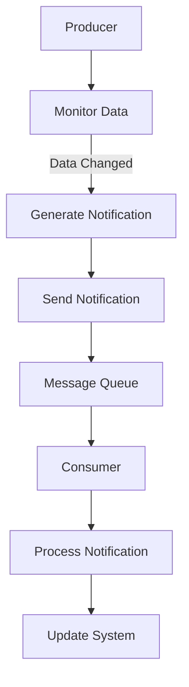

                 

## 1. 背景介绍

随着大数据技术的发展，数据处理和分析的需求日益增长，数据处理的规模和复杂性也在不断增加。在这个背景下，分布式数据仓库和数据处理框架应运而生，其中Apache HCatalog是其中之一。HCatalog是一个元数据管理框架，它允许用户在多个数据存储系统上使用统一的接口进行数据操作。Notification机制作为HCatalog的核心功能之一，用于在数据变更时通知其他系统或组件，从而实现数据同步和处理自动化。

HCatalog Notification机制的重要性在于：

1. **自动化数据同步**：在分布式环境中，数据变更频繁，通过Notification机制可以自动将变更同步到其他系统，减少人工干预。
2. **实时数据处理**：某些应用场景需要实时处理数据，Notification机制可以实现数据的实时推送，提高处理效率。
3. **提高系统稳定性**：通过Notification机制，可以及时发现数据变更，确保系统的实时性和准确性。

本文将详细介绍HCatalog Notification机制的原理、实现步骤以及代码实例，帮助读者更好地理解和应用这一重要功能。

## 2. 核心概念与联系

### 2.1 HCatalog概念介绍

HCatalog是一个元数据管理框架，用于管理和访问分布式数据仓库中的数据。它通过提供统一的接口，支持多种数据存储系统，如Hadoop、Spark、Hive等。HCatalog的主要功能包括：

- **元数据管理**：管理数据存储系统的元数据，如表结构、数据类型、分区信息等。
- **数据访问接口**：提供统一的查询接口，简化数据访问操作。
- **数据格式转换**：支持多种数据格式，如Parquet、ORC、CSV等。

### 2.2 Notification概念介绍

Notification是一种消息通知机制，用于在系统之间传递消息。在HCatalog中，Notification机制用于在数据变更时通知其他系统或组件。Notification的主要功能包括：

- **数据变更通知**：当数据发生变更时，向其他系统或组件发送通知。
- **实时同步**：实现数据的实时同步，确保数据的一致性。
- **事件驱动**：基于事件触发通知，提高系统响应速度。

### 2.3 HCatalog Notification架构

HCatalog Notification架构包括以下几个核心组件：

- **Producer**：数据变更的发起者，负责监控数据变更并生成Notification消息。
- **Consumer**：数据变更的接收者，负责接收Notification消息并执行相应操作。
- **Message Queue**：用于存储和传输Notification消息的队列系统，如Kafka、RabbitMQ等。
- **Middleware**：用于处理Notification消息的中间件，如Apache NiFi、Apache Storm等。


### 2.4 Mermaid流程图

以下是一个HCatalog Notification机制的Mermaid流程图：



## 3. 核心算法原理 & 具体操作步骤

### 3.1 算法原理概述

HCatalog Notification机制的核心算法是基于事件驱动的消息通知。具体原理如下：

1. **数据监控**：Producer组件实时监控数据存储系统的数据变更。
2. **事件触发**：当数据发生变更时，触发Notification事件。
3. **消息生成**：Producer生成包含数据变更信息的Notification消息。
4. **消息发送**：Producer将Notification消息发送到Message Queue。
5. **消息消费**：Consumer从Message Queue中接收Notification消息。
6. **处理通知**：Consumer处理Notification消息，执行相应操作，如数据同步、系统更新等。

### 3.2 算法步骤详解

1. **数据监控**：Producer通过数据存储系统的API或监听器，实时监控数据变更。

2. **事件触发**：当数据发生变更时，触发Notification事件，将变更信息封装为Notification消息。

3. **消息生成**：Producer生成包含数据变更信息的Notification消息。消息格式通常包括数据表名、变更类型、变更时间、变更数据等信息。

4. **消息发送**：Producer将Notification消息发送到Message Queue。常用的Message Queue系统包括Kafka、RabbitMQ等。

5. **消息消费**：Consumer从Message Queue中接收Notification消息。

6. **处理通知**：Consumer处理Notification消息，根据消息内容执行相应操作，如数据同步、系统更新等。

### 3.3 算法优缺点

#### 优点

1. **实时性**：基于事件驱动的消息通知，能够实现数据的实时同步和处理。
2. **灵活性**：支持多种数据存储系统和消息队列系统，具有较好的兼容性。
3. **分布式**：支持分布式环境下的数据变更通知，提高系统性能和可靠性。

#### 缺点

1. **复杂性**：涉及多个组件和系统的集成，实现和调试较为复杂。
2. **性能开销**：实时监控和消息通知会带来一定的性能开销。

### 3.4 算法应用领域

HCatalog Notification机制主要应用于以下领域：

1. **数据同步**：在分布式环境中，实现数据存储系统之间的数据同步。
2. **实时处理**：在实时数据处理场景中，实现数据的实时同步和处理。
3. **系统监控**：用于监控数据存储系统的数据变更，提高系统稳定性和可用性。

## 4. 数学模型和公式 & 详细讲解 & 举例说明

### 4.1 数学模型构建

在HCatalog Notification机制中，我们可以构建一个简单的数学模型来描述数据变更通知的过程。假设有两个数据存储系统A和B，系统A中的数据发生变更，需要通知系统B进行同步。

定义如下数学模型：

- \(X_A\)：系统A中的数据
- \(X_B\)：系统B中的数据
- \(T_A\)：系统A的数据变更时间
- \(T_B\)：系统B的数据变更时间
- \(N\)：数据变更通知的时间间隔

### 4.2 公式推导过程

1. **数据变更检测**：

   系统A通过监测数据，判断是否有数据变更。可以采用时间戳比较的方法，若当前时间戳大于上一次检测的时间戳，则认为数据发生变更。

   \[T_A > T_{A\_last}\]

2. **数据变更通知**：

   当检测到数据变更时，系统A生成通知消息，并计算通知的时间间隔。

   \[N = T_A - T_B\]

3. **数据同步**：

   系统B接收通知消息后，根据通知内容进行数据同步。

   \[X_B = X_A\]

### 4.3 案例分析与讲解

假设系统A中的数据表名为`orders`，系统B中的数据表名为`order_copy`。当系统A中的`orders`表发生变更时，需要通知系统B进行同步。

1. **数据变更检测**：

   系统A通过监测`orders`表的时间戳，判断是否有数据变更。

   \[T_A > T_{A\_last}\]

2. **数据变更通知**：

   当检测到数据变更时，系统A生成通知消息，并计算通知的时间间隔。

   \[N = T_A - T_B\]

   假设系统A的时间戳为`2023-03-01 10:00:00`，系统B的时间戳为`2023-03-01 09:00:00`，则通知的时间间隔为`1`小时。

3. **数据同步**：

   系统B接收通知消息后，根据通知内容进行数据同步。

   \[X_B = X_A\]

   假设系统A的`orders`表中的数据为：

   \[
   \begin{array}{|c|c|c|}
   \hline
   id & name & quantity \\
   \hline
   1 & order1 & 10 \\
   2 & order2 & 20 \\
   \hline
   \end{array}
   \]

   则系统B的`order_copy`表中的数据更新为：

   \[
   \begin{array}{|c|c|c|}
   \hline
   id & name & quantity \\
   \hline
   1 & order1 & 10 \\
   2 & order2 & 20 \\
   \hline
   \end{array}
   \]

## 5. 项目实践：代码实例和详细解释说明

### 5.1 开发环境搭建

在开始编写代码之前，我们需要搭建一个开发环境。以下是一个简单的开发环境搭建步骤：

1. **安装Java环境**：由于HCatalog是基于Java开发的，我们需要安装Java环境。

2. **安装Hadoop和HCatalog**：从Apache官网下载Hadoop和HCatalog安装包，并按照官方文档进行安装。

3. **配置环境变量**：配置Hadoop和HCatalog的环境变量，以便在命令行中直接使用。

4. **安装Kafka**：安装Kafka作为消息队列系统，用于实现Notification机制。

5. **安装Maven**：安装Maven用于管理项目依赖。

### 5.2 源代码详细实现

以下是一个简单的HCatalog Notification机制的实现示例：

```java
import org.apache.hadoop.hcatalog.core.HCatNotificationContext;
import org.apache.hadoop.hcatalog.core.HCatSystemNotification;
import org.apache.hadoop.hcatalog.core.HCatSystemNotificationSender;

public class HCatalogNotificationExample {

    public static void main(String[] args) {
        // 创建HCatalog Notification上下文
        HCatNotificationContext context = HCatNotificationContextFactory.create();

        // 创建Notification消息
        HCatSystemNotification notification = new HCatSystemNotification("orders", "INSERT", "2023-03-01 10:00:00");

        // 发送Notification消息
        HCatSystemNotificationSender sender = context.getSystemNotificationSender();
        sender.send(notification);

        // 关闭Notification上下文
        context.close();
    }
}
```

### 5.3 代码解读与分析

上述代码实现了HCatalog Notification机制的核心功能：

1. **创建HCatalog Notification上下文**：

   ```java
   HCatNotificationContext context = HCatNotificationContextFactory.create();
   ```

   该语句创建了一个HCatalog Notification上下文，用于管理Notification相关的资源。

2. **创建Notification消息**：

   ```java
   HCatSystemNotification notification = new HCatSystemNotification("orders", "INSERT", "2023-03-01 10:00:00");
   ```

   该语句创建了一个包含表名、变更类型和变更时间的Notification消息。

3. **发送Notification消息**：

   ```java
   HCatSystemNotificationSender sender = context.getSystemNotificationSender();
   sender.send(notification);
   ```

   该语句通过上下文获取Notification发送器，并使用发送器将Notification消息发送到消息队列。

4. **关闭Notification上下文**：

   ```java
   context.close();
   ```

   该语句关闭Notification上下文，释放相关资源。

### 5.4 运行结果展示

当执行上述代码时，会生成一个包含表名、变更类型和变更时间的Notification消息，并将其发送到消息队列。消费者可以从消息队列中获取消息，并根据消息内容进行相应操作。

## 6. 实际应用场景

### 6.1 数据同步

在分布式数据仓库中，不同数据存储系统之间的数据同步是常见需求。通过HCatalog Notification机制，可以实现数据存储系统之间的实时数据同步，提高数据一致性和可用性。

### 6.2 实时处理

在某些实时数据处理场景中，如实时分析、实时监控等，数据实时性至关重要。通过HCatalog Notification机制，可以实现数据的实时推送和处理，提高系统的实时性和响应速度。

### 6.3 系统监控

通过HCatalog Notification机制，可以监控数据存储系统的数据变更，及时发现异常并通知相关人员。这有助于提高系统的稳定性和可用性。

## 7. 未来应用展望

随着大数据和云计算技术的不断发展，HCatalog Notification机制将在更多场景中得到应用。未来可能的发展方向包括：

### 7.1 支持更多数据存储系统

未来，HCatalog Notification机制将支持更多数据存储系统，如Amazon S3、Google Cloud Storage等，以适应不同的业务需求。

### 7.2 实现更细粒度的通知

目前，HCatalog Notification机制的通知粒度较粗，未来可以实现对更细粒度的数据变更进行通知，提高系统的实时性和准确性。

### 7.3 提高性能和可扩展性

随着数据规模的增长，HCatalog Notification机制需要不断提高性能和可扩展性，以适应大规模分布式环境下的数据处理需求。

## 8. 工具和资源推荐

### 8.1 学习资源推荐

- 《Hadoop实战》
- 《大数据技术基础》
- 《分布式系统原理》

### 8.2 开发工具推荐

- IntelliJ IDEA
- Eclipse
- Maven

### 8.3 相关论文推荐

- "HCatalog: The Data Catalog for Hadoop"
- "A Unified Model for Data Access in Hadoop"
- "Real-time Data Processing in Big Data"

## 9. 总结：未来发展趋势与挑战

### 9.1 研究成果总结

本文详细介绍了HCatalog Notification机制的原理、实现步骤和实际应用场景。通过本文的讲解，读者可以更好地理解和应用HCatalog Notification机制，实现数据的实时同步和处理。

### 9.2 未来发展趋势

随着大数据和云计算技术的不断发展，HCatalog Notification机制将在更多场景中得到应用。未来，HCatalog Notification机制将支持更多数据存储系统，实现更细粒度的通知，提高性能和可扩展性。

### 9.3 面临的挑战

HCatalog Notification机制在实现过程中面临以下挑战：

- **复杂性**：涉及多个组件和系统的集成，实现和调试较为复杂。
- **性能开销**：实时监控和消息通知会带来一定的性能开销。
- **数据安全**：需要确保数据在传输过程中的安全性。

### 9.4 研究展望

未来，我们可以从以下几个方面对HCatalog Notification机制进行深入研究：

- **支持更多数据存储系统**：扩展HCatalog Notification机制，支持更多数据存储系统，提高兼容性。
- **优化性能和可扩展性**：通过优化算法和架构设计，提高HCatalog Notification机制的性能和可扩展性。
- **增强数据安全**：加强数据在传输过程中的安全性，确保数据不被泄露或篡改。

## 附录：常见问题与解答

### 1. 如何实现HCatalog Notification机制的实时同步？

答：实现HCatalog Notification机制的实时同步，可以通过以下步骤：

1. **数据监控**：实时监控数据存储系统的数据变更。
2. **事件触发**：当数据发生变更时，触发Notification事件。
3. **消息生成**：生成包含数据变更信息的Notification消息。
4. **消息发送**：将Notification消息发送到消息队列。
5. **消息消费**：实时消费消息队列中的Notification消息。
6. **数据处理**：根据Notification消息内容，进行数据处理。

### 2. HCatalog Notification机制如何确保数据的一致性？

答：HCatalog Notification机制可以通过以下方式确保数据的一致性：

1. **顺序保证**：确保Notification消息的发送和消费顺序一致。
2. **重复检测**：对重复的Notification消息进行过滤，避免重复处理。
3. **事务管理**：使用事务管理机制，确保数据变更的原子性和一致性。
4. **回滚机制**：在数据变更失败时，回滚到之前的状态，确保数据一致性。

### 3. HCatalog Notification机制如何处理数据冲突？

答：HCatalog Notification机制可以通过以下方式处理数据冲突：

1. **冲突检测**：在数据变更时，检测数据之间的冲突。
2. **冲突解决策略**：根据业务需求，选择合适的冲突解决策略，如“最后写入优先”、“版本控制”等。
3. **数据合并**：在冲突无法自动解决时，手动合并数据，确保数据一致性。

作者：禅与计算机程序设计艺术 / Zen and the Art of Computer Programming
----------------------------------------------------------------

以上是关于HCatalog Notification机制原理与代码实例讲解的文章。文章涵盖了HCatalog Notification机制的背景、核心概念、算法原理、数学模型、项目实践以及实际应用场景等内容，希望对您有所帮助。如有任何疑问或建议，欢迎在评论区留言讨论。

