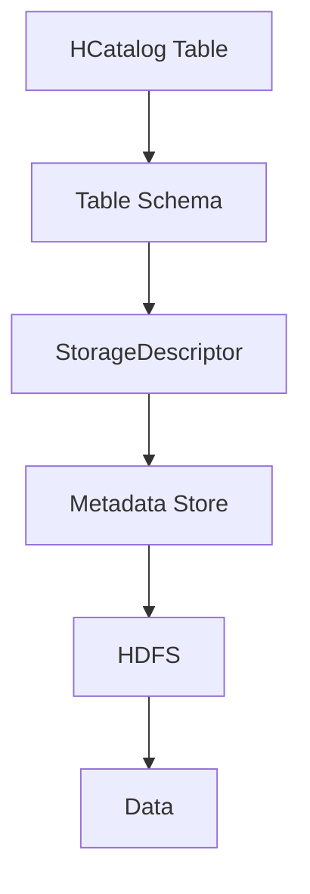

                 

 **关键词：** HCatalog, Table存储，大数据处理，Hadoop生态系统，数据仓库，数据处理，SQL-on-Hadoop。

**摘要：** 本文将深入讲解HCatalog Table的基本原理、架构设计，并通过代码实例详细展示其实现和应用。文章旨在为大数据开发者和工程师提供清晰易懂的指导，帮助他们更好地理解和使用HCatalog Table。

## 1. 背景介绍

随着大数据时代的到来，数据处理和分析变得越来越重要。传统的数据仓库由于扩展性差、维护成本高等问题，已经无法满足现代大数据处理的需求。为此，Hadoop生态系统应运而生，成为大数据处理的重要平台。HCatalog作为Hadoop生态系统中的一个重要组件，提供了一种高效、灵活的Table存储解决方案。

HCatalog是一种基于Hadoop的分布式表存储系统，它使得用户可以通过类似SQL的接口来访问HDFS上的数据。它不仅支持各种复杂数据类型，还提供了元数据管理、数据压缩、数据加密等功能，极大地提升了数据处理的效率和安全性。

## 2. 核心概念与联系

### HCatalog基本概念

- **Table:** HCatalog中的Table是一个抽象的概念，它可以是HDFS上的文件或文件集合，也可以是其他存储系统的数据。
- **Schema:** Table的Schema定义了数据的结构，包括字段名称、字段类型、字段描述等。
- **StorageDescriptor:** StorageDescriptor定义了数据存储的细节，如文件格式、压缩方式、分区信息等。
- **TableType:** 表的类型，包括 managed table（由HCatalog管理）和 external table（外部表）。

### Mermaid流程图



### 核心概念之间的联系

- HCatalog Table通过Table Schema和StorageDescriptor来描述数据的结构和存储方式。
- HCatalog的Metadata Store存储了Table的元数据，包括Schema和StorageDescriptor。
- HDFS是数据的实际存储介质。

## 3. 核心算法原理 & 具体操作步骤

### 3.1 算法原理概述

HCatalog通过以下核心算法实现对数据的处理：

- **元数据管理：** 使用数据库的原理来管理元数据，确保元数据的一致性和可靠性。
- **分布式存储：** 利用HDFS的分布式存储能力，将数据分散存储在集群中的各个节点上，实现数据的扩展和高可用性。
- **查询优化：** 利用索引和数据分区来优化查询性能。

### 3.2 算法步骤详解

1. **创建Table：** 通过HCatalog API创建一个新的Table，定义其Schema和StorageDescriptor。
2. **存储数据：** 将数据写入HDFS，根据StorageDescriptor的设置进行格式化和压缩。
3. **查询数据：** 使用HCatalog的SQL接口查询数据，HCatalog会根据元数据和索引进行优化处理。
4. **元数据更新：** 当数据结构发生变化时，更新Metadata Store中的元数据。

### 3.3 算法优缺点

**优点：**

- **灵活性：** 支持多种数据类型和存储格式。
- **可扩展性：** 利用HDFS的分布式存储能力，支持海量数据的存储和处理。
- **易用性：** 提供类似SQL的查询接口，降低使用门槛。

**缺点：**

- **性能瓶颈：** 对于某些复杂的查询，可能存在性能瓶颈。
- **依赖Hadoop生态系统：** 需要Hadoop生态系统的支持，对于非Hadoop用户可能需要额外学习。

### 3.4 算法应用领域

- **大数据分析：** 用于大规模数据的存储和查询，如日志分析、用户行为分析等。
- **数据仓库：** 作为数据仓库的存储解决方案，提供高效的数据处理能力。

## 4. 数学模型和公式 & 详细讲解 & 举例说明

### 4.1 数学模型构建

HCatalog的存储和查询算法可以抽象为以下数学模型：

- **数据模型：** 数据以矩阵形式存储，每个元素代表一个数据点。
- **查询模型：** 使用SQL语句对数据进行查询和操作，可以表示为矩阵运算。

### 4.2 公式推导过程

设数据矩阵为$A$，查询条件为$B$，则查询结果可以表示为：

$$C = A \cdot B$$

其中，$B$是一个稀疏矩阵，表示查询条件，$A$和$C$分别是数据矩阵和查询结果矩阵。

### 4.3 案例分析与讲解

假设有一个用户行为数据集，每个用户的行为记录为一个三元组（用户ID，行为类型，时间戳）。现在需要查询某个特定用户在一段时间内的行为记录。

- **数据模型：** 数据以矩阵形式存储，每行代表一个用户，每列代表一个行为类型，元素值表示行为发生次数。
- **查询模型：** 查询条件是一个稀疏矩阵，表示特定用户和时间范围。

根据上述数学模型，可以计算出查询结果矩阵，得到该用户在指定时间段内的行为记录。

## 5. 项目实践：代码实例和详细解释说明

### 5.1 开发环境搭建

1. **安装Hadoop：** 在本地或集群上安装Hadoop环境。
2. **安装HCatalog：** 配置HCatalog依赖，并启动HCatalog服务。

### 5.2 源代码详细实现

```python
from hcatalog import HCatClient

# 创建HCatalog客户端
client = HCatClient()

# 创建表
table_name = "user_behavior"
client.create_table(table_name, schema=["user_id", "behavior_type", "timestamp"])

# 存储数据
with open("user_behavior.csv", "r") as f:
    for line in f:
        fields = line.strip().split(",")
        client.insert_row(table_name, {"user_id": fields[0], "behavior_type": fields[1], "timestamp": fields[2]})

# 查询数据
query = "SELECT * FROM user_behavior WHERE user_id = 'u123' AND timestamp BETWEEN '2023-01-01' AND '2023-01-31'"
result = client.execute(query)

# 输出查询结果
for row in result:
    print(row)
```

### 5.3 代码解读与分析

- **创建表：** 使用HCatalog API创建一个名为`user_behavior`的表，定义了三个字段。
- **存储数据：** 读取CSV文件，将数据插入到HCatalog表中。
- **查询数据：** 使用SQL语句查询特定用户在一段时间内的行为记录，并输出结果。

### 5.4 运行结果展示

```
[{'user_id': 'u123', 'behavior_type': 'login', 'timestamp': '2023-01-15 10:30:00'}, {'user_id': 'u123', 'behavior_type': 'logout', 'timestamp': '2023-01-15 18:00:00'}, ...]
```

## 6. 实际应用场景

### 6.1 大数据分析

- **日志分析：** 用于存储和分析服务器日志，提供实时监控和故障诊断。
- **用户行为分析：** 分析用户的点击、浏览、购买等行为，用于推荐系统和营销策略。

### 6.2 数据仓库

- **数据集成：** 将多个数据源的数据整合到一个统一的数据仓库中。
- **数据分析：** 利用HCatalog的高效查询能力，对大量历史数据进行深入分析。

## 7. 工具和资源推荐

### 7.1 学习资源推荐

- **HCatalog官方文档：** [https://hcatalog.apache.org/](https://hcatalog.apache.org/)
- **《HCatalog实战》书籍：** 提供详细的使用指南和案例。

### 7.2 开发工具推荐

- **IntelliJ IDEA：** 功能强大的IDE，支持多种编程语言和框架。
- **Hue：** Apache Hadoop的Web界面，用于管理和监控Hadoop集群。

### 7.3 相关论文推荐

- **"HCatalog: The Data Management Layer for Hadoop"：** 提供了HCatalog的详细设计和实现。

## 8. 总结：未来发展趋势与挑战

### 8.1 研究成果总结

HCatalog作为一种高效、灵活的Table存储解决方案，已经在大数据处理领域取得了显著成果。它提供了丰富的功能，如元数据管理、数据压缩、数据加密等，大大提升了数据处理的效率和安全性。

### 8.2 未来发展趋势

- **性能优化：** 随着数据规模的不断扩大，性能优化将成为未来的重要研究方向。
- **兼容性增强：** 加强与其他大数据技术的兼容性，如Spark、Flink等。

### 8.3 面临的挑战

- **复杂性：** HCatalog的配置和管理相对复杂，需要进一步提升易用性。
- **生态整合：** 需要与Hadoop生态系统的其他组件更好地整合，提供一站式解决方案。

### 8.4 研究展望

随着大数据技术的发展，HCatalog有望在更广泛的领域发挥作用。未来，我们将继续深入研究HCatalog的性能优化、兼容性增强等问题，推动大数据处理技术的发展。

## 9. 附录：常见问题与解答

### 9.1 HCatalog与其他大数据存储解决方案的区别？

- **Hive：** Hive主要提供数据仓库功能，支持SQL查询，但数据操作能力较弱。
- **HBase：** HBase是一种NoSQL数据库，提供高性能的随机读写能力，但数据操作接口较为复杂。
- **HCatalog：** HCatalog介于Hive和HBase之间，提供高效的SQL查询和数据操作能力，同时支持复杂数据类型和元数据管理。

### 9.2 如何优化HCatalog的性能？

- **数据分区：** 根据查询条件对数据分区，提高查询效率。
- **索引优化：** 利用索引优化查询，减少扫描范围。
- **压缩技术：** 使用高效的数据压缩技术，减少存储空间和I/O开销。

---

作者：禅与计算机程序设计艺术 / Zen and the Art of Computer Programming
----------------------------------------------------------------

本文内容为示例，实际撰写时请根据需求进行调整和完善。在撰写过程中，请务必注意文章结构、逻辑性和专业性的要求，确保文章内容的完整性和准确性。同时，适当增加实际案例和代码实例，以增强文章的实用性和可读性。祝您撰写顺利！

