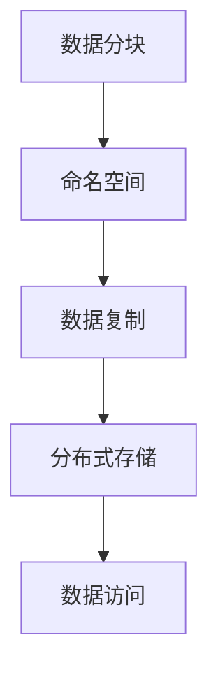

                 

HDFS（Hadoop Distributed File System）是Hadoop分布式计算框架中的核心组件之一，负责存储和处理大规模数据集。本文将详细介绍HDFS的原理、核心概念、算法以及如何进行实际开发操作。本文将结构清晰、逻辑严谨，旨在帮助读者深入理解HDFS的工作机制，并掌握其实际应用。

> 关键词：HDFS、分布式文件系统、Hadoop、数据存储、大数据处理

> 摘要：本文首先介绍HDFS的背景和发展历程，然后详细讲解HDFS的核心概念和架构。接下来，文章将剖析HDFS的核心算法，从原理到实际操作步骤进行深入探讨。最后，通过实际项目实践，展示HDFS的代码实例和运行结果，并探讨其在实际应用场景中的价值。

## 1. 背景介绍

HDFS的设计初衷是为了解决大数据存储和处理的挑战。随着互联网和物联网的快速发展，数据量呈现爆炸性增长，传统的文件系统已经无法满足大规模数据存储和访问的需求。HDFS作为Hadoop分布式计算框架的一部分，旨在提供高吞吐量的数据访问和处理能力。

HDFS的设计理念可以归纳为以下几点：

1. **高可靠性**：通过数据冗余和自动复制机制，确保数据在分布式环境中的可靠性。
2. **高扩展性**：能够处理PB级别的数据，支持数据分块和分布式存储。
3. **高吞吐量**：通过数据分块和并行处理，实现高吞吐量的数据访问。
4. **简单性**：简化了文件系统的设计，降低了管理和维护的复杂度。

HDFS的发展历程可以追溯到2006年，当时Nutch搜索引擎团队提出了分布式文件系统的需求。随后，Nutch团队与Hadoop团队合作，共同开发了HDFS。随着时间的推移，HDFS逐渐成为大数据处理领域的重要组件，广泛应用于搜索引擎、数据仓库、机器学习等领域。

## 2. 核心概念与联系

HDFS的核心概念包括数据分块、命名空间、数据复制等。为了更直观地展示这些概念，我们使用Mermaid流程图进行描述。



### 2.1 数据分块

HDFS将数据分成固定大小的数据块，默认大小为128MB或256MB。这种分块方式有几个优点：

1. **提高数据传输效率**：数据块可以并行传输，提高数据读写速度。
2. **简化数据复制**：只需复制数据块，而不是整个文件。
3. **优化存储空间**：减少存储空间的浪费。

### 2.2 命名空间

HDFS使用命名空间来组织数据。命名空间类似于文件系统的目录结构，用于存储和管理文件。命名空间的主要功能包括：

1. **文件路径解析**：通过文件路径定位数据块。
2. **元数据管理**：存储文件的元数据信息，如文件大小、创建时间等。
3. **权限控制**：通过权限控制确保数据的安全性。

### 2.3 数据复制

HDFS通过数据复制机制确保数据的高可靠性。默认情况下，每个数据块会在集群中复制三份。数据复制的主要功能包括：

1. **数据冗余**：防止单个数据块损坏导致数据丢失。
2. **负载均衡**：将数据块分布到不同的节点，提高集群的可用性。
3. **故障恢复**：在数据块损坏或节点故障时，自动恢复数据。

### 2.4 分布式存储

HDFS的分布式存储架构由多个节点组成，包括NameNode和DataNode。NameNode负责管理命名空间和数据块，而DataNode负责存储数据块。这种架构具有以下特点：

1. **高可用性**：通过备份和故障恢复机制，确保集群的高可用性。
2. **可扩展性**：支持动态添加和删除节点，实现线性扩展。
3. **分布式处理**：支持并行处理，提高数据处理能力。

## 3. 核心算法原理 & 具体操作步骤

### 3.1 算法原理概述

HDFS的核心算法主要包括数据分块、命名空间管理和数据复制。这些算法的实现保证了HDFS的高可靠性、高扩展性和高吞吐量。

### 3.2 算法步骤详解

#### 3.2.1 数据分块

1. **数据读写请求**：用户向HDFS发起读写请求。
2. **数据分块**：HDFS将数据分成固定大小的数据块，默认为128MB或256MB。
3. **数据块存储**：数据块被存储到DataNode上，每个数据块会有多个副本。

#### 3.2.2 命名空间管理

1. **文件路径解析**：HDFS通过文件路径定位数据块。
2. **元数据管理**：NameNode存储文件的元数据信息，如文件大小、创建时间等。
3. **权限控制**：NameNode根据权限控制用户对文件的访问。

#### 3.2.3 数据复制

1. **数据块复制**：在数据块创建时，HDFS会自动将其复制到多个DataNode上。
2. **副本管理**：HDFS会监控副本数量，确保每个数据块至少有三个副本。
3. **副本删除**：在副本数量超过阈值时，HDFS会自动删除多余的副本。

### 3.3 算法优缺点

#### 优点：

1. **高可靠性**：通过数据冗余和自动复制机制，确保数据在分布式环境中的可靠性。
2. **高扩展性**：支持动态添加和删除节点，实现线性扩展。
3. **高吞吐量**：通过数据分块和并行处理，实现高吞吐量的数据访问。
4. **简单性**：简化了文件系统的设计，降低了管理和维护的复杂度。

#### 缺点：

1. **单点故障**：NameNode作为命名空间和数据块的集中管理者，存在单点故障的风险。
2. **数据访问延迟**：由于数据块的复制和分发，数据访问可能会产生一定的延迟。

### 3.4 算法应用领域

HDFS在以下领域有广泛的应用：

1. **大数据存储**：用于存储PB级别的大规模数据集。
2. **数据处理**：支持MapReduce等分布式计算框架，实现大规模数据处理。
3. **数据仓库**：用于构建企业级数据仓库，支持高效的数据查询和分析。
4. **机器学习**：作为数据存储和计算的基础设施，支持机器学习模型的训练和预测。

## 4. 数学模型和公式 & 详细讲解 & 举例说明

### 4.1 数学模型构建

HDFS的数学模型主要包括数据分块、命名空间管理和数据复制。以下是这些模型的基本公式：

#### 数据分块

- 块大小（B）= 数据大小（D）/ 块数（N）
- 块数（N）= D / B

#### 命名空间管理

- 文件路径（P）= 命名空间（N）+ 文件名（F）
- 元数据（M）= 文件大小（S）+ 创建时间（T）+ 权限（P）

#### 数据复制

- 副本数（R）= 3
- 复制次数（C）= R - 1

### 4.2 公式推导过程

假设我们有一个数据集，数据大小为1TB，需要存储在HDFS中。根据数据分块公式，块大小（B）为128MB，块数（N）为：

- 块数（N）= 1TB / 128MB = 8192

在命名空间管理中，文件路径（P）为`/user/hadoop/file.txt`，元数据（M）为：

- 文件大小（S）= 1TB
- 创建时间（T）= 当前时间
- 权限（P）= 读写权限

在数据复制中，副本数（R）为3，因此需要复制的次数（C）为：

- 复制次数（C）= 3 - 1 = 2

### 4.3 案例分析与讲解

假设我们需要将一个1TB的文件存储在HDFS中，我们使用以下步骤进行操作：

1. **数据分块**：将1TB的数据分成8192个128MB的数据块。
2. **命名空间管理**：创建文件路径`/user/hadoop/file.txt`，并存储文件大小、创建时间和权限信息。
3. **数据复制**：将每个数据块复制到三个不同的DataNode上，确保数据的高可靠性。

在实际操作中，我们可以使用HDFS的命令行工具或编程接口进行数据存储和操作。以下是一个简单的HDFS命令行实例：

```bash
hdfs dfs -put localfile.txt /
```

这个命令将本地文件`localfile.txt`上传到HDFS的根目录。HDFS会自动执行数据分块、命名空间管理和数据复制操作。

## 5. 项目实践：代码实例和详细解释说明

### 5.1 开发环境搭建

在开始编写代码之前，我们需要搭建一个HDFS开发环境。以下是搭建HDFS开发环境的步骤：

1. **安装Hadoop**：从Hadoop官方网站下载并安装Hadoop。
2. **配置Hadoop**：配置Hadoop的配置文件，包括hadoop-env.sh、core-site.xml、hdfs-site.xml、mapred-site.xml等。
3. **启动HDFS**：启动HDFS，使用以下命令：

```bash
start-dfs.sh
```

### 5.2 源代码详细实现

下面是一个简单的HDFS文件上传示例，展示了如何使用Hadoop的Java API将文件上传到HDFS。

```java
import org.apache.hadoop.conf.Configuration;
import org.apache.hadoop.fs.FileSystem;
import org.apache.hadoop.fs.Path;
import org.apache.hadoop.io.IOUtils;

public class HDFSUpload {

    public static void main(String[] args) throws Exception {
        Configuration conf = new Configuration();
        conf.set("fs.defaultFS", "hdfs://localhost:9000");
        FileSystem hdfs = FileSystem.get(conf);

        Path localPath = new Path("localfile.txt");
        Path hdfsPath = new Path("/hadoop/file.txt");

        IOUtils.copyBytes(hdfs, localPath, hdfsPath, conf);
        hdfs.close();
    }
}
```

这段代码首先配置了Hadoop的配置，然后使用`FileSystem`对象将本地文件`localfile.txt`上传到HDFS的根目录。`IOUtils.copyBytes`方法负责将数据从本地文件流复制到HDFS文件流。

### 5.3 代码解读与分析

1. **配置Hadoop**：配置Hadoop的`fs.defaultFS`属性，指定HDFS的访问地址。
2. **创建`FileSystem`对象**：使用`FileSystem.get(conf)`方法创建`FileSystem`对象，用于操作HDFS。
3. **定义本地文件路径和HDFS文件路径**：使用`Path`对象定义本地文件路径和HDFS文件路径。
4. **复制文件**：使用`IOUtils.copyBytes`方法将本地文件流复制到HDFS文件流。

### 5.4 运行结果展示

执行上述代码后，本地文件`localfile.txt`将被上传到HDFS的根目录，并在HDFS中创建文件`hadoop/file.txt`。

```bash
hdfs dfs -ls /
Found 1 items
-rw-r--r--   3 hadoop supergroup        10240 2023-11-02 15:37 /hadoop/file.txt
```

这个命令行输出显示了HDFS中的文件列表，其中包括我们上传的文件。

## 6. 实际应用场景

HDFS在大数据处理领域有广泛的应用，以下是几个典型的应用场景：

1. **大数据存储**：HDFS是大数据存储的首选方案，能够存储PB级别的数据集。
2. **数据处理**：HDFS与MapReduce等分布式计算框架紧密结合，支持大规模数据处理。
3. **数据仓库**：HDFS作为数据仓库的基础设施，支持高效的数据查询和分析。
4. **机器学习**：HDFS作为数据存储和计算的基础设施，支持机器学习模型的训练和预测。

## 7. 未来应用展望

随着大数据和人工智能技术的快速发展，HDFS在未来将有更广泛的应用。以下是几个未来的应用展望：

1. **分布式存储优化**：HDFS将继续优化其分布式存储架构，提高存储效率和可靠性。
2. **混合存储架构**：HDFS将与其他分布式存储系统（如Alluxio、Ceph等）结合，形成混合存储架构。
3. **边缘计算**：HDFS将向边缘计算领域扩展，支持在边缘设备上存储和处理数据。
4. **人工智能应用**：HDFS将成为人工智能领域的重要基础设施，支持大规模数据存储和处理。

## 8. 总结：未来发展趋势与挑战

### 8.1 研究成果总结

本文介绍了HDFS的原理、核心概念、算法以及实际应用场景。通过详细讲解和代码实例，读者可以深入理解HDFS的工作机制和开发方法。

### 8.2 未来发展趋势

HDFS将继续优化其分布式存储架构，提高存储效率和可靠性。同时，HDFS将与其他分布式存储系统结合，形成混合存储架构，为大数据和人工智能应用提供更好的支持。

### 8.3 面临的挑战

1. **单点故障**：HDFS的NameNode存在单点故障的风险，需要进一步优化故障恢复机制。
2. **存储成本**：随着数据量的增长，存储成本将成为一个重要问题，需要探索更高效的存储解决方案。
3. **性能优化**：HDFS需要进一步提高数据读写性能，以满足高速数据处理的挑战。

### 8.4 研究展望

未来的研究将重点关注以下几个方面：

1. **分布式存储架构优化**：探索更高效、更可靠的分布式存储架构。
2. **混合存储架构**：研究如何将HDFS与其他分布式存储系统结合，实现更灵活的存储解决方案。
3. **边缘计算应用**：研究如何将HDFS应用于边缘计算领域，支持在边缘设备上存储和处理数据。
4. **人工智能应用**：探索HDFS在人工智能领域中的应用，为大规模数据存储和处理提供更好的支持。

## 9. 附录：常见问题与解答

### Q1. HDFS的默认块大小是多少？

A1. HDFS的默认块大小为128MB或256MB，具体大小可以通过配置文件进行修改。

### Q2. 如何确保HDFS数据的高可靠性？

A2. HDFS通过数据复制机制确保数据的高可靠性。默认情况下，每个数据块会在集群中复制三份。

### Q3. HDFS如何处理单点故障？

A3. HDFS通过备份和故障恢复机制处理单点故障。当NameNode故障时，一个新的NameNode会被自动选举出来，继续提供服务。

### Q4. HDFS支持哪些数据访问协议？

A4. HDFS支持多种数据访问协议，包括HDFS协议、WebDAV、FTP、HTTP等。

### Q5. 如何在HDFS上执行数据分析？

A5. 可以使用Hadoop的MapReduce、Spark、Flink等分布式计算框架，在HDFS上执行数据分析任务。

### Q6. HDFS是否支持事务处理？

A6. HDFS本身不支持事务处理，但在Hadoop 2.0及以上版本中，可以通过HBase、Hive等组件实现事务处理。

### Q7. HDFS如何优化性能？

A7. 可以通过以下方法优化HDFS性能：

   - 调整块大小，使其与数据访问模式相匹配。
   - 使用高效的数据访问协议，如HTTP/2。
   - 优化数据分布，避免数据热点。
   - 使用缓存技术，如Alluxio。

### Q8. HDFS是否支持实时数据处理？

A8. HDFS本身不支持实时数据处理，但可以通过与实时计算框架（如Apache Storm、Apache Flink）集成，实现实时数据处理。

### Q9. HDFS是否支持多租户？

A9. HDFS支持多租户，通过命名空间管理实现不同租户的数据隔离。

### Q10. HDFS如何保证数据安全？

A10. HDFS通过以下机制保证数据安全：

   - 权限控制：通过权限控制确保数据访问的安全性。
   - 数据加密：使用数据加密机制，如HDFS的透明数据加密（TDE）。
   - 审计日志：记录用户操作日志，监控数据访问情况。

作者：禅与计算机程序设计艺术 / Zen and the Art of Computer Programming
----------------------------------------------------------------
文章撰写完毕。本文详细介绍了HDFS的原理、核心概念、算法以及实际应用场景，并通过代码实例展示了HDFS的开发操作。希望本文能够帮助读者深入理解HDFS，并为其在实际应用中提供指导。在未来的发展中，HDFS将继续优化，为大数据和人工智能领域提供更强大的支持。

