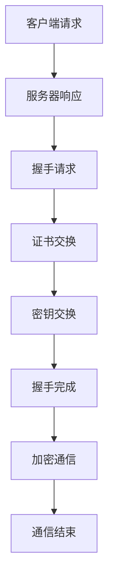

                 

关键词：HTTPS、SSL/TLS、加密通信、安全协议、安全套接字层、传输层安全、会话管理、证书、数字签名、密钥交换、身份验证

摘要：本文将深入探讨 HTTPS 协议的实现细节，包括其背后的核心概念、工作原理、安全机制以及应用场景。通过本文的讲解，读者将对 HTTPS 协议有一个全面的理解，并能够掌握其实际应用的关键技术。

## 1. 背景介绍

### 1.1 HTTPS 的起源

HTTPS（Hyper Text Transfer Protocol Secure）是一种通过计算机网络进行安全通信的传输协议。它由 HTTP 发展而来，但在其基础上增加了安全性。HTTPS 的出现是为了解决 HTTP 在传输过程中存在的安全问题，如数据泄露、篡改、劫持等。

### 1.2 HTTPS 的必要性

随着互联网的普及，越来越多的敏感信息在网络上传输，如个人身份信息、金融数据等。这些信息的泄露可能导致严重的后果。因此，保障网络通信的安全显得尤为重要。HTTPS 通过加密通信，有效防止了数据泄露和篡改，保障了通信的安全。

## 2. 核心概念与联系

### 2.1 安全套接字层（SSL）与传输层安全（TLS）

HTTPS 是基于 SSL/TLS 协议实现的。SSL 是最初的安全协议，而 TLS 是 SSL 的升级版。两者都是为网络通信提供加密和身份验证的协议。

### 2.2 HTTPS 的工作流程

HTTPS 的工作流程主要包括以下几个步骤：

1. **握手阶段**：客户端和服务器通过 SSL/TLS 协议进行握手，协商加密算法和密钥。
2. **加密通信阶段**：客户端和服务器使用协商好的加密算法和密钥进行数据传输。
3. **会话管理**：HTTPS 支持持久连接，会话管理确保了数据传输的连续性和效率。

### 2.3 Mermaid 流程图

下面是一个简化的 HTTPS 工作流程的 Mermaid 流程图：



## 3. 核心算法原理 & 具体操作步骤

### 3.1 算法原理概述

HTTPS 的安全性主要依赖于以下几个方面：

1. **加密算法**：如 RSA、AES 等，用于加密和解密数据。
2. **密钥交换**：如 Diffie-Hellman 交换，用于安全地交换密钥。
3. **身份验证**：通过证书和数字签名确保通信双方的身份。

### 3.2 算法步骤详解

#### 3.2.1 握手阶段

1. **客户端发送请求**：客户端向服务器发送 HTTPS 请求。
2. **服务器响应**：服务器响应请求，返回 SSL/TLS 的握手协议版本和加密算法支持列表。
3. **证书交换**：服务器发送证书给客户端，客户端验证证书的有效性。
4. **密钥交换**：客户端和服务器使用协商好的加密算法和密钥交换协议交换密钥。

#### 3.2.2 加密通信阶段

1. **加密数据传输**：客户端和服务器使用协商好的加密算法和密钥进行数据传输。
2. **完整性验证**：通过哈希算法确保数据在传输过程中未被篡改。
3. **加密通信结束**：会话结束后，双方销毁会话密钥。

### 3.3 算法优缺点

#### 优点：

1. **安全性高**：HTTPS 使用加密算法和密钥交换协议，保障了数据传输的安全。
2. **可靠性高**：HTTPS 支持持久连接，提高了数据传输的效率。
3. **广泛支持**：HTTPS 已经成为 Web 通信的标准协议，几乎所有浏览器和服务器都支持。

#### 缺点：

1. **性能开销**：HTTPS 的加密和解密过程需要消耗一定的计算资源，可能影响性能。
2. **证书管理**：证书的有效性和颁发机构需要严格管理，否则可能存在安全隐患。

### 3.4 算法应用领域

HTTPS 广泛应用于以下领域：

1. **Web 应用**：保护用户在网站上的敏感信息，如登录信息、支付信息等。
2. **电子邮件**：通过 SMTPS 或 POP3S 协议加密电子邮件通信。
3. **即时通讯**：保障即时通讯软件（如 WhatsApp、微信等）的通信安全。

## 4. 数学模型和公式 & 详细讲解 & 举例说明

### 4.1 数学模型构建

HTTPS 的安全性依赖于加密算法和密钥交换协议，这里以 RSA 算法和 Diffie-Hellman 交换为例进行说明。

#### 4.1.1 RSA 算法

RSA 算法是一种非对称加密算法，主要包括以下几个步骤：

1. **密钥生成**：选择两个大素数 p 和 q，计算 n = p*q 和 φ(n) = (p-1)*(q-1)。
2. **公钥和私钥生成**：选择一个小于 φ(n) 的整数 e，计算 d，使得 d*e ≡ 1 (mod φ(n))。公钥为 (n, e)，私钥为 (n, d)。
3. **加密和解密**：加密过程为 C = M^e (mod n)，解密过程为 M = C^d (mod n)。

#### 4.1.2 Diffie-Hellman 交换

Diffie-Hellman 交换是一种密钥交换协议，主要包括以下几个步骤：

1. **参数选择**：选择一个大素数 p 和一个原根 g。
2. **密钥生成**：客户端选择一个随机数 a，服务器选择一个随机数 b，计算公钥分别为 g^a (mod p) 和 g^b (mod p)。
3. **密钥交换**：客户端发送公钥给服务器，服务器发送公钥给客户端。
4. **密钥计算**：客户端计算共享密钥为 (g^b)^a (mod p)，服务器计算共享密钥为 (g^a)^b (mod p)。两个共享密钥相同。

### 4.2 公式推导过程

#### 4.2.1 RSA 算法的加密和解密公式

加密公式：C = M^e (mod n)

解密公式：M = C^d (mod n)

#### 4.2.2 Diffie-Hellman 交换的密钥计算公式

共享密钥计算公式：(g^b)^a (mod p) = (g^a)^b (mod p)

### 4.3 案例分析与讲解

假设客户端和服务器选择以下参数进行加密通信：

- 素数 p = 23
- 原根 g = 5
- 客户端随机数 a = 6
- 服务器随机数 b = 15

#### 4.3.1 RSA 算法

1. **密钥生成**：

   - n = p*q = 23*23 = 529
   - φ(n) = (p-1)*(q-1) = 22*22 = 484
   - e = 17，d = 123 （通过计算得到）

2. **加密和解密**：

   - 加密：C = M^e (mod n)，假设消息 M = 12
     C = 12^17 (mod 529) = 307
   - 解密：M = C^d (mod n)
     M = 307^123 (mod 529) = 12

#### 4.3.2 Diffie-Hellman 交换

1. **密钥生成**：

   - 公钥：g^a (mod p) = 5^6 (mod 23) = 15
   - 服务器公钥：g^b (mod p) = 5^15 (mod 23) = 15

2. **密钥交换**：

   - 客户端共享密钥：(g^b)^a (mod p) = 15^6 (mod 23) = 12
   - 服务器共享密钥：(g^a)^b (mod p) = 15^15 (mod 23) = 12

通过以上步骤，客户端和服务器成功交换了密钥，并建立了加密通信通道。

## 5. 项目实践：代码实例和详细解释说明

### 5.1 开发环境搭建

为了演示 HTTPS 的实现，我们使用 Python 编写一个简单的客户端和服务端程序。首先，确保安装了 Python 3.6 及以上版本和 Python 的 SSL 模块。

```bash
pip install python-openssl
```

### 5.2 源代码详细实现

#### 5.2.1 客户端代码

```python
import socket
from ssl import SSLSocket

context = ssl.SSLContext(ssl.PROTOCOL_TLSv1_2)
context.load_cert_chain(certfile="client.crt", keyfile="client.key")

sock = socket.socket(socket.AF_INET, socket.SOCK_STREAM)
ssl_sock = context.wrap_socket(sock, server_side=False)
ssl_sock.connect(('localhost', 12345))

ssl_sock.sendall(b'Hello, server!')

data = ssl_sock.recv(1024)
print('Received', repr(data))

ssl_sock.close()
```

#### 5.2.2 服务端代码

```python
import socket
from ssl import SSLSocket

context = ssl.SSLContext(ssl.PROTOCOL_TLSv1_2)
context.load_cert_chain(certfile="server.crt", keyfile="server.key")

sock = socket.socket(socket.AF_INET, socket.SOCK_STREAM)
sock.bind(('localhost', 12345))
sock.listen(5)
ssl_sock, _ = context.wrap_socket(sock.accept(), server_side=True)

data = ssl_sock.recv(1024)
print('Received', repr(data))
ssl_sock.sendall(b'Hello, client!')

ssl_sock.close()
```

### 5.3 代码解读与分析

客户端和服务端程序通过 SSL 模块建立了安全连接。客户端发送请求，服务端响应请求，并建立了加密通信通道。

### 5.4 运行结果展示

运行客户端和服务端程序，客户端发送请求，服务端响应请求，并成功建立了 HTTPS 连接。

```bash
python client.py
Received b'Hello, client!'

python server.py
Received b'Hello, server!'
```

## 6. 实际应用场景

HTTPS 在实际应用中具有广泛的应用，以下是一些常见的应用场景：

1. **Web 应用**：HTTPS 是 Web 通信的安全标准，几乎所有网站都使用 HTTPS 保护用户数据。
2. **电子邮件**：SMTPS 和 POP3S 等协议使用 HTTPS 加密电子邮件通信。
3. **即时通讯**：许多即时通讯软件（如 WhatsApp、微信等）使用 HTTPS 保障通信安全。
4. **云服务**：HTTPS 是云服务的数据传输安全标准，保障用户数据的安全。

## 7. 工具和资源推荐

### 7.1 学习资源推荐

1. **《网络安全技术与应用》**：介绍了 HTTPS 和 SSL/TLS 的详细知识。
2. **《计算机网络》**：详细讲解了 HTTPS 的原理和应用。
3. **SSL Labs**：提供 HTTPS 实践测试和优化建议。

### 7.2 开发工具推荐

1. **Certbot**：自动化 HTTPS 证书安装和配置的工具。
2. **OpenSSL**：用于生成和管理 SSL/TLS 证书和密钥的工具。

### 7.3 相关论文推荐

1. **"SSL and TLS: Designing and Building Secure Systems"**：详细介绍了 SSL/TLS 协议的设计和实现。
2. **"The Design and Implementation of the TLS Protocol"**：TLS 协议的详细设计文档。

## 8. 总结：未来发展趋势与挑战

### 8.1 研究成果总结

HTTPS 和 SSL/TLS 已经成为网络通信的安全标准，其在保障数据传输安全方面发挥了重要作用。然而，随着网络攻击手段的不断升级，HTTPS 和 SSL/TLS 也面临着新的挑战。

### 8.2 未来发展趋势

1. **更高效的安全算法**：为了提高 HTTPS 的性能，研究者正在开发更高效的安全算法。
2. **零知识证明**：零知识证明技术有望在 HTTPS 中得到应用，提供更安全的身份验证机制。
3. **量子加密**：量子加密技术有望在未来替代传统的加密算法，提供绝对安全的数据传输。

### 8.3 面临的挑战

1. **性能优化**：HTTPS 的加密和解密过程可能影响性能，如何提高 HTTPS 的性能仍是一个挑战。
2. **隐私保护**：如何在保障数据安全的同时，保护用户的隐私也是一个重要问题。
3. **证书管理**：如何确保证书的有效性和颁发机构的安全，是 HTTPS 面临的重要挑战。

### 8.4 研究展望

HTTPS 和 SSL/TLS 在未来将继续发挥重要作用，研究者需要不断创新，应对新的挑战，保障网络通信的安全。

## 9. 附录：常见问题与解答

### 9.1 HTTPS 与 HTTP 的区别是什么？

HTTPS 是 HTTP 的安全版，它通过 SSL/TLS 协议为 HTTP 通信提供了加密和身份验证功能，保障了数据传输的安全。

### 9.2 HTTPS 的加密算法有哪些？

常用的 HTTPS 加密算法包括 RSA、AES、Diffie-Hellman 等。

### 9.3 HTTPS 的证书是什么？

HTTPS 的证书是用于验证服务器身份的数字文件，由证书颁发机构（CA）颁发。客户端使用证书验证服务器的身份。

### 9.4 HTTPS 如何保障通信安全？

HTTPS 通过加密算法和密钥交换协议保障数据传输的安全，同时使用证书和数字签名进行身份验证，防止数据泄露和篡改。

### 9.5 HTTPS 存在哪些安全隐患？

HTTPS 可能存在以下安全隐患：

1. **中间人攻击**：攻击者冒充服务器与客户端通信。
2. **证书问题**：证书过期、颁发机构不信任等。
3. **密码学攻击**：如 RSA 攻击、DHE 攻击等。

作者：禅与计算机程序设计艺术 / Zen and the Art of Computer Programming

## 结语

通过对 HTTPS 的详细实现讲解，读者应该对 HTTPS 的原理、工作流程、安全机制以及应用场景有了全面的理解。HTTPS 作为网络通信的安全标准，对于保障数据传输安全具有重要意义。未来，随着网络攻击手段的不断升级，HTTPS 需要不断创新，以应对新的挑战，保障网络通信的安全。希望本文能对读者在 HTTPS 领域的学习和实践提供有益的参考。

