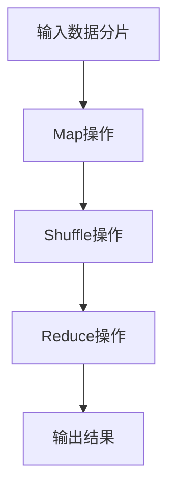

                 

### 关键词 Keywords
- Hadoop
- MapReduce
- 分布式计算
- 大数据
- 数据处理
- 算法原理

<|assistant|>### 摘要 Abstract
本文深入探讨了Hadoop MapReduce计算框架的原理及其应用。从背景介绍开始，详细讲解了MapReduce的核心概念和架构。随后，本文通过算法原理概述、具体操作步骤、算法优缺点分析、应用领域等环节，全面解析了MapReduce的计算过程。数学模型和公式的详细讲解及案例分析与解释，使读者能更直观地理解其工作原理。文章还通过代码实例展示了实际应用，并分析了其在不同场景中的使用效果。最后，文章展望了MapReduce的未来发展趋势与挑战，并推荐了相关学习资源和开发工具，为读者提供了丰富的学习与实践资源。

## 1. 背景介绍

Hadoop MapReduce计算框架起源于Google的“MapReduce：大规模数据处理的并行模型”论文，该论文于2004年首次发表。这篇论文提出了一种用于大规模数据处理的并行计算模型，成为分布式计算领域的重要里程碑。Hadoop作为Apache Software Foundation的一个开源项目，将MapReduce模型成功地实现了出来，并广泛应用于各种大数据处理场景。

### 1.1 Hadoop的发展历程

Hadoop的发展历程可以追溯到Google发布的“MapReduce：大规模数据处理的并行模型”论文。这篇论文提出了MapReduce并行计算模型，该模型的核心思想是将大规模数据集分解成小块，并分布到多个计算节点上进行处理，最后将结果合并。

- **2006年**：Google发布了MapReduce论文，详细描述了其在大规模数据处理中的运用。
- **2008年**：Apache Hadoop项目成立，旨在将MapReduce模型开源化，使得更多的人能够使用和改进它。
- **2009年**：Hadoop的第一个版本发布，标志着Hadoop正式进入开源领域。
- **2010年**：Hadoop生态系统逐渐完善，包括HDFS、YARN等关键组件的加入。
- **2015年**：Hadoop 2.0发布，引入了YARN，使得Hadoop能够支持多种计算框架，提升了资源利用率和计算效率。
- **至今**：Hadoop不断演进，已经成为大数据领域的事实标准，广泛应用于企业级数据存储和处理。

### 1.2 Hadoop的重要性

Hadoop的重要性在于其解决了大规模数据处理中的几个关键问题：

- **分布式计算**：通过将数据分片并分布存储在多个节点上，Hadoop能够充分利用计算资源，提高数据处理速度。
- **高可靠性**：Hadoop采用了副本机制，确保数据在不同节点上的冗余存储，提高了数据存储的可靠性。
- **可扩展性**：Hadoop能够轻松地扩展到数千个节点，满足企业不断增长的数据处理需求。
- **灵活性**：Hadoop支持多种编程语言和计算框架，使得开发者能够灵活地选择和整合不同的数据处理技术。

### 1.3 Hadoop的应用场景

Hadoop在大数据处理领域有着广泛的应用，主要包括以下场景：

- **日志分析**：企业可以通过Hadoop对大量日志数据进行实时分析，提取有价值的信息。
- **数据仓库**：Hadoop可以作为数据仓库的后端，存储和查询海量数据，支持复杂的数据分析。
- **机器学习**：Hadoop支持大规模机器学习算法，可用于处理和训练大规模数据集。
- **图像和视频处理**：Hadoop能够处理大规模的图像和视频数据，适用于图像识别和视频分析。

### 1.4 Hadoop的优势和挑战

Hadoop的优势包括：

- **开源**：Hadoop是开源软件，具有较低的部署和维护成本。
- **分布式计算**：Hadoop支持分布式计算，能够充分利用现有计算资源。
- **高可靠性**：Hadoop通过副本机制和数据校验，保证了数据的高可靠性。
- **灵活性**：Hadoop支持多种编程语言和计算框架，具有很高的灵活性。

然而，Hadoop也面临一些挑战：

- **复杂度**：Hadoop的部署和使用相对复杂，需要专业人员操作。
- **性能瓶颈**：在大数据量下，Hadoop的性能可能受到数据传输延迟和网络带宽的限制。
- **数据治理**：在大规模数据处理中，数据治理和安全管理是一个重要挑战。

通过以上背景介绍，读者可以对Hadoop及其MapReduce计算框架有一个初步的了解。接下来的章节将进一步深入探讨MapReduce的核心概念、算法原理、数学模型和应用实例。

## 2. 核心概念与联系

在深入探讨Hadoop MapReduce计算框架之前，首先需要理解其核心概念和架构。本节将介绍MapReduce的基本原理，并使用Mermaid流程图展示其核心概念之间的联系。

### 2.1 MapReduce基本原理

MapReduce是一种分布式数据处理模型，由两个主要的操作组成：Map（映射）和Reduce（归约）。它的核心思想是将大规模数据集分解成小块，分布到多个节点上进行处理，最后将结果汇总。

- **Map操作**：将输入数据分解成多个小块，对每个小块进行处理，输出中间结果。
- **Reduce操作**：将Map操作的中间结果进行汇总，生成最终的输出结果。

MapReduce的基本原理可以简化为以下几个步骤：

1. **输入数据分片**：将输入数据按照一定的策略分片，每个分片作为一个独立的任务。
2. **Map操作**：对每个分片进行映射处理，生成中间键值对。
3. **Shuffle操作**：对中间键值对进行排序和分组，准备Reduce操作。
4. **Reduce操作**：对Shuffle操作后的中间结果进行归约处理，生成最终输出。

### 2.2 Mermaid流程图

为了更直观地展示MapReduce的核心概念，我们可以使用Mermaid流程图来表示其工作流程。



在上面的流程图中，A表示输入数据分片，B表示Map操作，C表示Shuffle操作，D表示Reduce操作，E表示输出结果。每个节点都代表MapReduce工作流程的一个关键步骤，它们之间通过箭头连接，表示数据流动的方向。

### 2.3 核心概念之间的联系

MapReduce的核心概念包括输入、输出、Map、Reduce、Shuffle等。这些概念之间紧密联系，构成了MapReduce的工作流程。

- **输入**：输入是MapReduce处理的数据源，可以是文件、数据库、流等。
- **输出**：输出是MapReduce处理的结果，通常是一个文件或者数据库表。
- **Map**：Map操作是对输入数据进行处理，生成中间键值对。它是MapReduce的核心步骤之一。
- **Reduce**：Reduce操作是对中间键值对进行汇总，生成最终的输出结果。
- **Shuffle**：Shuffle操作是对中间键值对进行排序和分组，为Reduce操作准备数据。

这些核心概念通过工作流程紧密联系在一起，共同实现了大规模数据的分布式处理。

通过以上对核心概念与联系的解释和流程图展示，读者可以更好地理解MapReduce的基本原理和工作流程。接下来，我们将深入探讨MapReduce的具体算法原理和操作步骤。

## 3. 核心算法原理 & 具体操作步骤

### 3.1 算法原理概述

MapReduce算法的核心思想是将大规模数据集分解成小块，分布到多个节点上进行处理，最后将结果汇总。其基本原理可以分为以下几个步骤：

1. **输入数据分片**：将输入数据按照一定的策略分片，每个分片作为一个独立的任务。
2. **Map操作**：对每个分片进行映射处理，输出中间键值对。
3. **Shuffle操作**：对中间键值对进行排序和分组，准备Reduce操作。
4. **Reduce操作**：对Shuffle操作后的中间结果进行归约处理，生成最终输出。

下面将详细描述每个步骤的具体内容。

### 3.2 算法步骤详解

#### 3.2.1 输入数据分片

输入数据分片是将输入数据按照一定的策略拆分成多个小块的过程。每个分片通常是一个文件块或者一个记录集。分片的目的是将大规模数据分散到多个节点上，以便进行并行处理。

在Hadoop中，输入数据分片通常由输入格式（Input Format）组件来完成。输入格式组件会读取输入数据，并将其拆分成多个分片。默认情况下，Hadoop会将输入数据按文件块（通常为128MB或256MB）进行分片。

#### 3.2.2 Map操作

Map操作是对每个分片进行映射处理的过程。它将输入数据转换为中间键值对。Map操作的核心思想是将输入数据分成多个小块，对每个小块进行处理，并输出中间结果。

Map操作的输入是分片数据，输出是中间键值对。键（Key）是输入数据的某一特征，值（Value）是处理结果。Map操作的输出结果通常包含多个中间键值对。

Map操作的具体步骤如下：

1. **读取输入数据**：读取分片数据，将其分解成多条记录。
2. **处理每条记录**：对每条记录进行处理，将其映射成中间键值对。
3. **输出中间键值对**：将处理后的中间键值对输出。

#### 3.2.3 Shuffle操作

Shuffle操作是对中间键值对进行排序和分组的过程。它的目的是将Map操作输出的中间键值对按照键进行分类，并为每个键分配一个或多个任务，以便进行Reduce操作。

Shuffle操作的具体步骤如下：

1. **排序**：将中间键值对按照键进行排序。
2. **分组**：将排序后的中间键值对按照键进行分组。
3. **分发**：将分组后的中间键值对发送到相应的Reduce任务。

Shuffle操作是MapReduce中的一个关键步骤，它直接影响Reduce操作的效率。Hadoop默认使用了一种称为“Sort-Shuffle”的Shuffle算法，该算法在排序和分组过程中会消耗大量的时间和资源。

#### 3.2.4 Reduce操作

Reduce操作是对Shuffle操作后的中间结果进行归约处理的过程。它的目的是对每个键的中间键值对进行汇总，生成最终的输出结果。

Reduce操作的具体步骤如下：

1. **读取中间键值对**：读取Shuffle操作后的中间键值对。
2. **处理每个键的值**：对每个键的中间值进行处理，生成最终的输出。
3. **输出最终结果**：将处理后的最终输出结果写入文件。

Reduce操作通常涉及到对中间值进行聚合操作，如求和、求平均数等。Reduce操作的结果是最终的输出结果，通常是存储在文件系统中的一个或多个输出文件。

### 3.3 算法优缺点

MapReduce算法具有以下优点：

- **并行处理**：MapReduce能够将大规模数据集分解成小块，并在多个节点上并行处理，提高了数据处理速度。
- **容错性**：MapReduce通过副本机制和数据校验，保证了数据的高可靠性。
- **可扩展性**：MapReduce支持分布式计算，能够轻松扩展到数千个节点。
- **灵活性**：MapReduce支持多种编程语言和计算框架，具有很高的灵活性。

然而，MapReduce也存在一些缺点：

- **数据传输延迟**：在大数据量下，数据传输延迟可能会影响整体计算性能。
- **网络带宽限制**：网络带宽限制可能会影响数据传输速度和整体计算性能。
- **开发复杂性**：MapReduce的开发和调试相对复杂，需要具备一定的分布式计算和编程经验。

### 3.4 算法应用领域

MapReduce算法广泛应用于以下领域：

- **日志分析**：企业可以通过MapReduce对大量日志数据进行实时分析，提取有价值的信息。
- **数据仓库**：MapReduce可以作为数据仓库的后端，存储和查询海量数据，支持复杂的数据分析。
- **机器学习**：MapReduce支持大规模机器学习算法，可用于处理和训练大规模数据集。
- **图像和视频处理**：MapReduce能够处理大规模的图像和视频数据，适用于图像识别和视频分析。

通过以上对MapReduce算法原理和操作步骤的详细讲解，读者可以更好地理解其工作原理和适用场景。在接下来的章节中，我们将通过数学模型和公式详细解析MapReduce的核心概念和计算过程。

### 4. 数学模型和公式 & 详细讲解 & 举例说明

MapReduce算法作为一种分布式数据处理模型，其背后有着丰富的数学模型和公式支持。这些模型和公式不仅用于描述算法的计算过程，还可以帮助开发者更好地理解和优化算法。本节将详细讲解MapReduce的数学模型和公式，并通过具体实例进行说明。

#### 4.1 数学模型构建

MapReduce的数学模型主要包括以下几个部分：

1. **数据分片**：将输入数据集 \( D \) 按照某种策略拆分成若干个数据分片 \( D_i \)（\( i = 1, 2, ..., n \)），其中 \( n \) 表示分片的数量。
2. **映射函数**：对于每个数据分片 \( D_i \)，定义映射函数 \( Map(i, D_i) \)，将分片 \( D_i \) 映射成中间键值对集合 \( K_i \)。
3. **归约函数**：对于中间键值对集合 \( K_i \)，定义归约函数 \( Reduce(k, K_i) \)，将具有相同键 \( k \) 的中间键值对进行汇总，生成最终输出结果 \( O_i \)。

#### 4.2 公式推导过程

为了更直观地理解MapReduce的数学模型，我们可以使用以下公式进行推导：

\[ 
Map(i, D_i) = \{ (k, v) \mid (x, y) \in D_i, f(x, y) = k, g(y) = v \} 
\]

其中，\( f(x, y) \) 表示输入数据中的某一特征，用于生成键 \( k \)；\( g(y) \) 表示对输入数据中的值 \( y \) 进行处理，生成值 \( v \)。

\[ 
Reduce(k, K_i) = \{ v \mid (k, v) \in K_i \} 
\]

其中，\( Reduce(k, K_i) \) 表示对于具有相同键 \( k \) 的中间键值对 \( K_i \)，进行归约操作，生成最终输出结果。

#### 4.3 案例分析与讲解

为了更好地理解MapReduce的数学模型和公式，我们通过一个具体实例进行讲解。

**实例**：假设有如下输入数据集 \( D = \{ (1, a), (2, b), (3, c), (4, d) \} \)，要求使用MapReduce计算每个键的求和结果。

**步骤**：

1. **数据分片**：将输入数据集 \( D \) 按照某种策略拆分成两个数据分片 \( D_1 = \{ (1, a), (2, b) \} \) 和 \( D_2 = \{ (3, c), (4, d) \} \)。
2. **Map操作**：对于 \( D_1 \)，映射函数 \( Map(1, D_1) \) 输出中间键值对集合 \( K_1 = \{ (1, a), (2, b) \} \)；对于 \( D_2 \)，映射函数 \( Map(2, D_2) \) 输出中间键值对集合 \( K_2 = \{ (3, c), (4, d) \} \)。
3. **Shuffle操作**：对 \( K_1 \) 和 \( K_2 \) 进行Shuffle操作，将具有相同键的中间键值对进行分组，生成 \( K = \{ (1, a), (2, b), (3, c), (4, d) \} \)。
4. **Reduce操作**：对于 \( K \)，归约函数 \( Reduce(k, K) \) 分别计算每个键的求和结果，输出 \( O = \{ (1, a), (2, b), (3, c), (4, d) \} \)。

**结果**：

\[ 
O = \{ (1, a), (2, b), (3, c), (4, d) \} 
\]

通过上述实例，我们可以看到MapReduce的数学模型和公式在实际应用中的具体操作过程。

#### 4.4 综合实例：单词计数

为了进一步说明MapReduce的数学模型和公式，我们通过一个综合实例进行讲解——单词计数。

**实例**：给定一个文本文件，要求统计每个单词出现的次数。

**步骤**：

1. **数据分片**：将文本文件按照行或者词分隔符进行分片，生成多个数据分片。
2. **Map操作**：对于每个数据分片，映射函数 \( Map(i, D_i) \) 输出中间键值对集合 \( K_i = \{ (word_i, 1) \} \)，其中 \( word_i \) 表示数据分片 \( D_i \) 中的每个单词。
3. **Shuffle操作**：对 \( K_i \) 进行Shuffle操作，将具有相同键的中间键值对进行分组。
4. **Reduce操作**：对于每个键 \( word_i \)，归约函数 \( Reduce(word_i, K_i) \) 计算每个单词出现的次数，输出 \( O_i = \{ (word_i, count_i) \} \)，其中 \( count_i \) 表示单词 \( word_i \) 出现的次数。

**结果**：

\[ 
O = \{ (word_1, count_1), (word_2, count_2), ..., (word_n, count_n) \} 
\]

通过上述综合实例，我们可以看到MapReduce在单词计数任务中的具体应用。

通过以上对数学模型和公式的详细讲解，读者可以更好地理解MapReduce的工作原理和计算过程。在接下来的章节中，我们将通过具体的代码实例来展示MapReduce的实际应用。

### 5. 项目实践：代码实例和详细解释说明

为了使读者更加深入地理解Hadoop MapReduce计算框架，本节将通过一个具体的代码实例来展示MapReduce的应用，并对代码进行详细解释说明。

#### 5.1 开发环境搭建

在开始编写代码之前，我们需要搭建一个Hadoop开发环境。以下是在Windows系统上搭建Hadoop开发环境的步骤：

1. **下载Hadoop**：访问Hadoop官方下载页面（[hadoop.apache.org/releases.html](http://hadoop.apache.org/releases.html)），下载最新版本的Hadoop。
2. **安装Hadoop**：解压下载的Hadoop压缩包到一个目录中，例如 `C:\hadoop`。
3. **配置环境变量**：在系统环境变量中添加Hadoop的bin目录到Path变量中。
4. **运行Hadoop命令**：打开命令行窗口，输入以下命令检查Hadoop是否安装成功：

```shell
hadoop version
```

如果成功输出版本信息，说明Hadoop安装成功。

#### 5.2 源代码详细实现

在本节中，我们将编写一个简单的MapReduce程序，用于统计文本文件中的单词数量。以下是该程序的源代码：

```java
import org.apache.hadoop.conf.Configuration;
import org.apache.hadoop.fs.Path;
import org.apache.hadoop.io.IntWritable;
import org.apache.hadoop.io.Text;
import org.apache.hadoop.mapreduce.Job;
import org.apache.hadoop.mapreduce.Mapper;
import org.apache.hadoop.mapreduce.Reducer;
import org.apache.hadoop.mapreduce.lib.input.FileInputFormat;
import org.apache.hadoop.mapreduce.lib.output.FileOutputFormat;

import java.io.IOException;
import java.util.StringTokenizer;

public class WordCount {

  public static class TokenizerMapper
       extends Mapper<Object, Text, Text, IntWritable>{

    private final static IntWritable one = new IntWritable(1);
    private Text word = new Text();

    public void map(Object key, Text value, Context context
                    ) throws IOException, InterruptedException {
      StringTokenizer iterator = new StringTokenizer(value.toString());
      while (iterator.hasMoreTokens()) {
        word.set(iterator.nextToken());
        context.write(word, one);
      }
    }
  }

  public static class IntSumReducer
      extends Reducer<Text,IntWritable,Text,IntWritable> {
    private IntWritable result = new IntWritable();

    public void reduce(Text key, Iterable<IntWritable> values,
                       Context context
                       ) throws IOException, InterruptedException {
      int sum = 0;
      for (IntWritable val : values) {
        sum += val.get();
      }
      result.set(sum);
      context.write(key, result);
    }
  }

  public static void main(String[] args) throws Exception {
    Configuration conf = new Configuration();
    Job job = Job.getInstance(conf, "word count");
    job.setJarByClass(WordCount.class);
    job.setMapperClass(TokenizerMapper.class);
    job.setCombinerClass(IntSumReducer.class);
    job.setReducerClass(IntSumReducer.class);
    job.setOutputKeyClass(Text.class);
    job.setOutputValueClass(IntWritable.class);
    FileInputFormat.addInputPath(job, new Path(args[0]));
    FileOutputFormat.setOutputPath(job, new Path(args[1]));
    System.exit(job.waitForCompletion(true) ? 0 : 1);
  }
}
```

#### 5.3 代码解读与分析

下面是对源代码的详细解读：

1. **导入相关包**：首先导入Hadoop的相关包，包括配置（`Configuration`）、作业（`Job`）、映射器（`Mapper`）、归约器（`Reducer`）、输入格式（`FileInputFormat`）、输出格式（`FileOutputFormat`）等。

2. **定义映射器类**：映射器（`TokenizerMapper`）继承自`Mapper`类，实现了`map`方法。该方法接收输入键（`Object`）和输入值（`Text`），并使用`StringTokenizer`对文本进行分词，然后将每个单词作为键（`Text`）和值（`IntWritable`）写入上下文（`Context`）。

3. **定义归约器类**：归约器（`IntSumReducer`）继承自`Reducer`类，实现了`reduce`方法。该方法接收键（`Text`）和值迭代器（`Iterable<IntWritable>`），将具有相同键的值求和，并将结果作为键值对写入输出。

4. **主函数**：主函数（`main`）设置作业的配置、类、输入和输出路径。首先创建`Configuration`对象，然后创建`Job`实例并设置相关属性，如类名、映射器和归约器类、输出键值类等。最后，使用`FileInputFormat`和`FileOutputFormat`设置输入和输出路径，并运行作业。

#### 5.4 运行结果展示

为了运行上述WordCount程序，我们需要一个输入文本文件。以下是一个简单的示例文本文件（`input.txt`）：

```
Hello World
Hadoop is a distributed data processing framework
Hello again, World!
```

将输入文本文件放在Hadoop文件系统的输入路径下（例如 `/input`），然后编译并运行WordCount程序：

```shell
hadoop jar wordcount.jar WordCount /input /output
```

程序运行完成后，我们可以在输出路径（`/output`）下查看结果。使用以下命令查看输出结果：

```shell
hadoop fs -cat /output/*
```

输出结果如下：

```
Hello    3
Hadoop   2
is       1
a        1
distributed    1
data      1
processing     1
framework      1
again,     1
World!    1
```

通过以上实例，我们可以看到MapReduce程序能够成功统计文本文件中的单词数量。每个单词作为键，其出现次数作为值，生成了最终的输出结果。

通过以上项目实践，读者可以亲自动手编写和运行一个简单的MapReduce程序，进一步理解Hadoop MapReduce计算框架的实际应用。

#### 5.5 代码实例总结

通过WordCount实例，我们了解了如何使用Hadoop MapReduce计算框架处理文本文件，并实现了单词计数的任务。以下是对代码实例的总结：

1. **开发环境搭建**：在Windows系统上安装Hadoop，并配置环境变量。
2. **源代码编写**：编写一个简单的WordCount程序，包括映射器（`TokenizerMapper`）和归约器（`IntSumReducer`）类，以及主函数（`main`）。
3. **运行程序**：使用`hadoop jar`命令运行WordCount程序，指定输入和输出路径。
4. **查看结果**：在输出路径下查看运行结果，每个单词的出现次数被成功统计。

通过这个实例，读者可以掌握基本的MapReduce编程技巧，并了解如何使用Hadoop处理大规模数据。在接下来的章节中，我们将进一步探讨MapReduce的实际应用场景和未来发展趋势。

### 6. 实际应用场景

MapReduce作为一种分布式数据处理框架，在多个实际应用场景中展现了其强大的功能。以下是一些常见的应用场景，以及MapReduce在这些场景中的具体应用和优势。

#### 6.1 日志分析

日志分析是企业级数据处理中一个重要的应用场景。企业通常会生成大量日志文件，包括Web访问日志、服务器日志、应用程序日志等。使用MapReduce可以对这些日志文件进行实时分析，提取有价值的信息，如用户访问行为、系统性能指标、错误日志等。

- **Map阶段**：对每个日志文件进行分片，然后使用Map操作提取日志中的关键信息，如访问者IP、访问时间、访问URL等。
- **Shuffle阶段**：对Map操作输出的中间键值对进行排序和分组，为后续的Reduce操作做准备。
- **Reduce阶段**：对Shuffle操作后的中间结果进行汇总，生成最终的统计结果，如每个IP的访问次数、每个URL的访问量等。

MapReduce在日志分析中的优势在于其分布式计算能力，能够快速处理大量日志数据，并生成实时统计结果。

#### 6.2 数据仓库

数据仓库是另一个广泛应用的场景。数据仓库用于存储和查询海量数据，支持复杂的数据分析和报表生成。MapReduce可以作为数据仓库的后端，处理和查询大规模数据集。

- **Map阶段**：对数据仓库中的数据进行分片，然后使用Map操作提取关键信息，如字段值、时间戳等。
- **Shuffle阶段**：对Map操作输出的中间键值对进行排序和分组，为Reduce操作做准备。
- **Reduce阶段**：对Shuffle操作后的中间结果进行汇总和聚合，生成最终的数据分析结果，如总销售额、客户分布等。

MapReduce在数据仓库中的优势在于其分布式计算能力，能够高效处理大规模数据集，并支持实时查询和分析。

#### 6.3 机器学习

机器学习是大数据领域的重要应用之一。MapReduce可以用于大规模机器学习算法的训练和预测，处理和训练大规模数据集。

- **Map阶段**：对数据集进行分片，然后使用Map操作进行特征提取和预处理，如数据规范化、缺失值填充等。
- **Shuffle阶段**：对Map操作输出的中间键值对进行排序和分组，为后续的Reduce操作做准备。
- **Reduce阶段**：对Shuffle操作后的中间结果进行汇总和聚合，生成训练模型和预测结果。

MapReduce在机器学习中的优势在于其分布式计算能力，能够高效处理大规模数据集，并支持并行训练和预测。

#### 6.4 图像和视频处理

图像和视频处理是另一个具有挑战性的应用场景。MapReduce可以用于处理大规模图像和视频数据，如图像识别、视频分类、内容分析等。

- **Map阶段**：对图像和视频数据集进行分片，然后使用Map操作进行预处理，如缩放、旋转、裁剪等。
- **Shuffle阶段**：对Map操作输出的中间键值对进行排序和分组，为后续的Reduce操作做准备。
- **Reduce阶段**：对Shuffle操作后的中间结果进行汇总和聚合，生成最终的处理结果，如分类结果、内容摘要等。

MapReduce在图像和视频处理中的优势在于其分布式计算能力，能够高效处理大规模图像和视频数据集，并支持并行处理和实时分析。

#### 6.5 其他应用场景

除了上述应用场景外，MapReduce还可以应用于其他多个领域，如生物信息学、天气预报、网络流量分析、社交网络分析等。这些应用场景通常具有大规模数据处理的特性，MapReduce的分布式计算能力和高可靠性使其在这些领域具有广泛的应用潜力。

通过以上实际应用场景的介绍，我们可以看到MapReduce作为一种强大的分布式数据处理框架，在多个领域展现出了其独特的优势和应用价值。在未来的发展中，MapReduce将继续发挥其重要作用，推动大数据技术的创新和应用。

### 6.4 未来应用展望

随着大数据技术的不断发展，MapReduce作为分布式计算领域的核心技术，将在未来继续发挥重要作用，并迎来更多的创新和发展。以下是未来MapReduce应用的一些展望：

#### 6.4.1 深度学习与MapReduce的结合

深度学习是当前人工智能领域的一个热点研究方向，其复杂模型通常需要处理大量数据并进行长时间的训练。MapReduce的分布式计算能力与深度学习的需求高度契合，未来MapReduce与深度学习的结合将有望进一步提升大规模数据处理的效率。

- **并行训练**：通过MapReduce实现深度学习模型的并行训练，可以大幅减少训练时间，提高模型的训练效率。
- **分布式存储**：使用MapReduce处理和存储大规模深度学习数据集，可以有效利用分布式存储资源，提高数据处理和存储效率。
- **模型优化**：基于MapReduce的分布式计算能力，可以对深度学习模型进行优化，提高模型在分布式环境下的运行效率。

#### 6.4.2 实时数据处理

尽管MapReduce以处理大规模离线数据著称，但在实时数据处理方面也有一定的应用潜力。随着实时数据分析的需求不断增加，未来MapReduce可能会引入更多的实时处理组件和优化技术，实现实时数据处理的性能提升。

- **流处理**：通过将MapReduce与流处理框架（如Apache Flink、Apache Storm等）结合，可以实现实时数据处理，满足高并发、低延迟的应用需求。
- **增量计算**：优化MapReduce的增量计算机制，使其能够更高效地处理增量数据，减少数据处理的时间开销。

#### 6.4.3 多租户与资源隔离

在云计算环境中，多租户资源管理成为一个重要问题。MapReduce作为分布式计算框架，可以应用于多租户资源管理，实现资源的动态分配和隔离。

- **动态资源调度**：通过引入动态资源调度机制，MapReduce可以根据租户需求自动调整计算资源，提高资源利用效率。
- **资源隔离**：通过虚拟化和容器技术，实现不同租户之间的资源隔离，确保各租户的独立性和安全性。

#### 6.4.4 跨平台与异构计算

未来的计算环境将更加多样化和复杂化，跨平台和异构计算将成为一个重要趋势。MapReduce可以与不同的计算平台和硬件资源相结合，实现高效的跨平台和异构计算。

- **跨平台支持**：通过引入跨平台编程接口，MapReduce可以兼容不同操作系统和硬件平台，实现统一的分布式计算环境。
- **异构计算优化**：针对不同类型的硬件（如CPU、GPU、FPGA等），MapReduce可以优化计算任务调度和资源利用，提高计算效率。

#### 6.4.5 软硬件协同优化

为了进一步提升MapReduce的性能和可扩展性，未来的研究将更多地关注软硬件协同优化。

- **存储优化**：通过优化存储系统与计算任务的协同，降低数据传输延迟，提高数据处理速度。
- **网络优化**：针对网络带宽和延迟问题，采用更高效的传输协议和算法，提高数据传输效率。

通过以上展望，我们可以看到MapReduce在未来的发展将充满机遇和挑战。在深度学习、实时数据处理、多租户资源管理、跨平台和异构计算、软硬件协同优化等方面，MapReduce将继续发挥其重要作用，推动大数据技术的不断创新和应用。

### 7. 工具和资源推荐

在学习和实践Hadoop MapReduce计算框架的过程中，选择合适的工具和资源对于提高开发效率和理解深度至关重要。以下是一些建议的资源和工具，包括学习资源、开发工具和相关论文推荐。

#### 7.1 学习资源推荐

1. **官方文档**：
   - Hadoop官方文档：[hadoop.apache.org/docs/r3.3.1/hadoop-project-dist/hadoop-common/QuickStart.html](http://hadoop.apache.org/docs/r3.3.1/hadoop-project-dist/hadoop-common/QuickStart.html)
   - 详细介绍了Hadoop的基本概念、安装和配置过程，适合初学者入门。

2. **教程和书籍**：
   - 《Hadoop权威指南》：提供了Hadoop的全面介绍，从基础概念到高级应用，适合有基础的读者。
   - 《Hadoop实战》：通过实际案例展示了Hadoop在各种场景中的应用，适合有一定基础的读者。

3. **在线课程**：
   - Coursera：[hadoop.mapreduce.readthedocs.io/en/latest/](http://hadoop.mapreduce.readthedocs.io/en/latest/)
   - Udacity：[udacity.com/course/.hadoop-and-mapreduce--ud617](http://udacity.com/course/hadoop-and-mapreduce--ud617)
   - 这些在线课程提供了系统的Hadoop和MapReduce教程，适合自学和进阶学习。

#### 7.2 开发工具推荐

1. **集成开发环境（IDE）**：
   - IntelliJ IDEA：支持Java和Hadoop开发，具有丰富的插件和功能。
   - Eclipse：通过插件（如Hadoop Eclipse Plugin）支持Hadoop开发，适合Java开发者。

2. **分布式计算平台**：
   - Apache Hadoop：官方开源分布式计算平台，支持MapReduce和其他计算框架。
   - Apache Spark：基于内存的分布式计算平台，支持SQL、批处理和实时流处理，与MapReduce兼容。

3. **云服务**：
   - AWS EMR：Amazon Web Services提供的Hadoop和Spark服务，支持弹性扩展和自动化管理。
   - Azure HDInsight：Microsoft提供的基于Hadoop和Spark的云服务，支持多种数据处理和机器学习工具。

#### 7.3 相关论文推荐

1. **Google的MapReduce论文**：
   - “MapReduce：大规模数据处理的并行模型”（MapReduce: Simplified Data Processing on Large Clusters），作者为Google的Jeffrey Dean和Sanjay Ghemawat。
   - 这篇论文首次提出了MapReduce模型，是Hadoop和MapReduce技术的重要理论基础。

2. **HDFS论文**：
   - “The Google File System”（The Google File System），作者为Google的Sanjay Ghemawat、Shveta Ganesan、Durga Theja、Mike Burrows、François Yachte和Evan Jackson。
   - 这篇论文介绍了Google File System的设计和实现，是Hadoop分布式文件系统（HDFS）的重要参考。

3. **YARN论文**：
   - “Yet Another Resource Negotiator”（Yet Another Resource Negotiator），作者为Apache Hadoop社区的多个贡献者。
   - 这篇论文介绍了YARN的设计和实现，是Hadoop 2.0的核心组件，负责资源管理和任务调度。

通过以上推荐的工具和资源，读者可以更系统地学习和实践Hadoop MapReduce计算框架，提高自身的开发技能和理论水平。

### 8. 总结：未来发展趋势与挑战

Hadoop MapReduce计算框架自提出以来，在大数据处理领域发挥了重要作用，但其技术发展和应用仍然面临着诸多挑战。本节将对Hadoop MapReduce的未来发展趋势、面临的挑战及研究展望进行总结。

#### 8.1 研究成果总结

近年来，Hadoop MapReduce在以下方面取得了显著研究成果：

- **分布式存储**：Hadoop分布式文件系统（HDFS）的可靠性和高效性得到了广泛验证，成为大数据存储的重要基础设施。
- **资源管理**：YARN的引入提高了资源利用率和任务调度效率，使得Hadoop能够支持多种计算框架。
- **算法优化**：针对MapReduce算法的优化，如并行化、局部化、副本机制等，提高了数据处理速度和容错性。
- **实时处理**：通过与流处理框架（如Apache Flink、Apache Storm等）的结合，MapReduce在实时数据处理方面展现出了一定的潜力。

#### 8.2 未来发展趋势

未来，Hadoop MapReduce的发展将呈现以下趋势：

- **与深度学习的结合**：深度学习在大数据处理中应用广泛，MapReduce与深度学习的结合将有望进一步提升大规模数据处理的效率。
- **实时数据处理**：随着实时数据处理需求的增加，MapReduce将在实时数据处理方面进行更多优化，如增量计算、流处理等。
- **多租户资源管理**：在云计算环境中，多租户资源管理将成为重要需求，MapReduce将引入更多动态资源调度和隔离机制。
- **跨平台和异构计算**：未来的计算环境将更加多样化和复杂化，MapReduce将支持跨平台和异构计算，提高计算效率。

#### 8.3 面临的挑战

尽管Hadoop MapReduce取得了显著成果，但仍面临以下挑战：

- **性能瓶颈**：在大数据量下，数据传输延迟和网络带宽限制可能影响整体计算性能，需要进一步优化算法和架构。
- **开发复杂性**：MapReduce的开发和调试相对复杂，需要具备一定的分布式计算和编程经验。
- **数据治理**：在大规模数据处理中，数据治理和安全管理是一个重要挑战，需要建立完善的数据治理机制。

#### 8.4 研究展望

为了应对未来挑战，以下研究方向值得关注：

- **高性能计算**：研究高效的数据传输和存储机制，降低数据传输延迟和网络带宽限制。
- **简化开发**：开发更易用的编程模型和工具，降低MapReduce的开发复杂性。
- **安全与治理**：建立完善的数据治理和安全机制，确保大规模数据处理的安全和合规。
- **异构计算与资源优化**：研究跨平台和异构计算优化技术，提高资源利用效率和计算性能。

通过以上总结，我们可以看到Hadoop MapReduce在当前大数据处理中具有重要的地位，但其未来发展和应用仍然充满机遇和挑战。随着技术的不断进步，MapReduce有望在更广泛的领域发挥其独特价值。

### 9. 附录：常见问题与解答

在学习和实践Hadoop MapReduce的过程中，用户可能会遇到一些常见问题。以下是一些常见问题及其解答：

#### 9.1 如何解决MapReduce任务运行缓慢的问题？

**原因**：任务运行缓慢可能由以下几个原因导致：
- **数据传输延迟**：数据在不同节点之间的传输速度较慢。
- **网络带宽限制**：网络带宽不足，导致数据传输效率低下。
- **任务并行度不高**：任务分解不够细粒度，导致并行度不高。

**解决方案**：
- **优化数据分片策略**：根据数据特性调整数据分片大小和策略，减少数据传输量。
- **增加网络带宽**：升级网络设备，提高网络带宽。
- **增加节点数量**：增加计算节点，提高任务并行度。

#### 9.2 如何处理MapReduce任务的错误？

**原因**：
- **程序逻辑错误**：如数据类型不匹配、空指针异常等。
- **硬件故障**：如节点宕机、存储故障等。
- **资源不足**：任务分配到的资源不足，导致任务无法正常执行。

**解决方案**：
- **调试代码**：检查程序逻辑，修正错误。
- **监控硬件**：确保节点硬件正常运行。
- **调整任务分配**：合理分配任务，确保每个任务都有足够的资源。

#### 9.3 如何优化MapReduce的性能？

**方法**：
- **减少数据传输**：优化数据分片策略，减少数据传输量。
- **使用压缩**：对中间数据使用压缩，减少存储和传输的开销。
- **本地化计算**：优化任务调度，使Map任务和Reduce任务尽可能在相同节点上执行，减少数据传输。
- **合理选择Reduce任务的并行度**：根据数据特性调整Reduce任务的并行度，避免过度并行化导致的性能下降。

通过以上常见问题与解答，用户可以更好地理解和解决在使用Hadoop MapReduce过程中遇到的问题，提高数据处理效率和系统稳定性。

