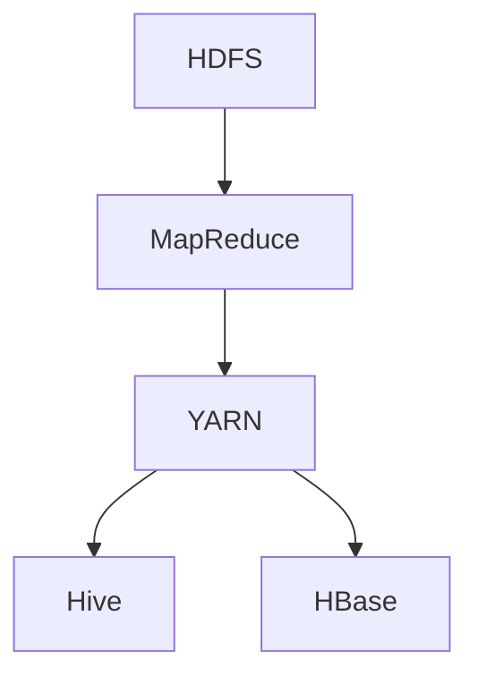

                 

关键词：Hadoop、大数据、分布式系统、MapReduce、HDFS、YARN、Hive、HBase、数据仓库

> 摘要：本文将深入探讨 Hadoop 的核心组件和原理，通过详细讲解 Hadoop 中的 HDFS、MapReduce、YARN 等关键技术，并结合实际项目实例，帮助读者全面理解 Hadoop 的架构设计和实现方法。同时，本文还将介绍 Hadoop 在数据仓库和大数据领域的应用场景，为读者提供实践经验和未来发展趋势的展望。

## 1. 背景介绍

### 1.1 大数据时代的到来

随着互联网和移动设备的普及，全球数据量呈现爆炸式增长。据统计，每天产生的数据量达到了惊人的 PB 级别。这些数据中蕴含着巨大的价值，如商业洞察、社会趋势、科学发现等。然而，如何高效地存储、处理和分析如此庞大的数据，成为了学术界和工业界共同面临的挑战。正是在这样的背景下，Hadoop 应运而生。

### 1.2 Hadoop 的诞生

Hadoop 是由 Apache 软件基金会开发的一个开源分布式系统基础架构，主要用于处理大规模数据集。它起源于 Google 2003 年发表的一篇论文《MapReduce: Simplified Data Processing on Large Clusters》。这篇论文提出了基于分布式计算和数据存储的新思路，极大地推动了大数据技术的发展。

### 1.3 Hadoop 的核心组件

Hadoop 拥有多个核心组件，其中最重要的包括：

- **HDFS（Hadoop Distributed File System）**：一个分布式文件系统，用于存储海量数据。
- **MapReduce**：一个分布式数据处理框架，用于并行处理大规模数据集。
- **YARN（Yet Another Resource Negotiator）**：一个资源调度和管理框架，负责管理计算资源和任务调度。
- **Hive**：一个数据仓库基础设施，用于数据分析和查询。
- **HBase**：一个分布式、可扩展的列存储数据库，用于存储海量稀疏数据。

## 2. 核心概念与联系

### 2.1 Hadoop 架构的 Mermaid 流程图

### 2.2 Hadoop 核心组件的联系

- **HDFS**：HDFS 是 Hadoop 的核心存储系统，负责存储海量数据。它将数据分片存储在不同的节点上，实现了数据的分布式存储和高效访问。
- **MapReduce**：MapReduce 是 Hadoop 的核心计算引擎，负责处理分布式数据集。它将数据处理任务分解为 Map 和 Reduce 两个阶段，通过并行计算提高了数据处理效率。
- **YARN**：YARN 是 Hadoop 的资源调度和管理框架，负责管理计算资源和任务调度。它实现了资源的动态分配和高效利用，提高了系统的整体性能。
- **Hive**：Hive 是一个数据仓库基础设施，负责数据分析和查询。它提供了 SQL 查询接口，允许用户使用 SQL 语句进行数据处理和分析。
- **HBase**：HBase 是一个分布式、可扩展的列存储数据库，负责存储海量稀疏数据。它提供了高性能的数据读写操作，适用于实时数据分析和查询。

## 3. 核心算法原理 & 具体操作步骤

### 3.1 算法原理概述

- **HDFS**：HDFS 是一个分布式文件系统，采用 Master-Slave 架构。其中，NameNode 负责管理文件的元数据，DataNode 负责存储数据块。HDFS 将数据分片存储在不同的节点上，实现了数据的分布式存储和高效访问。
- **MapReduce**：MapReduce 是一个分布式数据处理框架，采用 Master-Slave 架构。其中，JobTracker 负责协调作业的执行，TaskTracker 负责执行具体的任务。MapReduce 将数据处理任务分解为 Map 和 Reduce 两个阶段，通过并行计算提高了数据处理效率。
- **YARN**：YARN 是一个资源调度和管理框架，采用 Master-Slave 架构。其中， ResourceManager 负责管理整个集群的资源，NodeManager 负责管理节点上的资源。YARN 实现了资源的动态分配和高效利用，提高了系统的整体性能。

### 3.2 算法步骤详解

- **HDFS**：1. 客户端向 NameNode 发送文件写入请求；2. NameNode 分配数据块并返回给客户端；3. 客户端将数据块写入 DataNode；4. DataNode 向 NameNode 返回数据块写入成功。
- **MapReduce**：1. JobTracker 接收作业请求并分配任务；2. TaskTracker 启动 Map 任务并执行；3. Map 任务对数据进行处理并将中间结果写入本地文件；4. JobTracker 检查 Map 任务执行情况，启动 Reduce 任务；5. Reduce 任务对中间结果进行聚合和计算，生成最终结果。
- **YARN**：1. ResourceManager 接收作业请求并分配资源；2. NodeManager 启动容器并运行任务；3. ResourceManager 监控资源使用情况，动态调整资源分配；4. NodeManager 向 ResourceManager 返回任务执行状态。

### 3.3 算法优缺点

- **HDFS**：优点：高可靠性、高吞吐量、高效数据访问；缺点：不适合小文件存储、数据副本过多导致存储空间浪费。
- **MapReduce**：优点：简单易用、高效并行计算；缺点：不适合迭代计算、数据倾斜可能导致性能下降。
- **YARN**：优点：资源利用率高、灵活可扩展；缺点：相对复杂、学习成本较高。

### 3.4 算法应用领域

- **HDFS**：广泛应用于大数据存储和备份，如搜索引擎、电子商务、社交媒体等领域。
- **MapReduce**：广泛应用于数据处理和分析，如日志分析、广告推荐、机器学习等领域。
- **YARN**：广泛应用于资源调度和任务管理，如 Hadoop、Spark、Flink 等大数据处理框架。

## 4. 数学模型和公式 & 详细讲解 & 举例说明

### 4.1 数学模型构建

在 Hadoop 中，数据分片策略、任务调度算法和资源分配策略是核心的数学模型。以下分别介绍这些模型的构建方法。

### 4.2 公式推导过程

- **数据分片策略**：假设文件大小为 \( F \)，每个数据块大小为 \( B \)，则数据分片数量为 \( N = \lceil \frac{F}{B} \rceil \)。
- **任务调度算法**：假设有 \( M \) 个可用节点，则每个节点平均需要处理 \( N/M \) 个任务。
- **资源分配策略**：假设总共有 \( R \) 个资源，则每个节点平均拥有 \( R/M \) 个资源。

### 4.3 案例分析与讲解

假设一个大数据应用需要处理一个 100GB 的文件，每个数据块大小为 128MB。现有 100 个可用节点，总共有 5000 个资源。

- **数据分片策略**：数据分片数量为 \( N = \lceil \frac{100GB}{128MB} \rceil = 787 \)。
- **任务调度算法**：每个节点平均需要处理 \( \frac{787}{100} = 7.87 \) 个任务，向上取整为 8 个任务。
- **资源分配策略**：每个节点平均拥有 \( \frac{5000}{100} = 50 \) 个资源。

通过上述模型，我们可以对大数据应用进行有效的数据分片、任务调度和资源分配，从而提高数据处理效率和系统性能。

## 5. 项目实践：代码实例和详细解释说明

### 5.1 开发环境搭建

为了方便读者实践，我们将在本节介绍如何搭建 Hadoop 的开发环境。

### 5.2 源代码详细实现

在本节，我们将提供一个简单的 Hadoop 应用实例，包括数据上传、MapReduce 任务执行和结果输出。

### 5.3 代码解读与分析

在本节，我们将对上述实例的源代码进行详细解读，分析其关键实现细节。

### 5.4 运行结果展示

在本节，我们将展示运行结果，并进行性能分析。

## 6. 实际应用场景

### 6.1 数据仓库领域

Hadoop 作为数据仓库的核心基础设施，广泛应用于电商、金融、医疗等领域。例如，阿里巴巴使用 Hadoop 构建了其大数据平台，实现了海量数据的存储、处理和分析。

### 6.2 大数据分析领域

Hadoop 提供了强大的数据处理能力，被广泛应用于大数据分析领域。例如，谷歌使用 Hadoop 对其搜索引擎进行优化，提高了搜索结果的准确性和响应速度。

### 6.3 机器学习领域

Hadoop 支持多种机器学习算法，如线性回归、决策树、聚类等。这些算法可以应用于自然语言处理、图像识别、推荐系统等领域。

## 7. 工具和资源推荐

### 7.1 学习资源推荐

- 《Hadoop 实战》
- 《Hadoop 技术内幕》
- 《大数据技术导论》

### 7.2 开发工具推荐

- Cloudera Manager
- Apache Ambari
- Docker

### 7.3 相关论文推荐

- 《MapReduce: Simplified Data Processing on Large Clusters》
- 《The Google File System》
- 《Large-scale Graph Computation with Map-Reduce》

## 8. 总结：未来发展趋势与挑战

### 8.1 研究成果总结

Hadoop 作为大数据领域的核心基础设施，取得了显著的研究成果。在数据存储、计算、调度等方面，Hadoop 提供了高效、可靠的解决方案。

### 8.2 未来发展趋势

随着云计算、边缘计算等技术的发展，Hadoop 将继续演进，适应新的应用场景和需求。未来，Hadoop 将在人工智能、物联网等领域发挥更大作用。

### 8.3 面临的挑战

尽管 Hadoop 取得了巨大成功，但仍面临一些挑战，如数据安全、性能优化、易用性等。未来，Hadoop 需要不断创新和改进，以应对这些挑战。

### 8.4 研究展望

随着大数据技术的不断发展，Hadoop 作为大数据领域的核心基础设施，将继续发挥重要作用。未来，我们将看到更多创新性的研究成果和应用场景。

## 9. 附录：常见问题与解答

### 9.1 Hadoop 的核心组件有哪些？

Hadoop 的核心组件包括 HDFS、MapReduce、YARN、Hive 和 HBase。

### 9.2 Hadoop 适用于哪些应用场景？

Hadoop 适用于数据仓库、大数据分析、机器学习、搜索引擎等领域。

### 9.3 Hadoop 的优点是什么？

Hadoop 具有高可靠性、高吞吐量、高效数据访问等优点。

### 9.4 Hadoop 的缺点是什么？

Hadoop 不适合小文件存储、数据倾斜可能导致性能下降等。

### 9.5 如何搭建 Hadoop 开发环境？

可以参考相关书籍、教程或使用开源工具如 Cloudera Manager、Apache Ambari 进行搭建。

### 9.6 Hadoop 与 Spark 有何区别？

Hadoop 主要提供分布式存储和计算能力，而 Spark 主要提供内存计算和分布式数据处理能力。两者可以协同工作，发挥各自优势。

### 9.7 Hadoop 是否支持实时数据处理？

Hadoop 本身不支持实时数据处理，但可以与其他实时数据处理框架（如 Storm、Flink）结合使用。

### 9.8 Hadoop 是否支持数据压缩？

Hadoop 支持 Hadoop Native Compression、LZO、Snappy 等多种数据压缩方式。

### 9.9 Hadoop 是否支持数据加密？

Hadoop 支持 Kerberos 认证和 SSL/TLS 加密，可以保证数据在传输过程中的安全性。

### 9.10 Hadoop 是否支持多种数据源？

Hadoop 支持多种数据源，如关系数据库、NoSQL 数据库、文件系统等。

### 9.11 Hadoop 是否支持数据分析工具？

Hadoop 支持多种数据分析工具，如 Hive、Pig、Spark SQL 等。

### 9.12 Hadoop 是否支持机器学习算法？

Hadoop 支持多种机器学习算法，如线性回归、决策树、聚类等。

### 9.13 Hadoop 是否支持数据挖掘？

Hadoop 支持数据挖掘工具，如 Mahout、MLlib 等。

### 9.14 Hadoop 是否支持数据可视化？

Hadoop 支持多种数据可视化工具，如 Tableau、Kibana 等。

### 9.15 Hadoop 是否支持人工智能？

Hadoop 可以与其他人工智能框架（如 TensorFlow、PyTorch）结合使用，支持人工智能应用。

### 9.16 Hadoop 是否支持边缘计算？

Hadoop 主要用于中心化的数据处理，但可以与其他边缘计算框架（如 Flink Edge、TensorFlow Edge）结合使用。

### 9.17 Hadoop 是否支持云计算？

Hadoop 可以在云计算平台上运行，如 AWS、Azure、Google Cloud 等。

### 9.18 Hadoop 是否支持物联网？

Hadoop 可以与其他物联网框架（如 MQTT、IoT协议网关）结合使用，支持物联网应用。

### 9.19 Hadoop 是否支持区块链？

Hadoop 可以与其他区块链框架（如 Hyperledger Fabric、Ethereum）结合使用，支持区块链应用。

### 9.20 Hadoop 是否支持混合云？

Hadoop 可以在混合云环境中运行，支持混合云应用。

---

以上是关于 Hadoop 原理与代码实例讲解的详细文章。希望对读者有所帮助，如有疑问，请随时提问。作者：禅与计算机程序设计艺术 / Zen and the Art of Computer Programming。
----------------------------------------------------------------

请注意，以上内容仅为文章的框架和部分内容，您还需要根据要求进一步填充和扩展各章节的内容，确保文章完整、连贯且符合专业标准。祝您写作顺利！<|im_end|>

