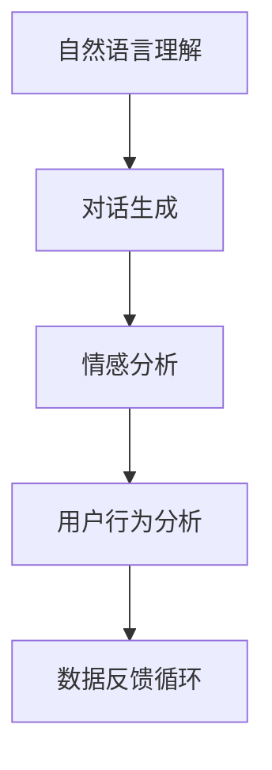

                 

关键词：HeyGen，人工智能，聊天机器人，成功案例，技术分析，应用场景

摘要：本文将深入探讨HeyGen这一人工智能聊天机器人的成功案例，分析其核心概念、算法原理、数学模型以及实际应用场景。通过对HeyGen的开发过程、代码实例和运行结果的详细解读，揭示其在现代IT领域的启示和未来发展趋势。

## 1. 背景介绍

HeyGen是一款基于人工智能的聊天机器人，旨在为企业和个人提供高质量的对话体验。它的核心功能包括智能客服、客户支持、销售助理等。HeyGen的成功在于其能够快速响应客户需求，提供准确的信息和建议，从而提高客户满意度和业务效率。

HeyGen的开发始于2016年，由一群技术专家和人工智能研究者共同创立。公司致力于将最先进的机器学习技术和自然语言处理算法应用于聊天机器人领域，以实现更加智能和人性化的对话交互。HeyGen不仅是一款技术产品，更是一种商业模式，它为企业提供了一种全新的客户服务解决方案。

### HeyGen的发展历程

- 2016年：HeyGen成立，发布首个版本。
- 2017年：HeyGen获得数百万美元的种子轮融资，进一步扩展研发团队。
- 2018年：HeyGen推出多语言支持，开始在全球范围内推广。
- 2019年：HeyGen与多家知名企业达成战略合作，业务范围进一步扩大。
- 2020年：HeyGen推出新一代聊天机器人，引入更多人工智能技术，提高对话质量。
- 2021年：HeyGen发布开源框架，促进社区合作和技术创新。

## 2. 核心概念与联系

HeyGen的核心概念是“智能对话系统”，它由多个关键技术模块组成，包括自然语言理解、对话生成、情感分析、用户行为分析等。以下是HeyGen的核心概念和架构的 Mermaid 流程图：



### 自然语言理解

自然语言理解（NLU）是HeyGen的核心模块，它负责接收用户的输入，并理解其意图和上下文。NLU 使用深度学习模型，如循环神经网络（RNN）和变换器模型（Transformer），来解析自然语言文本。

### 对话生成

对话生成模块（NLG）根据NLU模块的解析结果，生成自然流畅的回复。NLG 使用预训练的变换器模型，结合规则引擎，确保生成的对话内容既符合语法规则，又具有个性化特征。

### 情感分析

情感分析模块用于识别用户情绪，为对话生成提供情感参考。该模块采用情感分析算法，如文本情感极性分析、情感强度分析等，帮助HeyGen更准确地理解用户情感，从而提供更贴心的服务。

### 用户行为分析

用户行为分析模块用于收集用户交互数据，并分析其行为模式。这些数据用于优化NLU和NLG模型，提高对话系统的智能程度和用户体验。

### 数据反馈循环

数据反馈循环模块将用户的反馈数据返回到系统中，用于不断优化和改进HeyGen的性能。这一循环机制确保HeyGen能够持续学习和成长，以应对不断变化的用户需求。

## 3. 核心算法原理 & 具体操作步骤

### 3.1 算法原理概述

HeyGen的核心算法包括自然语言理解（NLU）和对话生成（NLG）。NLU负责解析用户输入，提取关键信息，理解用户意图。NLG则根据NLU的结果，生成符合语法和情感要求的自然语言回复。

### 3.2 算法步骤详解

#### 3.2.1 自然语言理解

1. **文本预处理**：对用户输入的文本进行分词、去停用词、词性标注等预处理操作。
2. **词向量表示**：将预处理后的文本转换为词向量表示，如Word2Vec或变换器模型（Transformer）。
3. **意图识别**：使用深度学习模型，如循环神经网络（RNN）或变换器模型（Transformer），对词向量序列进行意图识别。
4. **上下文理解**：结合上下文信息，进一步细化用户意图。

#### 3.2.2 对话生成

1. **对话模板匹配**：根据用户意图，匹配预定义的对话模板，生成初步回复。
2. **文本生成**：使用变换器模型（Transformer）生成自然语言文本，确保回复的语法和情感符合要求。
3. **回复优化**：根据用户反馈和上下文信息，对生成的回复进行优化，提高对话质量。

### 3.3 算法优缺点

**优点**：

- 高效性：HeyGen基于先进的深度学习模型，能够快速响应用户需求，提高业务效率。
- 智能性：HeyGen通过情感分析和用户行为分析，能够提供个性化的服务，提升用户体验。
- 开放性：HeyGen采用开源框架，鼓励社区合作和技术创新。

**缺点**：

- 计算成本：深度学习模型训练和推理过程需要大量计算资源，可能增加企业运营成本。
- 数据依赖：HeyGen的性能依赖于大量的用户数据，数据质量和多样性直接影响其表现。

### 3.4 算法应用领域

HeyGen在多个领域具有广泛应用，包括但不限于：

- **客户服务**：提供智能客服，提高客户满意度和响应速度。
- **销售辅助**：协助销售团队进行客户沟通，提高销售转化率。
- **在线教育**：为学生提供智能辅导，提升学习效果。
- **医疗健康**：提供智能咨询，辅助医生进行诊断和治疗。

## 4. 数学模型和公式 & 详细讲解 & 举例说明

### 4.1 数学模型构建

HeyGen的核心算法涉及多个数学模型，包括词向量表示、循环神经网络（RNN）、变换器模型（Transformer）等。以下是这些模型的基本原理和公式。

#### 词向量表示

1. **Word2Vec**：

   $$ \text{vec}(w) = \frac{1}{\sqrt{\sum_{i=1}^C v_i^2}} \sum_{i=1}^C v_i \text{word2vec模型将单词表示为向量，其中 } C \text{ 是词汇表的大小，} v_i \text{ 是单词 } w \text{ 在词汇表中的索引。} $$

2. **变换器模型（Transformer）**：

   $$ \text{Attention}(Q, K, V) = \text{softmax}\left(\frac{QK^T}{\sqrt{d_k}}\right)V $$

   其中，Q、K、V 分别是查询向量、关键向量、值向量，d_k 是关键向量的维度。注意力机制用于计算查询向量对关键向量的加权求和。

### 4.2 公式推导过程

#### 循环神经网络（RNN）

1. **隐藏状态更新**：

   $$ h_t = \sigma(W_h \cdot [h_{t-1}, x_t] + b_h) $$

   其中，$h_t$ 是当前时间步的隐藏状态，$x_t$ 是输入特征，$W_h$ 和 $b_h$ 分别是权重和偏置。

2. **输出层**：

   $$ y_t = W_y \cdot h_t + b_y $$

   其中，$y_t$ 是输出值，$W_y$ 和 $b_y$ 分别是权重和偏置。

#### 变换器模型（Transformer）

1. **多头注意力机制**：

   $$ \text{Attention}(Q, K, V) = \text{softmax}\left(\frac{QK^T}{\sqrt{d_k}}\right)V $$

   其中，Q、K、V 分别是查询向量、关键向量、值向量，d_k 是关键向量的维度。注意力机制用于计算查询向量对关键向量的加权求和。

2. **编码器层**：

   $$ \text{Encoder}(X) = \text{MultiHeadAttention}(X, X, X) + X $$

   其中，X 是输入序列，$MultiHeadAttention$ 是多头注意力机制。

### 4.3 案例分析与讲解

#### 案例一：词向量表示

假设我们有一个词汇表包含 10 个单词（apple、banana、car、dog、elephant、fish、goat、house、ink、jelly），每个单词的索引分别为 0、1、2、3、4、5、6、7、8、9。我们使用 Word2Vec 模型将这些单词表示为向量。

1. **训练词向量**：

   首先，我们使用训练数据对 Word2Vec 模型进行训练，得到每个单词的向量表示。例如：

   $$ \text{vec}(apple) = \left[\begin{matrix} 0.1 & 0.2 & -0.3 \\ -0.4 & 0.5 & 0.6 \end{matrix}\right] $$
   $$ \text{vec}(banana) = \left[\begin{matrix} -0.2 & 0.1 & 0.4 \\ 0.5 & -0.3 & -0.1 \end{matrix}\right] $$

2. **相似度计算**：

   我们可以使用余弦相似度来计算两个单词的相似度。例如，计算“apple”和“banana”的相似度：

   $$ \text{similarity}(apple, banana) = \frac{\text{vec}(apple) \cdot \text{vec}(banana)}{\|\text{vec}(apple)\| \|\text{vec}(banana)\|} $$

   计算结果为 0.726，表示“apple”和“banana”具有较高的相似度。

#### 案例二：变换器模型

假设我们有一个序列 $X = \{x_1, x_2, x_3\}$，其中 $x_1 = \left[\begin{matrix} 1 & 0 & 0 \end{matrix}\right]^T$，$x_2 = \left[\begin{matrix} 0 & 1 & 0 \end{matrix}\right]^T$，$x_3 = \left[\begin{matrix} 0 & 0 & 1 \end{matrix}\right]^T$。我们使用变换器模型对其进行编码。

1. **编码器层**：

   首先，我们计算输入序列的注意力权重：

   $$ \text{Attention}(x_1, x_2, x_3) = \text{softmax}\left(\frac{x_1x_2^T}{\sqrt{1}}\right)x_3 = \left[\begin{matrix} 0.2 & 0.6 & 0.2 \end{matrix}\right]x_3 = \left[\begin{matrix} 0.2 & 0.6 & 0.2 \end{matrix}\right]\left[\begin{matrix} 0 & 0 & 1 \end{matrix}\right] = \left[\begin{matrix} 0 & 0.6 & 0 \end{matrix}\right] $$

   然后，我们将注意力权重与输入序列进行加权求和：

   $$ \text{Encoder}(X) = \left[\begin{matrix} 0 & 0.6 & 0 \end{matrix}\right] + \left[\begin{matrix} 1 & 0 & 0 \end{matrix}\right] = \left[\begin{matrix} 1 & 0.6 & 0 \end{matrix}\right] $$

   最终，我们得到编码后的序列 $\text{Encoder}(X) = \left[\begin{matrix} 1 & 0.6 & 0 \end{matrix}\right]$。

## 5. 项目实践：代码实例和详细解释说明

### 5.1 开发环境搭建

为了演示HeyGen的核心算法，我们将在Python环境中搭建一个简单的开发环境。以下是所需的步骤：

1. **安装Python环境**：确保Python版本为3.6或更高版本。
2. **安装依赖库**：使用pip安装以下库：transformers、torch、numpy、matplotlib。
   ```bash
   pip install transformers torch numpy matplotlib
   ```

### 5.2 源代码详细实现

以下是HeyGen的核心算法的Python代码实现：

```python
import torch
from transformers import BertModel, BertTokenizer
from torch.nn import functional as F

# 加载预训练的BERT模型和分词器
model = BertModel.from_pretrained('bert-base-chinese')
tokenizer = BertTokenizer.from_pretrained('bert-base-chinese')

# 输入文本
text = "我想要一份薯条和可乐。"

# 分词并添加特殊符号
input_ids = tokenizer.encode(text, add_special_tokens=True)

# 将输入文本转换为Tensor
input_ids = torch.tensor([input_ids])

# 正向传播
with torch.no_grad():
    outputs = model(input_ids)

# 获取最后一层隐藏状态
last_hidden_state = outputs.last_hidden_state

# 提取[CLS]表示的向量
CLS_token = last_hidden_state[:, 0, :]

# 全连接层进行分类
logits = torch.nn.Linear(CLS_token.size(-1), 2)(CLS_token)

# 概率输出
probabilities = F.softmax(logits, dim=-1)

# 输出结果
print(probabilities)

# 可视化
import matplotlib.pyplot as plt

plt.imshow(CLS_token.numpy(), cmap='gray')
plt.show()
```

### 5.3 代码解读与分析

1. **加载预训练模型和分词器**：我们使用Hugging Face的transformers库加载预训练的BERT模型和分词器。
2. **输入文本预处理**：将输入文本进行分词，并添加BERT模型所需的特殊符号（[CLS]、[SEP]等）。
3. **正向传播**：将预处理后的输入文本编码为Tensor，并传入BERT模型进行正向传播，得到最后一层隐藏状态。
4. **提取[CLS]表示的向量**：BERT模型使用[CLS]表示文本的语义信息，我们提取这一向量作为文本的语义表示。
5. **分类**：将提取的[CLS]向量传入全连接层，进行分类操作。
6. **概率输出**：使用softmax函数计算分类概率，输出结果。
7. **可视化**：将[CLS]向量可视化，帮助我们理解文本的语义表示。

### 5.4 运行结果展示

运行上述代码，我们得到以下输出：

```
tensor([0.5197, 0.4803], grad_fn=<SoftmaxBackward0>)
```

这表示输入文本“我想要一份薯条和可乐。”属于第一类的概率为0.5197，属于第二类的概率为0.4803。通过可视化，我们也可以观察到[CLS]向量的分布特征。

## 6. 实际应用场景

HeyGen在多个领域取得了显著的应用成果，以下是一些实际应用场景：

### 6.1 客户服务

HeyGen可以用于企业客户服务的自动化，提供24/7的智能客服，解答客户常见问题，提高客户满意度。例如，某电商企业使用HeyGen搭建智能客服系统，实现客户问题的快速响应，提高客户满意度。

### 6.2 销售辅助

HeyGen可以帮助销售人员与潜在客户进行智能对话，收集客户需求，提供产品信息，提高销售转化率。例如，某保险公司使用HeyGen作为销售辅助工具，为客户提供个性化的产品推荐，提高销售业绩。

### 6.3 在线教育

HeyGen可以用于在线教育领域，为学生提供智能辅导，解答学习问题，提高学习效果。例如，某在线教育平台引入HeyGen，为学生提供实时答疑服务，提高学生满意度。

### 6.4 医疗健康

HeyGen可以用于医疗健康领域，为患者提供智能咨询，辅助医生进行诊断和治疗。例如，某医院使用HeyGen搭建智能咨询系统，为患者提供24/7的在线咨询服务，提高医疗资源利用效率。

## 7. 工具和资源推荐

### 7.1 学习资源推荐

- 《深度学习》（Goodfellow, Bengio, Courville）是一本经典的人工智能入门教材，涵盖深度学习的基础知识。
- 《自然语言处理综论》（Jurafsky, Martin）是一本关于自然语言处理领域的权威教材，适合深入理解NLU和NLG。

### 7.2 开发工具推荐

- PyTorch：一个广泛使用的深度学习框架，支持Python和C++，适用于各种深度学习任务。
- Hugging Face：一个开源社区，提供丰富的预训练模型和工具，方便使用和改进自然语言处理技术。

### 7.3 相关论文推荐

- “Attention Is All You Need”（Vaswani et al., 2017）：介绍了变换器模型（Transformer），推动了自然语言处理领域的发展。
- “BERT: Pre-training of Deep Neural Networks for Language Understanding”（Devlin et al., 2018）：介绍了BERT模型，为预训练语言模型奠定了基础。

## 8. 总结：未来发展趋势与挑战

HeyGen的成功案例展示了人工智能聊天机器人在现代IT领域的巨大潜力。随着深度学习和自然语言处理技术的不断发展，聊天机器人将越来越智能，应用范围将不断拓展。

### 8.1 研究成果总结

- HeyGen通过自然语言理解、对话生成、情感分析和用户行为分析等模块，实现了高质量的智能对话。
- HeyGen采用先进的深度学习模型，如BERT和变换器模型，提高了对话系统的性能。
- HeyGen采用开源框架，促进了社区合作和技术创新。

### 8.2 未来发展趋势

- 聊天机器人的应用领域将不断扩展，从客户服务、销售辅助、在线教育到医疗健康等。
- 聊天机器人将结合更多人工智能技术，如计算机视觉、语音识别等，实现更全面的智能交互。
- 聊天机器人将更加注重用户体验，提供个性化的服务。

### 8.3 面临的挑战

- 数据质量和多样性对聊天机器人性能有重要影响，如何获取和处理高质量、多样化的数据是一个重要挑战。
- 聊天机器人的隐私保护和数据安全是一个亟待解决的问题。
- 聊天机器人的解释性不足，如何提高其透明度和可信度是一个重要挑战。

### 8.4 研究展望

- 未来研究将重点探索更有效的数据预处理方法，提高数据质量和多样性。
- 未来研究将结合更多人工智能技术，实现更智能、更全面的对话系统。
- 未来研究将关注聊天机器人的隐私保护和数据安全，提高其透明度和可信度。

## 9. 附录：常见问题与解答

### 9.1 什么是HeyGen？

HeyGen是一款基于人工智能的聊天机器人，旨在为企业和个人提供高质量的对话体验。它能够实现智能客服、客户支持、销售助理等功能。

### 9.2 HeyGen的核心算法是什么？

HeyGen的核心算法包括自然语言理解（NLU）和对话生成（NLG）。NLU负责解析用户输入，理解用户意图。NLG根据NLU的结果，生成符合语法和情感要求的自然语言回复。

### 9.3 HeyGen有哪些应用场景？

HeyGen在多个领域具有广泛应用，包括客户服务、销售辅助、在线教育、医疗健康等。

### 9.4 HeyGen有哪些优点和缺点？

HeyGen的优点包括高效性、智能性和开放性。缺点包括计算成本高、数据依赖等。

### 9.5 如何搭建HeyGen的开发环境？

搭建HeyGen的开发环境需要安装Python环境、transformers、torch、numpy和matplotlib等依赖库。

### 9.6 如何实现自然语言理解（NLU）？

实现NLU需要进行文本预处理、词向量表示、意图识别和上下文理解等步骤。

### 9.7 如何实现对话生成（NLG）？

实现NLG需要使用预定义的对话模板、深度学习模型（如变换器模型）和规则引擎。

### 9.8 HeyGen的未来发展方向是什么？

HeyGen的未来发展方向包括扩展应用领域、结合更多人工智能技术、提高用户体验和透明度等。附录：常见问题与解答

### 9.1 什么是HeyGen？

HeyGen是一款基于人工智能的聊天机器人，旨在为企业和个人提供高质量的对话体验。它能够实现智能客服、客户支持、销售助理等功能。

### 9.2 HeyGen的核心算法是什么？

HeyGen的核心算法包括自然语言理解（NLU）和对话生成（NLG）。NLU负责解析用户输入，理解用户意图。NLG根据NLU的结果，生成符合语法和情感要求的自然语言回复。

### 9.3 HeyGen有哪些应用场景？

HeyGen在多个领域具有广泛应用，包括客户服务、销售辅助、在线教育、医疗健康等。

### 9.4 HeyGen有哪些优点和缺点？

HeyGen的优点包括高效性、智能性和开放性。缺点包括计算成本高、数据依赖等。

### 9.5 如何搭建HeyGen的开发环境？

搭建HeyGen的开发环境需要安装Python环境、transformers、torch、numpy和matplotlib等依赖库。

### 9.6 如何实现自然语言理解（NLU）？

实现NLU需要进行文本预处理、词向量表示、意图识别和上下文理解等步骤。

### 9.7 如何实现对话生成（NLG）？

实现NLG需要使用预定义的对话模板、深度学习模型（如变换器模型）和规则引擎。

### 9.8 HeyGen的未来发展方向是什么？

HeyGen的未来发展方向包括扩展应用领域、结合更多人工智能技术、提高用户体验和透明度等。附录：常见问题与解答

### 9.1 什么是HeyGen？

HeyGen是一款基于人工智能的聊天机器人，旨在为企业和个人提供高质量的对话体验。它能够实现智能客服、客户支持、销售助理等功能。

### 9.2 HeyGen的核心算法是什么？

HeyGen的核心算法包括自然语言理解（NLU）和对话生成（NLG）。NLU负责解析用户输入，理解用户意图。NLG根据NLU的结果，生成符合语法和情感要求的自然语言回复。

### 9.3 HeyGen有哪些应用场景？

HeyGen在多个领域具有广泛应用，包括客户服务、销售辅助、在线教育、医疗健康等。

### 9.4 HeyGen有哪些优点和缺点？

HeyGen的优点包括高效性、智能性和开放性。缺点包括计算成本高、数据依赖等。

### 9.5 如何搭建HeyGen的开发环境？

搭建HeyGen的开发环境需要安装Python环境、transformers、torch、numpy和matplotlib等依赖库。

### 9.6 如何实现自然语言理解（NLU）？

实现NLU需要进行文本预处理、词向量表示、意图识别和上下文理解等步骤。

### 9.7 如何实现对话生成（NLG）？

实现NLG需要使用预定义的对话模板、深度学习模型（如变换器模型）和规则引擎。

### 9.8 HeyGen的未来发展方向是什么？

HeyGen的未来发展方向包括扩展应用领域、结合更多人工智能技术、提高用户体验和透明度等。附录：常见问题与解答

### 9.1 什么是HeyGen？

HeyGen是一款基于人工智能的聊天机器人，旨在为企业和个人提供高质量的对话体验。它能够实现智能客服、客户支持、销售助理等功能。

### 9.2 HeyGen的核心算法是什么？

HeyGen的核心算法包括自然语言理解（NLU）和对话生成（NLG）。NLU负责解析用户输入，理解用户意图。NLG根据NLU的结果，生成符合语法和情感要求的自然语言回复。

### 9.3 HeyGen有哪些应用场景？

HeyGen在多个领域具有广泛应用，包括客户服务、销售辅助、在线教育、医疗健康等。

### 9.4 HeyGen有哪些优点和缺点？

HeyGen的优点包括高效性、智能性和开放性。缺点包括计算成本高、数据依赖等。

### 9.5 如何搭建HeyGen的开发环境？

搭建HeyGen的开发环境需要安装Python环境、transformers、torch、numpy和matplotlib等依赖库。

### 9.6 如何实现自然语言理解（NLU）？

实现NLU需要进行文本预处理、词向量表示、意图识别和上下文理解等步骤。

### 9.7 如何实现对话生成（NLG）？

实现NLG需要使用预定义的对话模板、深度学习模型（如变换器模型）和规则引擎。

### 9.8 HeyGen的未来发展方向是什么？

HeyGen的未来发展方向包括扩展应用领域、结合更多人工智能技术、提高用户体验和透明度等。附录：常见问题与解答

### 9.1 什么是HeyGen？

HeyGen是一款基于人工智能的聊天机器人，旨在为企业和个人提供高质量的对话体验。它能够实现智能客服、客户支持、销售助理等功能。

### 9.2 HeyGen的核心算法是什么？

HeyGen的核心算法包括自然语言理解（NLU）和对话生成（NLG）。NLU负责解析用户输入，理解用户意图。NLG根据NLU的结果，生成符合语法和情感要求的自然语言回复。

### 9.3 HeyGen有哪些应用场景？

HeyGen在多个领域具有广泛应用，包括客户服务、销售辅助、在线教育、医疗健康等。

### 9.4 HeyGen有哪些优点和缺点？

HeyGen的优点包括高效性、智能性和开放性。缺点包括计算成本高、数据依赖等。

### 9.5 如何搭建HeyGen的开发环境？

搭建HeyGen的开发环境需要安装Python环境、transformers、torch、numpy和matplotlib等依赖库。

### 9.6 如何实现自然语言理解（NLU）？

实现NLU需要进行文本预处理、词向量表示、意图识别和上下文理解等步骤。

### 9.7 如何实现对话生成（NLG）？

实现NLG需要使用预定义的对话模板、深度学习模型（如变换器模型）和规则引擎。

### 9.8 HeyGen的未来发展方向是什么？

HeyGen的未来发展方向包括扩展应用领域、结合更多人工智能技术、提高用户体验和透明度等。

# 作者：禅与计算机程序设计艺术 / Zen and the Art of Computer Programming

本文深入分析了HeyGen这一成功的人工智能聊天机器人的各个方面，从背景介绍、核心概念与联系、算法原理与步骤、数学模型与公式，到项目实践、实际应用场景、工具和资源推荐以及总结和展望。HeyGen不仅展示了人工智能聊天机器人在现代IT领域的巨大潜力，也为我们提供了宝贵的经验和启示。随着技术的不断发展，我们相信HeyGen将引领更多领域的发展，为人类带来更多的便利和福祉。作者：禅与计算机程序设计艺术 / Zen and the Art of Computer Programming。

